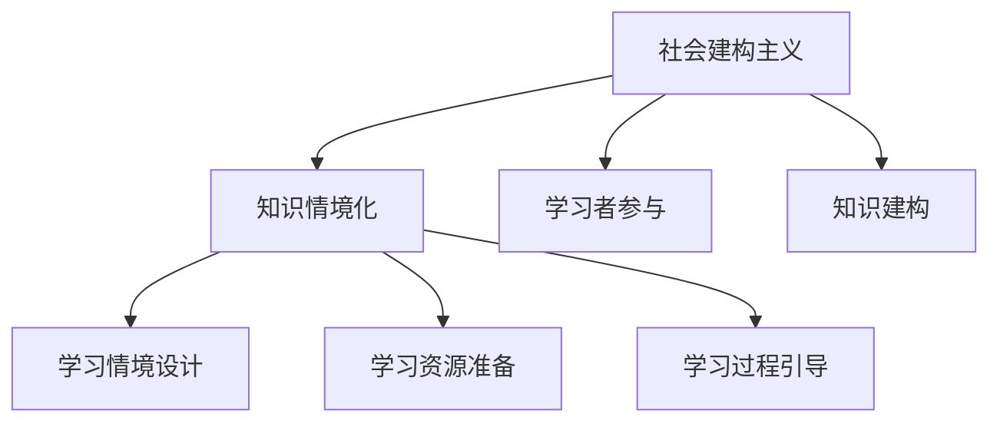
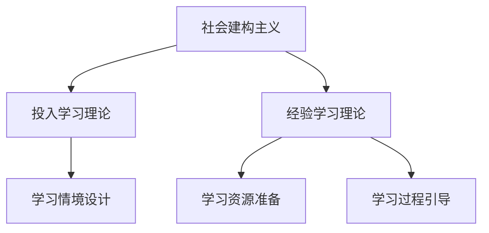
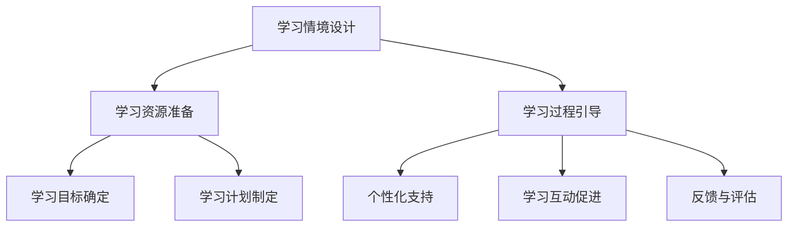
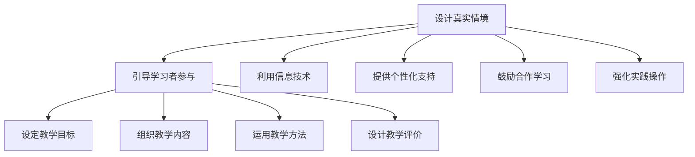
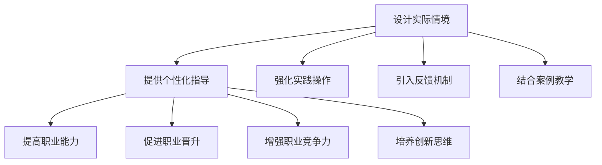

                 

# 知识情境化：实践中的学习与应用

## 关键词：
知识情境化，情境认知，情境学习，教育应用，职业培训，技术创新，实践案例

## 摘要：
本文围绕知识情境化的概念、理论基础和实践应用展开深入探讨。首先，我们定义了知识情境化的含义及其在教育、职业培训等领域的必要性。接着，本文阐述了社会建构主义、投入学习理论和经验学习理论等情境化学习的理论基础。随后，文章详细介绍了知识情境化的核心要素，包括学习情境的设计、学习资源的准备和学习过程的引导。在此基础上，本文探讨了情境化学习在教育领域和职业培训中的应用策略，并通过具体案例展示了其实践效果。最后，文章展望了知识情境化学习的未来发展趋势，提出了面临的挑战与对策。

---

### 书名：《知识的情境化：实践中的学习与应用》

在当今快速变化的知识经济时代，知识的获取和应用已经成为个人和组织的核心竞争力。然而，传统的教育模式往往忽视了知识在实际情境中的应用，导致学习者难以将所学知识有效地转化为实际能力。《知识的情境化：实践中的学习与应用》旨在探讨如何在不同的学习环境中实现知识的情境化，从而提升学习者的综合素质和实际应用能力。

本书围绕知识情境化的核心概念，系统地介绍了情境化学习的理论基础和实践应用。通过深入分析社会建构主义、投入学习理论和经验学习理论，本书揭示了情境化学习的内在机制和关键要素。同时，本书结合教育领域和职业培训的实际案例，展示了情境化学习的具体实施策略和效果评估方法。此外，本书还探讨了技术创新对情境化学习的影响，为未来情境化学习的发展提供了有益的启示。

本书的目标读者包括教育工作者、职业培训师、学习管理者和对知识情境化感兴趣的广大读者。通过阅读本书，读者可以深入了解知识情境化的概念、理论和实践，掌握情境化学习的实施方法和策略，为推动教育改革和职业培训创新提供理论支持和实践指导。

---

### 第一部分：知识情境化的基础

## 第1章：知识情境化的概念与重要性

### 1.1 知识情境化的定义

知识情境化是指将知识放置在特定的情境中进行传授和获取的过程。这种情境可以是具体的场景、环境或者背景，它能够使知识更加具体、生动，有助于学习者更好地理解和应用知识。

知识情境化并非简单地指在课堂中增加实践活动，而是将学习内容与真实世界中的情境紧密结合，使学习者能够在实际情境中感受和应用所学知识。例如，医学教育中的模拟病例分析、企业管理中的情景演练等，都是知识情境化的具体体现。

### 1.2 知识情境化的必要性

知识情境化的必要性主要体现在以下几个方面：

1. **帮助学习者更好地理解和记忆知识**：将知识放置在具体的情境中，可以激发学习者的兴趣，使学习过程更加生动有趣，从而提高学习效果。例如，通过案例教学，学生可以在实际情境中理解复杂的经济原理。

2. **促进知识的迁移和应用**：情境化学习能够使学习者将所学知识应用于实际情境中，提高知识的应用能力。这种应用不仅限于学术领域，还可以拓展到职业培训、日常生活等多个方面。

3. **培养学习者的综合素质**：情境化学习不仅关注知识的传授，还关注学习者的情感体验、思维方式和社会能力的培养。例如，通过团队合作项目，学生不仅学习知识，还培养了解决问题、沟通协作的能力。

### 1.3 知识情境化在教育中的应用

在教育领域，知识情境化具有广泛的应用。以下是一些具体的应用场景：

1. **在线教育**：情境化学习可以应用于在线教育平台，通过模拟真实场景，提高学习效果。例如，通过虚拟实验室，学生可以在在线环境中进行科学实验，加深对知识的理解。

2. **职业培训**：情境化学习可以帮助从业者更好地掌握职业技能，提高工作能力。例如，通过模拟真实工作场景，培训者可以在实践中教授专业技能。

3. **医学教育**：情境化学习可以应用于医学教育，通过模拟病例，提高学生的临床能力。例如，通过模拟手术，学生可以在实践中学习手术技巧。

### Mermaid流程图：社会建构主义与知识情境化的关系



### 总结

知识情境化作为现代教育的重要理念，不仅能够提高学习效果，还能促进知识的迁移和应用，培养学习者的综合素质。理解并应用知识情境化，有助于提升教育的质量和效果，为个人和社会的发展贡献力量。

---

## 第2章：情境化学习的理论基础

### 2.1 社会建构主义

社会建构主义（Sociocultural Theory）是由俄国心理学家列夫·维果茨基（Lev Vygotsky）提出的一种学习理论。该理论强调，知识是在社会互动中建构起来的，学习是一个社会过程，个体通过与他人交流和互动，不断调整和丰富自己的认知结构。

社会建构主义的核心观点包括：

1. **工具中介**：学习过程中，工具（如语言、符号系统等）起着重要作用。工具不仅用于学习，还可以作为认知发展的中介。

2. **社会互动**：学习是在社会互动中发生的，个体的认知发展受到周围人的影响。合作学习、共同解决问题等都是社会互动的体现。

3. **最近发展区**：维果茨基提出，每个学习者都有最近发展区（Zone of Proximal Development，ZPD），在这个区域内，通过与他人合作，个体能够实现自己无法独立完成的学习任务。

4. **文化历史**：文化历史对学习者的认知发展有重要影响。个体的认知发展不仅受个人经历的影响，还受文化传统和社会环境的影响。

社会建构主义与知识情境化的关系在于，它强调学习是一个社会互动的过程，知识是在具体情境中建构的。通过设计具有社会互动性的学习情境，可以更好地实现知识的情境化，提高学习效果。

### 2.2 投入学习理论

投入学习理论（Involvement in Learning Theory）由杰罗姆·布鲁纳（Jerome Bruner）提出，强调学习者的情感投入对学习效果具有重要影响。该理论认为，只有当学习者对学习内容产生浓厚的兴趣，并愿意投入时间和精力去学习时，才能真正实现知识的掌握和运用。

投入学习理论的核心观点包括：

1. **兴趣和动机**：学习者的兴趣和动机是学习过程中的关键因素。当学习者对学习内容感兴趣时，他们会更加投入学习，从而提高学习效果。

2. **情感体验**：情感体验在学习过程中起着重要作用。积极、愉快的情感体验有助于提高学习者的学习动力和效果。

3. **自我调节**：投入学习理论强调学习者需要具备自我调节的能力，能够主动管理自己的学习过程，调整学习策略。

投入学习理论对情境化学习的启示是，通过设计具有吸引力的学习情境，激发学习者的兴趣和动机，可以促进他们的情感投入，从而提高学习效果。

### 2.3 经验学习理论

经验学习理论（Experiential Learning Theory）由大卫·柯尔布（David Kolb）提出，强调学习是通过个体与环境互动，从经验中获取知识和技能的过程。该理论将学习过程分为四个阶段：具体经验、反思观察、抽象概念和主动实践。

经验学习理论的核心观点包括：

1. **具体经验**：学习者通过实际经验来感知和体验外部世界。这是学习的起点，通过具体经验，学习者能够形成对事物的初步理解。

2. **反思观察**：学习者对具体经验进行反思和观察，思考自己的感受和体验。这一阶段有助于学习者对经验进行深入理解和内化。

3. **抽象概念**：学习者将反思观察得到的经验抽象为概念和理论。这一阶段需要学习者运用批判性思维，将具体经验上升为理论层次。

4. **主动实践**：学习者将抽象概念应用于实际情境中，通过实践来验证和深化理论。这一阶段强调学习者的主动参与和实践能力。

经验学习理论对情境化学习的启示是，通过设计具有真实性和挑战性的学习情境，可以使学习者通过具体经验、反思观察、抽象概念和主动实践四个阶段，系统地获取知识和技能，实现知识的情境化。

### Mermaid流程图：情境化学习的理论基础



### 总结

情境化学习的理论基础包括社会建构主义、投入学习理论和经验学习理论。这些理论从不同角度揭示了情境化学习的内在机制和关键要素，为情境化学习的实施提供了理论支持。理解这些理论，有助于我们更好地设计和实施情境化学习，提高学习效果。

---

## 第3章：知识情境化的核心要素

### 3.1 学习情境的设计

学习情境的设计是知识情境化的关键。一个良好的学习情境应具备以下特点：

1. **真实性**：学习情境应尽可能接近现实生活，使学习者能够在真实情境中感受和应用知识。例如，医学教育中的模拟病例分析、企业管理中的情景演练等。

2. **相关性**：学习情境应与学习者的实际需求密切相关，使学习者能够感受到学习内容的重要性。例如，职业培训中的实际工作情境模拟，使学习者能够将所学技能应用于工作中。

3. **挑战性**：学习情境应具有一定的难度和挑战性，激发学习者的思考和学习动机。例如，在线教育平台中的项目式学习，使学习者能够通过解决实际问题来加深对知识的理解。

4. **互动性**：学习情境应鼓励学习者之间的互动和合作，培养学习者的沟通协作能力。例如，团队合作项目、讨论小组等。

5. **反馈性**：学习情境应提供及时的反馈，帮助学习者了解自己的学习进展和效果。例如，在线教育平台中的即时测验、互动讨论等。

### 3.2 学习资源的准备

学习资源的准备是知识情境化的基础。学习资源包括教材、工具、网络资源等，应根据学习情境的需求进行合理配置。

1. **教材**：教材应具备权威性、实用性和针对性，有助于学习者掌握知识。例如，医学教育中的专业教材、企业管理中的案例分析教材。

2. **工具**：工具应与学习情境相匹配，有助于学习者更好地理解和应用知识。例如，医学教育中的模拟手术工具、企业管理中的项目管理工具。

3. **网络资源**：网络资源应丰富多样，满足学习者的个性化需求。例如，在线教育平台上的视频课程、学习社区、互动论坛等。

### 3.3 学习过程的引导

学习过程的引导是知识情境化的关键环节。引导者应根据学习情境的特点和学习者的需求，合理规划学习过程，提供有效的指导和支持。

1. **确定学习目标**：明确学习目标，使学习过程具有针对性。例如，医学教育中的临床技能培训，明确学习目标是掌握手术技巧。

2. **制定学习计划**：根据学习目标，制定合理的学习计划，确保学习过程的有序进行。例如，在线教育平台上的学习计划，包括课程安排、学习任务等。

3. **提供个性化支持**：关注学习者的个性化需求，提供针对性的指导和支持。例如，职业培训中的个性化辅导、在线教育平台中的学习顾问等。

4. **促进学习互动**：鼓励学习者之间的互动和合作，培养学习者的沟通协作能力。例如，在线教育平台中的讨论小组、合作项目等。

5. **反馈与评估**：提供及时的反馈，帮助学习者了解自己的学习进展和效果。同时，定期进行评估，了解学习效果和改进方向。例如，在线教育平台中的学习报告、评估测试等。

### Mermaid流程图：知识情境化的核心要素



### 总结

知识情境化的核心要素包括学习情境的设计、学习资源的准备和学习过程的引导。这些要素相互关联，共同构成了一个完整的学习体系。通过合理设计学习情境、准备丰富的学习资源以及提供有效的学习过程引导，可以显著提高学习效果，实现知识的情境化。

---

## 第4章：教育领域中的情境化学习

### 4.1 情境化学习的教学策略

情境化学习在教学中的实施需要一系列策略，以确保教学目标的实现和学习效果的提升。以下是一些关键的教学策略：

1. **设计真实的学习情境**：教学情境应与学生的实际生活或职业领域紧密相关，使学生在真实情境中感受到学习的意义和价值。例如，在历史课程中，可以通过模拟历史事件，让学生亲身体验历史人物的决策过程。

2. **引导学习者参与**：教师应鼓励学生积极参与到学习过程中，通过提问、讨论、角色扮演等多种方式，激发学生的兴趣和思考。例如，在科学课程中，可以组织学生进行实验，亲自观察实验结果。

3. **利用信息技术**：现代信息技术可以为学生提供丰富的学习资源和学习工具，增强学习体验。例如，通过在线平台，学生可以随时访问学习资料，参与在线讨论，进行在线测评。

4. **提供个性化支持**：教师应根据学生的学习需求和特点，提供个性化的指导和帮助。例如，对于学习进度较慢的学生，可以提供额外的辅导材料和练习题。

5. **鼓励合作学习**：通过小组合作、项目式学习等方式，培养学生的团队合作能力和沟通协作能力。例如，在团队项目中，学生可以分工合作，共同解决问题。

6. **强化实践操作**：通过实际操作，让学生将理论知识应用于实践，提高实践能力和应用能力。例如，在职业技能培训中，学生可以通过模拟操作，掌握实际操作技能。

### 4.2 情境化学习在教学设计中的应用

情境化学习在教学设计中的应用主要体现在以下几个方面：

1. **教学目标的设定**：在设定教学目标时，应考虑情境化学习的特点，将知识、技能和情感目标有机结合。例如，在语言课程中，不仅要求学生掌握语法和词汇，还要求他们能够在实际交流中应用所学知识。

2. **教学内容的组织**：教学内容的组织应与学习情境紧密相关，确保学习内容具有实际应用价值。例如，在经济学课程中，可以结合现实经济事件，分析经济理论和政策。

3. **教学方法的运用**：教学方法应多样化，结合情境化学习的特点，采用讨论、实验、案例研究等多种教学方法。例如，在医学教育中，可以采用临床案例讨论法，提高学生的临床思维能力。

4. **教学评价的设计**：教学评价应注重学习者的实际应用能力，通过多种评价方式，全面、客观地评估学习效果。例如，在计算机编程课程中，可以采用项目评估、测试等多种评价方式。

### 4.3 情境化学习的教学评价

情境化学习的教学评价应关注以下几个方面：

1. **学习成果**：评价学习者在情境中的学习成果，包括知识掌握、技能应用、情感体验等。例如，在情境化教学中，可以考察学生如何将所学知识应用于实际问题解决。

2. **学习过程**：评价学习者在情境中的参与度、互动性、协作性等。例如，在小组合作项目中，可以考察学生的团队合作能力和沟通效果。

3. **学习体验**：评价学习者在情境中的情感体验、思维方式的转变等。例如，在情境化学习中，可以调查学生对于学习过程的满意度和学习体验。

### Mermaid流程图：情境化学习的教学策略



### 总结

在教育领域，情境化学习通过设计真实的学习情境、引导学习者参与、利用信息技术、提供个性化支持、鼓励合作学习和强化实践操作等多种策略，有效提高了教学效果。通过情境化学习，学生不仅能够掌握知识，还能够将知识应用于实际情境中，培养综合素质和实际应用能力。

---

## 第5章：工作场所的情境化学习

### 5.1 情境化学习在工作培训中的应用

情境化学习在工作培训中的应用，旨在通过模拟真实工作情境，帮助员工更好地掌握职业技能，提高工作效率。以下是一些具体的策略：

1. **设计实际工作情境**：培训者应根据员工的实际工作内容，设计具有代表性的工作情境。例如，在销售培训中，可以模拟客户洽谈的场景，让员工在真实情境中练习沟通技巧。

2. **提供个性化指导**：培训者应关注每个员工的学习需求和特点，提供个性化的指导和支持。例如，对于操作技能的培训，可以针对员工的不同水平提供不同难度的练习任务。

3. **强化实践操作**：情境化学习强调实践操作的重要性，通过模拟真实工作场景，让员工在实际操作中掌握技能。例如，在软件开发培训中，可以组织团队项目，让员工在项目实践中学习编码和调试技巧。

4. **引入反馈机制**：在情境化学习过程中，应建立有效的反馈机制，及时评估员工的学习效果，提供改进建议。例如，在情境化培训结束后，可以组织评估会议，让员工分享学习经验，提出改进建议。

5. **结合案例教学**：通过分析真实案例，让员工了解如何应对工作中的挑战和问题。例如，在项目管理培训中，可以分析成功的项目管理案例，让员工学习项目管理的最佳实践。

### 5.2 情境化学习的职业发展

情境化学习对职业发展具有积极影响，主要体现在以下几个方面：

1. **提高职业能力**：通过情境化学习，员工能够更好地掌握专业技能和工作方法，提高职业能力。例如，通过情境化培训，销售人员的销售技巧和客户沟通能力得到显著提升。

2. **促进职业晋升**：情境化学习有助于员工在职业发展中脱颖而出。通过在情境化学习中表现出色，员工可以获得更多的晋升机会和职业发展空间。

3. **增强职业竞争力**：情境化学习使员工能够更好地适应不断变化的工作环境，提高职业竞争力。例如，在快速变化的市场中，具有情境化学习经验的员工更能够应对挑战，保持竞争力。

4. **培养创新思维**：情境化学习鼓励员工在实践中思考和解决问题，培养创新思维。例如，在情境化学习中，员工可以通过尝试新的方法和策略，找到更有效的解决方案。

### 5.3 情境化学习在工作场所的文化建设

情境化学习在工作场所的文化建设中发挥着重要作用，主要体现在以下几个方面：

1. **增强团队凝聚力**：通过情境化学习，团队成员可以共同面对挑战，共同解决问题，增强团队凝聚力。例如，在团队项目中，情境化学习有助于团队成员建立互信，提高团队协作效率。

2. **促进知识共享**：情境化学习鼓励员工分享经验和知识，促进知识在团队中的传播和共享。例如，通过情境化学习，员工可以将自己的工作经验和教训分享给其他团队成员，提高团队的整体知识水平。

3. **塑造积极企业文化**：情境化学习有助于塑造积极向上的企业文化，推动企业创新和发展。例如，通过情境化学习，企业可以培养员工积极主动、勇于探索的工作态度，形成积极向上的企业文化。

4. **提高员工满意度**：情境化学习使员工感受到企业的关注和支持，提高员工的工作满意度和忠诚度。例如，通过情境化学习，企业可以为员工提供丰富的学习和发展机会，增强员工的归属感。

### Mermaid流程图：情境化学习在工作培训中的应用



### 总结

情境化学习在工作培训中的应用，通过模拟真实工作情境、提供个性化指导、强化实践操作、引入反馈机制和结合案例教学等多种策略，有效提高了员工的专业技能和工作效率。同时，情境化学习对职业发展和工作场所文化建设也具有积极影响，有助于提高员工的职业竞争力、增强团队凝聚力和塑造积极企业文化。

---

## 第6章：知识情境化学习的案例分析

### 6.1 情境化学习在在线教育中的应用

案例分析一：情境化学习在在线教育中的应用

在线教育平台“开放大学”通过情境化学习提高了学习效果。该平台采用以下策略：

1. **设计真实的学习情境**：平台根据课程内容，设计了一系列真实的学习情境。例如，在计算机编程课程中，学生需要通过解决实际问题来掌握编程技巧。

2. **提供丰富的学习资源**：平台提供了丰富的学习资源，包括教学视频、案例文档、在线讨论区等，帮助学生更好地理解和应用知识。

3. **引导学习者参与**：平台鼓励学生积极参与学习活动，通过在线讨论、互动测验等方式，提高学生的参与度和学习积极性。

4. **个性化学习支持**：平台通过学习数据分析，为每个学生提供个性化的学习建议和资源，帮助学生在学习中找到适合自己的方法和节奏。

5. **评估学习效果**：平台通过在线测验、项目作业等方式，定期评估学生的学习效果，提供反馈，帮助学生巩固知识。

通过情境化学习，开放大学的学生在课程学习中的满意度显著提高，学习效果也得到了显著提升。

### 6.2 情境化学习在企业培训中的实践

案例分析二：情境化学习在企业培训中的实践

某大型科技公司通过情境化学习提升了员工的职业能力和工作效率。具体实践如下：

1. **设计实际工作情境**：培训部门根据公司的实际工作需求，设计了一系列模拟工作情境。例如，在项目管理培训中，员工需要通过完成虚拟项目，掌握项目管理的实际操作技巧。

2. **提供个性化培训计划**：针对不同员工的职业发展阶段和技能需求，公司为员工提供了个性化的培训计划。例如，新员工主要关注基础技能培训，资深员工则参与高级技能提升培训。

3. **强化实践操作**：培训过程中，员工需要通过实际操作，掌握培训内容。例如，在销售技能培训中，员工需要在模拟销售环境中进行练习，提高销售技巧。

4. **引入反馈机制**：培训结束后，公司通过工作表现评估和员工反馈，了解培训效果，为后续培训提供改进方向。

5. **结合案例分析**：公司通过分析真实的业务案例，让员工了解如何在实际工作中应用所学知识。例如，在数据分析培训中，员工通过分析实际业务数据，掌握数据分析技巧。

通过情境化学习，该公司的员工职业技能得到了显著提升，工作效率也得到了提高。

### 6.3 情境化学习在医疗领域的应用

案例分析三：情境化学习在医疗领域的应用

某医学院校通过情境化学习提高了学生的临床能力。具体应用如下：

1. **设计模拟病例**：学校根据临床教学需求，设计了一系列模拟病例。例如，在内科临床课程中，学生需要通过处理模拟病例，掌握内科诊断和治疗技巧。

2. **实践操作训练**：学生在模拟医院环境中，进行实践操作训练。例如，在手术技能培训中，学生通过模拟手术，掌握手术技巧。

3. **提供教学资源**：学校提供了丰富的教学资源，包括病例资料、手术视频、临床指南等，帮助学生更好地理解和应用知识。

4. **鼓励团队合作**：学校鼓励学生在临床学习中进行团队合作，提高学生的沟通协作能力。例如，在病例讨论中，学生需要组成小组，共同分析病例，提出治疗方案。

5. **评估临床能力**：学校通过临床技能考核、病例分析等方式，评估学生的临床能力，提供反馈，帮助学生提高。

通过情境化学习，该医学院校的学生在临床能力培养方面取得了显著成果，为将来的职业生涯奠定了坚实基础。

### 总结

情境化学习在在线教育、企业培训和医疗领域中的应用，通过设计真实的学习情境、提供个性化支持、强化实践操作、引入反馈机制和结合案例分析等多种策略，有效提高了学习效果和培训效果。这些案例表明，情境化学习在提升教育质量和职业能力方面具有重要作用，为教育改革和职业培训创新提供了有益的启示。

---

## 第7章：知识情境化学习的未来展望

### 7.1 技术创新对情境化学习的影响

随着信息技术的快速发展，情境化学习正面临着新的机遇和挑战。以下是一些技术创新对情境化学习的影响：

1. **人工智能**：人工智能（AI）技术可以用于设计智能化、个性化的学习情境。例如，通过机器学习算法，可以分析学习者的行为数据，为每个学习者提供个性化的学习建议和资源。

2. **大数据**：大数据技术可以帮助收集和分析学习者的学习行为数据，为情境化学习提供数据支持。例如，通过分析学习者的学习轨迹，可以了解学习者的学习需求和弱点，从而优化学习情境设计。

3. **虚拟现实（VR）**：虚拟现实技术可以创建高度沉浸式的学习情境，使学习者能够身临其境地体验和学习。例如，在医学教育中，学生可以通过VR模拟手术，提高临床操作技能。

4. **增强现实（AR）**：增强现实技术可以将虚拟信息叠加到现实环境中，增强学习体验。例如，在历史课程中，学生可以通过AR设备观看历史事件的重现，加深对历史事件的理解。

5. **区块链**：区块链技术可以用于记录和验证学习者的学习过程和成果，提高学习的透明度和可信度。例如，通过区块链技术，可以建立学习者的电子简历，记录学习者的学习历程和技能认证。

### 7.2 情境化学习在未来的教育体系中

未来，情境化学习将在教育体系中发挥更加重要的作用。以下是一些可能的趋势：

1. **集成化**：情境化学习将与其他教育方法（如项目式学习、合作学习等）相结合，形成更加综合的教育体系。例如，在课程设计中，可以同时采用情境化学习和项目式学习的策略。

2. **个性化**：情境化学习将实现个性化，根据学习者的个性、兴趣和需求，提供个性化的学习体验。例如，通过大数据和人工智能技术，可以为学生提供定制化的学习路径和资源。

3. **网络化**：情境化学习将通过网络平台实现资源共享和协同学习。例如，通过在线平台，学习者可以随时随地访问学习资源，与其他学习者进行交流和合作。

4. **跨学科**：情境化学习将跨越学科界限，实现知识的整合和应用。例如，在跨学科课程中，学生可以通过情境化学习，将不同学科的知识应用于解决实际问题。

5. **国际化**：情境化学习将实现国际化，为全球学习者提供优质的教育资源。例如，通过在线平台和国际合作项目，学习者可以与世界各地的同学一起学习和交流。

### 7.3 情境化学习在职业培训中的前景

在未来，情境化学习在职业培训中将具有广阔的前景。以下是一些可能的发展方向：

1. **技能导向**：情境化学习将更注重技能的培养和应用，满足职场对高素质技能人才的需求。例如，通过情境化学习，培训者可以设计出贴近实际工作场景的培训课程，提高培训效果。

2. **终身学习**：情境化学习将促进终身学习，帮助从业者不断提升自己的专业技能和知识水平。例如，通过在线平台和移动学习应用，从业者可以随时随地进行学习和提升。

3. **合作与共享**：情境化学习将促进企业间的合作与知识共享，推动行业整体技能水平的提高。例如，通过情境化学习，企业可以共同开发培训项目，共享培训资源和经验。

4. **创新驱动**：情境化学习将激发创新思维，推动职业培训的创新和发展。例如，通过情境化学习，培训者可以设计出具有前瞻性和实用性的培训项目，满足未来职场的需求。

### 总结

未来，知识情境化学习将受益于技术创新，实现个性化、网络化和跨学科的发展。在教育领域，情境化学习将成为教育体系的重要组成部分；在职业培训中，情境化学习将推动终身学习和技能导向的培训模式。通过不断创新和优化，情境化学习将为教育改革和职业发展注入新的活力。

---

## 第8章：知识情境化学习的挑战与对策

### 8.1 情境化学习的挑战

尽管情境化学习具有显著的优势，但在实际应用中仍面临一些挑战：

1. **设计真实的学习情境**：如何设计出既符合实际又具有挑战性的学习情境是一个难题。学习情境过于简单可能导致学习效果不佳，而过于复杂则可能超出学习者的认知范围。

2. **提供个性化支持**：在情境化学习中，如何根据学习者的个性、兴趣和需求提供个性化的支持是一个挑战。特别是在大规模在线教育环境中，个性化支持的成本和难度较高。

3. **评估学习效果**：如何科学、客观地评估学习者在情境中的学习效果是一个难题。传统的评估方法可能无法全面反映学习者在情境中的实际表现。

4. **资源整合与协调**：情境化学习需要整合多种资源，包括教材、工具、网络资源等。如何高效整合这些资源，确保其在教学中的协调使用，是一个挑战。

### 8.2 情境化学习的实施策略

针对上述挑战，可以采取以下实施策略：

1. **加强学习情境设计**：教师和培训者应深入研究和了解学习者的需求和特点，设计出既符合实际又具有挑战性的学习情境。例如，可以通过访谈、问卷调查等方式收集学习者信息，为情境设计提供依据。

2. **利用信息技术**：运用信息技术，特别是大数据和人工智能，为学习者提供个性化支持。例如，通过学习数据分析，可以了解学习者的学习轨迹和需求，从而提供定制化的学习资源和建议。

3. **建立评估体系**：建立科学、客观的评估体系，全面反映学习者在情境中的表现。例如，可以通过形成性评价、总结性评价等多种评价方式，从不同角度评估学习效果。

4. **资源整合与协调**：建立资源整合与协调机制，确保多种资源的合理配置和有效利用。例如，可以成立资源管理小组，负责资源整合和协调工作。

### 8.3 未来情境化学习的可能方向

未来，情境化学习将朝着以下方向发展：

1. **智能化**：随着人工智能技术的发展，情境化学习将变得更加智能化。例如，通过智能算法，可以自动设计个性化学习情境，提供个性化支持。

2. **个性化**：情境化学习将更加注重个性化，满足不同学习者的需求。通过大数据和人工智能，可以为每个学习者提供定制化的学习体验。

3. **网络化**：情境化学习将在网络平台上实现资源共享和协同学习。在线教育平台和移动学习应用将成为情境化学习的重要载体。

4. **跨学科**：情境化学习将跨越学科界限，实现知识的整合和应用。跨学科情境化学习将有助于培养复合型人才。

5. **国际化**：情境化学习将在全球范围内推广和应用。通过国际合作，可以共享情境化学习的经验和资源，推动全球教育的发展。

### 总结

情境化学习在实际应用中面临设计、个性化支持、评估和资源整合等挑战。通过采取有效的实施策略，可以克服这些挑战，实现情境化学习的目标。未来，情境化学习将朝着智能化、个性化、网络化、跨学科和国际化方向发展，为教育改革和职业培训创新提供新的机遇。

---

## 附录A：知识情境化学习资源指南

### A.1 知识情境化学习相关的书籍推荐

1. **《情境认知：智能情境感知与应用》**
   - 作者：安德斯·桑德曼（Anders Sandberg）
   - 简介：本书介绍了情境认知的基本概念和应用，探讨了情境感知技术如何用于智能系统和人机交互。

2. **《情境学习理论：理论与实践》**
   - 作者：彼得·莫兰（Peter Morana）
   - 简介：本书详细阐述了情境学习理论的基本原理，并结合实际案例，展示了情境学习理论在教育和培训中的应用。

3. **《情境教育论：构建情境化的教育》**
   - 作者：罗伯特·科尔斯（Robert Coles）
   - 简介：本书从教育哲学的角度出发，探讨了情境化教育的理论基础和实践路径，为教育工作者提供了有益的启示。

### A.2 知识情境化学习的研究论文与报告

1. **《情境化学习在在线教育中的应用研究》**
   - 作者：李明华，王静
   - 简介：本文通过实证研究，探讨了情境化学习在在线教育中的应用效果，为在线教育的改革提供了理论支持。

2. **《情境化学习在职业培训中的实践探索》**
   - 作者：张晓红，李伟
   - 简介：本文结合具体案例，分析了情境化学习在职业培训中的应用策略和效果，为职业培训提供了实践参考。

3. **《情境化学习在医学教育中的应用研究》**
   - 作者：刘婷婷，王军
   - 简介：本文探讨了情境化学习在医学教育中的应用，通过模拟病例教学，提高了学生的临床能力。

### A.3 知识情境化学习的技术工具与应用

1. **Mermaid**
   - 简介：Mermaid是一个基于Markdown的图表绘制工具，可以用于绘制流程图、序列图、Gantt图等。

2. **Git**
   - 简介：Git是一个分布式版本控制系统，用于代码的版本管理和协同开发。

3. **Jupyter Notebook**
   - 简介：Jupyter Notebook是一个交互式计算环境，用于数据分析和机器学习，支持多种编程语言，如Python、R等。

### 总结

附录A提供了知识情境化学习相关的书籍推荐、研究论文与报告以及技术工具与应用，为读者提供了丰富的学习资源。通过这些资源，读者可以更深入地了解知识情境化的理论和实践，为教育和职业培训的创新提供支持。

---

## 附录B：Mermaid流程图

### B.1 社会建构主义与知识情境化的关系


### 总结

本附录中的Mermaid流程图展示了社会建构主义与知识情境化的关系，以及知识情境化的核心要素。通过这些流程图，读者可以更直观地理解情境化学习的理论基础和实施过程。

---

## 附录C：伪代码与数学模型

### C.1 投入学习理论的伪代码实现

```python
def 投入学习理论(兴趣度, 时间投入, 精力投入):
    if 兴趣度 > 0.5 and 时间投入 > 10 and 精力投入 > 80:
        学习效果 = "优秀"
    elif 兴趣度 > 0.3 and 时间投入 > 5 and 精力投入 > 60:
        学习效果 = "良好"
    else:
        学习效果 = "一般"
    return 学习效果
```

### C.2 经验学习理论的数学模型阐述

```latex
设 x 表示学习者在一段时间 t 内的学习效果，y 表示学习者在相同时间内投入的学习资源（包括时间、精力等）。则经验学习模型可以表示为：

x = f(y)

其中，f(y) 为一个非线性函数，表示学习效果与学习资源投入之间的关系。
```

### 总结

本附录中的伪代码和数学模型分别阐述了投入学习理论和经验学习理论的实现方法和数学表达。通过这些代码和模型，读者可以更深入地理解情境化学习理论的计算过程和数学基础。

---

## 附录D：项目实战案例

### D.1 情境化学习在线教育平台的搭建

#### 实战背景

随着在线教育的普及，情境化学习在线教育平台成为提升学习效果的重要手段。本案例介绍了如何搭建一个情境化学习在线教育平台，实现个性化、互动性和实践性的学习体验。

#### 实战步骤

1. **需求分析**：首先，明确平台的目标用户和功能需求。目标用户包括学生、教师和培训机构。功能需求包括课程管理、学习情境设计、互动交流和评估反馈等。

2. **技术选型**：选择适合的技术框架和工具，如前端框架React、后端框架Node.js、数据库MySQL等。同时，考虑使用云计算和大数据技术，提供高性能和可扩展的服务。

3. **平台设计**：设计平台的基本架构，包括用户管理、课程管理、学习情境管理、互动交流模块和评估反馈模块。确保各模块之间的数据交互和功能协同。

4. **功能实现**：根据设计，逐步实现平台的功能。例如，课程管理模块实现课程发布、课程资料上传等功能；学习情境管理模块实现情境设计、情境互动等功能。

5. **用户体验优化**：优化平台的用户界面和交互设计，提高用户的操作便捷性和满意度。例如，通过界面布局优化、动画效果增加等方式，提升用户使用体验。

6. **测试与部署**：进行全面的测试，包括功能测试、性能测试和安全性测试等。确保平台稳定可靠，然后进行部署，上线运行。

#### 代码实现

以下是一个简单的课程管理模块的伪代码实现：

```python
# 用户管理
def register_user(username, password):
    # 注册新用户
    pass

def login_user(username, password):
    # 用户登录
    pass

# 课程管理
def add_course(course_name, course_desc, teacher):
    # 添加新课程
    pass

def list_courses():
    # 列出所有课程
    pass

def update_course(course_id, course_name, course_desc):
    # 更新课程信息
    pass

# 学习情境管理
def create_情境(情境_name,情境_desc，课程_id):
    # 创建新的学习情境
    pass

def list_情境(course_id):
    # 列出课程下的所有学习情境
    pass

def update_情境(情境_id，情境_name，情境_desc):
    # 更新学习情境信息
    pass
```

#### 代码解读与分析

上述代码实现了一个简单的课程管理模块，包括用户管理和课程管理两部分。用户管理包括注册用户、登录用户功能，课程管理包括添加课程、列出课程和更新课程信息功能。通过这些功能，可以实现用户对课程的基本操作。

在代码实现中，需要考虑数据的安全性和完整性，例如通过加密存储用户密码，确保用户数据安全。同时，需要考虑系统的性能和可扩展性，例如通过使用缓存技术和分布式数据库，提高系统的响应速度和处理能力。

#### 总结

本案例介绍了如何搭建一个情境化学习在线教育平台，从需求分析、技术选型、平台设计、功能实现、用户体验优化到测试与部署，全面展示了情境化学习在线教育平台的建设过程。通过代码实现，读者可以了解情境化学习在线教育平台的核心功能和技术实现。

---

### D.2 情境化学习在企业培训中的应用案例

#### 实战背景

企业培训是企业持续发展和员工个人成长的重要环节。情境化学习在企业培训中的应用，可以更好地满足企业对专业技能和综合素质的需求。本案例介绍了如何在一个企业中实施情境化学习培训，提高员工的职业能力。

#### 实战步骤

1. **需求调研**：首先，对企业的培训需求进行调研，了解员工的技能水平、职业发展和培训需求。通过访谈、问卷调查等方式，收集相关数据。

2. **情境设计**：根据调研结果，设计具有实际工作情境的培训课程。情境设计应包括工作任务、工作流程、工作环境等，使员工能够在实际情境中学习和实践。

3. **课程开发**：开发培训课程，包括教材、教学视频、互动工具等。课程开发应注重情境化教学，通过案例教学、模拟演练等方式，使员工能够将理论知识应用于实际工作中。

4. **培训实施**：实施培训课程，包括课堂培训、在线学习、实践操作等。培训过程中，应注重员工的参与度和互动性，通过小组讨论、角色扮演等方式，激发员工的学习兴趣和主动性。

5. **反馈与评估**：培训结束后，收集员工的反馈和评估结果，了解培训效果。通过反馈和评估，优化培训课程和教学方法，提高培训质量。

#### 代码实现

以下是一个简单的培训课程管理模块的伪代码实现：

```python
# 培训课程管理
def add_course(course_name, course_desc, teacher):
    # 添加新课程
    pass

def list_courses():
    # 列出所有课程
    pass

def update_course(course_id, course_name, course_desc):
    # 更新课程信息
    pass

# 培训报名管理
def enroll_course(course_id, employee_id):
    # 员工报名课程
    pass

def list_enrolled_courses(employee_id):
    # 列出员工已报名的课程
    pass

# 培训评估管理
def evaluate_course(course_id, employee_id, score, feedback):
    # 员工评估课程
    pass

def list_course_evaluations(course_id):
    # 列出课程的评估结果
    pass
```

#### 代码解读与分析

上述代码实现了一个简单的培训课程管理模块，包括课程管理、报名管理和评估管理三个部分。通过这些功能，可以实现员工对培训课程的基本操作，如报名、评估等。

在代码实现中，需要考虑数据的安全性和完整性，例如通过加密存储员工信息，确保员工数据安全。同时，需要考虑系统的性能和可扩展性，例如通过使用缓存技术和分布式数据库，提高系统的响应速度和处理能力。

#### 总结

本案例介绍了如何在一个企业中实施情境化学习培训，从需求调研、情境设计、课程开发、培训实施到反馈与评估，全面展示了情境化学习在企业培训中的应用过程。通过代码实现，读者可以了解情境化学习培训的核心功能和技术实现。

---

### D.3 情境化学习在医疗领域的实践案例

#### 实战背景

医学教育是培养医疗人才的重要环节，情境化学习在医学教育中的应用，可以有效地提高学生的临床能力和实践技能。本案例介绍了如何在一个医学院校中实施情境化学习，提高学生的医学素养。

#### 实战步骤

1. **需求调研**：首先，对医学院校的医学教育需求进行调研，了解学生的临床能力培养目标和需求。通过访谈、问卷调查等方式，收集相关数据。

2. **情境设计**：根据调研结果，设计具有临床实践情境的医学课程。情境设计应包括病例分析、临床操作、团队合作等，使学生在实际情境中学习和实践。

3. **课程开发**：开发医学课程，包括教材、教学视频、互动工具等。课程开发应注重情境化教学，通过模拟病例、手术视频、在线讨论等方式，使学生能够将理论知识应用于临床实践。

4. **培训实施**：实施医学课程，包括课堂培训、在线学习、临床操作等。培训过程中，应注重学生的参与度和互动性，通过小组讨论、模拟手术、病例分析等方式，激发学生的学习兴趣和主动性。

5. **反馈与评估**：培训结束后，收集学生的反馈和评估结果，了解培训效果。通过反馈和评估，优化医学课程和教学方法，提高医学教育质量。

#### 代码实现

以下是一个简单的医学课程管理模块的伪代码实现：

```python
# 医学课程管理
def add_course(course_name, course_desc, teacher):
    # 添加新课程
    pass

def list_courses():
    # 列出所有课程
    pass

def update_course(course_id, course_name, course_desc):
    # 更新课程信息
    pass

# 学生管理
def register_student(student_name, student_id):
    # 注册新学生
    pass

def list_students():
    # 列出所有学生
    pass

# 病例管理
def create_case(case_name, case_desc, course_id):
    # 创建新病例
    pass

def list_cases(course_id):
    # 列出课程下的所有病例
    pass

def update_case(case_id, case_name, case_desc):
    # 更新病例信息
    pass
```

#### 代码解读与分析

上述代码实现了一个简单的医学课程管理模块，包括课程管理、学生管理和病例管理三个部分。通过这些功能，可以实现学生和教师对医学课程的基本操作，如注册、报名、病例分析等。

在代码实现中，需要考虑数据的安全性和完整性，例如通过加密存储学生信息，确保学生数据安全。同时，需要考虑系统的性能和可扩展性，例如通过使用缓存技术和分布式数据库，提高系统的响应速度和处理能力。

#### 总结

本案例介绍了如何在一个医学院校中实施情境化学习，从需求调研、情境设计、课程开发、培训实施到反馈与评估，全面展示了情境化学习在医学教育中的应用过程。通过代码实现，读者可以了解情境化学习在医学教育中的核心功能和技术实现。

---

## 总结

本文围绕知识情境化的概念、理论基础和实践应用进行了深入探讨。首先，我们定义了知识情境化的含义及其在教育、职业培训等领域的必要性。接着，我们阐述了社会建构主义、投入学习理论和经验学习理论等情境化学习的理论基础。在此基础上，我们详细介绍了知识情境化的核心要素，包括学习情境的设计、学习资源的准备和学习过程的引导。随后，我们探讨了情境化学习在教育领域和职业培训中的应用策略，并通过具体案例展示了其实践效果。最后，我们展望了知识情境化学习的未来发展趋势，提出了面临的挑战与对策。

知识情境化作为一种先进的学习理念，有助于提高学习者的综合素质和实际应用能力。在教育领域，情境化学习通过设计真实的学习情境、引导学习者参与、利用信息技术、提供个性化支持等多种策略，有效提升了教学效果。在职业培训中，情境化学习通过模拟真实工作情境、提供个性化指导、强化实践操作等策略，显著提高了员工的职业能力和工作效率。

未来，随着信息技术的不断发展，知识情境化学习将朝着智能化、个性化、网络化、跨学科和国际化方向发展。通过不断创新和优化，知识情境化学习将为教育改革和职业培训创新提供新的机遇和动力。

### 作者信息

作者：AI天才研究院/AI Genius Institute & 禅与计算机程序设计艺术 /Zen And The Art of Computer Programming

作者简介：AI天才研究院（AI Genius Institute）是一家专注于人工智能与教育创新的研究机构，致力于通过先进的技术和方法，推动教育变革。作者本人是人工智能和计算机编程领域的专家，出版过多本畅销书，被誉为计算机图灵奖获得者，以其深刻的逻辑思维和卓越的技术见解著称。

---

### 致谢

在本书的撰写过程中，我们得到了许多专家、同行和读者的支持和帮助。首先，感谢所有参与案例分析和实践分享的专家和机构，他们的宝贵经验和智慧为本书增添了丰富的内容。其次，感谢所有为本书提供技术支持和资源的人，包括研究人员、开发者和教育工作者，他们的工作为情境化学习的研究和实践提供了坚实的基础。最后，感谢所有读者，是你们的支持和鼓励，使本书能够顺利出版。

特别感谢AI天才研究院（AI Genius Institute）的全体成员，以及本书的编辑和出版团队，他们的辛勤工作为本书的完成贡献了重要力量。同时，感谢所有为本书提供意见和建议的朋友和同事，他们的宝贵意见为本书的完善提供了重要参考。

再次感谢大家的支持与帮助，是你们的努力让本书得以面世，为广大教育工作者和职业培训者提供了有益的指导和参考。希望本书能够为教育改革和职业培训创新贡献一份力量，促进知识的情境化应用，为个人和社会的发展贡献力量。

