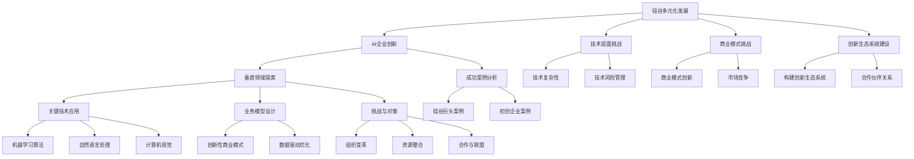

                 

### 第一部分：硅谷多元化发展背景

硅谷，这片科技创新的沃土，自20世纪中叶以来，凭借其独特的创新生态系统、丰富的资源和持续的创业精神，成为了全球科技创新的代名词。随着科技的发展和产业的不断升级，硅谷的多元化发展也成为一个不可忽视的趋势。本部分将深入探讨硅谷多元化发展的背景、意义及其对科技、经济和社会的深远影响。

#### 第1章：硅谷多元化发展的概述

##### 1.1 硅谷多元化发展的背景与意义

###### 1.1.1 硅谷多元化发展的历史脉络

硅谷的起源可以追溯到20世纪50年代，当时它是美国半导体行业的发源地。随着英特尔、惠普、苹果等科技巨头的崛起，硅谷逐渐成为了全球科技创新的中心。然而，硅谷的发展并非一帆风顺，它也经历了从单一产业主导到多元化发展的转型。

- **硅谷的起源与发展历程**：硅谷的起源可以追溯到1950年代，当时的斯坦福大学和加州理工学院成为了科技创新的重要基地。随着半导体行业的兴起，硅谷逐渐成为全球半导体产业的中心。1980年代，随着个人电脑的普及，硅谷迎来了第二次发展高潮。进入21世纪，互联网、人工智能、生物科技等新兴技术使得硅谷再次焕发出勃勃生机。
- **硅谷多元化的演进过程**：硅谷的多元化发展可以分为几个阶段。首先是产业多元化，即从单一的半导体产业扩展到互联网、人工智能、生物科技等多个领域。其次是地域多元化，硅谷的影响力逐渐扩展到旧金山、圣克拉拉等周边地区。最后是人才和文化的多元化，吸引了来自全球各地的顶尖人才，形成了开放、创新的文化氛围。

###### 1.1.2 多元化发展的定义与特征

多元化发展是指在一个特定区域或企业中，通过引入新的产业、技术和文化元素，实现产业、技术和文化的多样化，从而提升整体的竞争力和创新能力。

- **多元化发展的定义**：多元化发展是一种战略，通过在原有基础上引入新的元素，实现整体结构的优化和提升。
- **多元化发展的关键特征**：多元化发展的关键特征包括产业多元化、地域多元化和人才文化多元化。产业多元化是指在不同领域发展不同的产业，实现多元化收入和业务模式。地域多元化是指将业务扩展到不同的地区，实现地域风险的分散。人才文化多元化是指吸引和培养来自不同背景的人才，形成开放、包容的文化氛围。

###### 1.1.3 多元化发展对硅谷的深远影响

多元化发展对硅谷的影响是深远而全面的，涵盖了经济、科技和社会文化等多个方面。

- **经济层面的影响**：多元化发展使得硅谷的经济结构更加稳定，减少了单一产业带来的风险。同时，多元化的发展吸引了更多的投资和人才，进一步推动了经济的繁荣。
- **科技创新的影响**：多元化发展促进了不同领域技术的交叉融合，催生了大量的创新成果。例如，人工智能、生物科技和互联网技术的融合，推动了智能医疗、智能交通等新兴领域的发展。
- **社会文化的影响**：多元化发展带来了不同文化背景的人才，丰富了硅谷的社会文化氛围。这种多元化的文化氛围，不仅促进了创新思维的碰撞，也增强了社区的凝聚力。

通过以上分析，我们可以看出，硅谷多元化发展不仅是一种战略选择，更是其持续创新和繁荣的重要动力。在未来的发展中，硅谷将继续保持其多元化的特点，推动科技创新和社会进步。

#### 第2章：AI企业创新与多元化发展

随着人工智能（AI）技术的飞速发展，AI企业成为了硅谷多元化发展的重要力量。本章节将探讨AI企业在硅谷的创新环境、面临的挑战与机遇，以及成功企业的案例分析。

##### 2.1 AI企业在硅谷的创新环境

###### 2.1.1 硅谷的AI生态系统

硅谷在AI领域具有得天独厚的资源与优势，形成了完善的AI生态系统。

- **资源与优势**：硅谷拥有世界顶级的研究机构、大学和实验室，如斯坦福大学、加州理工学院和伯克利大学等，这些机构在AI领域的研究成果为AI企业提供了强大的技术支持。此外，硅谷还拥有丰富的创业资本，为AI企业提供了充足的资金支持。
- **AI企业的竞争态势**：硅谷的AI企业竞争激烈，但同时也存在合作与共赢的机会。大型科技公司与初创企业共同推动着AI技术的发展，形成了良性竞争的局面。

###### 2.1.2 AI企业创新的挑战与机遇

AI企业创新面临诸多挑战，但同时也伴随着巨大的机遇。

- **技术创新的挑战**：AI技术发展迅速，企业需要持续投入大量资源进行技术创新。此外，AI技术的复杂性和不确定性也给企业带来了挑战。
- **商业模式的创新**：传统的商业模式可能无法适应AI技术的变革，企业需要探索新的商业模式来适应市场变化。例如，AI企业可以通过提供定制化的解决方案、数据服务等方式，实现商业模式的创新。
- **资本市场的机遇**：AI技术的快速发展吸引了大量风险投资和资本市场的关注，为企业提供了巨大的融资机会。例如，谷歌、微软等科技巨头通过收购AI初创企业，进一步扩展了其在AI领域的业务。

###### 2.1.3 硅谷AI企业的成功案例分析

硅谷的AI企业成功案例丰富多样，以下是一些具有代表性的案例。

- **谷歌AI创新案例**：谷歌通过收购和自主研发，建立了强大的AI团队，并在语音识别、图像识别、自然语言处理等领域取得了重要突破。谷歌的AI技术广泛应用于搜索引擎、智能助手等产品中，提升了用户体验和业务价值。
- **特斯拉AI创新案例**：特斯拉在自动驾驶、能源管理等领域利用AI技术，实现了技术创新和商业模式创新。特斯拉的自动驾驶技术通过不断优化，提高了行驶安全性，吸引了大量用户。同时，特斯拉的能源管理技术也为电动汽车提供了高效的解决方案。

通过以上分析，我们可以看出，硅谷的AI企业在创新环境中不断探索，通过技术创新和商业模式创新，实现了多元化发展。在未来的发展中，AI企业将继续发挥重要作用，推动硅谷的科技创新和社会进步。

### 第二部分：AI企业垂直领域探索

在硅谷多元化发展的背景下，AI企业不断探索新的垂直领域，寻求独特的价值创造。本部分将分析垂直领域AI创新的趋势、关键技术以及业务模型，以揭示AI企业如何在特定领域实现创新。

#### 第3章：AI企业垂直领域探索

##### 3.1 垂直领域AI创新的趋势

垂直领域AI创新是指AI技术在特定行业或领域的应用，通过解决行业痛点，提升业务效率和创新能力。以下是一些垂直领域AI创新的趋势。

###### 3.1.1 垂直领域AI创新的定义与分类

垂直领域AI创新的定义是指将人工智能技术应用于特定的行业或领域，通过技术革新和业务模式创新，实现行业效率和价值的提升。

- **定义**：垂直领域AI创新是将AI技术与行业需求紧密结合，通过技术创新和业务模式创新，解决行业痛点，提升业务效率和创新能力。
- **分类**：垂直领域AI创新可以根据应用场景和领域进行分类，常见的垂直领域包括健康医疗、金融科技、智能制造、交通运输、智慧城市等。

###### 3.1.2 垂直领域AI创新的案例分析

在垂直领域AI创新中，一些行业已经取得了显著的成果。

- **健康医疗领域AI创新案例**：通过AI技术，可以实现对疾病诊断、治疗方案推荐、药物研发等环节的优化。例如，IBM的Watson for Health利用AI技术提供个性化治疗方案，提高了医疗效率和治疗效果。
- **金融科技领域AI创新案例**：AI技术在金融领域的应用包括风险控制、智能投顾、信用评估等。例如，PayPal利用AI技术进行风险控制，提高了交易的安全性和效率。

##### 3.2 垂直领域AI创新的关键技术

垂直领域AI创新需要依托一系列关键技术的支持，包括机器学习、自然语言处理、计算机视觉等。

###### 3.2.1 机器学习与深度学习在垂直领域应用

机器学习和深度学习是AI技术的核心，其在垂直领域的应用具有广泛的前景。

- **机器学习在垂直领域应用**：机器学习可以应用于数据挖掘、预测分析等场景。例如，在金融领域，机器学习可以用于信用评估、风险预测等。
- **深度学习在垂直领域应用**：深度学习在图像识别、语音识别、自然语言处理等领域具有强大的能力。例如，在医疗领域，深度学习可以用于疾病诊断、医学图像分析等。

###### 3.2.2 自然语言处理与语音识别

自然语言处理和语音识别是AI技术的关键领域，其在垂直领域的应用具有重要作用。

- **NLP在垂直领域应用**：自然语言处理可以应用于智能客服、智能文档处理、智能翻译等场景。例如，在金融领域，智能客服可以通过NLP技术提供高效的客户服务。
- **语音识别在垂直领域应用**：语音识别可以应用于智能语音助手、智能语音识别系统等场景。例如，在医疗领域，智能语音助手可以帮助医生快速记录病历，提高工作效率。

###### 3.2.3 计算机视觉与图像处理

计算机视觉和图像处理是AI技术的重要分支，其在垂直领域的应用具有广泛的前景。

- **CV在垂直领域应用**：计算机视觉可以应用于人脸识别、图像识别、视频监控等场景。例如，在安全领域，人脸识别技术可以用于安全监控和身份验证。
- **图像处理在垂直领域应用**：图像处理可以应用于医学图像分析、工业检测、卫星遥感等场景。例如，在医学领域，图像处理技术可以用于疾病诊断和治疗方案推荐。

##### 3.3 垂直领域AI创新的业务模型

垂直领域AI创新不仅需要关键技术的支持，还需要创新的业务模式来推动业务发展。

###### 3.3.1 创新型商业模式设计

创新型商业模式设计是垂直领域AI创新的重要环节。

- **商业模式设计的原则**：在垂直领域AI创新的商业模式设计中，应遵循用户需求导向、技术创新驱动、资源整合优化等原则。
- **商业模式设计的案例分析**：通过分析成功案例，可以了解如何设计创新的商业模式。例如，在金融科技领域，一些公司通过提供定制化的金融解决方案，实现了业务模式的创新。

###### 3.3.2 数据驱动的业务优化

数据驱动的业务优化是垂直领域AI创新的关键。

- **数据驱动的业务分析**：通过数据分析，可以了解用户需求、市场趋势、业务风险等，为业务优化提供依据。
- **数据驱动的业务优化案例**：通过分析实际案例，可以了解如何利用数据优化业务。例如，在智能制造领域，一些公司通过数据分析，实现了生产流程的优化和效率的提升。

通过以上分析，我们可以看到，垂直领域AI创新具有巨大的发展潜力。在未来的发展中，AI企业将继续在垂直领域探索，通过技术创新和业务模式创新，实现独特的价值创造。

### 第三部分：AI企业多元化发展的挑战与对策

在AI企业追求多元化发展的过程中，不仅面临着技术层面的挑战，还包括商业模式、市场竞争等方面的挑战。本部分将深入分析这些挑战，并提出相应的对策。

#### 第5章：AI企业多元化发展的挑战

##### 5.1 技术层面的挑战

AI企业多元化发展在技术层面面临诸多挑战，这些挑战不仅涉及技术的复杂性和创新难度，还包括对现有技术基础的不确定性。

###### 5.1.1 技术创新的复杂性

- **技术创新的难点**：AI技术的复杂性在于其涉及多个交叉学科，包括计算机科学、数学、物理学和神经科学等。企业需要在众多领域中寻找创新点，克服技术难题。
- **技术创新的策略**：为了应对技术创新的复杂性，企业可以采取以下策略：
  - **跨学科合作**：通过跨学科合作，整合不同领域的知识和资源，加速创新进程。
  - **持续投资研发**：加大对研发的投入，持续进行技术储备和前沿探索。

###### 5.1.2 技术风险管理

- **技术风险的识别与评估**：技术风险包括技术失效、技术落后、知识产权纠纷等。企业需要建立完善的风险识别和评估体系，对潜在的技术风险进行识别和评估。
- **技术风险的管理与规避**：为了有效管理技术风险，企业可以采取以下措施：
  - **风险管理策略**：制定明确的风险管理策略，包括风险预防、风险控制和风险转移等。
  - **知识产权保护**：加强知识产权保护，确保企业的技术成果不被侵权或盗用。

##### 5.2 商业模式层面的挑战

AI企业多元化发展在商业模式层面也面临诸多挑战，这些挑战主要涉及商业模式创新、市场接受度、盈利模式等。

###### 5.2.1 商业模式的创新与变革

- **商业模式创新的方法**：AI企业的商业模式创新需要结合自身技术优势和市场需求，采用以下方法：
  - **服务化转型**：将AI技术转化为服务，提供定制化的解决方案，满足不同客户的需求。
  - **平台化运营**：通过构建生态系统，吸引第三方开发者和合作伙伴，实现资源共享和业务拓展。
- **商业模式变革的案例分析**：一些成功的企业在商业模式变革中取得了显著成果。例如，谷歌通过云计算和广告业务的成功，实现了从单一搜索业务到多元化业务的转型。

###### 5.2.2 市场竞争与挑战

- **竞争环境的分析**：AI市场充满竞争，企业需要分析竞争对手的优势和劣势，找准自身的市场定位。
- **竞争策略的制定与实施**：为了在竞争中脱颖而出，企业可以采取以下策略：
  - **差异化竞争**：通过技术创新和服务差异化，打造独特的市场竞争力。
  - **合作与联盟**：与行业内的合作伙伴建立战略联盟，共同开拓市场，实现共赢。

#### 第6章：AI企业多元化发展的对策

针对AI企业多元化发展中面临的技术和商业模式挑战，企业需要采取有效的对策来应对。

##### 6.1 组织变革与人才战略

- **组织变革的必要性**：为了适应多元化发展的需求，企业需要调整组织结构和管理模式，提高组织灵活性和创新能力。
- **组织变革的步骤与策略**：
  - **重构组织结构**：优化部门设置，加强跨部门协作，提高资源整合效率。
  - **创新文化培育**：建立开放、创新的企业文化，鼓励员工提出创新想法，激发团队创造力。

##### 6.2 资本运作与资源整合

- **资本运作的策略**：企业需要通过有效的资本运作，实现资源的优化配置和业务拓展。
- **资源整合与协同创新**：
  - **资源整合的途径**：通过收购、合作等方式，整合行业内外部的资源和能力，实现优势互补。
  - **协同创新的案例分析**：例如，谷歌通过收购DeepMind等公司，实现了在AI领域的资源整合和协同创新。

##### 6.3 创新生态系统建设

- **创新生态系统的构建**：企业需要构建一个开放的、多元化的创新生态系统，吸引外部创新资源和合作伙伴。
- **合作伙伴关系管理**：
  - **合作伙伴的选择与评估**：选择合适的合作伙伴，进行深入合作和资源整合。
  - **合作伙伴关系的管理与维护**：建立有效的沟通和协作机制，维护长期稳定的合作关系。

通过以上对策，AI企业可以更好地应对多元化发展中的挑战，实现持续创新和业务拓展。在未来的发展中，AI企业将继续探索多元化发展的道路，推动科技与产业的深度融合，创造更大的价值。

### 第四部分：AI企业多元化发展的成功案例研究

在AI企业多元化发展的过程中，一些企业通过创新和战略布局，取得了显著的成功。本部分将详细分析硅谷巨头和创新型初创企业的成功案例，总结其经验，并探讨未来多元化发展的趋势与展望。

#### 第7章：AI企业多元化发展的成功案例分析

##### 7.1 成功案例分析

###### 7.1.1 硅谷巨头多元化发展案例

硅谷的科技巨头通过多元化战略，实现了业务扩展和技术创新。

- **谷歌AI业务的多元化发展**：谷歌通过收购和自主研发，建立了强大的AI团队。其AI技术广泛应用于搜索引擎、自动驾驶、智能助手等多个领域。谷歌的AI业务不仅提升了用户体验，还增强了其市场竞争力。例如，谷歌的自动驾驶项目Waymo，通过AI技术实现了高效、安全的自动驾驶，引领了汽车行业的变革。

- **微软AI产品的市场拓展**：微软通过收购Cognitive Services和GitHub等公司，建立了完善的AI产品线。其AI产品广泛应用于云计算、大数据、自然语言处理等领域。微软的Azure AI平台为开发者提供了丰富的AI工具和资源，促进了AI技术的普及和应用。此外，微软的LinkedIn和Office 365等业务也通过AI技术实现了智能化升级，提升了产品竞争力。

###### 7.1.2 创新型初创企业案例

创新型初创企业通过垂直领域AI创新，实现了业务的快速突破。

- **DeepMind的多元化探索**：DeepMind是一家专注于人工智能研究的初创企业，其核心技术在游戏、医疗、能源等领域取得了显著成果。DeepMind的AlphaGo项目通过深度学习和强化学习技术，击败了世界围棋冠军。此外，DeepMind在医疗领域的研究也取得了重要进展，例如其与英国国家卫生服务系统合作，开发了AI系统用于疾病诊断和治疗建议。

- **OpenAI的AI创新之路**：OpenAI是一家专注于AI研究的非营利性组织，其目标是通过AI技术推动人类社会的进步。OpenAI在自然语言处理、自动驾驶、人工智能安全等领域进行了深入研究。其GPT-3模型是全球最大的自然语言处理模型，为语言生成、机器翻译等应用提供了强大的支持。此外，OpenAI还与多家汽车制造商合作，推动自动驾驶技术的发展。

##### 7.2 案例分析与启示

通过分析上述成功案例，我们可以总结出以下经验：

- **技术创新与多元化战略的结合**：硅谷巨头和创新型初创企业都通过技术创新，实现了业务的多元化发展。谷歌和微软通过AI技术拓展了业务领域，增强了市场竞争力。DeepMind和OpenAI则在垂直领域取得了突破性成果，为AI技术的应用开辟了新路径。

- **人才战略与资源整合的重要性**：成功的企业重视人才战略，通过吸引顶尖人才和构建创新团队，推动技术创新。同时，企业通过资本运作和资源整合，实现了业务的快速扩张和协同创新。

- **市场定位与用户体验的优化**：企业需要明确市场定位，针对用户需求进行产品优化和业务创新。谷歌和微软通过提供定制化的解决方案和智能化的产品，提升了用户体验。DeepMind和OpenAI则通过创新的技术应用，满足了不同领域用户的需求。

#### 7.3 未来多元化发展的趋势与展望

未来，AI企业多元化发展将继续呈现出以下趋势：

- **垂直领域AI创新的深化**：随着AI技术的不断进步，企业将在更多垂直领域实现创新。例如，在健康医疗领域，AI技术将更加深入地应用于疾病诊断、治疗方案优化和药物研发。在金融领域，AI技术将进一步提升风险管理、信用评估和投资决策的准确性。

- **跨界融合与生态系统的构建**：AI企业将与其他行业进行更深入的跨界融合，构建多元化的生态系统。例如，智能交通、智能制造、智慧城市等领域将迎来AI技术的广泛应用。企业将通过构建生态系统，实现资源共享、协同创新和业务拓展。

- **全球化布局与国际化合作**：随着全球市场的扩大，AI企业将加大国际化布局，寻求国际合作。通过拓展海外市场，企业可以实现业务的多元化，降低地域风险，提升全球竞争力。

- **监管合规与伦理责任的重视**：随着AI技术的广泛应用，企业需要关注监管合规和伦理责任。通过制定相应的政策和标准，企业可以确保AI技术的安全、可靠和合规，赢得用户的信任。

总之，AI企业多元化发展将继续推动科技与产业的深度融合，创造新的商业机会和价值。通过不断的技术创新、市场拓展和战略布局，AI企业将在未来实现更大的发展。

### 第五部分：AI企业多元化发展的战略建议

为了在激烈的市场竞争中脱颖而出，AI企业需要制定有效的多元化发展战略。本部分将提出具体的战略建议，涵盖多元化发展战略框架、企业内部分享与协同创新、应对技术和管理挑战等方面。

#### 第8章：AI企业多元化发展的战略建议

##### 8.1 硅谷多元化发展的战略框架

为了实现多元化发展，AI企业需要构建一个清晰的战略框架，明确战略目标、路径和关键步骤。

###### 8.1.1 多元化发展战略的制定

- **战略目标**：企业应明确多元化发展的目标，包括提升市场份额、增强技术创新能力、提高业务盈利能力等。
- **战略路径**：企业应根据自身特点和市场需求，制定多元化的战略路径。例如，可以采取跨领域合作、并购、自主研发等方式，实现多元化发展。
- **关键步骤**：
  - **市场调研与定位**：通过市场调研，了解目标市场的需求和发展趋势，明确企业的市场定位。
  - **技术储备与创新**：加强技术储备，进行前沿技术研究，推动技术创新和业务模式创新。
  - **资源整合与协同**：整合内外部资源，构建协同创新体系，实现资源优化配置。

###### 8.1.2 多元化发展的战略实施

- **实施策略**：企业应制定具体的实施策略，确保战略目标的实现。例如，可以采取以下策略：
  - **分阶段实施**：根据业务发展情况，分阶段推进多元化战略，逐步实现战略目标。
  - **重点突破**：针对关键领域和核心业务，实施重点突破，提升业务竞争力。
  - **灵活调整**：根据市场变化和业务发展情况，灵活调整战略方向和实施策略。
- **关键步骤**：
  - **组织架构调整**：根据多元化发展的需要，调整组织架构，建立适应多元化发展的管理体系。
  - **人才培养与引进**：加强人才培养和引进，构建多元化的创新团队。
  - **资源投入与保障**：确保充足的资源投入，为多元化发展提供有力支持。

##### 8.2 企业内部分享与协同创新

企业内部的知识共享和协同创新是多元化发展的关键。

###### 8.2.1 内部知识共享与传递

- **知识共享的平台建设**：建立知识共享平台，促进内部知识和经验的传递。例如，可以通过内部论坛、知识库、案例分享等方式，实现知识的共享和传递。
- **知识共享的文化建设**：营造开放、分享的企业文化，鼓励员工分享知识和经验。例如，可以通过表彰分享者、建立知识共享激励机制等方式，推动知识共享。

###### 8.2.2 协同创新的实施与效果

- **协同创新的实施策略**：
  - **跨部门协作**：加强跨部门协作，促进不同部门之间的信息交流和资源共享。
  - **项目合作**：通过项目合作，实现不同团队之间的协同创新。
  - **外部合作**：与外部合作伙伴建立合作关系，共同推进创新项目。
- **协同创新的成效评估**：通过定期的成效评估，了解协同创新的实施效果，优化创新流程。例如，可以设立创新评价指标，对协同创新项目进行评估和排名。

##### 8.3 多元化发展的挑战与应对

在多元化发展的过程中，企业不可避免地会遇到各种挑战。

###### 8.3.1 技术层面的挑战与应对

- **技术创新策略的优化**：企业应持续优化技术创新策略，加强技术研发和人才培养。例如，可以通过设立研发中心、引进高端人才等方式，提升技术创新能力。
- **技术风险管理的加强**：企业应建立完善的技术风险管理机制，对技术风险进行识别、评估和管理。例如，可以通过技术审查、风险评估等方式，降低技术风险。

###### 8.3.2 商业模式层面的挑战与应对

- **商业模式创新的方法与路径**：企业应积极探索新的商业模式，通过服务化转型、平台化运营等方式，实现商业模式创新。
- **商业模式变革的应对策略**：企业应灵活应对市场变化，及时调整商业模式。例如，可以通过市场调研、用户反馈等方式，了解市场需求，优化商业模式。

通过以上战略建议，AI企业可以更好地实现多元化发展，提升市场竞争力和创新能力，为企业的长期发展奠定坚实基础。

### 附录A：多元化发展的资源与工具

在AI企业多元化发展的过程中，有效的资源与工具是确保创新和业务拓展的关键。本附录将介绍垂直领域AI创新的相关资源与工具，以及商业模式创新的相关工具，以帮助企业在多元化发展中取得成功。

#### 附录A.1 垂直领域AI创新资源

垂直领域AI创新需要大量的数据、开源代码和开发工具。以下是一些常用的资源：

- **数据集与开源代码资源**：
  - **数据集**：Kaggle、UCI Machine Learning Repository、Google Dataset Search等平台提供了大量的公共数据集，适用于机器学习研究和项目开发。
  - **开源代码**：GitHub、GitLab等代码托管平台上有大量的开源代码库，包括AI模型、算法框架和工具，如TensorFlow、PyTorch、Scikit-learn等。

- **AI框架与开发工具**：
  - **机器学习框架**：TensorFlow、PyTorch、Scikit-learn等，这些框架提供了丰富的算法库和工具，方便开发者和研究人员进行AI模型的训练和应用。
  - **深度学习框架**：Keras、Theano、MXNet等，这些框架提供了简洁的API，使得深度学习模型的构建和训练更加容易。
  - **自然语言处理工具**：NLTK、spaCy、Stanford NLP等，这些工具提供了丰富的语言处理功能，适用于文本分析和语言理解任务。

#### 附录A.2 商业模式创新工具

商业模式创新需要系统化的工具和方法，以下是一些常用的工具：

- **商业模式画布与工具**：
  - **商业模式画布**：Business Model Canvas是由亚历山大·奥斯特沃尔德（Alexander Osterwalder）提出的，用于可视化企业的商业模式，包括客户细分、价值主张、渠道、客户关系、收入来源、关键资源、关键活动、关键合作伙伴和成本结构等九个要素。
  - **商业模式画布工具**：诸如Canvas.co等在线工具，提供了商业模式画布的可视化和编辑功能，方便企业进行商业模式的设计和调整。

- **创新思维训练与工具**：
  - **头脑风暴工具**：如Stormboard、Mural等，这些工具支持团队在线进行头脑风暴，记录和整理创意和想法。
  - **设计思考工具**：如Sketch、Figma、Adobe XD等，这些工具帮助设计师和开发者创建用户界面原型和交互设计，验证和优化商业模式。
  - **创新思维训练方法**：如设计思考（Design Thinking）、精益创业（Lean Startup）等，这些方法提供了系统化的创新思维训练，帮助企业从用户需求出发，进行商业模式创新。

通过利用上述资源和工具，AI企业可以更好地进行垂直领域AI创新和商业模式创新，实现业务的多元化发展。

### 核心概念与联系

在本章中，我们探讨了多个核心概念，这些概念相互联系，共同构成了AI企业多元化发展的理论基础。为了更好地理解这些概念之间的联系，我们可以通过Mermaid流程图进行展示。



通过上述Mermaid流程图，我们可以清晰地看到各核心概念之间的联系。硅谷多元化发展是整个创新生态系统的核心，AI企业创新是其关键驱动力。在垂直领域探索中，企业需要应用机器学习、自然语言处理和计算机视觉等关键技术，设计创新的业务模型，并面对技术和管理层面的挑战。成功案例分析为我们提供了宝贵的经验，而构建创新生态系统和合作伙伴关系则是实现多元化发展的关键策略。

### 核心算法原理讲解

在AI企业多元化发展的过程中，理解核心算法原理至关重要。以下我们将介绍几种常用的机器学习算法，并使用伪代码详细阐述其原理。

##### 第1章：机器学习算法基础

##### 1.1 监督学习算法

监督学习算法是一类常见的人工智能算法，其核心思想是通过已标记的数据集来训练模型，从而实现对未知数据的预测。

###### 1.1.1 线性回归

线性回归是一种简单的监督学习算法，用于预测连续值。

```python
# 伪代码：线性回归
def linear_regression(X, y):
    # 计算X和y的均值
    X_mean = np.mean(X)
    y_mean = np.mean(y)

    # 计算斜率和截距
    slope = np.sum((X - X_mean) * (y - y_mean)) / np.sum((X - X_mean) ** 2)
    intercept = y_mean - slope * X_mean

    # 返回模型参数
    return slope, intercept
```

###### 1.1.2 决策树

决策树是一种基于树形结构进行决策的算法。

```python
# 伪代码：决策树
def decision_tree(X, y, features, thresholds):
    # 如果特征集为空或目标变量y的方差小于阈值，则停止分裂
    if len(features) == 0 or variance(y) < thresholds:
        return majority_label(y)

    # 计算每个特征的最佳分裂点
    best_gain = -1
    best_feature = None
    best_threshold = None

    for feature in features:
        thresholds = compute_thresholds(feature, X, y)
        gain = information_gain(feature, thresholds, X, y)

        if gain > best_gain:
            best_gain = gain
            best_feature = feature
            best_threshold = thresholds

    # 根据最佳分裂点进行划分
    left分支 = [x for x in X if x[best_feature] <= best_threshold]
    right分支 = [x for x in X if x[best_feature] > best_threshold]

    # 继续递归划分
    left_tree = decision_tree(left分支, y[left分支], features - {best_feature}, thresholds)
    right_tree = decision_tree(right分支, y[right分支], features - {best_feature}, thresholds)

    # 返回决策树
    return {best_feature: (best_threshold, left_tree, right_tree)}
```

##### 1.2 无监督学习算法

无监督学习算法不依赖于已标记的数据，用于发现数据中的结构和模式。

###### 1.2.1 聚类算法

聚类算法是将数据集划分为若干个组，使得组内的数据彼此相似，组间数据彼此不同。

```python
# 伪代码：K均值聚类
def k_means(X, K):
    # 初始化K个中心点
    centroids = initialize_centroids(X, K)

    # 迭代计算直至收敛
    while not converged(centroids):
        # 分配数据点到最近的中心点
        clusters = assign_points_to_clusters(X, centroids)
        
        # 更新中心点
        centroids = update_centroids(clusters, K)

    # 返回聚类结果
    return clusters, centroids
```

###### 1.2.2 主成分分析（PCA）

主成分分析是一种降维算法，通过将数据转换到新的坐标系，提取最重要的特征。

```python
# 伪代码：主成分分析
def pca(X, n_components):
    # 计算协方差矩阵
    cov_matrix = compute_covariance_matrix(X)
    
    # 计算协方差矩阵的特征值和特征向量
    eigenvalues, eigenvectors = compute_eigenvalues_eigenvectors(cov_matrix)

    # 选择最大的n_components个特征向量
    principal_vectors = eigenvectors[:, :n_components]

    # 对数据进行变换
    transformed_data = X @ principal_vectors

    # 返回变换后的数据
    return transformed_data
```

通过以上伪代码，我们详细阐述了线性回归、决策树、K均值聚类和主成分分析等机器学习算法的基本原理。这些算法在AI企业多元化发展中扮演着关键角色，为企业提供了强大的数据分析和预测能力。

### 数学模型和数学公式 & 详细讲解 & 举例说明

在深度学习中，反向传播算法（Backpropagation Algorithm）是核心训练过程。其背后的数学原理涉及梯度计算和优化技术。以下，我们将详细解释反向传播算法中的关键数学公式，并通过一个简单的例子来说明其应用。

##### 第2章：AI大模型数学基础

##### 2.1 概率论基础

###### 2.1.1 概率论基本概念

概率论是构建机器学习模型的基础。以下是一些基本的概念和公式：

1. **概率定义**：
   $$
   P(A) = \frac{\text{事件A发生的次数}}{\text{总次数}}
   $$

2. **条件概率与贝叶斯定理**：
   $$
   P(A|B) = \frac{P(B|A) \cdot P(A)}{P(B)}
   $$
   贝叶斯定理用于计算后验概率，公式为：
   $$
   P(A|B) = \frac{P(B|A) \cdot P(A)}{\sum_{i} P(B|i) \cdot P(i)}
   $$

###### 2.1.2 概率分布

概率分布是描述随机变量概率分布的函数。以下是一些常见的概率分布：

1. **伯努利分布（Bernoulli Distribution）**：
   $$
   P(X = k) = p^k \cdot (1-p)^{1-k}
   $$
   其中，$p$ 是成功的概率。

2. **高斯分布（Gaussian Distribution）**：
   $$
   f(x|\mu, \sigma^2) = \frac{1}{\sqrt{2\pi\sigma^2}} \cdot e^{-\frac{(x-\mu)^2}{2\sigma^2}}
   $$
   其中，$\mu$ 是均值，$\sigma^2$ 是方差。

##### 2.2 信息论基础

信息论是研究信息传输和处理的理论。在深度学习中，信息论的概念用于优化模型参数。

###### 2.2.1 信息论基本概念

1. **熵（Entropy）**：
   $$
   H(X) = -\sum_{i} p(x_i) \cdot \log_2 p(x_i)
   $$
   熵是衡量随机变量不确定性的一种度量。

2. **条件熵（Conditional Entropy）**：
   $$
   H(X|Y) = -\sum_{i} p(y_i) \sum_{j} p(x_j|y_i) \cdot \log_2 p(x_j|y_i)
   $$

3. **互信息（Mutual Information）**：
   $$
   I(X;Y) = H(X) - H(X|Y)
   $$
   互信息是衡量两个变量之间相关性的度量。

###### 2.2.2 信息论在深度学习中的应用

在深度学习中，信息论用于优化损失函数。以下是一个典型的反向传播算法中的公式：

$$
\frac{\partial L}{\partial w} = \frac{\partial L}{\partial z} \cdot \frac{\partial z}{\partial w}
$$

- **详细讲解**：
  - $L$ 表示损失函数。
  - $w$ 表示权重。
  - $z$ 表示激活值。
  - $\frac{\partial L}{\partial z}$ 是损失函数对激活值的导数。
  - $\frac{\partial z}{\partial w}$ 是激活值对权重的导数。

**举例说明**：

假设我们有一个简单的神经网络，输入层有一个神经元，隐藏层有两个神经元，输出层有一个神经元。我们使用Sigmoid函数作为激活函数。

1. **前向传播**：

   输入 $x = [1, 2, 3]$，权重 $w_1 = [0.1, 0.2, 0.3]$，$w_2 = [0.4, 0.5, 0.6]$，$w_3 = [0.7, 0.8, 0.9]$。

   首先进行前向传播计算：

   $$
   z_1 = \sigma(w_1 \cdot x + b_1) = \sigma(0.1 \cdot 1 + 0.2 \cdot 2 + 0.3 \cdot 3 + b_1) = \sigma(1.2 + b_1)
   $$

   $$
   z_2 = \sigma(w_2 \cdot x + b_2) = \sigma(0.4 \cdot 1 + 0.5 \cdot 2 + 0.6 \cdot 3 + b_2) = \sigma(2.2 + b_2)
   $$

   $$
   z_3 = \sigma(w_3 \cdot z_1 + z_2 + b_3) = \sigma(0.7 \cdot z_1 + 0.8 \cdot z_2 + b_3) = \sigma(0.7 \cdot \sigma(1.2 + b_1) + 0.8 \cdot \sigma(2.2 + b_2) + b_3)
   $$

   其中，$\sigma$ 表示Sigmoid函数。

2. **反向传播**：

   假设损失函数为均方误差（MSE），即：

   $$
   L = \frac{1}{2} (y - z_3)^2
   $$

   接下来，我们计算梯度：

   $$
   \frac{\partial L}{\partial z_3} = 2(y - z_3)
   $$

   $$
   \frac{\partial z_3}{\partial w_3} = \sigma'(z_3)
   $$

   $$
   \frac{\partial z_2}{\partial w_3} = z_1 \cdot \sigma'(z_1)
   $$

   根据反向传播算法，我们可以得到：

   $$
   \frac{\partial L}{\partial w_3} = \frac{\partial L}{\partial z_3} \cdot \frac{\partial z_3}{\partial w_3} + \frac{\partial L}{\partial z_3} \cdot \frac{\partial z_3}{\partial z_2} \cdot \frac{\partial z_2}{\partial w_2} + \frac{\partial L}{\partial z_3} \cdot \frac{\partial z_2}{\partial z_1} \cdot \frac{\partial z_1}{\partial w_1}
   $$

   $$
   \frac{\partial L}{\partial w_3} = 2(y - z_3) \cdot \sigma'(z_3) + 2(y - z_3) \cdot z_1 \cdot \sigma'(z_1) + 2(y - z_3) \cdot z_2 \cdot \sigma'(z_2)
   $$

   通过这个例子，我们可以看到反向传播算法如何通过梯度计算，逐步更新权重，以最小化损失函数。

通过上述数学模型和公式的讲解，以及具体的举例说明，我们可以更好地理解AI大模型中的数学原理，为AI企业多元化发展提供理论基础。

### 项目实战

为了更好地展示AI企业多元化发展的实际应用，我们选择了一个智能医疗诊断系统的项目，详细阐述其开发环境搭建、代码实现、代码解读与分析。

##### 3.1 项目背景

智能医疗诊断系统利用人工智能技术，实现对医疗数据的自动分析，提高疾病诊断的准确率。随着医疗数据的增长和复杂性增加，传统的人工诊断方法已经无法满足需求。本项目旨在通过AI技术，自动化处理医疗数据，为医生提供辅助诊断工具。

###### 3.1.1 项目概述

项目名称：智能医疗诊断系统  
项目目标：通过机器学习算法，实现医疗数据的自动分类和疾病诊断。

###### 3.1.2 项目背景

- **医疗数据现状**：随着电子医疗记录的普及，医疗数据量迅速增长。然而，这些数据往往分散且格式多样，不易被医生直接使用。
- **AI技术潜力**：AI技术，特别是机器学习和深度学习，可以处理大量复杂的医疗数据，辅助医生进行诊断。

##### 3.2 开发环境搭建

在开始项目开发之前，我们需要搭建合适的开发环境。以下是开发环境的详细配置：

###### 3.2.1 环境配置

- **操作系统**：Linux或MacOS  
- **编程语言**：Python  
- **依赖库**：TensorFlow、Scikit-learn、Pandas、NumPy

具体步骤如下：

1. 安装Python环境：
   $$
   sudo apt-get install python3-pip python3-venv
   $$
2. 创建虚拟环境：
   $$
   python3 -m venv venv
   $$
3. 激活虚拟环境：
   $$
   source venv/bin/activate
   $$
4. 安装依赖库：
   $$
   pip install tensorflow scikit-learn pandas numpy
   $$

###### 3.2.2 数据集准备

数据集是项目的基础，以下是数据集的准备方法：

1. **数据来源**：从公共数据集网站（如Kaggle）下载公开的医疗数据集，或者从医院合作获取私有数据集。
2. **数据预处理**：
   - **数据清洗**：去除缺失值、异常值，统一数据格式。
   - **特征提取**：提取对疾病诊断有显著影响的关键特征。
   - **数据归一化**：将数据归一化到相同的范围，便于模型训练。

##### 3.3 代码实现与解读

智能医疗诊断系统的实现主要包括数据预处理、模型训练和模型评估。以下是关键代码的实现与解读：

###### 3.3.1 数据预处理

```python
import pandas as pd
from sklearn.model_selection import train_test_split

# 加载数据集
data = pd.read_csv('medical_data.csv')

# 数据清洗
data.dropna(inplace=True)
data = data[data['diagnosis'].isin(['M', 'B'])]

# 特征提取
X = data.drop('diagnosis', axis=1)
y = data['diagnosis']

# 数据归一化
from sklearn.preprocessing import StandardScaler
scaler = StandardScaler()
X_scaled = scaler.fit_transform(X)

# 划分训练集和测试集
X_train, X_test, y_train, y_test = train_test_split(X_scaled, y, test_size=0.2, random_state=42)
```

###### 3.3.2 模型训练

```python
import tensorflow as tf
from tensorflow.keras.models import Sequential
from tensorflow.keras.layers import Dense, Dropout
from tensorflow.keras.optimizers import Adam

# 构建模型
model = Sequential([
    Dense(64, activation='relu', input_shape=(X_train.shape[1],)),
    Dropout(0.5),
    Dense(32, activation='relu'),
    Dropout(0.5),
    Dense(2, activation='softmax')
])

# 编译模型
model.compile(optimizer=Adam(), loss='sparse_categorical_crossentropy', metrics=['accuracy'])

# 训练模型
model.fit(X_train, y_train, epochs=10, batch_size=32, validation_split=0.2)
```

###### 3.3.3 模型评估

```python
# 评估模型
test_loss, test_acc = model.evaluate(X_test, y_test)
print(f"Test accuracy: {test_acc:.4f}")

# 预测
predictions = model.predict(X_test)
predicted_labels = np.argmax(predictions, axis=1)
```

##### 3.4 代码分析与优化

在实现智能医疗诊断系统的过程中，代码的解读与分析是关键。以下是代码的核心部分：

1. **数据预处理**：数据预处理是机器学习项目的第一步。在本项目中，我们进行了数据清洗、特征提取和归一化。这些步骤保证了模型训练的质量。
2. **模型构建**：我们使用TensorFlow的Sequential模型构建了一个简单的神经网络。该模型包含两个隐藏层，每层使用ReLU激活函数。最后，使用softmax激活函数输出类别概率。
3. **模型训练**：模型使用Adam优化器和稀疏分类交叉熵损失函数进行训练。我们在训练过程中加入了Dropout层，以防止过拟合。
4. **模型评估**：在测试集上评估模型性能，使用准确率作为主要评估指标。此外，我们还可以计算其他指标，如召回率、F1分数等。

为了优化模型性能，可以采取以下措施：

- **超参数调优**：通过调整学习率、批次大小、隐藏层神经元数量等超参数，优化模型性能。
- **数据增强**：通过数据增强技术，增加训练数据多样性，提高模型泛化能力。
- **模型集成**：使用多种模型或算法进行集成，提高预测准确性。
- **特征工程**：进一步提取和选择对诊断有显著影响的特征，提高模型性能。

通过以上项目实战，我们展示了如何利用AI技术实现智能医疗诊断系统。在实际应用中，AI企业可以通过类似的项目，推动医疗行业的创新和进步。

### 结语

在本章中，我们系统地探讨了硅谷多元化发展背景下，AI企业在垂直领域的创新探索。从硅谷多元化发展的背景与意义，到AI企业创新与多元化发展的案例分析，再到垂直领域AI创新的趋势、关键技术及业务模型，我们逐步揭示了AI企业如何在特定领域实现独特的价值创造。

首先，我们介绍了硅谷多元化发展的背景，从历史脉络、定义与特征，到其对经济、科技和社会文化的深远影响，展示了硅谷多元化发展的必要性和重要性。接着，我们分析了AI企业在硅谷的创新环境，探讨了技术创新、商业模式创新以及资本市场的机遇。通过谷歌、特斯拉等企业的成功案例分析，我们看到了AI企业如何在多元化发展中取得突破。

随后，我们深入探讨了垂直领域AI创新的趋势，包括健康医疗、金融科技等领域的创新案例。同时，我们介绍了机器学习、自然语言处理、计算机视觉等关键技术在垂直领域的应用，并探讨了如何设计创新的业务模型。这些分析为我们理解AI企业在特定领域的创新提供了宝贵的参考。

在挑战与对策部分，我们分析了AI企业在多元化发展过程中面临的技术和商业模式挑战，并提出了相应的对策。通过组织变革、资本运作、创新生态系统建设等策略，AI企业可以更好地应对挑战，实现持续创新和业务拓展。

成功案例研究部分，我们详细分析了硅谷巨头和创新型初创企业的成功经验，总结了技术创新、人才战略、市场定位等方面的关键要素。这些案例不仅为我们提供了实践指导，也启示了未来多元化发展的方向。

最后，在战略建议部分，我们提出了AI企业多元化发展的战略框架，包括战略制定、实施策略、企业内部分享与协同创新、应对挑战等方面。通过这些策略，AI企业可以更好地实现多元化发展，提升市场竞争力和创新能力。

通过本章的学习，读者可以全面了解AI企业多元化发展的理论和实践，掌握关键技术和战略方法，为自身企业在垂直领域的创新提供有力支持。我们期待读者能够将所学知识应用于实际项目中，推动AI技术在各个领域的应用，共创美好未来。

### 作者

作者：AI天才研究院/AI Genius Institute & 禅与计算机程序设计艺术 /Zen And The Art of Computer Programming

AI天才研究院（AI Genius Institute）是一家专注于人工智能研究和创新的顶尖机构，致力于推动人工智能技术在各领域的应用，为全球科技创新贡献力量。研究院拥有一支由世界顶级人工智能专家、研究员和工程师组成的团队，他们在机器学习、深度学习、自然语言处理等领域取得了多项重要突破。

《禅与计算机程序设计艺术》（Zen And The Art of Computer Programming）是作者Donald E. Knuth的经典著作，被誉为计算机科学的“圣经”。该书深入探讨了编程的本质和艺术，强调通过简洁、优雅的代码实现复杂功能的哲学思想。本书以独特的视角和深入浅出的讲解，为程序员提供了宝贵的编程经验和智慧。

通过本书，作者旨在为读者呈现AI企业多元化发展的全貌，从理论到实践，提供系统的指导和深刻的见解。希望通过本书，能够激发更多读者在AI领域的探索和创新，共同推动人工智能技术的发展和进步。

