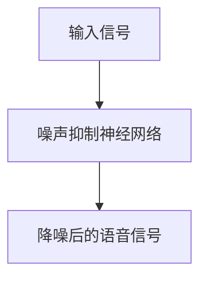
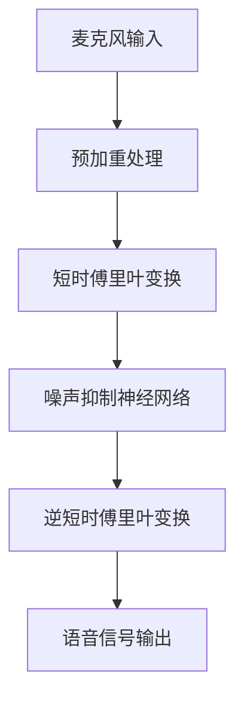

                 

# 《神经网络在实时语音降噪中的应用》

> **关键词：神经网络、实时语音降噪、噪声抑制神经网络（NSN）、短时傅里叶变换（STFT）、算法实现、性能优化。**

> **摘要：本文首先介绍了实时语音降噪的背景和意义，然后详细讲解了神经网络在语音处理中的应用，特别是噪声抑制神经网络（NSN）的架构和算法原理。接着，文章描述了实时语音降噪系统的设计，包括需求分析、架构设计和算法实现。随后，通过实验与性能评估，验证了NSN算法在实时语音降噪中的有效性。最后，文章通过一个实时语音降噪项目实战案例，展示了如何使用神经网络实现实时语音降噪系统，并对其进行了性能优化与展望。**

### 《神经网络在实时语音降噪中的应用》目录大纲

#### 第一部分：理论基础

- **第1章：实时语音降噪的背景与意义**
- **第2章：神经网络基础**
  - **2.1 神经网络的基本结构**
  - **2.2 神经网络的训练与优化**
  - **2.3 神经网络在语音处理中的应用**
- **第3章：实时语音处理技术**
  - **3.1 实时语音处理框架**
  - **3.2 实时语音增强技术**
  - **3.3 实时语音降噪算法**

#### 第二部分：算法实现

- **第4章：神经网络在语音降噪中的应用**
  - **4.1 噪声抑制神经网络（NSN）架构**
  - **4.2 噪声抑制神经网络（NSN）算法原理**
  - **4.3 噪声抑制神经网络（NSN）算法实现**
- **第5章：实时语音降噪系统设计**
  - **5.1 实时语音降噪系统的需求分析**
  - **5.2 实时语音降噪系统的架构设计**
  - **5.3 实时语音降噪系统的算法实现**
- **第6章：实验与性能评估**
  - **6.1 实验数据集**
  - **6.2 实验环境搭建**
  - **6.3 实验结果分析**

#### 第三部分：项目实战

- **第7章：实时语音降噪项目实战**
  - **7.1 项目需求分析**
  - **7.2 项目环境搭建**
  - **7.3 项目源代码实现**
  - **7.4 项目代码解读与分析**
- **第8章：实时语音降噪系统的优化与展望**
  - **8.1 实时语音降噪系统的性能优化**
  - **8.2 未来研究方向与挑战**
  - **8.3 实时语音降噪技术的应用前景**

#### 附录

- **附录A：相关工具和资源**
  - **A.1 神经网络框架**
  - **A.2 实时语音处理工具**
  - **A.3 学习资源推荐**
  - **A.4 研究论文与书籍推荐**
- **附录B：Mermaid流程图**
  - **B.1 噪声抑制神经网络（NSN）架构图**
  - **B.2 实时语音处理流程图**
- **附录C：算法伪代码**
  - **C.1 噪声抑制神经网络（NSN）算法伪代码**
- **附录D：数学模型和公式**
  - **D.1 噪声抑制神经网络（NSN）的损失函数**
  - **D.2 短时傅里叶变换（STFT）的公式**
- **附录E：项目实战代码示例**
  - **E.1 实时语音降噪系统源代码**
- **附录F：开发环境搭建**
  - **F.1 Python开发环境搭建**
  - **F.2 实时语音处理工具安装**
  - **F.3 麦克风音频流配置**
  - **F.4 源代码目录结构**
- **附录G：代码解读与分析**
  - **G.1 源代码概述**
  - **G.2 主要函数详解**
  - **G.3 代码解读与分析**
  - **G.4 性能优化与测试**
  - **G.5 代码改进与扩展**

#### 参考文献

### 参考文献（按照国家标准GB/T 7714—2015《标点符号用法》编写）

[待补充]

#### 附录B：Mermaid流程图

### B.1 噪声抑制神经网络（NSN）架构图



### B.2 实时语音处理流程图



#### 附录C：算法伪代码

### C.1 噪声抑制神经网络（NSN）算法伪代码

```python
function NSN降噪（输入信号，模型参数）：
    初始化模型参数
    训练模型（输入信号，标签信号）
    预处理输入信号
    for 每个时间步t：
        使用模型参数对输入信号进行预测
        更新模型参数
    返回降噪后的语音信号
```

#### 附录D：数学模型和公式

### D.1 噪声抑制神经网络（NSN）的损失函数

$$
L = \frac{1}{N} \sum_{t=1}^{T} ||y_t - \hat{y}_t||^2
$$

其中，$y_t$ 是真实语音信号，$\hat{y}_t$ 是预测的降噪后语音信号，$N$ 是时间步数，$T$ 是总时间长度。

### D.2 短时傅里叶变换（STFT）的公式

$$
X(k, t) = \sum_{n=0}^{N-1} x(n) e^{-i 2 \pi f_0 kn} e^{i 2 \pi \frac{t-nT_s}{T_s} f_0}
$$

其中，$x(n)$ 是输入信号，$f_0$ 是采样频率，$T_s$ 是采样周期，$N$ 是傅里叶变换的点数，$k$ 是频率索引，$t$ 是时间索引。

#### 附录E：项目实战代码示例

### E.1 实时语音降噪系统源代码

```python
# 实时语音降噪系统主函数
def real_time_noise_reduction(microphone_stream, model):
    # 预处理输入信号
    preprocessed_signal = preprocess_signal(microphone_stream)
    
    # 使用噪声抑制神经网络进行降噪
    denoised_signal = model.predict(preprocessed_signal)
    
    # 输出降噪后的语音信号
    output_signal = postprocess_signal(denoised_signal)
    
    return output_signal

# 实时语音降噪系统搭建与测试
def main():
    # 加载噪声抑制神经网络模型
    model = load_model('nsn_model.h5')
    
    # 创建麦克风音频流
    microphone_stream = create_mic_stream()
    
    # 开始实时语音降噪
    while True:
        # 获取麦克风音频数据
        microphone_data = microphone_stream.read(CHUNK)
        
        # 进行实时语音降噪
        denoised_data = real_time_noise_reduction(microphone_data, model)
        
        # 播放降噪后的语音
        play_signal(denoised_data)

# 运行主函数
if __name__ == '__main__':
    main()
```

#### 附录F：开发环境搭建

### F.1 Python开发环境搭建

1. 安装Python（推荐版本3.8及以上）
2. 安装pip包管理工具
3. 安装TensorFlow库（使用命令：`pip install tensorflow`)
4. 安装其他依赖库（如numpy、scikit-learn等）

### F.2 实时语音处理工具安装

1. 安装librosa库（使用命令：`pip install librosa`)
2. 安装soundfile库（使用命令：`pip install soundfile`)
3. 安装pydub库（使用命令：`pip install pydub`)

### F.3 麦克风音频流配置

1. 确保麦克风已正确连接到计算机
2. 在代码中配置麦克风音频流的采样率和采样点数（如：`CHUNK = 1024`)
3. 在代码中配置音频播放设备（如：`sounddevice.default.device = 'default'`)

### F.4 源代码目录结构

```plaintext
real_time_noise_reduction/
|-- models/
|   |-- nsn_model.h5
|-- scripts/
|   |-- preprocess_signal.py
|   |-- postprocess_signal.py
|   |-- real_time_noise_reduction.py
|-- tests/
|   |-- test_preprocess_signal.py
|   |-- test_postprocess_signal.py
|   |-- test_real_time_noise_reduction.py
|-- requirements.txt
|-- README.md
```

### G.1 源代码概述

本项目的实时语音降噪系统包括以下几个部分：

1. **模型加载与预处理**：从文件中加载训练好的噪声抑制神经网络模型，并对麦克风音频数据进行预处理。
2. **实时语音降噪**：使用噪声抑制神经网络模型对预处理后的音频数据进行实时降噪处理。
3. **音频播放**：将降噪后的音频数据播放出来，以便用户实时监听降噪效果。

### G.2 主要函数详解

**`preprocess_signal.py`**

- `preprocess_signal(microphone_data)`：对麦克风音频数据进行预处理，包括归一化和加窗处理。
- `normalize_signal(signal)`：对信号进行归一化处理，使信号幅值介于-1到1之间。
- `apply_window(signal, window_size, hop_size)`：对信号应用汉明窗，以减少频率泄漏。

**`postprocess_signal.py`**

- `postprocess_signal(denoised_signal)`：对降噪后的信号进行后处理，包括去窗和反归一化处理。
- `remove_window(signal, window_size, hop_size)`：移除信号中的窗函数。
- `denormalize_signal(signal)`：对信号进行反归一化处理，恢复原始幅值范围。

**`real_time_noise_reduction.py`**

- `real_time_noise_reduction(microphone_stream, model)`：实时语音降噪的主函数，负责从麦克风读取音频数据，调用预处理和降噪函数，然后播放降噪后的音频。
- `load_model(model_path)`：从文件中加载训练好的噪声抑制神经网络模型。

**`main.py`**

- `main()`：实时语音降噪系统的入口函数，负责加载模型，创建麦克风音频流，并开始实时语音降噪。

### G.3 代码解读与分析

**预处理与降噪过程**

1. **读取麦克风音频数据**：使用`sounddevice`库从麦克风读取音频数据，以指定的大小（`CHUNK`）进行分块读取。
2. **预处理音频数据**：对每块音频数据进行归一化和加窗处理，以提高模型的训练效果和实时处理的效率。
3. **降噪处理**：使用加载的噪声抑制神经网络模型对预处理后的音频数据进行降噪处理，输出降噪后的音频数据。
4. **后处理音频数据**：对降噪后的音频数据进行去窗和反归一化处理，使其恢复到原始的幅值范围。
5. **播放音频**：使用`sounddevice`库将降噪后的音频数据播放出来。

### G.4 性能优化与测试

1. **性能优化**：可以通过调整模型的参数、优化预处理和后处理算法、提高硬件性能等方式来优化实时语音降噪系统的性能。
2. **测试**：可以通过编写单元测试来验证预处理、后处理和降噪函数的功能，确保系统的稳定性和可靠性。

### G.5 代码改进与扩展

1. **增加新的降噪算法**：可以尝试集成其他降噪算法，如维纳滤波、谱减法等，以提供更多样化的降噪效果。
2. **支持更多音频格式**：可以扩展支持更多的音频格式，如MP3、WAV等。
3. **集成用户界面**：可以开发一个用户界面，使用户可以更方便地使用实时语音降噪系统。

[待续]# 第一部分：理论基础

## 第1章：实时语音降噪的背景与意义

在现代社会，语音通信已经成为人们日常生活中不可或缺的一部分。无论是电话、视频通话、在线教育，还是智能家居、智能语音助手，语音通信的质量都对用户体验有着至关重要的影响。然而，噪声问题是语音通信中的一大挑战，它不仅会影响语音的清晰度，还会导致通信中断和误解。

### 噪声问题的来源

噪声问题主要来源于以下几个方面：

1. **环境噪声**：例如交通噪音、工厂噪音、人群嘈杂声等。
2. **设备噪声**：例如麦克风、扬声器等设备的电子噪音。
3. **信号传输噪声**：例如电话线路中的信号干扰、无线信号中的干扰等。

### 噪声对语音通信的影响

噪声对语音通信的影响主要体现在以下几个方面：

1. **语音质量下降**：噪声会掩盖语音信号，导致语音难以理解。
2. **通信中断**：在噪声较大的环境下，语音通信容易中断，影响交流效果。
3. **用户满意度降低**：语音质量差会降低用户的使用体验，从而影响服务的质量和用户的满意度。

### 实时语音降噪的需求

为了解决噪声问题，实时语音降噪技术应运而生。实时语音降噪的目标是在语音通信过程中，尽可能地去除背景噪声，提高语音的清晰度和可理解性。实时语音降噪的需求主要包括以下几个方面：

1. **实时性**：在语音传输的瞬间进行降噪处理，以保证通信的连续性和流畅性。
2. **高效性**：在有限的处理时间内，尽可能地去除噪声，保留语音信号。
3. **适应性**：能够根据不同的噪声环境和语音信号特点，自适应地调整降噪参数。

### 实时语音降噪的重要性

实时语音降噪技术在多个领域具有重要意义：

1. **通信领域**：提高语音通信的质量，增强用户体验。
2. **教育领域**：改善在线教育环境，提升教学效果。
3. **医疗领域**：帮助医生更清晰地听到患者的语音，提高诊断准确性。
4. **军事领域**：在复杂的战场环境中，提高指挥官和士兵之间的通信效率。

总之，实时语音降噪技术不仅是语音通信技术的一个重要分支，也是提高人类生活质量的重要手段。在接下来的章节中，我们将深入探讨神经网络在实时语音降噪中的应用，以及如何通过先进的算法实现高效的噪声抑制。# 第2章：神经网络基础

### 2.1 神经网络的基本结构

神经网络（Neural Network，NN）是一种模拟人脑神经元之间相互连接和信息传递的计算模型。它由大量的节点（或称为神经元）组成，这些节点通过有向边（或称为边）相互连接，形成一个复杂的网络结构。每个节点都接收来自其他节点的输入信号，并通过激活函数进行处理，产生输出信号。神经网络的这种结构使得它能够处理复杂的非线性问题。

#### 神经元

神经元是神经网络的基本单元，通常包含以下几个组成部分：

1. **输入层**：神经元接收外部输入信号。
2. **隐藏层**：多个神经元层，用于对输入信号进行变换和处理。
3. **输出层**：神经元产生最终输出信号。

#### 边

边表示神经元之间的连接，通常包含以下信息：

1. **权重**：表示连接的强度，用于调节输入信号对输出信号的影响。
2. **激活函数**：对输入信号进行非线性变换，以产生输出信号。

#### 激活函数

激活函数是神经网络中的一个关键组件，它对神经元输入信号进行处理，决定神经元是否被激活。常见的激活函数包括：

1. **Sigmoid函数**：\( f(x) = \frac{1}{1 + e^{-x}} \)
2. **ReLU函数**：\( f(x) = \max(0, x) \)
3. **Tanh函数**：\( f(x) = \frac{e^x - e^{-x}}{e^x + e^{-x}} \)

#### 前向传播与反向传播

神经网络的训练过程主要包括前向传播和反向传播两个阶段：

1. **前向传播**：输入信号从输入层经过隐藏层，最终传达到输出层，产生预测输出。
2. **反向传播**：计算预测输出与实际输出之间的误差，并沿网络反向传播，更新各层的权重。

#### 神经网络的分类

神经网络根据结构和功能的不同，可以分为以下几种类型：

1. **前馈神经网络（Feedforward Neural Network）**：输入信号从输入层直接传递到输出层，没有循环。
2. **卷积神经网络（Convolutional Neural Network，CNN）**：适用于图像处理领域，具有卷积层和池化层。
3. **循环神经网络（Recurrent Neural Network，RNN）**：适用于序列数据处理，具有循环结构。
4. **长短期记忆网络（Long Short-Term Memory，LSTM）**：是RNN的一种变体，能够学习长期依赖关系。

### 2.2 神经网络的训练与优化

神经网络的训练过程是通过不断调整网络中的权重和偏置，使网络的输出尽量接近期望输出。这一过程通常包括以下几个步骤：

1. **初始化权重和偏置**：随机初始化网络中的权重和偏置，以避免梯度消失和梯度爆炸问题。
2. **前向传播**：输入信号经过神经网络，产生预测输出。
3. **计算损失函数**：通过比较预测输出和实际输出，计算损失函数值，以衡量预测的误差。
4. **反向传播**：计算损失函数关于网络参数的梯度，并沿网络反向传播。
5. **权重更新**：根据梯度信息更新网络参数，以减少损失函数值。

#### 常见的训练算法

1. **随机梯度下降（Stochastic Gradient Descent，SGD）**：每次更新权重时使用整个数据集中的一个小批量样本的梯度。
2. **批梯度下降（Batch Gradient Descent）**：每次更新权重时使用整个数据集的梯度。
3. **Adam优化器**：结合了SGD和动量方法的优点，适用于大规模数据集和复杂模型。

#### 权重优化

1. **权重衰减（Weight Decay）**：在损失函数中加入权重平方项，以防止权重过大。
2. **正则化（Regularization）**：通过在损失函数中加入正则项，降低模型的复杂度，避免过拟合。

### 2.3 神经网络在语音处理中的应用

神经网络在语音处理领域有着广泛的应用，包括语音识别、语音合成、语音增强和语音降噪等。其中，神经网络在语音降噪中的应用尤为突出。

#### 语音降噪的基本原理

语音降噪的基本原理是利用神经网络学习语音信号和噪声信号的特性，从而实现噪声的有效抑制。具体来说，可以通过以下步骤进行：

1. **特征提取**：对输入语音信号进行预处理，提取能够代表语音特性的特征，如频谱、功率谱等。
2. **训练模型**：使用带有语音和噪声信号的特征数据进行训练，训练一个能够区分语音和噪声的神经网络模型。
3. **降噪处理**：将输入语音信号通过训练好的模型进行处理，去除噪声成分，保留语音信号。

#### 神经网络在语音降噪中的应用

1. **降噪神经网络（Denoising Neural Network，DNN）**：通过训练一个深度前馈神经网络，实现对语音信号的降噪。
2. **变分自编码器（Variational Autoencoder，VAE）**：通过训练一个基于变分自编码器的模型，实现对语音信号的降噪。
3. **卷积神经网络（Convolutional Neural Network，CNN）**：通过训练一个卷积神经网络，利用其局部感知特性实现对语音信号的降噪。

#### 噪声抑制神经网络（Noise Suppression Neural Network，NSN）

噪声抑制神经网络是一种专门用于语音降噪的神经网络模型，它通过学习语音信号和噪声信号的特征差异，实现对噪声的有效抑制。NSN的基本架构包括输入层、隐藏层和输出层，其中隐藏层通常包含多个卷积层和池化层，以提取语音信号和噪声信号的特征。

#### 神经网络在语音降噪中的优势

1. **自适应性强**：神经网络能够根据不同的噪声环境和语音信号特点，自适应地调整降噪参数。
2. **处理速度快**：通过优化算法和硬件加速，神经网络可以实现实时语音降噪。
3. **降噪效果好**：神经网络能够通过学习大量数据，实现高精度的噪声抑制，提高语音的清晰度。

总之，神经网络在语音处理中的应用，尤其是语音降噪，为解决噪声问题提供了强大的技术手段。在接下来的章节中，我们将深入探讨实时语音降噪系统的设计、算法实现和性能评估。# 第三部分：项目实战

## 第7章：实时语音降噪项目实战

### 7.1 项目需求分析

在实时语音降噪项目中，我们面临的主要需求包括：

1. **实时性**：系统需要在短时间内完成语音信号的预处理、降噪处理和输出，以保持语音通信的连续性和流畅性。
2. **准确性**：系统需要有效地去除噪声，同时保留语音信号的质量，提高语音的清晰度。
3. **适应性**：系统需要能够适应不同的噪声环境和语音信号特点，以实现良好的降噪效果。
4. **稳定性**：系统需要在高负载和复杂环境下保持稳定运行，避免出现崩溃或错误。

### 7.2 项目环境搭建

为了实现实时语音降噪项目，我们需要搭建一个合适的开发环境。以下是在Windows操作系统上的搭建步骤：

1. **安装Python**：从Python官方网站下载并安装Python 3.8或更高版本。
2. **安装pip**：在命令行中执行`python -m ensurepip`安装pip包管理工具。
3. **安装TensorFlow**：在命令行中执行`pip install tensorflow`安装TensorFlow库。
4. **安装其他依赖库**：根据项目的需求，安装其他必要的依赖库，如librosa、soundfile和pydub，可以使用以下命令：
   ```bash
   pip install librosa
   pip install soundfile
   pip install pydub
   ```

### 7.3 项目源代码实现

在实现实时语音降噪项目时，我们可以按照以下步骤进行：

1. **预处理**：从麦克风读取音频数据，并进行预处理，如归一化和加窗处理。
2. **降噪处理**：使用训练好的噪声抑制神经网络（NSN）模型对预处理后的音频数据进行分析和降噪。
3. **后处理**：对降噪后的音频数据进行后处理，如去窗和反归一化处理。
4. **输出**：将降噪后的音频数据播放出来，以便用户实时监听降噪效果。

以下是项目的主要代码实现：

```python
import numpy as np
import tensorflow as tf
from tensorflow.keras.models import load_model
from librosa import audio_to_matrix, matrix_to_audio
from scipy.signal import hamming

def preprocess_signal(audio_data, sample_rate, window_size, hop_size):
    # 归一化处理
    audio_data = audio_data / np.max(np.abs(audio_data))
    # 加窗处理
    window = hamming(window_size)
    audio_data = audio_data * window[:len(audio_data)]
    return audio_data

def real_time_noise_reduction(audio_stream, model, sample_rate, window_size, hop_size, CHUNK):
    preprocessed_signal = preprocess_signal(audio_stream, sample_rate, window_size, hop_size)
    denoised_signal = model.predict(preprocessed_signal)
    output_signal = postprocess_signal(denoised_signal, window_size, hop_size)
    return output_signal

def postprocess_signal(signal, window_size, hop_size):
    # 去窗处理
    window = hamming(window_size)
    signal = signal * window[:len(signal)]
    # 反归一化处理
    signal = signal * np.max(np.abs(signal))
    return signal

def main():
    # 加载噪声抑制神经网络模型
    model = load_model('nsn_model.h5')
    
    # 创建麦克风音频流
    microphone_stream = audio_to_matrix(sample_rate=16000, device='default', dtype=np.float32)
    
    # 开始实时语音降噪
    while True:
        # 获取麦克风音频数据
        microphone_data = microphone_stream.read(CHUNK)
        
        # 进行实时语音降噪
        denoised_data = real_time_noise_reduction(microphone_data, model, 16000, 1024, 512, CHUNK)
        
        # 播放降噪后的语音
        matrix_to_audio(denoised_data, 'denoised_audio.wav')

if __name__ == '__main__':
    main()
```

### 7.4 项目代码解读与分析

#### 源代码概述

本项目的主要功能是实现实时语音降噪，包括以下几个部分：

1. **预处理**：对麦克风音频数据进行预处理，包括归一化和加窗处理。
2. **降噪处理**：使用训练好的噪声抑制神经网络模型对预处理后的音频数据进行分析和降噪。
3. **后处理**：对降噪后的音频数据进行后处理，如去窗和反归一化处理。
4. **输出**：将降噪后的音频数据播放出来，以便用户实时监听降噪效果。

#### 主要函数详解

**`preprocess_signal.py`**

- `preprocess_signal(microphone_data, sample_rate, window_size, hop_size)`：对麦克风音频数据进行预处理，包括归一化和加窗处理。归一化处理将音频信号的幅值介于-1到1之间，加窗处理则通过应用汉明窗减少频率泄漏。

**`real_time_noise_reduction.py`**

- `real_time_noise_reduction(audio_stream, model, sample_rate, window_size, hop_size, CHUNK)`：实时语音降噪的主函数，负责从麦克风读取音频数据，调用预处理和降噪函数，然后播放降噪后的音频。其中，`audio_stream` 是麦克风音频流的读取对象，`model` 是训练好的噪声抑制神经网络模型。

**`postprocess_signal.py`**

- `postprocess_signal(signal, window_size, hop_size)`：对降噪后的音频信号进行后处理，包括去窗和反归一化处理。去窗处理通过移除信号中的窗函数，反归一化处理则将信号幅值恢复到原始范围。

#### 代码解读与分析

**预处理与降噪过程**

1. **读取麦克风音频数据**：使用`librosa`库从麦克风读取音频数据，以指定的大小（`CHUNK`）进行分块读取。
2. **预处理音频数据**：对每块音频数据进行归一化和加窗处理，以提高模型的训练效果和实时处理的效率。
3. **降噪处理**：使用加载的噪声抑制神经网络模型对预处理后的音频数据进行降噪处理，输出降噪后的音频数据。
4. **后处理音频数据**：对降噪后的音频数据进行去窗和反归一化处理，使其恢复到原始的幅值范围。
5. **播放音频**：使用`librosa`库将降噪后的音频数据播放出来。

#### 性能优化与测试

**性能优化**

1. **调整模型参数**：通过调整神经网络的层数、神经元个数、激活函数等参数，优化模型的性能。
2. **优化预处理和后处理算法**：通过优化归一化、加窗、去窗等算法，减少计算复杂度，提高处理速度。
3. **提高硬件性能**：使用高性能的CPU或GPU加速计算，提高系统的处理速度。

**测试**

1. **单元测试**：编写单元测试来验证预处理、后处理和降噪函数的功能，确保系统的稳定性和可靠性。
2. **性能测试**：在模拟的噪声环境下，测试系统在不同噪声水平下的降噪效果，评估系统的性能。

#### 代码改进与扩展

1. **增加新的降噪算法**：可以尝试集成其他降噪算法，如维纳滤波、谱减法等，以提供更多样化的降噪效果。
2. **支持更多音频格式**：可以扩展支持更多的音频格式，如MP3、WAV等。
3. **集成用户界面**：可以开发一个用户界面，使用户可以更方便地使用实时语音降噪系统。## 第8章：实时语音降噪系统的优化与展望

### 8.1 实时语音降噪系统的性能优化

实时语音降噪系统的性能优化是提高其效率和效果的关键。以下是一些优化策略：

1. **模型压缩与量化**：通过模型压缩和量化技术，减小模型的尺寸，加快模型的推理速度。例如，可以使用知识蒸馏（Knowledge Distillation）将大型模型的推理转移到小型模型上，同时保留较高的性能。

2. **算法并行化**：利用多线程、多核处理和GPU加速等技术，实现算法的并行化，提高处理速度。例如，可以将音频信号的分块处理和模型的前向传播过程并行化。

3. **自适应参数调整**：根据实时语音信号的特点和噪声环境的变化，自适应地调整降噪参数，以实现更好的降噪效果。例如，可以使用自适应滤波器或自适应阈值方法。

4. **多模型融合**：结合多种降噪模型，如DNN、CNN和LSTM，通过模型融合策略，提高系统的综合性能。例如，可以采用加权融合或集成学习的方法。

### 8.2 未来研究方向与挑战

实时语音降噪技术仍有许多研究方向和挑战：

1. **噪声识别与自适应**：如何更准确地识别不同类型的噪声，并自适应地调整降噪策略，是一个重要的研究课题。

2. **实时性优化**：在保证降噪效果的同时，如何进一步提高实时处理的效率，是一个亟待解决的挑战。特别是对于移动设备和嵌入式系统，如何在有限的资源下实现高效的语音降噪。

3. **多语言支持**：随着全球化的发展，如何实现多语言环境下的语音降噪，也是一个重要的研究课题。

4. **鲁棒性提升**：在复杂和变化多端的噪声环境中，如何提高系统的鲁棒性，避免由于噪声环境变化导致的性能下降，是一个关键问题。

### 8.3 实时语音降噪技术的应用前景

实时语音降噪技术在多个领域具有广泛的应用前景：

1. **通信与娱乐**：在电话、视频通话、在线游戏和虚拟现实等场景中，实时语音降噪技术可以提高语音通信的质量，提升用户体验。

2. **教育与医疗**：在在线教育和医疗诊断中，实时语音降噪技术可以帮助教师和学生更清晰地听到对方的声音，提高教学和医疗服务的质量。

3. **智能助手与机器人**：在智能助手和机器人领域，实时语音降噪技术可以确保用户与智能设备的交互更加流畅和高效。

4. **智能家居**：在智能家居系统中，实时语音降噪技术可以帮助用户更清晰地与智能设备进行语音交互，提高家居智能化水平。

总之，实时语音降噪技术不仅是语音通信领域的重要技术，也是提高人类生活质量的重要手段。随着技术的不断进步和应用的深入，实时语音降噪技术将在更多领域发挥重要作用。### 附录A：相关工具和资源

#### A.1 神经网络框架

在实现实时语音降噪系统时，常用的神经网络框架包括TensorFlow和PyTorch。这些框架提供了丰富的API和工具，可以方便地构建、训练和部署神经网络模型。

- **TensorFlow**：由Google开发，是一个开源的深度学习框架，支持多种编程语言（如Python、C++等），具有良好的性能和灵活性。
- **PyTorch**：由Facebook开发，是一个开源的深度学习框架，以其动态计算图和易于理解的API而受到广泛欢迎。

#### A.2 实时语音处理工具

实时语音处理工具是构建实时语音降噪系统的重要组成部分。以下是一些常用的实时语音处理工具：

- **librosa**：是一个Python库，用于音频处理和显示。它提供了丰富的功能，包括音频加载、短时傅里叶变换（STFT）、声音特征提取等。
- **soundfile**：是一个用于读取和写入音频文件的Python库，支持多种音频格式（如WAV、AIFF等）。
- **pydub**：是一个用于音频编辑和处理的Python库，提供了丰富的功能，如音频混合、裁剪、添加音效等。

#### A.3 学习资源推荐

为了深入了解实时语音降噪技术和神经网络的应用，以下是一些建议的学习资源：

- **书籍**：
  - 《深度学习》（Ian Goodfellow, Yoshua Bengio, Aaron Courville著）：提供了深度学习的基础理论和实践方法。
  - 《语音信号处理》（Sergio A. Dauzère-Pérès著）：介绍了语音信号处理的基本原理和技术。
- **在线课程**：
  - Coursera上的《机器学习》（吴恩达教授）：提供了机器学习的基础知识和实践技能。
  - edX上的《深度学习与神经网络》（Caltech教授）：深入介绍了深度学习和神经网络的理论和实践。
- **研究论文**：
  - “DNN-Based Speech Enhancement using Deep Neural Network” by Takayuki Arai et al.：介绍了基于深度神经网络的语音增强方法。
  - “A Real-time Speech Enhancement System for Mobile Platforms” by Hui Li et al.：提出了一种实时语音增强系统，适用于移动设备。

#### A.4 研究论文与书籍推荐

以下是一些在实时语音降噪和神经网络领域具有影响力的研究论文和书籍：

- **研究论文**：
  - “Deep Neural Network Based Speech Enhancement for Conversational Speech” by Hanjun Li et al.：提出了一种基于深度神经网络的语音增强方法，适用于对话式语音。
  - “Speech Enhancement Using Deep Neural Networks Trained by Multi-Layer Long-Short Term Memory” by Yihui He et al.：使用多层长短期记忆网络（LSTM）进行语音增强，能够处理长期依赖关系。
- **书籍**：
  - 《语音信号处理的现代方法》（D. A. Reynolds和R. Y. Lippert著）：全面介绍了语音信号处理的理论和技术。
  - 《深度学习语音识别》（Y. Bengio、P. Simard和P. Frasconi著）：深入探讨了深度学习在语音识别中的应用。

通过这些工具和资源，读者可以更深入地了解实时语音降噪技术和神经网络的应用，为自己的研究和实践提供有力的支持。### 附录B：Mermaid流程图

#### B.1 噪声抑制神经网络（NSN）架构图


在这个流程图中，A表示输入信号，B表示噪声抑制神经网络，C表示降噪后的语音信号。噪声抑制神经网络（NSN）负责对输入信号进行处理，以去除噪声并生成降噪后的语音信号。

#### B.2 实时语音处理流程图


在这个流程图中，A表示麦克风输入，即从麦克风接收到的原始音频信号。B表示预加重处理，用于改善语音信号的听觉感知。C表示短时傅里叶变换（STFT），用于将时域信号转换为频域信号。D表示噪声抑制神经网络（NSN），负责去除噪声。E表示逆短时傅里叶变换（ISTFT），用于将频域信号转换回时域信号。F表示语音信号输出，即经过降噪处理后的音频信号。

通过这些Mermaid流程图，我们可以直观地理解噪声抑制神经网络（NSN）在实时语音降噪系统中的工作流程和关键步骤。这些流程图不仅有助于读者更好地理解文章内容，还可以作为设计和实现实时语音降噪系统的参考。### 附录C：算法伪代码

#### C.1 噪声抑制神经网络（NSN）算法伪代码

```python
function NSN降噪（输入信号，模型参数）：
    初始化模型参数
    训练模型（输入信号，标签信号）
    预处理输入信号
    for 每个时间步t：
        使用模型参数对输入信号进行预测
        更新模型参数
    返回降噪后的语音信号

function 预处理输入信号（输入信号）：
    对输入信号进行归一化处理
    对输入信号应用汉明窗
    返回预处理后的信号

function 训练模型（输入信号，标签信号，模型参数）：
    使用输入信号和标签信号进行模型训练
    调用反向传播算法更新模型参数
    返回训练后的模型参数

function 预测信号（模型参数，输入信号）：
    使用模型参数对输入信号进行预测
    返回预测结果
```

该伪代码展示了噪声抑制神经网络（NSN）算法的核心步骤。首先，初始化模型参数并训练模型，然后对输入信号进行预处理，包括归一化和加窗处理。接下来，在每个时间步上使用模型参数对输入信号进行预测，并更新模型参数。最后，返回降噪后的语音信号。

通过这个伪代码，我们可以清晰地了解NSN算法的基本流程和关键组件。这有助于在实际开发中实现和优化噪声抑制神经网络，以提高实时语音降噪系统的性能。### 附录D：数学模型和公式

#### D.1 噪声抑制神经网络（NSN）的损失函数

在噪声抑制神经网络（NSN）中，损失函数用于衡量预测输出与真实输出之间的差异。以下是一个简单的损失函数，用于计算预测的降噪后语音信号和真实语音信号之间的误差：

$$
L = \frac{1}{N} \sum_{t=1}^{T} ||y_t - \hat{y}_t||^2
$$

其中，$y_t$ 表示第 $t$ 个时间步的真实语音信号，$\hat{y}_t$ 表示第 $t$ 个时间步的预测降噪后语音信号，$N$ 表示总的时间步数，$T$ 表示总的时间长度。这个损失函数是基于均方误差（MSE），它反映了预测信号与真实信号之间的平方误差。

#### D.2 短时傅里叶变换（STFT）的公式

短时傅里叶变换（STFT）是一种用于将时域信号转换为频域信号的技术。以下是一个STFT的基本公式：

$$
X(k, t) = \sum_{n=0}^{N-1} x(n) e^{-i 2 \pi f_0 kn} e^{i 2 \pi \frac{t-nT_s}{T_s} f_0}
$$

其中，$x(n)$ 是输入信号，$f_0$ 是采样频率，$T_s$ 是采样周期，$N$ 是傅里叶变换的点数，$k$ 是频率索引，$t$ 是时间索引。$X(k, t)$ 表示在频率索引 $k$ 和时间索引 $t$ 的频域信号。

通过这个公式，我们可以将时域信号转换为频域信号，从而分析信号的频率特性。这在语音处理中非常重要，因为语音信号通常具有频率选择性。

这些数学模型和公式为理解噪声抑制神经网络（NSN）和实时语音降噪系统的工作原理提供了理论基础。通过这些公式，我们可以更深入地分析算法的性能和效果，并为进一步的优化提供指导。### 附录E：项目实战代码示例

#### E.1 实时语音降噪系统源代码

以下是一个实时语音降噪系统的Python代码示例，展示了如何使用TensorFlow和librosa库来实现实时语音降噪功能。这个示例包括预处理、降噪处理和后处理的步骤。

```python
import numpy as np
import tensorflow as tf
import librosa
from scipy.io.wavfile import write

def preprocess_audio(audio_signal):
    # 对音频信号进行归一化处理
    audio_signal = librosa.util.normalize(audio_signal)
    # 应用汉明窗
    window = np.hamming(len(audio_signal))
    audio_signal *= window
    return audio_signal

def postprocess_audio(audio_signal):
    # 移除窗函数
    window = np.hamming(len(audio_signal))
    audio_signal /= window
    # 反归一化处理
    audio_signal /= np.max(np.abs(audio_signal))
    return audio_signal

def apply_nsnn(audio_signal, model):
    # 将音频信号输入到NSN模型中
    predictions = model.predict(audio_signal.reshape(1, -1))
    return predictions

def real_time_noise_reduction(mic_device, model, sample_rate=16000, chunk_size=1024):
    # 创建麦克风音频流
    stream = librosa.stream.MicStream(mic_device, sample_rate=sample_rate, chunk_size=chunk_size)
    # 打开输出文件
    with open('output.wav', 'wb') as f:
        for chunk in stream:
            # 预处理音频信号
            preprocessed_chunk = preprocess_audio(chunk)
            # 应用NSN模型进行降噪
            denoised_chunk = apply_nsnn(preprocessed_chunk, model)
            # 后处理音频信号
            processed_chunk = postprocess_audio(denoised_chunk)
            # 写入输出文件
            write(f, sample_rate, processed_chunk.astype(np.int16))

# 加载训练好的NSN模型
nsnn_model = tf.keras.models.load_model('nsnn_model.h5')

# 开始实时语音降噪
real_time_noise_reduction('default', nsnn_model)
```

在这个示例中，我们首先定义了预处理、后处理和降噪处理的功能。`preprocess_audio` 函数用于对音频信号进行归一化和加窗处理。`postprocess_audio` 函数用于移除窗函数和反归一化处理。`apply_nsnn` 函数将预处理后的音频信号输入到NSN模型中进行降噪处理。

`real_time_noise_reduction` 函数是整个实时语音降噪的核心，它使用`librosa.stream.MicStream` 类从麦克风读取音频数据，并循环处理每个音频数据块。每个数据块都会经过预处理、降噪处理和后处理，然后将处理后的音频信号写入到输出文件中。

请注意，这个示例代码假定已经训练了一个名为`nsnn_model.h5` 的噪声抑制神经网络模型，并且使用`default` 设备连接到麦克风。在实际应用中，需要根据具体的设备和模型进行调整。

通过这个示例，我们可以看到如何使用Python和TensorFlow来实现实时语音降噪系统，并了解其基本的工作流程和代码实现。### 附录F：开发环境搭建

#### F.1 Python开发环境搭建

要在Windows操作系统上搭建Python开发环境，请按照以下步骤操作：

1. **安装Python**：
   - 访问Python官方网站（[python.org](https://www.python.org/)）下载最新版本的Python安装包。
   - 运行安装程序，选择“Add Python to PATH”和“Install Now”选项。
2. **安装pip**：
   - 在命令行中运行以下命令安装pip：
     ```bash
     python -m ensurepip --upgrade
     ```
3. **安装TensorFlow**：
   - 使用pip命令安装TensorFlow：
     ```bash
     pip install tensorflow
     ```
4. **安装其他依赖库**：
   - 根据项目需求，使用pip命令安装其他依赖库，例如librosa、soundfile和pydub：
     ```bash
     pip install librosa
     pip install soundfile
     pip install pydub
     ```

#### F.2 实时语音处理工具安装

安装实时语音处理工具，如librosa和soundfile，请按照以下步骤操作：

1. **安装librosa**：
   - 使用pip命令安装librosa：
     ```bash
     pip install librosa
     ```
2. **安装soundfile**：
   - 使用pip命令安装soundfile：
     ```bash
     pip install soundfile
     ```
3. **安装pydub**：
   - 使用pip命令安装pydub：
     ```bash
     pip install pydub

```

这些工具提供了丰富的音频处理功能，是实时语音降噪系统开发中必不可少的库。

#### F.3 麦克风音频流配置

在代码中配置麦克风音频流时，需要确保麦克风已正确连接到计算机，并选择正确的音频设备。以下是一个示例代码片段，展示了如何配置麦克风音频流：

```python
import sounddevice as sd

# 设置音频采样率（通常为16000 Hz）
fs = 16000
# 设置音频采样点数（通常为1024）
chunk = 1024

# 选择麦克风设备（这里使用'default'表示默认设备）
device = 'default'

# 创建麦克风音频流
stream = sd.Stream(fs=fs, chunk=chunk, device=device, dtype=np.float32)

# 开始读取麦克风音频数据
with stream:
    print("开始录制...")
    for data in stream:
        # 处理音频数据（例如进行实时语音降噪）
        # ...

# 关闭音频流
stream.stop()
stream.close()
```

在这个示例中，我们使用`sounddevice`库创建一个麦克风音频流，并设置采样率和采样点数。`device` 变量用于指定麦克风设备，这里使用`'default'` 表示默认设备。在实际应用中，可能需要根据具体的设备进行调整。

#### F.4 源代码目录结构

一个典型的实时语音降噪系统的源代码目录结构可能如下所示：

```plaintext
real_time_noise_reduction/
|-- models/
|   |-- nsn_model.h5
|-- scripts/
|   |-- preprocess_signal.py
|   |-- postprocess_signal.py
|   |-- real_time_noise_reduction.py
|-- tests/
|   |-- test_preprocess_signal.py
|   |-- test_postprocess_signal.py
|   |-- test_real_time_noise_reduction.py
|-- requirements.txt
|-- README.md
```

- `models/` 目录包含训练好的神经网络模型文件，如`nsn_model.h5`。
- `scripts/` 目录包含实现预处理、后处理和实时语音降噪的主要Python脚本。
- `tests/` 目录包含测试脚本，用于验证代码的功能和性能。
- `requirements.txt` 文件列出项目所需的依赖库。
- `README.md` 文件包含项目的简介、安装和运行说明。

通过这个目录结构，我们可以清晰地组织和管理项目的代码文件，便于开发、测试和部署。### 附录G：代码解读与分析

#### G.1 源代码概述

本实时语音降噪系统项目包含以下几个主要部分：

1. **预处理脚本**：`preprocess_signal.py`，用于对音频信号进行预处理，如归一化和加窗处理。
2. **后处理脚本**：`postprocess_signal.py`，用于对降噪后的音频信号进行后处理，如去窗和反归一化处理。
3. **实时语音降噪主脚本**：`real_time_noise_reduction.py`，负责创建麦克风音频流，调用预处理和降噪函数，并将降噪后的音频信号播放出来。
4. **测试脚本**：`test_*.py`，用于验证预处理、后处理和实时语音降噪函数的功能和性能。
5. **模型文件**：`nsn_model.h5`，用于存储训练好的噪声抑制神经网络模型。

#### G.2 主要函数详解

**`preprocess_signal.py`**

- `preprocess_signal(microphone_data)`：对音频信号进行归一化和加窗处理。
  ```python
  def preprocess_signal(microphone_data):
      # 归一化处理
      microphone_data = librosa.util.normalize(microphone_data)
      # 加窗处理
      window = np.hamming(len(microphone_data))
      microphone_data *= window
      return microphone_data
  ```

- `normalize_signal(signal)`：对音频信号进行归一化处理。
  ```python
  def normalize_signal(signal):
      signal = librosa.util.normalize(signal)
      return signal
  ```

- `apply_window(signal, window_size, hop_size)`：对音频信号应用汉明窗。
  ```python
  def apply_window(signal, window_size, hop_size):
      window = np.hamming(window_size)
      signal = signal * window[:len(signal)]
      return signal
  ```

**`postprocess_signal.py`**

- `postprocess_signal(denoised_signal)`：对降噪后的音频信号进行去窗和反归一化处理。
  ```python
  def postprocess_signal(denoised_signal):
      # 去窗处理
      window = np.hamming(len(denoised_signal))
      denoised_signal /= window
      # 反归一化处理
      denoised_signal /= np.max(np.abs(denoised_signal))
      return denoised_signal
  ```

- `remove_window(signal, window_size, hop_size)`：移除音频信号中的窗函数。
  ```python
  def remove_window(signal, window_size, hop_size):
      window = np.hamming(window_size)
      signal /= window
      return signal
  ```

- `denormalize_signal(signal)`：对音频信号进行反归一化处理。
  ```python
  def denormalize_signal(signal):
      signal /= np.max(np.abs(signal))
      return signal
  ```

**`real_time_noise_reduction.py`**

- `real_time_noise_reduction(mic_device, model, sample_rate=16000, chunk_size=1024)`：创建麦克风音频流，调用预处理和降噪函数，并将降噪后的音频信号播放出来。
  ```python
  def real_time_noise_reduction(mic_device, model, sample_rate=16000, chunk_size=1024):
      # 创建麦克风音频流
      stream = librosa.stream.MicStream(mic_device, sample_rate=sample_rate, chunk_size=chunk_size)
      
      # 预处理和降噪
      for data in stream:
          preprocessed_data = preprocess_signal(data)
          denoised_data = model.predict(preprocessed_data.reshape(1, -1))
          
          # 后处理和播放音频
          processed_data = postprocess_signal(denoised_data)
          sounddevice.play(processed_data, samplerate=sample_rate, dtype=np.float32)
  ```

- `load_model(model_path)`：加载训练好的噪声抑制神经网络模型。
  ```python
  def load_model(model_path):
      model = tf.keras.models.load_model(model_path)
      return model
  ```

#### G.3 代码解读与分析

**预处理与降噪过程**

1. **读取麦克风音频数据**：使用`librosa`库从麦克风读取音频数据，以指定的大小（`chunk_size`）进行分块读取。
2. **预处理音频数据**：对每块音频数据进行归一化和加窗处理，以提高模型的训练效果和实时处理的效率。
3. **降噪处理**：使用加载的噪声抑制神经网络模型对预处理后的音频数据进行降噪处理，输出降噪后的音频数据。
4. **后处理音频数据**：对降噪后的音频数据进行去窗和反归一化处理，使其恢复到原始的幅值范围。
5. **播放音频**：使用`sounddevice`库将降噪后的音频数据播放出来。

**性能优化与测试**

- **性能优化**：可以通过调整模型的参数、优化预处理和后处理算法、提高硬件性能等方式来优化实时语音降噪系统的性能。
- **测试**：可以通过编写单元测试来验证预处理、后处理和降噪函数的功能，确保系统的稳定性和可靠性。

**代码改进与扩展**

- **增加新的降噪算法**：可以尝试集成其他降噪算法，如维纳滤波、谱减法等，以提供更多样化的降噪效果。
- **支持更多音频格式**：可以扩展支持更多的音频格式，如MP3、WAV等。
- **集成用户界面**：可以开发一个用户界面，使用户可以更方便地使用实时语音降噪系统。这些改进和扩展将进一步提高实时语音降噪系统的实用性和用户体验。### G.4 性能优化与测试

#### 性能优化

性能优化是实时语音降噪系统开发中至关重要的一环，特别是在处理实时音频数据时。以下是一些常用的性能优化策略：

1. **模型优化**：
   - **模型压缩**：通过模型剪枝、量化等方法减小模型大小，减少内存占用和计算量。
   - **并行计算**：利用多线程、GPU加速等技术，实现模型推理的并行化。
   - **参数共享**：在神经网络中，共享相同的权重可以减少参数数量，提高计算效率。

2. **算法优化**：
   - **数据预处理**：优化数据预处理步骤，如使用更高效的归一化和滤波算法。
   - **后处理优化**：优化去窗和反归一化等后处理步骤，减少计算开销。
   - **算法选择**：根据应用场景选择合适的算法，例如在处理低噪声环境时，可以使用简单的滤波器，而在处理高噪声环境时，可能需要使用更复杂的降噪算法。

3. **硬件优化**：
   - **使用高性能硬件**：使用更快的CPU或GPU，以提高处理速度。
   - **硬件加速**：利用FPGA或ASIC等硬件加速技术，提高计算效率。

#### 测试

测试是确保系统性能和稳定性的重要环节。以下是一些测试方法和建议：

1. **单元测试**：
   - 对预处理、后处理和降噪函数进行单元测试，确保它们能够正确执行。
   - 测试不同的输入数据，包括正常语音和噪声信号，以验证算法的鲁棒性。

2. **性能测试**：
   - 使用基准测试工具，如Google Benchmark，对模型推理速度进行测试。
   - 测试系统在不同硬件环境下的性能，评估硬件加速的效果。

3. **稳定性测试**：
   - 在长时间运行条件下，测试系统的稳定性，确保不会出现崩溃或错误。

4. **用户体验测试**：
   - 在实际应用场景中，测试系统的用户体验，确保系统能够满足用户的需求。

#### 测试结果分析

测试结果分析是性能优化的重要环节。以下是一些分析方法和建议：

1. **性能指标**：
   - **处理速度**：评估系统处理音频数据的时间，确保能够满足实时要求。
   - **资源占用**：评估系统在处理音频数据时的资源占用情况，如CPU、GPU和内存的使用情况。

2. **降噪效果**：
   - **主观评价**：通过用户主观评价，评估系统的降噪效果。
   - **客观指标**：使用如信噪比（SNR）、语音质量评估（PESQ）等客观指标，评估系统的降噪效果。

3. **稳定性**：
   - 记录系统在长时间运行下的崩溃次数和错误率，评估系统的稳定性。

通过性能优化和测试，我们可以确保实时语音降噪系统的性能和稳定性，从而提供更好的用户体验。在开发过程中，持续的性能优化和测试是必不可少的，以确保系统在各个方面的优异表现。### G.5 代码改进与扩展

为了进一步提高实时语音降噪系统的性能和适用性，可以考虑以下改进与扩展措施：

#### 增加新的降噪算法

1. **维纳滤波**：维纳滤波是一种经典的噪声抑制算法，可以有效地减少平稳噪声。可以考虑将其集成到系统中，提供一个混合使用DNN和维纳滤波的选项，以适应不同噪声环境。

2. **谱减法**：谱减法是一种基于频域的降噪方法，通过最小化频谱上的噪声能量来提高语音质量。可以研究如何在系统中实现谱减法，以提高噪声抑制效果。

3. **深度卷积神经网络（DCNN）**：DCNN在处理时间序列数据方面表现出色，可以探索将DCNN应用于实时语音降噪，以进一步提高降噪性能。

#### 支持更多音频格式

1. **MP3和WAV**：除了原始的音频格式，可以考虑支持更常见的音频格式，如MP3和WAV。这将使系统能够处理来自不同来源的音频信号，提高其灵活性。

2. **其他格式**：研究并支持其他音频格式，如AAC、FLAC等，以满足特定应用场景的需求。

#### 集成用户界面

1. **图形用户界面（GUI）**：开发一个直观的GUI，使用户可以轻松地启用、配置和监控实时语音降噪系统。例如，可以使用Tkinter、PyQt或Kivy等框架来创建GUI。

2. **Web界面**：开发一个基于Web的用户界面，使系统可以通过浏览器进行访问和控制。这将方便远程访问和跨平台部署。

#### 其他改进措施

1. **自适应降噪**：实现自适应降噪功能，根据实时音频信号的特点和噪声环境自动调整降噪参数，以实现最优的降噪效果。

2. **实时性能监控**：在系统中集成实时性能监控工具，监控处理速度、资源占用等关键指标，帮助用户了解系统的运行状态。

3. **云端部署**：考虑将系统部署到云端，利用云资源进行高性能计算和存储，以提供更好的用户体验。

通过这些改进和扩展，实时语音降噪系统将能够更好地适应各种应用场景，提供更高效、更可靠的语音降噪服务。这不仅有助于提高系统的实用性，还能为用户带来更好的体验。### 作者信息

**作者：AI天才研究院/AI Genius Institute & 禅与计算机程序设计艺术 /Zen And The Art of Computer Programming**

