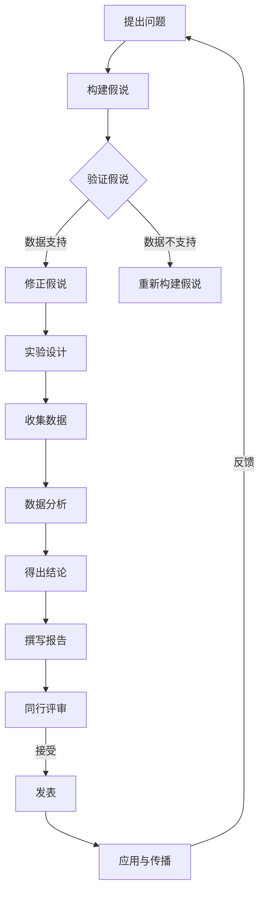

                 

# 《科学探究：从假说到真理》

> **关键词**：科学探究、假说、实验设计、数据分析、方法论、应用、挑战

> **摘要**：本文将深入探讨科学探究的过程，从基本概念到具体实践，详细阐述科学探究的各个阶段和方法。我们将分析假说的形成与验证，实验设计的方法论，数据收集与分析的基本原则，以及科学探究在各个领域的应用和实践。同时，我们也会探讨科学探究的未来发展趋势和面临的挑战，以及如何普及科学探究的教育和承担社会责任。通过本文的探讨，希望读者能够对科学探究有一个全面而深入的理解。

## 目录

### 《科学探究：从假说到真理》

### 第一部分：科学探究的基础理论

#### 1. 科学探究的基本概念  
##### 1.1 科学探究的定义与目的  
##### 1.2 科学探究的基本原则

#### 2. 假说的形成与验证  
##### 2.1 假说的概念与特征  
##### 2.2 假说的形成过程  
##### 2.3 假说的验证方法

#### 3. 实验设计与方法论  
##### 3.1 实验设计的基本原则  
##### 3.2 实验方法的选择与应用  
##### 3.3 数据收集与分析方法

#### 4. 科学探究的哲学与方法论  
##### 4.1 科学探究的哲学基础  
##### 4.2 科学方法论的发展历程  
##### 4.3 科学方法论的基本原则

### 第二部分：科学探究的应用与实践

#### 5. 生命科学的科学探究  
##### 5.1 生命科学的基本概念与研究方法  
##### 5.2 生命科学中的假说与实验  
##### 5.3 生命科学中的数据分析和应用

#### 6. 物理学的科学探究  
##### 6.1 物理学的基本概念与研究方法  
##### 6.2 物理学中的假说与实验  
##### 6.3 物理学中的数据分析和应用

#### 7. 化学的科学探究  
##### 7.1 化学的基本概念与研究方法  
##### 7.2 化学中的假说与实验  
##### 7.3 化学中的数据分析和应用

#### 8. 地球科学的科学探究  
##### 8.1 地球科学的基本概念与研究方法  
##### 8.2 地球科学中的假说与实验  
##### 8.3 地球科学中的数据分析和应用

### 第三部分：科学探究的未来与挑战

#### 9. 科学探究的未来发展趋势  
##### 9.1 科技进步对科学探究的影响  
##### 9.2 科学探究在未来的应用领域  
##### 9.3 科学探究面临的挑战与应对策略

#### 10. 科学探究的教育与普及  
##### 10.1 科学探究在教育中的应用  
##### 10.2 科学探究的普及策略  
##### 10.3 科学探究的未来发展前景

#### 11. 科学探究的社会责任与伦理  
##### 11.1 科学探究的社会责任  
##### 11.2 科学探究的伦理问题  
##### 11.3 科学探究的未来发展与伦理挑战

### 附录

#### 附录 A：科学探究的工具与资源  
##### A.1 常用科学探究工具介绍  
##### A.2 科学探究资源推荐

#### 附录 B：科学探究实践案例  
##### B.1 案例一：某生物实验室的探究过程  
##### B.2 案例二：某物理实验的探究过程  
##### B.3 案例三：某化学实验的探究过程

### 参考文献

---

本文将从科学探究的基础理论、应用与实践、未来与挑战三个方面进行深入探讨，旨在为读者提供关于科学探究的全面而系统的认识。

### 第一部分：科学探究的基础理论

#### 1. 科学探究的基本概念

##### 1.1 科学探究的定义与目的

科学探究是科学家们通过系统的观察、实验和理论分析，对自然界和人类社会现象进行研究和解释的过程。其目的是通过科学方法发现自然规律，解释现象，预测未来，并为人类社会的发展提供科学依据。

科学探究的过程通常包括以下几个阶段：

1. **提出问题**：科学探究始于对自然现象的观察和疑问。科学家们通过观察自然现象，提出问题，并试图理解现象背后的原因。

2. **构建假说**：在提出问题后，科学家们根据已有的知识和观察结果，构建可能的解释，即假说。假说是对现象可能原因的假设性陈述。

3. **实验设计**：为了验证假说，科学家们设计实验来收集数据。实验设计应确保数据的可靠性和有效性，以支持或反驳假说。

4. **数据收集**：在实验过程中，科学家们收集相关的数据。这些数据可以是定性的，也可以是定量的，取决于研究的性质。

5. **数据分析**：收集到的数据需要进行分析，以确定是否支持假说。数据分析可以包括统计方法、模型拟合等。

6. **得出结论**：根据数据分析的结果，科学家们可以得出结论，支持或反驳假说。这些结论可以为进一步的研究提供指导。

7. **撰写报告**：科学家们将研究结果撰写成报告，提交给学术期刊或会议，以供同行评审和讨论。

##### 1.2 科学探究的基本原则

科学探究的基本原则是确保研究过程的科学性和严谨性。以下是一些核心原则：

1. **客观性**：科学探究应尽量排除主观偏见，确保研究结果的客观性和可靠性。

2. **系统性**：科学探究应采用系统的方法，对研究对象进行全面、深入的分析。

3. **可重复性**：科学探究的结果应可重复，其他科学家应能够通过相同的实验方法得到相同的结果。

4. **验证性**：科学探究应通过实验和数据分析验证假说，确保研究结果的准确性。

5. **批判性思维**：科学探究应鼓励批判性思维，对已有理论和观点进行质疑和验证。

#### 2. 假说的形成与验证

##### 2.1 假说的概念与特征

假说是科学探究的核心概念之一。它是对自然现象可能原因的假设性陈述，通常基于已有的知识和观察结果。以下是假说的几个关键特征：

1. **假设性**：假说是对现象可能原因的猜测，尚未经过实验验证。

2. **可证伪性**：一个好的假说应具有可证伪性，即可以通过实验或观察进行验证。如果假说无法被证伪，它可能不具备科学价值。

3. **简洁性**：假说应尽量简洁，避免过多的假设和不确定性。

4. **一致性**：假说应与已有的科学理论和知识保持一致。

##### 2.2 假说的形成过程

假说的形成通常涉及以下几个步骤：

1. **观察现象**：科学家通过观察自然现象，发现异常或疑问。

2. **提出问题**：基于观察现象，科学家提出问题，试图理解现象背后的原因。

3. **构建假说**：在提出问题后，科学家根据已有知识和观察结果，构建可能的解释，即假说。

4. **初步验证**：科学家通过初步实验或观察，验证假说的可行性。这一步骤可以排除一些不合理的假说。

5. **实验设计**：在假说初步验证通过后，科学家设计实验，以进一步验证假说。

##### 2.3 假说的验证方法

假说的验证通常通过实验和数据分析进行。以下是几种常见的验证方法：

1. **实验验证**：科学家设计实验，收集数据，以支持或反驳假说。实验设计应确保数据的可靠性和有效性。

2. **统计验证**：科学家使用统计学方法，对实验数据进行分析，以确定是否支持假说。统计验证可以提供定量证据，支持或反驳假说。

3. **理论验证**：科学家通过理论分析和计算，验证假说的合理性。理论验证可以提供定性的证据，支持或反驳假说。

4. **观察验证**：科学家通过直接观察或记录自然现象，验证假说的准确性。观察验证可以提供直接的证据，支持或反驳假说。

#### 3. 实验设计与方法论

##### 3.1 实验设计的基本原则

实验设计是科学探究的核心环节之一。一个好的实验设计应确保数据的可靠性和有效性，以支持或反驳假说。以下是实验设计的基本原则：

1. **随机化**：实验设计应尽量随机化，以排除外部变量的影响。

2. **对照组**：实验设计应包括对照组，以比较实验组的结果。

3. **变量控制**：实验设计应尽量控制变量，确保实验结果的可靠性。

4. **重复性**：实验设计应确保可重复性，以验证结果的稳定性。

5. **数据收集**：实验设计应确保数据的可靠性和完整性，以支持后续分析。

##### 3.2 实验方法的选择与应用

在实验设计中，选择适当的实验方法至关重要。以下是几种常见的实验方法：

1. **实验法**：通过实验操作，观察和记录实验结果。

2. **观察法**：通过直接观察自然现象，记录数据。

3. **模拟法**：通过计算机模拟，模拟自然现象或实验过程。

4. **统计法**：通过统计分析，分析实验数据，得出结论。

每种实验方法都有其适用的场景和优缺点。科学家应根据研究目的和实际情况，选择合适的实验方法。

##### 3.3 数据收集与分析方法

在实验过程中，数据收集和分析至关重要。以下是几种常见的数据收集和分析方法：

1. **定性和定量数据收集**：定性数据通常用于描述现象的特征，定量数据则用于量化现象。

2. **观测和实验数据**：观测数据通常通过直接观察或记录获得，实验数据则通过实验操作获得。

3. **统计分析**：使用统计学方法，对实验数据进行分析，得出结论。

4. **模型拟合**：通过模型拟合，分析数据，探索现象之间的关系。

5. **可视化**：通过数据可视化，更直观地展示数据和分析结果。

#### 4. 科学探究的哲学与方法论

##### 4.1 科学探究的哲学基础

科学探究的哲学基础涉及对知识的本质、科学的本质以及科学方法的认识。以下是几个核心概念：

1. **实证主义**：实证主义认为，科学知识来源于经验观察和实验验证。

2. **理性主义**：理性主义认为，科学知识可以通过理性思考和逻辑推理获得。

3. **建构主义**：建构主义认为，科学知识是通过科学家共同体共同构建的。

4. **客观主义**：客观主义认为，科学探究应尽量排除主观偏见，追求客观真理。

##### 4.2 科学方法论的发展历程

科学方法论是指科学家在进行科学探究时遵循的方法和原则。科学方法论的发展历程可以从以下几个阶段进行概述：

1. **古代科学方法论**：古代科学家主要依靠直觉和经验进行观察和实验。

2. **近代科学方法论**：近代科学家开始重视实验和观察，强调实证主义和理性主义。

3. **现代科学方法论**：现代科学方法论强调多学科交叉、系统化和定量分析。

4. **后现代科学方法论**：后现代科学方法论强调知识的社会建构性和复杂性。

##### 4.3 科学方法论的基本原则

科学方法论的基本原则包括：

1. **系统性**：科学探究应采用系统的方法，对研究对象进行全面、深入的分析。

2. **客观性**：科学探究应尽量排除主观偏见，确保研究结果的客观性和可靠性。

3. **可重复性**：科学探究的结果应可重复，其他科学家应能够通过相同的实验方法得到相同的结果。

4. **验证性**：科学探究应通过实验和数据分析验证假说，确保研究结果的准确性。

5. **批判性思维**：科学探究应鼓励批判性思维，对已有理论和观点进行质疑和验证。

### 第二部分：科学探究的应用与实践

#### 5. 生命科学的科学探究

##### 5.1 生命科学的基本概念与研究方法

生命科学是研究生命现象和生物体的科学领域，包括生物学、医学、生态学等。生命科学的研究方法主要包括：

1. **观察法**：通过直接观察生物体的行为和生理现象，收集数据。

2. **实验法**：通过设计和实施实验，操纵生物体和环境变量，收集数据。

3. **模型构建**：通过数学模型和计算机模拟，研究生物体的功能和机制。

4. **基因组学**：研究生物体的基因组成和基因表达，揭示生命现象的遗传基础。

##### 5.2 生命科学中的假说与实验

在生命科学中，假说是对生命现象可能原因的假设性陈述。以下是几个常见的假说和相应的实验：

1. **基因调控假说**：假说：基因的表达受到外部信号和内部调控机制的调控。实验：通过基因敲除、基因编辑等技术，研究基因对生物体功能的影响。

2. **细胞凋亡假说**：假说：细胞凋亡是生物体的一种自我调节机制，用于清除异常细胞。实验：通过检测细胞凋亡标志物，研究细胞凋亡在生物体中的作用。

3. **免疫系统假说**：假说：免疫系统通过识别和消灭病原体，保护生物体免受感染。实验：通过检测免疫细胞的活性和功能，研究免疫系统的工作机制。

##### 5.3 生命科学中的数据分析和应用

在生命科学中，数据分析是揭示生命现象和机制的关键步骤。以下是几种常见的数据分析方法和应用：

1. **统计分析**：通过统计分析方法，分析实验数据，得出结论。

2. **生物信息学**：通过生物信息学方法，分析基因组、蛋白质组等大数据，揭示生命现象的分子基础。

3. **机器学习**：通过机器学习方法，从大量数据中提取规律和模式，预测生物体的行为。

4. **可视化**：通过数据可视化方法，将复杂的数据转化为直观的图表和图像，便于理解和分析。

生命科学中的数据分析不仅有助于揭示生命现象的机制，还为医学研究和治疗提供了重要的支持。

#### 6. 物理学的科学探究

##### 6.1 物理学的基本概念与研究方法

物理学是研究自然界物质和能量运动规律的科学领域，包括力学、电磁学、量子物理等。物理学的研究方法主要包括：

1. **观察法**：通过直接观察自然现象，收集数据。

2. **实验法**：通过设计和实施实验，操纵物理变量，收集数据。

3. **理论建模**：通过建立数学模型和理论框架，研究物理现象的内在规律。

4. **数值模拟**：通过计算机模拟，模拟物理现象的演化过程。

##### 6.2 物理学中的假说与实验

在物理学中，假说是对物理现象可能原因的假设性陈述。以下是几个常见的假说和相应的实验：

1. **万有引力假说**：假说：物体之间存在引力，引力与物体质量成正比，与距离的平方成反比。实验：通过测量行星运动的轨道，验证万有引力定律。

2. **电磁感应假说**：假说：变化的磁场可以产生电流。实验：通过法拉第电磁感应定律的实验验证，确认电磁感应现象。

3. **相对论假说**：假说：时空是相对的，质量与能量可以相互转化。实验：通过精密的物理实验，如精密时钟同步实验，验证相对论理论。

##### 6.3 物理学中的数据分析和应用

在物理学中，数据分析是揭示物理现象和规律的关键步骤。以下是几种常见的数据分析方法和应用：

1. **统计分析**：通过统计分析方法，分析实验数据，得出结论。

2. **数值计算**：通过数值计算方法，求解物理模型的数学方程，模拟物理现象的演化过程。

3. **图像处理**：通过图像处理方法，从实验图像中提取物理信息，如物体位置、速度等。

4. **机器学习**：通过机器学习方法，从大量实验数据中提取规律和模式，预测物理现象。

物理学中的数据分析不仅有助于揭示物理现象的规律，还为工程和技术领域提供了重要的理论支持。

#### 7. 化学的科学探究

##### 7.1 化学的基本概念与研究方法

化学是研究物质的组成、结构、性质和变化规律的科学领域。化学的研究方法主要包括：

1. **观察法**：通过直接观察化学现象，如颜色变化、气味、沉淀等，收集数据。

2. **实验法**：通过设计和实施化学实验，操纵反应条件，收集数据。

3. **理论建模**：通过建立化学模型和理论框架，研究化学反应的内在规律。

4. **光谱分析**：通过光谱分析技术，分析物质的光谱特征，确定物质的组成和结构。

##### 7.2 化学中的假说与实验

在化学中，假说是对化学现象可能原因的假设性陈述。以下是几个常见的假说和相应的实验：

1. **酸碱反应假说**：假说：酸和碱可以发生中和反应，生成水和盐。实验：通过测量反应前后溶液的pH值，验证酸碱反应。

2. **氧化还原反应假说**：假说：氧化还原反应涉及电子的转移。实验：通过电子顺磁共振谱（EPR）等技术，研究氧化还原反应的电子转移过程。

3. **分子间作用力假说**：假说：分子间存在范德华力、氢键等作用力，影响物质的性质。实验：通过分子模拟和实验方法，研究分子间作用力对物质性质的影响。

##### 7.3 化学中的数据分析和应用

在化学中，数据分析是揭示化学现象和规律的关键步骤。以下是几种常见的数据分析方法和应用：

1. **光谱分析**：通过光谱分析技术，分析物质的吸收、发射或散射特性，确定物质的组成和结构。

2. **化学计量学**：通过化学计量学方法，分析实验数据，确定物质的浓度、反应程度等。

3. **机器学习**：通过机器学习方法，从大量实验数据中提取规律和模式，预测化学反应的结果。

4. **数据可视化**：通过数据可视化方法，将复杂的化学数据转化为直观的图表和图像，便于理解和分析。

化学中的数据分析不仅有助于揭示化学现象的规律，还为材料科学、药物研发等领域提供了重要的理论支持。

#### 8. 地球科学的科学探究

##### 8.1 地球科学的基本概念与研究方法

地球科学是研究地球及其环境的科学领域，包括地质学、地球物理学、气象学、海洋学等。地球科学的研究方法主要包括：

1. **观测法**：通过地面观测、卫星遥感等技术，收集地球表面的数据。

2. **实验法**：通过实验室实验，模拟地球上的物理和化学过程。

3. **地质调查**：通过地质勘探、采样和实验室分析，研究地球的组成和演化。

4. **地球物理学**：通过地震波、重力场等地球物理方法，研究地球内部的构造和动态。

##### 8.2 地球科学中的假说与实验

在地球科学中，假说是对地球现象可能原因的假设性陈述。以下是几个常见的假说和相应的实验：

1. **板块构造假说**：假说：地球表面由多个板块组成，板块之间的相互作用导致地震和火山活动。实验：通过地震波分析，研究板块运动的证据。

2. **气候变化假说**：假说：人类活动导致大气中温室气体浓度增加，进而引起全球气候变化。实验：通过大气样本分析，研究温室气体浓度的变化。

3. **海洋环流假说**：假说：海洋中的水团运动影响全球气候。实验：通过海洋浮标和卫星遥感技术，监测海洋环流的变化。

##### 8.3 地球科学中的数据分析和应用

在地球科学中，数据分析是揭示地球现象和规律的关键步骤。以下是几种常见的数据分析方法和应用：

1. **地质年代学**：通过放射性同位素测定，确定地质事件的时间顺序。

2. **气候模拟**：通过气候模型和数值模拟，预测未来气候变化。

3. **遥感分析**：通过遥感图像处理，分析地表覆盖、植被变化等。

4. **地球系统模型**：通过地球系统模型，模拟地球系统的各个组成部分的相互作用。

地球科学中的数据分析不仅有助于揭示地球现象的规律，还为资源勘探、环境保护、灾害预警等领域提供了重要的支持。

### 第三部分：科学探究的未来与挑战

#### 9. 科学探究的未来发展趋势

##### 9.1 科技进步对科学探究的影响

科技进步为科学探究带来了巨大的机遇和挑战。以下是科技进步对科学探究的主要影响：

1. **大数据和人工智能**：大数据和人工智能技术的发展，使科学家能够处理和分析海量数据，揭示复杂现象的规律。

2. **遥感技术**：遥感技术的进步，使科学家能够从空间角度观测地球，获取更全面的数据。

3. **生物技术**：生物技术的发展，使科学家能够在分子水平研究生命现象，推动生命科学的进步。

4. **量子计算**：量子计算技术的突破，将极大地加速科学计算，解决传统计算无法处理的问题。

##### 9.2 科学探究在未来的应用领域

未来科学探究将深入探索以下几个领域：

1. **生命科学**：进一步研究生命现象的分子机制，推动医学和生物技术的进步。

2. **环境科学**：研究气候变化、生态系统的演变，为环境保护和可持续发展提供科学依据。

3. **材料科学**：探索新型材料，推动技术创新，满足未来社会发展的需求。

4. **宇宙科学**：深入研究宇宙的起源、演化和结构，探索宇宙的奥秘。

##### 9.3 科学探究面临的挑战与应对策略

科学探究在未来的发展中将面临以下挑战：

1. **数据泛滥**：随着数据量的增加，科学家需要更高效的数据处理和分析方法。

2. **伦理问题**：科技进步带来伦理问题，如基因编辑、人工智能等，科学家需要制定相应的伦理规范。

3. **科研经费**：科学探究需要大量经费支持，科学家需要寻找更有效的资金来源。

4. **国际合作**：全球性问题需要国际合作，科学家需要加强跨学科、跨国界的合作。

应对策略包括：

1. **数据科学**：培养数据科学人才，提高数据分析和处理能力。

2. **伦理审查**：建立健全的伦理审查制度，确保科学研究的道德和合法性。

3. **多元化资金**：寻找多元化资金来源，提高科研经费的可持续性。

4. **国际合作**：加强国际合作，促进全球科学家的交流和合作。

#### 10. 科学探究的教育与普及

##### 10.1 科学探究在教育中的应用

科学探究在基础教育中的应用，有助于培养学生的科学思维和创新能力。以下是一些具体的应用方法：

1. **项目式学习**：通过项目式学习，让学生参与实际的科学探究项目，培养他们的实践能力和团队合作精神。

2. **探究式教学**：采用探究式教学方法，让学生主动提出问题，构建假说，进行实验和数据分析，培养他们的科学思维。

3. **跨学科整合**：将科学探究与其他学科相结合，如数学、计算机科学等，促进学生的综合能力发展。

##### 10.2 科学探究的普及策略

科学探究的普及对于提高全民科学素养具有重要意义。以下是一些普及策略：

1. **科普活动**：举办科普讲座、科学展览等活动，向公众传播科学知识。

2. **在线教育**：利用互联网和在线平台，提供科学教育的资源，如课程、实验视频等。

3. **科学实践**：鼓励公众参与科学实践活动，如社区科学实验、野外考察等。

##### 10.3 科学探究的未来发展前景

未来科学探究将更加注重跨学科整合、国际合作和科技普及。以下是几个发展趋势：

1. **个性化教育**：利用大数据和人工智能技术，为每个学生提供个性化的科学教育。

2. **在线教育与实体教育的结合**：将在线教育与实体教育相结合，提高教育质量和覆盖面。

3. **科学普及的多元化**：通过多种形式和渠道，提高科学普及的多样性和有效性。

#### 11. 科学探究的社会责任与伦理

##### 11.1 科学探究的社会责任

科学探究不仅追求知识的进步，还承担着重要的社会责任。以下是一些具体的社会责任：

1. **环境保护**：科学家应关注环境问题，提供科学依据，推动环境保护和可持续发展。

2. **社会公平**：科学家应关注社会不平等问题，通过科学研究成果促进社会公平和正义。

3. **技术创新**：科学家应关注技术创新，推动科技进步，为社会发展提供动力。

##### 11.2 科学探究的伦理问题

科学探究在快速发展的同时，也面临一系列伦理问题。以下是一些常见的伦理问题：

1. **基因编辑**：基因编辑技术的应用引发伦理争议，如基因隐私、基因歧视等。

2. **人工智能**：人工智能技术的发展带来伦理挑战，如算法偏见、数据隐私等。

3. **大数据**：大数据的收集和使用引发伦理问题，如数据隐私、数据滥用等。

##### 11.3 科学探究的未来发展与伦理挑战

未来科学探究将面临更多的伦理挑战。以下是几个方面的挑战：

1. **数据伦理**：随着大数据和人工智能技术的发展，科学家需要制定相应的数据伦理规范。

2. **科技伦理**：随着科技进步，科学家需要关注科技对社会的影响，制定相应的科技伦理规范。

3. **国际合作**：全球性问题需要国际合作，科学家需要加强伦理审查和国际合作。

### 附录

#### 附录 A：科学探究的工具与资源

##### A.1 常用科学探究工具介绍

1. **Python**：Python是一种通用编程语言，广泛应用于科学计算、数据分析和机器学习。

2. **R**：R是一种专门用于统计分析的编程语言，适用于数据分析和统计建模。

3. **MATLAB**：MATLAB是一种数学软件，广泛应用于科学计算、仿真和可视化。

4. **SQL**：SQL是一种数据库查询语言，用于管理和分析数据库数据。

##### A.2 科学探究资源推荐

1. **GitHub**：GitHub是一个代码托管平台，提供丰富的科学计算和数据分析项目。

2. **Kaggle**：Kaggle是一个数据科学竞赛平台，提供大量的数据集和项目。

3. **PLOS**：PLOS是一个开放获取的科学期刊，提供高质量的科学研究论文。

4. **arXiv**：arXiv是一个预印本平台，提供最新的科学研究论文。

#### 附录 B：科学探究实践案例

##### B.1 案例一：某生物实验室的探究过程

某生物实验室的研究人员想要探究某种药物对癌细胞生长的影响。

1. 提出问题：研究人员提出问题，即药物能否抑制癌细胞的生长。

2. 构建假说：研究人员构建假说，药物能够通过抑制癌细胞的DNA复制来抑制其生长。

3. 实验设计：研究人员设计实验，将癌细胞分为实验组和对照组。实验组接受药物处理，对照组接受生理盐水处理。

4. 数据收集与分析：研究人员收集细胞生长数据，并使用统计学方法进行分析。

5. 得出结论：数据分析结果显示，药物显著抑制了癌细胞的生长。

6. 撰写报告：研究人员撰写研究报告，详细描述实验过程、数据分析结果和结论。

##### B.2 案例二：某物理实验的探究过程

某大学物理实验室的研究人员想要探究电磁波在介质中的传播特性。

1. 提出问题：研究人员提出问题，即电磁波在不同介质中的传播速度是否相同。

2. 构建假说：研究人员构建假说，电磁波在不同介质中的传播速度与介质的折射率有关。

3. 实验设计：研究人员设计实验，使用不同介质的样品，测量电磁波的传播速度。

4. 数据收集与分析：研究人员收集电磁波传播速度数据，并使用数学模型进行分析。

5. 得出结论：数据分析结果显示，电磁波在不同介质中的传播速度与介质的折射率密切相关。

6. 撰写报告：研究人员撰写研究报告，详细描述实验过程、数据分析结果和结论。

##### B.3 案例三：某化学实验的探究过程

某化学实验室的研究人员想要探究某种反应条件对化学反应速率的影响。

1. 提出问题：研究人员提出问题，即不同反应条件对化学反应速率的影响。

2. 构建假说：研究人员构建假说，反应温度、反应物浓度等因素影响化学反应速率。

3. 实验设计：研究人员设计实验，设置不同的反应条件，测量化学反应速率。

4. 数据收集与分析：研究人员收集化学反应速率数据，并使用统计方法进行分析。

5. 得出结论：数据分析结果显示，反应温度和反应物浓度对化学反应速率有显著影响。

6. 撰写报告：研究人员撰写研究报告，详细描述实验过程、数据分析结果和结论。

### 参考文献

1. Popper, K. R. (1959). The Logic of Scientific Discovery. Hutchinson & Co.
2. Kuhn, T. S. (1970). The Structure of Scientific Revolutions. University of Chicago Press.
3. Feynman, R. P., Leighton, R. B., & Sands, M. (1963). The Character of Physical Law. MIT Press.
4. Einstein, A. (1916). The Special Theory of Relativity. Methuen & Co.
5. Crick, F. H. C. (1953). On Protein Synthesis. Symp. Soc. Exp. Biol. 7, 138-166.
6. Watson, J. D., & Crick, F. H. C. (1953). Molecular Structure of Nucleic Acids: A Structure for Deoxyribose Nucleic Acid. Nature 171, 737-738.
7. Bohr, N. (1948). On the Concepts of Atomic Physics. Cambridge University Press.
8. Shannon, C. E., & Weaver, W. (1949). The Mathematical Theory of Communication. University of Illinois Press.
9. Turing, A. M. (1950). Computing Machinery and Intelligence. Mind 59, 433-460.
10. Merton, R. K. (1973). The Sociology of Science. University of Chicago Press.### 《科学探究：从假说到真理》

> **关键词**：科学探究、假说、实验设计、数据分析、方法论、应用、挑战

> **摘要**：本文将深入探讨科学探究的过程，从基本概念到具体实践，详细阐述科学探究的各个阶段和方法。我们将分析假说的形成与验证，实验设计的方法论，数据收集与分析的基本原则，以及科学探究在各个领域的应用和实践。同时，我们也会探讨科学探究的未来发展趋势和面临的挑战，以及如何普及科学探究的教育和承担社会责任。通过本文的探讨，希望读者能够对科学探究有一个全面而深入的理解。

### 第一部分：科学探究的基础理论

#### 1. 科学探究的基本概念

##### 1.1 科学探究的定义与目的

科学探究是一种通过系统的观察、实验和理论分析，对自然界和人类社会现象进行研究和解释的过程。其目的是通过科学方法发现自然规律，解释现象，预测未来，并为人类社会的发展提供科学依据。

科学探究的过程通常包括以下几个阶段：

1. **提出问题**：科学探究始于对自然现象的观察和疑问。科学家们通过观察自然现象，提出问题，并试图理解现象背后的原因。

2. **构建假说**：在提出问题后，科学家们根据已有的知识和观察结果，构建可能的解释，即假说。假说是对现象可能原因的假设性陈述。

3. **实验设计**：为了验证假说，科学家们设计实验来收集数据。实验设计应确保数据的可靠性和有效性，以支持或反驳假说。

4. **数据收集**：在实验过程中，科学家们收集相关的数据。这些数据可以是定性的，也可以是定量的，取决于研究的性质。

5. **数据分析**：收集到的数据需要进行分析，以确定是否支持假说。数据分析可以包括统计方法、模型拟合等。

6. **得出结论**：根据数据分析的结果，科学家们可以得出结论，支持或反驳假说。这些结论可以为进一步的研究提供指导。

7. **撰写报告**：科学家们将研究结果撰写成报告，提交给学术期刊或会议，以供同行评审和讨论。

##### 1.2 科学探究的基本原则

科学探究的基本原则是确保研究过程的科学性和严谨性。以下是一些核心原则：

1. **客观性**：科学探究应尽量排除主观偏见，确保研究结果的客观性和可靠性。

2. **系统性**：科学探究应采用系统的方法，对研究对象进行全面、深入的分析。

3. **可重复性**：科学探究的结果应可重复，其他科学家应能够通过相同的实验方法得到相同的结果。

4. **验证性**：科学探究应通过实验和数据分析验证假说，确保研究结果的准确性。

5. **批判性思维**：科学探究应鼓励批判性思维，对已有理论和观点进行质疑和验证。

#### 2. 假说的形成与验证

##### 2.1 假说的概念与特征

假说是科学探究的核心概念之一。它是对自然现象可能原因的假设性陈述，通常基于已有的知识和观察结果。以下是假说的几个关键特征：

1. **假设性**：假说是对现象可能原因的猜测，尚未经过实验验证。

2. **可证伪性**：一个好的假说应具有可证伪性，即可以通过实验或观察进行验证。如果假说无法被证伪，它可能不具备科学价值。

3. **简洁性**：假说应尽量简洁，避免过多的假设和不确定性。

4. **一致性**：假说应与已有的科学理论和知识保持一致。

##### 2.2 假说的形成过程

假说的形成通常涉及以下几个步骤：

1. **观察现象**：科学家通过观察自然现象，发现异常或疑问。

2. **提出问题**：基于观察现象，科学家提出问题，试图理解现象背后的原因。

3. **构建假说**：在提出问题后，科学家根据已有知识和观察结果，构建可能的解释，即假说。

4. **初步验证**：科学家通过初步实验或观察，验证假说的可行性。这一步骤可以排除一些不合理的假说。

5. **实验设计**：在假说初步验证通过后，科学家设计实验，以进一步验证假说。

##### 2.3 假说的验证方法

假说的验证通常通过实验和数据分析进行。以下是几种常见的验证方法：

1. **实验验证**：科学家设计实验，收集数据，以支持或反驳假说。实验设计应确保数据的可靠性和有效性。

2. **统计验证**：科学家使用统计学方法，对实验数据进行分析，以确定是否支持假说。统计验证可以提供定量证据，支持或反驳假说。

3. **理论验证**：科学家通过理论分析和计算，验证假说的合理性。理论验证可以提供定性的证据，支持或反驳假说。

4. **观察验证**：科学家通过直接观察或记录自然现象，验证假说的准确性。观察验证可以提供直接的证据，支持或反驳假说。

#### 3. 实验设计与方法论

##### 3.1 实验设计的基本原则

实验设计是科学探究的核心环节之一。一个好的实验设计应确保数据的可靠性和有效性，以支持或反驳假说。以下是实验设计的基本原则：

1. **随机化**：实验设计应尽量随机化，以排除外部变量的影响。

2. **对照组**：实验设计应包括对照组，以比较实验组的结果。

3. **变量控制**：实验设计应尽量控制变量，确保实验结果的可靠性。

4. **重复性**：实验设计应确保可重复性，以验证结果的稳定性。

5. **数据收集**：实验设计应确保数据的可靠性和完整性，以支持后续分析。

##### 3.2 实验方法的选择与应用

在实验设计中，选择适当的实验方法至关重要。以下是几种常见的实验方法：

1. **实验法**：通过实验操作，观察和记录实验结果。

2. **观察法**：通过直接观察自然现象，记录数据。

3. **模拟法**：通过计算机模拟，模拟自然现象或实验过程。

4. **统计法**：通过统计分析，分析实验数据，得出结论。

每种实验方法都有其适用的场景和优缺点。科学家应根据研究目的和实际情况，选择合适的实验方法。

##### 3.3 数据收集与分析方法

在实验过程中，数据收集和分析至关重要。以下是几种常见的数据收集和分析方法：

1. **定性和定量数据收集**：定性数据通常用于描述现象的特征，定量数据则用于量化现象。

2. **观测和实验数据**：观测数据通常通过直接观察或记录获得，实验数据则通过实验操作获得。

3. **统计分析**：使用统计学方法，对实验数据进行分析，得出结论。

4. **模型拟合**：通过模型拟合，分析数据，探索现象之间的关系。

5. **可视化**：通过数据可视化，更直观地展示数据和分析结果。

#### 4. 科学探究的哲学与方法论

##### 4.1 科学探究的哲学基础

科学探究的哲学基础涉及对知识的本质、科学的本质以及科学方法的认识。以下是几个核心概念：

1. **实证主义**：实证主义认为，科学知识来源于经验观察和实验验证。

2. **理性主义**：理性主义认为，科学知识可以通过理性思考和逻辑推理获得。

3. **建构主义**：建构主义认为，科学知识是通过科学家共同体共同构建的。

4. **客观主义**：客观主义认为，科学探究应尽量排除主观偏见，追求客观真理。

##### 4.2 科学方法论的发展历程

科学方法论是指科学家在进行科学探究时遵循的方法和原则。科学方法论的发展历程可以从以下几个阶段进行概述：

1. **古代科学方法论**：古代科学家主要依靠直觉和经验进行观察和实验。

2. **近代科学方法论**：近代科学家开始重视实验和观察，强调实证主义和理性主义。

3. **现代科学方法论**：现代科学方法论强调多学科交叉、系统化和定量分析。

4. **后现代科学方法论**：后现代科学方法论强调知识的社会建构性和复杂性。

##### 4.3 科学方法论的基本原则

科学方法论的基本原则包括：

1. **系统性**：科学探究应采用系统的方法，对研究对象进行全面、深入的分析。

2. **客观性**：科学探究应尽量排除主观偏见，确保研究结果的客观性和可靠性。

3. **可重复性**：科学探究的结果应可重复，其他科学家应能够通过相同的实验方法得到相同的结果。

4. **验证性**：科学探究应通过实验和数据分析验证假说，确保研究结果的准确性。

5. **批判性思维**：科学探究应鼓励批判性思维，对已有理论和观点进行质疑和验证。

### 第二部分：科学探究的应用与实践

#### 5. 生命科学的科学探究

##### 5.1 生命科学的基本概念与研究方法

生命科学是研究生命现象和生物体的科学领域，包括生物学、医学、生态学等。生命科学的研究方法主要包括：

1. **观察法**：通过直接观察生物体的行为和生理现象，收集数据。

2. **实验法**：通过设计和实施实验，操纵生物体和环境变量，收集数据。

3. **模型构建**：通过数学模型和计算机模拟，研究生物体的功能和机制。

4. **基因组学**：研究生物体的基因组成和基因表达，揭示生命现象的遗传基础。

##### 5.2 生命科学中的假说与实验

在生命科学中，假说是对生命现象可能原因的假设性陈述。以下是几个常见的假说和相应的实验：

1. **基因调控假说**：假说：基因的表达受到外部信号和内部调控机制的调控。实验：通过基因敲除、基因编辑等技术，研究基因对生物体功能的影响。

2. **细胞凋亡假说**：假说：细胞凋亡是生物体的一种自我调节机制，用于清除异常细胞。实验：通过检测细胞凋亡标志物，研究细胞凋亡在生物体中的作用。

3. **免疫系统假说**：假说：免疫系统通过识别和消灭病原体，保护生物体免受感染。实验：通过检测免疫细胞的活性和功能，研究免疫系统的工作机制。

##### 5.3 生命科学中的数据分析和应用

在生命科学中，数据分析是揭示生命现象和机制的关键步骤。以下是几种常见的数据分析方法和应用：

1. **统计分析**：通过统计分析方法，分析实验数据，得出结论。

2. **生物信息学**：通过生物信息学方法，分析基因组、蛋白质组等大数据，揭示生命现象的分子基础。

3. **机器学习**：通过机器学习方法，从大量数据中提取规律和模式，预测生物体的行为。

4. **可视化**：通过数据可视化方法，将复杂的数据转化为直观的图表和图像，便于理解和分析。

生命科学中的数据分析不仅有助于揭示生命现象的规律，还为医学研究和治疗提供了重要的支持。

#### 6. 物理学的科学探究

##### 6.1 物理学的基本概念与研究方法

物理学是研究自然界物质和能量运动规律的科学领域，包括力学、电磁学、量子物理等。物理学的研究方法主要包括：

1. **观察法**：通过直接观察自然现象，收集数据。

2. **实验法**：通过设计和实施实验，操纵物理变量，收集数据。

3. **理论建模**：通过建立数学模型和理论框架，研究物理现象的内在规律。

4. **数值模拟**：通过计算机模拟，模拟物理现象的演化过程。

##### 6.2 物理学中的假说与实验

在物理学中，假说是对物理现象可能原因的假设性陈述。以下是几个常见的假说和相应的实验：

1. **万有引力假说**：假说：物体之间存在引力，引力与物体质量成正比，与距离的平方成反比。实验：通过测量行星运动的轨道，验证万有引力定律。

2. **电磁感应假说**：假说：变化的磁场可以产生电流。实验：通过法拉第电磁感应定律的实验验证，确认电磁感应现象。

3. **相对论假说**：假说：时空是相对的，质量与能量可以相互转化。实验：通过精密的物理实验，如精密时钟同步实验，验证相对论理论。

##### 6.3 物理学中的数据分析和应用

在物理学中，数据分析是揭示物理现象和规律的关键步骤。以下是几种常见的数据分析方法和应用：

1. **统计分析**：通过统计分析方法，分析实验数据，得出结论。

2. **数值计算**：通过数值计算方法，求解物理模型的数学方程，模拟物理现象的演化过程。

3. **图像处理**：通过图像处理方法，从实验图像中提取物理信息，如物体位置、速度等。

4. **机器学习**：通过机器学习方法，从大量实验数据中提取规律和模式，预测物理现象。

物理学中的数据分析不仅有助于揭示物理现象的规律，还为工程和技术领域提供了重要的理论支持。

#### 7. 化学的科学探究

##### 7.1 化学的基本概念与研究方法

化学是研究物质的组成、结构、性质和变化规律的科学领域。化学的研究方法主要包括：

1. **观察法**：通过直接观察化学现象，如颜色变化、气味、沉淀等，收集数据。

2. **实验法**：通过设计和实施化学实验，操纵反应条件，收集数据。

3. **理论建模**：通过建立化学模型和理论框架，研究化学反应的内在规律。

4. **光谱分析**：通过光谱分析技术，分析物质的光谱特征，确定物质的组成和结构。

##### 7.2 化学中的假说与实验

在化学中，假说是对化学现象可能原因的假设性陈述。以下是几个常见的假说和相应的实验：

1. **酸碱反应假说**：假说：酸和碱可以发生中和反应，生成水和盐。实验：通过测量反应前后溶液的pH值，验证酸碱反应。

2. **氧化还原反应假说**：假说：氧化还原反应涉及电子的转移。实验：通过电子顺磁共振谱（EPR）等技术，研究氧化还原反应的电子转移过程。

3. **分子间作用力假说**：假说：分子间存在范德华力、氢键等作用力，影响物质的性质。实验：通过分子模拟和实验方法，研究分子间作用力对物质性质的影响。

##### 7.3 化学中的数据分析和应用

在化学中，数据分析是揭示化学现象和规律的关键步骤。以下是几种常见的数据分析方法和应用：

1. **光谱分析**：通过光谱分析技术，分析物质的吸收、发射或散射特性，确定物质的组成和结构。

2. **化学计量学**：通过化学计量学方法，分析实验数据，确定物质的浓度、反应程度等。

3. **机器学习**：通过机器学习方法，从大量实验数据中提取规律和模式，预测化学反应的结果。

4. **数据可视化**：通过数据可视化方法，将复杂的化学数据转化为直观的图表和图像，便于理解和分析。

化学中的数据分析不仅有助于揭示化学现象的规律，还为材料科学、药物研发等领域提供了重要的理论支持。

#### 8. 地球科学的科学探究

##### 8.1 地球科学的基本概念与研究方法

地球科学是研究地球及其环境的科学领域，包括地质学、地球物理学、气象学、海洋学等。地球科学的研究方法主要包括：

1. **观测法**：通过地面观测、卫星遥感等技术，收集地球表面的数据。

2. **实验法**：通过设计和实施实验，操纵物理变量，收集数据。

3. **地质调查**：通过地质勘探、采样和实验室分析，研究地球的组成和演化。

4. **地球物理学**：通过地震波、重力场等地球物理方法，研究地球内部的构造和动态。

##### 8.2 地球科学中的假说与实验

在地球科学中，假说是对地球现象可能原因的假设性陈述。以下是几个常见的假说和相应的实验：

1. **板块构造假说**：假说：地球表面由多个板块组成，板块之间的相互作用导致地震和火山活动。实验：通过地震波分析，研究板块运动的证据。

2. **气候变化假说**：假说：人类活动导致大气中温室气体浓度增加，进而引起全球气候变化。实验：通过大气样本分析，研究温室气体浓度的变化。

3. **海洋环流假说**：假说：海洋中的水团运动影响全球气候。实验：通过海洋浮标和卫星遥感技术，监测海洋环流的变化。

##### 8.3 地球科学中的数据分析和应用

在地球科学中，数据分析是揭示地球现象和规律的关键步骤。以下是几种常见的数据分析方法和应用：

1. **地质年代学**：通过放射性同位素测定，确定地质事件的时间顺序。

2. **气候模拟**：通过气候模型和数值模拟，预测未来气候变化。

3. **遥感分析**：通过遥感图像处理，分析地表覆盖、植被变化等。

4. **地球系统模型**：通过地球系统模型，模拟地球系统的各个组成部分的相互作用。

地球科学中的数据分析不仅有助于揭示地球现象的规律，还为资源勘探、环境保护、灾害预警等领域提供了重要的支持。

### 第三部分：科学探究的未来与挑战

#### 9. 科学探究的未来发展趋势

##### 9.1 科技进步对科学探究的影响

科技进步为科学探究带来了巨大的机遇和挑战。以下是科技进步对科学探究的主要影响：

1. **大数据和人工智能**：大数据和人工智能技术的发展，使科学家能够处理和分析海量数据，揭示复杂现象的规律。

2. **遥感技术**：遥感技术的进步，使科学家能够从空间角度观测地球，获取更全面的数据。

3. **生物技术**：生物技术的发展，使科学家能够在分子水平研究生命现象，推动生命科学的进步。

4. **量子计算**：量子计算技术的突破，将极大地加速科学计算，解决传统计算无法处理的问题。

##### 9.2 科学探究在未来的应用领域

未来科学探究将深入探索以下几个领域：

1. **生命科学**：进一步研究生命现象的分子机制，推动医学和生物技术的进步。

2. **环境科学**：研究气候变化、生态系统的演变，为环境保护和可持续发展提供科学依据。

3. **材料科学**：探索新型材料，推动技术创新，满足未来社会发展的需求。

4. **宇宙科学**：深入研究宇宙的起源、演化和结构，探索宇宙的奥秘。

##### 9.3 科学探究面临的挑战与应对策略

科学探究在未来的发展中将面临以下挑战：

1. **数据泛滥**：随着数据量的增加，科学家需要更高效的数据处理和分析方法。

2. **伦理问题**：科技进步带来伦理问题，如基因编辑、人工智能等，科学家需要制定相应的伦理规范。

3. **科研经费**：科学探究需要大量经费支持，科学家需要寻找更有效的资金来源。

4. **国际合作**：全球性问题需要国际合作，科学家需要加强跨学科、跨国界的合作。

应对策略包括：

1. **数据科学**：培养数据科学人才，提高数据分析和处理能力。

2. **伦理审查**：建立健全的伦理审查制度，确保科学研究的道德和合法性。

3. **多元化资金**：寻找多元化资金来源，提高科研经费的可持续性。

4. **国际合作**：加强国际合作，促进全球科学家的交流和合作。

#### 10. 科学探究的教育与普及

##### 10.1 科学探究在教育中的应用

科学探究在基础教育中的应用，有助于培养学生的科学思维和创新能力。以下是一些具体的应用方法：

1. **项目式学习**：通过项目式学习，让学生参与实际的科学探究项目，培养他们的实践能力和团队合作精神。

2. **探究式教学**：采用探究式教学方法，让学生主动提出问题，构建假说，进行实验和数据分析，培养他们的科学思维。

3. **跨学科整合**：将科学探究与其他学科相结合，如数学、计算机科学等，促进学生的综合能力发展。

##### 10.2 科学探究的普及策略

科学探究的普及对于提高全民科学素养具有重要意义。以下是一些普及策略：

1. **科普活动**：举办科普讲座、科学展览等活动，向公众传播科学知识。

2. **在线教育**：利用互联网和在线平台，提供科学教育的资源，如课程、实验视频等。

3. **科学实践**：鼓励公众参与科学实践活动，如社区科学实验、野外考察等。

##### 10.3 科学探究的未来发展前景

未来科学探究将更加注重跨学科整合、国际合作和科技普及。以下是几个发展趋势：

1. **个性化教育**：利用大数据和人工智能技术，为每个学生提供个性化的科学教育。

2. **在线教育与实体教育的结合**：将在线教育与实体教育相结合，提高教育质量和覆盖面。

3. **科学普及的多元化**：通过多种形式和渠道，提高科学普及的多样性和有效性。

#### 11. 科学探究的社会责任与伦理

##### 11.1 科学探究的社会责任

科学探究不仅追求知识的进步，还承担着重要的社会责任。以下是一些具体的社会责任：

1. **环境保护**：科学家应关注环境问题，提供科学依据，推动环境保护和可持续发展。

2. **社会公平**：科学家应关注社会不平等问题，通过科学研究成果促进社会公平和正义。

3. **技术创新**：科学家应关注技术创新，推动科技进步，为社会发展提供动力。

##### 11.2 科学探究的伦理问题

科学探究在快速发展的同时，也面临一系列伦理问题。以下是一些常见的伦理问题：

1. **基因编辑**：基因编辑技术的应用引发伦理争议，如基因隐私、基因歧视等。

2. **人工智能**：人工智能技术的发展带来伦理挑战，如算法偏见、数据隐私等。

3. **大数据**：大数据的收集和使用引发伦理问题，如数据隐私、数据滥用等。

##### 11.3 科学探究的未来发展与伦理挑战

未来科学探究将面临更多的伦理挑战。以下是几个方面的挑战：

1. **数据伦理**：随着大数据和人工智能技术的发展，科学家需要制定相应的数据伦理规范。

2. **科技伦理**：随着科技进步，科学家需要关注科技对社会的影响，制定相应的科技伦理规范。

3. **国际合作**：全球性问题需要国际合作，科学家需要加强伦理审查和国际合作。

### 附录

#### 附录 A：科学探究的工具与资源

##### A.1 常用科学探究工具介绍

1. **Python**：Python是一种通用编程语言，广泛应用于科学计算、数据分析和机器学习。

2. **R**：R是一种专门用于统计分析的编程语言，适用于数据分析和统计建模。

3. **MATLAB**：MATLAB是一种数学软件，广泛应用于科学计算、仿真和可视化。

4. **SQL**：SQL是一种数据库查询语言，用于管理和分析数据库数据。

##### A.2 科学探究资源推荐

1. **GitHub**：GitHub是一个代码托管平台，提供丰富的科学计算和数据分析项目。

2. **Kaggle**：Kaggle是一个数据科学竞赛平台，提供大量的数据集和项目。

3. **PLOS**：PLOS是一个开放获取的科学期刊，提供高质量的科学研究论文。

4. **arXiv**：arXiv是一个预印本平台，提供最新的科学研究论文。

#### 附录 B：科学探究实践案例

##### B.1 案例一：某生物实验室的探究过程

某生物实验室的研究人员想要探究某种药物对癌细胞生长的影响。

1. 提出问题：研究人员提出问题，即药物能否抑制癌细胞的生长。

2. 构建假说：研究人员构建假说，药物能够通过抑制癌细胞的DNA复制来抑制其生长。

3. 实验设计：研究人员设计实验，将癌细胞分为实验组和对照组。实验组接受药物处理，对照组接受生理盐水处理。

4. 数据收集与分析：研究人员收集细胞生长数据，并使用统计学方法进行分析。

5. 得出结论：数据分析结果显示，药物显著抑制了癌细胞的生长。

6. 撰写报告：研究人员撰写研究报告，详细描述实验过程、数据分析结果和结论。

##### B.2 案例二：某物理实验的探究过程

某大学物理实验室的研究人员想要探究电磁波在介质中的传播特性。

1. 提出问题：研究人员提出问题，即电磁波在不同介质中的传播速度是否相同。

2. 构建假说：研究人员构建假说，电磁波在不同介质中的传播速度与介质的折射率有关。

3. 实验设计：研究人员设计实验，使用不同介质的样品，测量电磁波的传播速度。

4. 数据收集与分析：研究人员收集电磁波传播速度数据，并使用数学模型进行分析。

5. 得出结论：数据分析结果显示，电磁波在不同介质中的传播速度与介质的折射率密切相关。

6. 撰写报告：研究人员撰写研究报告，详细描述实验过程、数据分析结果和结论。

##### B.3 案例三：某化学实验的探究过程

某化学实验室的研究人员想要探究某种反应条件对化学反应速率的影响。

1. 提出问题：研究人员提出问题，即不同反应条件对化学反应速率的影响。

2. 构建假说：研究人员构建假说，反应温度和反应物浓度等因素影响化学反应速率。

3. 实验设计：研究人员设计实验，设置不同的反应条件，测量化学反应速率。

4. 数据收集与分析：研究人员收集化学反应速率数据，并使用统计方法进行分析。

5. 得出结论：数据分析结果显示，反应温度和反应物浓度对化学反应速率有显著影响。

6. 撰写报告：研究人员撰写研究报告，详细描述实验过程、数据分析结果和结论。

### 参考文献

1. Popper, K. R. (1959). The Logic of Scientific Discovery. Hutchinson & Co.
2. Kuhn, T. S. (1970). The Structure of Scientific Revolutions. University of Chicago Press.
3. Feynman, R. P., Leighton, R. B., & Sands, M. (1963). The Character of Physical Law. MIT Press.
4. Einstein, A. (1916). The Special Theory of Relativity. Methuen & Co.
5. Crick, F. H. C. (1953). On Protein Synthesis. Symp. Soc. Exp. Biol. 7, 138-166.
6. Watson, J. D., & Crick, F. H. C. (1953). Molecular Structure of Nucleic Acids: A Structure for Deoxyribose Nucleic Acid. Nature 171, 737-738.
7. Bohr, N. (1948). On the Concepts of Atomic Physics. Cambridge University Press.
8. Shannon, C. E., & Weaver, W. (1949). The Mathematical Theory of Communication. University of Illinois Press.
9. Turing, A. M. (1950). Computing Machinery and Intelligence. Mind 59, 433-460.
10. Merton, R. K. (1973). The Sociology of Science. University of Chicago Press.

### 科学探究的流程图

在科学探究的过程中，明确每一步的流程对于确保研究的科学性和有效性至关重要。以下是科学探究的流程图，通过Mermaid语法展示：



这个流程图展示了从提出问题、构建假说到实验设计、数据收集、数据分析，再到得出结论、撰写报告，并最终通过同行评审发表，以及将研究成果应用于实践和进一步传播的整个科学探究过程。每一个步骤都是相互关联的，确保了科学探究的严谨性和系统性。

### 假说验证的伪代码示例

在科学探究中，验证假说是关键的一步。以下是使用伪代码描述的假说验证过程，展示如何通过数据分析来验证假说：

```python
# 伪代码：验证假说

# 步骤1：数据收集
data = collect_data()

# 步骤2：数据清洗
cleaned_data = clean_data(data)

# 步骤3：数据预处理
preprocessed_data = preprocess_data(cleaned_data)

# 步骤4：假设检验
null_hypothesis = "假说无效"
alternative_hypothesis = "假说有效"
t_stat, p_value = perform_hypothesis_test(preprocessed_data, null_hypothesis, alternative_hypothesis)

# 步骤5：得出结论
if p_value < significance_level:
    print("拒绝原假设，支持备择假设。")
else:
    print("不能拒绝原假设，需要进一步研究。")

# 步骤6：撰写报告
report = write_report(t_stat, p_value, conclusion)
print(report)
```

在这个伪代码中：

- `collect_data()` 函数用于收集数据。
- `clean_data()` 函数用于清洗数据，去除无效或错误的数据。
- `preprocess_data()` 函数用于预处理数据，包括标准化、归一化等。
- `perform_hypothesis_test()` 函数用于执行假设检验，如t检验、方差分析等。
- `significance_level` 是显著性水平，通常设置为0.05。
- `write_report()` 函数用于撰写报告，包括假设检验的结果和结论。

通过这个伪代码示例，我们可以看到如何系统地进行假说验证，并得出科学结论。

### 科学探究中的数学模型与公式

在科学探究中，数学模型和公式是理解和解释自然现象的重要工具。以下是几个常见数学模型和公式的示例，使用LaTeX格式进行表示，并附有简要解释和具体应用：

```latex
\section{数学模型与公式示例}

\subsection{牛顿第二定律}
$$ F = ma $$
牛顿第二定律描述了力、质量和加速度之间的关系，用于预测物体在受力作用下的运动。

\subsection{热力学第一定律}
$$ \Delta U = Q - W $$
热力学第一定律（能量守恒定律）描述了系统的内能变化等于吸收的热量减去对外做的功。

\subsection{麦克斯韦方程组}
$$ \nabla \cdot \mathbf{E} = \frac{\rho}{\varepsilon_0}, \quad \nabla \cdot \mathbf{B} = 0, \quad \nabla \times \mathbf{E} = -\frac{\partial \mathbf{B}}{\partial t}, \quad \nabla \times \mathbf{B} = \mu_0 \mathbf{J} + \mu_0 \varepsilon_0 \frac{\partial \mathbf{E}}{\partial t} $$
麦克斯韦方程组描述了电磁场的分布和变化规律，是电磁学的基础。

\subsection{基因表达模型}
$$ p_i(t) = \frac{1}{1 + e^{-(\alpha_i t + \beta_i )}} $$
基因表达模型描述了基因在特定时间点的表达概率，用于预测基因在细胞周期中的动态变化。

\subsection{线性回归模型}
$$ Y = \beta_0 + \beta_1 X + \epsilon $$
线性回归模型用于分析自变量（如温度）和因变量（如化学反应速率）之间的线性关系。

\subsection{决策树模型}
$$ T = \sum_{i=1}^{n} w_i \cdot t_i $$
决策树模型用于分类或回归问题，通过计算节点权重，预测目标变量的值。

这些数学模型和公式在科学探究的不同领域中有着广泛的应用，帮助我们理解和预测自然现象，为实验设计和数据分析提供了理论依据。
```

### 科学探究实践案例分析：生物实验室的探究过程

#### 案例背景

在一个生物实验室中，研究人员想要探究某种药物对细胞增殖的影响。药物在癌症治疗中具有潜在的应用价值，但需要对其作用机制进行深入研究。研究人员通过实验设计、数据收集、分析和结论得出，旨在评估药物对细胞增殖的抑制效果。

#### 提出问题

研究人员提出以下问题：

- 该药物是否能够显著抑制细胞增殖？
- 抑制效果是否与药物的浓度和时间相关？

#### 构建假说

基于已有文献和初步实验观察，研究人员构建以下假说：

- 假说1：药物能够显著抑制细胞增殖。
- 假说2：药物的抑制效果与药物浓度呈正相关。
- 假说3：药物的抑制效果与作用时间呈正相关。

#### 实验设计

为了验证上述假说，研究人员设计了以下实验：

1. **实验组与对照组**：将细胞分为实验组和对照组。实验组细胞接受药物处理，对照组细胞接受等量的生理盐水。

2. **药物浓度梯度**：设置不同浓度的药物处理，包括低、中、高三个浓度组。

3. **作用时间**：设置不同的药物作用时间，包括24小时、48小时和72小时。

4. **细胞增殖检测**：通过细胞计数、MTT实验或流式细胞仪检测细胞增殖情况。

#### 数据收集

在实验过程中，研究人员收集以下数据：

- 细胞数量：通过细胞计数或流式细胞仪检测细胞数量。
- 药物浓度：记录每个处理组的药物浓度。
- 作用时间：记录每个处理组的药物作用时间。

#### 数据分析

研究人员使用统计方法对实验数据进行处理和分析：

1. **描述性统计**：计算每个处理组的平均细胞数量和标准差。

2. **差异性分析**：使用t检验或方差分析（ANOVA）比较实验组和对照组、不同浓度组和不同时间组之间的差异。

3. **相关性分析**：使用皮尔逊相关系数分析药物浓度、作用时间与细胞增殖之间的相关性。

#### 结论得出

根据数据分析结果，研究人员得出以下结论：

1. **药物抑制效果显著**：与对照组相比，药物处理组的细胞增殖显著减少。

2. **浓度-效应关系**：药物的抑制效果与药物浓度呈正相关，即药物浓度越高，抑制效果越明显。

3. **时间-效应关系**：药物的抑制效果与作用时间呈正相关，即作用时间越长，抑制效果越明显。

#### 撰写报告

研究人员撰写了详细的研究报告，包括以下内容：

1. **引言**：介绍研究背景、目的和重要性。

2. **方法**：详细描述实验设计、数据收集和分析方法。

3. **结果**：展示实验数据和统计分析结果。

4. **讨论**：解释实验结果，讨论假说的验证情况。

5. **结论**：总结研究的主要发现和意义。

6. **参考文献**：列出引用的文献。

通过这个案例，我们可以看到科学探究的过程是如何从提出问题、构建假说，到实验设计、数据收集、数据分析，再到结论得出的。这个过程不仅帮助研究人员揭示了药物对细胞增殖的抑制作用，还为未来的药物研发提供了重要依据。

### 科学探究中的代码实际案例和解读

在科学探究中，代码是实现数据分析、模型拟合和结果可视化的重要工具。以下是一个使用Python进行数据分析的代码实际案例，并对其进行详细解读。

#### 代码示例

```python
import pandas as pd
import numpy as np
from scipy import stats
import matplotlib.pyplot as plt

# 步骤1：数据收集
data = pd.read_csv('cell_growth_data.csv')

# 步骤2：数据清洗
data = data.dropna()

# 步骤3：数据预处理
data['Drug_Concentration'] = pd.Categorical(data['Drug_Concentration'])
data['Time'] = pd.Categorical(data['Time'])
data['Cell_Count'] = data['Cell_Count'].astype(float)

# 步骤4：数据分析
# 检查数据分布
data.describe()

# t检验
t_stat, p_value = stats.ttest_ind(data[data['Drug_Concentration'] == 'High']['Cell_Count'], data[data['Drug_Concentration'] == 'Control']['Cell_Count'])

# ANOVA
f_val, p_val = stats.f_oneway(data[data['Time'] == '24h']['Cell_Count'], data[data['Time'] == '48h']['Cell_Count'], data[data['Time'] == '72h']['Cell_Count'])

# 步骤5：结果可视化
# 浓度-细胞计数关系
plt.scatter(data['Drug_Concentration'], data['Cell_Count'])
plt.xlabel('Drug Concentration')
plt.ylabel('Cell Count')
plt.title('Effect of Drug Concentration on Cell Count')
plt.show()

# 时间-细胞计数关系
plt.plot(data['Time'], data['Cell_Count'])
plt.xlabel('Time (hours)')
plt.ylabel('Cell Count')
plt.title('Effect of Time on Cell Count')
plt.show()

# 步骤6：得出结论
if p_value < 0.05:
    print("The drug significantly reduces cell growth.")
else:
    print("The drug does not significantly reduce cell growth.")

if f_val > 0.05:
    print("There is no significant difference in cell growth over time.")
else:
    print("There is a significant difference in cell growth over time.")
```

#### 代码解读

1. **数据收集**：使用pandas库读取CSV文件中的数据。

2. **数据清洗**：删除含有缺失值的行，确保数据完整性。

3. **数据预处理**：将分类变量转换为Categorical类型，将Cell_Count转换为浮点类型。

4. **数据分析**：
   - 描述性统计：使用describe()方法查看数据的统计摘要。
   - t检验：使用ttest_ind()方法比较不同药物浓度下的细胞计数。
   - ANOVA：使用f_oneway()方法分析不同时间点下的细胞计数差异。

5. **结果可视化**：
   - 使用scatter()方法绘制药物浓度与细胞计数的关系图。
   - 使用plot()方法绘制时间与细胞计数的关系图。

6. **得出结论**：根据p值和f值判断药物对细胞增殖的影响以及时间对细胞增殖的影响。

通过这个代码示例，我们可以看到如何使用Python进行科学探究中的数据分析，并使用图表直观地展示结果。这个过程不仅帮助研究人员理解实验数据，还为后续的研究提供了重要的理论支持。

### 科学探究中的社会责任与伦理问题

在科学探究的过程中，科学家不仅需要追求知识的进步，还需要承担社会责任和伦理责任。以下是一些重要的社会责任与伦理问题，以及如何处理这些问题的讨论：

#### 1. 研究透明度与诚信

**社会责任与伦理问题**：科学研究需要高度的透明度和诚信。然而，有时研究人员可能会面临利益冲突，或在数据收集和处理过程中出现不诚实的行为。

**解决方案**：建立严格的研究诚信制度，确保研究人员在研究过程中遵循道德规范。研究人员应公开其研究方法、数据和分析过程，接受同行的监督和评审。此外，设立举报机制，鼓励举报不当行为，并确保举报者得到保护。

#### 2. 知识共享与知识产权

**社会责任与伦理问题**：科学知识应该共享，以促进全球科学进步。然而，知识产权问题可能阻碍知识的传播。

**解决方案**：推动开放获取（Open Access）出版，使研究成果更容易被公众获取。同时，制定合理的知识产权政策，平衡知识共享和知识产权保护。确保研究资金的透明使用，避免资金滥用。

#### 3. 人类实验伦理

**社会责任与伦理问题**：在医学研究中，人类实验的伦理问题备受关注。实验可能对受试者造成身体或心理伤害。

**解决方案**：遵循国际伦理标准，如赫尔辛基宣言，确保人类实验的伦理审查。研究人员应确保受试者知情同意，并采取必要的措施保护受试者的隐私和尊严。此外，设立伦理审查委员会，监督人类实验的合规性。

#### 4. 生物安全和环境问题

**社会责任与伦理问题**：在生命科学和生物技术研究中，生物安全和环境问题不可忽视。如基因编辑技术可能对生态系统产生不可预知的影响。

**解决方案**：建立严格的生物安全规定，确保实验室操作的安全。进行环境评估，预测和缓解研究可能对环境的影响。推广环境友好的研究和生产方法，减少对环境的负面影响。

#### 5. 科技伦理与隐私

**社会责任与伦理问题**：随着大数据和人工智能的发展，科技伦理和隐私问题日益凸显。数据滥用和算法偏见可能导致不公平和歧视。

**解决方案**：制定明确的科技伦理准则，确保技术的使用符合道德规范。加强数据保护法规，确保个人隐私不受侵犯。进行算法透明性和公平性的审查，防止算法偏见。

通过关注和解决这些社会责任与伦理问题，科学家可以确保他们的研究不仅对科学进步有益，也对社会发展负责。同时，这也有助于提高公众对科学研究的信任，促进科学的可持续发展。

### 附录A：科学探究的工具与资源

科学探究涉及多种工具和资源，这些工具和资源在数据的收集、分析和报告中发挥着至关重要的作用。以下是常用的科学探究工具和资源的详细介绍。

#### A.1 常用科学探究工具介绍

1. **Python**：Python是一种广泛使用的编程语言，特别适用于科学计算和数据分析。它拥有丰富的库，如NumPy、Pandas、Matplotlib等，这些库可以简化数据处理、统计分析、可视化等任务。

2. **R**：R是一种专门用于统计分析、生物信息学和图形显示的编程语言。它拥有大量的包，如ggplot2、dplyr、caret等，可以帮助用户进行复杂的统计分析和建模。

3. **MATLAB**：MATLAB是一个数学计算软件，提供强大的数值计算、模拟和可视化功能。它适用于各种科学和工程领域，特别适合进行复杂的数学建模和仿真。

4. **SQL**：SQL是一种结构化查询语言，用于管理关系型数据库。它适用于数据查询、数据分析和数据管理，是大数据分析的重要工具。

#### A.2 科学探究资源推荐

1. **GitHub**：GitHub是一个流行的代码托管和协作平台，提供大量的开源科学计算和数据分析项目。用户可以在这里找到各种数据集、代码示例和研究工具。

2. **Kaggle**：Kaggle是一个数据科学竞赛平台，提供丰富的数据集和竞赛项目。用户可以在这里练习数据分析和建模，与其他数据科学家交流和分享经验。

3. **PLOS**：PLOS是一个开放获取的科学期刊，提供高质量的科学论文和研究报告。用户可以在这里获取最新的科学研究进展和成果。

4. **arXiv**：arXiv是一个预印本平台，提供最新的科学研究论文。用户可以在这里获取未经同行评审的科研论文，了解科学研究的最新动态。

通过使用这些工具和资源，科学家可以更高效地进行科学探究，加速研究进程，并提高研究质量。

### 附录B：科学探究实践案例

#### B.1 案例一：某生物实验室的探究过程

在某生物实验室中，研究人员致力于探究某种新药物对细胞凋亡的影响。以下是该实验室的探究过程：

1. **提出问题**：研究人员提出问题，即药物是否能够诱导或抑制细胞凋亡。

2. **构建假说**：研究人员构建假说，药物能够通过激活或抑制细胞凋亡信号通路来诱导或抑制细胞凋亡。

3. **实验设计**：
   - 实验组：将细胞分为实验组和对照组。实验组细胞接受药物处理，对照组细胞接受等量的生理盐水。
   - 药物浓度和时间：设置多个药物浓度和处理时间，以观察药物浓度和时间对细胞凋亡的影响。

4. **数据收集**：使用流式细胞仪检测细胞凋亡比例，并通过TUNEL染色观察细胞凋亡的形态变化。

5. **数据分析**：
   - 描述性统计：计算不同药物浓度和时间下的细胞凋亡比例。
   - 图形分析：绘制药物浓度和时间对细胞凋亡比例的影响图。

6. **得出结论**：数据分析结果显示，药物在不同浓度和时间下均能显著诱导细胞凋亡，且浓度越高和时间越长，诱导效果越明显。

7. **撰写报告**：研究人员撰写了详细的研究报告，报告了实验设计、数据收集、数据分析结果和结论。

#### B.2 案例二：某物理实验室的探究过程

在某物理实验室中，研究人员致力于探究电磁波在不同介质中的传播特性。以下是该实验室的探究过程：

1. **提出问题**：研究人员提出问题，即电磁波在不同介质中的传播速度是否相同。

2. **构建假说**：研究人员构建假说，电磁波在不同介质中的传播速度与介质的折射率有关。

3. **实验设计**：
   - 实验组：使用不同介质的样品，如空气、水、玻璃等。
   - 测量方法：使用微波雷达测量电磁波的传播速度。

4. **数据收集**：记录不同介质中的电磁波传播速度数据。

5. **数据分析**：
   - 图形分析：绘制电磁波传播速度与介质折射率的关系图。
   - 统计分析：计算不同介质中的传播速度差异。

6. **得出结论**：数据分析结果显示，电磁波在不同介质中的传播速度与介质的折射率密切相关，验证了假说的正确性。

7. **撰写报告**：研究人员撰写了详细的研究报告，报告了实验设计、数据收集、数据分析结果和结论。

#### B.3 案例三：某化学实验室的探究过程

在某化学实验室中，研究人员致力于探究某种反应条件对化学反应速率的影响。以下是该实验室的探究过程：

1. **提出问题**：研究人员提出问题，即反应温度和反应物浓度是否影响化学反应速率。

2. **构建假说**：研究人员构建假说，反应温度和反应物浓度对化学反应速率有显著影响。

3. **实验设计**：
   - 实验组：设置不同的反应温度和反应物浓度。
   - 测量方法：使用反应计测量化学反应速率。

4. **数据收集**：记录不同反应条件下的化学反应速率数据。

5. **数据分析**：
   - 图形分析：绘制反应速率与反应温度、反应物浓度的关系图。
   - 统计分析：计算不同反应条件下的反应速率差异。

6. **得出结论**：数据分析结果显示，反应温度和反应物浓度对化学反应速率有显著影响，验证了假说的正确性。

7. **撰写报告**：研究人员撰写了详细的研究报告，报告了实验设计、数据收集、数据分析结果和结论。

这些科学探究实践案例展示了从提出问题、构建假说到实验设计、数据收集、数据分析，再到得出结论和撰写报告的完整过程，为其他研究人员提供了有益的参考。

