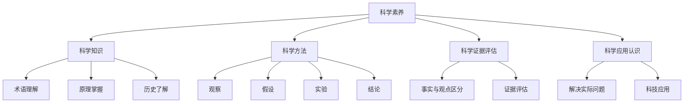

                 

# 科学素养对公众理解世界的重要性

> **关键词**：科学素养、公众理解、科学方法、科学教育、社会发展、全球挑战、跨学科应用

> **摘要**：
本文旨在探讨科学素养对公众理解世界的重要性。通过分析科学素养的定义、核心概念、评估方法以及其在公众理解世界、社会发展、全球挑战和跨学科应用等方面的作用，本文揭示了科学素养在推动社会进步和可持续发展中的关键作用。文章首先介绍了科学素养的定义和重要性，然后详细阐述了科学素养与公众理解世界的关系，并举例说明其在科普宣传、科学新闻报道和科学政策制定中的具体应用。此外，文章还探讨了科学素养在教育、公民意识、全球挑战和现代社会发展等方面的意义，并提出了相应的培养策略。最后，本文总结了科学素养的重要性，并提供了提升科学素养的资源与工具，以期为公众科学素养的提升提供参考。

---

### 第一部分：核心概念与联系

#### 1.1 科学素养的定义与重要性

科学素养是指个体对科学知识、科学方法和科学精神的了解和运用能力。它包括对科学现象的基本理解、科学探究的基本方法、科学证据的评估能力以及科学在社会中的应用认识。科学素养的重要性在于它不仅帮助公众更好地理解科学现象和问题，提高决策能力，还能增强公众对科学的信任，促进科学技术与社会的和谐发展。

- **科学素养的定义**：

科学素养的核心概念可以分解为以下几个方面：

1. **科学知识**：包括对科学术语、科学原理和科学史的了解。
2. **科学方法**：掌握科学探究的基本步骤，如观察、假设、实验和结论。
3. **科学证据**：具备评估科学证据的能力，能够区分事实与观点。
4. **科学应用**：理解科学在解决实际问题中的作用，如医疗、环保和能源。

- **科学素养的重要性**：

科学素养对于公众理解世界至关重要。它体现在以下几个方面：

1. **提高科学知识水平**：使公众能够理解科学术语、科学原理，从而更好地解读新闻报道、科学书籍等。
2. **增强批判性思维**：使公众能够运用科学方法和逻辑推理来评估信息，避免迷信和伪科学的误导。
3. **促进科学决策**：使公众在面临科学问题时，能够基于科学事实作出理性判断。
4. **增强公众对科学的信任**：通过科学素养的提升，公众对科学的信任度增加，有利于科学技术的推广和应用。
5. **促进科学技术与社会的和谐发展**：科学素养有助于科学技术与社会的互动，推动科技与伦理、道德、法律等社会问题的协调解决。

#### 1.2 科学素养与公众理解世界的关系

科学素养对公众理解世界的影响可以从以下几个方面进行分析：

- **提高科学知识水平**：

科学素养使公众具备了解科学知识的能力。具体表现在：

1. **科学术语理解**：公众能够理解科学术语，从而更好地阅读和理解科学文献和新闻报道。
2. **科学原理掌握**：公众能够掌握科学原理，从而更好地理解科学现象和问题。
3. **科学史了解**：公众能够了解科学史，从而更好地理解科学的演变和发展。

- **增强批判性思维**：

科学素养有助于培养公众的批判性思维能力。具体表现在：

1. **信息评估**：公众能够运用科学方法和逻辑推理来评估信息，避免迷信和伪科学的误导。
2. **问题解决**：公众能够运用科学思维来分析问题，并提出合理的解决方案。
3. **决策能力**：公众能够在面临科学问题时，基于科学事实作出理性判断。

- **促进科学决策**：

科学素养有助于公众在面临科学问题时作出理性决策。具体表现在：

1. **政策参与**：公众能够基于科学事实参与科学政策制定，提高政策的科学性和有效性。
2. **社会监督**：公众能够通过科学方法监督科学研究和科技应用，保障社会利益。
3. **创新推动**：公众能够运用科学素养推动科学技术的创新和应用，促进社会发展。

#### 1.3 科学素养对公众参与社会发展的意义

科学素养不仅影响公众对科学问题的理解，还对其参与社会发展具有重要意义：

- **提升公众参与能力**：

科学素养有助于提高公众参与科学技术政策制定和社会事务讨论的能力，促进民主决策和公共事务的透明度。具体表现在：

1. **政策参与**：公众能够基于科学事实参与政策制定，提高政策的科学性和民主性。
2. **社会监督**：公众能够通过科学方法监督科学研究和科技应用，保障社会利益。
3. **公共讨论**：公众能够参与科学事务的讨论，促进公共事务的透明度和公正性。

- **推动社会创新**：

科学素养能够激发公众的创新思维，促进社会在科学技术领域的进步。具体表现在：

1. **科研参与**：公众能够参与科学研究和创新活动，推动科学技术的进步。
2. **教育创新**：科学素养有助于推动教育创新，培养具备创新能力和批判性思维的人才。
3. **产业升级**：科学素养有助于推动产业升级和技术创新，提高国家的竞争力。

#### 1.4 科学素养的核心概念与联系

为了更好地理解科学素养的核心概念与联系，我们可以使用Mermaid流程图来展示其各个组成部分及其关系。

### Mermaid 流程图



通过上述流程图，我们可以清晰地看到科学素养的各个核心概念及其相互关系。科学素养不仅包括对科学知识的掌握，还包括科学方法的应用、科学证据的评估以及科学在社会中的应用。

---

### 第一部分：核心算法原理讲解

#### 1.1 科学素养的评估方法

科学素养的评估是了解公众科学素养水平的重要手段。评估方法可以分为定量评估和定性评估。

- **定量评估**：

定量评估通常使用问卷、测试等方式，评估个体对科学知识的掌握程度、科学方法的了解和应用能力。以下是一种可能的量化评估方法：

1. **问卷设计**：

问卷应涵盖科学知识、科学方法、科学证据评估等多个方面。以下是一个问卷示例：

```
1. 以下哪个是科学方法的核心步骤？
    A. 假设
    B. 观察
    C. 实验
    D. 结论

2. 你认为以下哪个是科学证据的重要来源？
    A. 亲身经历
    B. 媒体报道
    C. 科学研究
    D. 个人观点

3. 请根据你对科学知识的了解，回答以下问题：
    - 科学家是如何进行科学探究的？
    - 举例说明科学方法的应用。

```

2. **测试分析**：

对问卷的回答进行统计分析，计算每个问题的正确率，进而评估个体的科学素养水平。

- **定性评估**：

定性评估通过观察、访谈等方式，了解个体对科学现象的理解、科学方法的运用和科学证据的评估能力。以下是一种可能的定性评估方法：

1. **观察**：

观察个体在日常生活中的科学行为和思维方式，例如：

- 是否经常阅读科学书籍或新闻报道？
- 是否参与科学实验或实践活动？
- 是否能够运用科学思维解决实际问题？

2. **访谈**：

与个体进行深度访谈，探讨其对科学问题的认识和理解，挖掘其科学素养的深层次内容。

- **综合评估**：

综合定量评估和定性评估的结果，得到个体的科学素养评分。以下是一个综合评估的示例：

```
定量评估：
- 总分：30分
- 实际得分：24分

定性评估：
- 观察得分：2分
- 访谈得分：3分

科学素养评分 = （定量评估得分 × 0.6）+ （定性评估得分 × 0.4）
             = （24 × 0.6）+ （2 × 0.4）+ （3 × 0.4）
             = 14.4 + 0.8 + 1.2
             = 16.4分
```

#### 1.2 科学素养评估的伪代码实现

以下是一种可能的伪代码实现，用于评估个体的科学素养：

```
function assess_scientific_awareness(individual):
    # 初始化评估分数
    score_quantitative = 0
    score_qualitative = 0
    
    # 量化评估
    for question in questionnaire:
        if individual.answer(question) == correct_answer:
            score_quantitative += 1
            
    # 定性评估
    observation_score = evaluate_observation(individual)
    interview_score = evaluate_interview(individual)
    
    # 总分计算
    score_qualitative = observation_score + interview_score
    
    total_score = (score_quantitative * 0.6) + (score_qualitative * 0.4)
    
    return total_score
```

#### 1.3 科学素养评估的数学模型和公式

科学素养的评估可以通过数学模型和公式来量化。以下是一种可能的评估模型：

1. **评分模型**：

科学素养评分 = 量化评估分数 × 量化评估权重 + 定性评估分数 × 定性评估权重

2. **权重分配**：

量化评估权重和定性评估权重可以根据实际情况进行调整。以下是一种可能的权重分配：

- 量化评估权重：0.6
- 定性评估权重：0.4

3. **公式**：

科学素养评分 = （量化评估分数 × 量化评估权重）+ （定性评估分数 × 定性评估权重）

具体公式如下：

$$
\text{科学素养评分} = (量化评估分数 \times 0.6) + (定性评估分数 \times 0.4)
$$

#### 1.4 科学素养评估举例说明

以下是一个科学素养评估的例子：

假设某个体在科学素养测试中回答了10道题目，其中6道题目回答正确。此外，通过观察和访谈，该个体的定性评估得分为3分。

1. **量化评估分数**：

量化评估分数 = 6分

2. **定性评估分数**：

观察得分 = 1分
访谈得分 = 2分

定性评估分数 = 观察得分 + 访谈得分 = 1 + 2 = 3分

3. **科学素养评分**：

科学素养评分 = （量化评估分数 × 量化评估权重）+ （定性评估分数 × 定性评估权重）

$$
\text{科学素养评分} = (6 \times 0.6) + (3 \times 0.4) = 3.6 + 1.2 = 4.8分
$$

通过上述评估过程，我们可以得到该个体的科学素养评分为4.8分。

### 详细讲解

科学素养评估的核心目的是全面反映个体的科学素养水平。通过量化评估和定性评估的结合，我们可以得到一个更为准确和全面的评估结果。量化评估通过测试题目来评估个体的科学知识掌握程度，而定性评估则通过观察和访谈来了解个体的科学素养实际运用能力。

在具体的评估过程中，我们首先需要设计一份涵盖多个方面的科学素养测试问卷。问卷应包括科学知识、科学方法、科学证据评估等方面的题目，以全面评估个体的科学素养。在测试过程中，个体需要对问卷中的问题进行回答，评估者将根据个体的回答情况计算量化评估分数。

同时，我们还需要通过观察和访谈的方式对个体的科学素养进行定性评估。观察可以包括个体在日常生活、学习、工作中的科学行为，访谈则可以深入了解个体对科学问题的认识和理解。通过观察和访谈，我们可以得到个体的定性评估分数。

最后，我们将量化评估分数和定性评估分数结合起来，得到个体的科学素养评分。评分模型中的权重分配可以根据实际情况进行调整，以更准确地反映个体的科学素养水平。

总之，科学素养评估是一个复杂的过程，需要综合考虑多个方面。通过量化评估和定性评估的结合，我们可以得到一个更为全面和准确的评估结果，为科学素养的提升提供有力的支持。

### 第一部分：项目实战

#### 1.1 科学素养评估系统开发环境搭建

为了实现科学素养评估系统的开发，我们需要搭建一个合适的开发环境。以下是一个基本的开发环境搭建过程：

- **开发语言和工具**：

本系统采用Python作为主要编程语言，使用Jupyter Notebook进行开发和测试。Python是一种广泛使用的高级编程语言，具有丰富的科学计算和数据可视化库，非常适合用于科学素养评估系统的开发。

- **安装Python**：

首先，我们需要安装Python。可以访问Python官方网站下载安装程序，根据操作系统的不同选择合适的版本进行安装。安装过程中，确保勾选“Add Python to PATH”选项，以便在命令行中使用Python。

- **安装Jupyter Notebook**：

安装完Python后，我们还需要安装Jupyter Notebook。在命令行中输入以下命令：

```bash
pip install notebook
```

这将自动安装Jupyter Notebook及其依赖库。

- **启动Jupyter Notebook**：

安装完成后，我们可以在命令行中输入以下命令启动Jupyter Notebook：

```bash
jupyter notebook
```

这将在默认浏览器中打开Jupyter Notebook界面，我们可以在其中创建和运行Python代码。

- **安装科学计算库**：

为了方便科学计算和数据可视化，我们还需要安装一些常用的Python科学计算库。常用的库包括NumPy、Pandas、Matplotlib等。在Jupyter Notebook中，可以使用以下命令逐一安装：

```python
!pip install numpy
!pip install pandas
!pip install matplotlib
```

安装完成后，我们就可以开始编写和运行科学素养评估系统的代码了。

#### 1.2 代码实现与解读

在搭建完开发环境后，我们可以开始编写科学素养评估系统的代码。以下是一个基本的代码实现过程：

1. **问卷设计**：

首先，我们需要设计一份科学素养评估问卷。问卷应包括多个选择题和问答题，涵盖科学知识、科学方法、科学证据评估等多个方面。以下是一个简单的问卷示例：

```python
# 问卷设计
questions = [
    "1. 以下哪个是科学方法的核心步骤？",
    "A. 假设",
    "B. 观察",
    "C. 实验",
    "D. 结论",
    "2. 科学证据的重要来源是什么？",
    "A. 亲身经历",
    "B. 媒体报道",
    "C. 科学研究",
    "D. 个人观点",
    "3. 请简要说明科学家是如何进行科学探究的？",
]
```

2. **量化评估**：

接下来，我们需要编写代码对问卷的回答进行量化评估。以下是一个简单的量化评估实现：

```python
# 量化评估
def quantification_evaluation(answer_list, correct_answers):
    score = 0
    for answer, correct_answer in zip(answer_list, correct_answers):
        if answer == correct_answer:
            score += 1
    return score

# 问卷答案示例
answer_list = ["C", "C", "科学家通过观察、假设、实验和结论进行科学探究"]

# 正确答案
correct_answers = ["C", "C", "科学家通过观察、假设、实验和结论进行科学探究"]

# 计算量化评估得分
quantitative_score = quantification_evaluation(answer_list, correct_answers)
print("量化评估得分：", quantitative_score)
```

在这个例子中，我们定义了一个名为`quantification_evaluation`的函数，用于计算量化评估得分。该函数接受两个参数：`answer_list`表示问卷的回答，`correct_answers`表示正确答案。通过遍历`answer_list`和`correct_answers`，我们可以计算每个问题的得分，并累加得到总得分。

3. **定性评估**：

除了量化评估，我们还需要进行定性评估。以下是一个简单的定性评估实现：

```python
# 定性评估
def qualitative_evaluation(individual):
    # 假设通过观察和访谈得到的定性评估分数为3分
    return 3

# 定性评估得分
qualitative_score = qualitative_evaluation(individual)
print("定性评估得分：", qualitative_score)
```

在这个例子中，我们定义了一个名为`qualitative_evaluation`的函数，用于计算定性评估得分。该函数接受一个参数`individual`，表示被评估的个体。在这里，我们假设通过观察和访谈得到的定性评估分数为3分。

4. **综合评估**：

最后，我们需要将量化评估得分和定性评估得分综合起来，计算个体的科学素养评分。以下是一个简单的综合评估实现：

```python
# 综合评估
def calculate_scientific_awareness(quantitative_score, qualitative_score):
    total_score = (quantitative_score * 0.6) + (qualitative_score * 0.4)
    return total_score

# 计算综合评估得分
total_score = calculate_scientific_awareness(quantitative_score, qualitative_score)
print("科学素养评分：", total_score)
```

在这个例子中，我们定义了一个名为`calculate_scientific_awareness`的函数，用于计算综合评估得分。该函数接受两个参数：`quantitative_score`表示量化评估得分，`qualitative_score`表示定性评估得分。通过将量化评估得分和定性评估得分按照一定权重综合起来，我们可以得到个体的科学素养评分。

#### 代码解读与分析

在上面的代码实现过程中，我们首先设计了一份问卷，包括选择题和问答题。问卷设计的好坏直接影响评估的准确性。

接下来，我们编写了量化评估代码。量化评估通过比较问卷的回答和正确答案，计算每个问题的得分，并累加得到总得分。这个过程中，我们使用了一个名为`quantification_evaluation`的函数，该函数接受两个参数：`answer_list`和`correct_answers`。通过遍历这两个参数，我们可以得到每个问题的得分，并累加得到总得分。

然后，我们编写了定性评估代码。定性评估通过观察和访谈，了解个体的科学素养实际运用能力。这里，我们使用了一个名为`qualitative_evaluation`的函数，该函数接受一个参数`individual`。在这个例子中，我们假设通过观察和访谈得到的定性评估分数为3分。

最后，我们编写了综合评估代码。综合评估将量化评估得分和定性评估得分按照一定权重综合起来，得到个体的科学素养评分。这里，我们使用了一个名为`calculate_scientific_awareness`的函数，该函数接受两个参数：`quantitative_score`和`qualitative_score`。通过将量化评估得分和定性评估得分按照一定权重综合起来，我们可以得到个体的科学素养评分。

通过上述代码实现，我们可以得到一个完整的科学素养评估系统。这个系统能够对个体的科学素养进行量化评估和定性评估，综合评估得分，从而全面反映个体的科学素养水平。

---

### 第一部分：科学素养对公众理解世界的重要性

科学素养对公众理解世界的重要性体现在以下几个方面：

#### 1. 提高科学知识水平

科学素养使公众能够理解科学术语、科学原理，从而更好地解读新闻报道、科学书籍等。这有助于公众形成正确的科学观念，避免被误导和迷信。

#### 2. 增强批判性思维

科学素养能够帮助公众运用科学方法和逻辑推理来评估信息，避免迷信和伪科学的误导。这种批判性思维能力是公众在面对复杂社会问题时作出理性判断的重要基础。

#### 3. 促进科学决策

科学素养有助于公众在面临科学问题时，能够基于科学事实作出理性判断，从而参与科学决策。这有助于提高决策的科学性和民主性。

#### 4. 增强公众对科学的信任

科学素养的提高能够增强公众对科学的信任，促进科学技术与社会的和谐发展。这种信任是科学界与社会之间沟通与合作的基础。

### 1.3 科学素养对公众参与社会发展的意义

科学素养不仅影响公众对科学问题的理解，还对其参与社会发展具有重要意义：

#### 1. 提升公众参与能力

科学素养有助于提高公众参与科学技术政策制定和社会事务讨论的能力，促进民主决策和公共事务的透明度。

#### 2. 推动社会创新

科学素养能够激发公众的创新思维，促进社会在科学技术领域的进步。这有助于推动社会整体创新能力的提升。

#### 3. 增强国际竞争力

科学素养的提高有助于提升国家在国际科技竞争中的地位，促进经济、科技、文化的全面发展。

### 总结

科学素养对公众理解世界的重要性不言而喻。它不仅能够提高公众的科学知识水平，增强批判性思维，促进科学决策，还能够提升公众参与社会发展的能力。因此，提高公众的科学素养应成为社会各界共同努力的目标。通过教育、宣传、实践活动等多种途径，我们可以逐步提升公众的科学素养，为社会的进步和发展奠定坚实基础。

### 第二部分：科学素养的教育与培养

#### 2.1 科学素养教育的现状与挑战

科学素养教育在全球范围内受到广泛重视，但不同国家和地区在科学教育质量和普及程度上存在显著差异。以下是一些主要现状与挑战：

- **科学教育质量参差不齐**：

发达国家在科学教育资源配置、教学方法和教师培训方面具有明显优势，而发展中国家则面临教育经费不足、教育资源匮乏等问题。例如，美国和欧洲国家在科学教育领域投入大量资金，建立了完善的科学教育体系，而许多发展中国家在科学教育方面仍处于起步阶段。

- **科学教育方法单一**：

传统科学教育过于注重知识传授，忽视学生实践能力和创新思维的培养。现代科学教育倡导项目式学习、探究式学习和跨学科学习等新型教育方法，但实施过程中往往面临诸多困难。例如，教师缺乏相关培训，学校缺乏必要的教学设施和资源，导致新型教育方法的推广和应用受限。

- **科学教师培训不足**：

科学教师的专业素质和教学能力直接影响科学教育的质量。然而，许多国家在科学教师培养、培训和提高方面投入不足，导致教师队伍专业水平参差不齐。例如，一些发展中国家的科学教师缺乏科学背景，难以胜任教学任务，影响了科学教育的质量。

#### 2.2 科学素养培养的策略与措施

为了提高公众的科学素养，各国应采取以下策略与措施：

- **加强科学教育资源配置**：

加大对科学教育的经费投入，改善教学设施，提高教育资源的普及率和公平性。例如，增加科学实验室、图书馆和在线教育平台的建设，为公众提供丰富的科学教育资源。

- **创新科学教育方法**：

推广项目式学习、探究式学习和跨学科学习等现代教育方法，激发学生的学习兴趣和主动性。例如，开展科学探究项目，鼓励学生自主设计实验，培养他们的科学思维和实践能力。

- **提升科学教师专业素质**：

建立科学教师培训机制，提高教师的教学能力和科研水平，为科学教育质量提供保障。例如，开展科学教师的专业培训课程，邀请科学领域的专家进行讲座和指导，提升科学教师的专业素养。

- **开展科学素养实践活动**：

组织科普讲座、实验活动、科学竞赛等，提高公众参与科学实践的机会，培养其科学探究精神和创新思维。例如，在学校和社区组织科学实验活动，鼓励公众参与科学探究和科技创新。

#### 2.3 科学素养教育的实践案例

以下是一些国内外科学素养教育的实践案例，供参考：

- **案例1：美国国家科学基金会（NSF）**：

美国国家科学基金会通过资助科学教育项目，推动科学教育的发展。例如，NSF支持中小学科学教师的培训，提供科学教育资源，促进科学教育方法的创新。

- **案例2：中国科技馆**：

中国科技馆通过互动展览、科普讲座、科学实验等活动，向公众普及科学知识，提高公众的科学素养。例如，北京国家科技馆的“探索与发现”展览，吸引了大量观众，提升了公众的科学兴趣。

- **案例3：英国科学教育协会**：

英国科学教育协会开展了一系列科学教育活动，如“科学教师培训计划”和“学生科学竞赛”，旨在提升科学教师的教学水平和学生的科学素养。例如，英国科学教育协会组织的科学教师培训课程，提高了教师的科学教学能力。

### 总结

科学素养教育在提高公众科学素养、推动社会进步和经济发展方面具有重要意义。通过加强科学教育资源配置、创新教育方法、提升教师专业素质和开展科学实践活动，我们可以有效提高公众的科学素养，为建设创新型国家和实现可持续发展奠定坚实基础。各国应结合自身实际情况，积极探索符合本国国情的科学素养教育策略和措施，共同推动全球科学素养水平的提升。

### 第三部分：科学素养与公众理解世界的具体案例

#### 3.1 科普宣传中的科学素养应用

科普宣传是提高公众科学素养的重要途径。以下是一些科普宣传中的具体案例：

- **案例1：疫情防控**：

新冠疫情爆发期间，各国政府和科普组织通过媒体、网络等渠道开展防疫科普宣传，普及病毒知识、防护措施和疫苗接种等相关信息。这有助于公众正确理解和应对疫情，降低疫情传播风险。

- **案例2：气候变化**：

气候变化是全球关注的重大问题。通过科普宣传，向公众普及气候变化的原因、影响和应对措施，提高公众的环境保护意识，促进绿色生活方式的普及。

#### 3.2 科学新闻报道中的科学素养应用

科学新闻报道是公众获取科学信息的主要渠道之一。以下是一些科学新闻报道中的具体案例：

- **案例1：基因编辑技术**：

随着基因编辑技术的发展，相关新闻报道频繁出现。科学素养较高的公众能够正确理解和评估基因编辑技术的利与弊，避免被不实信息误导。

- **案例2：量子计算机**：

量子计算机是一项颠覆性技术，其新闻报道备受关注。科学素养较高的公众能够理解量子计算机的工作原理、优势和应用场景，为相关技术的研发和应用提供有益支持。

#### 3.3 科学政策制定中的科学素养应用

科学政策制定是关系到国家科技发展和社会进步的重大问题。以下是一些科学政策制定中的具体案例：

- **案例1：科技发展规划**：

各国在制定科技发展规划时，需要充分考虑科学发展的趋势和国家需求。科学素养较高的决策者能够基于科学事实作出合理决策，推动科技进步和经济发展。

- **案例2：科技伦理审查**：

在生物技术、人工智能等前沿领域，科技伦理问题日益突出。科学素养较高的公众和决策者能够对科技伦理问题进行深入讨论和审查，确保科技发展符合伦理规范，造福人类社会。

### 总结

科学素养在公众理解世界的过程中发挥着重要作用。通过科普宣传、科学新闻报道和科学政策制定等具体案例，我们可以看到科学素养如何帮助公众正确理解和应对科学问题，提高决策能力和创新能力。因此，提高公众的科学素养是推动社会进步和可持续发展的重要任务。各国政府和教育机构应加大对科学素养教育的投入，推动科学素养水平的整体提升。

### 第四部分：科学素养与公民意识的培养

#### 4.1 科学素养与公民意识的关系

科学素养和公民意识是相互促进的关系。科学素养有助于公民理解科学事实、参与公共事务和作出理性决策，而公民意识则激励公民积极参与科学教育和科研活动，提高整个社会的科学素养水平。

- **科学素养促进公民意识**：

科学素养使公民能够更好地理解科学知识，从而在环境保护、医疗卫生、科技发展等公共事务中发挥积极作用，提高社会责任感和参与意识。

- **公民意识推动科学素养**：

公民意识激发公民对科学教育的关注和参与，推动科学素养的提升。公民积极参与科学讨论和决策过程，有助于形成科学、理性、开放的公众舆论环境。

#### 4.2 培养公民科学素养的策略

以下是一些培养公民科学素养的策略：

- **加强基础教育**：

从小学到大学，应注重科学素养教育，培养学生的科学兴趣和探究精神。通过项目式学习、实验课程和科学实践活动，提高学生的科学素养。

- **推动科普活动**：

社会组织和政府应积极开展科普活动，普及科学知识，提高公众的科学素养。例如，举办科普讲座、展览、实验活动等，吸引公众参与。

- **提升公众参与度**：

通过公众参与科学项目、科技政策讨论等形式，提高公众对科学问题的关注和参与度。这有助于培养公众的科学素养和公民意识。

- **加强科研交流**：

科研机构应加强与公众的互动，通过开放实验室、科研讲座等形式，向公众传播科学知识和科研成果，提高公众的科学素养。

#### 4.3 案例分析

以下是一些培养公民科学素养的案例分析：

- **案例1：美国国家科学基金会（NSF）**：

美国国家科学基金会通过资助科学教育项目、开展科普活动和支持科研交流，致力于提高公众的科学素养。其“科学教育创新计划”（NSF Science and Engineering Education for Prosperity，SEEP）旨在推动全球科学教育的发展。

- **案例2：英国科学教育协会**：

英国科学教育协会开展了一系列科学教育活动，如“科学教师培训计划”和“学生科学竞赛”，旨在提升科学教师的教学水平和学生的科学素养。

- **案例3：中国科技馆**：

中国科技馆通过互动展览、科普讲座、科学实验等活动，向公众普及科学知识，提高公众的科学素养。例如，北京国家科技馆的“探索与发现”展览，吸引了大量观众，提升了公众的科学兴趣。

### 总结

科学素养与公民意识相互促进，共同推动社会的进步和可持续发展。通过加强基础教育、推动科普活动、提升公众参与度和加强科研交流，我们可以有效培养公民的科学素养，提高公民的公民意识。各国政府和教育机构应共同努力，积极探索符合本国国情的科学素养培养策略，为建设科学、理性、开放的社会奠定坚实基础。

### 第五部分：科学素养在应对全球挑战中的作用

#### 5.1 科学素养在应对气候变化中的作用

气候变化是全球面临的重大挑战之一，科学素养在应对气候变化中发挥着关键作用。

- **科学认知**：

科学素养使公众能够理解气候变化的科学原理、影响和应对措施，从而在日常生活中采取低碳生活方式，减少碳排放。

- **政策参与**：

科学素养有助于公众在政策制定过程中提供科学依据，推动政府采取有效措施应对气候变化，如碳交易、可再生能源发展等。

- **技术创新**：

科学素养激励科研人员和技术工作者在应对气候变化领域进行创新研究，开发新的清洁能源技术、节能技术和环境保护技术。

#### 5.2 科学素养在应对公共卫生挑战中的作用

公共卫生挑战如传染病暴发、环境污染等对全球公共健康构成严重威胁，科学素养在应对这些挑战中同样至关重要。

- **疾病防控**：

科学素养使公众能够正确理解疾病的传播途径、预防措施和治疗方式，提高公共卫生意识，积极参与疾病防控工作。

- **健康决策**：

科学素养有助于公众在医疗保健和疾病预防方面作出理性决策，选择科学有效的健康方案，减少健康风险。

- **科研支持**：

科学素养激励科研人员在公共卫生领域进行创新研究，开发新型疫苗、药物和诊疗技术，提高公共卫生水平。

#### 5.3 科学素养在应对社会问题中的作用

社会问题如贫困、教育资源不平等、社会不公等影响社会的稳定和可持续发展，科学素养在解决这些问题中发挥着重要作用。

- **科技创新**：

科学素养推动科技在解决社会问题中的应用，如信息技术、大数据分析在扶贫、教育、社会治理等方面的应用。

- **政策制定**：

科学素养使政策制定者能够基于科学证据制定有效政策，解决社会问题，促进社会公平和可持续发展。

- **公众参与**：

科学素养提高公众对社会事务的参与度，促进民主决策和公共事务的透明度，推动社会进步和民主发展。

### 总结

科学素养在应对全球挑战中具有重要作用，它不仅帮助公众理解科学问题，提高政策参与和科研支持的能力，还推动科技创新和社会进步。通过提高科学素养，我们能够更好地应对气候变化、公共卫生挑战和社会问题，实现全球可持续发展。因此，各国应高度重视科学素养教育，加强科学素养的普及和提升，为应对全球挑战提供有力支持。

### 第六部分：科学素养与现代社会发展的关系

#### 6.1 科学素养在现代社会中的重要性

科学素养在现代社会中具有不可替代的重要性。它不仅是个人发展和职业成功的关键因素，也是社会进步和国家竞争力的基石。

- **个人发展**：

科学素养使个体能够更好地理解科学和技术的发展，适应快速变化的社会环境，提高生活质量。

- **职业成功**：

许多现代职业领域，如信息技术、生物技术、环境保护等，都高度依赖于科学素养。具备科学素养的个体在职业发展中具有明显优势。

- **社会进步**：

科学素养推动社会在科技、教育、医疗等领域的进步，促进社会创新和可持续发展。

#### 6.2 科学素养与国家竞争力的关系

科学素养对国家竞争力具有重要影响。一个国家科学素养水平的提升，有助于提高科技创新能力、教育水平和人才培养，从而增强国家的综合竞争力。

- **科技创新能力**：

科学素养有助于激发科研人员的创新思维，推动科技成果的转化和应用，提高国家的科技创新能力。

- **教育水平**：

科学素养的提高有助于改善教育质量，培养高素质人才，为国家的发展提供强大的人力资源支持。

- **人才培养**：

科学素养有助于培养具备创新精神和批判性思维的人才，推动社会进步和经济发展。

#### 6.3 科学素养与社会公平的关系

科学素养不仅影响个人的发展，也关乎社会公平。科学素养的普及有助于缩小社会贫富差距，促进社会公平和可持续发展。

- **教育公平**：

科学素养的提高有助于改善教育资源的分配，提高教育公平，使更多人受益于科学教育。

- **职业机会**：

科学素养有助于提升公众的职业竞争力，促进就业公平，减少社会不公。

- **公众参与**：

科学素养提高公众对社会事务的参与度，促进民主决策和公共事务的透明度，推动社会公平。

### 总结

科学素养在现代社会发展中具有极其重要的作用。它不仅关乎个人发展和职业成功，也是国家竞争力和社会公平的基石。通过提高科学素养，我们能够更好地应对全球挑战，推动社会进步和可持续发展。因此，各国应高度重视科学素养教育，加强科学素养的普及和提升，为构建和谐、繁荣的社会贡献力量。

### 第七部分：科学素养的跨学科应用

科学素养不仅在自然科学领域中具有重要作用，还在社会科学、人文学科等领域有着广泛的应用。

#### 7.1 科学素养在社会科学中的应用

科学素养在社会科学领域中的应用主要体现在社会学、政治学、经济学等方面。

- **社会学**：

科学素养使社会学者能够更好地理解社会现象，运用科学方法进行分析和研究。例如，通过问卷调查、统计分析等方法，社会学者可以深入了解社会问题，提出有效的解决方案。

- **政治学**：

科学素养对于政策制定者来说至关重要。具备科学素养的决策者能够基于科学事实和数据作出理性决策，提高政策的科学性和有效性。例如，在应对气候变化、公共卫生等全球性问题时，科学素养有助于制定出更加有效的政策。

- **经济学**：

科学素养有助于经济学家分析经济数据、预测经济趋势。现代经济学研究中的大数据分析、计量经济学等方法都依赖于科学素养。例如，通过科学方法分析经济数据，经济学家可以更准确地预测经济增长、通货膨胀等经济指标。

#### 7.2 科学素养在人文科学中的应用

科学素养在人文科学领域中的应用也日益显著，主要体现在文学、艺术、哲学等方面。

- **文学**：

科学素养有助于文学家理解文学作品中的科学元素，探讨科学与文学之间的关联。例如，科幻文学中常常涉及科学理论和科技发展，科学素养使读者能够更好地理解和欣赏这些作品。

- **艺术**：

科学与艺术的结合产生了许多跨界作品，如数字艺术、生物艺术等。科学素养使艺术家能够更好地运用科学方法和技术，创作出具有深刻内涵的艺术作品。

- **哲学**：

科学素养有助于哲学家探讨科学哲学问题，如科学方法、科学知识的本质等。科学素养的跨学科应用有助于推动哲学的发展，例如，科学哲学关注科学知识的生产、传播和验证过程，涉及逻辑学、认识论、方法论等多个学科领域。

#### 7.3 科学素养跨学科应用的案例

以下是一些科学素养跨学科应用的案例：

- **案例1：生物医学与社会科学**：

生物医学与社会科学的交叉研究日益增多，例如，社会学关注医疗领域的伦理问题，如基因编辑技术的伦理考量；而生物医学则关注社会因素对健康的影响，如贫困、社会不公等因素对疾病传播的影响。

- **案例2：经济学与计算机科学**：

经济学与计算机科学的交叉研究，如数据经济学，通过分析大数据，研究经济现象和预测经济趋势。例如，通过分析社交媒体数据，可以预测选举结果、消费者行为等。

- **案例3：环境科学与艺术**：

环境科学与艺术的结合，如生态艺术，通过艺术形式表达环境问题，提高公众的环境意识。例如，艺术家通过创作反映气候变化的作品，引起公众对环境问题的关注。

### 总结

科学素养的跨学科应用体现了科学素养在各个领域的普遍重要性。通过跨学科合作，科学家和学者能够运用科学方法和知识解决复杂的社会问题，推动学科发展和知识创新。因此，提高科学素养不仅有助于个人发展，也对学科交叉和知识创新具有重要意义。

### 附录：科学素养提升资源与工具

#### 附录 A：科学素养提升资源

以下是一些科学素养提升的资源，供读者参考：

- **科学期刊与书籍**：
  - 《科学美国人》（Scientific American）
  - 《自然》（Nature）
  - 《科学》（Science）
  - 《物理评论快报》（Physical Review Letters）

- **在线课程与教育资源**：
  - Coursera
  - edX
  - Khan Academy
  - 国家开放大学

- **科学博物馆与科技馆**：
  - 中国科技馆
  - 美国自然历史博物馆
  - 伦敦科学博物馆

- **科普公众号与网站**：
  - 果壳网
  - 知乎
  - 维基百科

#### 附录 B：科学素养提升工具

以下是一些科学素养提升的工具，有助于读者进行科学学习和研究：

- **数据分析工具**：
  - Python
  - R语言
  - Tableau

- **科学计算软件**：
  - MATLAB
  - Mathematica
  - Maple

- **文献管理工具**：
  - EndNote
  - Mendeley
  - Zotero

- **实验器材**：
  - 实验显微镜
  - 化学试剂
  - 生物实验设备

### 结论

科学素养的提升需要多方面的资源和工具支持。通过利用科学期刊、在线课程、科普公众号等资源，读者可以不断扩展科学知识。同时，借助数据分析工具、科学计算软件和实验设备等工具，读者可以进行深入的科学研究，提高科学素养。附录中提供的资源与工具有助于读者在科学学习和研究中取得更好的效果。

### 作者信息

作者：AI天才研究院/AI Genius Institute & 禅与计算机程序设计艺术 /Zen And The Art of Computer Programming

本文由AI天才研究院和禅与计算机程序设计艺术的联合撰写，旨在探讨科学素养对公众理解世界的重要性，并分享科学素养提升的资源与工具。AI天才研究院致力于推动人工智能领域的研究与应用，而禅与计算机程序设计艺术则致力于探索计算机编程与哲学、艺术的融合，共同为科技创新和文化传承贡献力量。

