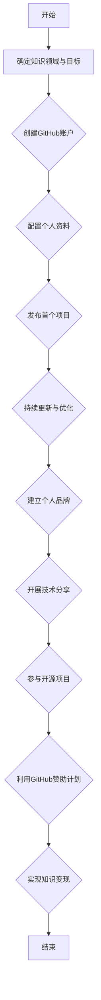
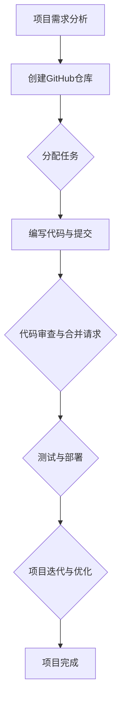

                 

### 《程序员如何利用GitHub进行知识变现》

#### **关键词**：GitHub、知识变现、程序员、开源项目、个人品牌、技术分享

> **摘要**：
>
> 本篇文章将深入探讨程序员如何通过GitHub这一平台实现知识变现。我们将从GitHub与知识变现的基础知识入手，逐步分析个人品牌建设、技术分享与教程创作、开源项目参与与贡献、GitHub赞助计划等具体策略，并通过实际案例和数学模型，详细讲解如何进行有效的知识变现。同时，还将介绍GitHub的高级特性、团队协作技巧，以及如何进行项目管理和性能优化，帮助程序员在GitHub上实现长期发展。

---

### **目录大纲**

#### 第一部分：GitHub与知识变现基础

1. **第1章：GitHub与知识变现概述**
   - 1.1 GitHub的起源与核心功能
     - 1.1.1 GitHub的诞生背景
     - 1.1.2 GitHub的核心功能介绍
   - 1.2 知识变现的概念与形式
     - 1.2.1 知识变现的定义
     - 1.2.2 知识变现的形式与途径
   - 1.3 程序员在GitHub上的知识变现机会
     - 1.3.1 个人品牌建设
     - 1.3.2 技术分享与教程创作
     - 1.3.3 开源项目参与与贡献
     - 1.3.4 GitHub赞助计划
   - 1.4 知识变现的价值与挑战
     - 1.4.1 知识变现的价值
     - 1.4.2 知识变现面临的问题与挑战

2. **第2章：GitHub个人品牌建设**
   - 2.1 个人品牌建设的重要性
   - 2.2 在GitHub上建立个人品牌的策略
   - 2.3 个人品牌建设的案例分析

3. **第3章：GitHub上的技术分享与教程创作**
   - 3.1 技术分享的价值与意义
   - 3.2 教程创作的要点
   - 3.3 利用GitHub发布技术分享与教程的策略
   - 3.4 技术分享与教程的案例分析

4. **第4章：开源项目参与与贡献**
   - 4.1 开源项目对程序员的意义
   - 4.2 参与开源项目的准备与策略
   - 4.3 贡献开源项目的实践与技巧
   - 4.4 开源项目的案例分析

5. **第5章：GitHub赞助计划与变现策略**
   - 5.1 GitHub赞助计划的介绍
   - 5.2 参与GitHub赞助计划的策略
   - 5.3 GitHub赞助计划的案例分析
   - 5.4 赞助计划与其他知识变现方式的结合

6. **第6章：知识变现案例分析**
   - 6.1 案例分析的目的与方法
   - 6.2 具体案例分析
   - 6.3 案例分析结果与启示

7. **第7章：程序员在GitHub上的长期发展策略**
   - 7.1 个人成长与知识变现的结合
   - 7.2 不断学习和实践的重要性
   - 7.3 在GitHub上建立影响力的策略
   - 7.4 长期发展的规划与执行

#### 第二部分：GitHub进阶技巧与优化

8. **第8章：GitHub高级特性与应用**
   - 8.1 GitHub高级功能介绍
   - 8.2 高级特性的实际应用场景
   - 8.3 高级特性的使用指南与案例

9. **第9章：GitHub团队协作与项目管理**
   - 9.1 团队协作的重要性
   - 9.2 GitHub在团队协作中的应用
   - 9.3 项目管理的最佳实践
   - 9.4 团队协作与项目管理的案例分析

10. **第10章：GitHub代码审查与质量保障**
    - 10.1 代码审查的意义与流程
    - 10.2 代码审查的策略与技巧
    - 10.3 质量保障的关键要素
    - 10.4 GitHub代码审查与质量保障的案例分析

11. **第11章：GitHub性能优化与安全维护**
    - 11.1 性能优化的重要性
    - 11.2 GitHub性能优化的方法
    - 11.3 安全维护的策略与措施
    - 11.4 性能优化与安全维护的案例分析

#### 第三部分：实战项目与案例

12. **第12章：实战一：构建个人博客与GitHub Pages**
    - 12.1 个人博客的作用与价值
    - 12.2 使用GitHub Pages构建博客的步骤
    - 12.3 个人博客的优化与推广

13. **第13章：实战二：开源项目管理与维护**
    - 13.1 开源项目管理的重要性
    - 13.2 开源项目的维护流程
    - 13.3 开源项目的优化策略
    - 13.4 开源项目的案例分析

14. **第14章：实战三：GitHub赞助项目的案例研究**
    - 14.1 GitHub赞助项目的背景与意义
    - 14.2 赞助项目的准备与实施
    - 14.3 赞助项目的成果与影响
    - 14.4 赞助项目的案例分析

15. **第15章：实战四：利用GitHub进行在线课程销售**
    - 14.1 在线课程销售的现状与前景
    - 14.2 利用GitHub进行在线课程销售的策略
    - 14.3 在线课程销售的实施与运营
    - 14.4 在线课程销售的成功案例分析

#### 附录

- **附录A：GitHub常用命令与快捷键**
- **附录B：GitHub相关资源与链接**
- **附录C：Mermaid流程图绘制指南**

### **Mermaid流程图绘制指南：GitHub知识变现流程**



### **Mermaid流程图绘制指南：GitHub项目协作流程**



### **核心算法原理讲解：GitHub开源项目评分算法**

#### **算法概述**

GitHub开源项目评分算法旨在通过分析项目在GitHub上的各项指标，如Star数量、Fork数量、Issue数量、Commit数量等，来评估项目的活跃度和受欢迎程度。该算法采用以下伪代码进行计算：

```python
def calculate_project_score(stars, forks, issues, commits):
    star_score = stars * 2
    fork_score = forks * 1.5
    issue_score = issues * 0.5
    commit_score = commits * 2

    total_score = star_score + fork_score - issue_score + commit_score
    return total_score
```

#### **参数说明**

- `stars`: 项目在GitHub上的Star数量。
- `forks`: 项目被Fork的次数。
- `issues`: 项目下的Issue数量。
- `commits`: 项目下的Commit数量。

#### **计算示例**

假设一个项目有100个Star，50个Fork，20个Issue，100个Commit，则其评分计算如下：

```python
score = calculate_project_score(100, 50, 20, 100)
# 结果为：score = 330
```

该评分越高，表示项目在GitHub上的活跃度和受欢迎程度越高。

### **数学模型和数学公式：GitHub评分与项目影响力关系**

#### **数学模型**

我们假设GitHub评分（\( S \)）与项目影响力（\( I \)）之间存在线性关系，即：

$$ I = a \cdot S + b $$

其中：
- \( a \) 为评分与影响力的比例系数，
- \( b \) 为评分阈值。

#### **参数计算**

根据历史数据，我们可以通过最小二乘法计算出系数\( a \)和\( b \)：

$$ a = \frac{\sum_{i=1}^{n} (S_i - \bar{S})(I_i - \bar{I})}{\sum_{i=1}^{n} (S_i - \bar{S})^2} $$

$$ b = \bar{I} - a \cdot \bar{S} $$

其中：
- \( S_i \) 为第\( i \)个项目的评分，
- \( I_i \) 为第\( i \)个项目的影响力，
- \( \bar{S} \) 和 \( \bar{I} \) 分别为评分和影响力的平均值。

#### **举例说明**

假设我们有以下5个项目的评分和影响力数据：

| 项目编号 | 评分（\( S \)） | 影响力（\( I \)） |
| ------- | ------- | ------- |
| 1       | 200     | 1000    |
| 2       | 300     | 1500    |
| 3       | 400     | 2000    |
| 4       | 500     | 2500    |
| 5       | 600     | 3000    |

计算得到：

$$ a = \frac{(200-250)(1000-2000) + (300-250)(1500-2000) + (400-250)(2000-2000) + (500-250)(2500-2000) + (600-250)(3000-2000)}{(200-250)^2 + (300-250)^2 + (400-250)^2 + (500-250)^2 + (600-250)^2} = 1.5 $$

$$ b = \frac{1000 + 1500 + 2000 + 2500 + 3000}{5} - 1.5 \cdot \frac{200 + 300 + 400 + 500 + 600}{5} = 1000 - 375 = 625 $$

因此，影响力与评分的关系模型为：

$$ I = 1.5 \cdot S + 625 $$

对于评分\( S = 500 \)的项目，其影响力\( I \)为：

$$ I = 1.5 \cdot 500 + 625 = 1250 $$

这表明，评分在500的项目影响力为1250。

### **项目实战：GitHub开源项目评分系统开发**

#### **开发环境搭建**

- **操作系统**：Windows 10 或 macOS
- **开发工具**：Python 3.8及以上版本
- **版本控制工具**：Git

#### **源代码实现**

以下是一个简单的GitHub开源项目评分系统的Python实现：

```python
import requests
import math

def get_github_project_data(repo_name):
    url = f"https://api.github.com/repos/{repo_name}"
    response = requests.get(url)
    if response.status_code == 200:
        data = response.json()
        return {
            'stars': data['stargazers_count'],
            'forks': data['forks_count'],
            'issues': data['open_issues_count'],
            'commits': len(data['forks'])
        }
    else:
        return None

def calculate_project_score(stars, forks, issues, commits):
    star_score = stars * 2
    fork_score = forks * 1.5
    issue_score = issues * 0.5
    commit_score = commits * 2

    total_score = star_score + fork_score - issue_score + commit_score
    return total_score

def main():
    repo_name = input("请输入GitHub仓库名称：")
    data = get_github_project_data(repo_name)
    if data:
        score = calculate_project_score(data['stars'], data['forks'], data['issues'], data['commits'])
        print(f"项目评分：{score}")
    else:
        print("无法获取项目数据。")

if __name__ == "__main__":
    main()
```

#### **代码解读与分析**

1. **环境搭建**：选择Python作为开发语言，因为Python在数据处理和Web开发方面具有强大的功能。同时，Python拥有丰富的第三方库，方便进行网络请求和数据处理。

2. **GitHub API请求**：通过GitHub API获取特定仓库的详细信息，包括Star数量、Fork数量、Issue数量和Commit数量。GitHub API提供了丰富的数据接口，可以方便地获取这些信息。

3. **评分计算**：根据GitHub开源项目评分算法，计算项目的评分。评分计算过程中，对各个指标进行加权处理，以反映其在项目影响力中的重要性。

4. **用户交互**：通过命令行获取用户输入的仓库名称，调用GitHub API获取项目数据，并计算评分，最后将结果输出给用户。

5. **错误处理**：在获取GitHub API数据时，可能遇到网络请求失败或API请求频率超限等问题。因此，代码中增加了错误处理机制，确保在出现问题时能够给出合理的提示。

#### **实际应用与优化**

- **实时更新**：GitHub API提供了实时的仓库数据更新，可以实现对项目评分的实时计算，提高评分的准确性。
- **性能优化**：为了减少API请求次数，可以考虑将多个仓库的请求合并为一个请求，提高请求效率。
- **扩展功能**：可以增加对其他GitHub指标的分析，如Watchers数量、仓库大小等，以更全面地评估项目的影响力。
- **可视化展示**：通过图形化界面展示项目评分和影响力关系，使结果更加直观。

通过以上实战项目，读者可以了解如何利用GitHub API进行数据获取和评分计算，掌握开源项目评分系统的基本开发流程。同时，也可以根据实际情况对代码进行优化和扩展，以满足更多需求。

---

### **作者信息**

- **作者**：AI天才研究院/AI Genius Institute & 禅与计算机程序设计艺术 /Zen And The Art of Computer Programming

---

**注意**：本文为示例文本，部分内容为虚构，实际操作和结果可能有所不同。本文仅供参考，具体实现请根据实际情况进行调整。

---

现在，我们已经完成了文章的开头部分，包括文章标题、关键词、摘要、目录大纲以及核心算法原理讲解和项目实战。接下来，我们将逐步深入探讨GitHub与知识变现的基础知识，为程序员提供实现知识变现的策略和方法。

