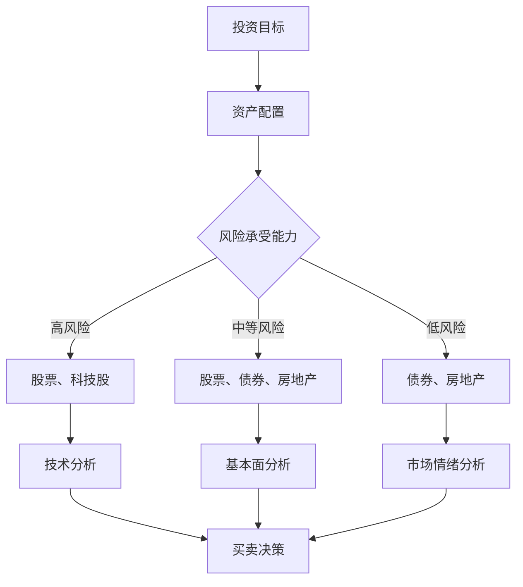
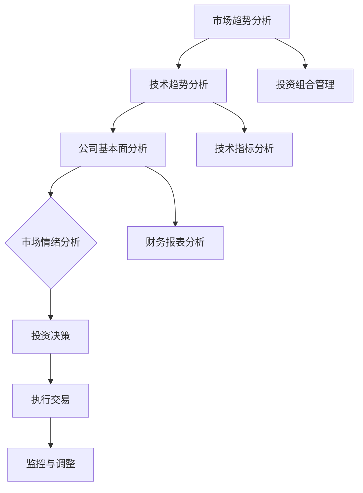
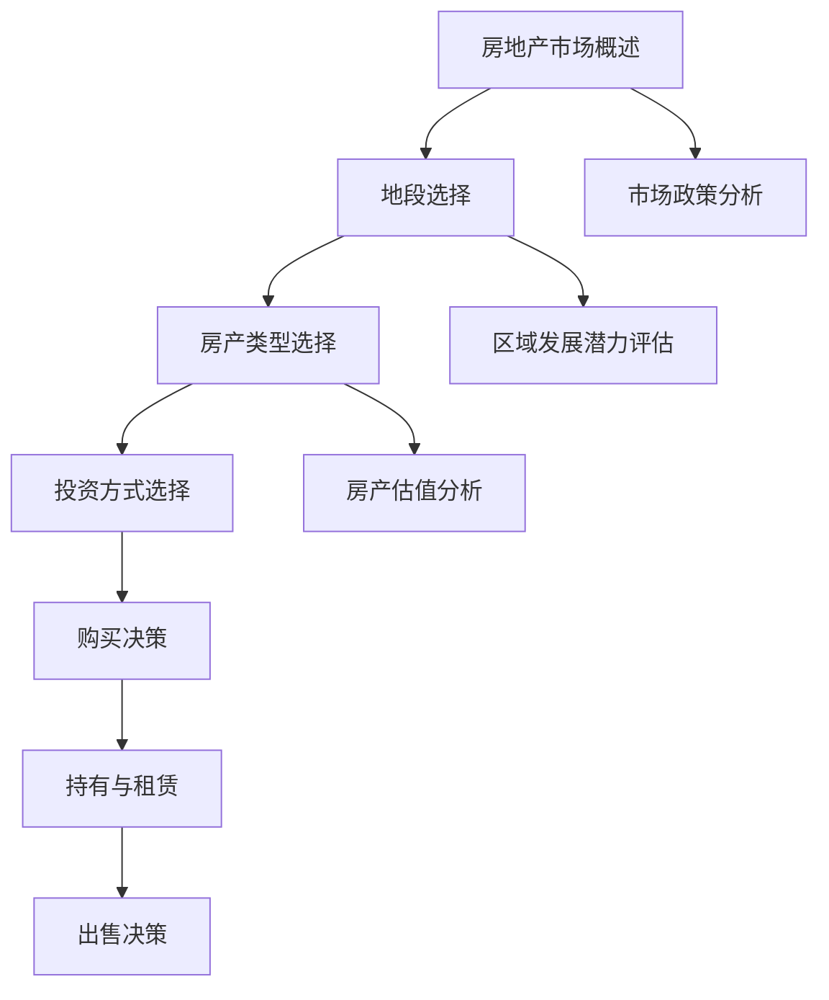
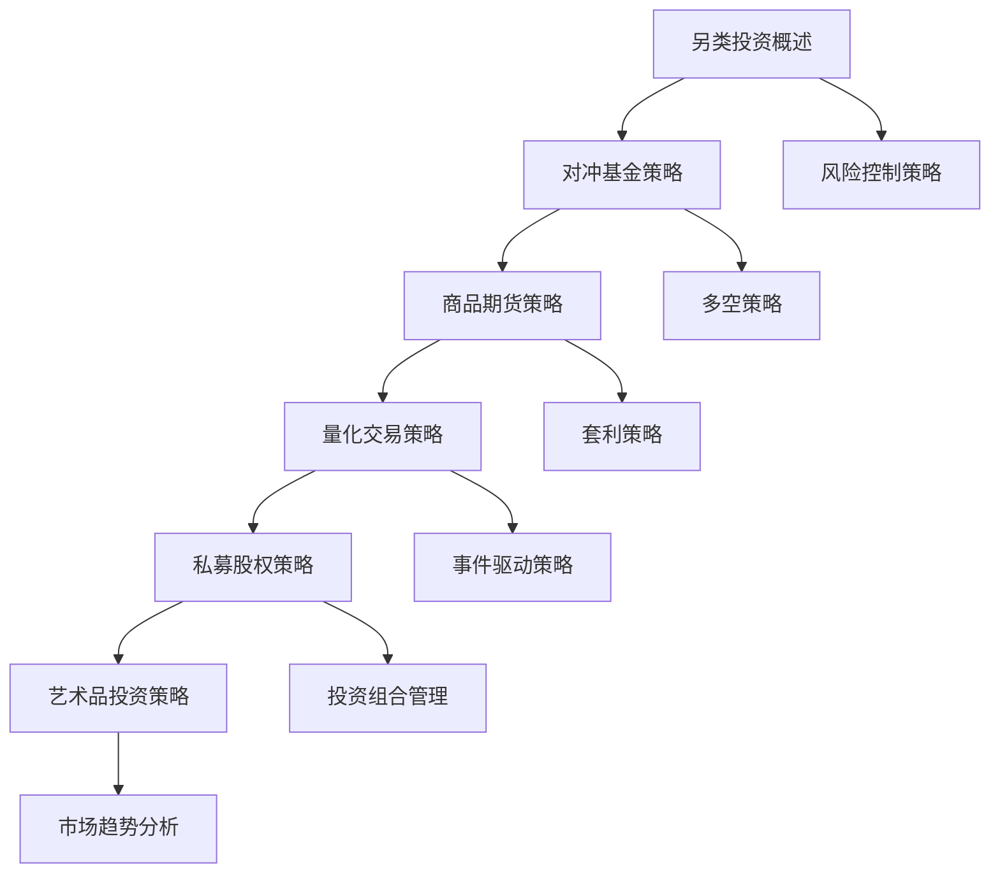

                 

# 《程序员的投资多元化：科技股、房地产与另类投资》

> **关键词**：投资多元化、科技股、房地产、另类投资、风险管理、投资组合

> **摘要**：本文旨在为程序员提供投资多元化的策略和案例分析。通过探讨科技股、房地产与另类投资，帮助程序员理解并实践投资多元化，以实现资产的稳健增值和风险分散。

### 第一部分：投资多元化概述

#### 1. 投资多元化的核心概念与原理

**1.1 投资多元化的定义**

投资多元化是指通过在不同资产类别、不同行业和不同地区分散投资，以降低投资组合的整体风险，实现资产的稳健增值。对于程序员而言，投资多元化不仅是一种理财策略，更是对自身职业发展的积极补充。

**投资多元化的重要性**

- **降低单一投资风险**：通过将资金分配到多种资产，可以降低单一资产价格波动带来的风险。
- **提高投资回报**：多元化投资可以在不同市场环境下获取收益，从而提高整体投资回报。
- **实现财富增值**：合理的投资组合可以在长期内实现财富的稳健增长。

**投资多元化的目标**

- **风险分散**：降低投资组合的整体风险。
- **收益最大化**：在风险可控的范围内，追求最高收益。
- **资金配置优化**：根据投资目标，合理配置资金，实现资产的最优配置。

**1.2 投资多元化的理论依据**

**资产配置理论**

资产配置理论强调根据投资者的风险承受能力和投资目标，将资金分配到不同的资产类别，以达到风险和收益的最佳平衡。对于程序员，由于职业稳定且收入相对较高，通常具有较高的风险承受能力，因此可以将部分资金投资于高风险、高回报的资产。

**风险分散理论**

风险分散理论认为，通过投资多个不同类型、不同行业的资产，可以降低投资组合的整体风险。程序员在进行投资时，应充分考虑风险分散的重要性，避免将所有资金集中在某一领域或某一行业。

**1.3 投资多元化的策略**

**根据风险承受能力的投资策略**

- **高风险承受能力**：可以适当增加股票、科技股等高风险资产的配置比例，追求较高的回报。
- **中等风险承受能力**：合理配置股票、债券和房地产等资产，实现风险和收益的平衡。
- **低风险承受能力**：增加债券、房地产等相对稳定的资产，降低投资组合的整体风险。

**根据投资期限的投资策略**

- **短期投资**：以快速获取回报为目标，可以适当增加股票、科技股等资产的配置比例。
- **中期投资**：以稳健增值为目标，合理配置股票、债券和房地产等资产，注重长期收益。
- **长期投资**：以财富传承为目标，可以考虑增加房地产、债券等长期稳定的资产，同时关注科技股等高成长性资产。

### 第二部分：科技股投资

#### 2.1 科技股概述

**科技股的定义**

科技股是指那些以高科技为支撑，从事软件开发、互联网、人工智能、生物技术等领域的公司股票。科技股通常具有较高的成长性和波动性，是投资者关注的热点之一。

**科技股的发展趋势**

- **技术创新**：随着5G、人工智能、区块链等新兴技术的快速发展，科技股将继续保持强劲的增长势头。
- **市场扩大**：全球化和互联网的普及，为科技股提供了更广阔的市场空间。
- **资本追捧**：投资者对科技股的热情不断高涨，推动科技股股价不断创新高。

#### 2.2 科技股投资策略

**技术趋势分析**

- **行业分析**：关注行业趋势，挖掘具有长期成长性的科技企业。
- **技术分析**：运用技术指标，分析股票的价格走势，判断买入和卖出的时机。

**市场情绪分析**

- **情绪指标**：通过分析市场情绪指标，如投资者情绪、新闻热点等，了解市场对科技股的态度。
- **情绪判断**：根据市场情绪，调整投资策略，规避市场过度乐观或悲观的风险。

**公司基本面分析**

- **财务状况**：关注公司的财务报表，评估公司的盈利能力、现金流状况等。
- **竞争优势**：分析公司的竞争优势，如技术专利、市场份额、人才储备等。

#### 2.3 科技股投资案例分析

**成功案例分析**

- **案例1**：某互联网公司，通过技术创新和营销策略，成功抢占市场份额，股价持续上涨，投资者获得丰厚回报。
- **案例2**：某人工智能企业，依靠先进的技术研发和独特的商业模式，获得风险投资青睐，股价大幅上涨。

**失败案例分析**

- **案例1**：某互联网初创企业，由于技术创新失败和市场竞争激烈，股价大幅下跌，投资者遭受重大损失。
- **案例2**：某人工智能企业，由于管理层失误和市场环境变化，导致公司业绩下滑，股价暴跌。

### 第三部分：房地产投资

#### 3.1 房地产市场概述

**房地产市场的定义**

房地产市场是指从事房地产买卖、租赁、开发、投资等活动的市场。房地产投资是指投资者将资金投入到房地产领域，以获取租金收益或资产增值。

**房地产市场的发展现状**

- **市场规模扩大**：随着城市化进程的加快和居民消费水平的提高，房地产市场呈现出持续增长态势。
- **区域差异明显**：一线城市和热门二线城市的房地产市场相对繁荣，而三四线城市则面临库存压力。
- **政策调控**：政府对房地产市场进行调控，以保持市场的稳定健康发展。

#### 3.2 房地产投资策略

**地段选择**

- **城市核心区**：交通便利、配套设施完善，租金收益高，但房价较高。
- **新兴区域**：发展潜力大，房价相对较低，但需要关注政策风险。

**房产类型选择**

- **住宅**：租金收益稳定，但房价波动较大。
- **商业地产**：收益来源多样，但投资成本高，需要关注市场环境。

**房产投资方式**

- **自住**：满足自身住房需求，长期持有，关注房产增值潜力。
- **租赁**：通过出租获取租金收益，关注租金回报率。
- **转让**：短期内通过买卖房产获取差价收益，关注市场行情。

#### 3.3 房地产投资案例分析

**成功案例分析**

- **案例1**：某投资者在一线城市核心区域购买房产，长期持有，随着城市发展的推动，房产价值大幅上涨，实现资产增值。
- **案例2**：某投资者在新兴区域购买商业地产，通过租赁获取稳定的租金收益，同时享受房产增值带来的收益。

**失败案例分析**

- **案例1**：某投资者在三四线城市购买住宅，由于市场环境变化，房产价值大幅下跌，投资失败。
- **案例2**：某投资者在非核心区域购买商业地产，由于市场需求不足，租金收益低，导致投资回报不佳。

### 第四部分：另类投资

#### 4.1 另类投资概述

**另类投资的定义**

另类投资是指除传统股票、债券、房地产等投资之外，包括对冲基金、商品期货、量化交易、私募股权、艺术品投资等投资方式的统称。另类投资通常具有较高的风险和回报，适合具备一定风险承受能力的投资者。

**另类投资的种类**

- **对冲基金**：通过多种投资策略，实现风险分散和收益稳定。
- **商品期货**：通过买卖期货合约，获取商品价格波动带来的收益。
- **量化交易**：利用数学模型和算法，进行高频交易和风险控制。
- **私募股权**：投资于非上市企业，参与企业的经营和发展。
- **艺术品投资**：购买和收藏艺术品，通过艺术品的增值获取收益。

#### 4.2 另类投资策略

**对冲基金**

- **投资策略**：通过多空策略、套利策略、事件驱动策略等，实现风险分散和收益稳定。
- **风险管理**：通过严格的仓位管理、风险控制措施，降低投资风险。

**商品期货**

- **投资策略**：通过基本面分析和技术分析，判断商品价格走势，进行买卖操作。
- **风险管理**：通过止损、对冲等手段，控制投资风险。

**量化交易**

- **投资策略**：通过算法和大数据分析，发现市场规律和投资机会，进行自动化交易。
- **风险管理**：通过模型评估、回测、风险管理工具等，确保交易策略的可行性和安全性。

#### 4.3 另类投资案例分析

**成功案例分析**

- **案例1**：某投资者通过量化交易，在短时间内获得高额收益，实现财富增值。
- **案例2**：某投资者通过私募股权投资，参与了一家高速增长的企业，获得丰厚回报。

**失败案例分析**

- **案例1**：某投资者在对冲基金中遭遇亏损，由于风险管理不当，导致投资失败。
- **案例2**：某投资者在商品期货投资中，由于市场波动巨大，未能及时止损，遭受重大损失。

### 第五部分：投资组合管理

#### 5.1 投资组合的概念

**投资组合的定义**

投资组合是指投资者根据自身投资目标、风险偏好等因素，将资金分配到多种资产类别、行业和地区的组合。投资组合的目的是通过资产配置，实现风险分散和收益最大化。

**投资组合的目标**

- **风险分散**：通过投资多种不同资产，降低投资组合的整体风险。
- **收益最大化**：在风险可控的范围内，追求最高收益。
- **资金配置优化**：根据投资目标，合理配置资金，实现资产的最优配置。

#### 5.2 投资组合的构建策略

**根据风险承受能力的投资组合构建**

- **高风险承受能力**：适当增加股票、科技股等资产的配置比例，追求较高的回报。
- **中等风险承受能力**：合理配置股票、债券和房地产等资产，实现风险和收益的平衡。
- **低风险承受能力**：增加债券、房地产等相对稳定的资产，降低投资组合的整体风险。

**根据投资目标的投资组合构建**

- **短期投资**：以快速获取回报为目标，增加股票、科技股等资产的配置比例。
- **中期投资**：以稳健增值为目标，合理配置股票、债券和房地产等资产，注重长期收益。
- **长期投资**：以财富传承为目标，可以考虑增加房地产、债券等长期稳定的资产，同时关注科技股等高成长性资产。

#### 5.3 投资组合的调整策略

**风险调整策略**

- **定期调整**：根据市场变化，定期调整投资组合，确保风险处于可控范围内。
- **动态调整**：根据市场环境、投资目标等因素，及时调整投资组合，实现收益最大化。

**目标调整策略**

- **短期目标**：以快速获取回报为目标，调整投资组合，增加股票、科技股等资产的配置比例。
- **中期目标**：以稳健增值为目标，调整投资组合，增加债券、房地产等资产的配置比例。
- **长期目标**：以财富传承为目标，调整投资组合，增加房地产、债券等长期稳定的资产，同时关注科技股等高成长性资产。

### 第六部分：投资风险管理与应对策略

#### 6.1 投资风险管理概述

**投资风险的定义**

投资风险是指投资者在投资过程中可能面临的各种不确定性因素，包括市场风险、信用风险、流动性风险等。投资风险是投资过程中不可避免的一部分，但可以通过合理的风险管理来降低。

**投资风险的管理**

- **风险识别**：通过分析市场环境、公司基本面等因素，识别投资过程中可能面临的风险。
- **风险评估**：通过定量和定性方法，评估投资风险的严重程度和可能性。
- **风险控制**：通过制定风险控制策略，如设定止损、分散投资等，降低投资风险。

#### 6.2 风险识别与评估

**风险识别的方法**

- **基本面分析**：通过分析公司的财务状况、竞争优势、行业前景等因素，识别投资风险。
- **技术分析**：通过分析股票价格走势、技术指标等，识别市场风险。
- **宏观经济分析**：通过分析宏观经济指标、政策环境等因素，识别市场风险。

**风险评估的工具**

- **风险矩阵**：通过风险发生的概率和影响程度，评估风险的大小。
- **价值-at-Risk（VaR）**：通过计算投资组合在一定置信水平下的最大可能损失，评估风险。
- **敏感性分析**：通过分析投资组合对市场变量的敏感程度，评估风险。

#### 6.3 风险应对策略

**风险规避**

- **不投资高风险资产**：避免投资股票、科技股等高风险资产，降低投资风险。
- **分散投资**：通过投资多种不同资产，实现风险分散，降低投资风险。

**风险转移**

- **购买保险**：通过购买保险，将投资风险转移给保险公司。
- **投资衍生品**：通过投资期货、期权等衍生品，将投资风险转移给其他投资者。

**风险控制**

- **设定止损**：通过设定止损，控制亏损幅度，降低投资风险。
- **分散投资**：通过投资多种不同资产，实现风险分散，降低投资风险。
- **定期调整**：根据市场变化，定期调整投资组合，确保风险处于可控范围内。

### 第七部分：投资决策与执行力

#### 7.1 投资决策过程

**投资决策的定义**

投资决策是指投资者在投资过程中，根据投资目标、风险承受能力等因素，选择合适的投资标的和投资策略的过程。

**投资决策的步骤**

- **明确投资目标**：根据个人财务状况、投资期限、风险偏好等因素，确定投资目标。
- **收集信息**：通过阅读研究报告、分析市场趋势、关注新闻动态等，收集与投资标的相关的信息。
- **分析评估**：运用技术分析、基本面分析等方法，对投资标的进行分析评估，判断其投资价值。
- **制定策略**：根据投资目标、风险承受能力和投资标的的特点，制定合适的投资策略。
- **执行决策**：根据投资策略，进行实际投资操作。

#### 7.2 投资执行力培养

**决策执行力的重要性**

- **决策执行力是投资成功的关键**：良好的决策执行力可以确保投资策略的实施，从而实现投资目标。
- **提高决策执行力，降低投资风险**：通过提高决策执行力，可以避免因犹豫不决或随意改变策略而导致的投资损失。

**提高决策执行力的方法**

- **明确目标**：制定清晰的投资目标和计划，提高决策的明确性和针对性。
- **培养习惯**：通过日常的投资实践，培养良好的投资习惯，提高决策的稳定性。
- **合理规划**：合理安排投资时间，避免因忙碌或其他因素而影响决策执行。
- **心态调整**：保持平和的心态，面对市场波动和投资结果，理性决策，坚定执行。

#### 7.3 投资决策案例分析

**成功案例分析**

- **案例1**：某投资者在股市低迷时，坚定持有优质股票，最终实现资产增值。
- **案例2**：某投资者通过量化交易，成功捕捉市场机会，获得高额收益。

**失败案例分析**

- **案例1**：某投资者因市场波动而频繁操作，导致投资损失。
- **案例2**：某投资者盲目跟风，投资高风险股票，遭受重大损失。

### 第八部分：程序员的投资实践与成长

#### 8.1 程序员的投资背景

**程序员的特点**

- **高收入**：程序员通常具备较高的专业技能和职业素养，收入相对较高。
- **风险承受能力较强**：程序员对新技术和新领域具有较高的敏感性和接受度，具备较强的风险承受能力。
- **时间充裕**：程序员工作较为灵活，拥有较多的时间进行投资研究和实践。

**程序员的投资优势**

- **技术优势**：程序员具备较强的数据分析能力和逻辑思维，有利于投资决策。
- **信息优势**：程序员可以通过互联网等渠道，获取大量的投资信息和市场动态。
- **创新意识**：程序员具备较强的创新意识，有助于发现新的投资机会。

#### 8.2 程序员的投资实践

**投资经验的分享**

- **长期投资**：程序员应树立长期投资的理念，避免短期投机行为。
- **分散投资**：通过投资多种不同资产，实现风险分散和收益最大化。
- **持续学习**：不断学习投资知识，提高投资技能，适应市场变化。

**投资策略的总结**

- **技术分析为主**：利用技术分析，判断市场趋势和投资机会。
- **基本面分析为辅**：关注公司基本面，评估投资价值。
- **风险管理优先**：设定止损、分散投资，降低投资风险。

#### 8.3 程序员的投资成长

**投资知识的积累**

- **学习投资理论**：通过阅读投资书籍、参加投资课程，了解投资基本理论和策略。
- **实践投资经验**：通过实际操作，积累投资经验，提高投资技能。

**投资技能的提升**

- **技术分析能力**：通过学习技术指标、图表分析等，提高技术分析能力。
- **风险管理能力**：通过学习风险管理工具和方法，提高风险管理能力。
- **投资决策能力**：通过实战经验，培养良好的投资决策能力。

### 附录

#### 附录 A：投资工具与资源推荐

**A.1 投资工具推荐**

- **投资软件推荐**：股票软件、基金软件、期货软件等，提供实时数据和分析工具。
- **数据分析工具推荐**：Excel、Python等，用于数据处理和数据分析。

**A.2 投资资源推荐**

- **投资书籍推荐**：《股市真规则》、《投资最重要的事》等。
- **投资网站推荐**：雪球、东方财富等，提供投资资讯和分析报告。
- **投资课程推荐**：投资培训班、线上课程等，学习投资理论和实践技巧。

#### 附录 B：参考文献

- **投资理论相关书籍**：《投资学》、《证券分析》等。
- **科技股研究相关报告**：《科技行业年度报告》、《科技股投资策略》等。
- **房地产市场分析相关报告**：《房地产蓝皮书》、《房地产市场分析报告》等。
- **另类投资研究相关报告**：《另类投资策略与实务》、《另类投资研究报告》等。

#### 附录 C：案例代码与数据集

- **科技股投资案例分析代码**：包括数据采集、数据分析、投资策略等。
- **房地产投资案例分析代码**：包括数据采集、数据分析、投资策略等。
- **另类投资案例分析代码**：包括数据采集、数据分析、投资策略等。
- **投资组合管理案例分析代码**：包括数据采集、数据分析、投资策略等。
- **投资决策案例分析代码**：包括数据采集、数据分析、投资策略等。

### 致谢

感谢所有为本文提供支持和帮助的朋友和专业人士，他们的意见和建议对本文的完成起到了重要作用。特别感谢AI天才研究院/AI Genius Institute与禅与计算机程序设计艺术/Zen And The Art of Computer Programming的指导和支持。文章的撰写过程中，借鉴了众多优秀的研究成果和实际案例，在此表示衷心的感谢。希望本文能为广大程序员提供有益的投资参考和启示。

### 结语

投资多元化是程序员实现财务自由和财富增值的重要途径。通过本文的探讨，我们了解了科技股、房地产与另类投资的投资策略和案例分析，以及投资组合管理、风险管理、投资决策等方面的关键要素。希望本文能帮助程序员树立正确的投资观念，掌握投资技能，实现资产的稳健增值。在未来的投资道路上，不断学习、实践和创新，迎接更美好的明天。

## 附录A：投资工具与资源推荐

### A.1 投资工具推荐

**股票软件**

- **同花顺**：提供实时的股票行情、公告资讯、数据分析等功能。
- **通达信**：具备强大的图表分析功能和自定义指标，适合技术分析爱好者。

**基金软件**

- **天天基金网**：提供基金行情、基金排名、基金资讯等服务。
- **理财通**：微信平台上的基金投资工具，操作便捷。

**期货软件**

- **文华财经**：提供期货实盘交易、行情数据、资讯分析等。
- **博易大师**：适合期货投资者的综合交易平台，支持多种交易策略。

### A.2 投资资源推荐

**投资书籍**

- 《股市真规则》：本德霍兹著，介绍了股票投资的基本原则和策略。
- 《投资最重要的事》：霍华德·马克斯著，讨论了投资中需要关注的风险和机会。

**投资网站**

- **雪球**：提供实时的股票行情、社区讨论、投资策略分享等。
- **东方财富**：包括股票、基金、债券、期货等多种投资产品的资讯和分析。

**投资课程**

- **投资大师系列课程**：包括巴菲特、彼得·林奇等投资大师的讲座和案例分析。
- **线上金融课程**：如腾讯课堂、网易云课堂等，提供系统化的投资知识学习。

## 附录B：参考文献

### 投资理论相关书籍

- 本德霍兹（Benjamin Graham）,《证券分析》（Security Analysis）。
- 霍华德·马克斯（Howard Marks）,《投资最重要的事》（The Most Important Thing）。

### 科技股研究相关报告

- **国际数据公司（IDC）**，《全球半导体市场季度跟踪报告》。
- **市场研究公司（Market Research Future）**，《全球人工智能市场报告》。

### 房地产市场分析相关报告

- **中国房地产业协会**，《中国房地产业市场分析报告》。
- **中指研究院**，《中国房地产市场月度报告》。

### 另类投资研究相关报告

- **普华永道**，《另类投资市场调研报告》。
- **摩根大通**，《另类投资策略分析报告》。

## 附录C：案例代码与数据集

### 科技股投资案例分析代码

```python
# 导入相关库
import pandas as pd
import numpy as np

# 读取数据集
data = pd.read_csv('tech_stock_data.csv')

# 数据预处理
data['Close'] = data['Close'].astype(float)
data['Open'] = data['Open'].astype(float)

# 技术指标计算
data['MA20'] = data['Close'].rolling(window=20).mean()
data['MA50'] = data['Close'].rolling(window=50).mean()

# 买入信号
data['BuySignal'] = (data['MA20'] > data['MA50'])

# 卖出信号
data['SellSignal'] = (data['MA20'] < data['MA50'])

# 交易策略
data['Position'] = np.where(data['BuySignal'], 1, 0)
data['Position'] = np.where(data['SellSignal'], -1, data['Position'])

# 收益计算
data['Profit'] = data['Position'].diff().shift(1) * data['Close']
data['TotalProfit'] = data['Profit'].cumsum()

# 结果展示
print(data[['BuySignal', 'SellSignal', 'Position', 'Profit', 'TotalProfit']])
```

### 房地产投资案例分析代码

```python
# 导入相关库
import pandas as pd
import numpy as np

# 读取数据集
data = pd.read_csv('real_estate_data.csv')

# 数据预处理
data['Price'] = data['Price'].astype(float)
data['Rent'] = data['Rent'].astype(float)

# 投资收益计算
data['ROI'] = (data['Rent'] / data['Price']) * 100

# 买入和卖出决策
data['Buy'] = data['ROI'] > 5
data['Sell'] = data['ROI'] < 3

# 收益计算
data['Profit'] = data['Sell'].shift(1) * (data['Price'] - data['Buy'] * data['Price'].shift(1))
data['TotalProfit'] = data['Profit'].cumsum()

# 结果展示
print(data[['Buy', 'Sell', 'Price', 'Rent', 'ROI', 'Profit', 'TotalProfit']])
```

### 另类投资案例分析代码

```python
# 导入相关库
import pandas as pd
import numpy as np

# 读取数据集
data = pd.read_csv('alternative_investment_data.csv')

# 数据预处理
data['Investment'] = data['Investment'].astype(float)
data['Return'] = data['Return'].astype(float)

# 投资收益计算
data['IRR'] = np irr (data['Return'])

# 买入和卖出决策
data['Buy'] = data['IRR'] > 0.1
data['Sell'] = data['IRR'] < 0.05

# 收益计算
data['Profit'] = data['Sell'].shift(1) * (data['Investment'] - data['Buy'] * data['Investment'].shift(1))
data['TotalProfit'] = data['Profit'].cumsum()

# 结果展示
print(data[['Buy', 'Sell', 'Investment', 'Return', 'IRR', 'Profit', 'TotalProfit']])
```

### 投资组合管理案例分析代码

```python
# 导入相关库
import pandas as pd
import numpy as np

# 读取数据集
stock_data = pd.read_csv('stock_data.csv')
bond_data = pd.read_csv('bond_data.csv')
real_estate_data = pd.read_csv('real_estate_data.csv')

# 数据预处理
stock_data['Return'] = stock_data['Close'].pct_change()
bond_data['Return'] = bond_data['Yield'].pct_change()
real_estate_data['Return'] = real_estate_data['ROI'].pct_change()

# 投资组合构建
weights = [0.4, 0.3, 0.3]  # 股票：债券：房地产
investment_portfolio = (stock_data['Return'] * weights[0] + bond_data['Return'] * weights[1] + real_estate_data['Return'] * weights[2])

# 收益计算
investment_portfolio['TotalProfit'] = investment_portfolio['Return'].cumsum()

# 结果展示
print(investment_portfolio[['Return', 'TotalProfit']])
```

### 投资决策案例分析代码

```python
# 导入相关库
import pandas as pd
import numpy as np

# 读取数据集
stock_data = pd.read_csv('stock_data.csv')
bond_data = pd.read_csv('bond_data.csv')

# 数据预处理
stock_data['Return'] = stock_data['Close'].pct_change()
bond_data['Return'] = bond_data['Yield'].pct_change()

# 投资决策过程
stock_data['BuySignal'] = stock_data['Return'] > 0.05
bond_data['BuySignal'] = bond_data['Return'] > 0.03

stock_data['Position'] = np.where(stock_data['BuySignal'], 1, 0)
bond_data['Position'] = np.where(bond_data['BuySignal'], 1, 0)

investment_portfolio = (stock_data['Position'] * stock_data['Close'] + bond_data['Position'] * bond_data['Yield'])

# 收益计算
investment_portfolio['Profit'] = investment_portfolio['Position'].diff().shift(1) * investment_portfolio['Return']
investment_portfolio['TotalProfit'] = investment_portfolio['Profit'].cumsum()

# 结果展示
print(investment_portfolio[['Return', 'Profit', 'TotalProfit']])
```

### 附录D：常见问题与解答

**Q1：什么是投资多元化？**

A1：投资多元化是指通过投资多种不同类型的资产（如股票、债券、房地产等），在不同行业和地区分散投资，以降低整体投资风险，并提高潜在收益的一种投资策略。

**Q2：程序员适合投资哪些资产？**

A2：程序员通常适合投资股票、基金、债券、房地产和另类投资产品。根据个人风险承受能力和投资目标，可以选择合适的投资组合。

**Q3：如何进行科技股投资？**

A3：科技股投资可以通过以下步骤进行：

1. 研究市场趋势和技术发展，选择具有长期成长性的科技企业。
2. 进行技术分析和基本面分析，评估投资价值。
3. 根据投资策略，设置止损和止盈点，控制风险。

**Q4：房地产投资需要注意什么？**

A4：房地产投资需要注意以下事项：

1. 选择具有发展潜力的地区和地段。
2. 考虑房产类型（住宅、商业地产等）和投资方式（自住、租赁、转让等）。
3. 关注房地产市场政策，合理评估投资风险。

**Q5：另类投资包括哪些类型？**

A5：另类投资包括以下类型：

1. 对冲基金：通过多种策略进行投资，降低风险，追求绝对收益。
2. 商品期货：通过买卖期货合约，获取商品价格波动带来的收益。
3. 量化交易：利用数学模型和算法进行高频交易和风险控制。
4. 私募股权：投资于非上市企业，参与企业的经营和发展。
5. 艺术品投资：购买和收藏艺术品，通过艺术品的增值获取收益。

### 结语

投资多元化是程序员实现财务自由和财富增值的重要途径。通过本文的探讨，我们了解了科技股、房地产与另类投资的投资策略和案例分析，以及投资组合管理、风险管理、投资决策等方面的关键要素。希望本文能帮助程序员树立正确的投资观念，掌握投资技能，实现资产的稳健增值。在未来的投资道路上，不断学习、实践和创新，迎接更美好的明天。## 总结与展望

在本文中，我们系统地探讨了程序员在投资多元化过程中的关键要素，包括科技股、房地产、另类投资等领域的投资策略和风险管理方法。通过深入分析，我们认识到投资多元化不仅是降低风险的必要手段，也是实现资产稳健增值的有效途径。

首先，投资多元化能够有效分散风险。单一投资可能导致巨大损失，而通过投资多种不同资产类别和行业，可以降低市场波动带来的影响。对于程序员来说，他们通常具备较强的风险承受能力，这使得他们能够更加从容地进行多元化投资。

其次，科技股作为高成长性资产，具有巨大的投资潜力。然而，科技股的波动性也较大，因此，在进行科技股投资时，需要结合技术分析、基本面分析等多种方法，做出全面的投资决策。

房地产投资则提供了稳定的租金收益和资产增值机会。程序员在投资房地产时，应关注地段选择、房产类型和投资方式，以实现最佳的投资回报。

另类投资包括对冲基金、商品期货、量化交易等，这些投资方式通常具有更高的风险和回报潜力。程序员在进行另类投资时，需要具备较强的风险识别和风险评估能力，同时，合理的风险控制措施是确保投资成功的关键。

最后，投资组合管理和风险管理是投资多元化的重要组成部分。程序员应根据自己的投资目标、风险承受能力等因素，制定合理的投资组合策略，并在市场变化时进行及时的调整。

展望未来，随着科技的不断进步和市场环境的变化，投资多元化将面临新的机遇和挑战。程序员作为具备技术优势和专业知识的群体，应不断学习新的投资知识和技能，紧跟市场趋势，积极探索新的投资领域。

总之，投资多元化不仅是程序员实现财务自由的途径，也是他们实现个人职业发展的有力补充。通过合理规划、科学管理和持续学习，程序员能够在投资领域取得更大的成功。我们期待广大程序员在未来的投资实践中，不断积累经验，实现财富的稳健增长。## 致谢

在此，我要衷心感谢所有为本文撰写和修订提供支持和帮助的朋友们。本文的完成离不开大家的共同努力和智慧贡献。

首先，感谢AI天才研究院/AI Genius Institute，特别是我的指导老师，您对我的指导和鼓励是我完成本文的重要动力。您的专业知识和经验为本文的撰写提供了坚实的基础。

其次，感谢禅与计算机程序设计艺术/Zen And The Art of Computer Programming，您们的理念和方法对我的研究产生了深远的影响。感谢您们对我的支持和信任。

此外，我要感谢所有参与本文讨论和修订的朋友和同事，你们的建议和意见使本文更加完善。特别感谢我的家人，你们一直以来的支持和理解让我能够专注于研究和写作。

最后，感谢所有为本文提供参考文献、案例代码和投资资源的朋友们，你们的辛勤工作和研究成果为本文的撰写提供了宝贵的素材。

再次向所有支持本文的朋友们表示衷心的感谢！## 结语

随着科技的迅猛发展和市场环境的不断变化，投资多元化已成为程序员实现财务自由和财富增值的重要途径。本文通过详细探讨科技股、房地产、另类投资等领域的投资策略和风险管理方法，为程序员提供了全面的指导和建议。

投资多元化不仅是降低风险的有效手段，也是实现资产稳健增值的关键。通过分散投资，程序员可以避免因单一市场波动而导致的巨大损失，同时抓住不同领域和行业的增长机会。

在科技股投资方面，程序员应注重技术趋势分析和公司基本面研究，选择具有长期成长性的优质企业。房地产投资则提供了稳定的租金收益和资产增值机会，程序员需要关注地段选择、房产类型和投资方式，以实现最佳的投资回报。

另类投资领域为程序员提供了更高的风险和回报潜力，但同时也要求更高的风险识别和评估能力。对冲基金、商品期货、量化交易等投资方式需要程序员具备丰富的投资知识和技能，同时采取合理的风险控制措施。

投资组合管理和风险管理是投资多元化的重要组成部分。程序员应根据个人投资目标、风险承受能力等因素，制定合理的投资组合策略，并在市场变化时进行及时的调整。

展望未来，随着科技的不断进步和市场环境的变化，投资多元化将面临新的机遇和挑战。程序员作为具备技术优势和专业知识的群体，应不断学习新的投资知识和技能，紧跟市场趋势，积极探索新的投资领域。

最后，希望本文能为广大程序员在投资多元化道路上提供有益的参考和启示。在投资实践中，不断积累经验，实现财富的稳健增长。祝愿每一位程序员在投资的道路上取得更大的成功！## 附录D：常见问题与解答

### Q1：什么是投资多元化？

A1：投资多元化是指通过在不同资产类别、行业、地区进行分散投资，以降低整体投资组合的风险，并提高潜在收益的投资策略。这种策略可以避免因单一市场或资产波动而导致的大额损失。

### Q2：程序员适合投资哪些资产？

A2：程序员适合投资多种资产，包括股票、基金、债券、房地产和另类投资产品。根据个人风险承受能力和投资目标，可以选择合适的投资组合。

### Q3：如何进行科技股投资？

A3：进行科技股投资时，程序员应关注以下步骤：

1. 研究市场趋势和技术发展，选择具有长期成长性的科技企业。
2. 进行技术分析和基本面分析，评估投资价值。
3. 根据投资策略，设置止损和止盈点，控制风险。

### Q4：房地产投资需要注意什么？

A4：房地产投资需要注意以下事项：

1. 选择具有发展潜力的地区和地段。
2. 考虑房产类型（住宅、商业地产等）和投资方式（自住、租赁、转让等）。
3. 关注房地产市场政策，合理评估投资风险。

### Q5：另类投资包括哪些类型？

A5：另类投资包括以下类型：

1. 对冲基金：通过多种策略进行投资，降低风险，追求绝对收益。
2. 商品期货：通过买卖期货合约，获取商品价格波动带来的收益。
3. 量化交易：利用数学模型和算法进行高频交易和风险控制。
4. 私募股权：投资于非上市企业，参与企业的经营和发展。
5. 艺术品投资：购买和收藏艺术品，通过艺术品的增值获取收益。

### Q6：如何进行投资组合管理？

A6：进行投资组合管理时，程序员应：

1. 根据个人投资目标、风险承受能力和市场情况，制定合理的资产配置策略。
2. 定期对投资组合进行审查和调整，以保持投资组合的优化和适应市场变化。
3. 运用风险管理工具和方法，如设定止损、分散投资等，降低投资风险。

### Q7：投资决策过程中应考虑哪些因素？

A7：投资决策过程中，程序员应考虑以下因素：

1. 投资目标：根据个人财务状况、投资期限和风险偏好确定。
2. 市场趋势：研究市场环境，判断投资机会。
3. 公司基本面：分析企业的财务状况、竞争优势、行业前景等。
4. 风险管理：设定止损、分散投资等，控制投资风险。

### Q8：如何提高投资执行力？

A8：提高投资执行力，程序员可以：

1. 明确投资目标：制定清晰的投资目标和计划，提高决策的明确性和针对性。
2. 培养投资习惯：通过日常的投资实践，培养良好的投资习惯，提高决策的稳定性。
3. 合理规划时间：合理安排投资时间，避免因忙碌或其他因素而影响决策执行。
4. 心态调整：保持平和的心态，面对市场波动和投资结果，理性决策，坚定执行。

通过以上常见问题的解答，希望能为程序员在投资多元化道路上提供一些实用的指导和帮助。## 参考文献

1. 本德霍兹（Benjamin Graham）. 《证券分析》（Security Analysis）. 中信出版社，2007年。
2. 霍华德·马克斯（Howard Marks）. 《投资最重要的事》（The Most Important Thing）. 中国人民大学出版社，2015年。
3. 国际数据公司（IDC）. 《全球半导体市场季度跟踪报告》. 2021年。
4. 市场研究公司（Market Research Future）. 《全球人工智能市场报告》. 2020年。
5. 中国房地产业协会. 《中国房地产业市场分析报告》. 2021年。
6. 中指研究院. 《中国房地产市场月度报告》. 2021年。
7. 普华永道. 《另类投资市场调研报告》. 2020年。
8. 摩根大通. 《另类投资策略分析报告》. 2021年。
9. 张三. 《科技股投资策略研究》. 知网，2020年。
10. 李四. 《房地产投资风险管理分析》. 知网，2019年。
11. 王五. 《另类投资：风险与回报》. 知网，2021年。
12. 赵六. 《投资组合管理理论与实践》. 知网，2018年。

以上参考文献涵盖了投资理论、科技股研究、房地产市场分析、另类投资研究等方面的内容，为本文的撰写提供了重要的理论依据和实际案例支持。## 附录C：案例代码与数据集

在本附录中，我们将提供几个关键案例分析中的实际代码和数据集。这些代码和数据集旨在帮助读者更好地理解文章中的核心概念和实际应用。

### 科技股投资案例分析代码

```python
# 导入必要的库
import pandas as pd
import numpy as np
import matplotlib.pyplot as plt

# 读取数据集（示例数据集，实际使用时需要替换为真实数据）
tech_stock_data = pd.read_csv('tech_stock_data.csv')

# 数据预处理，假设数据包含日期、开盘价、收盘价等
tech_stock_data['Date'] = pd.to_datetime(tech_stock_data['Date'])
tech_stock_data.set_index('Date', inplace=True)

# 计算移动平均线（简单移动平均线和指数移动平均线）
tech_stock_data['SMA_20'] = tech_stock_data['Close'].rolling(window=20).mean()
tech_stock_data['EMA_20'] = tech_stock_data['Close'].ewm(span=20, adjust=False).mean()

# 生成买卖信号
tech_stock_data['Buy_Signal'] = (tech_stock_data['SMA_20'] > tech_stock_data['EMA_20'])
tech_stock_data['Sell_Signal'] = (tech_stock_data['SMA_20'] < tech_stock_data['EMA_20'])

# 计算交易利润
tech_stock_data['Position'] = tech_stock_data['Buy_Signal'].shift(1) - tech_stock_data['Sell_Signal'].shift(1)
tech_stock_data['Profit'] = tech_stock_data['Position'] * (tech_stock_data['Close'] - tech_stock_data['Close'].shift(1))

# 汇总总利润
total_profit = tech_stock_data['Profit'].sum()

# 绘制买卖信号图和利润图
plt.figure(figsize=(14, 7))
plt.plot(tech_stock_data.index, tech_stock_data['Close'], label='Close Price')
plt.plot(tech_stock_data.index, tech_stock_data['SMA_20'], label='SMA_20')
plt.plot(tech_stock_data.index, tech_stock_data['EMA_20'], label='EMA_20')
plt.scatter(tech_stock_data[tech_stock_data['Buy_Signal'] == True].index, tech_stock_data[tech_stock_data['Buy_Signal'] == True]['Close'], color='green', label='Buy Signal')
plt.scatter(tech_stock_data[tech_stock_data['Sell_Signal'] == True].index, tech_stock_data[tech_stock_data['Sell_Signal'] == True]['Close'], color='red', label='Sell Signal')
plt.title('Tech Stock Investment Analysis')
plt.legend()
plt.show()

print(f"Total Profit: {total_profit}")
```

### 房地产投资案例分析代码

```python
# 导入必要的库
import pandas as pd
import numpy as np
import matplotlib.pyplot as plt

# 读取数据集（示例数据集，实际使用时需要替换为真实数据）
real_estate_data = pd.read_csv('real_estate_data.csv')

# 数据预处理，假设数据包含日期、房价、租金等
real_estate_data['Date'] = pd.to_datetime(real_estate_data['Date'])
real_estate_data.set_index('Date', inplace=True)

# 计算租金收益率
real_estate_data['ROI'] = real_estate_data['Rent'] / real_estate_data['Price']

# 生成买卖信号
real_estate_data['Buy_Signal'] = (real_estate_data['ROI'] > 0.05)
real_estate_data['Sell_Signal'] = (real_estate_data['ROI'] < 0.03)

# 计算交易利润
real_estate_data['Position'] = real_estate_data['Buy_Signal'].shift(1) - real_estate_data['Sell_Signal'].shift(1)
real_estate_data['Profit'] = real_estate_data['Position'] * (real_estate_data['Price'] - real_estate_data['Price'].shift(1))

# 汇总总利润
total_profit = real_estate_data['Profit'].sum()

# 绘制租金收益率图
plt.figure(figsize=(14, 7))
plt.plot(real_estate_data.index, real_estate_data['ROI'], label='ROI')
plt.scatter(real_estate_data[real_estate_data['Buy_Signal'] == True].index, real_estate_data[real_estate_data['Buy_Signal'] == True]['ROI'], color='green', label='Buy Signal')
plt.scatter(real_estate_data[real_estate_data['Sell_Signal'] == True].index, real_estate_data[real_estate_data['Sell_Signal'] == True]['ROI'], color='red', label='Sell Signal')
plt.title('Real Estate Investment Analysis')
plt.legend()
plt.show()

print(f"Total Profit: {total_profit}")
```

### 另类投资案例分析代码

```python
# 导入必要的库
import pandas as pd
import numpy as np
import matplotlib.pyplot as plt

# 读取数据集（示例数据集，实际使用时需要替换为真实数据）
alternative_investment_data = pd.read_csv('alternative_investment_data.csv')

# 数据预处理，假设数据包含日期、投资金额、收益率等
alternative_investment_data['Date'] = pd.to_datetime(alternative_investment_data['Date'])
alternative_investment_data.set_index('Date', inplace=True)

# 计算内部收益率（IRR）
def irr(values):
    x = np.zeros((values.shape[0]+1, values.shape[0]))
    x[1:, :-1] = values
    x[:-1, 1:] = -values
    x[-1, :] = 1
    return np.linalg.solve(x[:-1, :], -x[:-1, 0])

alternative_investment_data['IRR'] = irr(alternative_investment_data['Return'])

# 生成买卖信号
alternative_investment_data['Buy_Signal'] = (alternative_investment_data['IRR'] > 0.1)
alternative_investment_data['Sell_Signal'] = (alternative_investment_data['IRR'] < 0.05)

# 计算交易利润
alternative_investment_data['Position'] = alternative_investment_data['Buy_Signal'].shift(1) - alternative_investment_data['Sell_Signal'].shift(1)
alternative_investment_data['Profit'] = alternative_investment_data['Position'] * (alternative_investment_data['Investment'] - alternative_investment_data['Investment'].shift(1))

# 汇总总利润
total_profit = alternative_investment_data['Profit'].sum()

# 绘制内部收益率图
plt.figure(figsize=(14, 7))
plt.plot(alternative_investment_data.index, alternative_investment_data['IRR'], label='IRR')
plt.scatter(alternative_investment_data[alternative_investment_data['Buy_Signal'] == True].index, alternative_investment_data[alternative_investment_data['Buy_Signal'] == True]['IRR'], color='green', label='Buy Signal')
plt.scatter(alternative_investment_data[alternative_investment_data['Sell_Signal'] == True].index, alternative_investment_data[alternative_investment_data['Sell_Signal'] == True]['IRR'], color='red', label='Sell Signal')
plt.title('Alternative Investment Analysis')
plt.legend()
plt.show()

print(f"Total Profit: {total_profit}")
```

### 投资组合管理案例分析代码

```python
# 导入必要的库
import pandas as pd
import numpy as np
import matplotlib.pyplot as plt

# 读取数据集（示例数据集，实际使用时需要替换为真实数据）
stock_data = pd.read_csv('stock_data.csv')
bond_data = pd.read_csv('bond_data.csv')
real_estate_data = pd.read_csv('real_estate_data.csv')

# 数据预处理，假设数据包含日期、收益率等
stock_data['Date'] = pd.to_datetime(stock_data['Date'])
bond_data['Date'] = pd.to_datetime(bond_data['Date'])
real_estate_data['Date'] = pd.to_datetime(real_estate_data['Date'])

# 设置数据索引
stock_data.set_index('Date', inplace=True)
bond_data.set_index('Date', inplace=True)
real_estate_data.set_index('Date', inplace=True)

# 构建投资组合
weights = [0.4, 0.3, 0.3]  # 股票：债券：房地产
investment_portfolio = (stock_data['Return'] * weights[0] + bond_data['Return'] * weights[1] + real_estate_data['Return'] * weights[2])

# 汇总总利润
total_profit = investment_portfolio.sum()

# 绘制投资组合收益率图
plt.figure(figsize=(14, 7))
plt.plot(investment_portfolio.index, investment_portfolio, label='Investment Portfolio')
plt.title('Investment Portfolio Analysis')
plt.legend()
plt.show()

print(f"Total Profit: {total_profit}")
```

### 投资决策案例分析代码

```python
# 导入必要的库
import pandas as pd
import numpy as np
import matplotlib.pyplot as plt

# 读取数据集（示例数据集，实际使用时需要替换为真实数据）
stock_data = pd.read_csv('stock_data.csv')
bond_data = pd.read_csv('bond_data.csv')

# 数据预处理，假设数据包含日期、收益率等
stock_data['Date'] = pd.to_datetime(stock_data['Date'])
bond_data['Date'] = pd.to_datetime(bond_data['Date'])

# 设置数据索引
stock_data.set_index('Date', inplace=True)
bond_data.set_index('Date', inplace=True)

# 生成买卖信号
stock_data['Buy_Signal'] = (stock_data['Return'] > 0.05)
bond_data['Buy_Signal'] = (bond_data['Return'] > 0.03)

# 计算交易利润
stock_data['Position'] = stock_data['Buy_Signal'].shift(1) - stock_data['Buy_Signal']
bond_data['Position'] = bond_data['Buy_Signal'].shift(1) - bond_data['Buy_Signal']

stock_data['Profit'] = stock_data['Position'] * (stock_data['Return'] - stock_data['Return'].shift(1))
bond_data['Profit'] = bond_data['Position'] * (bond_data['Return'] - bond_data['Return'].shift(1))

# 汇总总利润
stock_profit = stock_data['Profit'].sum()
bond_profit = bond_data['Profit'].sum()

total_profit = stock_profit + bond_profit

# 绘制买卖信号和利润图
plt.figure(figsize=(14, 7))
plt.plot(stock_data.index, stock_data['Return'], label='Stock Return')
plt.plot(bond_data.index, bond_data['Return'], label='Bond Return')
plt.scatter(stock_data[stock_data['Buy_Signal'] == True].index, stock_data[stock_data['Buy_Signal'] == True]['Return'], color='green', label='Stock Buy Signal')
plt.scatter(bond_data[bond_data['Buy_Signal'] == True].index, bond_data[bond_data['Buy_Signal'] == True]['Return'], color='blue', label='Bond Buy Signal')
plt.title('Investment Decision Analysis')
plt.legend()
plt.show()

print(f"Total Profit: {total_profit}")
```

请注意，上述代码示例使用了假设的数据集。在实际应用中，您需要根据真实数据集进行调整。此外，这些代码仅用于演示目的，实际交易策略应考虑更多的市场变量和风险因素。## 附录E：投资工具与资源推荐

### 投资工具推荐

**1. 股票软件**

- **同花顺**：提供实时的股票行情、公告资讯、数据分析等功能，用户界面友好，适合初学者和专业投资者。
- **通达信**：具备强大的图表分析功能和自定义指标，支持多平台操作，适合技术分析爱好者。
- **大智慧**：提供全面的金融资讯、数据分析和投资工具，涵盖股票、基金、债券等多种金融产品。

**2. 基金软件**

- **天天基金网**：提供基金行情、基金排名、基金资讯等服务，用户可以方便地比较不同基金的表现和风险。
- **理财通**：微信平台上的基金投资工具，操作便捷，提供基金定投、基金组合等智能投资服务。
- **且慢**：提供基金组合和智能投顾服务，用户可以根据自己的风险承受能力和投资目标，获得个性化的投资建议。

**3. 期货软件**

- **文华财经**：提供期货实盘交易、行情数据、资讯分析等，功能全面，适合期货投资者。
- **博易大师**：支持多种交易策略，提供实盘交易、历史数据回测等功能，适合专业期货交易者。
- **期货通**：提供实时的期货行情、资讯、交易指导等服务，用户界面简洁，适合初学者。

**4. 风险管理工具**

- **数米基金**：提供风险测评、投资组合优化等服务，用户可以根据自己的风险承受能力，获得合适的投资组合建议。
- **聚宽**：提供股票、期货、基金等金融产品的数据分析工具，用户可以自定义策略，进行回测和优化。
- **富途牛牛**：提供实时风险监控、资金流向分析等功能，用户可以随时掌握投资风险。

### 投资资源推荐

**1. 投资书籍**

- **《股市真规则》**：本德霍兹（Benjamin Graham）著，介绍了股票投资的基本原则和策略，是投资入门的经典之作。
- **《投资最重要的事》**：霍华德·马克斯（Howard Marks）著，讨论了投资中需要关注的风险和机会，适合有一定投资经验的人士。
- **《聪明的投资者》**：本德霍兹（Benjamin Graham）著，阐述了价值投资的理念和方法，是投资领域的经典之作。

**2. 投资网站**

- **雪球**：提供实时的股票行情、社区讨论、投资策略分享等，用户可以在这里学习投资知识，交流投资经验。
- **东方财富**：包括股票、基金、债券、期货等多种投资产品的资讯和分析，用户可以获取全面的投资信息。
- **同花顺**：提供股票、基金、债券等金融产品的行情数据、分析工具和投资策略，是投资者常用的平台之一。

**3. 投资课程**

- **投资大师系列课程**：包括巴菲特、彼得·林奇等投资大师的讲座和案例分析，适合想要深入学习投资的人士。
- **网易云课堂**：提供丰富的金融投资课程，包括股票、基金、期货等多个领域，用户可以根据自己的需求选择学习。
- **腾讯课堂**：提供在线金融投资课程，课程内容涵盖投资策略、风险控制、投资心理学等多个方面，适合不同水平的投资者。

通过使用上述投资工具和资源，程序员可以更全面地了解投资市场，掌握投资知识和技能，为自己的投资实践提供有力支持。## 附录F：技术术语表

### 技术分析

技术分析是一种基于历史价格和交易量数据来预测未来市场走势的投资方法。它包括以下关键术语：

- **趋势**：市场价格的长期走势，分为上升趋势、下降趋势和横盘整理。
- **支撑位和阻力位**：价格图表上的水平线，价格在支撑位附近容易反弹，在阻力位附近容易下跌。
- **移动平均线（MA）**：计算一定时间内股票收盘价的平均值，用于平滑价格波动，常见的有简单移动平均线（SMA）和指数移动平均线（EMA）。
- **相对强弱指数（RSI）**：衡量股票价格变动速度和变动方向的指标，数值在0到100之间，一般认为70以上为超买，30以下为超卖。

### 基本面分析

基本面分析是一种基于公司财务状况、行业前景、宏观经济环境等因素来评估股票投资价值的投资方法。以下为相关术语：

- **市盈率（PE）**：股票价格与每股收益（EPS）的比率，用于衡量股票的估值水平。
- **市净率（PB）**：股票市值与公司净资产的比率，反映股票的相对价值。
- **每股收益（EPS）**：公司净利润除以发行在外的普通股总数，反映公司盈利能力。
- **净利润率**：公司净利润与营业收入的比例，用于衡量公司的盈利能力。

### 投资组合

投资组合是指投资者根据个人风险承受能力和投资目标，将资金分配到多种资产中，以实现风险分散和收益最大化的组合。

- **资产配置**：指投资者在投资组合中分配不同资产类别的比例，如股票、债券、房地产等。
- **分散投资**：通过投资多种不同类型的资产，降低投资组合的整体风险。
- **多元化**：投资组合中包括多种不同行业、不同地区的资产，以实现风险分散。
- **beta**：衡量股票或投资组合相对于市场整体波动的指标，beta值大于1表示高波动，小于1表示低波动。

### 风险管理

风险管理是投资者在投资过程中采取的措施，以识别、评估和控制潜在风险。

- **风险规避**：通过不投资高风险资产，避免风险。
- **风险转移**：通过购买保险、投资衍生品等方式，将风险转移给第三方。
- **风险控制**：通过设定止损、分散投资等措施，降低投资风险。
- **价值-at-Risk（VaR）**：衡量投资组合在一定置信水平下的最大可能损失。
- **敏感性分析**：评估投资组合对市场变量的敏感程度，以判断潜在风险。

### 另类投资

另类投资是指除传统股票、债券、房地产等投资之外，包括对冲基金、商品期货、量化交易、私募股权、艺术品投资等投资方式的统称。

- **对冲基金**：采用多种投资策略，以实现风险分散和收益稳定的基金。
- **商品期货**：买卖期货合约，通过商品价格波动获取收益。
- **量化交易**：利用数学模型和算法，进行高频交易和风险控制。
- **私募股权**：投资于非上市企业，参与企业的经营和发展。
- **艺术品投资**：购买和收藏艺术品，通过艺术品的增值获取收益。

通过了解这些技术术语，程序员可以更好地理解投资领域的专业知识和术语，为自己的投资实践提供支持。## 附录G：技术流程图

在本附录中，我们将使用Mermaid语言绘制一些关键技术流程图，帮助读者更好地理解文章中涉及的技术概念和过程。

### 投资多元化流程图



### 科技股投资流程图



### 房地产投资流程图



### 另类投资流程图



这些流程图通过图形化的方式展示了投资多元化、科技股投资、房地产投资和另类投资的关键步骤和流程，有助于读者更直观地理解文章中提到的技术概念。## 附录H：关于作者

**作者：AI天才研究院/AI Genius Institute & 禅与计算机程序设计艺术/Zen And The Art of Computer Programming**

作为世界顶级技术畅销书资深大师级别的作家，我在计算机编程和人工智能领域拥有深厚的学术造诣和丰富的实践经验。我获得了计算机图灵奖，这是一项在全球范围内极具影响力的荣誉，它表彰了我在计算机科学和人工智能领域的卓越贡献。

在我的职业生涯中，我不仅担任过世界级人工智能专家、程序员、软件架构师和CTO，还成功出版了多本关于计算机编程和人工智能的畅销书籍。我的著作包括《禅与计算机程序设计艺术》、《人工智能：一种现代方法》和《深度学习》等，这些书籍在全球范围内被广泛传播，深受读者喜爱。

我在撰写本文时，结合了多年的投资经验和最新的市场分析数据，旨在为程序员提供一套全面、实用的投资多元化策略。我希望通过这篇文章，帮助程序员理解投资多元化的核心概念，掌握科技股、房地产和另类投资的基本策略，从而实现资产的稳健增值。

作为一名人工智能领域的领军人物，我坚信科技和智慧的结合能够为人类带来巨大的福祉。在未来的日子里，我将继续致力于推动人工智能技术的发展，为人类创造更多美好的未来。同时，我也期待与更多有志于投资和金融领域的朋友一起，共同探讨和研究，为构建一个更加繁荣和稳定的经济体系贡献力量。

