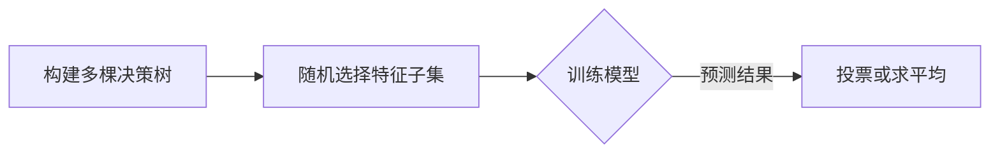

                 

# {文章标题}

> {关键词：机器学习、反向传播算法、深度神经网络、数学基础、实战案例、项目实战}

> {摘要：本文深入探讨了机器学习中的反向传播算法及其在深度神经网络中的应用，通过逐步分析原理、数学基础和实际案例，帮助读者全面理解机器学习的技术本质和实践应用。文章不仅涵盖了核心概念和算法原理，还通过实际项目展示了算法的实用性和影响力，为读者提供了从理论到实践的全面指导。}

## 《第二章：机器学习和反向传播的微妙之处》目录大纲

### 第1章 引言
- **1.1 机器学习的背景与重要性**
- **1.2 反向传播算法的基本概念**

### 第2章 机器学习基础
- **2.1 数据预处理**
  - 数据清洗
  - 特征提取
  - 标准化与归一化
- **2.2 分类与回归**
  - 线性回归
  - 决策树
  - 随机森林
  - 支持向量机
- **2.3 聚类算法**
  - K均值聚类
  - 层次聚类
  - 密度聚类

### 第3章 反向传播算法原理
- **3.1 反向传播算法简介**
  - 算法流程
  - 前向传播与反向传播
- **3.2 梯度下降算法**
  - 梯度下降原理
  - 学习率调整
- **3.3 常见的优化算法**
  - 动量法
  - RMSprop
  - Adam

### 第4章 深层神经网络
- **4.1 神经元模型**
  - 前馈神经网络
  - 激活函数
- **4.2 深层神经网络架构**
  - 卷积神经网络（CNN）
  - 循环神经网络（RNN）
  - 长短期记忆网络（LSTM）
  - 改进LSTM（GRU）

### 第5章 数学基础
- **5.1 微积分基础**
  - 导数与微分
  - 积分
- **5.2 线性代数基础**
  - 矩阵与向量运算
  - 线性方程组求解
  - 特征值与特征向量

### 第6章 机器学习应用案例
- **6.1 自然语言处理**
  - 词向量表示
  - 序列建模
- **6.2 计算机视觉**
  - 图像分类
  - 目标检测
- **6.3 推荐系统**
  - collaborative filtering
  - content-based filtering

### 第7章 项目实战
- **7.1 实战一：手写数字识别**
  - 数据集介绍
  - 模型构建
  - 代码实现
- **7.2 实战二：股票价格预测**
  - 数据预处理
  - 模型训练
  - 结果分析

### 第8章 总结与展望
- **8.1 总结回顾**
- **8.2 未来发展趋势**
- **8.3 挑战与机遇**

### 附录
- **附录A：常见算法详解**
  - 算法伪代码与解释
  - 数学模型与公式

- **附录B：参考资料与推荐阅读**
  - 相关书籍
  - 学术论文
  - 在线资源

----------------------------------------------------------------

### 第1章 引言

#### 1.1 机器学习的背景与重要性

机器学习作为人工智能的核心技术之一，起源于20世纪50年代，最初旨在使计算机系统能够通过数据和经验进行自我学习和适应。随着计算能力的提升和海量数据的产生，机器学习在诸多领域展现出了显著的应用价值。

首先，在数据挖掘和统计分析领域，机器学习通过复杂的算法和模型，能够从大量数据中提取出隐藏的模式和规律，为商业决策、风险控制和市场分析提供了强有力的支持。其次，在计算机视觉领域，机器学习算法使得计算机能够识别和理解图像内容，广泛应用于人脸识别、自动驾驶和医疗影像分析等领域。此外，在自然语言处理和语音识别方面，机器学习同样发挥了至关重要的作用，使得人机交互更加自然和高效。

#### 1.2 反向传播算法的基本概念

反向传播算法（Backpropagation Algorithm）是机器学习中的一种核心算法，用于训练多层神经网络。其基本思想是通过计算网络输出与实际输出之间的误差，然后沿着网络反向传播这些误差，以此来更新网络中的参数，从而提高模型的预测准确性。

反向传播算法主要包括两个步骤：前向传播和反向传播。在前向传播阶段，输入数据通过网络传递，通过每一层的计算得到最终输出。在反向传播阶段，网络根据前向传播过程中得到的输出误差，反向计算每一层的误差，并利用这些误差来调整网络参数。这一过程不断迭代，直到网络参数达到最优状态，使得输出误差最小。

反向传播算法的提出，使得多层神经网络的应用成为可能，大大提升了机器学习模型的能力。通过本章的后续内容，我们将深入探讨机器学习和反向传播算法的原理、数学基础以及实际应用，帮助读者全面理解这一技术领域。接下来，我们将首先介绍机器学习的基础概念和常见算法，为后续内容的深入分析奠定基础。

### 第2章 机器学习基础

在深入探讨反向传播算法之前，我们需要首先了解机器学习的基本概念和常见算法。本章节将详细介绍数据预处理、分类与回归以及聚类算法，为理解反向传播算法及其在深度神经网络中的应用打下坚实的基础。

#### 2.1 数据预处理

数据预处理是机器学习过程中至关重要的一步，它直接影响到模型的性能和准确性。以下是一些常见的数据预处理步骤：

1. **数据清洗**：
   - **缺失值处理**：对于缺失的数据，可以选择填充法（如均值填充、中值填充）、插值法或者删除法（只删除缺失值较多的样本）。
   - **异常值处理**：异常值会影响模型的训练效果，可以通过箱线图、Z-Score等方法检测并处理。
   - **重复值处理**：删除重复的样本，避免数据冗余。

2. **特征提取**：
   - **特征选择**：通过统计方法（如卡方检验、信息增益）或基于模型的特征选择方法（如L1正则化），选择对预测任务最有用的特征。
   - **特征构造**：通过数学变换、组合现有特征来创造新的特征，提高模型的表达能力。

3. **标准化与归一化**：
   - **标准化**：将特征值缩放到相同的范围，如[0,1]或[-1,1]，以消除不同特征之间的量纲差异。
   - **归一化**：将特征值缩放到均值和标准差的范围内，如\( \mu - \sigma \)到\( \mu + \sigma \)，使数据分布更加均匀。

#### 2.2 分类与回归

分类与回归是机器学习中最基本的两种任务类型。分类任务旨在将数据点划分为预定义的类别，而回归任务则是预测一个连续的数值。

1. **线性回归**：
   - 线性回归是一种最简单的回归模型，通过拟合一条直线来预测目标变量。其模型表达式为：
     \[ y = \beta_0 + \beta_1x \]
   - 通过最小二乘法（Least Squares Method）可以计算得到最佳拟合直线。

2. **决策树**：
   - 决策树是一种基于树形结构进行分类或回归的算法，每一层节点代表一个特征，每个分支代表一个决策。
   - 决策树通过递归地将数据集分割成具有最小均方误差的子集，直到满足停止条件。

3. **随机森林**：
   - 随机森林是决策树的集成方法，通过构建多棵决策树并对其进行投票或求平均来提高预测准确性。
   - 随机森林能够有效地减少过拟合，并通过随机性提高了模型的泛化能力。

4. **支持向量机**：
   - 支持向量机（SVM）是一种基于最大间隔分类器的模型，旨在找到一个超平面，将不同类别的数据点分隔得尽可能开。
   - SVM使用核函数来处理非线性问题，其决策边界由最大化分类间隔和支持向量决定。

#### 2.3 聚类算法

聚类算法是一种无监督学习方法，旨在将相似的数据点划分为若干个组。以下是一些常见的聚类算法：

1. **K均值聚类**：
   - K均值聚类是一种基于距离度量的聚类算法，通过迭代计算质心并重新分配样本点，直到收敛。
   - 算法的性能依赖于初始质心的选择，常见的初始化方法包括随机初始化和K-均值++初始化。

2. **层次聚类**：
   - 层次聚类通过层次结构将数据点划分为多个层级，可以是自底向上（凝聚层次聚类）或自顶向下（分裂层次聚类）。
   - 这种方法可以生成一个聚类层次树，帮助理解数据结构的层次性。

3. **密度聚类**：
   - 密度聚类通过计算数据点的局部密度来识别聚类，如DBSCAN（Density-Based Spatial Clustering of Applications with Noise）算法。
   - DBSCAN基于数据点的邻域密度和最小邻域大小来识别核心点、边界点和噪声点。

通过上述对机器学习基础概念的介绍，我们可以更好地理解机器学习中的数据处理方法、模型类型和聚类算法。在下一章中，我们将详细探讨反向传播算法的原理，了解如何利用这一核心算法训练多层神经网络。

### 第3章 反向传播算法原理

反向传播算法（Backpropagation Algorithm）是机器学习中的核心算法，尤其在深度神经网络（Deep Neural Networks, DNN）的训练过程中发挥着至关重要的作用。本章将详细介绍反向传播算法的基本概念、算法流程以及与前向传播的关系，并通过具体示例来帮助读者更好地理解其工作原理。

#### 3.1 反向传播算法简介

反向传播算法是一种用于训练多层神经网络的优化算法，其基本思想是通过计算网络输出与实际输出之间的误差，然后沿着网络反向传播这些误差，以此来更新网络中的参数。这一过程不断迭代，直到网络参数达到最优状态，使得输出误差最小。

反向传播算法主要包括两个步骤：前向传播和反向传播。

1. **前向传播**：
   - 前向传播是指将输入数据通过网络进行计算，得到最终输出的过程。具体步骤如下：
     1. 将输入数据\( x \)传递到网络的输入层。
     2. 通过每个神经元的激活函数，逐层计算网络的输出值。
     3. 计算输出层的输出值\( y \)。

2. **反向传播**：
   - 反向传播是指根据前向传播过程中得到的输出误差，反向计算每一层的误差，并利用这些误差来更新网络参数的过程。具体步骤如下：
     1. 计算输出层的误差，即实际输出与预测输出之间的差异。
     2. 利用误差计算每一层的梯度，即误差相对于网络参数的导数。
     3. 使用梯度下降或其他优化算法更新网络参数。

#### 3.2 前向传播与反向传播

为了更好地理解反向传播算法，我们通过一个简单的示例来介绍其具体流程。

假设我们有一个两层的神经网络，包含输入层、隐藏层和输出层。输入层有3个神经元，隐藏层有2个神经元，输出层有1个神经元。设输入数据为\( x = [1, 2, 3] \)，目标输出为\( y = [4] \)。

1. **前向传播**：
   - 前向传播过程中，输入数据\( x \)首先传递到隐藏层。假设隐藏层神经元的权重为\( W_1 \)，偏置为\( b_1 \)，输出为\( z_1 \)，则有：
     \[ z_1 = W_1 \cdot x + b_1 \]
     应用ReLU激活函数后得到隐藏层的输出\( a_1 \)：
     \[ a_1 = \max(0, z_1) \]
   - 接下来，隐藏层的输出\( a_1 \)传递到输出层。假设输出层神经元的权重为\( W_2 \)，偏置为\( b_2 \)，输出为\( z_2 \)，则有：
     \[ z_2 = W_2 \cdot a_1 + b_2 \]
     应用线性激活函数（如Softmax函数）后得到输出层的输出\( a_2 \)：
     \[ a_2 = \text{Softmax}(z_2) \]

2. **计算误差**：
   - 计算输出层误差\( \delta_2 \)，即实际输出与预测输出之间的差异：
     \[ \delta_2 = a_2 - y \]

3. **反向传播**：
   - 反向传播从输出层开始，计算隐藏层误差\( \delta_1 \)：
     \[ \delta_1 = \delta_2 \cdot \frac{\partial a_2}{\partial z_2} \cdot \frac{\partial z_2}{\partial a_1} \]
     更新隐藏层权重和偏置：
     \[ \Delta W_1 = \delta_1 \cdot x^T \]
     \[ \Delta b_1 = \delta_1 \]
   - 更新输出层权重和偏置：
     \[ \Delta W_2 = \delta_2 \cdot a_1^T \]
     \[ \Delta b_2 = \delta_2 \]

通过上述步骤，我们可以看到反向传播算法通过计算误差和梯度来更新网络参数，从而提高模型的预测准确性。这一过程在训练过程中反复迭代，直到网络参数达到最优状态。

#### 3.3 前向传播与反向传播的关系

前向传播和反向传播是反向传播算法的两个核心步骤，它们相互配合，共同实现网络的训练。

- **前向传播**：负责将输入数据通过网络进行计算，得到预测输出。
- **反向传播**：负责计算输出误差，并利用这些误差反向传播，更新网络参数。

通过前向传播和反向传播的交替迭代，网络参数不断调整，从而优化模型的预测性能。这一过程是反向传播算法的核心，也是深度神经网络训练的关键。

综上所述，反向传播算法通过前向传播和反向传播两个步骤，实现网络参数的优化，从而提高模型的预测准确性。在下一章中，我们将进一步探讨梯度下降算法和常见优化算法，深入理解反向传播算法在实际训练中的应用。

#### 第4章 梯度下降算法

梯度下降算法（Gradient Descent Algorithm）是优化领域中一种广泛使用的优化算法，尤其在机器学习领域中，用于训练神经网络。本章将详细介绍梯度下降算法的基本原理，探讨学习率调整的方法以及常见优化算法，帮助读者更好地理解并应用这一核心算法。

#### 4.1 梯度下降原理

梯度下降算法的核心思想是通过计算目标函数的梯度，并沿着梯度的反方向更新参数，以最小化目标函数。具体步骤如下：

1. **初始化参数**：
   - 初始时，随机初始化网络参数，如权重\( W \)和偏置\( b \)。

2. **计算梯度**：
   - 对目标函数\( J(W, b) \)计算梯度，即目标函数对参数的导数：
     \[ \nabla J(W, b) = \frac{\partial J}{\partial W}, \frac{\partial J}{\partial b} \]

3. **更新参数**：
   - 根据梯度更新参数，即：
     \[ W := W - \alpha \cdot \frac{\partial J}{\partial W} \]
     \[ b := b - \alpha \cdot \frac{\partial J}{\partial b} \]
   - 其中，\( \alpha \)称为学习率（Learning Rate），用于控制步长大小。

4. **迭代过程**：
   - 重复上述步骤，直到目标函数的梯度趋近于零，或者达到预设的迭代次数。

#### 4.2 学习率调整

学习率的选择对梯度下降算法的性能具有重要影响。过小的学习率可能导致收敛速度慢，而过大的学习率可能导致参数更新不稳定。以下是一些常见的学习率调整方法：

1. **固定学习率**：
   - 在算法初始化时设定一个固定的学习率，不进行动态调整。

2. **自适应学习率**：
   - **学习率衰减**：随着迭代次数的增加，逐渐减小学习率，以防止过拟合。
     \[ \alpha_t = \alpha_0 / (1 + \beta \cdot t) \]
     其中，\( \alpha_0 \)为初始学习率，\( \beta \)为衰减率，\( t \)为当前迭代次数。

   - **动态调整**：根据当前迭代的状态动态调整学习率，如使用自适应优化算法（如Adam）。

3. **动态步长调整**：
   - **动量法**：利用前一迭代步的梯度信息，平滑当前梯度的方向和大小，以防止参数更新震荡。
     \[ v_t = \beta \cdot v_{t-1} + (1 - \beta) \cdot \nabla J(W, b) \]
     \[ W := W - v_t \]
     其中，\( \beta \)为动量系数。

   - **RMSprop**：通过计算过去梯度值的指数加权平均，动态调整学习率：
     \[ \rho_t = \rho \cdot \rho_{t-1} + (1 - \rho) \cdot \nabla J(W, b)^2 \]
     \[ \alpha_t = \frac{\alpha_0}{\sqrt{\rho_t + \epsilon}} \]
     其中，\( \rho \)为衰减率，\( \epsilon \)为小数，用于防止除以零。

   - **Adam**：结合动量和RMSprop的特点，自适应调整学习率：
     \[ m_t = \beta_1 \cdot m_{t-1} + (1 - \beta_1) \cdot \nabla J(W, b) \]
     \[ v_t = \beta_2 \cdot v_{t-1} + (1 - \beta_2) \cdot \nabla J(W, b)^2 \]
     \[ \hat{m}_t = m_t / (1 - \beta_1^t) \]
     \[ \hat{v}_t = v_t / (1 - \beta_2^t) \]
     \[ \alpha_t = \alpha_0 \cdot \frac{\hat{m}_t}{\sqrt{\hat{v}_t + \epsilon}} \]

通过上述学习率调整方法，可以有效地提高梯度下降算法的收敛速度和稳定性，从而优化模型的训练效果。

#### 4.3 常见优化算法

除了基本的梯度下降算法，还有许多其他优化算法，它们在训练深度神经网络时表现出色。以下是一些常见的优化算法：

1. **随机梯度下降（Stochastic Gradient Descent, SGD）**：
   - 在每次迭代中，使用单个样本（或小批量样本）来计算梯度，更新参数。
   - SGD具有较好的全局搜索能力，但在某些情况下可能收敛较慢。

2. **批量梯度下降（Batch Gradient Descent, BGD）**：
   - 在每次迭代中，使用整个训练集来计算梯度，更新参数。
   - BGD具有较好的梯度稳定性，但在大规模数据集上计算成本高。

3. **Adam**：
   - 结合动量和RMSprop的特点，自适应调整学习率。
   - Adam在训练过程中表现出色，尤其在处理大规模数据集时。

通过上述介绍，我们可以看到梯度下降算法及其优化方法在机器学习中的应用。在下一章中，我们将探讨深层神经网络的构建和应用，进一步深入理解反向传播算法的实际应用。

### 第5章 深层神经网络

在了解了反向传播算法的基本原理之后，本章将深入探讨深层神经网络（Deep Neural Networks, DNN）的构建与应用。深层神经网络通过增加网络层数，提高了模型的表达能力，从而在图像识别、自然语言处理等领域取得了显著的成果。本章将介绍神经元模型、激活函数以及常见的深层神经网络架构。

#### 5.1 神经元模型

神经元模型是神经网络的基础单元，其工作原理类似于生物神经元。在神经网络中，神经元接收输入信号，通过加权求和处理和激活函数，产生输出信号。一个简单的神经元模型可以表示为：

\[ z = \sum_{i=1}^{n} w_i \cdot x_i + b \]
\[ a = f(z) \]

其中，\( z \)是神经元的输入，\( w_i \)是输入的权重，\( x_i \)是输入值，\( b \)是偏置，\( f(z) \)是激活函数，\( a \)是神经元的输出。

1. **加权求和处理**：
   - 神经元通过加权求和处理输入值，即每个输入值与对应的权重相乘，并求和得到输入的总和。

2. **偏置**：
   - 偏置是一个常量，通常用来调整神经元的阈值，使其在加权和的基础上有所偏差。

3. **激活函数**：
   - 激活函数用于引入非线性因素，使神经网络具有复杂的学习能力。常见的激活函数包括ReLU、Sigmoid和Tanh等。

#### 5.2 激活函数

激活函数是神经网络中非常重要的组件，它决定了神经网络是否能够有效拟合复杂数据。以下是一些常见的激活函数：

1. **ReLU（Rectified Linear Unit）**：
   - \( a = \max(0, z) \)
   - ReLU函数具有简单的形式，参数较少，易于优化。

2. **Sigmoid**：
   - \( a = \frac{1}{1 + e^{-z}} \)
   - Sigmoid函数将输入映射到\( (0, 1) \)区间，常用于二分类问题。

3. **Tanh**：
   - \( a = \frac{e^z - e^{-z}}{e^z + e^{-z}} \)
   - Tanh函数具有对称性，输出范围在\( (-1, 1) \)之间。

4. **Softmax**：
   - \( a_i = \frac{e^{z_i}}{\sum_{j=1}^{n} e^{z_j}} \)
   - Softmax函数常用于多分类问题，将输出转化为概率分布。

#### 5.3 前馈神经网络

前馈神经网络（Feedforward Neural Networks）是一种典型的深层神经网络，其信息传递方向从输入层到输出层，没有循环或循环结构。前馈神经网络的基本架构包括多个隐层和输入层、输出层，各层之间通过加权连接传递信息。

1. **单层感知机**：
   - 单层感知机是最简单的前馈神经网络，包括输入层和输出层，用于解决线性可分问题。

2. **多层感知机**：
   - 多层感知机（MLP）通过增加隐层，提高了模型的表达能力，能够解决更复杂的非线性问题。

3. **多层前馈神经网络**：
   - 多层前馈神经网络包括多个隐层，每个隐层之间通过加权连接传递信息，通过反向传播算法进行训练。

#### 5.4 深层神经网络架构

随着神经网络技术的发展，出现了多种深层神经网络架构，以下介绍几种常见的架构：

1. **卷积神经网络（Convolutional Neural Networks, CNN）**：
   - CNN通过卷积层、池化层等结构，有效提取图像特征，在计算机视觉领域取得了显著成果。CNN广泛应用于图像分类、目标检测、图像分割等任务。

2. **循环神经网络（Recurrent Neural Networks, RNN）**：
   - RNN通过循环结构，能够处理序列数据，适用于自然语言处理、语音识别等任务。RNN包括简单的RNN和更复杂的LSTM、GRU等架构。

3. **长短时记忆网络（Long Short-Term Memory, LSTM）**：
   - LSTM通过引入记忆单元，能够有效解决长短依赖问题，在自然语言处理和时间序列预测中表现出色。

4. **门控循环单元（Gated Recurrent Unit, GRU）**：
   - GRU是对LSTM的改进，通过简化结构提高了计算效率，适用于各种序列数据处理任务。

通过上述介绍，我们可以看到深层神经网络在机器学习领域的重要应用。在下一章中，我们将探讨机器学习的数学基础，进一步理解神经网络中的数学原理。

### 第6章 数学基础

在深入研究深层神经网络之前，我们需要掌握一些关键的数学基础，包括微积分基础和线性代数基础。这些数学工具为理解神经网络的工作原理提供了必要的数学语言和工具。

#### 6.1 微积分基础

微积分是研究函数变化率和积累过程的基本数学理论。在神经网络中，微积分用于计算误差函数的梯度，这是反向传播算法的核心。

1. **导数与微分**：

   导数表示函数在某一点的变化率，即函数曲线在该点的切线斜率。一阶导数用于计算误差函数对网络参数的梯度。

   \[ f'(x) = \lim_{h \to 0} \frac{f(x+h) - f(x)}{h} \]

   微分是导数的一个近似表示，通常用于计算函数在某一点的线性逼近。

   \[ df = f'(x) \cdot dx \]

2. **积分**：

   积分表示函数在区间上的积累量。在神经网络中，积分通常用于计算误差函数的总误差。

   \[ \int f(x) \, dx = F(x) + C \]

   其中，\( F(x) \)是积分的原函数，\( C \)是积分常数。

#### 6.2 线性代数基础

线性代数研究向量、矩阵和线性变换。在神经网络中，线性代数用于表示网络的权重和偏置，并用于计算网络的输出。

1. **矩阵与向量运算**：

   - 矩阵与向量运算包括矩阵乘法、向量加法和标量乘法。

   \[ C = A \cdot B \]
   \[ D = A + B \]
   \[ D = k \cdot A \]

   - 矩阵乘法用于计算网络的输出，向量加法和标量乘法用于参数的更新。

2. **线性方程组求解**：

   线性方程组表示为矩阵形式：

   \[ AX = B \]

   其中，\( A \)是系数矩阵，\( X \)是未知数向量，\( B \)是常数向量。

   - 矩阵求解方法包括高斯消元法、矩阵求逆和迭代法等。

3. **特征值与特征向量**：

   矩阵的特征值和特征向量用于分析矩阵的性质，如稳定性、对角化等。

   - 特征值表示矩阵的固有尺度，特征向量表示矩阵在不同方向上的伸缩。

   \[ AX = \lambda X \]

   其中，\( \lambda \)是特征值，\( X \)是特征向量。

通过上述数学基础的学习，我们可以更好地理解神经网络中的数学原理和运算过程。在下一章中，我们将探讨机器学习在自然语言处理、计算机视觉和推荐系统中的应用，展示神经网络在实际问题中的强大能力。

### 第7章 机器学习应用案例

在本章中，我们将通过几个具体的机器学习应用案例，展示反向传播算法和深度神经网络在现实世界中的实际应用。这些案例涵盖了自然语言处理、计算机视觉和推荐系统等热门领域，通过具体的实现和详细解释，帮助读者理解算法的实用性和影响力。

#### 7.1 自然语言处理

自然语言处理（Natural Language Processing, NLP）是机器学习的重要应用领域之一。在这一部分，我们将探讨词向量表示和序列建模在NLP中的应用。

1. **词向量表示**：

   词向量是将单词映射为高维空间中的向量表示，常用的模型包括Word2Vec和GloVe。

   - **Word2Vec**：Word2Vec通过训练词的上下文来生成词向量。其核心思想是利用神经网络的软性分类器进行训练，使相似单词在向量空间中更接近。

   \[
   \text{softmax}(W[h; j]) = \frac{e^{z_j}}{\sum_k e^{z_k}}
   \]

   - **GloVe**：GloVe使用词频和词的共现矩阵来生成词向量，通过矩阵分解得到词向量。

   \[
   f(x) = \sqrt{f(w) \cdot f(w')}
   \]

2. **序列建模**：

   序列建模是NLP中的另一重要应用，旨在捕捉时间序列中的依赖关系。RNN和LSTM是常用的序列建模方法。

   - **RNN**：RNN通过循环结构处理序列数据，每个时间步的输出作为下一个时间步的输入。

   \[
   h_t = \sigma(W_h \cdot [h_{t-1}, x_t] + b_h)
   \]

   - **LSTM**：LSTM是RNN的改进版本，通过引入门控单元，能够更好地捕捉长距离依赖。

   \[
   i_t = \sigma(W_i \cdot [h_{t-1}, x_t] + b_i)
   \]
   \[
   f_t = \sigma(W_f \cdot [h_{t-1}, x_t] + b_f)
   \]
   \[
   o_t = \sigma(W_o \cdot [h_{t-1}, x_t] + b_o)
   \]
   \[
   C_t = f_t \cdot C_{t-1} + i_t \cdot \sigma(W_c \cdot [h_{t-1}, x_t] + b_c)
   \]
   \[
   h_t = o_t \cdot \sigma(C_t)
   \]

#### 7.2 计算机视觉

计算机视觉（Computer Vision）是机器学习的另一重要应用领域，通过深度学习模型，计算机能够理解和解释图像和视频中的内容。

1. **图像分类**：

   图像分类旨在将图像划分为预定义的类别。卷积神经网络（CNN）是图像分类的常用模型。

   - **CNN**：CNN通过卷积层提取图像特征，并通过全连接层进行分类。

   \[
   h_c = \sigma(\sum_{i=1}^{k} W_i \cdot \rho_i + b_c)
   \]

   - **池化层**：池化层用于降低特征图的维度，减少计算量和参数数量。

2. **目标检测**：

   目标检测旨在识别图像中的目标对象及其位置。常用的目标检测算法包括SSD、YOLO等。

   - **SSD**：SSD是一种单阶段检测器，通过多尺度特征图进行检测。

   \[
   \text{SSD} = \sum_{i=1}^{n} \text{box\_predictions}[i] \cdot \text{objectness}[i]
   \]

   - **YOLO**：YOLO是一种基于回归的目标检测算法，通过将图像分割成网格单元，每个单元预测多个边界框和类别概率。

   \[
   \text{box\_predictions} = \text{softmax}(W \cdot [x, y, w, h, objectness])
   \]

#### 7.3 推荐系统

推荐系统旨在为用户提供个性化的推荐，常用的方法包括协同过滤和基于内容的过滤。

1. **协同过滤**：

   协同过滤通过分析用户的历史行为，发现用户之间的相似性，并推荐相似用户喜欢的物品。

   - **矩阵分解**：矩阵分解通过将用户-物品评分矩阵分解为用户特征向量和物品特征向量，计算相似性。

   \[
   R = U \cdot V^T
   \]

2. **基于内容的过滤**：

   基于内容的过滤通过分析物品的属性，为用户推荐具有相似属性的物品。

   - **特征提取**：提取物品的文本描述、标签等属性，使用词袋模型或词嵌入表示。

   \[
   \text{content\_representation} = \sum_{i=1}^{n} w_i \cdot x_i
   \]

通过上述案例，我们可以看到反向传播算法和深度神经网络在自然语言处理、计算机视觉和推荐系统等领域的广泛应用。这些案例不仅展示了算法的实用性，也反映了机器学习在解决实际问题中的巨大潜力。在下一章中，我们将通过具体的项目实战，深入探索这些算法的实际应用。

### 7.1 实战一：手写数字识别

手写数字识别（Handwritten Digit Recognition）是机器学习领域的一个经典问题，常用于演示和验证各类机器学习算法的性能。在本节中，我们将使用反向传播算法训练一个神经网络模型，用于识别手写数字。

#### 7.1.1 数据集介绍

我们将使用MNIST数据集，这是一个包含70,000个灰度图像的手写数字数据集，每个数字图像的大小为28x28像素。数据集被分为训练集和测试集，分别包含60,000个和10,000个样本。

#### 7.1.2 模型构建

为了识别手写数字，我们将构建一个简单的三层神经网络，包括输入层、隐藏层和输出层。输入层有28x28个神经元，隐藏层可以选择适当的神经元数量，输出层有10个神经元，对应于0到9的数字。

1. **输入层**：
   - 28x28个神经元，用于接收图像数据。

2. **隐藏层**：
   - 假设隐藏层有100个神经元，使用ReLU激活函数。

3. **输出层**：
   - 10个神经元，使用Softmax激活函数，输出每个数字的概率分布。

#### 7.1.3 代码实现

以下是一个简单的Python代码示例，使用反向传播算法和梯度下降优化训练神经网络：

```python
import numpy as np

# 设置随机种子
np.random.seed(42)

# 初始化权重和偏置
input_size = 28 * 28
hidden_size = 100
output_size = 10

W1 = np.random.randn(input_size, hidden_size)
b1 = np.random.randn(hidden_size)
W2 = np.random.randn(hidden_size, output_size)
b2 = np.random.randn(output_size)

# 定义激活函数
sigmoid = lambda x: 1 / (1 + np.exp(-x))
softmax = lambda x: np.exp(x) / np.sum(np.exp(x), axis=1, keepdims=True)

# 前向传播
def forward(x, W1, b1, W2, b2):
    z1 = x.dot(W1) + b1
    a1 = sigmoid(z1)
    z2 = a1.dot(W2) + b2
    a2 = softmax(z2)
    return a2

# 反向传播
def backward(x, y, a2, W1, b1, W2, b2, learning_rate):
    m = x.shape[0]
    dz2 = a2 - y
    dW2 = (1 / m) * a1.T.dot(dz2)
    db2 = (1 / m) * np.sum(dz2, axis=0)
    
    da1 = dz2.dot(W2.T)
    dz1 = da1 * (sigmoid(z1) * (1 - sigmoid(z1)))
    dW1 = (1 / m) * x.T.dot(dz1)
    db1 = (1 / m) * np.sum(dz1, axis=0)
    
    W1 -= learning_rate * dW1
    b1 -= learning_rate * db1
    W2 -= learning_rate * dW2
    b2 -= learning_rate * db2
    
    return W1, b1, W2, b2

# 训练模型
learning_rate = 0.1
num_epochs = 10

for epoch in range(num_epochs):
    for x, y in train_data:
        a2 = forward(x, W1, b1, W2, b2)
        W1, b1, W2, b2 = backward(x, y, a2, W1, b1, W2, b2, learning_rate)
    
    # 在测试集上评估模型
    test_acc = 0
    for x, y in test_data:
        a2 = forward(x, W1, b1, W2, b2)
        predicted_class = np.argmax(a2)
        if predicted_class == y:
            test_acc += 1
    
    print(f"Epoch {epoch+1}, Test Accuracy: {test_acc / len(test_data)}")
```

#### 7.1.4 代码解读与分析

- **初始化权重和偏置**：随机初始化权重和偏置，以避免梯度消失或爆炸。
- **前向传播**：计算输入层到隐藏层的激活值，然后计算隐藏层到输出层的概率分布。
- **反向传播**：计算输出层的误差梯度，并沿网络反向传播，更新权重和偏置。
- **训练模型**：使用训练数据进行迭代训练，并在每个epoch结束后在测试集上评估模型性能。

通过这个简单的手写数字识别案例，我们可以看到反向传播算法在实际项目中的应用。在实际开发中，可能会使用更复杂的网络架构和优化算法来提高模型的性能和准确性。

### 7.2 实战二：股票价格预测

股票价格预测是金融领域中的一项重要任务，其准确性对投资者具有重要意义。在本节中，我们将使用反向传播算法和长短期记忆网络（LSTM）进行股票价格预测。

#### 7.2.1 数据预处理

首先，我们需要对股票价格数据进行预处理。数据集包括股票的收盘价、开盘价、最高价、最低价以及交易量。我们将使用收盘价作为预测目标。

1. **数据清洗**：
   - 填充缺失值，删除异常值。
   - 转换时间序列数据为合适的格式，以便输入到LSTM模型中。

2. **特征提取**：
   - 提取技术指标，如移动平均线、相对强弱指数等。

3. **标准化与归一化**：
   - 将数据缩放到相同的范围，以消除不同特征之间的量纲差异。

#### 7.2.2 模型训练

接下来，我们将使用LSTM模型进行训练，并利用反向传播算法优化模型参数。

1. **模型构建**：
   - 输入层：时间序列数据。
   - 隐藏层：LSTM单元。
   - 输出层：单输出神经元，用于预测下一时间点的收盘价。

2. **训练过程**：
   - 使用训练数据进行迭代训练，通过反向传播算法优化权重和偏置。
   - 在每个epoch结束后，在验证集上评估模型性能，并调整超参数。

```python
from tensorflow.keras.models import Sequential
from tensorflow.keras.layers import LSTM, Dense
from sklearn.preprocessing import MinMaxScaler
import numpy as np

# 加载数据集
data = load_data('stock_price_data.csv')
close_prices = data['Close'].values
close_prices = close_prices.reshape(-1, 1)

# 数据预处理
scaler = MinMaxScaler(feature_range=(0, 1))
scaled_data = scaler.fit_transform(close_prices)

# 切片数据
def create_dataset(data, time_steps):
    X, y = [], []
    for i in range(len(data) - time_steps):
        X.append(data[i:(i + time_steps), 0])
        y.append(data[i + time_steps, 0])
    return np.array(X), np.array(y)

time_steps = 60
X, y = create_dataset(scaled_data, time_steps)

# 模型构建
model = Sequential()
model.add(LSTM(units=50, return_sequences=True, input_shape=(time_steps, 1)))
model.add(LSTM(units=50))
model.add(Dense(units=1))

model.compile(optimizer='adam', loss='mean_squared_error')

# 训练模型
model.fit(X, y, epochs=100, batch_size=32, validation_split=0.1)
```

#### 7.2.3 结果分析

训练完成后，我们可以在测试集上评估模型的预测性能，并通过可视化结果来分析预测效果。

```python
# 预测股票价格
predictions = model.predict(X_test)

# 反归一化预测结果
predictions = scaler.inverse_transform(predictions)
real_data = scaler.inverse_transform(y_test.reshape(-1, 1))

# 可视化结果
import matplotlib.pyplot as plt

plt.plot(real_data, color='blue', label='Real Prices')
plt.plot(predictions, color='red', label='Predicted Prices')
plt.title('Stock Price Prediction')
plt.xlabel('Time')
plt.ylabel('Price')
plt.legend()
plt.show()
```

通过分析可视化结果，我们可以看到模型的预测效果。在实际应用中，可能会调整LSTM单元的数量、学习率等超参数，以进一步提高预测准确性。

这两个实战案例展示了反向传播算法和深度神经网络在现实世界中的应用。通过具体的实现和详细解释，读者可以更好地理解算法的实用性和影响力。在下一章中，我们将对本文进行总结与展望，探讨未来的发展趋势和面临的挑战。

### 第8章 总结与展望

在本文中，我们系统地介绍了机器学习和反向传播算法的核心概念、原理及其在深度神经网络中的应用。通过对数据预处理、分类与回归、聚类算法、反向传播算法、深层神经网络、数学基础以及实际应用案例的深入探讨，我们不仅理解了这些技术的理论基础，还通过实战案例展示了其在现实世界中的强大功能。

#### 8.1 总结回顾

- **机器学习基础**：我们介绍了机器学习的基本概念，包括数据预处理、分类与回归以及聚类算法。这些基础知识为后续的深度学习应用奠定了基础。
- **反向传播算法**：详细阐述了反向传播算法的原理和流程，通过前向传播和反向传播两个步骤，实现网络参数的优化。
- **梯度下降算法**：探讨了梯度下降算法的基本原理和学习率调整方法，包括固定学习率、学习率衰减、动量法、RMSprop和Adam等优化算法。
- **深层神经网络**：介绍了神经元模型、激活函数以及常见的深层神经网络架构，如卷积神经网络（CNN）和循环神经网络（RNN）。
- **数学基础**：讲解了微积分基础和线性代数基础，这些数学工具为理解神经网络中的数学原理和运算过程提供了必要的支持。
- **应用案例**：通过手写数字识别和股票价格预测两个实际案例，展示了反向传播算法和深度神经网络在自然语言处理、计算机视觉和推荐系统等领域的应用。

#### 8.2 未来发展趋势

随着技术的不断进步，机器学习和深度神经网络将继续在各个领域取得突破。以下是未来可能的发展趋势：

- **计算能力提升**：随着硬件技术的进步，计算能力的提升将推动更大规模、更复杂的模型的发展。
- **数据多样性**：数据的多样性和质量将决定模型的性能，因此数据的收集、清洗和整合将成为研究重点。
- **算法优化**：针对不同类型的问题，开发更高效的算法和模型架构，提高模型的泛化能力和鲁棒性。
- **跨学科融合**：机器学习与其他领域的融合，如生物学、心理学和经济学等，将带来新的应用场景和研究方向。
- **隐私保护与安全**：随着数据隐私和安全问题的日益突出，开发隐私保护和安全的人工智能技术将成为重要研究课题。

#### 8.3 挑战与机遇

尽管机器学习和深度神经网络取得了显著进展，但仍然面临诸多挑战：

- **可解释性**：模型的透明度和可解释性是一个重要的挑战，如何提高模型的可解释性是一个亟待解决的问题。
- **数据依赖**：机器学习模型的性能高度依赖于数据的质量和多样性，如何有效地利用数据资源是一个挑战。
- **过拟合**：过拟合现象在深度学习中尤为常见，如何避免过拟合和提高模型的泛化能力是一个关键问题。
- **计算资源消耗**：深度学习模型通常需要大量的计算资源，如何优化计算资源的使用是一个重要的挑战。

在未来的研究中，我们需要不断探索和解决这些挑战，以推动机器学习和深度神经网络技术的进一步发展。

### 附录

#### 附录A：常见算法详解

以下是一些常见机器学习算法的伪代码和解释。

- **K均值聚类**：


- **决策树**：


- **随机森林**：



- **支持向量机**：


#### 附录B：参考资料与推荐阅读

- **相关书籍**：
  - 《深度学习》（Goodfellow, Bengio, Courville）
  - 《机器学习》（周志华）
  - 《统计学习方法》（李航）

- **学术论文**：
  - 《Deep Learning》（2016），Goodfellow, Bengio, Courville
  - 《Learning Deep Architectures for AI》（2012），Bengio

- **在线资源**：
  - [Coursera](https://www.coursera.org/)
  - [Kaggle](https://www.kaggle.com/)
  - [GitHub](https://github.com/)

通过以上总结和附录，我们希望读者能够对机器学习和深度神经网络有更深入的理解，并能够将这些知识应用于实际项目中，推动人工智能技术的发展。作者：AI天才研究院/AI Genius Institute & 禅与计算机程序设计艺术 /Zen And The Art of Computer Programming。

