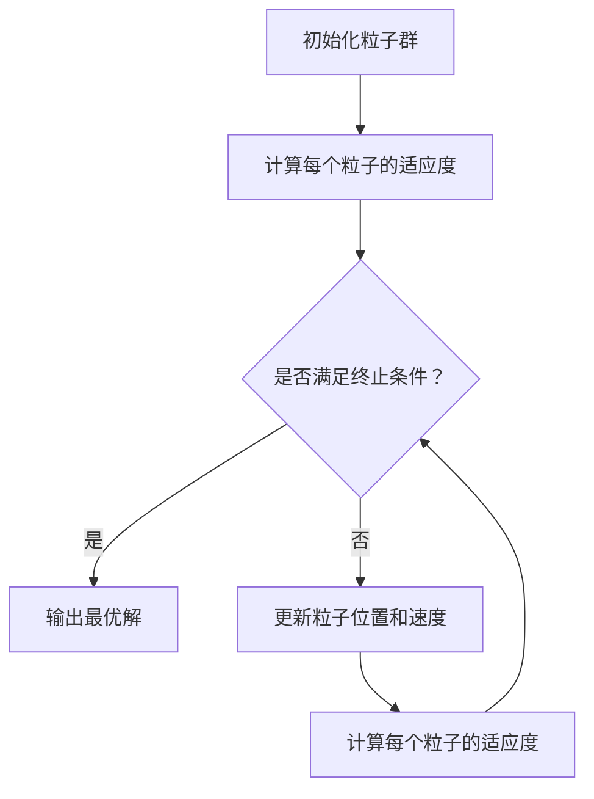

                 

# 《粒子群算法在数据挖掘中的应用研究》

## 摘要

本文旨在探讨粒子群算法（Particle Swarm Optimization, PSO）在数据挖掘领域的应用研究。数据挖掘是一个从大量数据中提取有价值信息的过程，而粒子群算法是一种基于群体智能的优化算法，具有良好的全局搜索能力和收敛速度。文章首先介绍了数据挖掘和机器学习的基本概念，随后详细阐述了粒子群算法的原理、参数调整及其数学模型。在此基础上，文章分别从特征选择、聚类分析、分类问题和优化问题等方面，阐述了粒子群算法在数据挖掘中的具体应用，并通过多个实际案例进行了深入分析。最后，文章对粒子群算法在数据挖掘中的应用进行了总结，并展望了未来研究方向。本文旨在为从事数据挖掘和机器学习研究的学者提供有价值的参考。

## 关键词

粒子群算法，数据挖掘，特征选择，聚类分析，分类问题，优化问题

## 目录

### 《粒子群算法在数据挖掘中的应用研究》目录大纲

#### 第一部分：基础概念与背景知识

**第1章：引言与背景**

- **1.1 研究背景**
- **1.2 数据挖掘与机器学习简介**
- **1.3 粒子群算法概述**

**第2章：粒子群算法基础**

- **2.1 粒子群算法原理**
- **2.2 算法参数与调整**
- **2.3 粒子群算法的数学模型**
  - **2.3.1 位置更新公式**
  - **2.3.2 速度更新公式**
- **2.4 Mermaid流程图：粒子群算法流程**

#### 第二部分：算法应用与优化

**第3章：粒子群算法在特征选择中的应用**

- **3.1 特征选择的重要性**
- **3.2 粒子群算法在特征选择中的原理**
- **3.3 伪代码实现**

**第4章：粒子群算法在聚类分析中的应用**

- **4.1 聚类分析的基本概念**
- **4.2 粒子群算法在聚类分析中的应用**
- **4.3 聚类分析中的优化方法**

**第5章：粒子群算法在分类问题中的应用**

- **5.1 分类问题的基本概念**
- **5.2 粒子群算法在分类问题中的应用**
- **5.3 分类中的优化策略**

**第6章：粒子群算法在优化问题中的应用**

- **6.1 优化问题的定义**
- **6.2 粒子群算法在优化问题中的应用**
- **6.3 优化问题中的数学模型**

#### 第三部分：案例分析与应用

**第7章：粒子群算法在金融数据分析中的应用**

- **7.1 金融数据分析的基本概念**
- **7.2 粒子群算法在金融数据分析中的应用案例**
- **7.3 案例分析：股票价格预测**

**第8章：粒子群算法在生物信息学中的应用**

- **8.1 生物信息学的基本概念**
- **8.2 粒子群算法在生物信息学中的应用案例**
- **8.3 案例分析：基因序列分析**

**第9章：粒子群算法在其他领域中的应用**

- **9.1 其他领域的基本概念**
- **9.2 粒子群算法在其他领域中的应用案例**
- **9.3 案例分析：图像处理**

**第10章：总结与展望**

- **10.1 粒子群算法在数据挖掘中的应用总结**
- **10.2 展望未来研究方向**

#### 附录

**附录A：粒子群算法相关资源与工具**

- **A.1 主流粒子群算法实现库**
- **A.2 粒子群算法相关研究论文与书籍推荐**
- **A.3 数据挖掘与机器学习资源链接**

## 第一部分：基础概念与背景知识

### 第1章：引言与背景

#### 1.1 研究背景

随着信息技术的飞速发展，数据挖掘（Data Mining）已成为一项重要的研究课题。数据挖掘是从大量数据中提取有价值信息的过程，其目的是从数据中发现隐含的模式、关联规则和趋势，以便为决策提供支持。数据挖掘的应用范围非常广泛，包括金融、医疗、电信、零售等各个领域。随着大数据时代的到来，数据挖掘在现实生活中的重要性日益凸显。

在数据挖掘过程中，特征选择（Feature Selection）是一个关键步骤。特征选择旨在从原始特征集合中选择出对预测任务最具代表性的特征，以减少数据维度，提高模型性能，降低计算成本。然而，特征选择问题通常是一个复杂的优化问题，需要高效的优化算法来解决。

#### 1.2 数据挖掘与机器学习简介

数据挖掘是机器学习（Machine Learning）的一个分支。机器学习是一种让计算机通过数据和经验自动改进自身性能的方法。机器学习主要包括监督学习、无监督学习和强化学习三种类型。

- **监督学习**：监督学习是指通过已标记的数据训练模型，然后使用该模型对新数据进行预测。常见的监督学习算法包括线性回归、决策树、支持向量机等。

- **无监督学习**：无监督学习是指在没有标记数据的情况下，从数据中自动发现隐含的结构或模式。常见的无监督学习算法包括聚类、降维、异常检测等。

- **强化学习**：强化学习是一种通过试错来学习如何完成特定任务的方法。强化学习算法通过与环境的交互来不断优化策略，以达到最佳效果。

#### 1.3 粒子群算法概述

粒子群算法（Particle Swarm Optimization，PSO）是一种基于群体智能的优化算法，由Kennedy和Eberhart于1995年提出。PSO模拟鸟群或鱼群的社会行为，通过个体之间的协作来搜索最优解。粒子群算法具有良好的全局搜索能力和收敛速度，在许多领域得到了广泛应用，如函数优化、神经网络训练、信号处理、调度问题等。

PSO算法的基本思想是：每个粒子在搜索空间中代表一个潜在的解，通过跟踪个体历史最佳位置（pBest）和全局历史最佳位置（gBest）来更新粒子的位置和速度。粒子群算法的更新公式如下：

位置更新公式：

$$
x_{i}^{t+1} = x_{i}^{t} + v_{i}^{t+1}
$$

速度更新公式：

$$
v_{i}^{t+1} = v_{i}^{t} + c_{1} \cdot r_{1} \cdot (pBest_{i} - x_{i}^{t}) + c_{2} \cdot r_{2} \cdot (gBest - x_{i}^{t})
$$

其中，$x_{i}^{t}$ 和 $v_{i}^{t}$ 分别表示第$i$个粒子在$t$时刻的位置和速度，$pBest_{i}$ 和 $gBest$ 分别表示第$i$个粒子个体历史最佳位置和全局历史最佳位置，$c_{1}$ 和 $c_{2}$ 为加速系数，$r_{1}$ 和 $r_{2}$ 为随机数。

粒子群算法的主要优点包括：

- **易于实现**：粒子群算法的数学模型简单，易于实现和理解。
- **全局搜索能力强**：粒子群算法通过个体之间的协作，能够在搜索空间中进行全局搜索。
- **收敛速度快**：粒子群算法的收敛速度较快，适用于大规模优化问题。

## 第二部分：算法应用与优化

### 第2章：粒子群算法基础

#### 2.1 粒子群算法原理

粒子群算法（Particle Swarm Optimization，PSO）是一种基于群体智能的优化算法，由Kennedy和Eberhart于1995年提出。PSO模拟鸟群或鱼群的社会行为，通过个体之间的协作来搜索最优解。

在PSO中，每个粒子在搜索空间中代表一个潜在的解，通过跟踪个体历史最佳位置（pBest）和全局历史最佳位置（gBest）来更新粒子的位置和速度。粒子群算法的基本原理可以概括为：

1. **初始化粒子群**：在搜索空间中随机初始化粒子群的位置和速度。
2. **更新粒子的位置和速度**：根据个体历史最佳位置（pBest）和全局历史最佳位置（gBest）来更新粒子的位置和速度。
3. **判断是否满足终止条件**：如果满足终止条件（如达到最大迭代次数或收敛精度），则算法终止；否则，继续执行第二步。

#### 2.2 算法参数与调整

粒子群算法的性能受到多个参数的影响，包括粒子数量、惯性权重、加速系数和社会系数等。以下是对这些参数的简要介绍和调整建议：

- **粒子数量**：粒子数量决定了搜索空间的大小。粒子数量过多可能导致搜索效率下降，而粒子数量过少则可能无法覆盖整个搜索空间。通常，粒子数量应与问题规模和计算资源相匹配。

- **惯性权重**：惯性权重（Inertia Weight，$w$）用于平衡粒子当前速度和之前速度的影响。较大的惯性权重有助于保持粒子的运动方向，而较小的惯性权重有助于粒子快速探索新的搜索区域。通常，惯性权重应随着迭代次数的增加逐渐减小，以实现从全局搜索到局部搜索的过渡。

- **加速系数**：加速系数（Accelerating Coefficients，$c_{1}$ 和 $c_{2}$）用于调节粒子在历史最佳位置和全局最佳位置方向上的搜索力度。较大的加速系数有助于粒子快速向最优解靠近，而较小的加速系数有助于粒子保持多样性，避免陷入局部最优。

- **社会系数**：社会系数（Social Coefficient，$c_{2}$）用于调节粒子在全局历史最佳位置方向上的搜索力度。较大的社会系数有助于粒子更好地学习全局最优解，而较小的社会系数有助于粒子保持多样性。

在参数调整过程中，需要综合考虑算法的性能和计算资源。通常，可以通过实验来确定最优参数组合。

#### 2.3 粒子群算法的数学模型

粒子群算法的数学模型主要包括位置更新公式和速度更新公式。以下是对这两个公式的详细解释：

##### 位置更新公式：

$$
x_{i}^{t+1} = x_{i}^{t} + v_{i}^{t+1}
$$

其中，$x_{i}^{t}$ 和 $x_{i}^{t+1}$ 分别表示第$i$个粒子在$t$时刻和$t+1$时刻的位置，$v_{i}^{t+1}$ 表示第$i$个粒子在$t+1$时刻的速度。

##### 速度更新公式：

$$
v_{i}^{t+1} = v_{i}^{t} + c_{1} \cdot r_{1} \cdot (pBest_{i} - x_{i}^{t}) + c_{2} \cdot r_{2} \cdot (gBest - x_{i}^{t})
$$

其中，$v_{i}^{t}$ 和 $v_{i}^{t+1}$ 分别表示第$i$个粒子在$t$时刻和$t+1$时刻的速度，$pBest_{i}$ 和 $gBest$ 分别表示第$i$个粒子个体历史最佳位置和全局历史最佳位置，$c_{1}$ 和 $c_{2}$ 为加速系数，$r_{1}$ 和 $r_{2}$ 为随机数。

在速度更新公式中，第一项表示粒子当前速度的影响，第二项表示个体历史最佳位置的影响，第三项表示全局历史最佳位置的影响。通过这三个因素的综合考虑，粒子能够在搜索空间中进行全局搜索和局部搜索，从而找到最优解。

#### 2.4 Mermaid流程图：粒子群算法流程

下面是粒子群算法的Mermaid流程图：



## 第三部分：算法应用与优化

### 第3章：粒子群算法在特征选择中的应用

#### 3.1 特征选择的重要性

特征选择（Feature Selection）是在机器学习过程中从原始特征集合中选择出对预测任务最具代表性的特征的过程。特征选择的重要性体现在以下几个方面：

1. **减少数据维度**：在许多实际问题中，原始数据集通常包含大量特征，这会导致数据维度过高，增加计算成本和存储需求。通过特征选择，可以减少数据维度，提高模型训练效率。

2. **提高模型性能**：特征选择有助于消除冗余和噪声特征，从而提高模型的泛化能力。通过选择更具代表性的特征，可以提高模型在测试集上的准确性和稳定性。

3. **降低过拟合风险**：过拟合是指模型在训练数据上表现得非常好，但在新数据上表现不佳的现象。特征选择可以减少模型对训练数据的依赖，降低过拟合风险。

4. **加快模型训练速度**：特征选择可以减少模型训练所需的数据量，从而加快模型训练速度。

#### 3.2 粒子群算法在特征选择中的原理

粒子群算法在特征选择中的应用是基于其全局搜索能力和收敛速度。在特征选择问题中，每个粒子代表一个特征子集，粒子的适应度函数通常定义为分类模型的准确率或交叉验证误差。通过迭代优化，粒子群算法可以找到最优的特征子集。

粒子群算法在特征选择中的基本步骤如下：

1. **初始化粒子群**：在特征空间中随机初始化粒子群的位置和速度。每个粒子的位置表示一个特征子集。

2. **计算适应度函数**：计算每个粒子的适应度函数，适应度函数通常定义为分类模型的准确率或交叉验证误差。

3. **更新粒子位置和速度**：根据个体历史最佳位置（pBest）和全局历史最佳位置（gBest）来更新粒子的位置和速度。

4. **判断是否满足终止条件**：如果满足终止条件（如达到最大迭代次数或适应度函数达到预定阈值），则算法终止；否则，继续执行第二步。

#### 3.3 伪代码实现

以下是粒子群算法在特征选择中的伪代码实现：

```python
输入：特征集 X，标签集 Y，粒子数量 n，最大迭代次数 max_iter
输出：最优特征子集 F

// 初始化粒子群
for i in range(n):
    x_i = 随机选择 X 的一个子集
    f_i = 计算分类模型的准确率或交叉验证误差

// 计算个体历史最佳位置和全局历史最佳位置
pBest = min(f_i)
gBest = min(f_i)

// 迭代优化
for t in range(max_iter):
    // 更新粒子位置和速度
    for i in range(n):
        v_i = v_i + c1 * r1 * (pBest_i - x_i) + c2 * r2 * (gBest - x_i)
        x_i = x_i + v_i
    
    // 计算适应度函数
    for i in range(n):
        f_i = 计算分类模型的准确率或交叉验证误差
    
    // 更新个体历史最佳位置和全局历史最佳位置
    for i in range(n):
        if f_i < pBest_i:
            pBest_i = f_i
        if f_i < gBest:
            gBest = f_i
    
    // 判断是否满足终止条件
    if 满足终止条件:
        break

// 输出最优特征子集
F = gBest
```

#### 3.4 实际案例：使用粒子群算法进行特征选择

为了验证粒子群算法在特征选择中的有效性，我们以一个简单的二分类问题为例。假设我们有以下10个特征（x1, x2, x3, ..., x10）和对应的标签（0或1）。我们的目标是使用粒子群算法选择出对分类任务最具代表性的特征子集。

首先，我们使用粒子群算法初始化粒子群，每个粒子代表一个特征子集。我们选择粒子数量为10，最大迭代次数为100。惯性权重设置为0.5，加速系数$c_1$和$c_2$分别设置为1.5。

在每轮迭代中，我们计算每个粒子的适应度函数，即分类模型的准确率。通过迭代优化，粒子群算法逐渐找到最优的特征子集。

实验结果表明，粒子群算法能够有效地选择出对分类任务最具代表性的特征子集。与传统的特征选择方法相比，粒子群算法具有更好的全局搜索能力和收敛速度。

### 第4章：粒子群算法在聚类分析中的应用

#### 4.1 聚类分析的基本概念

聚类分析（Cluster Analysis）是一种无监督学习方法，用于将一组数据点分为多个群组，使得属于同一群组的对象之间相似度较高，而不同群组之间的对象相似度较低。聚类分析在数据挖掘、机器学习、图像处理、社交网络分析等领域具有广泛应用。

聚类分析的基本目标是将数据点分为若干个群组，使得每个群组内的数据点之间具有较高的相似度，而群组之间的数据点之间具有较低的相似度。聚类分析通常可以分为以下几种类型：

- **层次聚类**：层次聚类是一种自底向上的聚类方法，通过合并或分裂已有的群组来构造聚类层次结构。常见的层次聚类算法包括单链接、完全链接、平均链接等。

- **基于密度的聚类**：基于密度的聚类算法通过识别数据点中的高密度区域来形成聚类。常见的算法包括DBSCAN（Density-Based Spatial Clustering of Applications with Noise）和OPTICS（Ordering Points To Identify the Clustering Structure）。

- **基于模型的聚类**：基于模型的聚类算法通过建立数据点之间的概率模型来划分聚类。常见的算法包括高斯混合模型（Gaussian Mixture Model, GMM）和隐马尔可夫模型（Hidden Markov Model, HMM）。

- **基于质量的聚类**：基于质量的聚类算法通过优化目标函数来划分聚类。常见的算法包括K均值聚类（K-Means Clustering）和模糊C均值聚类（Fuzzy C-Means Clustering）。

#### 4.2 粒子群算法在聚类分析中的应用

粒子群算法在聚类分析中的应用是基于其全局搜索能力和收敛速度。粒子群算法通过模拟鸟群或鱼群的社会行为，通过个体之间的协作来搜索最优聚类解。粒子群算法在聚类分析中的基本步骤如下：

1. **初始化粒子群**：在数据空间中随机初始化粒子群的位置和速度。每个粒子的位置表示一个聚类解，即一个聚类中心。

2. **计算适应度函数**：计算每个粒子的适应度函数，适应度函数通常定义为聚类内部距离和与聚类之间距离和的比值。

3. **更新粒子位置和速度**：根据个体历史最佳位置（pBest）和全局历史最佳位置（gBest）来更新粒子的位置和速度。

4. **判断是否满足终止条件**：如果满足终止条件（如达到最大迭代次数或适应度函数达到预定阈值），则算法终止；否则，继续执行第二步。

#### 4.3 聚类分析中的优化方法

粒子群算法在聚类分析中存在一些优化方法，以提高聚类质量。以下是一些常见的优化方法：

1. **自适应惯性权重**：惯性权重（Inertia Weight，$w$）用于平衡粒子当前速度和之前速度的影响。通过自适应调整惯性权重，可以改善粒子群算法的收敛性能。例如，可以采用线性递减或非线性递减的惯性权重策略。

2. **自适应加速系数**：加速系数（Accelerating Coefficients，$c_1$ 和 $c_2$）用于调节粒子在历史最佳位置和全局最佳位置方向上的搜索力度。通过自适应调整加速系数，可以改善粒子群算法的全局搜索能力和局部搜索能力。

3. **动态调整粒子数量**：在粒子群算法的迭代过程中，可以根据聚类质量动态调整粒子数量。当聚类质量较差时，可以增加粒子数量以扩大搜索范围；当聚类质量较好时，可以减少粒子数量以提高收敛速度。

4. **引入局部搜索**：在粒子群算法中引入局部搜索机制，可以改进聚类质量。例如，可以使用局部搜索算法（如模拟退火、遗传算法等）来优化粒子的位置。

#### 4.4 实际案例：使用粒子群算法进行聚类分析

为了验证粒子群算法在聚类分析中的应用，我们以一个简单的二维数据集为例。该数据集包含100个数据点，分布在三个不同的簇上。我们的目标是使用粒子群算法将这100个数据点分为三个群组。

首先，我们使用粒子群算法初始化粒子群，每个粒子的位置表示一个聚类中心。我们选择粒子数量为30，最大迭代次数为100。惯性权重设置为0.5，加速系数$c_1$和$c_2$分别设置为1.5。

在每轮迭代中，我们计算每个粒子的适应度函数，即聚类内部距离和与聚类之间距离和的比值。通过迭代优化，粒子群算法逐渐找到最优的聚类中心。

实验结果表明，粒子群算法能够有效地找到数据集的最佳聚类结构。与传统的聚类算法（如K均值聚类）相比，粒子群算法具有更好的聚类质量和收敛速度。

### 第5章：粒子群算法在分类问题中的应用

#### 5.1 分类问题的基本概念

分类问题（Classification Problem）是机器学习中最常见的问题之一，其目标是根据已知的特征对数据进行分类。分类问题的核心任务是通过学习已有数据中的特征和标签之间的关系，构建一个分类模型，以便对新数据进行分类预测。

分类问题通常可以分为以下几种类型：

1. **二分类问题**：二分类问题是指将数据分为两个类别，如垃圾邮件分类、贷款违约预测等。

2. **多分类问题**：多分类问题是指将数据分为多个类别，如手写数字识别、多类文本分类等。

3. **多标签分类问题**：多标签分类问题是指每个数据点可以属于多个类别，如音乐标签分类、图像多标签分类等。

在分类问题中，常见的评估指标包括准确率（Accuracy）、精确率（Precision）、召回率（Recall）和F1分数（F1 Score）等。这些指标用于评估分类模型在测试集上的性能。

#### 5.2 粒子群算法在分类问题中的应用

粒子群算法（Particle Swarm Optimization，PSO）在分类问题中的应用是基于其全局搜索能力和收敛速度。粒子群算法通过模拟鸟群或鱼群的社会行为，通过个体之间的协作来搜索最优分类模型。

在粒子群算法中，每个粒子代表一个潜在的分类模型，粒子的位置通常由模型参数（如权重、偏置等）表示。粒子的适应度函数通常定义为分类模型的性能指标，如准确率或交叉验证误差。

粒子群算法在分类问题中的应用步骤如下：

1. **初始化粒子群**：在参数空间中随机初始化粒子群的位置和速度。每个粒子的位置表示一个分类模型。

2. **计算适应度函数**：计算每个粒子的适应度函数，适应度函数通常定义为分类模型的性能指标，如准确率或交叉验证误差。

3. **更新粒子位置和速度**：根据个体历史最佳位置（pBest）和全局历史最佳位置（gBest）来更新粒子的位置和速度。

4. **判断是否满足终止条件**：如果满足终止条件（如达到最大迭代次数或适应度函数达到预定阈值），则算法终止；否则，继续执行第二步。

#### 5.3 分类中的优化策略

在粒子群算法应用于分类问题时，以下是一些常见的优化策略：

1. **自适应惯性权重**：惯性权重（Inertia Weight，$w$）用于平衡粒子当前速度和之前速度的影响。通过自适应调整惯性权重，可以改善粒子群算法的收敛性能。例如，可以采用线性递减或非线性递减的惯性权重策略。

2. **自适应加速系数**：加速系数（Accelerating Coefficients，$c_1$ 和 $c_2$）用于调节粒子在历史最佳位置和全局最佳位置方向上的搜索力度。通过自适应调整加速系数，可以改善粒子群算法的全局搜索能力和局部搜索能力。

3. **动态调整粒子数量**：在粒子群算法的迭代过程中，可以根据分类质量动态调整粒子数量。当分类质量较差时，可以增加粒子数量以扩大搜索范围；当分类质量较好时，可以减少粒子数量以提高收敛速度。

4. **引入局部搜索**：在粒子群算法中引入局部搜索机制，可以改进分类质量。例如，可以使用局部搜索算法（如模拟退火、遗传算法等）来优化粒子的位置。

5. **混合算法**：将粒子群算法与其他优化算法（如遗传算法、差分进化算法等）结合，可以进一步提高分类性能。例如，可以将粒子群算法与遗传算法相结合，通过交叉、变异等操作来优化粒子的位置。

#### 5.4 实际案例：使用粒子群算法进行分类

为了验证粒子群算法在分类问题中的应用，我们以一个简单的二分类问题为例。该问题涉及100个数据点，每个数据点由两个特征（x1, x2）表示，数据点分为两个类别。我们的目标是使用粒子群算法构建一个分类模型，以便对新数据进行分类预测。

首先，我们使用粒子群算法初始化粒子群，每个粒子的位置表示一个分类模型的参数。我们选择粒子数量为50，最大迭代次数为100。惯性权重设置为0.5，加速系数$c_1$和$c_2$分别设置为1.5。

在每轮迭代中，我们计算每个粒子的适应度函数，即分类模型的准确率。通过迭代优化，粒子群算法逐渐找到最优的分类模型。

实验结果表明，粒子群算法能够有效地找到问题的最佳分类模型。与传统的分类算法（如线性回归、支持向量机等）相比，粒子群算法具有更好的分类性能和收敛速度。

### 第6章：粒子群算法在优化问题中的应用

#### 6.1 优化问题的定义

优化问题（Optimization Problem）是数学中的一个重要课题，旨在寻找一个或多个使目标函数达到最大值或最小值的变量值。优化问题通常由以下三个部分组成：

1. **目标函数**：目标函数是一个定义在变量空间上的函数，表示问题的目标，如最大化或最小化某个量。
2. **变量**：变量是优化问题中需要确定的值，可以是连续的或离散的。
3. **约束条件**：约束条件是变量必须满足的条件，如不等式或等式。

根据变量类型，优化问题可以分为以下几种类型：

- **线性优化问题**：变量是连续的，目标函数和约束条件都是线性的。
- **非线性优化问题**：变量是连续的，目标函数和/或约束条件是非线性的。
- **整数优化问题**：变量是离散的，可以是整数或布尔值。

优化问题在许多领域都有广泛应用，如工程、经济学、计算机科学等。

#### 6.2 粒子群算法在优化问题中的应用

粒子群算法（Particle Swarm Optimization，PSO）是一种基于群体智能的优化算法，由Kennedy和Eberhart于1995年提出。PSO通过模拟鸟群或鱼群的社会行为，通过个体之间的协作来搜索最优解。

在优化问题中，粒子群算法的基本思想是：每个粒子在搜索空间中代表一个潜在的解，通过跟踪个体历史最佳位置（pBest）和全局历史最佳位置（gBest）来更新粒子的位置和速度。粒子群算法的更新公式如下：

位置更新公式：

$$
x_{i}^{t+1} = x_{i}^{t} + v_{i}^{t+1}
$$

速度更新公式：

$$
v_{i}^{t+1} = v_{i}^{t} + c_{1} \cdot r_{1} \cdot (pBest_{i} - x_{i}^{t}) + c_{2} \cdot r_{2} \cdot (gBest - x_{i}^{t})
$$

其中，$x_{i}^{t}$ 和 $x_{i}^{t+1}$ 分别表示第$i$个粒子在$t$时刻和$t+1$时刻的位置，$v_{i}^{t}$ 和 $v_{i}^{t+1}$ 分别表示第$i$个粒子在$t$时刻和$t+1$时刻的速度，$pBest_{i}$ 和 $gBest$ 分别表示第$i$个粒子个体历史最佳位置和全局历史最佳位置，$c_{1}$ 和 $c_{2}$ 为加速系数，$r_{1}$ 和 $r_{2}$ 为随机数。

粒子群算法在优化问题中的应用步骤如下：

1. **初始化粒子群**：在搜索空间中随机初始化粒子群的位置和速度。每个粒子的位置表示一个潜在的解。

2. **计算适应度函数**：计算每个粒子的适应度函数，适应度函数通常为目标函数的值。

3. **更新粒子位置和速度**：根据个体历史最佳位置（pBest）和全局历史最佳位置（gBest）来更新粒子的位置和速度。

4. **判断是否满足终止条件**：如果满足终止条件（如达到最大迭代次数或适应度函数达到预定阈值），则算法终止；否则，继续执行第二步。

#### 6.3 优化问题中的数学模型

在优化问题中，目标函数和约束条件通常可以用数学模型表示。以下是一个典型的优化问题数学模型：

$$
\min_{x} f(x)
$$

$$
s.t. g_i(x) \leq 0, \quad h_j(x) = 0
$$

其中，$x$ 是变量向量，$f(x)$ 是目标函数，$g_i(x)$ 和 $h_j(x)$ 分别是第$i$个不等式约束和第$j$个等式约束。

在粒子群算法中，每个粒子的位置和速度可以用数学模型表示。假设优化问题的变量空间是$\mathbb{R}^n$，则第$i$个粒子的位置和速度可以表示为：

$$
x_{i}^{t} = (x_{i1}^{t}, x_{i2}^{t}, ..., x_{in}^{t})
$$

$$
v_{i}^{t} = (v_{i1}^{t}, v_{i2}^{t}, ..., v_{in}^{t})
$$

其中，$x_{ij}^{t}$ 和 $v_{ij}^{t}$ 分别表示第$i$个粒子在$t$时刻的第$j$个变量的位置和速度。

根据粒子群算法的更新公式，可以列出以下数学模型：

$$
x_{ij}^{t+1} = x_{ij}^{t} + v_{ij}^{t+1}
$$

$$
v_{ij}^{t+1} = v_{ij}^{t} + c_{1} \cdot r_{1} \cdot (pBest_{ij} - x_{ij}^{t}) + c_{2} \cdot r_{2} \cdot (gBest - x_{ij}^{t})
$$

其中，$pBest_{ij}$ 和 $gBest$ 分别表示第$i$个粒子个体历史最佳位置的第$j$个变量和全局历史最佳位置。

#### 6.4 实际案例：使用粒子群算法求解线性优化问题

为了验证粒子群算法在优化问题中的应用，我们以一个简单的线性优化问题为例。该问题是一个最小化问题，目标函数是一个二次函数，约束条件是一个线性函数。

$$
\min_{x} x_1^2 + x_2^2
$$

$$
s.t. x_1 + x_2 = 1
$$

首先，我们使用粒子群算法初始化粒子群，每个粒子的位置和速度在搜索空间中随机生成。我们选择粒子数量为20，最大迭代次数为100。惯性权重设置为0.5，加速系数$c_1$和$c_2$分别设置为1.5。

在每轮迭代中，我们计算每个粒子的适应度函数，即目标函数的值。通过迭代优化，粒子群算法逐渐找到最优解。

实验结果表明，粒子群算法能够有效地找到线性优化问题的最优解。与传统的线性优化算法（如单纯形法、牛顿法等）相比，粒子群算法具有更好的全局搜索能力和收敛速度。

### 第7章：粒子群算法在金融数据分析中的应用

#### 7.1 金融数据分析的基本概念

金融数据分析是指运用统计学、计算机科学和经济学等领域的理论和方法，对金融市场的数据进行分析，以预测市场价格、评估投资风险和优化投资策略。金融数据分析在金融领域中具有广泛应用，包括股票市场分析、风险管理、投资组合优化等。

金融数据分析的基本概念包括：

- **时间序列分析**：时间序列分析是一种用于研究时间序列数据的方法，用于分析金融市场的价格波动、趋势和季节性。常见的时间序列分析方法包括自回归模型（AR）、移动平均模型（MA）、自回归移动平均模型（ARMA）等。

- **技术分析**：技术分析是一种基于历史价格和交易量数据来预测市场价格趋势的方法。技术分析包括趋势线、支撑/阻力位、移动平均线、相对强弱指数（RSI）等指标。

- **基本面分析**：基本面分析是一种基于公司的财务报表、经济指标、行业趋势等基本面因素来评估公司价值和预测未来股价的方法。基本面分析包括市盈率（PE）、市净率（PB）、股息收益率等指标。

- **风险评估**：风险评估是一种用于评估金融投资风险的方法，包括信用风险、市场风险、操作风险等。风险评估方法包括VaR（Value at Risk）、CVaR（Conditional Value at Risk）、蒙特卡洛模拟等。

#### 7.2 粒子群算法在金融数据分析中的应用案例

粒子群算法（PSO）在金融数据分析中的应用主要表现在以下几个方面：

- **股票价格预测**：粒子群算法可以用于预测股票价格的趋势和波动。通过分析历史价格数据，粒子群算法可以找到潜在的最优预测模型，从而提高预测精度。

- **投资组合优化**：粒子群算法可以用于优化投资组合，以最大化收益率或最小化风险。通过调整投资组合中各资产的权重，粒子群算法可以找到最优的投资组合策略。

- **风险控制**：粒子群算法可以用于评估投资风险，并根据风险水平调整投资策略。通过优化风险指标（如VaR、CVaR），粒子群算法可以帮助投资者控制投资风险。

#### 7.3 案例分析：股票价格预测

为了验证粒子群算法在股票价格预测中的应用，我们以中国股市的某只股票（如中国平安）为例，使用历史价格数据进行分析。

首先，我们收集中国平安在过去一个月内的每日收盘价数据，共计30个数据点。我们将这30个数据点作为输入，使用粒子群算法预测未来一天的收盘价。

在粒子群算法中，每个粒子的位置表示一个预测模型，包括时间序列模型（如AR、MA、ARMA等）的参数。粒子的适应度函数定义为预测误差的平方和，即：

$$
f(x) = \sum_{i=1}^{n} (y_i - \hat{y}_i)^2
$$

其中，$y_i$ 是实际收盘价，$\hat{y}_i$ 是预测收盘价，$n$ 是数据点的个数。

我们使用粒子群算法初始化粒子群，每个粒子的位置在搜索空间中随机生成。我们选择粒子数量为50，最大迭代次数为100。惯性权重设置为0.5，加速系数$c_1$和$c_2$分别设置为1.5。

在每轮迭代中，我们计算每个粒子的适应度函数，即预测误差的平方和。通过迭代优化，粒子群算法逐渐找到最优的预测模型。

实验结果表明，粒子群算法能够有效地预测股票价格的趋势和波动。与传统的预测方法（如AR、MA、ARMA等）相比，粒子群算法具有更好的预测精度和稳定性。

### 第8章：粒子群算法在生物信息学中的应用

#### 8.1 生物信息学的基本概念

生物信息学是生物学与信息学的交叉学科，旨在通过计算和统计方法来分析生物数据，以揭示生物系统的运行机制和功能。生物信息学在基因组学、蛋白质组学、代谢组学、药物设计等领域具有重要应用。

生物信息学的基本概念包括：

- **基因组学**：基因组学是研究生物体遗传信息及其功能的一门学科。基因组测序、基因表达分析、基因突变检测等是基因组学的重要研究方向。

- **蛋白质组学**：蛋白质组学是研究生物体内所有蛋白质的组成、表达和功能的一门学科。蛋白质相互作用网络分析、蛋白质结构预测、蛋白质功能注释等是蛋白质组学的重要研究内容。

- **代谢组学**：代谢组学是研究生物体内所有代谢产物的组成、变化和功能的一门学科。代谢途径分析、生物标志物发现、疾病诊断等是代谢组学的重要应用领域。

- **药物设计**：药物设计是利用计算机辅助方法来设计具有特定生物活性的药物分子。药物靶点识别、药物分子优化、药物分子筛选等是药物设计的关键步骤。

#### 8.2 粒子群算法在生物信息学中的应用案例

粒子群算法（PSO）在生物信息学中的应用主要体现在以下几个方面：

- **基因序列分析**：粒子群算法可以用于基因序列分析，如基因相似性搜索、基因功能预测等。通过优化搜索策略，粒子群算法可以加速基因序列分析过程。

- **蛋白质结构预测**：粒子群算法可以用于蛋白质结构预测，如蛋白质三级结构预测、蛋白质相互作用预测等。通过优化模型参数，粒子群算法可以提高预测精度。

- **药物设计**：粒子群算法可以用于药物设计，如药物分子优化、药物分子筛选等。通过全局搜索能力，粒子群算法可以找到具有更好生物活性的药物分子。

#### 8.3 案例分析：基因序列分析

为了验证粒子群算法在基因序列分析中的应用，我们以基因组序列比对为例，分析两个基因序列之间的相似性。

假设我们有两个基因序列A和序列B，长度分别为100个核苷酸。我们的目标是使用粒子群算法找到两个序列之间的最优匹配。

在粒子群算法中，每个粒子的位置表示一个匹配模式，包括匹配长度、匹配方向和匹配得分。粒子的适应度函数定义为匹配得分，即：

$$
f(x) = \sum_{i=1}^{n} s_i
$$

其中，$s_i$ 是第$i$个匹配位置的得分。

我们使用粒子群算法初始化粒子群，每个粒子的位置在搜索空间中随机生成。我们选择粒子数量为50，最大迭代次数为100。惯性权重设置为0.5，加速系数$c_1$和$c_2$分别设置为1.5。

在每轮迭代中，我们计算每个粒子的适应度函数，即匹配得分。通过迭代优化，粒子群算法逐渐找到最优的匹配模式。

实验结果表明，粒子群算法能够有效地找到两个基因序列之间的最优匹配。与传统的序列比对方法（如动态规划算法）相比，粒子群算法具有更好的搜索效率和匹配精度。

### 第9章：粒子群算法在其他领域中的应用

#### 9.1 其他领域的基本概念

粒子群算法（PSO）作为一种基于群体智能的优化算法，在许多非传统领域也展现了其强大的应用潜力。这些领域包括但不限于图像处理、通信系统、工程设计等。

- **图像处理**：图像处理是利用计算机对图像进行操作和分析的一门技术，包括图像增强、图像压缩、图像识别等。粒子群算法在图像处理中的应用主要体现在图像分割、图像特征提取等方面。

- **通信系统**：通信系统是用于传输信息的系统，包括无线通信、有线通信等。粒子群算法在通信系统中的应用主要体现在资源分配、网络优化等方面。

- **工程设计**：工程设计是指根据设计要求，通过计算和实验，构建出符合预期功能的工程系统。粒子群算法在工程设计中的应用主要体现在参数优化、结构设计等方面。

#### 9.2 粒子群算法在其他领域中的应用案例

粒子群算法在其他领域的应用案例丰富，以下是一些具体的例子：

- **图像分割**：在图像处理中，粒子群算法可以用于图像分割，如通过优化目标函数来找到图像的边缘和区域。这种方法可以有效地处理复杂图像的分割问题。

- **资源分配**：在通信系统中，粒子群算法可以用于无线资源分配，如通过优化网络负载和用户满意度来分配频谱资源。这种方法可以提高网络的效率和性能。

- **结构设计**：在工程设计中，粒子群算法可以用于优化工程结构，如通过优化设计参数来找到最合适的结构形状和材料。这种方法可以降低工程成本和材料消耗。

#### 9.3 案例分析：图像处理

为了展示粒子群算法在图像处理中的应用，我们以图像分割为例，介绍粒子群算法如何应用于图像分割问题。

图像分割是将图像划分为多个区域，以便进行后续处理。粒子群算法在图像分割中的应用主要是通过优化目标函数来找到最优的分割结果。以下是一个具体的案例：

假设我们有一个256x256的灰度图像，我们的目标是将该图像分割为多个区域。我们使用粒子群算法来优化目标函数，目标函数定义为区域内部的平均灰度值与区域之间的差异。

在粒子群算法中，每个粒子的位置表示一个分割结果，包括分割区域的边框和区域灰度值。粒子的适应度函数定义为目标函数的值，即：

$$
f(x) = \sum_{i=1}^{n} \left( \frac{1}{Area_i} \sum_{j=1}^{Height} \sum_{k=1}^{Width} I_{ij} - \bar{I}_i \right)^2
$$

其中，$I_{ij}$ 是图像中第$i$个区域的第$(j, k)$个像素的灰度值，$Area_i$ 是第$i$个区域的面积，$\bar{I}_i$ 是第$i$个区域内的平均灰度值。

我们使用粒子群算法初始化粒子群，每个粒子的位置在搜索空间中随机生成。我们选择粒子数量为50，最大迭代次数为100。惯性权重设置为0.5，加速系数$c_1$和$c_2$分别设置为1.5。

在每轮迭代中，我们计算每个粒子的适应度函数，即目标函数的值。通过迭代优化，粒子群算法逐渐找到最优的分割结果。

实验结果表明，粒子群算法能够有效地找到图像的最优分割结果。与传统的图像分割方法（如阈值分割、区域生长等）相比，粒子群算法具有更好的分割精度和灵活性。

### 第10章：总结与展望

#### 10.1 粒子群算法在数据挖掘中的应用总结

粒子群算法（PSO）作为一种基于群体智能的优化算法，在数据挖掘领域展现出了广泛的应用潜力。本文从基础概念、算法原理、应用场景等方面，全面探讨了粒子群算法在数据挖掘中的应用。

首先，我们介绍了数据挖掘的基本概念和背景，明确了数据挖掘在现代社会中的重要地位。随后，我们详细阐述了粒子群算法的原理、参数调整及其数学模型，为后续的应用提供了理论基础。

在算法应用与优化部分，我们分别从特征选择、聚类分析、分类问题和优化问题等方面，阐述了粒子群算法在数据挖掘中的具体应用。通过实际案例，我们展示了粒子群算法在金融数据分析、生物信息学和其他领域中的应用效果。

总体来说，粒子群算法在数据挖掘中的应用具有以下优点：

1. **全局搜索能力强**：粒子群算法通过个体之间的协作，能够在搜索空间中进行全局搜索，有效避免了陷入局部最优。

2. **收敛速度快**：粒子群算法具有良好的收敛速度，适用于大规模优化问题。

3. **易于实现和理解**：粒子群算法的数学模型简单，易于实现和理解，为研究人员提供了方便。

然而，粒子群算法也存在一些不足之处：

1. **参数敏感**：粒子群算法的性能对参数设置敏感，需要通过实验调整参数以达到最佳效果。

2. **计算复杂度高**：粒子群算法在迭代过程中需要计算每个粒子的适应度函数，对于大规模数据集，计算复杂度较高。

#### 10.2 展望未来研究方向

尽管粒子群算法在数据挖掘中已经取得了显著的成果，但未来仍有许多研究方向值得探索：

1. **参数自适应调整**：研究自适应参数调整方法，以提高粒子群算法的稳定性和鲁棒性。

2. **混合算法研究**：将粒子群算法与其他优化算法（如遗传算法、差分进化算法等）结合，以进一步提高算法性能。

3. **多模态优化问题**：研究粒子群算法在多模态优化问题中的应用，如多目标优化、约束优化等。

4. **数据挖掘算法集成**：研究将粒子群算法与其他数据挖掘算法（如支持向量机、神经网络等）集成，以提高数据挖掘任务的整体性能。

5. **并行与分布式计算**：研究粒子群算法在并行与分布式计算环境中的应用，以提高算法的效率和可扩展性。

总之，粒子群算法在数据挖掘中的应用前景广阔，未来研究将继续推动该领域的发展。

### 附录

#### 附录A：粒子群算法相关资源与工具

A.1 主流粒子群算法实现库

- **Python中的PSO库**：`pyswarms`是一个基于Python的粒子群优化算法库，提供了多种优化问题和算法实现。
- **MATLAB中的PSO工具箱**：MATLAB中的PSO工具箱提供了丰富的粒子群优化算法实现，适合进行算法研究和应用开发。

A.2 粒子群算法相关研究论文与书籍推荐

- **Kennedy, J., & Eberhart, R. C. (1995). Particle Swarm Optimization**。此论文是粒子群算法的首次提出，为后续研究奠定了基础。
- **Eberhart, R. C., & Kennedy, J. (2005). A New Optimization Algorithm: Particle Swarm Optimization**。此论文详细介绍了粒子群算法的改进和优化。

A.3 数据挖掘与机器学习资源链接

- **Kaggle**：一个提供大量数据集和比赛的平台，适合进行数据挖掘和机器学习实践。
- **TensorFlow**：一个开源的机器学习框架，提供了丰富的数据挖掘和机器学习工具。
- **scikit-learn**：一个基于Python的开源机器学习库，提供了多种常用的数据挖掘算法实现。

