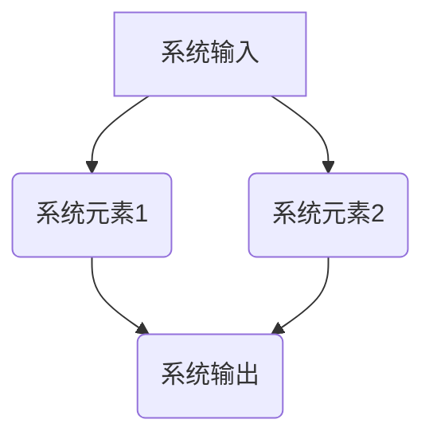
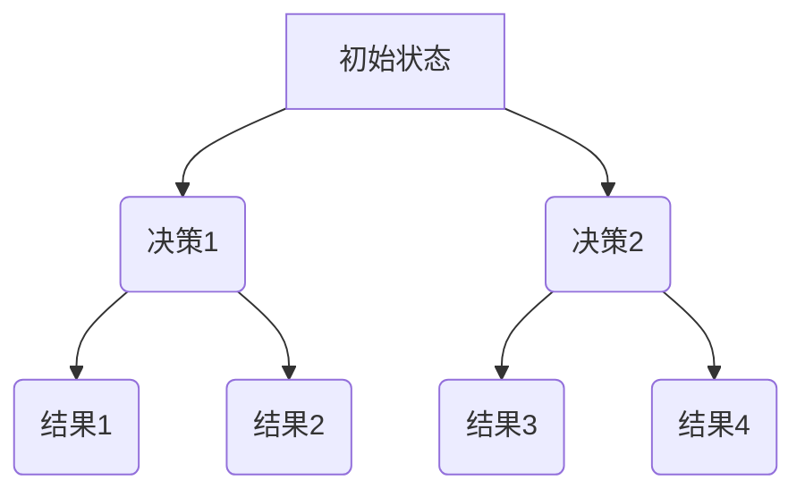
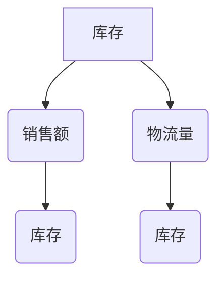
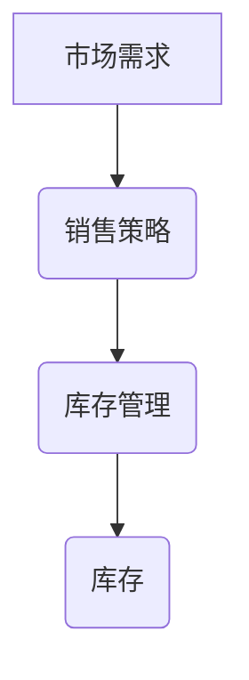
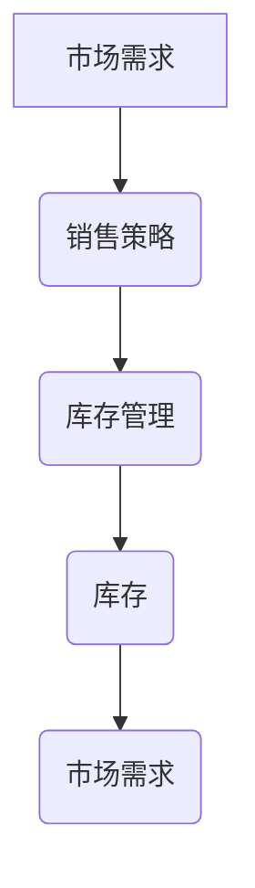

                 

### 引言

系统思考是一种处理复杂问题的思维方法，它强调理解系统整体的动态行为，而不仅仅是关注系统的各个组成部分。在当今高度复杂和动态变化的世界中，系统思考的重要性日益凸显。许多问题，如气候变化、经济危机、社会不平等，都是复杂的系统问题，涉及多个因素和相互作用。因此，要有效地理解和解决这些问题，我们需要采用系统思考的方法。

#### 1.1 系统思考的重要性

复杂性问题处理的必要性：现代社会面临的各种问题日益复杂，传统线性思维方法难以应对。例如，气候变化不仅仅是环境问题，还涉及到经济、政治、社会等多个方面。因此，我们需要一种能够理解和处理这些复杂关系的思维工具。

系统思考的概念界定：系统思考是一种理解和解决复杂问题的方法，它强调系统的整体性、动态性和反馈机制。系统思考不仅仅是关注系统内部各个元素的相互作用，更注重理解系统整体的运作机制及其外部环境的影响。

系统思考的应用领域：系统思考在多个领域都有广泛的应用，包括工程学、经济学、社会学、生态学、管理学等。例如，在工程学中，系统思考可以帮助设计复杂的系统，确保其稳定性和适应性；在经济学中，系统思考可以用于分析经济系统的动态行为，预测经济危机；在社会学和生态学中，系统思考可以帮助我们理解社会和生态系统的复杂关系，制定有效的政策和措施。

#### 1.2 系统思考与传统思维的对比

传统思维的局限：传统思维方法通常基于线性思维模式，强调因果关系和局部优化。这种方法在处理简单问题时可能有效，但在面对复杂系统时往往显得力不从心。例如，在解决经济危机时，传统经济学方法可能只关注货币政策和财政政策，而忽视了金融系统的复杂性和动态性。

系统思考的优势：系统思考强调系统的整体性和动态性，能够更好地处理复杂问题。它关注系统内部的反馈循环和相互作用，能够识别出潜在的因果关系和非线性关系。此外，系统思考还强调长期性和系统性，有助于我们制定更全面和可持续的解决方案。

系统思考的应用价值：系统思考的应用价值体现在多个方面。首先，它能够帮助我们更好地理解复杂系统的本质和动态行为，从而提高问题解决的有效性。其次，系统思考能够促进跨学科的交流和合作，有助于整合不同领域的知识和方法。最后，系统思考还可以提高决策的质量和效率，帮助我们制定更加科学和合理的决策。

### 1.3 系统思考的基本概念

系统思考是一种理解和解决复杂问题的方法，它强调系统的整体性、动态性和反馈机制。为了更好地理解系统思考，我们需要首先了解其核心概念。

#### 1.3.1 系统与系统元素

系统定义：系统是由相互关联的元素组成的整体，这些元素可以相互作用并共同实现特定功能。系统可以是物理的、抽象的或概念的，如生态系统、经济系统、组织系统等。

系统元素：系统元素是系统中的基本组成部分，可以是物理实体（如植物、动物）、抽象概念（如规则、原则）或符号表示（如变量、参数）。

系统元素之间的关系：系统元素之间的关系可以是直接的或间接的。直接关系指的是元素之间的直接相互作用，如能量传递、信息交换等。间接关系则是指元素之间通过其他元素的中介作用产生的相互作用，如政策影响、市场调控等。

#### 1.3.2 反馈循环

反馈循环定义：反馈循环是系统内部或系统与环境之间的信息反馈机制，它可以使系统行为自我修正和自我调节。反馈循环可以是正反馈或负反馈。

正反馈：正反馈是增强系统变化的反馈机制，导致系统状态加速变化。例如，在生物系统中，正反馈可能导致细胞分裂加速，从而引发肿瘤生长。

负反馈：负反馈是减缓系统变化的反馈机制，有助于系统稳定。例如，在体温调节系统中，当体温升高时，负反馈机制会促使身体通过出汗等方式降低体温。

反馈循环在系统中的作用：反馈循环在系统行为中起着至关重要的作用。它们可以使系统行为自我修正和自我调节，从而提高系统的稳定性和适应性。此外，反馈循环还可以导致系统行为的非线性变化，如混沌现象。

#### 1.3.3 延迟现象

延迟现象定义：延迟现象是指系统行为对输入变化产生反应的时间滞后。延迟现象可以是物理的（如信息传递延迟、物质传输延迟）或逻辑的（如决策延迟、执行延迟）。

延迟现象的影响：延迟现象可以对系统行为产生重要影响。首先，延迟现象可能导致系统行为的不可预测性，因为系统当前的状态可能受到过去输入的影响。其次，延迟现象可以导致系统行为的滞后性，即系统对输入变化的反应可能滞后于实际需求。最后，延迟现象可以导致系统行为的非线性变化，从而增加系统的不确定性。

应对策略：为了应对延迟现象，我们可以采取以下策略：

- 增强系统的信息反馈机制，以减少信息传递延迟。
- 优化系统的流程设计，以减少物质传输延迟。
- 提高系统的决策和执行效率，以减少决策延迟和执行延迟。

### 1.4 系统思考在解决问题中的应用

系统映射：系统映射是一种用于理解系统结构和动态的方法。它通过图形化表示系统元素及其相互关系，帮助我们更直观地理解系统的运作机制。

系统映射图示例：



系统映射图可以帮助我们识别系统中的关键元素和反馈循环，从而找到解决问题的关键点。

策略设计：策略设计是在理解系统结构和动态的基础上，制定出能够有效应对复杂问题的策略。系统思考提供了一系列工具和方法，如决策树、蒙特卡洛模拟等，帮助我们进行策略设计。

决策树示例：



通过决策树，我们可以系统地分析不同决策路径及其结果，从而制定出最优策略。

#### 1.4.1 系统映射

系统映射是系统思考中的关键步骤，它帮助我们理解和表示系统的结构和动态行为。通过系统映射，我们可以将复杂的系统问题简化为更容易理解和分析的图形表示。

**系统映射图：**


在这个例子中，系统输入（A）通过两个系统元素（B和C）产生输出（D）。系统元素1（B）和系统元素2（C）之间存在相互影响，形成了一个反馈循环。

**系统映射的应用：**

1. **问题诊断：** 通过系统映射，我们可以识别系统中的关键元素和反馈循环，从而找到问题的根源。例如，在分析一个企业的经营问题时，我们可以通过系统映射识别出影响销售的关键因素，如市场策略、产品质量、客户服务等。

2. **策略制定：** 系统映射可以帮助我们设计更有效的策略。通过分析系统映射图，我们可以确定哪些元素需要优化或调整，从而提高系统的整体性能。例如，在优化供应链管理时，我们可以通过系统映射识别出库存管理、物流配送等关键环节，并制定相应的改进措施。

3. **模型构建：** 系统映射是构建系统动力学模型的基础。通过系统映射，我们可以将系统的结构和动态行为转化为数学模型，从而进行更深入的分析和预测。例如，在分析一个经济系统的动态行为时，我们可以通过系统映射构建存量流量图，并利用微分方程描述系统的动态过程。

#### 1.4.2 策略设计

策略设计是在理解系统结构和动态的基础上，制定出能够有效应对复杂问题的策略。系统思考提供了一系列工具和方法，如决策树、蒙特卡洛模拟等，帮助我们进行策略设计。

**决策树：**

决策树是一种图形化表示决策过程的方法。它通过一系列分支和节点，展示不同决策路径及其结果。决策树可以帮助我们系统地分析不同决策路径及其结果，从而制定出最优策略。

**决策树示例：**


在这个例子中，我们从初始状态（A）开始，通过两个决策节点（B和C）到达不同的结果节点（D、E、F和G）。每个决策节点都对应一个特定的决策，而每个结果节点都代表决策的最终结果。

**策略设计步骤：**

1. **明确目标：** 确定我们需要解决的问题或达成的目标。例如，在制定企业的营销策略时，我们的目标可能是增加市场份额或提高品牌知名度。

2. **分析现状：** 通过系统思考的方法，分析当前系统的结构和动态行为，识别出影响目标实现的关键因素。例如，在分析企业营销策略时，我们可以识别出产品定位、推广渠道、市场环境等关键因素。

3. **设计决策路径：** 根据分析结果，设计不同的决策路径。这些决策路径应该覆盖所有可能的情况，并考虑每种情况的概率和结果。例如，在制定企业营销策略时，我们可以考虑不同的推广渠道（如线上广告、社交媒体营销、线下活动等），并评估每种渠道的效果和成本。

4. **评估和选择：** 通过评估不同决策路径的结果，选择最优策略。这可以通过计算预期收益、成本、风险等因素来实现。例如，在制定企业营销策略时，我们可以通过计算不同推广渠道的预期回报，选择最具成本效益的渠道。

5. **执行和监控：** 制定出最优策略后，将其付诸实施，并持续监控其效果。在实施过程中，我们需要根据实际情况调整策略，以应对不确定性和变化。例如，在实施企业营销策略时，我们需要根据市场反馈和竞争情况，及时调整推广策略。

**策略设计注意事项：**

1. **全面性：** 在设计策略时，要全面考虑各种可能的情况和因素，避免遗漏关键问题。

2. **灵活性：** 策略设计要具备一定的灵活性，能够适应变化和不确定性。例如，在制定企业营销策略时，要考虑到市场变化、竞争对手行动等因素，并设计相应的应对措施。

3. **可执行性：** 策略设计要具备可执行性，确保策略在实际操作中可行。例如，在制定企业营销策略时，要确保所采取的措施能够在实际操作中实施，并达到预期的效果。

4. **持续改进：** 策略设计是一个持续改进的过程。在实施策略的过程中，要不断收集反馈信息，分析策略的效果，并根据实际情况进行调整和优化。

### 第2章 系统思考的基本概念

在系统思考中，有几个核心概念是理解复杂系统行为的基础。这些概念包括系统、系统元素、反馈循环和延迟现象。在本章中，我们将详细探讨这些概念，并阐述它们在系统思考中的应用。

#### 2.1 系统与系统元素

**系统的定义：**

系统是由相互关联的元素组成的整体，这些元素相互作用，共同实现特定的功能或目标。系统可以是物理的，如生态系统、机械设备；可以是抽象的，如经济系统、组织结构；也可以是概念的，如信息处理系统。

**系统元素：**

系统元素是系统中的基本组成部分，它们可以是物理实体（如植物、动物）、抽象概念（如规则、原则）或符号表示（如变量、参数）。系统元素之间的关系决定了系统的结构和功能。

**系统元素之间的关系：**

系统元素之间的关系可以是直接的或间接的。直接关系指的是元素之间的直接相互作用，如能量传递、物质交换。间接关系则是指元素之间通过其他元素的中介作用产生的相互作用，如政策影响、市场调控。

**系统的层次结构：**

系统通常具有层次结构，从简单的子系统到复杂的整体系统。层次结构有助于我们理解和分析系统的不同层次和层面，从而更好地掌握系统的动态行为。

#### 2.2 反馈循环

**反馈循环的定义：**

反馈循环是系统内部或系统与环境之间的信息反馈机制，它可以使系统行为自我修正和自我调节。反馈循环可以是正反馈或负反馈。

**正反馈：**

正反馈是增强系统变化的反馈机制，导致系统状态加速变化。例如，在生物系统中，正反馈可能导致细胞分裂加速，从而引发肿瘤生长。在商业系统中，正反馈可能导致市场需求的快速增长，从而推动企业扩展。

**负反馈：**

负反馈是减缓系统变化的反馈机制，有助于系统稳定。例如，在体温调节系统中，当体温升高时，负反馈机制会促使身体通过出汗等方式降低体温。在金融市场中，负反馈机制可以通过市场调节手段抑制过度波动。

**反馈循环的类型：**

1. **增强型反馈循环：** 在这种反馈循环中，系统的输出会进一步增强输入，导致系统状态的加速变化。例如，在股票市场中，投资者的乐观情绪可能导致股票价格持续上涨，形成正反馈循环。

2. **稳定型反馈循环：** 在这种反馈循环中，系统的输出会减弱输入，帮助系统维持稳定状态。例如，在生态系统中，物种间的捕食与被捕食关系可以通过负反馈循环维持生态平衡。

3. **振荡型反馈循环：** 在这种反馈循环中，系统的输出会导致系统的状态在某个范围内振荡，而不是稳定在某个特定值。例如，在电子系统中，振荡器可以通过正反馈循环产生稳定的振荡信号。

**反馈循环在系统思考中的应用：**

1. **问题诊断：** 通过识别系统中的反馈循环，我们可以诊断系统行为的异常和潜在问题。例如，在分析一个企业的经营问题时，我们可以识别出哪些反馈循环可能导致市场需求的过度波动。

2. **策略设计：** 理解反馈循环有助于设计有效的策略来调节系统行为。例如，在制定一个经济政策时，我们可以利用负反馈循环来稳定市场，避免过度波动。

3. **风险评估：** 通过分析反馈循环的稳定性和动态行为，我们可以评估系统的风险和潜在危机。例如，在分析一个金融系统的稳定性时，我们可以识别出可能导致金融危机的反馈循环。

#### 2.3 延迟现象

**延迟现象的定义：**

延迟现象是指系统行为对输入变化产生反应的时间滞后。延迟现象可以是物理的（如信息传递延迟、物质传输延迟）或逻辑的（如决策延迟、执行延迟）。

**延迟现象的影响：**

延迟现象可以对系统行为产生重要影响。首先，延迟现象可能导致系统行为的不可预测性，因为系统当前的状态可能受到过去输入的影响。其次，延迟现象可以导致系统行为的滞后性，即系统对输入变化的反应可能滞后于实际需求。最后，延迟现象可以导致系统行为的非线性变化，从而增加系统的不确定性。

**延迟现象的类型：**

1. **物理延迟：** 物理延迟是由于物质传输或能量传递的物理限制而产生的。例如，在交通系统中，车辆的行驶速度和道路的容量限制可能导致交通延迟。

2. **逻辑延迟：** 逻辑延迟是由于信息处理和决策过程的时间消耗而产生的。例如，在金融市场中，投资者的决策和交易执行可能导致市场反应的延迟。

**延迟现象的应对策略：**

1. **增强反馈机制：** 通过增强系统的信息反馈机制，可以减少信息传递延迟。例如，在供应链管理中，实时数据分析和信息共享可以降低供应链的延迟。

2. **优化流程设计：** 通过优化系统的流程设计，可以减少物质传输延迟。例如，在生产线中，合理的布局和设备配置可以减少生产时间。

3. **提高决策效率：** 通过提高系统的决策和执行效率，可以减少决策延迟和执行延迟。例如，在企业管理中，自动化决策系统和快速响应机制可以提高决策效率。

### 2.4 系统动力学的基本原理

**系统动力学的基本概念：**

系统动力学是一门研究系统结构和动态行为的科学，它通过建立数学模型来描述系统的行为。系统动力学的基本原理包括存量与流量、因果关系和反馈循环。

**存量与流量：**

存量是系统中某个属性在某一时间点的累积量，如库存、人口、资金等。流量是系统中某个属性在单位时间内的变化量，如销售额、物流量、资金流入等。存量和流量之间的关系可以用存量流量图来表示。

**因果关系：**

因果关系是指系统元素之间的相互作用关系，即一个元素的变化如何影响另一个元素。在系统动力学中，因果关系通常用因果关系图来表示。

**反馈循环：**

反馈循环是系统内部或系统与环境之间的信息反馈机制，它可以使系统行为自我修正和自我调节。反馈循环可以是正反馈或负反馈。

**系统动力学的数学模型：**

系统动力学的数学模型通常包括存量流量图、微分方程和差分方程。存量流量图是系统动力学模型的基本工具，它通过图形化表示系统的结构和动态行为。微分方程和差分方程则是用于描述系统行为的数学公式。

**系统动力学模型的应用：**

系统动力学模型可以应用于多个领域，如经济学、社会学、生态学、工程学等。通过建立系统动力学模型，我们可以分析系统的动态行为，预测系统的未来趋势，并制定有效的策略来调节系统行为。

### 第3章 系统动力学的核心原理

系统动力学是一门研究系统结构和动态行为的科学，它通过建立数学模型来描述系统的行为。系统动力学的基本原理包括存量与流量、因果关系和反馈循环。本章将详细探讨这些原理，并阐述其在系统动力学模型中的应用。

#### 3.1 存量与流量

存量是系统中某个属性在某一时间点的累积量，如库存、人口、资金等。流量是系统中某个属性在单位时间内的变化量，如销售额、物流量、资金流入等。存量和流量之间的关系可以用存量流量图来表示。

**存量流量图的基本概念：**

存量流量图是系统动力学模型的基本工具，它通过图形化表示系统的结构和动态行为。存量流量图由存量节点、流量箭头和因果关系组成。

**存量流量图的构成：**

- **存量节点：** 存量节点表示系统的存量属性，通常用矩形表示。
- **流量箭头：** 流量箭头表示流量，从源节点指向目标节点，通常用带箭头的线表示。
- **因果关系：** 因果关系表示系统元素之间的相互作用关系，通常用箭头表示。

**存量流量图的示例：**



在这个例子中，库存（A）和销售额（B）之间存在因果关系，即销售额的变化会影响库存。物流量（D）也会影响库存（E）。

**存量流量图的应用：**

- **问题诊断：** 通过存量流量图，我们可以直观地识别系统的关键元素和反馈循环，从而诊断系统行为的问题和瓶颈。
- **策略设计：** 理解存量流量图有助于设计有效的策略来调节系统行为。例如，通过调整流量箭头，我们可以优化库存管理，提高物流效率。

#### 3.2 因果关系

因果关系是指系统元素之间的相互作用关系，即一个元素的变化如何影响另一个元素。在系统动力学中，因果关系通常用因果关系图来表示。

**因果关系图的基本概念：**

因果关系图是描述系统元素之间因果关系的一种图形化方法。因果关系图由节点和箭头组成。

**因果关系图的构成：**

- **节点：** 节点表示系统元素，可以是存量、流量或其他变量。
- **箭头：** 箭头表示因果关系，从原因指向结果。

**因果关系的类型：**

- **直接因果关系：** 直接因果关系是指元素之间的直接相互作用，如销售额增加导致库存减少。
- **间接因果关系：** 间接因果关系是指元素之间通过其他元素的中介作用产生的相互作用，如市场需求的变化通过销售策略影响库存管理。

**因果关系的示例：**



在这个例子中，市场需求（A）直接影响销售策略（B），而销售策略（B）又影响库存管理（C），最终影响库存（D）。

**因果关系图的应用：**

- **问题分析：** 通过因果关系图，我们可以系统地分析系统元素之间的相互作用关系，从而识别系统行为的根本原因。
- **策略优化：** 理解因果关系图有助于优化系统的策略设计。例如，通过调整因果关系，我们可以增强系统的稳定性和适应性。

#### 3.3 反馈循环

反馈循环是系统内部或系统与环境之间的信息反馈机制，它可以使系统行为自我修正和自我调节。反馈循环可以是正反馈或负反馈。

**反馈循环的基本概念：**

- **正反馈：** 正反馈是增强系统变化的反馈机制，导致系统状态加速变化。例如，在生物系统中，正反馈可能导致细胞分裂加速，从而引发肿瘤生长。
- **负反馈：** 负反馈是减缓系统变化的反馈机制，有助于系统稳定。例如，在体温调节系统中，当体温升高时，负反馈机制会促使身体通过出汗等方式降低体温。

**反馈循环的类型：**

- **增强型反馈循环：** 在这种反馈循环中，系统的输出会进一步增强输入，导致系统状态的加速变化。例如，在股票市场中，投资者的乐观情绪可能导致股票价格持续上涨，形成正反馈循环。
- **稳定型反馈循环：** 在这种反馈循环中，系统的输出会减弱输入，帮助系统维持稳定状态。例如，在生态系统中，物种间的捕食与被捕食关系可以通过负反馈循环维持生态平衡。
- **振荡型反馈循环：** 在这种反馈循环中，系统的输出会导致系统的状态在某个范围内振荡，而不是稳定在某个特定值。例如，在电子系统中，振荡器可以通过正反馈循环产生稳定的振荡信号。

**反馈循环的示例：**



在这个例子中，库存（D）的变化会影响市场需求（A），形成了一个正反馈循环。

**反馈循环的应用：**

- **问题诊断：** 通过识别系统中的反馈循环，我们可以诊断系统行为的异常和潜在问题。例如，在分析一个企业的经营问题时，我们可以识别出哪些反馈循环可能导致市场需求的过度波动。
- **策略设计：** 理解反馈循环有助于设计有效的策略来调节系统行为。例如，在制定一个经济政策时，我们可以利用负反馈循环来稳定市场，避免过度波动。
- **风险评估：** 通过分析反馈循环的稳定性和动态行为，我们可以评估系统的风险和潜在危机。例如，在分析一个金融系统的稳定性时，我们可以识别出可能导致金融危机的反馈循环。

### 3.4 系统动力学模型的数学描述

系统动力学模型可以通过数学方程来描述系统的动态行为。常用的数学描述方法包括存量流量图、微分方程和差分方程。

**存量流量图的数学描述：**

存量流量图可以用一组存量流量方程来描述。这些方程表示系统各存量变量之间的流量关系。

**示例：**

```latex


