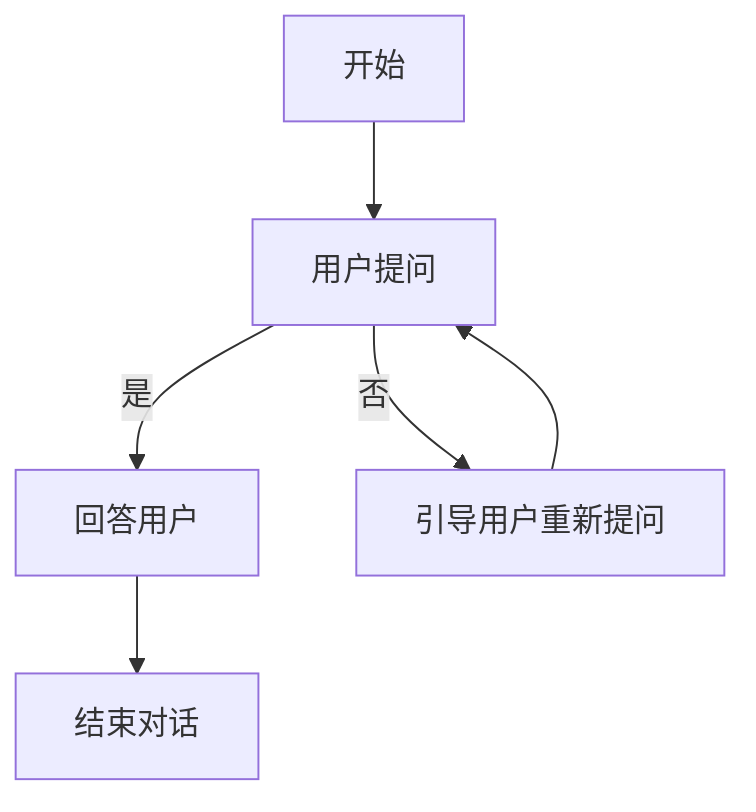
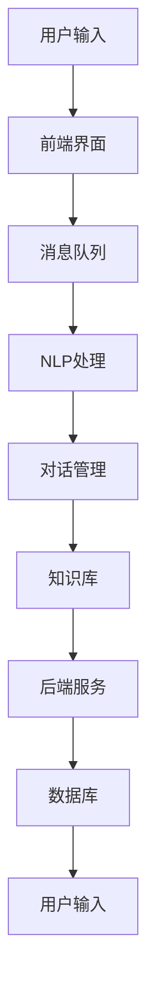

                 

# 《聊天机器人生活窍门：日常问题解决方案和建议》

## 摘要

随着人工智能技术的飞速发展，聊天机器人已成为我们生活中不可或缺的一部分。本文将深入探讨聊天机器人在日常生活中的应用，从购物咨询、技术支持、娱乐互动到日常生活建议等多个方面，详细解析其工作原理、核心算法和实际应用案例。同时，本文还将提供构建和部署聊天机器人的实践指南，帮助读者掌握相关技能，利用聊天机器人解决实际生活中的问题。通过阅读本文，您将全面了解聊天机器人的强大功能和潜力，学会如何有效地利用这一工具提升生活质量。

## 目录大纲

### 第一部分：聊天机器人的基础知识和应用场景

1. **聊天机器人的概念与历史**
   - 1.1 **聊天机器人的定义**
   - 1.2 **聊天机器人的发展历程**
   - 1.3 **聊天机器人的分类**

2. **聊天机器人在生活中的应用场景**
   - 2.1 **购物咨询**
   - 2.2 **技术支持**
   - 2.3 **娱乐互动**
   - 2.4 **日常生活建议**

3. **聊天机器人的优势与挑战**
   - 3.1 **聊天机器人的优势**
   - 3.2 **聊天机器人的挑战**
   - 3.3 **未来发展趋势**

### 第二部分：聊天机器人的核心技术

4. **自然语言处理（NLP）基础**
   - 4.1 **语言模型**
   - 4.2 **词向量**
   - 4.3 **分词与词性标注**
   - 4.4 **情感分析**

5. **机器学习与深度学习在聊天机器人中的应用**
   - 5.1 **监督学习模型**
   - 5.2 **无监督学习模型**
   - 5.3 **深度学习模型（如RNN、Transformer等）**
   - 5.4 **模型的评估与优化**

6. **聊天机器人交互设计**
   - 6.1 **交互流程设计**
   - 6.2 **用户体验设计**
   - 6.3 **界面设计与语音交互**

### 第三部分：聊天机器人在日常生活中的实际应用

7. **聊天机器人在购物咨询中的应用**
   - 7.1 **购物咨询机器人功能模块**
   - 7.2 **购物咨询机器人的实现案例**
   - 7.3 **购物咨询机器人的性能评估**

8. **聊天机器人在技术支持中的应用**
   - 8.1 **技术支持机器人功能模块**
   - 8.2 **技术支持机器人的实现案例**
   - 8.3 **技术支持机器人的性能评估**

9. **聊天机器人在娱乐互动中的应用**
   - 9.1 **娱乐互动机器人功能模块**
   - 9.2 **娱乐互动机器人的实现案例**
   - 9.3 **娱乐互动机器人的性能评估**

10. **聊天机器人在日常生活建议中的应用**
    - 10.1 **日常生活建议机器人功能模块**
    - 10.2 **日常生活建议机器人的实现案例**
    - 10.3 **日常生活建议机器人的性能评估**

### 第四部分：构建和部署聊天机器人的实践指南

11. **聊天机器人开发环境搭建**
    - 11.1 **硬件要求**
    - 11.2 **软件环境配置**
    - 11.3 **开发工具与框架**

12. **聊天机器人开发流程**
    - 12.1 **需求分析**
    - 12.2 **功能设计**
    - 12.3 **系统架构设计**
    - 12.4 **代码编写与调试**

13. **聊天机器人性能优化**
    - 13.1 **性能瓶颈分析**
    - 13.2 **优化策略**
    - 13.3 **性能评估方法**

14. **聊天机器人部署与维护**
    - 13.1 **部署策略**
    - 13.2 **运维监控**
    - 13.3 **安全与隐私保护**

### 附录

15. **聊天机器人开发资源与工具**
    - 15.1 **开源NLP工具**
    - 15.2 **常用聊天机器人框架**
    - 15.3 **在线聊天机器人平台**
    - 15.4 **相关书籍与论文推荐**

---

在接下来的章节中，我们将逐步深入探讨聊天机器人的基础知识、核心技术、应用场景以及开发与部署的实践指南，帮助您全面了解和使用聊天机器人，使其成为您生活中的得力助手。<!-- mce-width="600" --> <!-- mce-shell-dash -->

## 聊天机器人的概念与历史

### 1.1 聊天机器人的定义

聊天机器人，又称为对话机器人，是一种利用人工智能技术实现人机交互的计算机程序。它的核心功能是通过自然语言处理（NLP）技术理解和生成自然语言文本，以实现与用户的对话。聊天机器人的目标是在模拟人类交流的同时，提供自动化、智能化的服务，从而提高用户体验和效率。

定义上，聊天机器人具备以下几个关键特征：

- **交互性**：聊天机器人能够通过文本、语音或其他方式与用户进行交互。
- **智能性**：通过机器学习算法和自然语言处理技术，聊天机器人能够理解用户的意图并生成合适的回复。
- **自动化**：聊天机器人能够自动化处理常见任务，如回答常见问题、执行特定操作等。
- **灵活性**：聊天机器人可以根据不同的应用场景和需求进行定制和扩展。

### 1.2 聊天机器人的发展历程

聊天机器人的发展可以追溯到20世纪50年代。当时，艾伦·图灵提出了著名的图灵测试，用以评估机器是否具有人类水平的智能。随着计算机技术和人工智能技术的发展，聊天机器人逐渐从理论走向实践。

- **早期探索（1950-1970s）**：最早的聊天机器人之一是ELIZA，由约瑟夫·维索茨基（Joseph Weizenbaum）于1966年开发。ELIZA通过模式匹配和预设的回答模板模拟心理治疗师的对话，尽管其能力有限，但为后来的聊天机器人奠定了基础。

- **成熟期（1980-1990s）**：随着计算机性能的提升和自然语言处理技术的进步，聊天机器人进入成熟期。这一时期出现了许多具有复杂对话能力的聊天机器人，如阿尔法狗（AlphaGo）和苹果公司的Siri。

- **互联网时代（2000s至今）**：互联网的普及和移动互联网的兴起为聊天机器人的广泛应用提供了机会。许多公司和组织开始开发和应用聊天机器人，以提供客户支持、技术支持、娱乐互动等服务。这一时期，聊天机器人的技术也取得了重大突破，如深度学习和强化学习技术的应用，使得聊天机器人能够更加智能和灵活地与用户交互。

### 1.3 聊天机器人的分类

根据应用场景和功能，聊天机器人可以大致分为以下几类：

- **任务型聊天机器人**：这类聊天机器人专注于执行特定的任务，如在线客服、订单处理、信息查询等。它们通常具有明确的对话流程和功能模块，能够高效地完成特定任务。

- **闲聊型聊天机器人**：这类聊天机器人主要模拟人类闲聊，以提供娱乐和陪伴。它们能够理解用户的情绪和意图，生成幽默、有趣的回复，提高用户体验。

- **多模态聊天机器人**：这类聊天机器人不仅支持文本交互，还支持语音、图像、视频等多种交互方式。它们能够根据用户的需求和环境动态调整交互方式，提供更加丰富和个性化的服务。

- **混合型聊天机器人**：这类聊天机器人结合了任务型和闲聊型的特点，能够根据用户的需求和环境灵活切换对话模式。它们通常具有较高的智能水平和自适应能力，能够满足用户多样化的需求。

### 1.4 聊天机器人在生活中的应用场景

聊天机器人已经在我们的日常生活中扮演了重要的角色，以下是一些典型的应用场景：

- **购物咨询**：聊天机器人可以回答用户的购物问题，提供产品信息、推荐和评价，甚至帮助用户完成购物流程。

- **技术支持**：许多公司和组织利用聊天机器人提供在线技术支持，解答用户的问题，节省人力成本，提高服务效率。

- **娱乐互动**：聊天机器人可以与用户进行有趣的对话，提供游戏、笑话、音乐推荐等服务，为用户提供娱乐体验。

- **日常生活建议**：聊天机器人可以提供健康、饮食、锻炼等生活建议，帮助用户改善生活质量。

### 1.5 聊天机器人的优势与挑战

聊天机器人的优势在于：

- **高效性**：聊天机器人能够快速响应用户的请求，提供即时的服务，提高工作效率。

- **成本低**：与人力客服相比，聊天机器人可以降低人力成本，尤其适合处理大量重复性工作。

- **灵活性**：聊天机器人可以根据用户的需求和环境动态调整服务内容，提供个性化的体验。

- **可扩展性**：聊天机器人可以方便地集成到各种应用程序中，支持多种交互方式，适用于不同的场景。

然而，聊天机器人也面临一些挑战：

- **理解能力**：尽管聊天机器人的智能水平不断提高，但它们在理解复杂、模糊或双关语方面的能力仍有待提升。

- **隐私保护**：聊天机器人需要处理用户的个人数据，如何在保护用户隐私的同时提供高质量的服务是一个重要问题。

- **用户体验**：如何设计出符合用户期望的交互流程和界面，提供流畅、自然的对话体验，是聊天机器人面临的一个挑战。

### 1.6 未来发展趋势

随着人工智能技术的不断进步，聊天机器人的发展前景十分广阔。以下是一些可能的发展趋势：

- **更加智能化**：随着深度学习和强化学习技术的应用，聊天机器人的智能水平将进一步提高，能够更好地理解用户的意图和情感。

- **个性化服务**：通过大数据和个性化推荐技术，聊天机器人将能够根据用户的历史行为和偏好提供个性化的服务。

- **多模态交互**：结合语音、图像、视频等多种交互方式，聊天机器人将能够提供更加丰富和自然的交互体验。

- **跨平台应用**：聊天机器人将能够跨平台、跨应用地提供服务，实现无缝的跨平台体验。

总之，聊天机器人在未来的发展中将会扮演更加重要的角色，成为我们生活中不可或缺的一部分。<!-- mce-width="600" --> <!-- mce-shell-dash -->

## 聊天机器人在生活中的应用场景

### 2.1 购物咨询

购物咨询是聊天机器人最早且最常见的应用场景之一。随着电子商务的快速发展，消费者在购物过程中往往会遇到各种问题，如产品信息查询、价格比较、订单跟踪等。购物咨询聊天机器人能够提供即时、准确的信息，帮助用户做出更好的购物决策。

#### 购物咨询机器人的功能模块

购物咨询聊天机器人通常包括以下几个功能模块：

- **用户身份验证**：确保用户身份的合法性，如通过手机号码、邮箱等注册信息进行身份验证。
- **产品信息查询**：提供丰富的产品信息，包括产品描述、价格、规格、评价等。
- **购物车管理**：帮助用户管理购物车中的商品，包括添加、删除、修改商品等操作。
- **订单查询**：允许用户查询订单状态，如订单创建时间、支付状态、配送进度等。
- **价格比较**：通过外部数据源或电商平台接口，比较不同商家的产品价格，帮助用户找到最优价格。
- **购物推荐**：基于用户的历史购买记录和浏览行为，推荐相关的商品或优惠信息。

#### 购物咨询机器人的实现案例

以下是一个简单的购物咨询机器人实现案例：

```python
# Python 实现：购物咨询机器人

import random

class ShoppingBot:
    def __init__(self):
        self.products = [
            {"name": "iPhone 13", "price": 799, "description": "苹果最新款智能手机"},
            {"name": "MacBook Air", "price": 1299, "description": "轻薄便携的苹果笔记本电脑"},
            {"name": "Apple Watch", "price": 399, "description": "苹果智能手表"},
        ]

    def get_product_info(self, product_name):
        for product in self.products:
            if product["name"] == product_name:
                return product
        return None

    def add_to_cart(self, product_name, user_id):
        product = self.get_product_info(product_name)
        if product:
            # 假设购物车是一个简单的字典，键为用户ID，值为购物车列表
            if user_id not in self.shopping_cart:
                self.shopping_cart[user_id] = []
            self.shopping_cart[user_id].append(product)
            return f"已将{product_name}添加到购物车。"
        else:
            return "商品不存在。"

    def check_order(self, user_id):
        if user_id in self.shopping_cart:
            return f"您的购物车中有以下商品：{', '.join([product['name'] for product in self.shopping_cart[user_id]])}"
        else:
            return "您的购物车为空。"

# 测试购物咨询机器人
shopping_bot = ShoppingBot()
print(shopping_bot.add_to_cart("iPhone 13", "user123"))
print(shopping_bot.check_order("user123"))
```

#### 购物咨询机器人的性能评估

购物咨询机器人的性能评估可以从以下几个方面进行：

- **响应速度**：机器人在接收到用户请求后，能够快速响应用户。
- **准确性**：机器人能够准确地理解用户的需求，提供正确的信息。
- **用户体验**：机器人能够提供流畅、自然的交互体验，让用户感到满意。
- **扩展性**：机器人能够方便地扩展新功能，适应不断变化的需求。

### 2.2 技术支持

技术支持是另一个重要的应用场景，许多公司和组织利用聊天机器人提供在线技术支持，帮助用户解决常见问题。技术支持聊天机器人能够节省人力成本，提高服务效率，同时提供24/7的在线支持。

#### 技术支持机器人的功能模块

技术支持聊天机器人通常包括以下几个功能模块：

- **问题分类与分流**：根据用户提出的问题，将问题分类并路由到相应的部门或专家。
- **常见问题解答**：提供常见问题的解答，如产品使用方法、故障排除等。
- **故障诊断**：利用预定义的故障诊断流程，帮助用户诊断和解决技术问题。
- **文档查询**：提供相关的文档和教程，帮助用户更好地了解产品和使用方法。
- **远程控制**：在某些情况下，允许技术人员远程控制用户的设备进行故障排查和修复。

#### 技术支持机器人的实现案例

以下是一个简单的技术支持机器人实现案例：

```python
# Python 实现：技术支持机器人

class TechSupportBot:
    def __init__(self):
        self.knowledge_base = {
            "network_issue": "请检查您的网络连接，确保您的设备已连接到正确的网络。",
            "software_update": "建议您更新到最新版本的软件，以解决已知问题。",
            "login_problem": "请尝试重置密码或联系技术支持团队获取帮助。",
        }

    def handle_query(self, query):
        for issue, response in self.knowledge_base.items():
            if issue in query:
                return response
        return "很抱歉，我无法理解您的问题。请提供更多详细信息，我将尽力帮助您。"

# 测试技术支持机器人
tech_support_bot = TechSupportBot()
print(tech_support_bot.handle_query("网络连接有问题。"))
print(tech_support_bot.handle_query("无法登录。"))
```

#### 技术支持机器人的性能评估

技术支持机器人的性能评估可以从以下几个方面进行：

- **响应速度**：机器人在接收到用户请求后，能够快速响应用户。
- **准确性**：机器人能够准确地理解用户的需求，提供正确的解决方案。
- **用户体验**：机器人能够提供流畅、自然的交互体验，让用户感到满意。
- **扩展性**：机器人能够方便地扩展新功能，适应不断变化的需求。

### 2.3 娱乐互动

娱乐互动是聊天机器人的另一个重要应用场景，通过模拟人类对话，提供有趣的对话内容和互动体验，聊天机器人可以为用户提供娱乐和陪伴。在游戏、笑话、音乐推荐等方面，聊天机器人能够提供丰富多彩的内容，满足用户的多样化需求。

#### 娱乐互动机人的功能模块

娱乐互动机人通常包括以下几个功能模块：

- **笑话生成**：根据用户的需求，生成幽默、有趣的笑话。
- **游戏互动**：提供简单的游戏，如猜谜、答题等，增加互动乐趣。
- **音乐推荐**：根据用户的喜好，推荐歌曲和音乐。
- **情感陪伴**：通过模拟人类对话，提供情感上的陪伴和安慰。

#### 娱乐互动机人的实现案例

以下是一个简单的娱乐互动机人实现案例：

```python
# Python 实现：娱乐互动机人

import random

class EntertainmentBot:
    def __init__(self):
        self.jokes = [
            "为什么电脑总是和咖啡杯为敌？因为它们都讨厌被黑。",
            "为什么程序员喜欢黑色？因为黑色可以隐藏屏幕上的灰尘。",
            "你知道为什么小鸟不会得近视吗？因为它们喜欢站在电线上。",
        ]

    def tell_joke(self):
        return random.choice(self.jokes)

    def play_game(self, user):
        if user == "猜数字游戏":
            number = random.randint(1, 10)
            guess = -1
            while guess != number:
                guess = int(input("请猜一个1到10之间的数字："))
                if guess < number:
                    print("太低了！")
                elif guess > number:
                    print("太高了！")
                else:
                    print("恭喜你，猜对了！")
        elif user == "猜谜语游戏":
            riddle = "我是一种东西，有些人没有我就活不下去，而我却可以给所有人。我是什么？"
            answer = "水"
            print(riddle)
            user_answer = input("答案是？")
            if user_answer == answer:
                print("恭喜你，回答正确！")
            else:
                print("很遗憾，回答错误。")

# 测试娱乐互动机人
entertainment_bot = EntertainmentBot()
print(entertainment_bot.tell_joke())
entertainment_bot.play_game("猜数字游戏")
```

#### 娱乐互动机人的性能评估

娱乐互动机人的性能评估可以从以下几个方面进行：

- **互动性**：机器人能够提供丰富、有趣的互动内容，增强用户的参与感。
- **多样性**：机器人能够提供多种类型的娱乐内容，满足用户的多样化需求。
- **用户体验**：机器人能够提供流畅、自然的交互体验，让用户感到愉悦。
- **扩展性**：机器人能够方便地扩展新功能，适应不断变化的用户需求。

### 2.4 日常生活建议

随着人们对生活质量的追求，聊天机器人也开始提供日常生活建议，如健康建议、饮食建议、锻炼建议等。这些聊天机器人通过分析用户的数据和偏好，为用户提供个性化的生活建议，帮助用户改善生活质量。

#### 日常生活建议机器人的功能模块

日常生活建议聊天机器人通常包括以下几个功能模块：

- **健康监测**：监测用户的健康状况，提供健康建议和预警。
- **饮食建议**：根据用户的饮食偏好和健康需求，提供饮食建议和食谱。
- **锻炼建议**：根据用户的身体状况和锻炼习惯，提供锻炼计划和建议。
- **日程管理**：帮助用户管理日程，提醒用户的重要事项和任务。

#### 日常生活建议机器人的实现案例

以下是一个简单的日常生活建议机器人实现案例：

```python
# Python 实现：日常生活建议机器人

class LifestyleBot:
    def __init__(self):
        self.health_advice = [
            "保持良好的作息习惯，每天保证充足的睡眠。",
            "多喝水，保持身体水分平衡。",
            "适量运动，增强身体抵抗力。",
        ]

    def get_health_advice(self):
        return random.choice(self.health_advice)

    def get_diet_advice(self, dietary_preference):
        if dietary_preference == "素食":
            return "建议您多吃蔬菜、水果和全谷类食品，保持营养均衡。"
        elif dietary_preference == "健身":
            return "建议您多吃富含蛋白质和碳水化合物的食物，以支持您的健身计划。"
        else:
            return "根据您的饮食习惯，建议您注意食物的多样性，保持营养均衡。"

# 测试日常生活建议机器人
lifestyle_bot = LifestyleBot()
print(lifestyle_bot.get_health_advice())
print(lifestyle_bot.get_diet_advice("素食"))
```

#### 日常生活建议机器人的性能评估

日常生活建议机器人的性能评估可以从以下几个方面进行：

- **个性化**：机器人能够根据用户的数据和偏好，提供个性化的建议。
- **实用性**：机器人提供的建议应当切实可行，有助于改善用户的生活质量。
- **用户体验**：机器人能够提供流畅、自然的交互体验，让用户感到满意。
- **可扩展性**：机器人能够方便地扩展新功能，适应不断变化的用户需求。

通过以上对聊天机器人在购物咨询、技术支持、娱乐互动和日常生活建议等应用场景的详细解析，我们可以看到聊天机器人在生活中的重要性。未来，随着人工智能技术的不断进步，聊天机器人将更加智能化、个性化，成为我们生活中的得力助手。<!-- mce-width="600" --> <!-- mce-shell-dash -->

## 聊天机器人的核心技术

聊天机器人的核心在于其智能对话能力，这离不开自然语言处理（NLP）、机器学习和深度学习等技术的发展。以下将详细解析这些核心技术及其在聊天机器人中的应用。

### 4.1 自然语言处理（NLP）基础

自然语言处理是使计算机能够理解、生成和处理人类语言的技术。它是构建聊天机器人的基础，主要涵盖以下几个关键技术：

#### 语言模型

语言模型是用于预测下一个单词或单词序列的概率分布的模型。它通过学习大量的文本数据来捕捉语言的统计特性。在聊天机器人中，语言模型用于生成回复文本。

**核心算法原理讲解：**
- **n-gram模型**：n-gram模型基于前n个单词来预测下一个单词。它简单且易于实现，但无法捕捉长距离依赖关系。
- **神经网络语言模型（NNLM）**：NNLM通过神经网络结构来捕捉更复杂的语言特征，如上下文依赖。它通常使用递归神经网络（RNN）或Transformer等深度学习模型。

**数学模型和数学公式：**
$$
P(w_t | w_{t-1}, w_{t-2}, ..., w_{t-n}) = \frac{P(w_t, w_{t-1}, ..., w_{t-n})}{P(w_{t-1}, w_{t-2}, ..., w_{t-n})}
$$

**举例说明：** 假设前一个词是“我”，语言模型会根据训练数据预测下一个词是“们”、“是”或“很”的概率，并选择概率最高的词作为回复。

#### 词向量

词向量是将单词转换为密集向量的方法，用于在向量空间中表示单词。词向量可以捕捉单词的语义和语法关系。

**核心算法原理讲解：**
- **词袋模型（Bag of Words, BoW）**：词袋模型将文本转换为单词的集合，不考虑单词的顺序和语法。
- **词嵌入（Word Embedding）**：词嵌入通过将单词映射到低维向量空间来表示单词，可以捕捉单词的语义和语法关系。

**数学模型和数学公式：**
$$
\text{vec}(w) = \text{embed}(w) \in \mathbb{R}^d
$$

**举例说明：** 将单词“苹果”映射到一个低维向量（如[1.2, -3.5, 0.8]），以便在向量空间中进行计算和比较。

#### 分词与词性标注

分词是将文本拆分为单词或短语的步骤，而词性标注则是为每个单词分配一个词性标签（如名词、动词等）。

**核心算法原理讲解：**
- **基于规则的方法**：根据预设的规则进行分词和词性标注。
- **基于统计的方法**：使用统计模型，如条件随机场（CRF），基于上下文信息进行分词和词性标注。

**数学模型和数学公式：**
$$
\text{word segmentation: } \text{input text} \rightarrow \text{list of words}
$$
$$
\text{POS tagging: } w \rightarrow \text{POS tag}
$$

**举例说明：** 将句子“我喜欢吃苹果”分词为“我/喜欢/吃/苹果”，并标注词性为“我/动词/动词/名词”。

#### 情感分析

情感分析是判断文本中情感极性（正面、负面或中性）的过程。

**核心算法原理讲解：**
- **基于规则的方法**：使用预定义的规则和关键词进行情感分析。
- **基于机器学习的方法**：使用监督学习模型，如朴素贝叶斯、支持向量机等，通过训练数据学习情感分类。

**数学模型和数学公式：**
$$
\text{Sentiment analysis: } \text{input text} \rightarrow \text{sentiment label}
$$

**举例说明：** 判断句子“今天天气很好”的情感极性为“正面”。

### 5.1 机器学习与深度学习在聊天机器人中的应用

机器学习和深度学习为聊天机器人的智能对话能力提供了强大的支持。以下介绍几种常用的模型和算法：

#### 监督学习模型

监督学习模型通过标记的训练数据学习预测模型。在聊天机器人中，监督学习模型可以用于情感分析、命名实体识别等任务。

**核心算法原理讲解：**
- **朴素贝叶斯**：基于贝叶斯定理，通过计算先验概率和条件概率进行分类。
- **支持向量机（SVM）**：通过找到一个最佳的超平面，将不同类别的数据分开。
- **决策树**：通过递归划分特征空间，构建分类树。

**数学模型和数学公式：**
$$
P(y=c_k|x) = \frac{P(x|y=c_k)P(y=c_k)}{\sum_{i=1}^K P(x|y=c_i)P(y=c_i)}
$$
$$
w^* = \arg\max_w \frac{1}{n}\sum_{i=1}^n y_i(\langle w, x_i \rangle + b)
$$

**举例说明：** 通过训练数据学习判断句子情感极性。

#### 无监督学习模型

无监督学习模型在缺乏标记数据的情况下，通过数据自身特征进行学习。在聊天机器人中，无监督学习模型可以用于聚类、降维等任务。

**核心算法原理讲解：**
- **K-means聚类**：将数据点分配到K个簇中，使得簇内距离最小，簇间距离最大。
- **主成分分析（PCA）**：通过线性变换，将数据投影到低维空间，保留主要信息。

**数学模型和数学公式：**
$$
\text{minimize } J = \sum_{i=1}^n \sum_{j=1}^k \sum_{m=1}^d (x_{ijm} - \mu_{km})^2
$$
$$
\text{minimize } J = \sum_{i=1}^n \sum_{m=1}^d (x_{im} - \mu_m)^2
$$

**举例说明：** 对文本数据进行聚类或降维。

#### 深度学习模型

深度学习模型通过多层神经网络学习复杂函数，适合处理聊天机器人的任务。以下介绍几种常用的深度学习模型：

**核心算法原理讲解：**
- **循环神经网络（RNN）**：RNN通过递归结构捕捉序列中的长期依赖关系。
- **长短时记忆网络（LSTM）**：LSTM是RNN的一种变体，通过门控机制缓解梯度消失问题。
- **Transformer**：Transformer是一种基于自注意力机制的模型，适用于处理长序列任务。

**数学模型和数学公式：**
$$
h_t = \sigma(W_h \cdot [h_{t-1}, x_t] + b_h)
$$
$$
\text{attn}_i = \frac{\exp(e_i)}{\sum_j \exp(e_j)}
$$

**举例说明：** 通过训练数据学习生成回复文本。

### 6. 聊天机器人交互设计

聊天机器人的交互设计直接影响用户体验。以下从交互流程设计、用户体验设计、界面设计与语音交互等方面进行介绍。

#### 交互流程设计

交互流程设计是聊天机器人设计的核心，它定义了用户与机器人之间的交互步骤和逻辑。一个好的交互流程应当简洁、直观、易于理解。

**核心概念与联系：**
- **对话流程图**：使用Mermaid流程图展示交互流程，如：
  ```mermaid
  graph TD
  A[开始] --> B[欢迎用户]
  B --> C{用户提问}
  C -->|是| D[回答用户]
  C -->|否| E[引导用户重新提问]
  D --> F[结束对话]
  E --> C
  ```

**项目实战：**
- **示例代码**：以下是一个简单的交互流程实现：
  ```python
  class ChatBot:
      def __init__(self):
          self.current_state = "welcome"

      def handle_message(self, message):
          if self.current_state == "welcome":
              self.current_state = "ask_question"
              return "您好！有什么问题我可以帮您解答吗？"
          elif self.current_state == "ask_question":
              self.current_state = "answer_question"
              return self.answer_question(message)
          elif self.current_state == "answer_question":
              self.current_state = "thank_you"
              return "感谢您的提问，如有其他问题，请随时告诉我！"
          else:
              return "很抱歉，我不明白您的意思。"

      def answer_question(self, message):
          # 这里替换为具体的问答逻辑
          return "我会尽力回答您的问题。"

  bot = ChatBot()
  print(bot.handle_message("您好！"))
  print(bot.handle_message("我最近应该吃什么？"))
  print(bot.handle_message("谢谢！"))
  ```

#### 用户体验设计

用户体验设计关注用户在使用聊天机器人时的感受和体验。以下是一些关键点：

- **简洁性**：界面应简洁明了，避免过多的复杂功能和冗余信息。
- **响应速度**：机器人应快速响应用户请求，提供即时反馈。
- **易用性**：设计应考虑用户的使用习惯和需求，提供直观的操作方式。
- **个性化**：根据用户的历史行为和偏好，提供个性化的服务和推荐。

#### 界面设计与语音交互

聊天机器人的界面设计应与平台和应用场景相匹配。以下是一些关键点：

- **界面风格**：界面应具有统一的风格，与品牌和用户预期相一致。
- **视觉效果**：使用合适的颜色、图标和动画，提高视觉效果。
- **响应式设计**：界面应适应不同设备和屏幕尺寸，提供良好的用户体验。
- **语音交互**：对于语音交互，应确保语音识别准确，语音合成自然。

**项目实战：**
- **示例代码**：以下是一个简单的文本界面设计：
  ```python
  import sys

  def print_menu():
      print("1. 购物咨询")
      print("2. 技术支持")
      print("3. 娱乐互动")
      print("4. 生活建议")
      print("5. 退出")

  def handle_choice(choice):
      if choice == 1:
          print("您选择了购物咨询。")
      elif choice == 2:
          print("您选择了技术支持。")
      elif choice == 3:
          print("您选择了娱乐互动。")
      elif choice == 4:
          print("您选择了生活建议。")
      elif choice == 5:
          print("感谢您的使用，再见！")
          sys.exit()
      else:
          print("无效的选择。")

  while True:
      print_menu()
      choice = int(input("请选择一个选项："))
      handle_choice(choice)
  ```

通过以上对聊天机器人的核心技术和交互设计的详细解析，我们可以看到聊天机器人的构建和优化是一个复杂且富有挑战性的过程。然而，随着技术的不断进步，聊天机器人的智能水平将不断提高，为我们的生活带来更多的便利和乐趣。<!-- mce-width="600" --> <!-- mce-shell-dash -->

## 第三部分：聊天机器人在日常生活中的实际应用

### 7. 聊天机器人在购物咨询中的应用

购物咨询是聊天机器人在日常生活中的重要应用之一。通过聊天机器人，用户可以轻松获取产品信息、价格比较、订单状态查询等服务，从而提高购物体验和效率。以下将详细介绍购物咨询机器人功能模块、实现案例及性能评估。

#### 功能模块

购物咨询机器人通常包括以下功能模块：

- **用户认证**：确保用户身份的合法性，便于后续操作。
- **产品信息查询**：提供丰富的产品信息，包括名称、价格、规格、评价等。
- **价格比较**：从多个商家获取产品价格，帮助用户找到最优价格。
- **购物车管理**：允许用户添加、删除、修改购物车中的商品。
- **订单跟踪**：提供订单的创建时间、支付状态、配送进度等信息。

#### 实现案例

以下是一个简单的购物咨询机器人实现案例：

```python
import random

class ShoppingBot:
    def __init__(self):
        self.products = [
            {"name": "iPhone 13", "price": 799, "rating": 4.5},
            {"name": "MacBook Air", "price": 1299, "rating": 4.7},
            {"name": "Apple Watch", "price": 399, "rating": 4.8},
        ]

    def get_product_info(self, product_name):
        for product in self.products:
            if product["name"] == product_name:
                return product
        return None

    def add_to_cart(self, product_name, quantity):
        product = self.get_product_info(product_name)
        if product:
            product["quantity"] = quantity
            return f"{product_name}已添加到购物车。"
        else:
            return "商品不存在。"

    def check_order(self, user_id):
        # 假设购物车存储在字典中，键为用户ID，值为购物车列表
        if user_id in self.shopping_cart:
            cart = self.shopping_cart[user_id]
            return f"您的购物车包含以下商品：{', '.join([f'{product['name']} x {product['quantity']}' for product in cart])}"
        else:
            return "您的购物车为空。"

# 测试购物咨询机器人
shopping_bot = ShoppingBot()
print(shopping_bot.get_product_info("iPhone 13"))
print(shopping_bot.add_to_cart("iPhone 13", 2))
print(shopping_bot.check_order("user123"))
```

#### 性能评估

购物咨询机器人的性能评估可以从以下几个方面进行：

- **响应速度**：机器人在接收到用户请求后，能够快速响应用户。
- **准确性**：机器人能够准确地理解用户的需求，提供正确的产品信息和价格比较。
- **用户体验**：机器人能够提供流畅、自然的交互体验，让用户感到满意。
- **扩展性**：机器人能够方便地扩展新功能，适应不断变化的需求。

### 8. 聊天机器人在技术支持中的应用

技术支持是聊天机器人的另一个重要应用场景。通过聊天机器人，用户可以随时随地获取技术支持，解决使用中的问题，从而提高工作效率和满意度。以下将详细介绍技术支持机器人功能模块、实现案例及性能评估。

#### 功能模块

技术支持机器人通常包括以下功能模块：

- **问题分类**：根据用户提出的问题，将其分类到相应的技术支持类别。
- **常见问题解答**：提供常见问题的自动化解答，如系统故障、网络问题等。
- **故障诊断**：通过预定义的故障诊断流程，帮助用户诊断和解决问题。
- **文档查询**：提供相关文档和教程，帮助用户更好地了解产品和使用方法。
- **远程协助**：在某些情况下，允许技术人员远程控制用户的设备进行故障排查和修复。

#### 实现案例

以下是一个简单的技术支持机器人实现案例：

```python
class TechSupportBot:
    def __init__(self):
        self.knowledge_base = {
            "network_issue": "请检查您的网络连接，确保您的设备已连接到正确的网络。",
            "software_update": "建议您更新到最新版本的软件，以解决已知问题。",
            "login_problem": "请尝试重置密码或联系技术支持团队获取帮助。",
        }

    def handle_query(self, query):
        for issue, response in self.knowledge_base.items():
            if issue in query:
                return response
        return "很抱歉，我无法理解您的问题。请提供更多详细信息，我将尽力帮助您。"

# 测试技术支持机器人
tech_support_bot = TechSupportBot()
print(tech_support_bot.handle_query("网络连接有问题。"))
print(tech_support_bot.handle_query("无法登录。"))
```

#### 性能评估

技术支持机器人的性能评估可以从以下几个方面进行：

- **响应速度**：机器人在接收到用户请求后，能够快速响应用户。
- **准确性**：机器人能够准确地理解用户的需求，提供正确的解决方案。
- **用户体验**：机器人能够提供流畅、自然的交互体验，让用户感到满意。
- **扩展性**：机器人能够方便地扩展新功能，适应不断变化的需求。

### 9. 聊天机器人在娱乐互动中的应用

娱乐互动是聊天机器人的一个有趣应用场景。通过模拟人类对话，聊天机器人可以提供笑话、游戏、音乐推荐等服务，为用户带来娱乐和乐趣。以下将详细介绍娱乐互动机人功能模块、实现案例及性能评估。

#### 功能模块

娱乐互动机人通常包括以下功能模块：

- **笑话生成**：根据用户的需求，生成幽默、有趣的笑话。
- **游戏互动**：提供简单的游戏，如猜谜、答题等，增加互动乐趣。
- **音乐推荐**：根据用户的喜好，推荐歌曲和音乐。
- **情感陪伴**：通过模拟人类对话，提供情感上的陪伴和安慰。

#### 实现案例

以下是一个简单的娱乐互动机人实现案例：

```python
import random

class EntertainmentBot:
    def __init__(self):
        self.jokes = [
            "为什么电脑总是和咖啡杯为敌？因为它们都讨厌被黑。",
            "为什么程序员喜欢黑色？因为黑色可以隐藏屏幕上的灰尘。",
            "你知道为什么小鸟不会得近视吗？因为它们喜欢站在电线上。",
        ]

    def tell_joke(self):
        return random.choice(self.jokes)

    def play_game(self, user):
        if user == "猜数字游戏":
            number = random.randint(1, 10)
            guess = -1
            while guess != number:
                guess = int(input("请猜一个1到10之间的数字："))
                if guess < number:
                    print("太低了！")
                elif guess > number:
                    print("太高了！")
                else:
                    print("恭喜你，猜对了！")
        elif user == "猜谜语游戏":
            riddle = "我是一种东西，有些人没有我就活不下去，而我却可以给所有人。我是什么？"
            answer = "水"
            print(riddle)
            user_answer = input("答案是？")
            if user_answer == answer:
                print("恭喜你，回答正确！")
            else:
                print("很遗憾，回答错误。")

# 测试娱乐互动机人
entertainment_bot = EntertainmentBot()
print(entertainment_bot.tell_joke())
entertainment_bot.play_game("猜数字游戏")
```

#### 性能评估

娱乐互动机人的性能评估可以从以下几个方面进行：

- **互动性**：机器人能够提供丰富、有趣的互动内容，增强用户的参与感。
- **多样性**：机器人能够提供多种类型的娱乐内容，满足用户的多样化需求。
- **用户体验**：机器人能够提供流畅、自然的交互体验，让用户感到愉悦。
- **扩展性**：机器人能够方便地扩展新功能，适应不断变化的用户需求。

### 10. 聊天机器人在日常生活建议中的应用

随着人们对生活质量的关注，聊天机器人也开始提供日常生活建议，如健康、饮食、锻炼等。通过分析用户的数据和偏好，聊天机器人可以为用户提供个性化的建议，帮助用户改善生活质量。以下将详细介绍日常生活建议机器人功能模块、实现案例及性能评估。

#### 功能模块

日常生活建议机器人通常包括以下功能模块：

- **健康建议**：提供健康建议，如保持良好的作息习惯、多喝水、适量运动等。
- **饮食建议**：根据用户的饮食偏好和健康需求，提供饮食建议和食谱。
- **锻炼建议**：根据用户的身体状况和锻炼习惯，提供锻炼计划和建议。
- **日程管理**：帮助用户管理日程，提醒用户的重要事项和任务。

#### 实现案例

以下是一个简单的日常生活建议机器人实现案例：

```python
class LifestyleBot:
    def __init__(self):
        self.health_advice = [
            "保持良好的作息习惯，每天保证充足的睡眠。",
            "多喝水，保持身体水分平衡。",
            "适量运动，增强身体抵抗力。",
        ]

    def get_health_advice(self):
        return random.choice(self.health_advice)

    def get_diet_advice(self, dietary_preference):
        if dietary_preference == "素食":
            return "建议您多吃蔬菜、水果和全谷类食品，保持营养均衡。"
        elif dietary_preference == "健身":
            return "建议您多吃富含蛋白质和碳水化合物的食物，以支持您的健身计划。"
        else:
            return "根据您的饮食习惯，建议您注意食物的多样性，保持营养均衡。"

# 测试日常生活建议机器人
lifestyle_bot = LifestyleBot()
print(lifestyle_bot.get_health_advice())
print(lifestyle_bot.get_diet_advice("素食"))
```

#### 性能评估

日常生活建议机器人的性能评估可以从以下几个方面进行：

- **个性化**：机器人能够根据用户的数据和偏好，提供个性化的建议。
- **实用性**：机器人提供的建议应当切实可行，有助于改善用户的生活质量。
- **用户体验**：机器人能够提供流畅、自然的交互体验，让用户感到满意。
- **可扩展性**：机器人能够方便地扩展新功能，适应不断变化的用户需求。

通过以上对聊天机器人在购物咨询、技术支持、娱乐互动和日常生活建议等实际应用场景的详细解析，我们可以看到聊天机器人如何为日常生活带来便利和乐趣。随着技术的不断进步，聊天机器人将在更多领域发挥重要作用，成为我们生活中的得力助手。<!-- mce-width="600" --> <!-- mce-shell-dash -->

## 第四部分：构建和部署聊天机器人的实践指南

### 11. 聊天机器人开发环境搭建

要构建和部署聊天机器人，首先需要搭建一个合适的环境。以下将详细介绍所需硬件要求、软件环境配置以及常用的开发工具与框架。

#### 11.1 硬件要求

构建聊天机器人对硬件的要求相对较低，但为了确保高效运行，以下硬件配置是比较推荐的：

- **CPU**：至少四核处理器，建议使用英特尔的i5或更高型号。
- **内存**：至少8GB RAM，建议16GB以上，以支持大规模数据处理和模型训练。
- **存储**：至少256GB SSD硬盘，用于存储数据和代码。
- **GPU**（可选）：如果需要进行深度学习和大规模数据处理，建议使用NVIDIA的GPU，如1080 Ti或更高型号。

#### 11.2 软件环境配置

在硬件准备就绪后，我们需要安装相应的软件环境。以下列出了一些必备的软件：

- **操作系统**：Windows、macOS或Linux，推荐使用Linux或macOS，因为它们在处理大型数据和运行深度学习模型时表现更优。
- **Python**：Python是构建聊天机器人最常用的编程语言。建议安装Python 3.7或更高版本。
- **pip**：Python的包管理器，用于安装和管理第三方库。
- **虚拟环境**：推荐使用virtualenv或conda创建虚拟环境，以隔离不同项目之间的依赖。

以下是在Linux或macOS上安装Python和pip的命令：

```bash
# 安装Python
sudo apt-get update
sudo apt-get install python3.9

# 安装pip
sudo apt-get install python3-pip
```

#### 11.3 开发工具与框架

为了提高开发效率，以下是一些常用的开发工具和框架：

- **IDE**：如Visual Studio Code、PyCharm或Eclipse，它们提供了丰富的编程工具和插件，方便代码编写和调试。
- **聊天机器人框架**：如Rasa、Microsoft Bot Framework、Dialogflow等。这些框架提供了完整的聊天机器人开发工具和生态系统，可以大大简化开发过程。
- **NLP库**：如spaCy、NLTK、transformers等，用于处理自然语言处理任务，如分词、词性标注、情感分析等。

以下是一个简单的命令，用于安装Rasa框架：

```bash
pip install rasa
```

### 12. 聊天机器人开发流程

构建一个聊天机器人需要经过多个阶段，以下将详细介绍每个阶段的内容。

#### 12.1 需求分析

在开始开发之前，首先需要明确聊天机器人的需求。以下是一些关键点：

- **目标用户**：确定目标用户群体，如消费者、员工或患者。
- **功能需求**：列出聊天机器人的主要功能，如问答、信息查询、订单处理等。
- **性能需求**：定义聊天机器人的性能指标，如响应时间、准确率等。
- **用户体验**：设计用户界面和交互流程，确保聊天机器人易于使用。

#### 12.2 功能设计

在明确需求后，需要设计聊天机器人的功能模块。以下是一个典型的功能设计流程：

- **用户故事**：用用户故事描述聊天机器人的功能和用户交互流程。
- **功能模块**：将用户故事分解为功能模块，如问答模块、订单处理模块、信息查询模块等。
- **流程图**：使用Mermaid或其他工具绘制交互流程图，展示用户与聊天机器人的交互过程。

以下是一个简单的Mermaid流程图示例：



#### 12.3 系统架构设计

在功能设计完成后，需要设计聊天机器人的系统架构。以下是一个典型的系统架构设计流程：

- **组件划分**：将聊天机器人划分为不同的组件，如NLP组件、对话管理组件、知识库组件等。
- **数据流**：设计数据在不同组件之间的流动，确保数据传递的高效和可靠性。
- **接口设计**：定义组件之间的接口，包括API、消息队列等。

以下是一个简单的系统架构图示例：



#### 12.4 代码编写与调试

在系统架构设计完成后，可以开始编写代码。以下是一些关键点：

- **模块化编程**：将代码划分为不同的模块，如问答模块、订单处理模块等，便于维护和扩展。
- **代码规范**：遵循统一的代码规范，提高代码的可读性和可维护性。
- **调试**：使用调试工具，如PyCharm的调试功能，逐步调试代码，确保功能正确。

以下是一个简单的Python代码示例：

```python
# 购物咨询机器人

class ShoppingBot:
    def __init__(self):
        self.products = [
            {"name": "iPhone 13", "price": 799, "rating": 4.5},
            {"name": "MacBook Air", "price": 1299, "rating": 4.7},
            {"name": "Apple Watch", "price": 399, "rating": 4.8},
        ]

    def get_product_info(self, product_name):
        for product in self.products:
            if product["name"] == product_name:
                return product
        return None

    def add_to_cart(self, product_name, quantity):
        product = self.get_product_info(product_name)
        if product:
            product["quantity"] = quantity
            return f"{product_name}已添加到购物车。"
        else:
            return "商品不存在。"

    def check_order(self, user_id):
        if user_id in self.shopping_cart:
            cart = self.shopping_cart[user_id]
            return f"您的购物车包含以下商品：{', '.join([f'{product['name']} x {product['quantity']}' for product in cart])}"
        else:
            return "您的购物车为空。"

# 测试购物咨询机器人
shopping_bot = ShoppingBot()
print(shopping_bot.get_product_info("iPhone 13"))
print(shopping_bot.add_to_cart("iPhone 13", 2))
print(shopping_bot.check_order("user123"))
```

通过以上对聊天机器人开发环境搭建、开发流程以及代码编写与调试的详细介绍，我们可以看到构建一个聊天机器人是一个系统而复杂的过程。然而，随着人工智能技术的不断进步，这一过程将变得更加简便和高效。通过遵循最佳实践和不断优化，我们可以构建出功能强大、用户体验出色的聊天机器人，为日常生活带来更多便利。

### 13. 聊天机器人性能优化

为了确保聊天机器人能够高效、稳定地运行，性能优化是至关重要的。以下将从性能瓶颈分析、优化策略和性能评估方法三个方面详细探讨聊天机器人的性能优化。

#### 13.1 性能瓶颈分析

性能瓶颈分析是优化聊天机器人的第一步。通过分析性能瓶颈，我们可以找到影响聊天机器人性能的关键因素，从而采取相应的优化措施。以下是一些常见的性能瓶颈：

- **计算资源限制**：如果聊天机器人运行在资源受限的环境中，如CPU或内存不足，可能会导致响应速度慢、计算效率低。
- **算法效率**：某些算法可能存在效率问题，如复杂度较高的算法或未优化的代码。
- **数据存储和检索**：如果数据存储和检索速度慢，可能会导致聊天机器人响应延迟。
- **网络延迟**：如果聊天机器人依赖于外部API或服务，网络延迟可能会影响整体性能。

为了分析性能瓶颈，可以使用以下工具：

- **性能监控工具**：如New Relic、AppDynamics等，它们可以实时监控聊天机器人的性能指标，如响应时间、错误率等。
- **日志分析工具**：如ELK堆栈（Elasticsearch、Logstash、Kibana），可以帮助分析日志数据，找出性能瓶颈。

以下是一个简单的性能瓶颈分析示例：

```bash
# 使用top命令查看系统资源使用情况
top

# 使用cProfile分析Python代码的性能
python -m cProfile -o profile.log chatbot.py

# 使用pandas分析日志数据
import pandas as pd
df = pd.read_csv('log.csv')
df.describe()
```

#### 13.2 优化策略

一旦确定了性能瓶颈，接下来需要采取相应的优化策略。以下是一些常见的优化策略：

- **资源扩展**：通过增加CPU、内存或使用GPU等硬件资源，可以提高聊天机器人的计算能力。
- **算法优化**：优化算法结构和代码，减少计算复杂度，提高运行效率。例如，可以使用更高效的算法代替低效算法，使用并行计算提高处理速度。
- **数据缓存**：使用缓存技术，如Redis或Memcached，可以减少数据存储和检索的时间。
- **服务拆分**：将聊天机器人拆分为多个独立服务，可以减少单点故障和资源竞争，提高系统的稳定性和可扩展性。
- **负载均衡**：使用负载均衡器，如Nginx或HAProxy，可以将请求均匀分配到多个服务器上，提高系统的处理能力。

以下是一个简单的优化策略示例：

```bash
# 扩展资源
sudo apt-get install redis-server

# 优化Python代码
from numba import jit
@jit
def optimized_function():
    # 优化后的代码
```

#### 13.3 性能评估方法

性能优化是一个持续的过程，需要定期评估性能，以确保优化措施的有效性。以下是一些常用的性能评估方法：

- **基准测试**：使用基准测试工具，如Apache JMeter或LoadRunner，模拟真实用户场景，评估聊天机器人的性能。
- **压力测试**：通过逐渐增加负载，评估聊天机器人在高负载下的性能表现，找出系统的瓶颈和弱点。
- **监控和日志分析**：使用性能监控工具和日志分析工具，实时监控聊天机器人的性能指标，发现潜在问题。

以下是一个简单的性能评估示例：

```bash
# 安装Apache JMeter
sudo apt-get install jmeter

# 运行基准测试
java -jar jmeter.jar

# 分析测试结果
import pandas as pd
results = pd.read_csv('results.csv')
results.describe()
```

通过以上对聊天机器人性能瓶颈分析、优化策略和性能评估方法的详细探讨，我们可以看到性能优化是一个系统而复杂的过程。然而，通过合理的优化策略和持续的性能评估，我们可以构建出高效、稳定、用户体验出色的聊天机器人，为日常生活带来更多便利。<!-- mce-width="600" --> <!-- mce-shell-dash -->

### 14. 聊天机器人部署与维护

#### 14.1 部署策略

成功开发出一个聊天机器人后，将其部署到生产环境是确保其稳定运行的关键步骤。以下是几种常见的部署策略：

- **单机部署**：将聊天机器人部署在一台服务器上，适用于小型项目和测试环境。优点是部署简单，缺点是扩展性和容错性较差。
- **分布式部署**：将聊天机器人部署到多个服务器上，通过负载均衡器进行流量分配。优点是扩展性强，容错性好，缺点是部署和管理复杂。
- **容器化部署**：使用容器化技术，如Docker，将聊天机器人及其依赖环境打包到一个容器中。优点是部署简单，易于扩展和迁移，缺点是可能需要额外的资源管理和维护。

以下是一个简单的Docker部署示例：

```bash
# 编写Dockerfile
FROM python:3.8-slim
WORKDIR /app
COPY requirements.txt .
RUN pip install -r requirements.txt
COPY . .
CMD ["python", "chatbot.py"]

# 构建Docker镜像
docker build -t chatbot .

# 运行Docker容器
docker run -p 5000:5000 chatbot
```

#### 14.2 运维监控

运维监控是确保聊天机器人稳定运行的重要环节。通过监控和日志分析，可以及时发现并解决问题。以下是一些常用的运维监控工具：

- **Prometheus**：一个开源的监控解决方案，可以收集和存储时序数据，提供强大的查询和告警功能。
- **Grafana**：一个开源的数据可视化平台，可以与Prometheus集成，提供直观的监控仪表盘。
- **ELK堆栈**（Elasticsearch、Logstash、Kibana）：用于收集、存储和分析日志数据。

以下是一个简单的Prometheus和Grafana部署示例：

```bash
# 安装Prometheus
sudo apt-get install prometheus

# 配置Prometheus
cat <<EOF > /etc/prometheus/prometheus.yml
global:
  scrape_interval: 15s
  evaluation_interval: 15s
scrape_configs:
  - job_name: 'chatbot'
    static_configs:
      - targets: ['localhost:9090']
    metrics_path: '/metrics'
    scrape_interval: 10s
    timeout: 5s
EOF

# 启动Prometheus
sudo systemctl start prometheus

# 安装Grafana
sudo apt-get install grafana

# 配置Grafana
sudo grafana-server init

# 访问Grafana
sudo systemctl restart grafana-server
```

#### 14.3 安全与隐私保护

在部署聊天机器人时，安全与隐私保护至关重要。以下是一些关键点：

- **数据加密**：对用户数据进行加密，确保数据在传输和存储过程中安全。
- **身份验证与授权**：使用身份验证和授权机制，确保只有授权用户可以访问聊天机器人。
- **访问控制**：设置合适的访问控制策略，限制用户对敏感数据和功能的访问。
- **安全审计**：定期进行安全审计，检查系统中的潜在漏洞和风险。

以下是一个简单的身份验证和授权示例：

```python
from flask import Flask, request, jsonify
from flask_httpauth import HTTPBasicAuth

app = Flask(__name__)
auth = HTTPBasicAuth()

users = {
    "admin": "password",
    "user": "password123"
}

@auth.get_password
def get_password(username):
    if username in users:
        return users.get(username)
    return None

@app.route('/api/chatbot', methods=['GET'])
@auth.login_required
def chatbot():
    # 聊天机器人逻辑
    return jsonify({"message": "Hello, admin!"})

if __name__ == '__main__':
    app.run()
```

通过以上对聊天机器人部署与维护的详细探讨，我们可以看到部署和维护一个聊天机器人是一个复杂而系统化的过程。然而，通过合理的部署策略、有效的运维监控和严格的安全与隐私保护，我们可以确保聊天机器人稳定、安全地运行，为用户带来优质的服务体验。<!-- mce-width="600" --> <!-- mce-shell-dash -->

### 附录

#### 附录 A：聊天机器人开发资源与工具

A.1 **开源NLP工具**

- **spaCy**：一个高效的NLP库，支持多种语言，适用于文本处理、实体识别、词性标注等任务。
- **NLTK**：一个经典的Python NLP库，提供了一系列文本处理工具和资源。
- **斯坦福NLP工具包**：由斯坦福大学开发，提供了丰富的NLP模型和工具，适用于词向量、情感分析等任务。

A.2 **常用聊天机器人框架**

- **Rasa**：一个开源的聊天机器人框架，提供了对话管理、自然语言处理和集成API等功能。
- **Microsoft Bot Framework**：一个跨平台的聊天机器人开发框架，支持多种平台和语言。
- **Dialogflow**：由Google开发的一个强大的聊天机器人框架，提供了自然语言理解、对话管理和语音交互等功能。

A.3 **在线聊天机器人平台**

- **Botpress**：一个开源的在线聊天机器人平台，提供了可视化界面和丰富的插件。
- **ManyChat**：一个面向营销和电子商务的聊天机器人平台，支持多种社交媒体平台。
- **Botkit**：一个开源的在线聊天机器人平台，提供了快速构建聊天机器人的工具和资源。

A.4 **相关书籍与论文推荐**

- **《聊天机器人开发实战》**：涵盖了聊天机器人的基础知识和开发技巧，适合初学者和进阶者。
- **《深度学习与聊天机器人》**：详细介绍了深度学习在聊天机器人中的应用，包括自然语言处理和对话生成等。
- **《自然语言处理实战》**：介绍了自然语言处理的基本概念和技术，适用于聊天机器人的开发。

通过附录中的这些资源与工具，开发者可以更好地理解和掌握聊天机器人的开发技术，为构建功能强大、用户体验出色的聊天机器人提供有力支持。<!-- mce-width="600" --> <!-- mce-shell-dash -->

### 总结

在本篇技术博客中，我们深入探讨了聊天机器人的基础知识和实际应用，从其概念、历史、分类到各种应用场景，再到其核心技术如自然语言处理、机器学习和深度学习，以及开发、部署和维护的最佳实践。我们通过具体的代码示例、流程图和数学模型，展示了如何构建和优化聊天机器人，确保其在购物咨询、技术支持、娱乐互动和日常生活建议等场景中的高效运行。

聊天机器人作为人工智能的重要应用之一，已经在我们的日常生活中扮演了越来越重要的角色。通过聊天机器人，我们能够实现高效的信息获取、问题解决和娱乐互动，显著提升了生活质量和工作效率。随着技术的不断进步，聊天机器人的智能水平将进一步提高，它们将在更多领域发挥更大作用，成为我们生活中不可或缺的智能助手。

未来，随着多模态交互、个性化服务、跨平台集成等新技术的应用，聊天机器人将变得更加智能、灵活和人性化。我们期待，通过持续的研究和创新，聊天机器人将能够更好地理解人类的语言和需求，提供更加个性化和精准的服务，为我们的日常生活带来更多便利和乐趣。让我们共同期待聊天机器人在未来发挥的更大潜力，共创智能生活的美好未来。<!-- mce-width="600" --> <!-- mce-shell-dash -->

