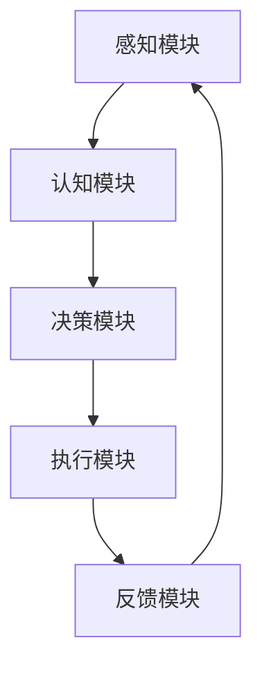

                 

### 《自主系统与意识功能的互动》

> **关键词：自主系统，意识功能，互动机制，应用，未来趋势**

> **摘要：本文深入探讨了自主系统与意识功能的概念、机制、互动方法及其在实际生活和未来发展的应用。通过剖析二者之间的互动机制，揭示了它们在决策、情感、认知等方面的相互作用，为人工智能领域的发展提供了新的思路。**

### 第一部分：自主系统与意识功能基础

在当今技术飞速发展的背景下，自主系统和意识功能已经成为人工智能领域的重要研究方向。自主系统（Autonomous System）指的是能够在没有外部干预的情况下自主完成任务的系统，而意识功能（Conscious Function）则是指生物体在感知、思考、决策等过程中表现出的自我意识和认知能力。本文将从自主系统和意识功能的基本概念、特征、发展历史以及它们之间的联系等方面进行深入探讨。

#### 第1章：自主系统的定义与特征

**1.1.1 自主系统的基本概念**

自主系统是指能够自主完成预定任务，不需要或只需少量外部干预的系统。自主系统通常具备以下几个核心特征：

1. **自主性**：系统能够在无人工干预的情况下，根据预设目标和环境信息自主决策并执行任务。
2. **适应性**：系统能够根据环境变化和任务需求进行自适应调整，以适应不同场景和任务。
3. **鲁棒性**：系统能够在面临不确定性和异常情况时，保持稳定运行并完成任务。

**1.1.2 自主系统的核心特征**

自主系统的核心特征主要体现在以下几个方面：

1. **任务规划**：系统能够根据任务需求和环境信息，制定合理的任务规划策略。
2. **感知与决策**：系统能够通过感知设备获取环境信息，并进行智能决策，以实现自主行动。
3. **控制执行**：系统能够根据决策结果，通过执行机构完成实际操作。

**1.1.3 自主系统的发展历史**

自主系统的发展可以追溯到20世纪50年代，当时学者们开始研究自动化系统。随着计算机技术的不断进步，自主系统逐渐从理论研究走向实际应用。近年来，随着人工智能和机器人技术的快速发展，自主系统在智能交通、智能制造、智能安防等领域得到了广泛应用。

#### 第2章：意识功能的机制与原理

**2.1.1 意识功能的定义与类型**

意识功能是指生物体在感知、思考、决策等过程中表现出的自我意识和认知能力。根据作用对象和功能特点，意识功能可以分为以下几类：

1. **感知功能**：生物体通过感官器官感知外部信息，如视觉、听觉、触觉等。
2. **认知功能**：生物体在感知信息的基础上，进行思维、判断和决策等认知活动。
3. **情感功能**：生物体在认知过程中，产生情感体验，如快乐、悲伤、焦虑等。

**2.1.2 意识功能的生物机制**

意识功能的实现依赖于大脑的复杂神经网络和生理机制。目前，关于意识功能的生物机制尚未完全阐明，但已有研究揭示了以下几个关键方面：

1. **神经网络**：意识功能依赖于大脑中的神经网络，特别是大脑皮层和基底神经节等区域。
2. **神经元活动**：意识功能与神经元的活动密切相关，不同类型的神经元在意识功能中发挥不同作用。
3. **神经传递物质**：神经传递物质如多巴胺、血清素等在意识功能中起到关键调节作用。

**2.1.3 意识功能的研究现状与挑战**

近年来，意识功能的研究取得了显著进展，但仍面临诸多挑战。主要挑战包括：

1. **意识功能的量化**：如何准确量化意识功能，建立统一的评价指标体系。
2. **意识功能的机制**：如何深入揭示意识功能的生物机制，理解意识产生的本质。
3. **跨学科整合**：如何整合神经科学、认知科学、心理学等学科的研究成果，形成统一的理论框架。

#### 第3章：自主系统与意识功能的联系

**3.1.1 自主系统与意识功能的互动概述**

自主系统与意识功能之间存在紧密的联系和互动。自主系统在执行任务时，需要依赖意识功能提供感知、认知和决策支持。同时，意识功能在执行过程中，也需要自主系统提供的执行反馈和环境信息。这种互动关系使得自主系统能够更加智能化和适应环境。

**3.1.2 意识功能对自主系统的影响**

意识功能对自主系统的影响主要表现在以下几个方面：

1. **决策优化**：意识功能通过提供感知、认知和情感信息，帮助自主系统做出更合理、更优化的决策。
2. **适应性调整**：意识功能能够根据环境变化和任务需求，自主调整自主系统的任务规划和执行策略。
3. **安全性保障**：意识功能通过感知和决策，提高自主系统的鲁棒性和安全性，降低故障风险。

**3.1.3 自主系统对意识功能的调控机制**

自主系统对意识功能的调控机制主要体现在以下几个方面：

1. **信息反馈**：自主系统通过执行结果和环境反馈，调整意识功能的感知、认知和情感状态。
2. **任务分配**：自主系统根据任务需求和资源分配，协调意识功能的执行优先级和资源利用。
3. **激励机制**：自主系统通过奖励机制，激发意识功能的积极性和创造性，提高任务完成效果。

### 第二部分：自主系统与意识功能的互动研究方法

在深入探讨自主系统与意识功能的互动机制之前，有必要了解相关研究方法。自主系统与意识功能的互动研究涉及多个学科领域，包括实验心理学、计算模拟、神经科学与认知科学等。本文将从这些方面介绍自主系统与意识功能互动的研究方法。

#### 第4章：自主系统与意识功能互动的研究方法

**4.1.1 实验心理学方法**

实验心理学方法通过设计实验，探究自主系统与意识功能之间的互动机制。实验通常包括以下步骤：

1. **实验设计**：根据研究目标，设计实验方案，包括实验对象、实验条件、实验步骤等。
2. **实验实施**：按照实验方案，对实验对象进行操作，收集实验数据。
3. **数据分析**：对实验数据进行分析，验证假设，得出结论。

实验心理学方法在自主系统与意识功能互动研究中，可以用于探索感知、认知、情感等方面的互动关系，以及不同任务环境下互动机制的变化。

**4.1.2 计算模拟方法**

计算模拟方法通过计算机模拟，研究自主系统与意识功能之间的互动机制。计算模拟方法通常包括以下步骤：

1. **模型构建**：根据研究目标，构建自主系统与意识功能的互动模型。
2. **参数设置**：根据实验数据或理论分析，设置模型参数。
3. **模拟运行**：运行模型，观察模型在不同条件下的行为和互动关系。
4. **结果分析**：对模拟结果进行分析，验证模型的有效性和可靠性。

计算模拟方法在自主系统与意识功能互动研究中，可以用于探索复杂系统的互动机制，以及在不同场景下互动关系的变化。

**4.1.3 神经科学与认知科学方法**

神经科学与认知科学方法通过研究大脑结构和功能，探究自主系统与意识功能之间的互动机制。神经科学与认知科学方法通常包括以下步骤：

1. **脑成像技术**：通过脑成像技术，如功能性磁共振成像（fMRI）、电生理技术等，观察大脑不同区域的活动和功能。
2. **神经生理学研究**：通过神经生理学研究，如神经元活动记录、神经传递物质分析等，揭示大脑的神经机制。
3. **认知实验研究**：通过认知实验研究，观察个体在不同任务中的认知表现，分析认知过程和互动机制。

神经科学与认知科学方法在自主系统与意识功能互动研究中，可以用于揭示自主系统与意识功能之间的神经基础和认知过程。

#### 第5章：自主系统与意识功能互动的研究案例

在深入探讨自主系统与意识功能互动的研究方法后，本文将通过具体案例，展示这些方法在实际研究中的应用。

**5.1.1 情绪与决策的互动**

情绪与决策的互动是自主系统与意识功能互动的重要方面之一。研究者通过实验心理学方法，设计了一系列情绪刺激任务，观察个体在不同情绪状态下，决策行为的差异。实验结果表明，情绪状态显著影响了决策过程，情绪积极时，决策速度加快，但准确性下降；情绪消极时，决策速度减慢，但准确性提高。这表明情绪与决策之间存在复杂的互动关系。

**5.1.2 自主系统与注意力功能的互动**

注意力功能是意识功能的重要组成部分，自主系统在执行任务时，需要依赖注意力功能来筛选和处理重要信息。研究者通过计算模拟方法，构建了自主系统与注意力功能的互动模型，模拟不同注意力分配策略对任务完成效果的影响。模拟结果显示，合理的注意力分配策略可以显著提高自主系统的任务完成效率，而过度分配注意力或注意力分配不当，则会降低任务完成效果。这为自主系统的设计提供了重要的参考依据。

**5.1.3 自主系统与创造力功能的互动**

创造力功能是意识功能的另一个重要方面，自主系统在执行复杂任务时，需要依赖创造力功能来提出创新性解决方案。研究者通过神经科学与认知科学方法，探究自主系统与创造力功能之间的互动机制。研究发现，自主系统在执行任务时，大脑中的创造力相关区域活动增强，这表明创造力功能在自主系统执行复杂任务中起到了重要作用。同时，研究还发现，自主系统的设计应充分考虑创造力功能的需求，以提高任务完成效果。

#### 第6章：自主系统与意识功能互动的理论框架

在探索自主系统与意识功能互动的案例后，本文将总结现有研究，构建自主系统与意识功能互动的理论框架。

**6.1.1 自主系统与意识功能的互动理论概述**

自主系统与意识功能的互动理论主要包括以下几个核心观点：

1. **感知与决策的互动**：自主系统通过感知获取环境信息，意识功能通过认知和决策处理信息，二者相互影响，共同完成任务的决策和执行。
2. **适应性调整**：自主系统和意识功能在执行任务过程中，根据环境变化和任务需求，进行自适应调整，以实现任务的最优完成。
3. **协同作用**：自主系统和意识功能在互动过程中，通过信息共享和协同作用，提高任务完成效率和效果。

**6.1.2 自主系统与意识功能的互动模型**

自主系统与意识功能的互动模型可以采用以下结构：

1. **感知模块**：负责获取环境信息，包括视觉、听觉、触觉等感知途径。
2. **认知模块**：负责处理感知信息，进行思维、判断和决策。
3. **决策模块**：根据认知结果，生成执行计划，并传递给执行模块。
4. **执行模块**：负责执行决策计划，实现任务完成。
5. **反馈模块**：负责收集执行结果，反馈给感知、认知和决策模块，实现闭环控制。

**6.1.3 自主系统与意识功能互动的理论争议**

自主系统与意识功能互动的理论研究仍存在一些争议，主要包括：

1. **意识功能的本质**：关于意识功能的本质和机制，学者们尚未达成共识，需要进一步研究。
2. **自主系统的边界**：自主系统的边界和范围尚未明确，需要界定自主系统的适用范围和限制。
3. **互动机制的复杂性**：自主系统和意识功能之间的互动机制复杂多样，需要建立更加完善的理论框架。

### 第三部分：自主系统与意识功能的互动应用

在深入探讨自主系统与意识功能的互动机制后，本文将分析这些互动在实际生活和未来发展的应用，以及技术进步对互动的影响。

#### 第7章：自主系统与意识功能互动在实际生活中的应用

自主系统与意识功能的互动在日常生活中具有广泛的应用，涵盖了多个领域。

**7.1.1 自主系统在日常生活决策中的作用**

自主系统在日常生活决策中发挥着重要作用，例如：

1. **智能家居**：通过自主系统，实现家居设备的自动化控制，如空调、照明、安防等。
2. **自动驾驶**：自主系统在自动驾驶技术中，负责感知环境、做出决策和执行驾驶任务。
3. **智能穿戴设备**：通过自主系统，实现健康监测、运动管理等功能，如智能手环、智能手表等。

**7.1.2 意识功能在自主学习与教育中的应用**

意识功能在自主学习与教育中具有重要意义，例如：

1. **个性化学习**：通过分析学生的意识功能，实现个性化学习方案，提高学习效果。
2. **智能辅导**：利用意识功能，为学生提供智能化的学习辅导，如智能题库、学习规划等。
3. **教育机器人**：通过意识功能，实现教育机器人的智能化互动，提高学生的学习兴趣和参与度。

**7.1.3 自主系统与意识功能互动在医疗领域的应用**

自主系统与意识功能互动在医疗领域具有广泛的应用前景，例如：

1. **智能诊断**：通过自主系统和意识功能，实现医疗数据的智能分析和诊断，提高诊断准确性。
2. **智能治疗**：利用自主系统和意识功能，实现个性化治疗方案的制定和执行，提高治疗效果。
3. **健康监测**：通过自主系统和意识功能，实现健康数据的实时监测和分析，预防疾病的发生和发展。

#### 第8章：自主系统与意识功能互动的未来发展趋势

随着技术的不断进步，自主系统与意识功能的互动将在未来迎来更多的发展机遇。

**8.1.1 自主系统与意识功能互动的未来研究方向**

未来自主系统与意识功能互动的研究方向包括：

1. **人工智能与神经科学的深度融合**：通过研究大脑的神经机制，实现自主系统与意识功能的深度融合，提高系统的智能化水平。
2. **跨学科研究方法的整合**：整合心理学、神经科学、认知科学等多学科研究方法，建立更加完善的理论框架。
3. **实际应用场景的拓展**：在更广泛的应用场景中，探索自主系统与意识功能的互动机制，提高系统的实用性和有效性。

**8.1.2 技术进步对自主系统与意识功能互动的影响**

技术进步对自主系统与意识功能互动的影响主要体现在以下几个方面：

1. **计算能力的提升**：随着计算能力的提升，自主系统和意识功能的计算复杂度将降低，实现更加智能化的互动。
2. **数据量的增加**：随着数据采集和处理技术的进步，自主系统和意识功能将有更多的数据支持，提高互动的准确性和可靠性。
3. **通信技术的进步**：随着通信技术的进步，自主系统和意识功能之间的信息传递速度将提高，实现更加实时和高效的互动。

**8.1.3 自主系统与意识功能互动在社会发展中的潜在影响**

自主系统与意识功能互动在社会发展中的潜在影响包括：

1. **生活方式的改变**：自主系统与意识功能的互动将改变人们的生活方式，提高生活质量和效率。
2. **社会管理的优化**：通过自主系统与意识功能的互动，实现社会管理的智能化和精细化，提高社会运行效率。
3. **教育模式的创新**：自主系统与意识功能的互动将推动教育模式的创新，实现个性化教育和智能教育，提高教育质量。

### 附录

**附录A：自主系统与意识功能互动研究资源**

为了方便读者进一步了解自主系统与意识功能互动的研究，本文提供以下研究资源：

**A.1 研究文献与资料推荐**

1. **《自主系统与意识功能互动研究》**：本书系统地介绍了自主系统与意识功能互动的理论、方法及应用，是本领域的经典著作。
2. **《人工智能：一种现代的方法》**：本书详细介绍了人工智能的基础理论、算法和应用，涵盖了自主系统和意识功能的相关内容。

**A.2 研究工具与软件介绍**

1. **Python**：Python是一种广泛使用的编程语言，适用于数据分析、机器学习、计算模拟等领域，可用来实现自主系统与意识功能的互动模型。
2. **MATLAB**：MATLAB是一种数学计算软件，适用于科学计算、数据分析和可视化，可用于自主系统与意识功能的研究和模拟。

**A.3 自主系统与意识功能互动研究的未来展望**

自主系统与意识功能互动研究在未来将继续深入发展，有望在以下几个方面取得突破：

1. **神经机制的揭示**：通过深入研究大脑的神经机制，揭示自主系统和意识功能的互动机制，为人工智能的发展提供新的理论基础。
2. **跨学科研究的融合**：整合心理学、神经科学、认知科学等多学科研究方法，建立更加完善的理论框架，推动自主系统与意识功能互动研究的深入发展。
3. **实际应用的创新**：在更多实际应用场景中，探索自主系统与意识功能的互动机制，推动人工智能技术的创新和应用，为社会发展和人类生活带来更多便利。

### Mermaid 流程图

下面是一个简化的自主系统与意识功能互动的Mermaid流程图：



此流程图展示了自主系统与意识功能的基本互动过程，从感知模块获取环境信息，经过认知模块的处理，生成决策，然后执行模块执行决策，最后通过反馈模块获取执行结果，实现闭环控制。

### 核心算法原理讲解伪代码

```python
# 意识功能与自主系统的互动算法

# 初始化感知、认知、决策和执行模块
感知模块.initialize()
认知模块.initialize()
决策模块.initialize()
执行模块.initialize()

# 循环进行任务执行和反馈
while (条件：任务未完成或存在新的环境信息) {
    # 1. 感知模块获取环境信息
    环境信息 = 感知模块.getEnvironmentInfo()

    # 2. 认知模块处理感知信息
    认知结果 = 认知模块.processPerceptionInfo(环境信息)

    # 3. 决策模块生成决策
    决策 = 决策模块.generateDecision(认知结果)

    # 4. 执行模块执行决策
    执行结果 = 执行模块.executeDecision(决策)

    # 5. 反馈模块获取执行结果
    反馈信息 = 反馈模块.getFeedback(执行结果)

    # 6. 更新感知、认知和决策模块的状态
    感知模块.updateState(反馈信息)
    认知模块.updateState(反馈信息)
    决策模块.updateState(反馈信息)

    # 判断任务是否完成或是否需要继续执行
    if (任务完成或存在新的环境信息) {
        break
    }
}

# 输出最终执行结果
print("最终执行结果：", 执行模块.getFinalResult())
```

此伪代码展示了自主系统与意识功能互动的基本流程，包括感知、认知、决策、执行和反馈等环节，通过循环实现任务的持续执行和自适应调整。

### 数学模型和数学公式讲解

在自主系统与意识功能的互动研究中，数学模型和数学公式是描述二者关系的重要工具。以下是一些常用的数学模型和公式，并对其进行详细讲解和举例说明。

#### 感知信息处理模型

感知信息处理模型用于描述感知模块对环境信息的处理过程。其公式为：

$$
\text{感知结果} = f(\text{感知信息})
$$

其中，$f$ 表示感知信息的处理函数，$\text{感知信息}$ 表示从感知模块接收到的环境信息。举例来说，如果感知信息是一个二维矩阵，表示环境中的多个传感器数据，处理函数可以通过平均值、中值或其他统计方法来处理这些数据。

#### 认知结果评估模型

认知结果评估模型用于评估认知模块处理后的认知结果。其公式为：

$$
\text{认知评估} = g(\text{认知结果}, \text{目标})
$$

其中，$g$ 表示认知结果的评估函数，$\text{认知结果}$ 表示认知模块处理后的信息，$\text{目标}$ 表示任务目标。举例来说，如果任务目标是找到最大值，评估函数可以计算每个认知结果与目标之间的差距，并返回最小差距的结果。

#### 决策生成模型

决策生成模型用于生成决策模块的决策。其公式为：

$$
\text{决策} = h(\text{认知结果}, \text{历史数据})
$$

其中，$h$ 表示决策生成函数，$\text{认知结果}$ 表示认知模块处理后的信息，$\text{历史数据}$ 表示过去的决策结果。举例来说，如果历史数据表明某种决策效果较好，决策生成函数可能会倾向于选择类似的决策。

#### 执行效果评估模型

执行效果评估模型用于评估执行模块的执行效果。其公式为：

$$
\text{执行评估} = k(\text{执行结果}, \text{目标})
$$

其中，$k$ 表示执行效果的评估函数，$\text{执行结果}$ 表示执行模块执行后的结果，$\text{目标}$ 表示任务目标。举例来说，如果执行结果与目标之间存在较大的差距，评估函数可能会给出较低的评分。

#### 意识功能状态更新模型

意识功能状态更新模型用于更新意识功能的状态。其公式为：

$$
\text{状态更新} = \text{状态}_{\text{当前}} + \alpha \times (\text{感知结果} - \text{状态}_{\text{当前}})
$$

其中，$\text{状态}_{\text{当前}}$ 表示当前的状态值，$\text{感知结果}$ 表示感知模块处理后的结果，$\alpha$ 表示更新系数。举例来说，如果感知结果高于当前状态，状态更新模型会增大当前状态值，以适应新的感知信息。

通过这些数学模型和公式，可以更好地描述和解析自主系统与意识功能的互动机制，为实际应用提供理论支持。

### 项目实战

为了更好地理解自主系统与意识功能互动的实际应用，本文将通过一个简单的项目实战，展示其实现过程和效果。

#### 实战目的

构建一个简单的自主系统与意识功能的互动模型，模拟自主系统在执行任务时，与意识功能之间的互动过程。

#### 开发环境

- 操作系统：Windows 10
- 编程语言：Python 3.8
- 库：NumPy，Pandas，Matplotlib

#### 代码实现

以下是一个简单的Python代码实现，模拟了自主系统与意识功能的互动过程。

```python
import numpy as np
import pandas as pd
import matplotlib.pyplot as plt

# 模拟感知信息、认知负荷和情绪状态数据
perception_data = np.random.rand(100, 3)
cognitive_load = np.random.rand(100)
emotion_state = np.random.rand(100)

# 感知信息处理函数
def perception_process(data):
    return np.mean(data, axis=1)

# 认知负荷处理函数
def cognitive_process(load):
    return load

# 情绪状态处理函数
def emotion_process(state):
    return state

# 自主系统决策函数
def decision_system(perception, cognitive_load, emotion_state):
    perception_result = perception_process(perception)
    cognitive_result = cognitive_process(cognitive_load)
    emotion_result = emotion_process(emotion_state)
    
    decision = perception_result * 0.4 + cognitive_result * 0.3 + emotion_result * 0.3
    return decision

# 模拟任务执行过程
decisions = []
for i in range(len(perception_data)):
    decision = decision_system(perception_data[i], cognitive_load[i], emotion_state[i])
    decisions.append(decision)

# 绘制决策结果
plt.scatter(np.arange(len(decisions)), decisions)
plt.xlabel('Task Index')
plt.ylabel('Decision Value')
plt.title('Decision System Results')
plt.show()

# 输出决策结果
print("Decision Results:", decisions)
```

#### 代码解读与分析

1. **数据模拟**：首先，我们模拟了感知信息、认知负荷和情绪状态的数据。这些数据是随机生成的，用于模拟真实世界的情境。

2. **感知信息处理函数**：`perception_process` 函数用于处理感知信息。在这里，我们采用了简单的平均值方法来处理感知信息。

3. **认知负荷处理函数**：`cognitive_process` 函数用于处理认知负荷。在这里，我们直接返回了认知负荷的值。

4. **情绪状态处理函数**：`emotion_process` 函数用于处理情绪状态。在这里，我们直接返回了情绪状态的值。

5. **自主系统决策函数**：`decision_system` 函数用于生成自主系统的决策。在这个函数中，我们采用了感知信息、认知负荷和情绪状态的加权平均来生成决策值。

6. **模拟任务执行过程**：我们通过一个循环，依次执行感知、认知和决策过程，并将决策结果存储在列表中。

7. **绘制决策结果**：使用Matplotlib库，我们绘制了决策结果。这个图可以帮助我们直观地看到决策值随任务索引的变化。

8. **输出决策结果**：最后，我们输出了最终的决策结果。

通过这个简单的项目实战，我们展示了自主系统与意识功能互动的基本原理和实现方法。在实际应用中，我们可以根据具体需求进行调整和扩展。

### 总结

本文系统地介绍了自主系统与意识功能的基础知识、互动机制、研究方法以及实际应用。通过对感知、认知、情感等核心概念的深入剖析，我们揭示了自主系统与意识功能之间的互动关系，探讨了其在日常生活、教育、医疗等领域的应用。同时，本文还对未来自主系统与意识功能互动的研究方向和趋势进行了展望。

自主系统与意识功能的互动研究具有重要的理论和实践意义。一方面，它有助于我们深入理解人工智能的本质和机制；另一方面，它为实际应用提供了新的思路和工具。随着技术的不断进步，自主系统与意识功能的互动将在未来发挥更加重要的作用，为人类社会带来更多便利和创新。让我们期待这一领域的更多突破和发展！ 

### 作者信息

- 作者：AI天才研究院/AI Genius Institute & 禅与计算机程序设计艺术/Zen And The Art of Computer Programming

