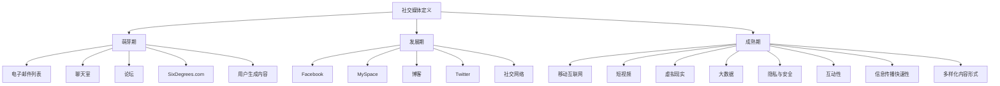
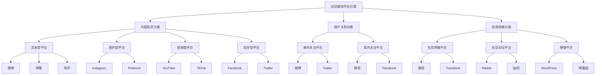

                 

### 社交媒体运营基础

社交媒体作为现代互联网生态的重要组成部分，已经成为企业进行品牌推广和用户互动的重要渠道。在这一部分，我们将对社交媒体运营的基础知识进行深入探讨，包括社交媒体的定义与发展、平台分类与特点、以及社交媒体在自动化创业中的应用场景。

#### 1.1 社交媒体的定义与发展

社交媒体（Social Media）是指一种基于互联网的技术，它使得用户可以通过文字、图片、视频等形式创建和分享内容，并与他人进行实时交流和互动。社交媒体的起源可以追溯到20世纪90年代，当时的互联网开始普及，电子邮件和论坛成为人们交流的主要方式。随着互联网技术的发展，特别是宽带网络的普及，社交媒体逐渐发展壮大，成为人们生活中不可或缺的一部分。

发展历程：
1. **早期阶段**：1994年，America Online（AOL）推出即时通讯软件，标志着社交媒体的萌芽。
2. **中期阶段**：2000年代，Facebook、Twitter等社交网络的兴起，使得社交媒体开始在全球范围内广泛应用。
3. **现阶段**：随着移动设备的普及和互联网技术的发展，社交媒体已经成为人们日常沟通、信息获取和娱乐的重要方式。

#### 1.2 社交媒体平台分类与特点

社交媒体平台种类繁多，根据不同的分类标准，可以将其分为以下几类：

1. **根据内容形式分类**：
   - **文本型**：如微博、博客等，主要形式是文字。
   - **图片型**：如Instagram、Pinterest等，主要形式是图片。
   - **视频型**：如YouTube、TikTok等，主要形式是视频。
   - **综合型**：如Facebook、Twitter等，可以发布多种形式的内容。

2. **根据用户关系分类**：
   - **单向关注**：如微博、Twitter等，用户可以关注其他用户，但不一定被关注。
   - **双向关注**：如Facebook、微信等，用户之间可以相互关注，形成社交网络。

3. **根据应用场景分类**：
   - **社交网络**：如Facebook、微信等，主要提供社交关系维护功能。
   - **社区论坛**：如Reddit、贴吧等，主要提供主题讨论和内容分享功能。
   - **博客平台**：如WordPress、博客园等，主要提供个人或机构内容发布和分享功能。

不同类型的社交媒体平台具有各自的特点和优势，企业可以根据自身需求选择适合的平台进行运营。

#### 1.3 社交媒体在自动化创业中的应用场景

在自动化创业中，社交媒体运营扮演着至关重要的角色。通过有效的社交媒体运营，企业可以实现以下几个应用场景：

1. **品牌推广**：通过社交媒体平台发布有吸引力的内容，提高品牌知名度和影响力。
2. **用户互动**：通过社交媒体平台与用户进行实时互动，了解用户需求，提高用户满意度。
3. **市场调研**：通过社交媒体平台收集用户反馈和数据，为产品迭代和市场策略提供依据。
4. **内容营销**：通过社交媒体平台发布高质量的内容，吸引潜在客户，提高转化率。
5. **危机管理**：通过社交媒体平台及时应对和处理负面信息，维护品牌形象。

在下一章中，我们将进一步探讨社交媒体运营策略，包括如何制定运营目标、内容策略、平台选择和营销预算规划。

### 1.1 社交媒体的定义与发展

#### 社交媒体的定义

社交媒体，顾名思义，是一种允许用户在网络上创建、分享、互动和参与内容的社会化平台。它不仅仅是一个简单的交流工具，更是一个集信息传播、社交互动、内容创作、市场推广等多功能于一体的生态系统。社交媒体的核心在于其“社会”属性，它通过用户生成内容（User-Generated Content，UGC）和社交网络连接用户，使得信息的传播更加快速、广泛和深入。

#### 发展历程

1. **萌芽期（1990年代末 - 2000年代初）**：
   - 早期社交媒体的雏形开始出现，如电子邮件列表、聊天室、论坛等。
   - 1997年，SixDegrees.com成为第一个真正意义上的社交网站，它允许用户建立个人档案，添加朋友网络。

2. **发展期（2000年代初期 - 中期）**：
   - 这一时期，社交媒体经历了快速的发展。Facebook（2004年）、MySpace（2003年）等平台的崛起，使得社交媒体开始走进大众视野。
   - 2006年，Twitter的上线进一步推动了社交媒体的普及，它以简短、实时的方式改变了信息传播的方式。

3. **成熟期（2000年代中期 - 至今）**：
   - 随着移动互联网的兴起，社交媒体进入了移动时代。智能手机和平板电脑的普及，使得用户可以随时随地进行社交媒体活动。
   - 2010年代，社交媒体平台不断扩展其功能，从简单的交流工具发展为集内容创作、视频直播、电子商务等多功能于一体的平台。

#### 社交媒体的核心特点

1. **用户生成内容**：社交媒体的活力来自于用户的参与和内容的创造。用户不仅消费内容，也可以成为内容的创造者，这种双向互动使得社交媒体充满活力。

2. **社交网络**：社交媒体通过用户之间的关系网来连接用户。这种社交网络不仅限于朋友之间，还包括陌生人、组织、品牌等多种关系。

3. **互动性**：社交媒体的核心在于用户的互动。评论、点赞、分享等互动方式，使得用户可以实时交流、表达观点和情感。

4. **信息传播的快速性**：社交媒体的信息传播速度非常快。一条信息可以通过点赞、分享等方式迅速传播到大量用户，形成病毒式的传播效果。

5. **多样化**：社交媒体平台形式多样，包括文本、图片、视频、直播等，用户可以根据自己的需求和喜好选择不同的平台进行互动。

#### 社交媒体的重要影响

1. **改变信息获取方式**：社交媒体使得用户可以更便捷地获取信息，不再依赖于传统媒体。
2. **塑造个人品牌**：个人和品牌可以通过社交媒体建立自己的品牌形象，增加曝光度和影响力。
3. **促进社交互动**：社交媒体为人们提供了新的社交方式，加强了人与人之间的联系。
4. **商业模式的变革**：社交媒体为企业提供了新的营销渠道和商业模式，如社交媒体广告、社交媒体电商等。

### 社交媒体的发展现状

1. **用户规模持续增长**：根据Statista的数据，全球社交媒体用户已超过40亿，占全球总人口的一半以上。
2. **移动化趋势显著**：随着智能手机的普及，移动社交媒体使用率大幅增长，成为用户主要的社交媒体活动平台。
3. **多元化内容形式**：短视频、直播、虚拟现实等新型内容形式不断涌现，丰富了社交媒体的内容生态。

### 未来发展趋势

1. **人工智能与大数据**：人工智能技术将进一步提升社交媒体的个性化推荐和精准营销能力。
2. **社交媒体电商**：社交媒体电商将进一步融合，为用户提供更加便捷的购物体验。
3. **隐私与安全问题**：随着用户对隐私和安全的关注增加，社交媒体平台将加强对数据保护和隐私安全的措施。

### 总结

社交媒体已经深入到我们生活的方方面面，它不仅改变了人们的交流方式，也带来了信息传播和商业模式的变革。理解社交媒体的发展历程和核心特点，对于创业者和企业来说，具有重要的战略意义。在接下来的章节中，我们将进一步探讨社交媒体运营策略，帮助企业更好地利用这一强大的工具。

---

下面是本章的核心概念原理和架构的Mermaid流程图：

该流程图清晰地展示了社交媒体从萌芽期到成熟期的发展历程及其核心特点，帮助读者更好地理解社交媒体的发展轨迹和功能演变。

---

在下一部分，我们将详细探讨社交媒体运营策略，包括如何制定运营目标、内容策略、平台选择和营销预算规划。这将为企业提供一套系统的社交媒体运营方案，助力品牌在竞争激烈的市场中脱颖而出。

### 1.2 社交媒体平台分类与特点

社交媒体平台种类繁多，各有其独特的功能和特点。了解不同平台的分类与特点，对于企业制定有效的社交媒体运营策略至关重要。以下是几种常见的社交媒体平台分类及各自的特点：

#### 根据内容形式分类

1. **文本型平台**：
   - **特点**：主要形式为文字，适合发布长篇文章、新闻简报等。
   - **代表平台**：微博、博客、知乎。
   - **适用场景**：企业新闻发布、品牌宣传、知识分享。

2. **图片型平台**：
   - **特点**：主要形式为图片，适合发布图片故事、产品展示等。
   - **代表平台**：Instagram、Pinterest。
   - **适用场景**：产品推广、品牌形象展示、用户互动。

3. **视频型平台**：
   - **特点**：主要形式为视频，适合发布视频广告、教程视频等。
   - **代表平台**：YouTube、TikTok。
   - **适用场景**：内容营销、品牌推广、教育培训。

4. **综合型平台**：
   - **特点**：支持多种内容形式，如文本、图片、视频等，适合多元化的内容发布。
   - **代表平台**：Facebook、Twitter。
   - **适用场景**：品牌推广、市场调研、用户互动。

#### 根据用户关系分类

1. **单向关注平台**：
   - **特点**：用户可以关注其他用户，但不必被关注。
   - **代表平台**：微博、Twitter。
   - **适用场景**：信息传播、品牌推广、市场监测。

2. **双向关注平台**：
   - **特点**：用户之间可以相互关注，形成社交网络。
   - **代表平台**：微信、Facebook。
   - **适用场景**：用户互动、品牌维护、社交连接。

#### 根据应用场景分类

1. **社交网络平台**：
   - **特点**：主要提供社交关系维护功能，如朋友圈、好友互动等。
   - **代表平台**：微信、Facebook。
   - **适用场景**：个人社交、品牌推广、用户互动。

2. **社区论坛平台**：
   - **特点**：主要提供主题讨论和内容分享功能，如话题讨论、经验分享等。
   - **代表平台**：Reddit、贴吧。
   - **适用场景**：用户交流、市场调研、内容创作。

3. **博客平台**：
   - **特点**：主要提供个人或机构内容发布和分享功能。
   - **代表平台**：WordPress、博客园。
   - **适用场景**：内容营销、知识分享、品牌形象建设。

### 不同类型社交媒体平台的比较

| 类别          | 代表平台          | 主要特点                                               | 适用场景                      |
|---------------|-------------------|--------------------------------------------------------|-----------------------------|
| 文本型平台    | 微博、博客、知乎   | 适合长文章、新闻简报等文字内容                        | 企业新闻发布、品牌宣传、知识分享 |
| 图片型平台    | Instagram、Pinterest | 适合图片故事、产品展示等图片内容                      | 产品推广、品牌形象展示、用户互动  |
| 视频型平台    | YouTube、TikTok   | 适合视频广告、教程视频等视频内容                      | 内容营销、品牌推广、教育培训    |
| 综合型平台    | Facebook、Twitter  | 支持文本、图片、视频等多种内容形式                    | 品牌推广、市场调研、用户互动    |
| 单向关注平台  | 微博、Twitter      | 用户可以单向关注他人，不必被关注                      | 信息传播、品牌推广、市场监测    |
| 双向关注平台  | 微信、Facebook    | 用户之间可以相互关注，形成社交网络                    | 用户互动、品牌维护、社交连接    |
| 社交网络平台  | 微信、Facebook    | 主要提供社交关系维护功能                            | 个人社交、品牌推广、用户互动    |
| 社区论坛平台  | Reddit、贴吧      | 主要提供主题讨论和内容分享功能                      | 用户交流、市场调研、内容创作    |
| 博客平台      | WordPress、博客园  | 主要提供个人或机构内容发布和分享功能                  | 内容营销、知识分享、品牌形象建设 |

通过对不同类型社交媒体平台的分类与特点进行分析，企业可以根据自身需求和目标，选择适合的社交媒体平台进行运营，以达到最佳的推广效果。

---

下面是本章的核心概念原理和架构的Mermaid流程图：

该流程图帮助读者清晰地理解了社交媒体平台的分类及各自的特点，为后续的社交媒体运营策略制定提供了重要的理论基础。

在接下来的章节中，我们将深入探讨社交媒体在自动化创业中的应用场景，帮助企业更好地利用社交媒体平台实现业务目标。

### 1.3 社交媒体在自动化创业中的应用场景

在自动化创业的浪潮中，社交媒体已成为不可或缺的营销工具。通过社交媒体，创业者可以高效地推广产品、吸引潜在用户、建立品牌形象，并在竞争激烈的市场中占据一席之地。以下是社交媒体在自动化创业中的主要应用场景：

#### 1. 品牌推广

社交媒体平台为创业者提供了一个广泛的宣传渠道，通过发布吸引人的内容、组织线上活动、参与话题讨论等方式，可以有效提升品牌的知名度和影响力。例如，创业者可以利用Instagram的视觉效果和TikTok的短视频功能，创造独特的品牌内容，吸引用户的关注。

#### 2. 用户互动

社交媒体不仅是一个宣传平台，也是一个与用户互动的重要渠道。创业者可以通过社交媒体平台与用户进行实时交流，了解用户需求，收集反馈，从而优化产品和服务。例如，在Twitter上，创业者可以及时回复用户的提问和意见，增强用户满意度。

#### 3. 市场调研

社交媒体平台提供了丰富的用户数据，创业者可以通过分析这些数据，了解市场趋势、用户偏好和行为模式，从而制定更加精准的市场策略。例如，通过分析Facebook上的用户兴趣和行为，创业者可以更准确地定位目标用户群体。

#### 4. 内容营销

内容营销是社交媒体运营的核心，创业者可以通过发布高质量的内容，如博客文章、视频教程、行业报告等，吸引用户并提高网站的访问量。例如，在LinkedIn上，创业者可以发布专业文章，分享行业见解，树立专家形象。

#### 5. 网络营销

社交媒体平台上的广告投放功能为创业者提供了另一种推广渠道。通过精准定位目标用户，创业者可以在社交媒体上投放广告，提高产品的曝光度和转化率。例如，在Google Ads和Facebook Ads上，创业者可以根据用户兴趣和行为数据，定制个性化的广告内容。

#### 6. 客户服务

社交媒体平台也为创业者提供了便捷的客户服务渠道。创业者可以通过社交媒体平台解答用户疑问、处理投诉，提升客户体验。例如，在Twitter上，创业者可以设立专门的客户服务账号，快速响应用户需求。

#### 7. 危机管理

在社交媒体时代，品牌危机往往迅速传播。创业者需要利用社交媒体平台及时应对和处理负面信息，维护品牌形象。例如，在社交媒体上发布澄清声明、积极与用户沟通，可以有效控制危机蔓延。

#### 案例分析

1. **案例一：宜家家居的社交媒体运营**
   - **应用场景**：品牌推广和用户互动。
   - **策略**：宜家家居在Instagram上发布高质量的家居设计和产品图片，吸引用户关注。同时，通过Instagram Story和Facebook Live进行产品介绍和用户体验分享，增强用户互动。
   - **成效**：宜家家居在社交媒体上拥有大量的粉丝，通过内容营销和用户互动，成功提升了品牌知名度和用户满意度。

2. **案例二：Airbnb的社交媒体营销**
   - **应用场景**：市场调研和网络营销。
   - **策略**：Airbnb通过Facebook和Google Ads进行精准广告投放，根据用户兴趣和行为数据，定制个性化的广告内容。同时，通过社交媒体平台收集用户反馈和市场数据，不断优化产品和服务。
   - **成效**：Airbnb通过精准的市场调研和广告投放，成功扩大了用户群体，提高了市场份额。

3. **案例三：特斯拉的社交媒体互动**
   - **应用场景**：客户服务和危机管理。
   - **策略**：特斯拉在Twitter上设立专门的客户服务账号，及时解答用户疑问和处理投诉。在面临品牌危机时，特斯拉通过社交媒体平台发布澄清声明，积极与用户沟通，有效控制危机蔓延。
   - **成效**：特斯拉通过高效的客户服务和危机管理，提升了用户满意度和品牌形象。

通过以上案例分析，我们可以看到，社交媒体在自动化创业中的应用场景非常广泛。创业者需要根据自身需求和目标，选择合适的社交媒体平台和策略，实现业务增长和品牌提升。

在下一章中，我们将深入探讨社交媒体运营策略，包括如何制定运营目标、内容策略、平台选择和营销预算规划，为创业者提供一套系统的社交媒体运营方案。

### 1.4 社交媒体运营策略

有效的社交媒体运营策略是企业在自动化创业中取得成功的关键。一个全面的社交媒体运营策略应包括明确的运营目标、科学的内容策略、精准的平台选择和合理的营销预算规划。以下是详细探讨这些关键要素。

#### 1. 制定社交媒体运营目标

制定社交媒体运营目标是企业开展社交媒体运营的第一步。明确的运营目标有助于企业集中资源和精力，实现业务增长和品牌提升。以下是一些常见的社交媒体运营目标：

1. **品牌知名度提升**：通过社交媒体平台发布高质量内容，提高品牌在目标市场中的曝光度和知名度。
2. **用户互动增加**：通过互动式内容，如问答、评论、点赞等，增加用户参与度，增强用户对品牌的忠诚度。
3. **用户转化率提高**：通过社交媒体营销活动，吸引潜在客户，提高产品或服务的购买率。
4. **客户服务优化**：利用社交媒体平台提供高效的客户服务，提升客户满意度和品牌形象。

在制定目标时，企业应确保目标具体、可衡量、可实现、相关性强和时限性（SMART原则），例如：“在未来6个月内，通过社交媒体平台增加至少10%的品牌知名度，同时提高30%的用户互动率。”

#### 2. 制定社交媒体内容策略

内容策略是社交媒体运营的核心，高质量的内容能够吸引并留住用户，提升品牌影响力。以下是一些制定内容策略的关键点：

1. **内容类型多样化**：结合文本、图片、视频等多种内容形式，满足不同用户的需求。例如，发布行业报告、产品介绍、用户故事、教程视频等。
2. **内容价值导向**：内容应具有实际价值，如提供有用的信息、解决用户问题、分享行业见解等，从而增加用户的粘性。
3. **内容发布频率**：保持定期且规律的内容发布，建立用户的期待和习惯，例如每周发布1-2篇高质量文章或视频。
4. **内容个性化**：根据用户兴趣和行为数据，定制个性化的内容，提高用户的参与度和满意度。

此外，企业还应关注内容的质量和原创性，避免抄袭和重复发布，确保内容独特且有吸引力。

#### 3. 社交媒体平台选择与定位

选择合适的社交媒体平台对于成功的社交媒体运营至关重要。不同平台具有不同的用户群体、内容形式和功能特点，企业应根据自身目标、资源情况和行业特点进行选择。以下是一些常见平台的定位和适用场景：

1. **Facebook**：适合品牌推广、用户互动和内容分享，尤其适用于需要广泛覆盖目标受众的企业。
2. **Instagram**：适合图片和视频内容的发布，适用于视觉导向的品牌和产品推广。
3. **Twitter**：适合实时交流和快速传播，适用于需要迅速获取市场反馈和参与话题讨论的企业。
4. **LinkedIn**：适合专业内容的发布和职业社交，适用于B2B企业和专业人士。
5. **YouTube**：适合视频内容的发布和传播，适用于内容营销和教育培训。
6. **TikTok**：适合短视频内容的创作和传播，适用于年轻用户和创意营销。

在确定平台后，企业应明确每个平台的目标和定位，制定具体的内容和互动策略，确保在不同平台上的运营具有一致性和连贯性。

#### 4. 社交媒体营销预算规划

有效的营销预算规划是确保社交媒体运营顺利进行的基础。企业在制定预算时，应考虑以下因素：

1. **内容创作成本**：包括内容创作、编辑、设计等费用。
2. **广告投放费用**：包括社交媒体广告投放的成本，如关键词广告、展示广告、赞助内容等。
3. **工具和平台费用**：包括使用社交媒体管理工具、数据分析工具等所需的费用。
4. **团队人力成本**：包括社交媒体运营团队的人员薪资和培训费用。

在预算分配上，企业应优先考虑内容创作和广告投放，确保有足够资源支持高质量内容和有效的推广活动。同时，企业还应定期评估预算使用情况，根据实际效果进行灵活调整。

通过制定明确的社交媒体运营目标、科学的内容策略、精准的平台选择和合理的营销预算规划，企业可以有效地在自动化创业中利用社交媒体平台，实现业务增长和品牌提升。在下一章中，我们将进一步探讨社交媒体内容创作，提供实用的原则和技巧。

### 1.5 社交媒体内容创作

社交媒体内容创作是社交媒体运营的重要组成部分，高质量的内容不仅能够吸引和留住用户，还能提升品牌形象和影响力。在这一部分，我们将深入探讨内容创作的基本原则与技巧，并分析不同类型社交媒体内容及其案例分析。

#### 1. 内容创作原则

1. **目标明确**：在创作内容之前，明确内容的目标和受众，确保内容与品牌定位和运营目标一致。
2. **用户导向**：内容应满足用户需求，解决用户问题，提供实际价值，从而提升用户的参与度和满意度。
3. **原创性**：确保内容具有原创性和独特性，避免抄袭和重复发布，提高内容的吸引力。
4. **简洁明了**：内容表达应简洁明了，避免冗长复杂的叙述，确保用户能够快速理解和吸收信息。
5. **互动性**：鼓励用户参与，如通过评论、点赞、分享等方式，提高用户的互动性和参与度。

#### 2. 内容创作技巧

1. **故事化**：通过故事化叙述，将枯燥的信息转化为有趣的故事，提高内容的吸引力和记忆度。
2. **可视化**：利用图片、图表、视频等多媒体元素，增强内容的可视化效果，提高用户的阅读体验。
3. **情感化**：通过情感共鸣，激发用户的情感反应，提高内容的感染力和传播力。
4. **标题优化**：使用引人入胜、有针对性的标题，吸引用户点击和阅读。
5. **SEO优化**：在内容创作过程中，注意SEO优化，提高内容的搜索排名和曝光度。

#### 3. 不同类型社交媒体内容

1. **文本内容**：
   - **博客文章**：适合深度内容，如行业分析、产品介绍、用户教程等。
   - **新闻简报**：适合快速传播，如企业新闻、市场动态等。
   - **用户反馈**：分享用户使用体验和反馈，提升用户信任度。

2. **图片内容**：
   - **图片故事**：通过图片讲述故事，如产品展示、用户案例等。
   - **海报和宣传图**：用于品牌推广、活动宣传等。
   - **漫画和插图**：生动有趣，适用于娱乐和教育内容。

3. **视频内容**：
   - **广告视频**：宣传品牌和产品，提高品牌知名度和用户转化率。
   - **教程视频**：展示产品使用方法、行业知识等，提升用户体验。
   - **直播视频**：实时互动，如产品发布会、行业讲座等。

4. **直播内容**：
   - **品牌直播**：与用户实时互动，增强用户参与感。
   - **行业直播**：分享行业见解、技术分享等，提升品牌权威性。
   - **活动直播**：如线下活动、发布会等，扩大品牌影响力。

#### 4. 内容案例分析

1. **案例一：杜蕾斯的社交媒体内容**
   - **类型**：图片和视频内容。
   - **特点**：杜蕾斯利用社交媒体发布幽默风趣、贴近生活的内容，成功吸引了大量关注。例如，其与热门事件的结合，引发了广泛的用户讨论和分享。
   - **成效**：通过高质量的内容创作，杜蕾斯在社交媒体上建立了强大的品牌影响力，提升了用户对品牌的认知和好感度。

2. **案例二：可口可乐的品牌故事**
   - **类型**：文本和图片内容。
   - **特点**：可口可乐通过讲述品牌故事，如历史传承、文化背景等，增强了品牌的情感连接。同时，其节日营销活动也获得了广泛关注。
   - **成效**：可口可乐通过丰富的内容创作和创新的营销活动，成功提升了品牌形象和市场占有率。

3. **案例三：CNN的实时新闻**
   - **类型**：文本、图片和视频内容。
   - **特点**：CNN利用社交媒体平台实时发布新闻内容，通过视频直播和图文报道，提供了丰富的新闻体验。
   - **成效**：CNN通过高质量的内容创作和快速的新闻传播，在社交媒体上建立了强大的新闻品牌，吸引了大量用户。

通过以上案例分析，我们可以看到，不同类型的内容在社交媒体上都有其独特的价值和影响力。创业者应根据自身品牌特点和目标受众，选择合适的类型和策略，创作高质量的内容，提升品牌在社交媒体上的影响力和竞争力。

在下一章中，我们将探讨社交媒体数据分析的重要性及其在优化运营策略中的应用。

### 1.6 社交媒体数据分析

社交媒体数据分析是社交媒体运营中不可或缺的一部分，它通过收集和分析大量的用户数据，帮助企业了解用户行为、优化运营策略，提高营销效果。以下是社交媒体数据分析的重要性、常用指标及其在优化运营策略中的应用。

#### 1. 数据分析的重要性

1. **了解用户行为**：通过数据分析，企业可以深入了解用户的浏览习惯、互动行为和消费行为，从而更好地满足用户需求。
2. **优化运营策略**：数据分析可以帮助企业发现运营中的问题和不足，从而优化内容和互动策略，提高用户参与度和满意度。
3. **提高营销效果**：通过分析不同营销活动的效果，企业可以调整营销策略，提高广告投放的ROI。
4. **预测市场趋势**：通过对历史数据的分析，企业可以预测未来的市场趋势和用户需求，从而提前做好准备。

#### 2. 社交媒体数据分析指标

以下是一些常用的社交媒体数据分析指标：

1. **用户增长率**：衡量用户数量的变化，包括新增用户、活跃用户和流失用户。
2. **互动率**：衡量用户对内容的反应程度，如点赞、评论、分享等。
3. **内容表现**：衡量内容的受欢迎程度，如阅读量、观看量、转发量等。
4. **广告效果**：衡量广告的点击率、转化率和投资回报率。
5. **用户留存率**：衡量用户持续使用平台的比例。
6. **用户满意度**：通过调查问卷等方式，了解用户对品牌的满意度。
7. **网站流量**：衡量网站访问量，包括访问来源、访问时间、访问路径等。

#### 3. 利用数据分析优化运营策略

1. **内容优化**：
   - **内容类型**：通过分析不同类型内容的互动率，确定哪些内容类型最受欢迎，增加相关内容的创作和发布。
   - **发布时间**：通过分析用户的活跃时间，确定最佳的发布时间，提高内容的曝光率和用户参与度。
   - **内容长度**：通过分析不同长度内容的表现，确定最佳的内容长度，避免冗长或过于简短的内容。

2. **互动策略**：
   - **互动频率**：通过分析互动率，确定最佳的互动频率，避免过度或不足的互动。
   - **用户反馈**：通过分析用户反馈，了解用户的需求和意见，及时调整运营策略。

3. **广告投放**：
   - **受众定位**：通过分析用户数据和广告效果，优化受众定位，提高广告的点击率和转化率。
   - **预算分配**：根据广告效果，合理分配广告预算，提高投资回报率。

4. **用户留存**：
   - **活动设计**：通过分析用户留存率，设计有效的用户留存活动，提高用户的持续使用率。
   - **用户分类**：根据用户行为数据，对用户进行分类，提供个性化的内容和互动，提高用户满意度和留存率。

通过社交媒体数据分析，企业可以更加科学和系统地优化运营策略，提高营销效果，实现业务增长。在下一章中，我们将探讨社交媒体自动化工具的作用与类型。

### 1.7 社交媒体自动化工具概述

在社交媒体运营中，自动化工具的使用能够大大提高工作效率，减少重复劳动，帮助企业更好地管理多个平台。社交媒体自动化工具的作用主要体现在以下几个方面：

#### 1. 节省时间和人力成本

自动化工具可以自动处理日程安排、内容发布、评论回复等日常运营任务，节省运营人员的时间和精力，使其能够专注于更重要的战略规划与内容创作。

#### 2. 提高运营效率

通过自动化工具，企业可以批量管理多个社交媒体平台，同时发布内容，从而提高运营效率。例如，使用自动化工具可以在不同时间自动发布预设置的内容，确保内容发布的连贯性和一致性。

#### 3. 数据分析和优化

一些高级的社交媒体自动化工具还提供数据分析功能，帮助企业了解用户行为、内容表现和广告效果，从而优化运营策略，提高营销效果。

#### 4. 扩大覆盖范围

自动化工具可以帮助企业将内容推广到更多的平台和受众，从而扩大品牌的覆盖范围。例如，通过自动化工具，企业可以在多个社交媒体平台上同时发布广告或推广内容。

#### 自动化工具的类型

根据功能和用途的不同，社交媒体自动化工具可以分为以下几类：

1. **内容发布管理工具**：如Hootsuite、Buffer，这些工具可以帮助企业批量安排和发布内容，同时监控多个社交媒体平台上的互动。
2. **社交聆听工具**：如Sprout Social、Agorapulse，这些工具可以帮助企业监控社交媒体上的品牌提及和用户反馈，从而进行危机管理和用户互动。
3. **广告管理工具**：如Facebook Ads Manager、Google Ads，这些工具提供广告创建、投放和管理功能，帮助企业优化广告投放策略。
4. **数据分析和报告工具**：如Google Analytics、HubSpot，这些工具可以提供详细的用户行为分析和运营报告，帮助优化运营策略。

通过选择合适的社交媒体自动化工具，企业可以更高效地管理社交媒体运营，提高整体营销效果。

### 1.8 常见社交媒体自动化工具

在社交媒体运营中，自动化工具的使用至关重要。以下是几种常见的社交媒体自动化工具，包括Hootsuite、Buffer、Sprout Social和Agorapulse，我们将分别介绍这些工具的特点、功能和实际应用。

#### 1. Hootsuite

**特点**：Hootsuite是一个功能强大的社交媒体管理平台，支持多个社交媒体平台的统一管理。

**功能**：
- **内容发布管理**：允许用户批量发布和管理社交媒体内容，支持多种内容形式（文本、图片、视频等）。
- **社交媒体聆听**：监控品牌提及和用户反馈，及时处理评论和私信。
- **团队协作**：提供用户权限管理，方便团队成员分工合作。

**实际应用**：
- **批量发布内容**：通过Hootsuite，用户可以提前创建和安排社交媒体内容，确保内容发布的连贯性和一致性。
- **用户互动**：实时监控和回复社交媒体上的用户反馈，提高用户满意度。

#### 2. Buffer

**特点**：Buffer是一个简单易用的社交媒体内容发布工具，适合中小型企业的社交媒体运营。

**功能**：
- **内容发布管理**：提供自动发布功能，根据用户设置的时间表自动发布内容。
- **社交媒体分析**：提供简单的分析工具，帮助用户了解内容表现和优化发布策略。
- **内容灵感**：提供内容灵感工具，帮助用户创建有吸引力的内容。

**实际应用**：
- **自动发布**：通过Buffer，用户可以提前设置内容发布时间，实现自动化发布，节省时间和人力成本。
- **内容优化**：通过分析工具，用户可以了解哪些内容表现最好，从而优化内容策略。

#### 3. Sprout Social

**特点**：Sprout Social是一个综合性的社交媒体管理平台，提供广泛的功能，包括内容发布、社交媒体聆听、团队协作等。

**功能**：
- **内容发布管理**：支持多平台内容发布，提供预发布和批量发布功能。
- **社交媒体聆听**：监控社交媒体上的品牌提及和用户反馈，提供情感分析和反馈处理。
- **数据分析**：提供详细的社交媒体分析报告，帮助用户了解内容表现和优化策略。

**实际应用**：
- **多平台管理**：通过Sprout Social，用户可以同时管理多个社交媒体平台，提高运营效率。
- **危机管理**：通过实时监控用户反馈，及时处理负面信息，维护品牌形象。

#### 4. Agorapulse

**特点**：Agorapulse是一个专注于社交媒体互动管理的工具，提供强大的互动功能。

**功能**：
- **互动管理**：提供自动化回复功能，快速处理评论和私信。
- **用户细分**：根据用户行为和兴趣，将用户进行细分，提供个性化的互动和内容。
- **数据分析**：提供社交媒体分析报告，帮助用户了解用户行为和优化运营策略。

**实际应用**：
- **自动化回复**：通过Agorapulse，用户可以设置自动化回复，提高互动效率，减少人工回复的工作量。
- **个性化互动**：根据用户细分，提供个性化的互动和内容，提升用户满意度和忠诚度。

通过使用这些自动化工具，企业可以更高效地管理社交媒体运营，提高用户互动质量和内容发布效率。在下一章中，我们将探讨如何利用这些工具实现社交媒体自动化的具体应用。

### 1.9 社交媒体自动化工具实战

社交媒体自动化工具在提高运营效率和优化内容发布策略方面具有显著优势。下面，我们将通过具体的案例，介绍如何利用这些工具实现社交媒体自动化的各个方面，包括自动化流程设计、内容自动化发布、互动自动化处理和广告自动化投放。

#### 1. 自动化流程设计

自动化流程设计是实施社交媒体自动化的第一步。以下是一个简单的自动化流程设计案例：

1. **目标设定**：明确自动化流程的目标，例如提高内容发布效率、减少人工回复工作量等。
2. **任务分解**：将自动化任务分解为具体步骤，如内容创作、内容审核、内容发布、互动回复等。
3. **工具选择**：根据任务需求选择合适的自动化工具，例如Hootsuite、Buffer、Sprout Social等。
4. **流程配置**：
   - **内容发布**：设置内容发布的时间表，使用工具的批量发布功能。
   - **评论回复**：配置自动化回复规则，例如针对特定关键词自动回复。
   - **用户反馈**：设置用户反馈收集和分析流程，及时处理负面评论。

#### 2. 内容自动化发布

内容自动化发布是社交媒体运营中常用的自动化功能。以下是一个具体案例：

1. **内容创建**：在Hootsuite中，提前创建和编辑好将要发布的内容，包括文本、图片、视频等。
2. **时间安排**：设置发布时间，使用Hootsuite的“内容日历”功能，将内容按计划自动发布。
3. **发布监控**：在发布前进行内容审核，确保内容的准确性和合规性。
4. **效果跟踪**：发布后，通过Hootsuite的分析工具监控内容的互动情况，如阅读量、点赞数、评论数等。

#### 3. 互动自动化处理

自动化处理社交媒体互动是提高运营效率的关键。以下是一个具体案例：

1. **关键词监测**：使用Agorapulse的社交媒体聆听功能，监测品牌关键词和负面评论。
2. **自动化回复**：配置自动化回复规则，例如针对常见问题或负面评论自动发送标准回复。
3. **人工审核**：对于复杂的互动，例如投诉或建议，设置人工审核环节，确保回复的质量。
4. **反馈处理**：定期分析互动数据，了解用户关注的问题和需求，优化回复策略。

#### 4. 广告自动化投放

广告自动化投放可以帮助企业更精准地投放广告，提高广告效果。以下是一个具体案例：

1. **目标设定**：明确广告投放的目标，如增加粉丝数、提高转化率等。
2. **受众定位**：使用Facebook Ads Manager等工具，根据用户兴趣、行为等数据，精准定位目标受众。
3. **广告创作**：创建高质量的广告内容，包括图片、视频、文案等。
4. **自动化投放**：设置广告投放的时间和预算，使用自动化投放功能，确保广告在最佳时间投放。
5. **效果监控**：通过分析广告效果，如点击率、转化率等，调整广告投放策略。

通过这些具体案例，我们可以看到，社交媒体自动化工具在内容发布、互动处理和广告投放等环节中发挥了重要作用，帮助企业更高效地管理社交媒体运营，提高整体营销效果。在下一章中，我们将通过案例解析，深入探讨成功和失败的社交媒体运营案例，以及从中汲取的经验和教训。

### 1.10 社交媒体运营案例解析

社交媒体运营在企业的成功与失败中扮演着至关重要的角色。通过深入分析成功和失败的社交媒体运营案例，我们可以汲取宝贵的经验和教训，为未来的运营提供指导。以下是一些典型的成功与失败案例，以及从中得到的启示。

#### 成功案例：杜蕾斯的社交媒体运营

**案例概述**：
杜蕾斯是一家全球知名的安全套品牌，其在社交媒体上的运营堪称经典。杜蕾斯通过幽默、贴近生活的方式发布内容，成功吸引了大量年轻用户的关注，并在社交媒体上建立了强大的品牌影响力。

**成功原因**：
1. **内容创新**：杜蕾斯善于利用热门事件和话题，结合自身品牌特点，创作出独特且富有创意的内容。例如，与节日相关的创意海报、与明星互动的短视频等。
2. **用户互动**：杜蕾斯注重与用户的互动，积极回复评论，参与话题讨论，增强了用户的参与感和忠诚度。
3. **跨平台运营**：杜蕾斯在多个社交媒体平台上同步发布内容，利用不同平台的特点，扩大了品牌的覆盖范围。

**案例启示**：
- **创新性内容**：企业应注重内容创新，结合自身特点和市场需求，创作有吸引力的内容。
- **用户互动**：积极与用户互动，提高用户满意度和忠诚度。
- **跨平台运营**：利用多个社交媒体平台，扩大品牌影响力和覆盖范围。

#### 失败案例：某保健品公司的社交媒体营销

**案例概述**：
某保健品公司希望通过社交媒体进行产品推广，但由于缺乏有效的策略和用户洞察，其社交媒体营销活动并未取得预期效果，甚至引发了负面舆论。

**失败原因**：
1. **内容单调**：公司发布的内容过于单调，缺乏吸引力和创新性，难以引起用户的兴趣。
2. **缺乏互动**：公司忽视了用户互动的重要性，缺乏与用户的积极互动，导致用户参与度低。
3. **品牌定位不清**：公司的品牌定位模糊，无法明确传达品牌核心价值，导致用户对品牌缺乏认同感。

**案例启示**：
- **内容多样化**：企业应丰富内容形式，结合不同类型的社交媒体平台，发布多样化的内容，提高用户兴趣。
- **注重互动**：企业应积极与用户互动，提高用户满意度和忠诚度。
- **明确品牌定位**：企业应明确品牌定位，确保内容与品牌形象和目标受众一致。

#### 案例总结

从上述成功和失败的案例中，我们可以得到以下启示：

1. **内容创新**：创新的内容能够吸引和留住用户，提升品牌影响力。
2. **用户互动**：与用户的互动能够增强用户满意度和忠诚度。
3. **跨平台运营**：利用多个社交媒体平台，扩大品牌影响力和覆盖范围。
4. **明确目标**：制定明确的运营目标，确保运营策略与目标一致。
5. **用户洞察**：深入了解用户需求和行为，提供有针对性的内容和服务。

通过深入分析这些案例，企业可以更好地制定社交媒体运营策略，避免常见的误区，从而在社交媒体上取得成功。

在下一章中，我们将进一步探讨如何优化社交媒体运营流程，提高运营效率。

### 1.11 社交媒体运营流程优化

在社交媒体运营中，优化流程是提高运营效率和效果的关键步骤。通过系统性地分析现有流程，识别问题和瓶颈，企业可以制定切实可行的优化方案，从而实现高效运营。以下是社交媒体运营流程优化的方法与策略。

#### 1. 运营流程分析

流程分析是优化社交媒体运营的第一步，通过详细分析现有流程，企业可以识别出关键环节和潜在问题。以下是流程分析的几个关键点：

1. **流程梳理**：绘制社交媒体运营的流程图，明确各个环节和任务，包括内容创作、内容发布、用户互动、数据分析等。
2. **问题识别**：分析每个环节存在的问题，如效率低下、任务重复、沟通不畅等。
3. **瓶颈分析**：找出流程中的瓶颈，即对整体流程产生重大影响的问题环节。
4. **数据支持**：收集和分析相关数据，如用户互动数据、内容表现数据等，为流程优化提供数据支持。

#### 2. 运营流程优化方法

1. **自动化**：通过引入自动化工具，减少重复劳动，提高工作效率。例如，使用Hootsuite或Buffer批量安排内容发布，使用Agorapulse自动化处理用户反馈。
2. **标准化**：制定标准化的操作流程和规范，确保团队成员在各个环节上的操作一致，减少错误和误解。例如，制定内容创作和发布的标准模板，规范用户互动的回复流程。
3. **优化任务分配**：根据团队成员的技能和特长，合理分配任务，提高团队协作效率。例如，将内容创作任务分配给擅长创意的成员，将数据分析任务分配给擅长分析的成员。
4. **沟通机制**：建立高效的沟通机制，确保团队成员之间的信息传递畅通无阻。例如，使用Slack或Microsoft Teams进行团队内部沟通，定期召开流程回顾会议。

#### 3. 运营流程自动化实现

自动化实现是流程优化的重要手段，通过自动化工具和流程设计，企业可以实现以下目标：

1. **内容发布自动化**：使用自动化工具如Hootsuite或Buffer，提前创建和安排内容发布，确保内容发布的规律性和一致性。
2. **用户互动自动化**：使用Agorapulse或Sprout Social，配置自动化回复规则，快速响应用户互动，提高用户满意度。
3. **数据分析自动化**：使用Google Analytics或HubSpot，定期收集和分析社交媒体数据，为运营决策提供数据支持。
4. **广告投放自动化**：使用Facebook Ads Manager或Google Ads，设置自动化广告投放规则，提高广告效果。

#### 案例解析

1. **案例一：某电商平台的社交媒体运营优化**
   - **问题**：在社交媒体运营中，内容发布和用户互动存在效率低下的问题，经常出现任务遗漏和沟通不畅。
   - **解决方案**：引入Hootsuite进行内容发布管理，使用Agorapulse进行用户互动管理，建立定期流程回顾会议，优化任务分配和沟通机制。
   - **成效**：通过优化流程，该电商平台的社交媒体运营效率显著提高，用户互动响应时间缩短，内容发布更加规律和一致。

2. **案例二：某科技公司的社交媒体运营优化**
   - **问题**：在社交媒体运营中，数据分析和优化缺乏系统性和针对性，导致运营效果不佳。
   - **解决方案**：引入Google Analytics进行详细的数据分析，建立自动化数据收集和分析流程，优化内容策略和广告投放。
   - **成效**：通过自动化数据分析，该科技公司能够更精准地了解用户行为和内容表现，优化运营策略，提高广告效果和用户转化率。

通过以上案例，我们可以看到，优化社交媒体运营流程对于提高运营效率和效果具有重要意义。通过系统性地分析流程、引入自动化工具和建立有效的沟通机制，企业可以显著提升社交媒体运营的整体水平。

在下一章中，我们将探讨社交媒体运营团队建设，介绍团队角色与职责划分、协作工具与方法，以及团队培训与人才培养的重要性。

### 1.12 社交媒体运营团队建设

成功的社交媒体运营离不开一个高效协作的团队。在社交媒体运营团队建设中，明确团队角色与职责划分、选择合适的协作工具和方法，以及重视团队培训和人才培养，是确保团队高效运作的关键。

#### 1. 团队角色与职责划分

一个高效的社交媒体运营团队通常包括以下角色：

1. **社交媒体经理**：负责整体社交媒体策略的制定和执行，协调团队成员的工作，确保运营目标的实现。
2. **内容创作者**：负责创作和编辑社交媒体内容，包括文本、图片、视频等，确保内容质量与品牌形象相符。
3. **社交媒体分析师**：负责分析社交媒体数据，如用户行为、内容表现等，为运营策略提供数据支持。
4. **用户互动专家**：负责监控社交媒体上的用户互动，及时回复评论和私信，处理用户反馈和投诉。
5. **广告运营专家**：负责社交媒体广告的创建、投放和优化，提高广告效果和投资回报率。
6. **技术支持人员**：负责社交媒体运营平台的技术维护和问题解决，确保运营系统的稳定运行。

#### 2. 团队协作工具与方法

为了提高团队协作效率，企业可以采用以下工具和方法：

1. **项目管理工具**：如Trello、Asana等，用于任务分配、进度追踪和协作管理。
2. **沟通工具**：如Slack、Microsoft Teams等，用于实时沟通和消息传递。
3. **内容管理系统**：如WordPress、HubSpot等，用于内容创建、编辑和发布。
4. **数据分析工具**：如Google Analytics、HubSpot Analytics等，用于数据分析和管理。
5. **社交媒体管理工具**：如Hootsuite、Buffer等，用于内容发布、用户互动和数据分析。
6. **协作会议**：定期召开团队会议，讨论运营策略、问题解决和工作进展，确保团队高效协作。

#### 3. 团队培训与人才培养

团队培训和人才培养是社交媒体运营团队建设的重要组成部分。以下是一些建议：

1. **基础培训**：为团队成员提供社交媒体基础知识和操作技能的培训，确保他们能够熟练使用社交媒体平台和工具。
2. **技能提升**：定期组织专题培训，提高团队成员的技能水平，如内容创作、数据分析、用户互动等。
3. **经验分享**：鼓励团队成员分享经验和最佳实践，通过内部交流和学习，提升团队整体能力。
4. **人才培养**：制定人才培养计划，为团队成员提供晋升和发展机会，激励团队成员不断进步。
5. **绩效考核**：建立科学的绩效考核体系，根据团队成员的工作表现和贡献，进行绩效评估和激励。

通过明确团队角色与职责划分、选择合适的协作工具和方法，以及重视团队培训和人才培养，企业可以构建一个高效协作的社交媒体运营团队，提高运营效率，实现业务目标。

在下一章中，我们将探讨社交媒体运营的趋势与挑战，分析社交媒体的发展现状与趋势、新兴社交媒体平台及特点，以及社交媒体营销策略变革。

### 1.13 社交媒体运营趋势与挑战

随着互联网技术的不断进步和用户行为的变化，社交媒体运营也面临着新的趋势和挑战。在这一部分，我们将探讨社交媒体的发展现状与趋势、新兴社交媒体平台及特点，以及社交媒体营销策略的变革。

#### 1. 社交媒体发展现状与趋势

1. **用户规模持续增长**：根据Statista的数据，全球社交媒体用户已经超过40亿，占总人口的一半以上。用户规模的持续增长为社交媒体运营提供了广阔的市场空间。
   
2. **移动化趋势显著**：随着智能手机和平板电脑的普及，移动社交媒体使用率大幅增长。移动设备上的社交媒体应用更加便捷，使得用户可以随时随地参与社交互动，这一趋势在未来的发展中将继续保持。

3. **多媒体内容形式**：短视频、直播、虚拟现实（VR）等新兴内容形式逐渐成为主流，丰富了社交媒体的内容生态。这些内容形式不仅提高了用户的参与度，也为品牌提供了更多创意营销的机会。

4. **社交媒体电商融合**：社交媒体与电子商务的融合日益紧密，社交媒体平台逐渐成为电商平台的重要流量入口。例如，微信小程序和直播带货已经成为电商运营的重要手段。

5. **数据隐私与安全**：随着用户对数据隐私和安全的要求越来越高，社交媒体平台需要加强对用户数据的保护，遵守相关的法律法规，如欧盟的《通用数据保护条例》（GDPR）。

#### 2. 新兴社交媒体平台及特点

1. **TikTok**：作为一个新兴的短视频平台，TikTok以其强大的算法和丰富的内容形式迅速赢得了大量用户。它通过个性化推荐，使用户能够发现感兴趣的内容，并且支持创作者通过直播、短视频等多种形式进行内容创作和互动。

2. **LinkedIn**：作为专业社交平台，LinkedIn不仅提供了个人和职业信息的展示，还提供了丰富的内容创作和互动功能，如文章发布、讨论组等。它为企业提供了一个专业的社交网络平台，用于品牌推广、市场调研和人才招聘。

3. **Instagram**：作为一个以图片和视频为主的社交媒体平台，Instagram以其强大的视觉表现力和用户互动功能，成为品牌推广和用户互动的重要渠道。它提供了故事、直播、购物功能等，使得用户可以更加便捷地与品牌互动。

4. **Discord**：作为一个以游戏社区为主的社交媒体平台，Discord逐渐扩展到其他领域，成为用户互动和内容创作的平台。它提供了实时语音、文本和视频通话功能，使得用户可以方便地进行在线交流。

#### 3. 社交媒体营销策略变革

1. **内容营销**：内容营销将继续成为社交媒体营销的核心策略。高质量、有价值的原创内容能够吸引和留住用户，提升品牌知名度和用户参与度。

2. **用户参与**：用户参与度是衡量社交媒体营销效果的重要指标。通过互动式内容和营销活动，如问答、投票、竞赛等，品牌可以增加用户的参与感，提高用户的忠诚度。

3. **社交媒体广告**：社交媒体广告将继续发挥重要作用。随着用户数据的不断积累和算法的优化，社交媒体平台能够更加精准地投放广告，提高广告的转化率和投资回报率。

4. **跨平台营销**：品牌需要利用多个社交媒体平台进行整合营销，扩大品牌的覆盖范围和影响力。通过跨平台的内容联动和用户互动，品牌可以实现更好的市场效果。

5. **社交媒体电商**：社交媒体电商将成为品牌推广和销售的重要渠道。品牌可以通过社交媒体平台进行产品展示、用户互动和销售转化，实现线上线下的无缝衔接。

通过分析社交媒体的发展趋势和挑战，企业可以更好地把握市场机遇，制定有效的社交媒体运营策略，实现业务增长和品牌提升。

在下一章中，我们将探讨社交媒体运营的未来展望，包括社交媒体运营的发展方向、新技术的影响以及创业者如何把握社交媒体运营机遇。

### 1.14 社交媒体运营的未来展望

随着技术的不断进步和社会环境的变迁，社交媒体运营正朝着更加智能化、个性化和多元化的方向发展。在这一部分，我们将探讨社交媒体运营的未来发展方向、新技术的影响以及创业者如何把握这些机遇。

#### 1. 社交媒体运营的发展方向

1. **更加智能化的运营**：
   - **人工智能**：人工智能技术将在社交媒体运营中发挥越来越重要的作用。通过机器学习和自然语言处理，社交媒体平台能够提供更加智能的内容推荐、用户互动管理和广告投放策略。
   - **自动化**：自动化工具将继续发展，从内容创作、内容发布到用户互动、数据分析，自动化技术将大大提高运营效率，减少人力成本。

2. **更加个性化的内容**：
   - **用户数据挖掘**：随着大数据技术的发展，社交媒体平台将能够更加深入地挖掘用户数据，为用户提供更加个性化的内容推荐和广告展示。
   - **定制化体验**：品牌将更加注重为用户提供定制化的体验，通过个性化内容和互动方式，提高用户的满意度和忠诚度。

3. **多元化内容形式**：
   - **虚拟现实（VR）**：虚拟现实技术将为用户提供更加沉浸式的体验，例如虚拟购物、虚拟旅游等，拓展社交媒体的内容边界。
   - **增强现实（AR）**：增强现实技术将使得社交媒体内容更加丰富和互动，例如通过AR滤镜进行创意互动。

4. **社交媒体电商融合**：
   - **无缝购物体验**：社交媒体平台将继续加强与电商平台的融合，提供无缝的购物体验，例如通过社交分享、直播带货等方式，提升用户的购买意愿和转化率。

5. **去中心化的社交媒体**：
   - **区块链技术**：随着区块链技术的发展，去中心化的社交媒体平台可能会兴起，为用户提供更加隐私保护和数据安全的社交体验。

#### 2. 新技术的影响

1. **人工智能与大数据**：
   - **精准营销**：人工智能和大数据技术将使得社交媒体广告和内容推荐更加精准，提高广告效果和用户参与度。
   - **个性化服务**：通过用户行为数据分析和机器学习，平台可以为用户提供更加个性化的内容和服务，提升用户体验。

2. **虚拟现实与增强现实**：
   - **沉浸式体验**：虚拟现实和增强现实技术将为用户提供更加丰富的社交互动体验，如虚拟聚会、虚拟展览等。
   - **创新内容形式**：这些技术将带来新的内容创作和消费方式，为品牌提供更多创意营销的机会。

3. **区块链技术**：
   - **数据隐私**：区块链技术可以为用户提供更加安全和隐私的数据存储和交易，增强用户对平台的信任。
   - **去中心化平台**：去中心化的社交媒体平台将降低中心化平台的垄断风险，为用户提供更多的选择和自由度。

#### 3. 创业者如何把握社交媒体运营机遇

1. **紧跟技术趋势**：创业者应关注最新的技术发展，利用人工智能、大数据、虚拟现实等新技术，提升社交媒体运营的效率和效果。

2. **关注用户需求**：深入了解用户需求和行为，通过数据分析和用户反馈，提供个性化、有针对性的内容和服务。

3. **多元化内容创作**：结合不同平台的特点，创作多样化的内容形式，提高内容的吸引力。例如，利用短视频、直播等形式，增加用户的参与度和互动性。

4. **跨平台整合**：充分利用多个社交媒体平台的优势，实现内容联动和用户转化，扩大品牌的覆盖范围和影响力。

5. **创新营销策略**：不断尝试新的营销策略和互动方式，通过创意和个性化，提升品牌形象和市场竞争力。

6. **重视团队建设**：构建一支专业、高效的社交媒体运营团队，确保团队协作和执行力，提升整体运营水平。

通过紧跟技术趋势、关注用户需求、多元化内容创作和跨平台整合，创业者可以更好地把握社交媒体运营的机遇，实现业务的持续增长。

在下一章中，我们将对本文进行总结，回顾社交媒体运营的核心概念和关键步骤，帮助读者巩固学习内容，并为他们提供进一步学习和实践的指导。

### 总结

在这篇文章中，我们深入探讨了社交媒体运营的核心概念、策略和实践。以下是文章的核心要点和关键步骤的总结：

#### 核心要点

1. **社交媒体概述**：了解了社交媒体的定义、发展历程和核心特点，包括用户生成内容、社交网络、互动性和多样化内容形式。
2. **社交媒体平台分类与特点**：分析了不同类型社交媒体平台的分类，包括内容形式、用户关系和应用场景，了解了各个平台的特点和适用场景。
3. **社交媒体运营策略**：探讨了如何制定运营目标、内容策略、平台选择和营销预算规划，确保社交媒体运营的科学性和有效性。
4. **内容创作**：介绍了内容创作的基本原则和技巧，包括故事化、可视化、情感化和SEO优化，以及不同类型的内容及其案例分析。
5. **社交媒体数据分析**：阐述了数据分析的重要性，包括用户行为分析、内容表现分析和广告效果分析，以及如何利用数据分析优化运营策略。
6. **社交媒体自动化工具**：介绍了常见社交媒体自动化工具的作用、类型和实际应用，展示了如何通过自动化工具提高运营效率。
7. **社交媒体运营实战**：通过成功和失败的案例分析，提供了社交媒体运营的实践经验，帮助读者避免常见误区。
8. **社交媒体运营流程优化**：介绍了如何分析现有流程、优化任务分配和沟通机制，实现社交媒体运营的自动化和标准化。
9. **社交媒体团队建设**：探讨了团队角色与职责划分、协作工具选择、团队培训与人才培养的重要性。
10. **社交媒体运营趋势与挑战**：分析了社交媒体的发展趋势、新技术的影响以及创业者如何把握这些机遇。

#### 关键步骤

1. **制定社交媒体运营目标**：明确品牌推广、用户互动、市场调研等运营目标，确保运营策略与目标一致。
2. **选择合适的社交媒体平台**：根据品牌特点和目标受众，选择适合的社交媒体平台，并明确每个平台的目标和定位。
3. **制定内容策略**：结合用户需求和平台特点，制定内容策略，确保内容多样化、有价值、有吸引力。
4. **内容创作与优化**：遵循内容创作原则，利用多种内容形式和技巧，提高内容的质量和用户参与度。
5. **数据分析与优化**：定期收集和分析社交媒体数据，了解用户行为和内容表现，优化运营策略。
6. **自动化工具应用**：引入合适的社交媒体自动化工具，提高运营效率和效果。
7. **团队协作与培训**：构建高效协作的社交媒体运营团队，重视团队培训和人才培养。
8. **趋势与挑战应对**：紧跟技术趋势，关注用户需求，创新营销策略，应对社交媒体运营的挑战。

通过以上核心要点和关键步骤的总结，读者可以更好地理解社交媒体运营的整体框架和操作方法，为实际运营提供指导。在未来的社交媒体运营中，建议读者：

1. **持续学习**：关注社交媒体的最新动态和发展趋势，不断学习和更新知识。
2. **实践应用**：将所学理论应用到实际运营中，通过实践检验和优化策略。
3. **用户互动**：积极与用户互动，了解用户需求，提供个性化服务和内容。
4. **数据驱动**：利用数据分析指导运营决策，提高营销效果和用户满意度。

最后，感谢您的阅读。希望这篇文章能够对您的社交媒体运营提供有益的参考和帮助。如果您有任何问题或建议，欢迎随时交流。

### 附录 A：社交媒体运营工具资源汇总

在社交媒体运营中，选择合适的工具是提高效率和效果的关键。以下是对国内外常用的社交媒体运营工具的汇总，以及一些社交媒体运营社区和论坛的推荐。

#### A.1 国内社交媒体运营工具

1. **微信**：微信提供公众号、小程序、微信群等丰富的功能，适合品牌推广和用户互动。
2. **微博**：微博是一个以文本和图片为主的社交媒体平台，适合品牌宣传和用户互动。
3. **抖音**：抖音是一个以短视频为主的社交媒体平台，适合内容创作和用户互动。
4. **快手**：快手同样是一个以短视频为主的社交媒体平台，用户规模庞大，适合品牌推广。
5. **小红书**：小红书是一个以内容分享为主的社交媒体平台，适合内容营销和用户互动。
6. **知乎**：知乎是一个知识分享平台，适合品牌推广、内容营销和用户互动。
7. **头条号**：今日头条旗下的内容创作和分发平台，适合品牌宣传和内容营销。

#### A.2 国外社交媒体运营工具

1. **Facebook**：全球最大的社交媒体平台，适合品牌推广、用户互动和数据收集。
2. **Instagram**：以图片和短视频为主的社交媒体平台，适合视觉营销和用户互动。
3. **Twitter**：以文本和图片为主的社交媒体平台，适合快速传播信息和用户互动。
4. **LinkedIn**：专业的社交网络平台，适合职业社交、品牌推广和内容营销。
5. **YouTube**：全球最大的视频分享平台，适合内容营销和用户互动。
6. **TikTok**：短视频社交媒体平台，适合内容创作和用户互动。
7. **Pinterest**：以图片分享为主的社交媒体平台，适合内容营销和用户互动。

#### A.3 社交媒体运营社区与论坛推荐

1. **Social Media Examiner**：提供社交媒体营销的最新资讯、案例分析和技术工具。
2. **HubSpot Blog**：提供丰富的社交媒体营销内容，包括策略、工具和案例分析。
3. **Moz Blog**：提供搜索引擎优化（SEO）和社交媒体营销的相关内容。
4. **Reddit**：包含多个社交媒体营销相关的子论坛，适合学习、交流和获取最新动态。
5. **LinkedIn Pulse**：LinkedIn上的内容分享平台，适合阅读行业见解和经验分享。
6. **Twitter Chats**：定期举办的Twitter聊天活动，适合与行业专家和同行交流。
7. **TopRank Blog**：提供高质量的社交媒体营销内容，包括策略、工具和案例分析。

通过使用这些工具和社区，社交媒体运营者可以不断学习新知识、获取行业动态，并与其他运营者交流经验，提升自身的运营水平。希望这份资源汇总对您的社交媒体运营工作有所帮助。如果您有任何建议或需要更多资源推荐，欢迎留言交流。

