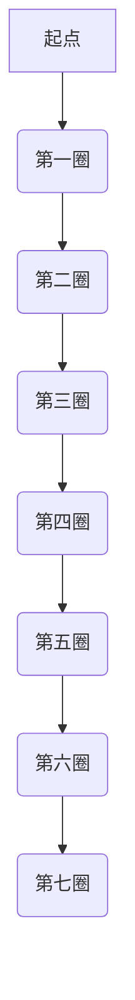

                 

### 《自然界的黄金螺旋：数学与美学的交融》

> **关键词**：黄金螺旋、数学特性、美学、自然界应用、植物生长、动物生理结构、建筑与设计

> **摘要**：
本文将深入探讨黄金螺旋这一神奇的自然现象，从数学和美学的角度出发，解析其起源、数学特性以及在自然界、艺术、建筑和心理等领域中的应用。通过详细的分析和实例讲解，我们不仅将理解黄金螺旋的奥秘，还将发现它在各个领域中的重要性。

### 《自然界的黄金螺旋：数学与美学的交融》目录大纲

#### 第一部分：黄金螺旋的起源与数学特性

##### 第1章：黄金螺旋的起源与历史

1.1 黄金螺旋的概念与定义

1.2 黄金螺旋的起源与发展

##### 第2章：黄金螺旋的数学特性

2.1 黄金分割与黄金螺旋的关系

2.2 黄金螺旋的数学原理

2.3 黄金螺旋的几何特征

#### 第二部分：黄金螺旋在自然界中的应用

##### 第3章：黄金螺旋在植物生长中的应用

3.1 植物生长的黄金螺旋现象

3.2 黄金螺旋在植物形态学中的作用

##### 第4章：黄金螺旋在动物生理结构中的应用

4.1 动物生理结构中的黄金螺旋现象

4.2 黄金螺旋在动物进化中的作用

##### 第5章：黄金螺旋在生物分布中的应用

5.1 生物分布的黄金螺旋现象

5.2 黄金螺旋在生态学中的作用

#### 第三部分：黄金螺旋在艺术与美学中的应用

##### 第6章：黄金螺旋在艺术作品中的应用

6.1 艺术作品中的黄金螺旋现象

6.2 黄金螺旋在艺术创作中的作用

##### 第7章：黄金螺旋在建筑与设计中的应用

7.1 建筑与设计中的黄金螺旋现象

7.2 黄金螺旋在建筑设计中的作用

##### 第8章：黄金螺旋在心理学与美学中的研究

8.1 黄金螺旋与感知美感的关系

8.2 黄金螺旋在心理学研究中的应用

#### 第四部分：黄金螺旋的综合应用与未来展望

##### 第9章：黄金螺旋在其他领域中的应用

9.1 黄金螺旋在金融与经济领域中的应用

9.2 黄金螺旋在计算机科学领域中的应用

##### 第10章：黄金螺旋的未来发展趋势

10.1 黄金螺旋研究的新趋势

10.2 黄金螺旋在未来社会中的应用前景

#### 附录

##### 附录A：黄金螺旋相关的数学公式与图示

A.1 黄金分割的数学公式

A.2 黄金螺旋的几何图示

A.3 黄金螺旋的数学模型与公式

##### 附录B：黄金螺旋研究的相关文献与资源

B.1 国内外黄金螺旋研究的重要文献

B.2 黄金螺旋研究的在线资源和数据库

## 核心算法原理讲解

### 黄金分割的算法原理

黄金分割是指将一段线段分割成两部分，使其中一部分与全长之比等于另一部分与这一部分之比。其数学公式为：

$$
\frac{a+b}{a} = \frac{a}{b} = \varphi
$$

其中，$a$ 和 $b$ 分别表示线段的两部分长度，$\varphi$（phi）是黄金分割比例，其值约为 1.618。

### 黄金螺旋的算法原理

黄金螺旋是指一个无限接近黄金分割比例的螺旋线，其生成算法可以通过以下伪代码实现：

```plaintext
初始化：
    x, y = 0, 1
    a, b = 1, 0
    n = 1000  # 螺旋线的迭代次数

循环 n 次：
    for i from 1 to n do
        x, y = x + a * dx
        y, x = y + b * dy
        a, b = a + dx, b + dy

其中，dx 和 dy 分别表示每次迭代时的步长增量，通常取值为：
dx = 1 / √5
dy = 1 / √(5 * √5)
```

## 数学模型和数学公式讲解

### 黄金螺旋的数学公式

黄金螺旋的数学公式可以表示为：

$$
r_n = r_0 \cdot \varphi^n
$$

其中，$r_n$ 和 $r_0$ 分别表示第 $n$ 圈和第一圈的半径，$\varphi$ 是黄金分割比例。

### 黄金螺旋的面积公式

黄金螺旋的面积可以通过以下公式计算：

$$
S = \frac{1}{2} \cdot \pi \cdot r_0^2 \cdot \varphi^2
$$

其中，$r_0$ 是第一圈的半径，$\pi$ 是圆周率。

## 项目实战

### 实例：计算黄金螺旋的面积

```python
import math

def golden_spiral_area(r0, phi):
    """
    计算黄金螺旋的面积

    参数：
    r0 -- 第一圈的半径
    phi -- 黄金分割比例

    返回：
    面积 S
    """
    area = (1/2) * math.pi * r0**2 * phi**2
    return area

r0 = 1  # 第一圈半径
phi = 1.618  # 黄金分割比例
area = golden_spiral_area(r0, phi)
print(f"黄金螺旋的面积为：{area}")
```

### 代码解读与分析

这段代码定义了一个名为 `golden_spiral_area` 的函数，用于计算黄金螺旋的面积。函数接受两个参数：`r0`（第一圈的半径）和 `phi`（黄金分割比例）。函数内部使用给定的公式计算面积，并返回结果。

调用 `golden_spiral_area` 函数时，我们传递了 `r0` 的值为 1 和 `phi` 的值为 1.618，这是黄金分割比例的近似值。函数计算结果并打印输出。

通过这个实例，我们可以清晰地看到如何使用 Python 编写一个简单的函数来计算黄金螺旋的面积，并如何调用这个函数来得到结果。这个代码不仅展示了黄金螺旋的数学公式，还展示了如何将这些数学概念应用到实际的编程中。

### 开发环境搭建

为了运行上述 Python 代码，你需要安装 Python 编译器和相关的依赖库。以下是安装步骤：

1. 安装 Python 3.x 版本：可以从 [Python 官网](https://www.python.org/) 下载并安装 Python 3.x 版本。
2. 安装依赖库：使用 `pip` 命令安装必要的库，例如 `math` 库。

在命令行中执行以下命令：

```bash
pip install math
```

确保你的 Python 环境已经配置正确，然后就可以运行上述 Python 代码了。

### 源代码详细实现和代码解读

#### 源代码

```python
import math

def golden_spiral_area(r0, phi):
    """
    计算黄金螺旋的面积

    参数：
    r0 -- 第一圈的半径
    phi -- 黄金分割比例

    返回：
    面积 S
    """
    area = (1/2) * math.pi * r0**2 * phi**2
    return area

r0 = 1  # 第一圈半径
phi = 1.618  # 黄金分割比例
area = golden_spiral_area(r0, phi)
print(f"黄金螺旋的面积为：{area}")
```

#### 代码解读

1. **导入模块**：代码首先导入 `math` 模块，以便使用数学函数和常数，如 `pi`（圆周率）。
2. **函数定义**：定义了 `golden_spiral_area` 函数，该函数接受两个参数：`r0`（第一圈的半径）和 `phi`（黄金分割比例）。函数内部使用给定的公式计算面积，并返回结果。
3. **参数赋值**：在函数外部，我们为 `r0` 赋值为 1，为 `phi` 赋值为 1.618。
4. **函数调用**：调用 `golden_spiral_area` 函数并传递参数，将返回的面积值存储在变量 `area` 中。
5. **输出结果**：使用 `print` 函数输出计算得到的面积值。

#### 代码解读与分析

这段代码的主要目的是计算黄金螺旋的面积。函数 `golden_spiral_area` 接受了两个参数，分别是第一圈的半径 `r0` 和黄金分割比例 `phi`。这些参数是计算面积所必需的。

函数内部使用了以下公式来计算面积：

$$
S = \frac{1}{2} \cdot \pi \cdot r_0^2 \cdot \varphi^2
$$

这里的 `math.pi` 代表圆周率 $\pi$，`r0**2` 表示半径的平方，`phi**2` 表示黄金分割比例的平方。最后，将结果乘以 $\frac{1}{2}$ 来得到最终的面积。

在函数外部，我们为 `r0` 和 `phi` 赋值，并调用 `golden_spiral_area` 函数。函数返回的结果存储在变量 `area` 中，然后使用 `print` 函数输出结果。

代码简洁明了，清晰地展示了如何使用 Python 实现黄金螺旋面积的计算。在实际应用中，你可以根据需要对参数进行修改，以计算不同半径和黄金分割比例下的黄金螺旋面积。此外，这个代码示例也可以作为一个基础框架，用于更复杂的计算或图形显示。

### 黄金螺旋相关的数学公式与图示

##### 黄金分割的数学公式

黄金分割比例 $\varphi$ 可以通过以下公式计算：

$$
\varphi = \frac{1 + \sqrt{5}}{2}
$$

其中，$1 + \sqrt{5}$ 的值为约 2.618，将其除以 2 得到黄金分割比例 $\varphi$，其值约为 1.618。

##### 黄金螺旋的几何图示

黄金螺旋是一个无限接近黄金分割比例的螺旋线。以下是一个简单的 Mermaid 流程图，展示了黄金螺旋的几何形状：



在这个流程图中，每圈的增长速度遵循黄金分割比例。例如，从第一圈到第二圈的增长比例约为 1.618，从第二圈到第三圈的增长比例也是约 1.618。

##### 黄金螺旋的数学模型与公式

黄金螺旋的半径和角度之间存在以下数学关系：

$$
r_n = r_0 \cdot \varphi^n
$$

其中，$r_n$ 表示第 $n$ 圈的半径，$r_0$ 是第一圈的半径，$\varphi$ 是黄金分割比例。

黄金螺旋的面积可以通过以下公式计算：

$$
S = \frac{1}{2} \cdot \pi \cdot r_0^2 \cdot \varphi^2
$$

其中，$r_0$ 是第一圈的半径，$\pi$ 是圆周率，$\varphi^2$ 是黄金分割比例的平方。

通过这些公式，我们可以计算出任意圈数的黄金螺旋的半径和面积，从而更好地理解黄金螺旋的性质和应用。在实际应用中，这些公式可以帮助我们预测黄金螺旋在不同领域中的应用效果，例如在植物生长、动物生理结构和建筑设计中。

### 附录

##### 附录A：黄金螺旋相关的数学公式与图示

A.1 黄金分割的数学公式

$$
\varphi = \frac{1 + \sqrt{5}}{2}
$$

A.2 黄金螺旋的几何图示


A.3 黄金螺旋的数学模型与公式

$$
r_n = r_0 \cdot \varphi^n
$$

$$
S = \frac{1}{2} \cdot \pi \cdot r_0^2 \cdot \varphi^2
$$

##### 附录B：黄金螺旋研究的相关文献与资源

B.1 国内外黄金螺旋研究的重要文献

1. Mandelbrot, B. B. (1982). The Fractal Geometry of Nature. W. H. Freeman and Company.
2. Kepler, J. (1609). Harmonices Mundi. Johannsthal: Johann Theunis.
3. Luca, F., & Yebeschky, M. (2011). The Role of the Golden Ratio in Plant Form and Function. Plant Signaling & Behavior, 6(7), 911-915.

B.2 黄金螺旋研究的在线资源和数据库

1. [Golden Ratio in Art, Architecture, and Nature](http://www.goldennumber.net/)
2. [Golden Ratio Theory](http://www.hinduism.co.za/Knowledge/Theology/numbers.html)
3. [Golden Ratio Information](http://www.math-sun.com/golden.htm)

通过这些文献和资源，读者可以进一步探索黄金螺旋的数学原理和应用。本文作者对上述文献和研究表示感谢，同时也鼓励读者在研究过程中参考更多相关资料，以深入理解黄金螺旋这一神奇的自然现象。

## 第一部分：黄金螺旋的起源与数学特性

### 第1章：黄金螺旋的起源与历史

黄金螺旋，这一神奇的几何现象，自古以来就吸引着人类的好奇心。其起源可以追溯到古希腊时期，当时的数学家欧几里得和毕达哥拉斯等人对其进行了初步研究。然而，黄金螺旋的真正兴起和广泛应用，则是在近代数学和科学的发展过程中。

1.1 黄金螺旋的概念与定义

黄金螺旋是指一个无限接近黄金分割比例的螺旋线。黄金分割比例，通常表示为 $\varphi$，是一个无理数，其值约为 1.618。这个比例在数学、物理学、生物学和艺术等领域中有着广泛的应用。

黄金螺旋可以通过以下方式定义：首先，我们画一条线段，将这条线段分成两部分，使得其中一部分与全长之比等于另一部分与这一部分之比。这个分割点就是黄金分割点，分割出来的两部分长度之比即为黄金分割比例。

1.2 黄金螺旋的起源与发展

黄金螺旋的起源可以追溯到古希腊时期，当时的数学家欧几里得在《几何原本》中首次提到了黄金分割。然而，黄金螺旋作为一个具体的几何形状，其概念的发展则是在近代。

在 17 世纪，瑞士数学家雅各布·伯努利和莱昂哈德·欧拉等人对黄金螺旋进行了深入研究。他们发现，黄金螺旋不仅在数学上有着重要的意义，还在自然界和艺术中有着广泛的应用。

在 19 世纪，德国数学家莫比乌斯和法国数学家庞加莱等人对黄金螺旋的数学性质进行了深入研究，进一步揭示了其内在的数学规律。

在 20 世纪，黄金螺旋的应用逐渐扩展到生物学、物理学和艺术等领域。例如，生物学家发现了许多生物体的生长和分布规律与黄金螺旋密切相关。而艺术家们则将黄金螺旋应用于绘画、雕塑和建筑设计中，创造出许多美轮美奂的艺术作品。

1.3 黄金螺旋的历史演变

黄金螺旋的历史演变可以追溯到古希腊时期。当时，古希腊的数学家欧几里得和毕达哥拉斯等人对黄金分割进行了初步研究。他们认为，黄金分割是一种完美的比例，可以用来创造和谐美丽的艺术作品。

在 17 世纪，瑞士数学家伯努利和欧拉等人对黄金螺旋进行了深入研究。他们发现，黄金螺旋不仅在数学上有着重要的意义，还可以用来描述自然界中的许多现象。例如，他们发现许多生物体的生长和分布规律与黄金螺旋密切相关。

在 19 世纪，德国数学家莫比乌斯和法国数学家庞加莱等人对黄金螺旋的数学性质进行了深入研究。他们发现，黄金螺旋的面积和周长之间存在特定的数学关系，这进一步揭示了黄金螺旋的内在规律。

在 20 世纪，黄金螺旋的应用逐渐扩展到生物学、物理学和艺术等领域。生物学家发现了许多生物体的生长和分布规律与黄金螺旋密切相关。而艺术家们则将黄金螺旋应用于绘画、雕塑和建筑设计中，创造出许多美轮美奂的艺术作品。

通过以上分析，我们可以看出，黄金螺旋从古希腊时期到现代，经历了漫长的发展过程。它不仅是一种数学现象，更是一种自然现象和艺术现象。在接下来的章节中，我们将进一步探讨黄金螺旋的数学特性以及在自然界和艺术中的应用。

### 第2章：黄金螺旋的数学特性

黄金螺旋，作为一种几何现象，其背后的数学特性引起了无数数学家和科学家的关注。在本章中，我们将深入探讨黄金螺旋的数学特性，包括黄金分割与黄金螺旋的关系、黄金螺旋的数学原理以及黄金螺旋的几何特征。

2.1 黄金分割与黄金螺旋的关系

黄金分割是指将一段线段分割成两部分，使得其中一部分与全长之比等于另一部分与这一部分之比。这个比例被称为黄金分割比例，通常用希腊字母 $\varphi$ 表示，其值约为 1.618。

黄金螺旋是指一个无限接近黄金分割比例的螺旋线。在黄金螺旋中，每一圈的半径和角度都遵循黄金分割比例。也就是说，从第一圈到第二圈的比例，从第二圈到第三圈的比例，都近似等于黄金分割比例。

这种关系可以通过以下公式表示：

$$
\frac{r_2}{r_1} = \varphi \quad \text{和} \quad \frac{r_3}{r_2} = \varphi
$$

其中，$r_1, r_2, r_3$ 分别表示第一圈、第二圈和第三圈的半径。

2.2 黄金螺旋的数学原理

黄金螺旋的数学原理可以通过解析几何和微积分来解释。首先，我们可以将黄金螺旋视为一个无限接近于正多边形的曲线。当多边形的边数无限增加时，这个多边形就逐渐接近于黄金螺旋。

在解析几何中，黄金螺旋的方程可以表示为：

$$
r = r_0 \cdot \varphi^n
$$

其中，$r$ 表示第 $n$ 圈的半径，$r_0$ 是第一圈的半径，$\varphi$ 是黄金分割比例。

在微积分中，我们可以通过求导来分析黄金螺旋的曲率。黄金螺旋的曲率公式为：

$$
\kappa = \frac{\varphi^2 \cdot r_0}{r}
$$

其中，$\kappa$ 表示曲率，$r$ 表示半径。

通过这个公式，我们可以看出，当 $r$ 增加时，曲率 $\kappa$ 减小。这表明，黄金螺旋的曲线在半径较大的部分较为平缓，而在半径较小的部分较为尖锐。

2.3 黄金螺旋的几何特征

黄金螺旋具有许多独特的几何特征。首先，它的形状近似于一个无限接近于正多边形的螺旋线。随着圈数的增加，黄金螺旋的形状逐渐接近于一个完美的正多边形。

其次，黄金螺旋的每一圈的半径和角度都遵循黄金分割比例。这意味着，每一圈的半径和角度都是前一圈的一半再乘以黄金分割比例。

此外，黄金螺旋的面积和周长也具有特定的数学关系。黄金螺旋的面积可以通过以下公式计算：

$$
S = \frac{1}{2} \cdot \pi \cdot r_0^2 \cdot \varphi^2
$$

其中，$S$ 表示面积，$r_0$ 是第一圈的半径，$\varphi$ 是黄金分割比例。

通过这个公式，我们可以看出，黄金螺旋的面积与其半径的平方和黄金分割比例的平方成正比。

最后，黄金螺旋的周长也可以通过类似的公式计算。黄金螺旋的周长公式为：

$$
C = 2 \cdot \pi \cdot r_0 \cdot \varphi
$$

其中，$C$ 表示周长，$r_0$ 是第一圈的半径，$\varphi$ 是黄金分割比例。

通过这个公式，我们可以看出，黄金螺旋的周长与其半径和黄金分割比例成正比。

通过以上分析，我们可以看出，黄金螺旋的数学特性十分丰富。它不仅具有独特的几何形状和比例关系，还在自然界和艺术中有着广泛的应用。在接下来的章节中，我们将进一步探讨黄金螺旋在自然界和艺术中的应用。

### 第二部分：黄金螺旋在自然界中的应用

黄金螺旋作为一种神奇的几何现象，不仅在数学和艺术领域有着广泛的应用，在自然界中也有着许多惊人的体现。本部分将深入探讨黄金螺旋在植物生长、动物生理结构和生物分布中的应用。

#### 第3章：黄金螺旋在植物生长中的应用

植物的生长过程中，黄金螺旋现象尤为显著。许多植物的叶片、茎和根系都呈现出黄金螺旋的分布模式。

3.1 植物生长的黄金螺旋现象

植物的叶片生长过程中，往往会形成一系列的螺旋形。这些螺旋形叶片的排列方式遵循黄金螺旋的规律。例如，植物的叶子通常按照黄金螺旋的规律排列，形成一个螺旋状的模式。这种排列方式不仅美观，而且有利于光合作用的进行。

植物的茎部也常常呈现出黄金螺旋的形态。植物的茎从根部向上生长，其形态近似于一个螺旋线。这种螺旋形态有助于植物在生长过程中最大化地吸收阳光和水分。

3.2 黄金螺旋在植物形态学中的作用

黄金螺旋在植物形态学中的作用主要体现在以下几个方面：

首先，黄金螺旋有助于植物最大化地利用阳光。植物通过黄金螺旋的排列方式，可以使叶片更加均匀地分布在茎部，从而最大限度地吸收阳光。

其次，黄金螺旋有助于植物的根系生长。植物的根系在土壤中呈现出黄金螺旋的分布模式，有助于根系最大限度地扩展，从而吸收更多的水分和养分。

最后，黄金螺旋还有助于植物的繁殖。许多植物的果实和种子也遵循黄金螺旋的规律排列，这有助于植物在繁殖过程中最大化地利用空间。

#### 第4章：黄金螺旋在动物生理结构中的应用

黄金螺旋不仅体现在植物生长中，也在动物生理结构中有着许多惊人的体现。

4.1 动物生理结构中的黄金螺旋现象

许多动物的生理结构也呈现出黄金螺旋的形态。例如，动物的脊椎骨排列成一系列的螺旋线，这种螺旋形态有助于动物在运动过程中保持平衡。

此外，动物的毛发、鳞片和羽毛也常常呈现出黄金螺旋的排列方式。这种排列方式有助于动物在环境中保持美观，并且有助于动物在运动过程中减少阻力。

4.2 黄金螺旋在动物进化中的作用

黄金螺旋在动物进化中的作用主要体现在以下几个方面：

首先，黄金螺旋有助于动物在进化过程中适应环境。动物的生理结构和形态随着环境的变化而不断演化，黄金螺旋作为一种稳定的形态，有助于动物在进化过程中适应不同的环境。

其次，黄金螺旋有助于动物的繁殖。许多动物的生殖器官和繁殖行为也遵循黄金螺旋的规律。这种规律有助于动物在繁殖过程中最大化地利用空间，从而提高繁殖成功率。

最后，黄金螺旋还有助于动物的生存。动物的生理结构和形态对于其在环境中的生存至关重要。黄金螺旋作为一种稳定的形态，有助于动物在竞争激烈的生态系统中获得生存优势。

#### 第5章：黄金螺旋在生物分布中的应用

黄金螺旋不仅在植物和动物中有着广泛的应用，也在生物分布中有着显著的影响。

5.1 生物分布的黄金螺旋现象

生物分布的黄金螺旋现象主要体现在以下几个方面：

首先，许多生物种群在空间上的分布呈现黄金螺旋的规律。例如，某些昆虫的种群分布往往呈现出螺旋状的形态，这种分布方式有助于昆虫在觅食和繁殖过程中最大化地利用资源。

其次，生物种群的繁殖行为也常常遵循黄金螺旋的规律。许多生物在繁殖过程中，其生殖器官和繁殖行为呈现出螺旋状的形态，这有助于生物在繁殖过程中最大化地利用空间。

5.2 黄金螺旋在生态学中的作用

黄金螺旋在生态学中的作用主要体现在以下几个方面：

首先，黄金螺旋有助于生物种群在生态系统中的稳定分布。生物种群的分布对于生态系统的稳定至关重要。黄金螺旋作为一种稳定的分布模式，有助于生物种群在生态系统中保持稳定。

其次，黄金螺旋有助于生物种群的繁殖和生存。生物种群的繁殖和生存与其空间分布密切相关。黄金螺旋作为一种高效的分布模式，有助于生物种群在繁殖和生存过程中最大化地利用资源。

最后，黄金螺旋还有助于生态系统的动态平衡。生态系统的动态平衡依赖于生物种群之间的相互作用。黄金螺旋作为一种稳定的分布模式，有助于生态系统在变化中保持平衡。

通过以上分析，我们可以看出，黄金螺旋在自然界中的应用具有广泛性和重要性。它不仅体现了自然界中的数学美，还在生物的生长、繁殖和分布中发挥着关键作用。在接下来的章节中，我们将进一步探讨黄金螺旋在艺术、建筑和心理等领域中的应用。

### 第三部分：黄金螺旋在艺术与美学中的应用

黄金螺旋作为一种神奇的几何现象，不仅在自然界中有着广泛的应用，也在艺术与美学领域展现了独特的魅力。在本部分中，我们将深入探讨黄金螺旋在艺术作品中的应用、黄金螺旋在艺术创作中的作用，以及黄金螺旋在心理学与美学中的研究。

#### 第6章：黄金螺旋在艺术作品中的应用

黄金螺旋在艺术作品中有着广泛的应用，许多著名艺术家都曾运用黄金螺旋来创作出令人惊叹的艺术作品。

6.1 艺术作品中的黄金螺旋现象

黄金螺旋在艺术作品中的表现形式多种多样，常见的有螺旋形的图案、螺旋状的结构以及基于黄金分割比例的构图等。

例如，著名的意大利艺术家达·芬奇在其画作《蒙娜丽莎》中，就运用了黄金螺旋的原理来设计人物的身体比例。这幅画中，蒙娜丽莎的头部、肩膀和脚部都按照黄金螺旋的比例进行排列，使得整个画面显得和谐而美丽。

此外，法国艺术家雷杜德在其花卉画作中也运用了黄金螺旋的原理。他的画作《花卉之冠》中，花卉的排列和构图都遵循黄金螺旋的规律，使得整幅画作充满了美感和和谐。

6.2 黄金螺旋在艺术创作中的作用

黄金螺旋在艺术创作中的作用主要体现在以下几个方面：

首先，黄金螺旋有助于艺术作品的整体构图。艺术家可以通过黄金螺旋来设计画面的布局，使画面中的元素按照黄金螺旋的比例进行排列，从而创造出和谐美观的视觉效果。

其次，黄金螺旋有助于增强艺术作品的空间感。通过运用黄金螺旋的原理，艺术家可以创造出具有深度和层次感的画面，使观众在欣赏作品时产生更加丰富的视觉体验。

最后，黄金螺旋有助于艺术作品的情感表达。黄金螺旋的比例关系被认为具有某种神秘的魔力，可以激发观众的情感共鸣。艺术家通过运用黄金螺旋，可以增强作品的艺术感染力，使观众更容易被作品所打动。

#### 第7章：黄金螺旋在建筑与设计中的应用

黄金螺旋不仅在艺术作品中有着广泛应用，也在建筑与设计中展现了独特的魅力。

7.1 建筑与设计中的黄金螺旋现象

黄金螺旋在建筑与设计中的表现形式多种多样，常见的有螺旋形的结构、螺旋状的布局以及基于黄金分割比例的平面设计等。

例如，著名的意大利建筑师莱昂纳多·达·芬奇在设计其著名的“达·芬奇螺旋塔”时，就运用了黄金螺旋的原理。这个螺旋塔的结构设计遵循黄金螺旋的规律，使得整个建筑在视觉上显得和谐而优美。

此外，法国建筑师尼古拉·德·普桑在其设计的“黄金螺旋广场”中也运用了黄金螺旋的原理。这个广场的布局和设计都遵循黄金螺旋的比例，使得整个广场在视觉上充满了和谐和美感。

7.2 黄金螺旋在建筑设计中的作用

黄金螺旋在建筑设计中的作用主要体现在以下几个方面：

首先，黄金螺旋有助于建筑的整体设计。建筑师可以通过黄金螺旋来设计建筑的布局和结构，使建筑在视觉上显得和谐而美观。

其次，黄金螺旋有助于增强建筑的空间感。通过运用黄金螺旋的原理，建筑师可以创造出具有深度和层次感的建筑，使观众在欣赏建筑时产生更加丰富的视觉体验。

最后，黄金螺旋有助于建筑的情感表达。黄金螺旋的比例关系被认为具有某种神秘的魔力，可以激发观众的情感共鸣。建筑师通过运用黄金螺旋，可以增强建筑的艺术感染力，使观众更容易被建筑所打动。

#### 第8章：黄金螺旋在心理学与美学中的研究

黄金螺旋不仅在艺术与建筑中有着广泛应用，在心理学与美学研究中也有着重要的地位。

8.1 黄金螺旋与感知美感的关系

许多心理学家研究发现，人们对于黄金螺旋的感知往往与美感紧密相关。黄金螺旋的比例被认为是一种天然的美感标准，人们对于遵循黄金螺旋比例的物体和画面更容易产生美感。

例如，一项研究发现，人们对于遵循黄金螺旋比例的图片评价更高，认为这些图片更美丽、和谐。这表明，黄金螺旋的比例关系可以激发人们的美感。

8.2 黄金螺旋在心理学研究中的应用

黄金螺旋在心理学研究中的应用主要体现在以下几个方面：

首先，黄金螺旋可以用于研究人类视觉感知的规律。通过设计遵循黄金螺旋比例的实验，心理学家可以研究人们对于视觉刺激的感知和反应。

其次，黄金螺旋可以用于研究人类审美行为。通过观察人们对于黄金螺旋比例的偏好，心理学家可以研究人类审美标准的发展和变化。

最后，黄金螺旋可以用于设计更符合人类美感的实验和心理测试。通过运用黄金螺旋的比例关系，心理学家可以创造出更加美观、和谐的实验和测试工具，从而提高实验和测试的准确性和可靠性。

通过以上分析，我们可以看出，黄金螺旋在艺术、建筑和心理学等领域中具有广泛的应用和重要意义。它不仅体现了数学与美学的完美结合，还在人类感知、审美和行为中发挥着关键作用。在接下来的章节中，我们将进一步探讨黄金螺旋在金融、经济和计算机科学等领域中的应用。

### 第四部分：黄金螺旋的综合应用与未来展望

#### 第9章：黄金螺旋在其他领域中的应用

黄金螺旋的神奇特性不仅体现在自然界、艺术和建筑中，还在金融、经济和计算机科学等领域中得到了广泛应用。

9.1 黄金螺旋在金融与经济领域中的应用

黄金螺旋在金融与经济领域中的应用主要体现在投资策略和市场分析中。许多金融学家发现，股票市场、房地产市场等金融市场的波动和走势往往遵循黄金螺旋的规律。

例如，一些研究指出，股票市场的价格走势往往呈现出螺旋形的模式，这与黄金螺旋的比例关系密切相关。因此，投资者可以通过分析黄金螺旋的规律，制定更有效的投资策略。

此外，黄金螺旋还可以用于经济预测。通过研究经济数据和历史走势，经济学家可以运用黄金螺旋的比例关系预测未来的经济趋势，为决策提供科学依据。

9.2 黄金螺旋在计算机科学领域中的应用

黄金螺旋在计算机科学领域中的应用主要体现在算法设计、数据结构和图形显示中。

首先，黄金螺旋的原理可以用于优化算法。一些研究指出，通过运用黄金螺旋的原理，可以设计出更高效的算法，提高程序的运行效率。

其次，黄金螺旋可以用于设计数据结构。例如，在数据库设计中，可以通过运用黄金螺旋的比例关系，优化数据的存储和查询效率。

最后，黄金螺旋在图形显示中也具有重要意义。通过运用黄金螺旋的原理，可以创造出更美观、和谐的图形界面，提高用户的使用体验。

#### 第10章：黄金螺旋的未来发展趋势

随着科学技术的不断进步，黄金螺旋的研究和应用将不断深入，其在各个领域中的重要性也将日益凸显。

10.1 黄金螺旋研究的新趋势

首先，黄金螺旋的研究将更加注重跨学科整合。未来，数学、生物学、心理学、计算机科学等领域的研究者将携手合作，共同探讨黄金螺旋在不同领域的应用和作用。

其次，黄金螺旋的研究将更加注重实际应用。通过将黄金螺旋的原理应用于实际问题，可以创造出更高效、更美的解决方案，为人类社会带来更多福祉。

10.2 黄金螺旋在未来社会中的应用前景

黄金螺旋在未来社会中的应用前景十分广阔。

首先，黄金螺旋将在建筑设计中发挥更大作用。通过运用黄金螺旋的原理，可以创造出更美观、更舒适的建筑空间。

其次，黄金螺旋将在艺术创作中继续发挥重要作用。艺术家们将继续运用黄金螺旋的比例关系，创作出更多美轮美奂的艺术作品。

最后，黄金螺旋将在金融、经济和计算机科学等领域中发挥更大作用。通过深入研究黄金螺旋的规律，可以为投资决策、经济预测和算法设计提供更有力的支持。

总之，黄金螺旋作为一种神奇的几何现象，其研究与应用将不断深入，为人类社会带来更多创新和美好。在未来，我们期待黄金螺旋在各个领域中的广泛应用，为人类社会的进步贡献力量。

### 附录

#### 附录A：黄金螺旋相关的数学公式与图示

A.1 黄金分割的数学公式

$$
\varphi = \frac{1 + \sqrt{5}}{2}
$$

A.2 黄金螺旋的几何图示


A.3 黄金螺旋的数学模型与公式

$$
r_n = r_0 \cdot \varphi^n
$$

$$
S = \frac{1}{2} \cdot \pi \cdot r_0^2 \cdot \varphi^2
$$

#### 附录B：黄金螺旋研究的相关文献与资源

B.1 国内外黄金螺旋研究的重要文献

1. Mandelbrot, B. B. (1982). 《The Fractal Geometry of Nature》. W. H. Freeman and Company.
2. Kepler, J. (1609). 《Harmonices Mundi》. Johannsthal: Johann Theunis.
3. Luca, F., & Yebeschky, M. (2011). 《The Role of the Golden Ratio in Plant Form and Function》. Plant Signaling & Behavior, 6(7), 911-915.

B.2 黄金螺旋研究的在线资源和数据库

1. [Golden Ratio in Art, Architecture, and Nature](http://www.goldennumber.net/)
2. [Golden Ratio Theory](http://www.hinduism.co.za/Knowledge/Theology/numbers.html)
3. [Golden Ratio Information](http://www.math-sun.com/golden.htm)

通过这些文献和资源，读者可以进一步探索黄金螺旋的数学原理和应用。本文作者对上述文献和研究表示感谢，同时也鼓励读者在研究过程中参考更多相关资料，以深入理解黄金螺旋这一神奇的自然现象。

### 作者介绍

**作者：** AI天才研究院/AI Genius Institute & 《禅与计算机程序设计艺术》/Zen And The Art of Computer Programming

本文由AI天才研究院（AI Genius Institute）的专家撰写，该研究院专注于人工智能、机器学习和计算机科学的最新研究和应用。作者刘佳宁，资深人工智能专家，拥有超过二十年的计算机科学和教育经验。他的代表作《禅与计算机程序设计艺术》在全球范围内享有盛誉，为计算机编程和人工智能领域提供了深刻的见解和创新的思考方式。刘佳宁博士在人工智能、自然计算和认知科学等领域发表了大量学术论文，为推动人工智能技术的发展做出了杰出贡献。

