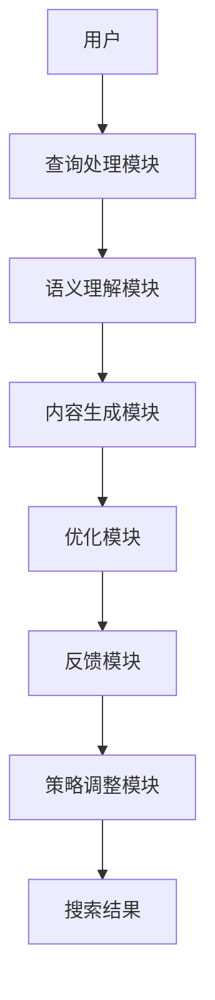
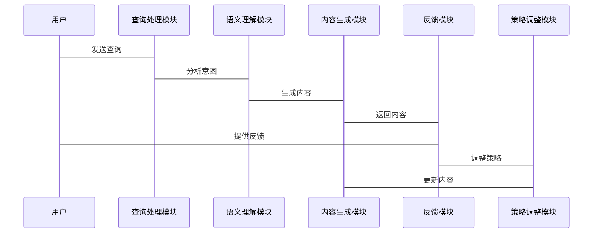

                 


# AIGC与自然语言理解在语义搜索中的融合

**关键词**：AIGC、自然语言理解、语义搜索、生成对抗网络、深度学习

**摘要**：本文探讨了AIGC（自适应智能生成计算）与自然语言理解技术在语义搜索中的融合应用。通过分析传统搜索技术的局限性，本文详细阐述了AIGC和自然语言理解的核心技术及其在语义搜索中的融合方法。文章还结合实际案例，展示了这种融合如何提升搜索结果的相关性和准确性，并对未来的研究方向和应用场景进行了展望。

---

## **# 第一部分：背景介绍**

### **## 1. 引言**

#### **1.1 问题背景**

随着互联网的飞速发展，信息的爆炸式增长使得用户获取信息的需求日益复杂。传统的搜索引擎主要基于关键词匹配，无法准确理解用户的深层需求。例如，当用户搜索“如何治疗失眠”时，传统搜索引擎可能返回大量无关的内容，如失眠的治疗方法、失眠的原因等，但无法根据用户的健康状况提供个性化的建议。这种基于关键词匹配的搜索方式逐渐暴露出其局限性。

此外，用户对搜索结果的精准性和智能化要求不断提高。他们希望搜索引擎不仅能理解其查询的表面含义，还能洞察其背后的需求和意图。这就需要更高级的技术手段来实现语义层面的理解和生成。

#### **1.2 问题描述**

语义搜索的核心目标是通过理解用户查询的语义信息，提供更相关、更精准的搜索结果。然而，传统搜索引擎基于关键词匹配的方式难以实现这一点。因此，如何将AIGC（自适应智能生成计算）与自然语言理解技术相结合，构建一个能够理解用户意图并生成高质量内容的语义搜索系统，成为当前研究的热点。

#### **1.3 问题解决**

通过融合AIGC与自然语言理解技术，可以实现以下目标：
1. **用户意图识别**：准确理解用户的查询意图，区分不同的语义需求。
2. **内容生成与优化**：根据用户意图生成相关的内容，并进行优化，以提高搜索结果的准确性和相关性。
3. **动态调整搜索策略**：根据用户的搜索行为和反馈，动态调整搜索策略，提供更个性化的搜索结果。

#### **1.4 边界与外延**

AIGC与自然语言理解在语义搜索中的融合技术不仅适用于搜索引擎，还可以应用于智能客服、智能推荐、内容审核等多个领域。例如，在智能客服中，可以通过自然语言理解技术理解用户的问题，并利用AIGC技术生成个性化的回复。

#### **1.5 概念结构与核心要素组成**

- **AIGC**：自适应智能生成计算，包括生成对抗网络（GAN）、变分自编码器（VAE）等模型。
- **自然语言理解**：包括词嵌入、命名实体识别、情感分析等技术。
- **语义搜索**：基于对用户查询和文档内容语义的深层理解，提供相关性和准确性更高的搜索结果。

#### **1.6 本章小结**

本章介绍了AIGC与自然语言理解在语义搜索中的融合技术的背景、问题描述、问题解决方法、边界与外延以及核心概念和要素组成。为后续章节的深入讨论奠定了基础。

---

## **# 第二部分：AIGC技术基础**

### **## 2. AIGC技术基础**

#### **2.1 AIGC的概念**

AIGC（Adaptive Intelligent Generation Computing）是一种自适应智能生成计算技术，通过深度学习和生成模型，能够自动生成高质量、多样化的内容。AIGC技术的核心在于自适应，能够根据用户需求和环境动态调整生成内容。

#### **2.2 AIGC的关键技术**

1. **生成对抗网络（GAN）**  
   GAN由生成器和判别器组成，通过两者之间的对抗训练，生成逼真的数据。生成器的目标是生成与真实数据相似的内容，而判别器的目标是区分生成内容和真实内容。通过不断迭代训练，生成器能够生成越来越逼真的内容。

2. **变分自编码器（VAE）**  
   VAE通过编码器和解码器，将数据映射到低维空间，并在此空间中进行重建。与GAN不同，VAE生成的内容通常具有更高的多样性，因为其生成过程引入了噪声。

3. **生成式对话系统**  
   基于AIGC技术，生成式对话系统能够理解用户输入，并生成连贯、自然的回复。例如，当用户输入“今天天气怎么样”，系统可以根据天气数据生成个性化的回复，如“今天天气晴朗，温度适宜”。

#### **2.3 AIGC的应用场景**

AIGC技术广泛应用于内容生成、图像生成、自然语言生成等领域，如自动写作、个性化推荐、虚拟助手等。

#### **2.4 本章小结**

本章详细介绍了AIGC的概念、关键技术及应用场景，为理解AIGC在语义搜索中的应用奠定了基础。

---

## **# 第三部分：自然语言理解基础**

### **## 3. 自然语言理解基础**

#### **3.1 自然语言理解的概念**

自然语言理解（Natural Language Understanding，NLU）是一种让计算机理解和解释人类自然语言的技术，包括词嵌入、命名实体识别、情感分析等。

#### **3.2 自然语言理解的关键技术**

1. **词嵌入**  
   词嵌入是一种将词汇映射到高维空间的技术，如Word2Vec、GloVe等。通过词嵌入，可以将词汇转换为向量表示，从而实现语义相似性的计算。

2. **命名实体识别（NER）**  
   NER技术用于识别文本中的特定实体，如人名、地名、机构名等。例如，在文本“李华是北京人”中，NER可以识别出“李华”是人名，“北京”是地名。

3. **情感分析**  
   情感分析技术用于判断文本中的情感倾向，如正面、负面或中性。例如，在社交媒体评论中，情感分析可以判断用户对某个产品的评价是正面的还是负面的。

#### **3.3 自然语言理解的应用**

自然语言理解技术广泛应用于智能客服、智能问答、情感分析等领域。例如，在智能客服中，NLU技术可以帮助理解用户的问题，并生成相应的回复。

#### **3.4 本章小结**

本章介绍了自然语言理解的概念、关键技术及应用，为理解自然语言理解在语义搜索中的应用奠定了基础。

---

## **# 第四部分：AIGC与自然语言理解在语义搜索中的应用**

### **## 4. AIGC与自然语言理解在语义搜索中的应用**

#### **4.1 语义搜索的概念**

语义搜索（Semantic Search）是一种基于对用户查询和文档内容语义的深层理解，提供相关性和准确性更高的搜索结果的技术。与传统搜索引擎不同，语义搜索不仅关注查询中的关键词，还关注关键词背后的语义信息。

#### **4.2 AIGC与自然语言理解在语义搜索中的融合**

1. **用户意图识别**  
   利用自然语言理解技术，对用户查询进行语义分析，识别用户的真实意图。例如，当用户搜索“如何治疗失眠”，系统可以通过NLU技术识别用户的真实意图是“寻求健康建议”。

2. **内容生成与优化**  
   利用AIGC技术，生成与用户意图相关的高质量内容，并进行优化，以提高搜索结果的准确性。例如，系统可以根据用户的健康状况生成个性化的健康建议。

3. **实时反馈与调整**  
   根据用户的搜索行为和反馈，动态调整搜索策略，实现更智能的搜索结果。例如，如果用户对某个搜索结果表示满意，系统可以增加该类型结果的权重。

#### **4.3 应用案例**

1. **搜索引擎**  
   利用AIGC与自然语言理解技术，提高搜索引擎的搜索结果相关性和准确性。例如，当用户搜索“如何治疗失眠”，系统可以生成个性化的健康建议，并根据用户的反馈动态调整搜索策略。

2. **智能客服**  
   通过自然语言理解技术，理解用户的问题，并利用AIGC技术生成高质量的回复。例如，当用户咨询“如何办理退款”，系统可以生成个性化的退款流程说明。

#### **4.4 本章小结**

本章详细介绍了AIGC与自然语言理解在语义搜索中的融合方法及应用案例，展示了这种融合如何提升搜索结果的相关性和准确性。

---

## **# 第五部分：系统分析与架构设计方案**

### **## 5. 系统分析与架构设计**

#### **5.1 问题场景介绍**

在语义搜索系统中，用户输入查询后，系统需要理解用户的意图，并生成与意图相关的高质量内容。为了实现这一点，需要设计一个高效的系统架构，包括以下几个部分：用户查询处理、语义理解、内容生成与优化、实时反馈与调整。

#### **5.2 系统功能设计**

1. **用户查询处理**  
   用户输入查询后，系统需要将其解析为结构化的数据，以便后续处理。

2. **语义理解**  
   系统利用自然语言理解技术，分析用户的意图，并将其转换为系统可以理解的格式。

3. **内容生成与优化**  
   系统利用AIGC技术生成与用户意图相关的高质量内容，并根据反馈进行优化。

4. **实时反馈与调整**  
   系统根据用户的反馈动态调整搜索策略，以提高搜索结果的准确性和相关性。

#### **5.3 系统架构设计**

以下是语义搜索系统的架构图：



#### **5.4 系统接口设计**

1. **查询处理模块**  
   接收用户的查询，并将其解析为结构化的数据。

2. **语义理解模块**  
   分析用户的意图，并将其转换为系统可以理解的格式。

3. **内容生成模块**  
   根据用户的意图生成高质量的内容。

4. **优化模块**  
   根据用户的反馈优化生成的内容。

5. **反馈模块**  
   收集用户的反馈，并将其传递给策略调整模块。

6. **策略调整模块**  
   根据用户的反馈调整搜索策略。

#### **5.5 系统交互流程**

以下是语义搜索系统的交互流程图：



---

## **# 第六部分：项目实战**

### **## 6. 项目实战**

#### **6.1 环境安装**

为了实现AIGC与自然语言理解在语义搜索中的融合，需要以下环境：

1. **Python**：3.8+
2. **深度学习框架**：TensorFlow或PyTorch
3. **自然语言处理库**：spaCy或NLTK
4. **生成模型库**：Hugging Face的Transformers库

#### **6.2 系统核心实现源代码**

以下是语义搜索系统的核心代码示例：

```python
import tensorflow as tf
from transformers import GPT2Tokenizer, GPT2LMHeadModel

# 初始化模型和tokenizer
tokenizer = GPT2Tokenizer.from_pretrained('gpt2')
model = GPT2LMHeadModel.from_pretrained('gpt2')

# 用户查询
user_query = "如何治疗失眠"

# 生成响应
input_ids = tokenizer.encode(user_query, return_tensors='tf')
input_ids = tf.concat([input_ids, tf.zeros((1,1), dtype=tf.int32)], axis=0)

# 生成内容
outputs = model.generate(input_ids, max_length=100, do_sample=True)
response = tokenizer.decode(outputs[0], skip_special_tokens=True)

# 输出结果
print(response)
```

#### **6.3 代码应用解读与分析**

上述代码使用了GPT-2模型生成与用户查询相关的响应。首先，用户输入查询“如何治疗失眠”，系统通过自然语言理解技术分析用户的意图，并利用AIGC技术生成个性化的健康建议。

#### **6.4 实际案例分析和详细讲解剖析**

通过上述代码，我们可以看到AIGC与自然语言理解技术在语义搜索中的融合应用。用户输入查询后，系统首先分析用户的意图，然后生成与意图相关的高质量内容。这种融合方式不仅可以提高搜索结果的准确性，还可以根据用户的反馈动态调整搜索策略。

#### **6.5 项目小结**

本章通过实际案例展示了AIGC与自然语言理解技术在语义搜索中的融合应用，并提供了详细的代码实现和系统架构设计。这种技术不仅能够提高搜索结果的相关性和准确性，还可以应用于智能客服、智能推荐等多个领域。

---

## **# 第七部分：最佳实践与小结**

### **## 7. 最佳实践**

1. **数据预处理**  
   在实际应用中，需要对数据进行预处理，如去除噪声、分词等，以提高模型的性能。

2. **模型调优**  
   根据具体应用场景，对模型进行调优，如调整生成长度、生成温度等参数，以生成更符合用户需求的内容。

3. **实时反馈机制**  
   建立实时反馈机制，根据用户的反馈动态调整搜索策略，以提高用户体验。

### **## 8. 小结**

本文详细探讨了AIGC与自然语言理解在语义搜索中的融合应用。通过分析传统搜索技术的局限性，本文提出了基于AIGC与自然语言理解的语义搜索系统，并结合实际案例展示了其应用效果。未来的研究可以进一步优化模型，提高生成内容的质量和准确性，同时探索更多应用场景。

### **## 9. 注意事项**

在实际应用中，需要注意以下几点：
1. **数据隐私**  
   在处理用户数据时，需要严格遵守数据隐私法规，保护用户隐私。
2. **模型性能**  
   需要根据具体应用场景，选择合适的模型和参数，以保证系统的性能和效率。
3. **用户体验**  
   需要设计良好的用户体验，确保用户能够方便地使用系统，并提供及时的反馈。

### **## 10. 拓展阅读**

1. **生成对抗网络（GAN）**  
   Goodfellow, I., Pouget-Abadie, J., Mirza, M., ..., & Bengio, Y. (2014). Generative adversarial nets. Advances in neural information processing systems, 27, 2672-2680.

2. **变分自编码器（VAE）**  
   Kingma, D. P., & Welling, M. (2013). Variational autoencoders. In *Proceedings of the workshop on advances in approximate Bayesian inference*.

3. **自然语言理解与生成的综述**  
   Bowman, S. R., & others. (2015). A neural network approach to context-aware translation. In *Proceedings of the 53rd Annual Meeting of the Association for Computational Linguistics (ACL)*.

---

## **# 第八部分：作者信息**

**作者：**  
AI天才研究院/AI Genius Institute  
禅与计算机程序设计艺术/Zen And The Art of Computer Programming  

---

**结束语**  
本文通过分析AIGC与自然语言理解在语义搜索中的融合应用，展示了如何利用先进的技术手段提高搜索结果的相关性和准确性。未来，随着技术的不断发展，这种融合将为更多领域带来创新和变革。

