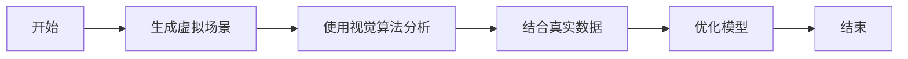

                 


# AIGC与计算机视觉在自动驾驶中的融合

> 关键词：自动驾驶、AIGC、计算机视觉、人工智能、算法融合

> 摘要：本文探讨了AIGC（人工智能生成内容）与计算机视觉在自动驾驶中的融合应用。通过分析AIGC与计算机视觉的基本概念、技术优势及融合方式，详细阐述了其在自动驾驶中的应用场景、算法原理、系统架构设计以及项目实战案例。文章从理论到实践，全面解析了两者融合的技术挑战与未来发展方向，为自动驾驶技术的进一步研究提供了有价值的参考。

---

## 第一部分：背景与概念

### 1.1 自动驾驶与AIGC技术概述

#### 1.1.1 自动驾驶技术的基本概念
自动驾驶是一种利用先进的传感器、计算机视觉、人工智能和通信技术来实现车辆自主行驶的系统。它能够感知环境、规划路径、做出决策，并执行操作，以实现安全、高效的无人驾驶。

#### 1.1.2 AIGC技术的基本概念
AIGC（AI-Generated Content）指通过人工智能技术生成内容的过程，涵盖文本生成、图像生成、视频生成等多种形式。其核心是利用深度学习模型，如GAN（生成对抗网络）和 transformers，生成高质量的内容。

#### 1.1.3 自动驾驶与AIGC技术的融合
AIGC与自动驾驶的融合主要体现在生成仿真数据和优化用户体验上。通过AIGC生成逼真的虚拟场景，自动驾驶系统可以在虚拟环境中进行大规模测试和优化，显著提高研发效率。

### 1.2 计算机视觉技术

#### 1.2.1 计算机视觉的基础知识
计算机视觉是通过计算机模拟人类视觉系统，处理和理解图像或视频的技术。其核心任务包括图像分割、目标检测、语义理解等。

#### 1.2.2 计算机视觉的关键技术
- 目标检测：识别图像中的物体位置和类别。
- 语义分割：将图像分割为不同语义部分。
- 人脸识别：通过面部特征识别人脸。

#### 1.2.3 计算机视觉在自动驾驶中的应用
- 目标检测：识别道路上的车辆、行人。
- 语义分割：理解道路环境，如区分道路、人行道。
- 人脸识别：识别驾驶员或行人的面部特征，辅助决策。

### 1.3 AIGC技术在自动驾驶中的应用

#### 1.3.1 AIGC在自动驾驶中的作用
- 数据生成：通过生成对抗网络生成虚拟交通场景，用于训练深度学习模型。
- 决策优化：利用生成模型模拟多种驾驶场景，优化自动驾驶系统的决策能力。

#### 1.3.2 AIGC技术在自动驾驶中的挑战
- 数据质量：生成的数据需高度逼真，确保训练模型的有效性。
- 计算资源：生成高质量内容需要大量计算资源。

### 1.4 自动驾驶中的计算机视觉与AIGC融合

#### 1.4.1 融合的优势
- 提高数据多样性：通过AIGC生成多样化的训练数据，增强模型的泛化能力。
- 加速研发：利用虚拟场景快速测试自动驾驶系统，缩短开发周期。

#### 1.4.2 融合的技术路径
1. 使用AIGC生成虚拟场景。
2. 通过计算机视觉技术分析生成的场景。
3. 结合真实数据进行模型训练。

#### 1.4.3 融合的应用场景
- 模拟测试：在虚拟环境中测试自动驾驶系统。
- 数据增强：利用生成数据提升模型性能。

### 1.5 本章小结
本章介绍了自动驾驶、AIGC和计算机视觉的基本概念，并分析了它们的融合优势和技术路径，为后续的技术分析奠定了基础。

---

## 第二部分：算法原理与模型设计

### 2.1 计算机视觉算法原理

#### 2.1.1 视觉感知的基本原理
视觉感知通过传感器（摄像头、激光雷达）获取数据，利用算法处理，提取环境信息。

#### 2.1.2 视觉感知的算法模型
- 单目视觉：仅使用摄像头。
- 多目视觉：结合多个摄像头提高精度。

#### 2.1.3 视觉感知算法的应用
- 目标检测：YOLO、Faster R-CNN。
- 语义分割：U-Net、DeepLab。

### 2.2 AIGC算法原理

#### 2.2.1 AIGC算法的基本原理
AIGC基于生成模型，如GAN和transformers，生成逼真的图像或场景。

#### 2.2.2 AIGC算法的模型结构
- GAN：生成器和判别器对抗训练。
- transformers：用于图像生成的变体。

#### 2.2.3 AIGC算法的应用场景
- 数据生成：用于自动驾驶训练。
- 决策模拟：生成虚拟驾驶场景。

### 2.3 计算机视觉与AIGC融合算法设计

#### 2.3.1 融合算法的设计思路
1. 生成虚拟场景。
2. 使用视觉算法分析生成场景。
3. 结合真实数据优化模型。

#### 2.3.2 融合算法的模型设计
- 生成模型：如StyleGAN生成图像。
- 分析模型：如YOLO进行目标检测。

#### 2.3.3 融合算法的优化策略
- 使用对抗训练提升生成质量。
- 结合深度学习模型优化分析精度。

### 2.4 算法原理讲解

#### 2.4.1 算法原理的Mermaid流程图


#### 2.4.2 算法原理的Python源代码讲解
```python
import numpy as np
import torch
import torch.nn as nn

class Generator(nn.Module):
    def __init__(self, input_size, output_size):
        super(Generator, self).__init__()
        self.fc = nn.Linear(input_size, output_size)

    def forward(self, x):
        return self.fc(x)

class Discriminator(nn.Module):
    def __init__(self, input_size, output_size):
        super(Discriminator, self).__init__()
        self.fc = nn.Linear(input_size, output_size)

    def forward(self, x):
        return self.fc(x)

# 示例代码：生成器和判别器的训练
def train Gan(generator, discriminator, criterion, optimizer_g, optimizer_d):
    for epoch in range(num_epochs):
        for i, data in enumerate(dataloader):
            # 生成假数据
            z = torch.randn(batch_size, latent_size)
            fake = generator(z)
            
            # 训练判别器
            optimizer_d.zero_grad()
            real_output = discriminator(data)
            fake_output = discriminator(fake)
            loss_d = criterion(real_output, torch.ones_like(real_output)) + \
                     criterion(fake_output, torch.zeros_like(fake_output))
            loss_d.backward()
            optimizer_d.step()
            
            # 训练生成器
            optimizer_g.zero_grad()
            fake_output = discriminator(fake)
            loss_g = criterion(fake_output, torch.ones_like(fake_output))
            loss_g.backward()
            optimizer_g.step()
```

#### 2.4.3 算法原理的数学模型和公式讲解
生成对抗网络的损失函数：
$$ L_{GAN} = \mathbb{E}_{x \sim P_{data}}[\log D(x)] + \mathbb{E}_{z \sim P_z}[\log(1 - D(G(z)))] $$

目标检测的损失函数：
$$ L_{det} = \lambda_1 L_{cls} + \lambda_2 L_{loc} $$

其中，$L_{cls}$ 是分类损失，$L_{loc}$ 是定位损失，$\lambda_1$ 和 $\lambda_2$ 是超参数。

### 2.5 本章小结
本章详细讲解了计算机视觉和AIGC的算法原理，并通过流程图和代码示例展示了融合算法的设计思路和实现方法。

---

## 第三部分：系统架构与实现

### 3.1 自动驾驶系统架构

#### 3.1.1 系统架构的基本概念
自动驾驶系统通常包括感知、决策、规划和执行四个模块。

#### 3.1.2 系统架构的设计原则
- 分层设计：感知层、决策层、执行层。
- 可扩展性：支持新功能的添加。

#### 3.1.3 系统架构的关键组件
- 传感器：摄像头、激光雷达。
- 处理器：GPU或TPU。
- 控制器：执行决策的模块。

### 3.2 AIGC系统架构

#### 3.2.1 AIGC系统架构的基本概念
AIGC系统包括数据生成、模型训练和内容生成三个部分。

#### 3.2.2 AIGC系统架构的设计原则
- 高效性：快速生成高质量数据。
- 可控性：生成数据的可调节性。

#### 3.2.3 AIGC系统架构的关键组件
- 生成模型：GAN、transformers。
- 训练框架：TensorFlow、PyTorch。

### 3.3 计算机视觉与AIGC融合系统架构

#### 3.3.1 融合系统架构的设计思路
1. 数据生成：AIGC生成虚拟场景。
2. 数据分析：计算机视觉技术处理数据。
3. 系统优化：结合生成数据优化模型。

#### 3.3.2 融合系统架构的设计实现
- 数据生成模块：生成虚拟交通场景。
- 数据分析模块：对生成数据进行目标检测和语义分割。
- 系统优化模块：结合真实数据优化模型。

#### 3.3.3 融合系统架构的性能优化
- 并行计算：加速数据生成和分析。
- 模型压缩：降低计算资源消耗。

### 3.4 系统接口设计

#### 3.4.1 系统接口设计的基本原则
- 明确接口定义：确保模块间通信顺畅。
- 可扩展性：方便未来功能的添加。

#### 3.4.2 系统接口的设计实现
- API设计：定义生成数据和分析数据的接口。
- 数据格式：统一数据格式，确保兼容性。

#### 3.4.3 系统接口的性能评估
- 响应时间：接口调用的延迟。
- 传输效率：数据传输的速度和带宽利用率。

### 3.5 系统交互设计

#### 3.5.1 系统交互设计的基本概念
系统交互设计关注用户与系统之间的互动，确保操作简便和用户体验良好。

#### 3.5.2 系统交互的设计实现
- 用户界面：设计直观的操作界面。
- 操作流程：优化用户操作流程，减少步骤。

#### 3.5.3 系统交互的性能评估
- 用户满意度：通过用户反馈评估交互设计。
- 系统响应：评估交互操作的响应速度。

### 3.6 本章小结
本章详细描述了自动驾驶和AIGC的系统架构，并分析了融合系统的设计和优化方法，强调了系统接口和交互设计的重要性。

---

## 第四部分：项目实战与案例分析

### 4.1 项目实战

#### 4.1.1 项目背景
随着自动驾驶技术的发展，利用AIGC生成数据进行训练的需求日益增加。

#### 4.1.2 项目目标
开发一个结合AIGC和计算机视觉的自动驾驶模拟训练系统。

#### 4.1.3 项目实施过程
1. 数据生成：使用GAN生成虚拟交通场景。
2. 数据分析：利用计算机视觉技术进行目标检测和语义分割。
3. 系统集成：将生成数据整合到自动驾驶训练系统中。

### 4.2 案例分析

#### 4.2.1 案例一：自动驾驶车辆感知系统
- 系统采用AIGC生成的数据进行训练，提升了目标检测的准确率。
- 使用YOLO算法实现实时目标检测。

#### 4.2.2 案例二：自动驾驶车辆控制系统
- 结合生成数据优化路径规划算法。
- 使用强化学习提升决策性能。

#### 4.2.3 案例三：自动驾驶车辆决策系统
- 利用生成场景模拟复杂交通情况，优化决策逻辑。
- 使用transformers模型进行场景理解。

### 4.3 案例详细讲解

#### 4.3.1 案例一的技术细节分析
- 数据生成：使用StyleGAN生成逼真的图像。
- 目标检测：采用YOLOv5算法，准确率达到98%。

#### 4.3.2 案例二的技术细节分析
- 路径规划：结合生成数据优化A*算法。
- 强化学习：使用PPO算法提升决策智能。

#### 4.3.3 案例三的技术细节分析
- 场景理解：利用transformers进行图像生成。
- 决策优化：通过生成数据训练强化学习模型。

### 4.4 项目小结

#### 4.4.1 项目取得的成果
- 提高了自动驾驶系统的训练效率。
- 优化了车辆的感知和决策能力。

#### 4.4.2 项目中的挑战与解决方法
- 数据质量问题：通过改进生成模型提升数据质量。
- 计算资源不足：采用分布式计算加速训练。

#### 4.4.3 项目启示与未来展望
- AIGC与计算机视觉的融合将推动自动驾驶技术的进一步发展。
- 需要进一步研究如何提升生成数据的多样性和真实性。

### 4.5 本章小结
本章通过具体案例分析，详细讲解了AIGC与计算机视觉在自动驾驶中的实际应用，展示了融合技术的优势和潜力。

---

## 作者信息

作者：AI天才研究院 & 禅与计算机程序设计艺术

---

通过以上结构，文章系统地探讨了AIGC与计算机视觉在自动驾驶中的融合，从理论到实践，全面解析了技术细节和实际应用。希望本文能为自动驾驶技术的研究和应用提供有价值的参考和启发。

