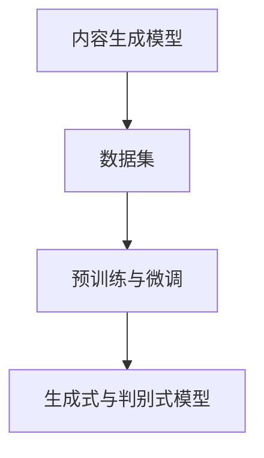
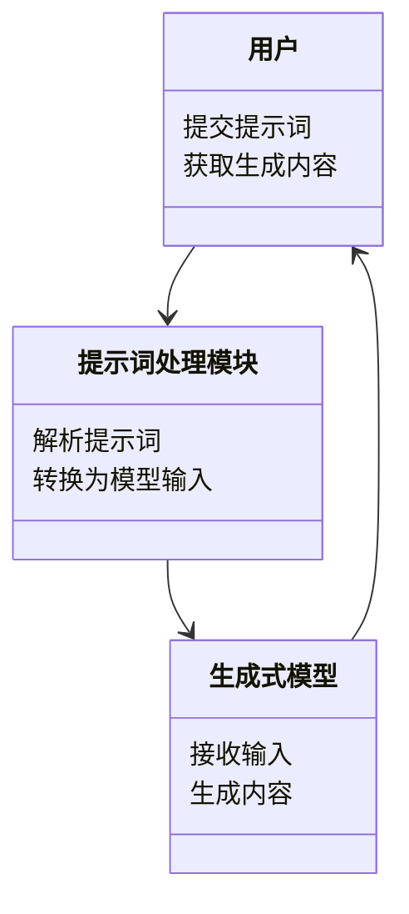
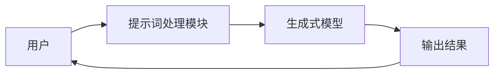
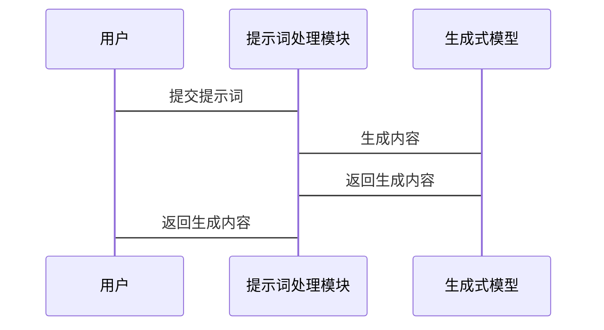

                 


# AIGC内容生成的伦理考量：提示词的责任

> 关键词：AIGC，生成式AI，提示词，伦理，内容生成

> 摘要：随着生成式AI技术的迅速发展，AIGC（AI生成内容）在各个领域中的应用日益广泛。然而，这一技术的普及也带来了一系列的伦理问题，尤其是提示词在内容生成中的责任。本文将从技术背景、核心概念、算法原理、系统架构以及实际案例等多角度，深入分析AIGC内容生成的伦理考量，重点关注提示词在其中的角色与责任。

---

## 第一部分：背景介绍

### 第1章：AIGC内容生成技术概述

#### 1.1 问题背景

##### 1.1.1 AIGC技术的发展历程

AIGC（AI Generated Content，人工智能生成内容）技术近年来取得了显著进展。从2010年代初基于规则的生成模型，到如今的大型预训练语言模型，AIGC技术经历了几个关键发展阶段：

1. **基于规则的生成模型**（2010年前）：通过预定义的规则生成简单的文本内容。
2. **统计机器学习模型**（2010-2015）：如n-gram模型和马尔可夫链，开始利用数据统计规律生成文本。
3. **深度学习模型**（2015-2020）：引入RNN、LSTM等深度学习模型，生成更复杂的文本。
4. **大模型时代**（2020至今）：以GPT系列模型为代表，通过预训练和微调技术，生成高质量的自然语言文本。

##### 1.1.2 AIGC技术的核心原理

AIGC技术的核心是生成式模型，主要基于以下原理：

- **生成式模型**：通过深度学习算法，模型能够根据输入的提示（prompt）生成新的内容。生成式模型包括变体如GAN（生成对抗网络）、VAE（变分自编码器）和Transformer架构。
  
- **预训练与微调**：生成式AI模型通常通过海量数据的预训练来学习语言模式，然后通过特定任务的数据进行微调，以适应特定领域的需求。

- **提示词的作用**：提示词是用户输入的指导性文本，用于引导AI生成特定类型的内容。提示词的设计直接影响生成内容的质量、风格和伦理合规性。

##### 1.1.3 AIGC技术在各行各业的实际应用

AIGC技术在多个领域展现了强大的应用潜力：

- **媒体与出版**：生成新闻稿、文章、广告文案等。
- **教育**：辅助教学内容生成、个性化学习材料设计。
- **医疗**：生成医疗报告、诊断建议（需谨慎处理）。
- **法律**：生成法律文件、合同初稿。
- **艺术与创意**：生成诗歌、音乐、图像等艺术作品。

#### 1.2 伦理考量的重要性

##### 1.2.1 伦理考量在技术发展中的意义

伦理考量是技术发展的重要组成部分，直接影响技术的使用价值和社会影响。对于AIGC技术，伦理问题主要集中在内容的原创性、真实性、偏见以及潜在的滥用风险等方面。

##### 1.2.2 AIGC内容生成中潜在的伦理问题

1. **内容真实性**：生成的内容可能被恶意利用，导致虚假信息的传播。
2. **版权与原创性**：生成内容的版权归属不明确，可能引发法律纠纷。
3. **偏见与歧视**：训练数据中的偏见可能被模型放大，导致生成内容带有歧视性。
4. **滥用风险**：提示词的设计可能引导生成有害内容，如暴力、仇恨言论等。

##### 1.2.3 伦理考量的社会影响与挑战

- **社会影响**：AIGC技术可能改变内容创作的模式，甚至影响就业结构。
- **技术挑战**：如何在生成内容时平衡创新性和伦理合规性是一个技术难题。
- **监管与治理**：需要建立有效的监管框架和治理机制，确保AIGC技术的健康发展。

#### 1.3 提示词的角色与责任

##### 1.3.1 提示词的作用

提示词是用户与生成式AI之间的桥梁，直接影响生成内容的方向和质量。一个有效的提示词应包含以下要素：

1. **明确性**：提示词应清晰说明生成内容的目标和要求。
2. **上下文信息**：提供足够的背景信息，帮助模型理解生成内容的语境。
3. **风格指导**：指定生成内容的语气、风格和格式。

##### 1.3.2 提示词的设计原则

- **简洁性**：提示词应简洁明了，避免冗长复杂的描述。
- **具体性**：提示词应尽可能具体，避免模糊不清的指令。
- **可控制性**：提示词应设计得当，能够有效控制生成内容的方向和范围。

##### 1.3.3 提示词的责任界定

提示词的责任主要体现在以下几个方面：

1. **内容指导责任**：提示词的设计者需确保生成内容的方向符合伦理规范。
2. **风险控制责任**：提示词应避免引导生成有害或非法内容。
3. **透明度责任**：提示词需明确告知用户生成内容的来源和限制。

#### 1.4 研究方法与框架

##### 1.4.1 研究方法的选择

本文采用以下研究方法：

1. **文献研究**：分析现有AIGC技术及其伦理问题的相关文献。
2. **案例分析**：通过实际案例探讨提示词在AIGC中的应用及其伦理影响。
3. **框架构建**：构建AIGC内容生成的伦理考量框架，明确提示词的责任。

##### 1.4.2 伦理考量框架的构建

构建一个包含以下几个层面的伦理框架：

1. **技术层面**：评估AIGC技术的生成能力及其对伦理的影响。
2. **提示词层面**：分析提示词的设计原则及其对生成内容的指导作用。
3. **社会层面**：考察AIGC技术对社会的潜在影响及伦理挑战。

##### 1.4.3 研究的重点与难点

- **重点**：探讨提示词在AIGC内容生成中的关键作用及其伦理影响。
- **难点**：如何在技术实现与伦理合规之间找到平衡点，确保AIGC技术的健康发展。

#### 1.5 本章小结

本章从技术背景、核心原理、实际应用、伦理挑战等多个方面，全面介绍了AIGC内容生成技术。特别强调了提示词在生成过程中的关键作用，并为后续章节的深入分析奠定了基础。

---

## 第二部分：核心概念与联系

### 第2章：AIGC内容生成的核心概念解析

#### 2.1 核心概念

##### 2.1.1 内容生成模型

内容生成模型是AIGC技术的核心，主要包括生成式模型和判别式模型两大类。

- **生成式模型**：通过学习数据分布，生成新的数据样本。常用模型包括RNN、LSTM、Transformer等。
- **判别式模型**：用于区分真实数据与生成数据，常用于生成模型的训练过程中（如GAN模型）。

##### 2.1.2 数据集

数据集是AIGC技术的基础，分为训练数据集和微调数据集：

- **训练数据集**：用于模型的预训练，通常包含大量多样化的真实数据。
- **微调数据集**：用于模型的针对性优化，通常包含特定领域的数据。

##### 2.1.3 预训练与微调

预训练和微调是生成式模型的两个关键阶段：

- **预训练**：模型在通用大规模数据集上进行无监督学习，掌握语言的基本模式和语义关系。
- **微调**：模型在特定任务或领域数据上进行有监督或半监督学习，提升生成内容的准确性和相关性。

##### 2.1.4 生成式与判别式模型

- **生成式模型**：直接生成新内容。
- **判别式模型**：判断内容的真实性或分类。

#### 2.2 概念属性特征对比表

以下是核心概念的对比表：

| 概念         | 特征1       | 特征2       | 特征3       |
|--------------|------------|------------|------------|
| 内容生成模型  | 生成新数据 | 基于深度学习 | 用于AIGC    |
| 数据集        | 训练数据集 | 微调数据集 | 多样化数据  |
| 预训练与微调 | 预训练     | 微调       | 提升模型性能 |
| 生成式与判别式模型 | 生成式模型 | 判别式模型 | 互补关系   |

#### 2.3 ER实体关系图架构



#### 2.4 本章小结

本章通过对比和图示，详细解析了AIGC内容生成中的核心概念，为后续的算法分析和系统设计奠定了理论基础。

---

## 第三部分：算法原理讲解

### 第3章：AIGC内容生成算法原理与流程

#### 3.1 算法原理

##### 3.1.1 生成式模型

###### 3.1.1.1 工作原理

生成式模型通过学习数据分布，生成与训练数据相似的新内容。其工作流程如下：

1. **输入处理**：接收提示词或其他输入信息。
2. **概率计算**：基于模型参数，计算生成各个可能字符的概率分布。
3. **内容生成**：根据概率分布生成最终内容。

###### 3.1.1.2 数学模型

生成式模型的数学模型通常基于概率论。例如，条件概率模型可以表示为：

$$
P(x|y) = \frac{P(y|x)P(x)}{P(y)}
$$

其中，$x$ 是生成的内容，$y$ 是提示词。

###### 3.1.1.3 举例说明

以GPT模型为例，提示词为“写一篇关于环保的文章”，模型根据提示词生成相关文本。

##### 3.1.2 判别式模型

###### 3.1.2.1 工作原理

判别式模型用于区分真实数据和生成数据。其工作流程包括：

1. **输入处理**：接收生成内容和真实内容。
2. **特征提取**：提取内容的特征向量。
3. **分类判断**：判断内容是否为生成数据。

###### 3.1.2.2 数学模型

判别式模型的数学模型通常用于计算条件概率：

$$
P(y|x) = \frac{e^{\theta^T x}}{\sum_{k=1}^K e^{\theta^T x_k}}
$$

其中，$x$ 是输入特征，$y$ 是输出类别。

###### 3.1.2.3 举例说明

以GAN模型为例，生成器生成图像，判别器判断图像是否为真实图像。

#### 3.2 流程讲解

##### 3.2.1 数据预处理

###### 3.2.1.1 数据清洗

- 移除噪声数据、重复数据和无关数据。
- 标准化和归一化处理。

###### 3.2.1.2 数据分

- 将数据集分为训练集、验证集和测试集。
- 数据增强技术，如旋转、翻转等。

---

## 系统分析与架构设计方案

### 问题场景介绍

AIGC系统需要处理多种类型的内容生成任务，包括文本生成、图像生成等。系统的用户包括内容创作者、企业用户和普通用户。

### 系统功能设计

#### 领域模型（Mermaid类图）



#### 系统架构设计（Mermaid架构图）



#### 系统接口设计

- **输入接口**：接收用户的提示词。
- **输出接口**：返回生成的内容。

#### 系统交互（Mermaid序列图）



---

## 项目实战

### 环境安装

- **Python 3.8及以上**
- **TensorFlow或PyTorch库**
- **Hugging Face Transformers库**

### 核心实现代码

```python
from transformers import GPT2LMHeadModel, GPT2Tokenizer

model_name = 'gpt2-large'
tokenizer = GPT2Tokenizer.from_pretrained(model_name)
model = GPT2LMHeadModel.from_pretrained(model_name)

def generate_content(prompt):
    inputs = tokenizer.encode(prompt, return_tensors='pt')
    outputs = model.generate(inputs, max_length=500, temperature=0.7, top_p=0.9)
    return tokenizer.decode(outputs[0], skip_special_tokens=True)

# 示例
prompt = "写一篇关于环保的文章"
print(generate_content(prompt))
```

### 代码应用解读

- **tokenizer.encode(prompt, return_tensors='pt')**：将提示词转换为模型可处理的张量。
- **model.generate(...)**：生成内容，参数包括最大长度、温度和top_p。
- **tokenizer.decode(...)**：将生成的张量转换为可读文本。

### 案例分析

提示词：“写一篇关于环保的文章”。生成内容将围绕环保主题展开，确保内容连贯且符合伦理规范。

### 项目小结

通过实际代码实现，展示了AIGC技术在提示词引导下的内容生成过程，强调了提示词在控制生成内容方向和质量中的关键作用。

---

## 最佳实践 tips

1. **明确提示词设计**：确保提示词清晰明确，避免歧义。
2. **伦理审查**：在生成内容前，进行伦理审查，避免生成有害信息。
3. **持续优化**：根据生成结果不断优化提示词，提升内容质量。
4. **用户教育**：加强对用户的教育，使其正确使用AIGC技术。

---

## 总结

AIGC内容生成技术的快速发展带来了巨大的潜力，但也伴随着伦理挑战。提示词作为生成过程中的关键要素，其设计和使用直接影响生成内容的伦理合规性。通过构建完善的伦理框架，明确提示词的责任，可以有效应对这些挑战，确保AIGC技术的健康发展。

---

## 注意事项

- **数据隐私**：在处理用户数据时，需确保数据的隐私和安全。
- **技术边界**：明确AIGC技术的适用范围，避免过度承诺。
- **法律合规**：遵守相关法律法规，确保生成内容的合法性。

---

## 拓展阅读

1. **生成式AI的数学基础**：深入理解生成式模型的数学原理。
2. **伦理AI框架**：研究现有的伦理AI框架和标准。
3. **提示词工程实践**：探索提示词在不同场景下的应用策略。

---

## 作者信息

作者：AI天才研究院/AI Genius Institute & 禅与计算机程序设计艺术 /Zen And The Art of Computer Programming

---

通过以上内容，我们详细探讨了AIGC内容生成的伦理考量，特别是提示词在其中的关键作用。希望本文能为相关领域的研究和实践提供有价值的参考和指导。

