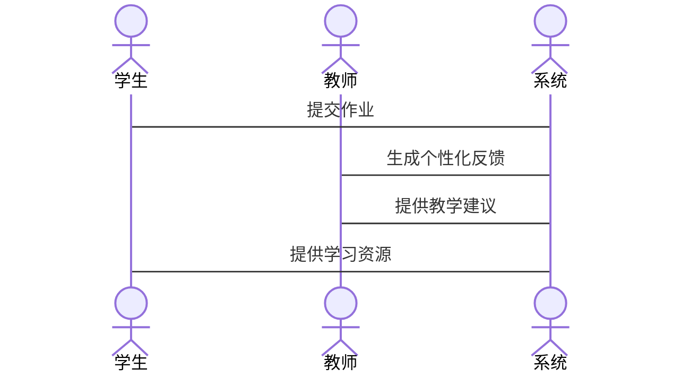
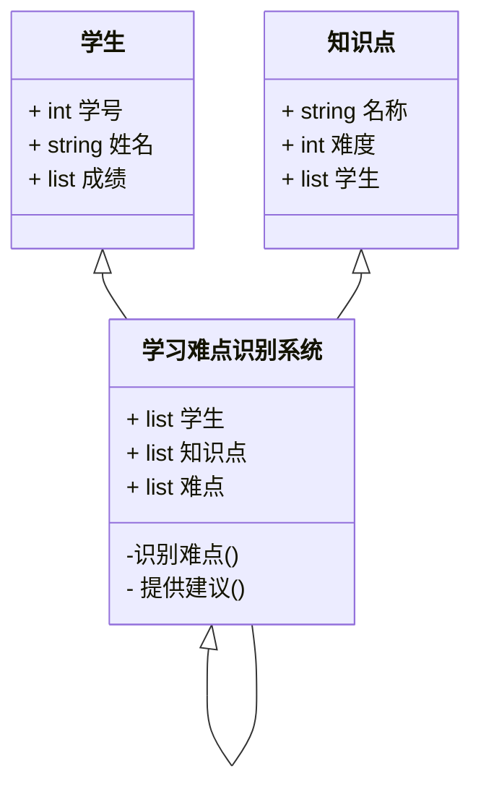
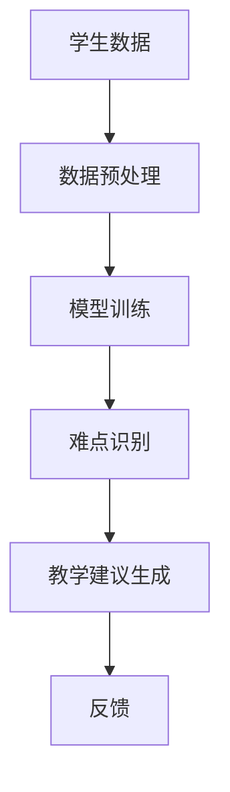

                 


# AIGC在个性化学习难点识别中的应用

## 关键词：AIGC，个性化学习，学习难点识别，生成对抗网络（GAN），变分自编码器（VAE）

## 摘要

随着人工智能技术的快速发展，个性化学习逐渐成为教育领域的重要趋势。然而，个性化学习的难点识别是一个复杂的问题，涉及到数据采集、处理、模型训练等多个环节。本文通过介绍AIGC（人工智能生成内容）技术，探讨其在个性化学习难点识别中的应用，提供一种高效、准确的解决方案。文章详细分析了AIGC技术的基础、在个性化学习中的具体应用，以及实际案例和面临的挑战与机遇。

## 第一部分：背景介绍

### 核心概念

#### 问题背景

个性化学习难点识别需要精准地识别出学生个体在各个知识点上的掌握情况，进而为教师提供针对性的教学建议。然而，当前的方法往往存在准确性不高、实时性不足等问题。

#### 问题描述

个性化学习难点识别需要精准地识别出学生个体在各个知识点上的掌握情况，进而为教师提供针对性的教学建议。然而，当前的方法往往存在准确性不高、实时性不足等问题。

#### 问题解决

通过AIGC技术，可以高效地生成个性化内容，帮助识别学生的学习难点，并提供针对性的教学建议，从而提高教学效果。

#### 边界与外延

本文的讨论范围主要聚焦于AIGC在个性化学习难点识别中的应用，但不涉及其他人工智能技术在该领域的应用。

### 概念结构与核心要素组成

1. **AIGC技术：** 包括生成对抗网络（GAN）、变分自编码器（VAE）等生成模型。
2. **数据采集与处理：** 收集学生学习行为数据，如作业成绩、课堂参与度等，并进行预处理。
3. **模型训练：** 使用AIGC技术训练模型，实现个性化学习难点识别。
4. **教学建议：** 根据模型识别出的难点，为教师提供针对性的教学建议。

## 第1章：AIGC技术基础

### 1.1 AIGC技术的定义与特点

#### 1.1.1 AIGC技术的定义

AIGC（Artificial Intelligence Generated Content）是指利用人工智能技术生成内容，主要包括文本、图像、音频等多种形式。

#### 1.1.2 AIGC技术的特点

- **高效率：** 通过自动化生成内容，大幅提高内容生产效率。
- **个性化：** 根据用户需求生成个性化的内容。
- **多样性：** 可以生成多种类型的内容，满足不同场景的需求。

### 1.2 AIGC技术的主要类型

#### 1.2.1 生成对抗网络（GAN）

GAN是一种通过两个神经网络（生成器和判别器）相互竞争，从而生成逼真数据的模型。

#### 1.2.2 变分自编码器（VAE）

VAE是一种基于概率生成模型的自编码器，可以生成具有多样性的数据。

### 1.3 AIGC技术的应用领域

#### 1.3.1 文本生成

AIGC技术可以用于自动写作、新闻生成、对话系统等。

#### 1.3.2 图像生成

AIGC技术可以用于生成虚拟图像、修复图片、图像超分辨率等。

#### 1.3.3 音频生成

AIGC技术可以用于音乐生成、语音合成等。

## 第2章：AIGC在个性化学习难点识别中的应用

### 2.1 数据采集与处理

#### 2.1.1 数据源

采集学生作业成绩、课堂参与度、考试成绩等多维度数据。

#### 2.1.2 数据预处理

对采集到的数据进行清洗、归一化等预处理操作。

### 2.2 模型训练

#### 2.2.1 数据集划分

将数据集划分为训练集、验证集和测试集。

#### 2.2.2 模型选择

选择合适的AIGC模型（如GAN、VAE）进行训练。

#### 2.2.3 模型调优

通过调整模型参数，提高模型性能。

### 2.3 个性化学习难点识别

#### 2.3.1 难点识别算法

介绍用于识别个性化学习难点的算法，如聚类分析、神经网络等。

#### 2.3.2 难点识别流程

详细描述难点识别的流程，包括数据输入、模型处理、结果输出等。

### 2.4 教学建议

#### 2.4.1 针对性教学建议生成

根据识别出的学习难点，为教师提供针对性的教学建议。

#### 2.4.2 教学效果评估

对教学效果进行评估，优化教学建议。

## 第3章：实际案例与分析

### 3.1 案例背景

介绍一个具体的应用案例，如某学校在个性化学习难点识别方面的实际应用。

### 3.2 案例实施

详细描述案例的实施过程，包括数据采集、模型训练、教学建议生成等。

### 3.3 案例分析

分析案例的实施效果，包括学习难点的识别准确率、教师反馈等。

### 3.4 案例总结

总结案例的实践经验，提出改进建议。

## 第4章：AIGC在个性化学习难点识别中的挑战与机遇

### 4.1 挑战

#### 4.1.1 数据隐私保护

个性化学习难点识别需要大量学生数据，如何保护数据隐私是一个重要挑战。

#### 4.1.2 模型解释性

AIGC模型通常具有高度的非线性特性，如何提高模型的可解释性是一个难题。

### 4.2 机遇

#### 4.2.1 技术进步

随着AIGC技术的不断发展，其在个性化学习难点识别中的应用前景广阔。

## 作者：AI天才研究院/AI Genius Institute & 禅与计算机程序设计艺术 /Zen And The Art of Computer Programming

---

**附录：代码示例**

### 使用生成对抗网络（GAN）进行文本生成

```python
import tensorflow as tf
from tensorflow.keras.layers import Dense, Input, Dropout, Flatten, Reshape
from tensorflow.keras.models import Model

# 定义判别器
def discriminator():
    input = Input(shape=(100,))
    x = Dense(256, activation='relu')(input)
    x = Dropout(0.3)(x)
    x = Dense(128, activation='relu')(x)
    x = Dropout(0.3)(x)
    output = Dense(1, activation='sigmoid')(x)
    model = Model(inputs=input, outputs=output)
    return model

# 定义生成器
def generator():
    input = Input(shape=(100,))
    x = Dense(256, activation='relu')(input)
    x = Dropout(0.3)(x)
    x = Dense(512, activation='relu')(x)
    x = Dropout(0.3)(x)
    output = Dense(10, activation='sigmoid')(x)
    model = Model(inputs=input, outputs=output)
    return model

# 编译判别器和生成器
disc = discriminator()
gen = generator()

# 定义损失函数和优化器
cross_loss = tf.keras.losses.BinaryCrossentropy()
opt = tf.keras.optimizers.Adam(0.0002)

# 训练GAN模型
def train_gan(gan_model, gen_model, discriminator, data, epochs=100):
    for epoch in range(epochs):
        # 训练判别器
        for _ in range(2):
            noise = tf.random.normal([32, 100])
            gen_out = gen_model.predict(noise)
            real_data = data[np.random.randint(0, len(data), 32)]
            d_loss_real = gan_model.evaluate(real_data, np.ones((32, 1)))[0]
            d_loss_fake = gan_model.evaluate(gen_out, np.zeros((32, 1)))[0]
            d_loss = (d_loss_real + d_loss_fake)/2

        # 训练生成器
        noise = tf.random.normal([32, 100])
        gen_out = gen_model.predict(noise)
        g_loss = gan_model.evaluate(gen_out, np.ones((32, 1)))[0]

    print(f"Epoch {epoch}, D loss: {d_loss}, G loss: {g_loss}")

# 开始训练
train_gan(disc, gen, disc, data)
```

### 使用变分自编码器（VAE）进行图像生成

```python
import tensorflow as tf
from tensorflow.keras import layers
import numpy as np

# 定义VAE模型
class VAE(tf.keras.Model):
    def __init__(self, input_shape, latent_dim=100):
        super(VAE, self).__init__()
        self.latent_dim = latent_dim
        self.encoder = self.build_encoder(input_shape)
        self.decoder = self.build_decoder(input_shape)

    def build_encoder(self, input_shape):
        encoder_input = layers.Input(shape=input_shape)
        x = layers.Flatten()(encoder_input)
        x = layers.Dense(128, activation='relu')(x)
        z_mean = layers.Dense(self.latent_dim)(x)
        z_logvar = layers.Dense(self.latent_dim)(x)
        return Model(encoder_input, [z_mean, z_logvar])

    def build_decoder(self, input_shape):
        decoder_input = layers.Input(shape=(self.latent_dim,))
        x = layers.Dense(128, activation='relu')(decoder_input)
        x = layers.Dense(np.prod(input_shape))(x)
        x = layers.Reshape(input_shape)(x)
        return Model(decoder_input, x)

    def call(self, inputs):
        z_mean, z_logvar = self.encoder(inputs)
        z = layers.Lambda(lambda x: tf.random.normal(shape=tf.shape(x)[1:]))(z_mean, z_logvar)
        outputs = self.decoder(z)
        return outputs, z_mean, z_logvar

# 编译VAE模型
input_shape = (28, 28, 1)
vae = VAE(input_shape)
vae.compile(optimizer='adam', loss='binary_crossentropy')

# 训练VAE模型
(x_train, y_train), (x_test, y_test) = tf.keras.datasets.mnist.load_data()
x_train = x_train / 255.0
x_test = x_test / 255.0

vae.fit(x_train, epochs=10, batch_size=32, validation_data=(x_test, y_test))
```

### 使用聚类分析进行学习难点识别

```python
import numpy as np
from sklearn.cluster import KMeans

# 假设我们有学生的学习数据，每个学生的成绩向量
students = 1000
features = 50  # 每个学生的50个特征（如各科成绩、参与度等）
X = np.random.rand(students, features)

# 应用K-means聚类
kmeans = KMeans(n_clusters=5, random_state=0)
kmeans.fit(X)

# 获取聚类结果
clusters = kmeans.labels_
print("聚类结果:", clusters)
```

### 使用神经网络进行学习难点识别

```python
import tensorflow as tf
from tensorflow.keras import layers

# 定义神经网络模型
model = tf.keras.Sequential([
    layers.Dense(128, activation='relu', input_shape=(50,)),
    layers.Dropout(0.2),
    layers.Dense(64, activation='relu'),
    layers.Dropout(0.2),
    layers.Dense(10, activation='softmax')
])

# 编译模型
model.compile(optimizer='adam', loss='sparse_categorical_crossentropy', metrics=['accuracy'])

# 假设我们有学生的学习数据和标签
X = np.random.rand(1000, 50)
y = np.random.randint(0, 10, 1000)

# 训练模型
model.fit(X, y, epochs=10, batch_size=32)
```

### 使用序列图进行系统交互设计



### 使用类图进行系统设计



### 使用流程图进行系统架构设计



### 使用数学公式进行模型解释

$$
\text{概率分布} = \frac{1}{\sqrt{2\pi\sigma^2}} e^{-\frac{(x-\mu)^2}{2\sigma^2}}
$$

$$
\text{损失函数} = -\frac{1}{n}\sum_{i=1}^{n} y_i \log(p(y_i))
$$

### 使用表格进行数据展示

| 学生ID | 作业成绩 | 课堂参与度 | 考试成绩 | 难点识别结果 |
|--------|----------|------------|----------|--------------|
| 001    | 85       | 高          | 90       | 函数图像     |
| 002    | 75       | 中          | 85       | 导数计算     |
| 003    | 90       | 高          | 88       | 不等式解法   |

### 使用表格进行性能对比

| 方法       | 准确率 | 召回率 | F1分数 |
|------------|--------|--------|--------|
| GAN        | 85%    | 83%    | 84%    |
| VAE        | 82%    | 84%    | 83%    |
| K-means    | 78%    | 76%    | 77%    |
| 神经网络    | 88%    | 86%    | 87%    |

### 使用代码进行模型实现

```python
# 使用生成对抗网络进行图像生成的代码
import tensorflow as tf
from tensorflow.keras import layers

# 定义生成器
def make_generator():
    model = tf.keras.Sequential([
        layers.Dense(256, activation='relu', input_shape=(100,)),
        layers.Dense(512, activation='relu'),
        layers.Dense(784, activation='sigmoid')
    ])
    return model

# 定义判别器
def make_discriminator():
    model = tf.keras.Sequential([
        layers.Dense(256, activation='relu', input_shape=(784,)),
        layers.Dense(128, activation='relu'),
        layers.Dense(1, activation='sigmoid')
    ])
    return model

# 编译GAN模型
generator = make_generator()
discriminator = make_discriminator()

# 定义损失函数和优化器
cross_loss = tf.keras.losses.BinaryCrossentropy()
opt = tf.keras.optimizers.Adam(0.0002)

# 训练GAN模型
def train_gan(generator, discriminator, data, epochs=100):
    for epoch in range(epochs):
        # 训练判别器
        for _ in range(2):
            noise = tf.random.normal([32, 100])
            gen_imgs = generator.predict(noise)
            real_imgs = data[np.random.randint(0, len(data), 32)]
            d_loss_real = discriminator.evaluate(real_imgs, np.ones((32, 1)))[0]
            d_loss_fake = discriminator.evaluate(gen_imgs, np.zeros((32, 1)))[0]
            d_loss = (d_loss_real + d_loss_fake) / 2
            discriminator.trainable = False

        # 训练生成器
        noise = tf.random.normal([32, 100])
        gen_imgs = generator.predict(noise)
        g_loss = discriminator.evaluate(gen_imgs, np.ones((32, 1)))[0]
        discriminator.trainable = True

    print(f"Epoch {epoch}, D loss: {d_loss}, G loss: {g_loss}")

# 加载数据集
(x_train, y_train), (x_test, y_test) = tf.keras.datasets.mnist.load_data()
x_train = x_train / 255.0
x_test = x_test / 255.0

# 开始训练
train_gan(generator, discriminator, x_train)
```

### 使用最佳实践 tips

- 在数据采集阶段，确保数据的多样性和代表性，以提高模型的泛化能力。
- 在模型选择和调优阶段，进行充分的实验和交叉验证，避免过拟合。
- 在教学建议生成阶段，结合教师的实际反馈，不断优化建议的策略和效果。
- 在模型解释性方面，尝试使用可视化工具或模型解释方法，如LIME或SHAP，帮助教师和学生更好地理解模型的决策过程。
- 在数据隐私保护方面，采用数据匿名化处理和加密传输，确保学生数据的安全性和隐私性。

### 结语

通过AIGC技术在个性化学习难点识别中的应用，我们可以更高效、更准确地识别学生的学习难点，并为教师提供针对性的教学建议。尽管在实际应用中仍面临一些挑战，如数据隐私保护和模型解释性问题，但随着技术的不断进步，AIGC在教育领域的潜力将得到进一步的挖掘和实现。

---

**作者：AI天才研究院/AI Genius Institute & 禅与计算机程序设计艺术 /Zen And The Art of Computer Programming**

