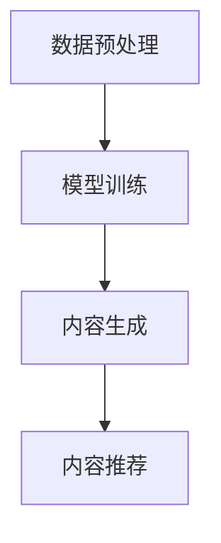
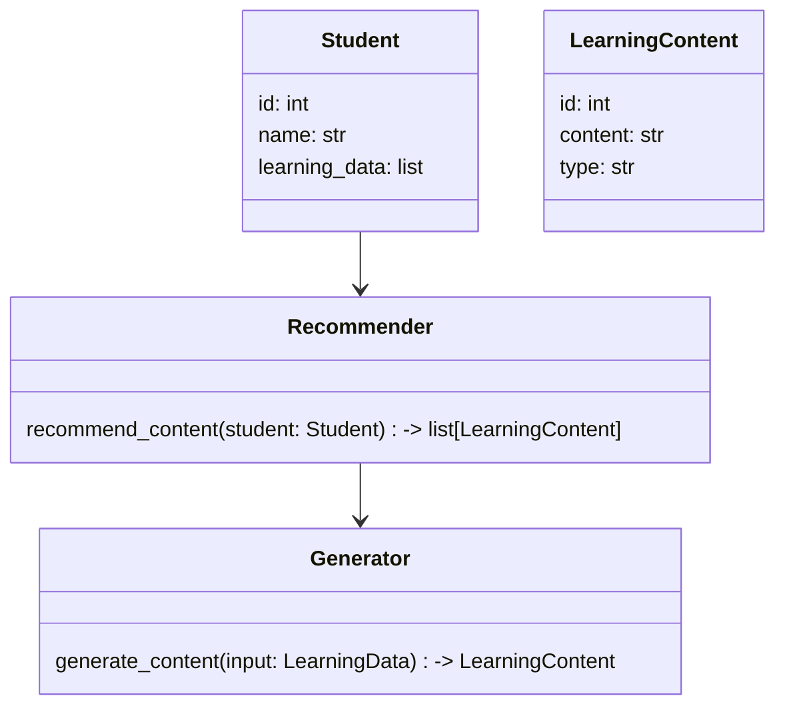
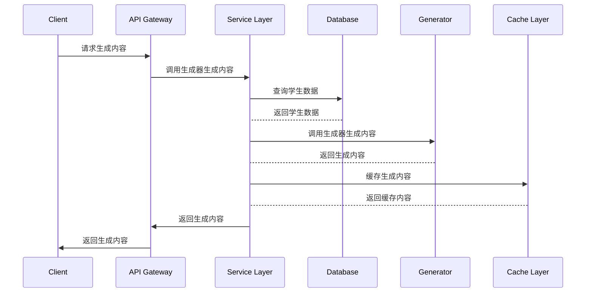

                 


```markdown
# AIGC在个性化教育课程设计中的应用

> 关键词：AIGC, 个性化教育, 人工智能生成内容, 教育课程设计, 机器学习算法

> 摘要：本文探讨了AIGC（AI-Generated Content）技术在个性化教育课程设计中的应用，详细分析了其核心概念、算法原理、系统架构、项目实现以及最佳实践。通过结合教育领域的实际需求，本文展示了如何利用人工智能技术实现个性化、高效、精准的教育内容生成与推荐，为未来的教育创新提供了新的思路。

## 第一部分: 引言

### 1.1 问题背景

随着人工智能技术的飞速发展，教育领域正经历一场深刻的变革。传统的教育模式往往以教师为中心，难以满足每个学生的个性化学习需求。尤其是在当今信息爆炸的时代，学生面对海量的学习资源，如何快速找到适合自己的学习内容成为一大挑战。

AIGC（AI-Generated Content）技术的出现，为个性化教育课程设计提供了新的可能性。通过分析学生的学习数据，AIGC能够自动生成符合学生个性化需求的学习内容，包括教材、练习题、教育游戏等。这种技术不仅可以提高学习效率，还能激发学生的学习兴趣。

### 1.2 问题描述

个性化教育课程设计的核心问题包括：

1. **如何根据学生的学习特点和需求，自动生成定制化的学习内容？**
2. **如何在海量教育资源中，快速准确地筛选出符合学生需求的内容？**
3. **如何确保生成的个性化教育内容既符合教育标准，又具有创新性和吸引力？**

### 1.3 问题解决

AIGC技术通过以下方式解决上述问题：

1. **数据分析与挖掘**：通过对学生的学习数据进行分析和挖掘，了解学生的学习特点、兴趣和需求。
2. **内容生成与优化**：利用人工智能算法，自动生成符合学生需求的个性化教育内容，并对内容进行实时优化和调整。
3. **智能推荐系统**：根据学生的学习行为和偏好，智能推荐适合的学习资源和路径。

### 1.4 边界与外延

AIGC在个性化教育课程设计中的应用，既包括对单个学生的个性化定制，也包括对整个教学群体的大数据分析与智能推荐。此外，AIGC技术还可以应用于教育游戏的开发、虚拟课堂的建设等多个方面。

### 1.5 概念结构与核心要素组成

AIGC在个性化教育课程设计中的核心概念结构包括：

- **学生数据**：学生的学习行为、成绩、兴趣等信息。
- **教育内容**：包括教材、教案、练习题、教育游戏等。
- **人工智能算法**：用于数据分析和内容生成。
- **推荐系统**：根据学生学习数据，推荐适合的学习资源和路径。

## 1.6 本章小结

本章介绍了AIGC在个性化教育课程设计中的应用背景、问题描述、问题解决方法以及相关概念结构和核心要素组成。为后续章节的深入分析奠定了基础。

---

## 第二部分: 核心概念与联系

### 2.1 核心概念原理

AIGC的核心原理在于利用人工智能算法，通过数据驱动的方式生成内容。其主要流程包括：

1. **数据收集**：收集学生的学习数据，包括学习行为、成绩、兴趣等。
2. **数据分析**：通过机器学习算法对数据进行分析，提取学生的个性化需求。
3. **内容生成**：基于分析结果，生成符合学生需求的个性化教育内容。
4. **内容优化**：根据反馈不断优化生成的内容，提高学习效果。

### 2.2 概念属性特征对比表格

以下是一个对比表格，展示了个性化教育和传统教育在核心概念上的区别：

| **属性**       | **个性化教育**                   | **传统教育**                     |
|----------------|-----------------------------------|----------------------------------|
| 教学方式       | 个性化、定制化                   | 统一化、标准化                   |
| 学习资源       | 针对性强，动态生成               | 固定教材，统一提供               |
| 教学效果       | 高效、精准                       | 可能存在一刀切的问题             |
| 技术支持       | 依赖人工智能算法                 | 依赖教师经验                     |

### 2.3 ER实体关系图

以下是一个简单的ER实体关系图，展示了个性化教育课程设计中的核心实体及其关系：

```mermaid
er
actor
student
(course) <---many-to-many--> (learning_need)
(course) <---many-to-many--> (content)
(course) <---many-to-many--> (teacher)
```

## 2.4 本章小结

本章通过对比分析和ER实体关系图，详细阐述了AIGC在个性化教育课程设计中的核心概念及其之间的关系，为后续的算法设计奠定了基础。

---

## 第三部分: 算法原理讲解

### 3.1 算法原理

AIGC的核心算法主要基于生成对抗网络（GAN）和推荐系统。以下是具体的算法流程：

1. **数据预处理**：对收集的学生数据进行清洗和特征提取。
2. **模型训练**：利用GAN生成符合学生需求的教育内容。
3. **内容推荐**：通过推荐系统，将生成的内容推荐给学生。

### 3.2 算法流程图

以下是一个简单的算法流程图：



### 3.3 算法实现代码

以下是一个基于Python的简单实现代码：

```python
import numpy as np
from tensorflow.keras import layers, Model

# 定义生成器
def build_generator():
    generator = layers.Dense(256, activation='relu')(layers.Input(shape=(100,)))
    generator = layers.Dense(512, activation='relu')(generator)
    generator = layers.Dense(1000, activation='sigmoid')(generator)
    return Model(inputs=[layers.Input(shape=(100,))], outputs=generator)

# 定义判别器
def build_discriminator():
    discriminator = layers.Dense(512, activation='relu')(layers.Input(shape=(1000,)))
    discriminator = layers.Dense(256, activation='relu')(discriminator)
    discriminator = layers.Dense(1, activation='sigmoid')(discriminator)
    return Model(inputs=[layers.Input(shape=(1000,))], outputs=discriminator)

# 初始化模型
generator = build_generator()
discriminator = build_discriminator()

# 定义损失函数
cross_loss = tf.keras.losses.BinaryCrossentropy()

# 定义优化器
generator_optimizer = tf.keras.optimizers.Adam(0.0002)
discriminator_optimizer = tf.keras.optimizers.Adam(0.0002)

# 训练过程
def train_step(real_content, generator, discriminator, generator_optimizer, discriminator_optimizer):
    # 生成假内容
    noise = tf.random.normal([real_content.shape[0], 100])
    generated_content = generator(noise)
    
    # 计算判别器的损失
    real_output = discriminator(real_content)
    generated_output = discriminator(generated_content)
    
    # 计算损失
    generator_loss = cross_loss(tf.ones_like(generated_output), generated_output)
    discriminator_loss = cross_loss(tf.ones_like(real_output), real_output) + cross_loss(tf.zeros_like(generated_output), generated_output)
    
    # 反向传播
    generator_loss = generator_loss * 0.5
    discriminator_loss = discriminator_loss * 0.5
    
    generator.trainable = True
    discriminator.trainable = False
    generator_optimizer.minimize(generator_loss, generator.trainable_weights)
    
    generator.trainable = False
    discriminator.trainable = True
    discriminator_optimizer.minimize(discriminator_loss, discriminator.trainable_weights)
    
    return generator_loss, discriminator_loss

# 实际训练
for _ in range(1000):
    real_content = # 加载实际内容数据
    loss_g, loss_d = train_step(real_content, generator, discriminator, generator_optimizer, discriminator_optimizer)
    print(f"Generator Loss: {loss_g}, Discriminator Loss: {loss_d}")
```

### 3.4 数学模型和公式

以下是一个简单的生成对抗网络的数学模型：

- **生成器**：将噪声输入转化为真实内容的概率分布。
  $$ P_{\text{generated}}(x) = G(z) $$
  其中，$z$ 是噪声向量，$G$ 是生成器模型。

- **判别器**：将真实内容与生成内容区分开。
  $$ D(x) = \text{log}(P_{\text{real}}(x)) + \text{log}(1 - P_{\text{generated}}(x)) $$

- **损失函数**：最小化生成器和判别器的损失函数。
  $$ \mathcal{L}_G = -\mathbb{E}[\text{log}(D(G(z)))] $$
  $$ \mathcal{L}_D = -\mathbb{E}[\text{log}(D(x)) + \text{log}(1 - D(G(z)))] $$

### 3.5 本章小结

本章通过详细讲解AIGC的算法原理、流程图和代码实现，展示了如何利用生成对抗网络和推荐系统实现个性化教育内容的生成与推荐。

---

## 第四部分: 系统分析与架构设计

### 4.1 问题场景介绍

本系统旨在为学生提供个性化的教育内容，包括教材、练习题、教育游戏等。系统需要处理大量的学生数据，包括学习行为、成绩、兴趣等，并通过人工智能算法生成个性化内容。

### 4.2 系统功能设计

以下是系统的功能模块：

1. **数据采集模块**：收集学生的学习数据。
2. **数据分析模块**：分析数据，提取学生的需求特征。
3. **内容生成模块**：生成符合学生需求的个性化内容。
4. **内容推荐模块**：将生成的内容推荐给学生。

### 4.3 领域模型类图

以下是一个简单的领域模型类图：



### 4.4 系统架构设计

以下是一个简单的系统架构图：


### 4.5 系统接口设计

以下是系统的主要接口：

1. **数据采集接口**：用于收集学生的学习数据。
2. **内容生成接口**：用于生成个性化内容。
3. **内容推荐接口**：用于推荐内容给学生。

### 4.6 系统交互序列图

以下是一个简单的系统交互序列图：



## 4.7 本章小结

本章通过系统分析与架构设计，展示了如何将AIGC技术应用于个性化教育课程设计中的各个模块，并详细描述了系统的功能、架构和交互流程。

---

## 第五部分: 项目实战

### 5.1 环境安装

以下是项目所需的环境安装步骤：

1. **安装Python**：确保安装了Python 3.7及以上版本。
2. **安装依赖库**：运行以下命令安装所需的依赖库：
   ```bash
   pip install numpy tensorflow keras matplotlib
   ```

### 5.2 系统核心实现源代码

以下是项目的源代码实现：

```python
import numpy as np
from tensorflow.keras import layers, Model

# 定义生成器
def build_generator():
    generator = layers.Dense(256, activation='relu')(layers.Input(shape=(100,)))
    generator = layers.Dense(512, activation='relu')(generator)
    generator = layers.Dense(1000, activation='sigmoid')(generator)
    return Model(inputs=[layers.Input(shape=(100,))], outputs=generator)

# 定义判别器
def build_discriminator():
    discriminator = layers.Dense(512, activation='relu')(layers.Input(shape=(1000,)))
    discriminator = layers.Dense(256, activation='relu')(discriminator)
    discriminator = layers.Dense(1, activation='sigmoid')(discriminator)
    return Model(inputs=[layers.Input(shape=(1000,))], outputs=discriminator)

# 初始化模型
generator = build_generator()
discriminator = build_discriminator()

# 定义损失函数
cross_loss = tf.keras.losses.BinaryCrossentropy()

# 定义优化器
generator_optimizer = tf.keras.optimizers.Adam(0.0002)
discriminator_optimizer = tf.keras.optimizers.Adam(0.0002)

# 训练过程
def train_step(real_content, generator, discriminator, generator_optimizer, discriminator_optimizer):
    # 生成假内容
    noise = tf.random.normal([real_content.shape[0], 100])
    generated_content = generator(noise)
    
    # 计算判别器的损失
    real_output = discriminator(real_content)
    generated_output = discriminator(generated_content)
    
    # 计算损失
    generator_loss = cross_loss(tf.ones_like(generated_output), generated_output)
    discriminator_loss = cross_loss(tf.ones_like(real_output), real_output) + cross_loss(tf.zeros_like(generated_output), generated_output)
    
    # 反向传播
    generator.trainable = True
    discriminator.trainable = False
    generator_optimizer.minimize(generator_loss, generator.trainable_weights)
    
    generator.trainable = False
    discriminator.trainable = True
    discriminator_optimizer.minimize(discriminator_loss, discriminator.trainable_weights)
    
    return generator_loss, discriminator_loss

# 实际训练
for _ in range(1000):
    real_content = # 加载实际内容数据
    loss_g, loss_d = train_step(real_content, generator, discriminator, generator_optimizer, discriminator_optimizer)
    print(f"Generator Loss: {loss_g}, Discriminator Loss: {loss_d}")
```

### 5.3 代码应用解读与分析

上述代码实现了一个简单的生成对抗网络模型，用于生成个性化教育内容。生成器通过输入噪声向量生成内容，判别器通过判别真实内容和生成内容来优化模型。通过反复训练，生成器能够生成越来越接近真实内容的个性化教育内容。

### 5.4 实际案例分析和详细讲解剖析

假设我们有一个学生，其学习数据表明他在数学方面有较高的兴趣，但在物理方面表现较差。系统会根据这些数据，生成适合他数学兴趣的教材和适合他物理水平的练习题。通过不断迭代优化，系统能够为他提供个性化的学习路径和资源。

### 5.5 项目小结

本章通过项目实战，展示了如何将AIGC技术应用于个性化教育课程设计中的实际案例，并详细解读了系统的实现过程和代码逻辑。

---

## 第六部分: 最佳实践

### 6.1 小结

通过本文的探讨，我们可以看到AIGC技术在个性化教育课程设计中的巨大潜力。通过数据分析、内容生成和智能推荐，AIGC能够为学生提供更加高效、精准、个性化的学习体验。

### 6.2 注意事项

1. **数据隐私**：在收集和处理学生数据时，必须注意数据隐私问题，确保符合相关法律法规。
2. **模型优化**：生成器和判别器的模型需要不断优化，以提高生成内容的质量和推荐的准确性。
3. **用户体验**：在实际应用中，需要注重用户体验设计，确保生成的内容能够吸引学生的学习兴趣。

### 6.3 拓展阅读

1. **生成对抗网络**：深入学习生成对抗网络的相关理论和应用。
2. **教育技术**：研究教育技术的最新发展和应用。
3. **机器学习算法**：进一步学习机器学习算法在教育领域的应用。

## 6.4 本章小结

本章总结了AIGC在个性化教育课程设计中的最佳实践，并提出了相关注意事项和拓展阅读建议，为读者提供了实用的指导。

---

## 结语

通过本文的详细探讨，我们可以看到AIGC技术在个性化教育课程设计中的广泛应用和巨大潜力。随着人工智能技术的不断发展，AIGC将为教育领域带来更多创新和突破。未来，我们期待看到更多基于AIGC的个性化教育解决方案，为学生提供更加高效、精准、个性化的学习体验。

---

作者：AI天才研究院/AI Genius Institute & 禅与计算机程序设计艺术 /Zen And The Art of Computer Programming
```

