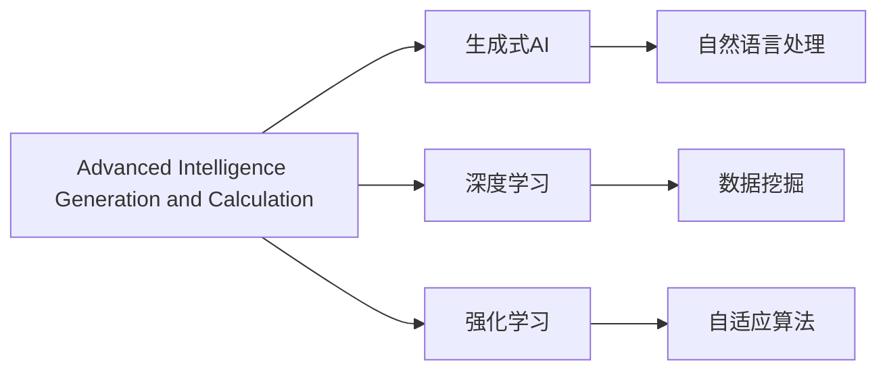
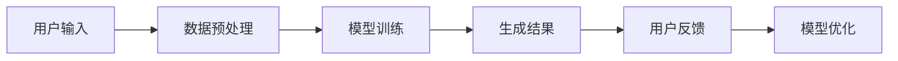
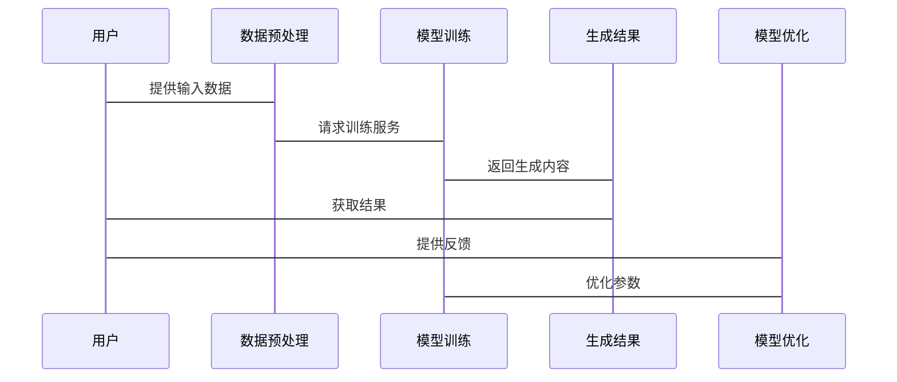

                 


# AIGC在个性化认知增强训练中的应用：优化大脑潜能开发

> 关键词：AIGC、认知增强、个性化训练、大脑潜能、机器学习、神经科学、深度学习

> 摘要：本文深入探讨了AIGC（先进生成式计算）在个性化认知增强训练中的应用，分析其如何通过优化大脑潜能开发，助力认知能力的提升。文章从AIGC的基础概念、技术原理、系统架构到实际应用案例，全面解析了其在个性化认知增强训练中的潜力与实现路径。

---

## 第一部分：AIGC基础

### 第1章：AIGC概述

#### 1.1 AIGC的定义与重要性

##### 1.1.1 AIGC的定义

AIGC（Advanced Intelligence Generation and Calculation）是一种结合了生成式AI和计算技术的综合技术，旨在通过智能化算法和大数据处理，优化人类认知能力的开发与增强。它不仅能够生成内容，还能通过数据驱动的方式，为个性化认知增强训练提供技术支持。

##### 1.1.2 AIGC的核心技术

AIGC的核心技术包括：
1. **生成式AI**：基于Transformer架构的生成模型，如GPT系列。
2. **深度学习**：通过神经网络模型处理复杂数据。
3. **强化学习**：通过试错机制优化模型性能。
4. **自然语言处理（NLP）**：理解并生成人类语言。
5. **数据挖掘与分析**：从海量数据中提取有用信息。

##### 1.1.3 AIGC的发展历程

AIGC的发展经历了以下几个阶段：
1. **早期探索阶段**：20世纪50年代至90年代，AI技术的初步研究。
2. **深度学习崛起阶段**：2010年后，深度学习技术推动了生成式AI的发展。
3. **生成式AI成熟阶段**：近年来，GPT-3、GPT-4等模型的出现，使AIGC技术趋于成熟。

#### 1.2 AIGC的核心概念与联系

##### 1.2.1 核心概念介绍

AIGC的核心概念包括：
1. **生成式模型**：能够生成新的数据或内容。
2. **自适应算法**：根据输入数据动态调整模型参数。
3. **个性化训练**：基于个体特征提供定制化服务。

##### 1.2.2 概念属性特征对比表格

| 概念         | 属性             | 特征对比 |
|--------------|------------------|----------|
| 生成式AI     | 基于Transformer   | 高效生成 |
| 自适应算法   | 动态调整参数     | 实时优化 |
| 个性化训练   | 数据驱动         | 定制化服务 |

##### 1.2.3 AIGC中的关键联系

AIGC中的关键联系可以通过以下mermaid图表示：



#### 1.3 AIGC与个性化认知增强训练的关系

##### 1.3.1 AIGC如何应用于个性化认知增强训练

AIGC通过以下方式应用于个性化认知增强训练：
1. **生成个性化训练内容**：根据用户特点生成定制化学习材料。
2. **实时反馈与优化**：通过强化学习算法，动态调整训练方案。
3. **数据分析与评估**：利用生成式AI分析用户认知数据，提供优化建议。

##### 1.3.2 个性化认知增强训练中的挑战与机遇

| 挑战         | 机遇         |
|--------------|--------------|
| 数据隐私问题 | 个性化服务   |
| 模型复杂性   | 高效训练     |

---

## 第二部分：优化大脑潜能开发

### 第3章：大脑潜能开发的基本原理

#### 3.1 脑科学与认知科学基础

##### 3.1.1 脑的基本结构

大脑的基本结构包括：
1. **大脑皮层**：负责高级认知功能。
2. **海马体**：记忆形成的关键区域。
3. **前额叶皮层**：决策与行为控制。

##### 3.1.2 认知科学核心概念

认知科学的核心概念包括：
1. **神经可塑性**：大脑结构和功能的可变性。
2. **记忆形成**：信息在大脑中的存储过程。
3. **注意力机制**：选择性关注特定信息。

##### 3.1.3 脑潜能开发的核心要素

脑潜能开发的核心要素包括：
1. **神经网络优化**：通过训练增强神经连接。
2. **认知训练**：通过任务提升认知能力。
3. **心理健康**：良好的心理状态促进潜能开发。

### 第4章：AIGC与大脑潜能开发的结合

#### 4.1 AIGC技术在大脑潜能开发中的应用

##### 4.1.1 AIGC对大脑潜能开发的潜在影响

AIGC对大脑潜能开发的潜在影响包括：
1. **个性化训练方案**：根据大脑活动数据优化训练策略。
2. **实时反馈机制**：帮助用户快速调整认知策略。
3. **数据驱动评估**：通过大数据分析评估大脑潜能开发效果。

##### 4.1.2 AIGC与大脑潜能开发的结合点

AIGC与大脑潜能开发的结合点包括：
1. **神经信号分析**：通过AIGC技术分析脑电波数据。
2. **认知训练设计**：利用AIGC生成个性化训练任务。
3. **反馈与优化**：通过AIGC提供实时反馈并优化训练方案。

### 第5章：AIGC在个性化认知增强训练中的算法原理

#### 5.1 AIGC技术的基本算法原理

##### 5.1.1 GPT模型

GPT模型是一种基于Transformer的生成式模型，其核心公式为：

$$ P(\text{下一个词}|\text{前文}) = \text{softmax}(W_{\text{out}} h_{\text{last}}) $$

其中，$h_{\text{last}}$是最后一个位置的隐藏层输出。

##### 5.1.2 BERT模型

BERT模型是一种基于Transformer的预训练语言模型，其核心公式为：

$$ \text{loss} = -\frac{1}{L} \sum_{i=1}^{L} \text{CE}(y_i, \hat{y}_i) $$

其中，$L$是遮蔽词的数量，$\text{CE}$是交叉熵损失函数。

##### 5.1.3 其他相关模型

其他相关模型包括：
1. **BERT**：文本理解模型。
2. **GPT**：文本生成模型。
3. **T5**：文本到文本模型。

#### 5.2 AIGC在个性化认知增强训练中的数学模型与公式

##### 5.2.1 数学模型介绍

个性化认知增强训练的数学模型可以表示为：

$$ f(x) = \theta \cdot x + b $$

其中，$\theta$是模型参数，$b$是偏置项。

##### 5.2.2 公式讲解

通过上述公式，我们可以看到，个性化认知增强训练的核心在于通过优化$\theta$和$b$，使模型能够准确预测用户的认知状态。

##### 5.2.3 举例说明

例如，假设用户的学习状态数据为$x$，模型预测其认知潜力为$f(x)$。通过训练数据优化模型参数，可以提升预测的准确性。

### 第6章：AIGC在个性化认知增强训练中的应用架构

#### 6.1 应用场景介绍

##### 6.1.1 个性化学习辅导

个性化学习辅导系统通过AIGC技术，为用户提供定制化的学习计划和内容。

##### 6.1.2 情感分析

情感分析系统通过AIGC技术，帮助用户识别和管理情绪状态。

##### 6.1.3 脑电波信号分析

脑电波信号分析系统通过AIGC技术，实时监测和分析用户的大脑活动。

#### 6.2 系统架构设计

##### 6.2.1 系统功能设计

系统功能包括：
1. 数据采集与处理。
2. 模型训练与生成。
3. 用户反馈与优化。

##### 6.2.2 系统架构设计

系统架构可以通过以下mermaid图表示：



##### 6.2.3 系统接口设计

系统接口包括：
1. 用户输入接口。
2. 数据处理接口。
3. 模型生成接口。
4. 反馈与优化接口。

##### 6.2.4 系统交互

系统交互可以通过以下mermaid序列图表示：



### 第7章：项目实战与案例分析

#### 7.1 环境安装与配置

##### 7.1.1 环境要求

环境要求包括：
1. Python 3.8及以上版本。
2. GPU支持（推荐NVIDIA显卡）。
3. 足够的内存（至少8GB）。

##### 7.1.2 环境安装步骤

安装步骤包括：
1. 安装Python。
2. 安装TensorFlow和Keras。
3. 安装Hugging Face库。
4. 安装其他依赖包。

#### 7.2 系统核心实现

##### 7.2.1 核心算法实现

核心算法实现包括：
1. 数据预处理。
2. 模型训练。
3. 模型生成。

##### 7.2.2 数据处理

数据处理代码示例：

```python
import numpy as np
import pandas as pd

# 加载数据
data = pd.read_csv('train.csv')

# 数据预处理
data = data.dropna()
data = (data - data.mean()) / data.std()
```

##### 7.2.3 系统接口实现

系统接口实现代码示例：

```python
from flask import Flask, request, jsonify

app = Flask(__name__)

@app.route('/generate', methods=['POST'])
def generate():
    data = request.json['input']
    # 处理数据
    result = model.generate(data)
    return jsonify({'result': result})
```

#### 7.3 应用解读与分析

##### 7.3.1 应用案例

应用案例包括：
1. 个性化学习辅导系统。
2. 情感分析辅助系统。
3. 脑电波信号分析系统。

##### 7.3.2 分析与解读

通过实际案例分析，我们可以看到AIGC技术在个性化认知增强训练中的巨大潜力。

##### 7.3.3 案例剖析

以个性化学习辅导系统为例，系统通过AIGC技术生成个性化学习内容，并实时反馈学习效果，帮助用户快速提升认知能力。

#### 7.4 项目小结

##### 7.4.1 项目总结

本项目通过AIGC技术，实现了个性化认知增强训练系统的设计与实现。

##### 7.4.2 不足与改进

目前系统还存在数据隐私问题和模型复杂性问题，未来需要进一步优化。

##### 7.4.3 拓展阅读

建议读者进一步阅读相关领域的最新研究论文，了解AIGC技术的最新进展。

---

## 作者：AI天才研究院/AI Genius Institute & 禅与计算机程序设计艺术 /Zen And The Art of Computer Programming

---

以上是《AIGC在个性化认知增强训练中的应用：优化大脑潜能开发》的完整文章内容，涵盖了AIGC技术的基础、在个性化认知增强训练中的应用、大脑潜能开发的基本原理以及具体的算法实现与案例分析。希望本文能为相关领域的研究者和实践者提供有价值的参考与启发。

