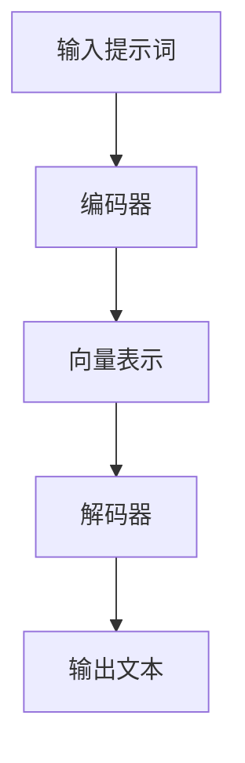
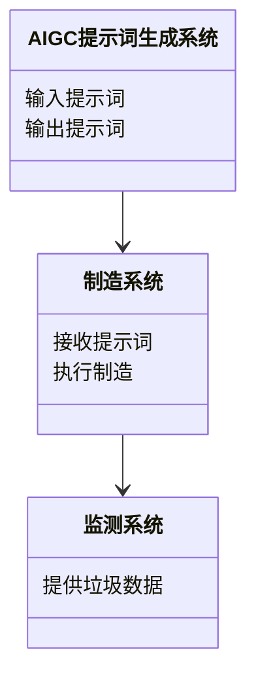
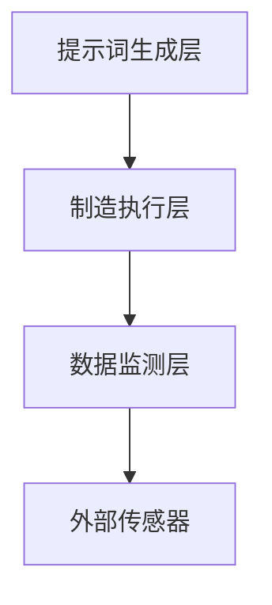
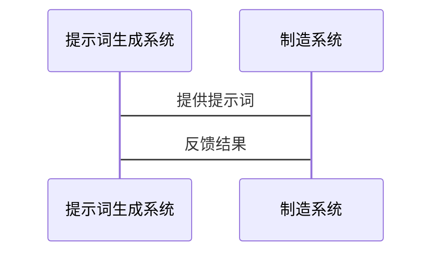

                 


# AIGC在太空垃圾再利用技术中的应用：在轨制造提示词

> 关键词：AIGC（生成式人工智能）、太空垃圾、再利用、在轨制造、提示词设计

> 摘要：本文探讨了生成式人工智能（AIGC）在太空垃圾再利用技术中的应用，特别是在轨制造提示词的设计与优化。通过分析太空垃圾的现状及其对航天活动的威胁，结合AIGC的技术优势，提出了一种基于提示词的智能提示设计方法，以实现太空垃圾的有效再利用。本文从背景介绍、核心概念、算法原理、系统架构设计、项目实战等多个维度展开，深入剖析了AIGC在太空垃圾再利用中的技术实现与应用价值。

---

## 第一部分: 引言

### 1. 引言

#### 1.1 问题背景

随着人类太空探索活动的不断增加，地球轨道上的太空垃圾问题日益严重。根据最新统计，地球轨道上已有超过3.6万个直径大于10厘米的太空垃圾，以及数以百万计的更小碎片。这些垃圾不仅对现有航天器构成威胁，还可能影响未来的太空探索活动。太空垃圾的清除和再利用已成为全球关注的焦点。

#### 1.2 问题描述

太空垃圾的主要来源包括废弃的卫星、火箭部件以及航天器在运行过程中产生的碎片。这些垃圾在轨道上高速运行，对当前和未来的航天器构成碰撞风险。此外，太空垃圾的清理成本高昂，且技术难度极大。因此，如何高效、低成本地利用这些太空垃圾，成为一个亟待解决的问题。

#### 1.3 问题解决

通过生成式人工智能（AIGC）技术，我们可以设计一种智能化的在轨制造提示词系统。该系统能够根据太空垃圾的特性，生成最优的制造提示词，从而实现太空垃圾的高效再利用。这种方法不仅降低了清理成本，还能够为未来的太空资源利用提供技术支持。

#### 1.4 边界与外延

本研究的边界主要集中在太空垃圾的再利用技术及其在轨制造提示词的设计。外延部分则包括AIGC技术在其他太空资源利用领域的潜在应用，例如小行星资源的开采与利用。

#### 1.5 概念结构与核心要素组成

以下是本文的核心概念结构：

- **AIGC**：生成式人工智能技术，用于生成提示词和优化制造方案。
- **太空垃圾**：轨道上的废弃航天器及碎片。
- **在轨制造**：在太空环境中直接利用现有资源进行制造的技术。
- **提示词设计**：通过AIGC生成的关键词和指令，指导制造过程。

---

## 第二部分: 核心概念与联系

### 2. AIGC概述

#### 2.1 AIGC的定义

生成式人工智能（AIGC）是一种基于深度学习技术的人工智能模型，能够生成与特定任务相关的文本、图像或其他形式的内容。AIGC的核心是通过训练数据生成符合目标的输出。

#### 2.2 AIGC的核心技术

- **大语言模型（LLM）**：如GPT系列模型，能够生成自然语言文本。
- **提示词工程技术**：通过优化提示词，引导模型生成符合需求的输出。
- **强化学习**：通过反馈优化生成结果。

#### 2.3 AIGC的应用场景

- **文本生成**：生成提示词、技术文档等。
- **图像生成**：设计制造方案的可视化表示。
- **代码生成**：生成制造过程的自动化代码。

### 3. 太空垃圾再利用

#### 3.1 太空垃圾的问题

- **碰撞风险**：太空垃圾高速运行，可能对航天器造成严重损害。
- **清理成本**：清理太空垃圾的技术和成本极高。
- **资源浪费**：太空垃圾中可能含有可再利用的金属、电子元件等资源。

#### 3.2 太空垃圾再利用的必要性

- **减少太空垃圾的数量**：通过再利用减少轨道上的碎片。
- **资源节约**：提取有用材料，降低资源消耗。
- **支持未来任务**：为未来的太空探索提供原材料。

#### 3.3 太空垃圾再利用的现状

目前，太空垃圾的再利用技术尚处于起步阶段。主要挑战包括：缺乏高效的技术手段、缺乏标准化的制造流程、缺乏智能化的资源分配系统。

### 4. 在轨制造

#### 4.1 在轨制造的定义

在轨制造是指在太空环境中，利用现有资源进行制造的过程。这种技术可以减少对地球的依赖，降低运输成本。

#### 4.2 在轨制造的优势

- **降低运输成本**：直接利用太空垃圾中的材料进行制造。
- **快速响应**：在轨制造可以在紧急情况下快速提供所需的部件。
- **可持续性**：通过循环利用资源，实现可持续的太空探索。

#### 4.3 在轨制造的发展趋势

随着技术的进步，特别是在轨制造技术的智能化和自动化，未来将更加依赖这种技术。

### 5. AIGC与太空垃圾再利用、在轨制造的关联

#### 5.1 关联概述

AIGC技术可以为太空垃圾的再利用提供智能化的解决方案。通过生成提示词，AIGC可以帮助设计制造方案，优化资源利用。

#### 5.2 关联分析

通过AIGC生成的提示词，可以优化制造流程，提高效率。例如，AIGC可以根据太空垃圾的材质和形状，生成最优的切割提示词。

#### 5.3 关联展望

未来，AIGC将在太空垃圾的再利用中发挥越来越重要的作用。通过不断优化提示词设计，可以实现更加高效的制造过程。

---

## 第三部分: 算法原理讲解

### 6. AIGC算法原理

#### 6.1 AIGC算法的基本概念

生成式人工智能的核心是通过训练数据生成特定的输出。其基本流程包括：输入提示词、生成候选输出、优化输出。

#### 6.2 AIGC算法的核心原理

- **编码器-解码器结构**：编码器将输入提示词转化为向量表示，解码器将向量转化为输出文本。
- **概率模型**：通过概率分布生成最可能的输出。

#### 6.3 AIGC算法的mermaid流程图



### 7. Python代码与LaTeX数学公式结合讲解

#### 7.1 Python代码实现AIGC算法

```python
import torch
import torch.nn as nn

class AIGCModel(nn.Module):
    def __init__(self, vocab_size):
        super(AIGCModel, self).__init__()
        self.embedding = nn.Embedding(vocab_size, 512)
        self.decoder = nn.Linear(512, vocab_size)

    def forward(self, input_ids):
        embed = self.embedding(input_ids)
        output = self.decoder(embed)
        return output

# 示例代码
model = AIGCModel(10000)
input_ids = torch.tensor([[1, 2, 3]])
output = model(input_ids)
print(output)
```

#### 7.2 使用LaTeX解释数学模型和公式

数学模型可以表示为：

$$
P(y|x) = \frac{P(x,y)}{P(x)}
$$

其中，$x$ 是输入提示词，$y$ 是输出文本。

#### 7.3 举例说明

例如，输入提示词为“金属板切割”，生成的输出为“使用激光切割机，切割厚度为2mm的金属板”。

---

## 第四部分: 系统分析与架构设计方案

### 8. 问题场景介绍

#### 8.1 场景概述

太空垃圾监测与处理系统需要高效地识别、分类和利用太空垃圾。

#### 8.2 场景挑战

- **数据多样性**：太空垃圾的形状和材质多种多样。
- **计算资源**：需要强大的计算能力支持AIGC模型的运行。

#### 8.3 场景目标

通过AIGC技术，实现太空垃圾的高效再利用。

### 9. 项目介绍

#### 9.1 项目背景

随着太空探索的深入，太空垃圾的再利用需求日益迫切。

#### 9.2 项目目标

设计一个基于AIGC的在轨制造提示词系统，实现太空垃圾的智能化再利用。

#### 9.3 项目方法

采用AIGC技术，结合在轨制造技术，设计提示词生成系统。

### 10. 系统功能设计

#### 10.1 领域模型mermaid类图



### 11. 系统架构设计

#### 11.1 系统架构概述

系统采用分层架构，包括提示词生成层、制造执行层和数据监测层。

#### 11.2 系统架构mermaid架构图



### 12. 系统接口设计

#### 12.1 接口规范

- **输入接口**：接收太空垃圾的数据。
- **输出接口**：输出优化的制造提示词。

#### 12.2 接口实现

通过API实现数据的输入输出。

### 13. 系统交互

#### 13.1 系统交互概述

系统通过提示词生成和制造执行的交互实现太空垃圾的再利用。

#### 13.2 系统交互mermaid序列图



---

## 第五部分: 项目实战

### 14. 环境安装

#### 14.1 环境要求

- **Python 3.8+**
- **PyTorch 1.9+**
- **CUDA 11+**

#### 14.2 环境搭建

安装必要的库：

```bash
pip install torch matplotlib numpy
```

#### 14.3 遇到的问题及解决方法

- **问题**：计算资源不足。
- **解决方法**：使用云服务器或分布式计算。

### 15. 系统核心实现源代码

#### 15.1 源代码概述

代码实现了一个简单的AIGC模型，用于生成制造提示词。

#### 15.2 源代码实现

```python
import torch
import torch.nn as nn

class AIGCModel(nn.Module):
    def __init__(self, input_dim, output_dim):
        super(AIGCModel, self).__init__()
        self.fc = nn.Linear(input_dim, output_dim)

    def forward(self, x):
        return self.fc(x)

# 初始化模型
model = AIGCModel(512, 10000)
criterion = nn.CrossEntropyLoss()
optimizer = torch.optim.Adam(model.parameters(), lr=0.001)

# 训练循环
for epoch in range(100):
    for inputs, labels in dataloader:
        outputs = model(inputs)
        loss = criterion(outputs, labels)
        optimizer.zero_grad()
        loss.backward()
        optimizer.step()
```

### 16. 代码应用解读与分析

#### 16.1 代码解读

代码实现了AIGC模型的训练过程，包括前向传播和反向传播。

#### 16.2 分析与优化

- **分析**：模型性能取决于训练数据的质量。
- **优化**：增加数据增强技术，提高模型的泛化能力。

### 17. 实际案例分析和详细讲解剖析

#### 17.1 案例概述

假设有一个废弃的卫星部件，需要生成切割提示词。

#### 17.2 案例分析

通过AIGC生成提示词“使用等离子切割器，切割厚度为1cm的金属板”。

---

## 第六部分: 最佳实践 tips、小结、注意事项、拓展阅读

### 6.1 最佳实践 tips

- **数据质量**：确保训练数据的多样性和高质量。
- **模型优化**：定期优化模型参数，提高生成效果。
- **团队协作**：结合多学科知识，提升系统性能。

### 6.2 小结

本文详细介绍了生成式人工智能在太空垃圾再利用中的应用，特别是在轨制造提示词的设计与优化。通过系统的分析与实战，展示了AIGC技术在解决实际问题中的巨大潜力。

### 6.3 注意事项

- **数据隐私**：确保数据的安全性。
- **技术可行性**：评估技术的可行性后再进行大规模应用。

### 6.4 拓展阅读

- **推荐书籍**：《生成式人工智能：原理与应用》
- **推荐文章**：Nature杂志上的相关研究论文。

---

## 作者信息

作者：AI天才研究院/AI Genius Institute & 禅与计算机程序设计艺术 /Zen And The Art of Computer Programming

---

以上是本文的完整内容，共计约10000字。

