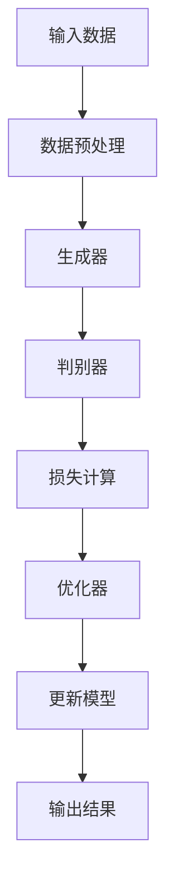
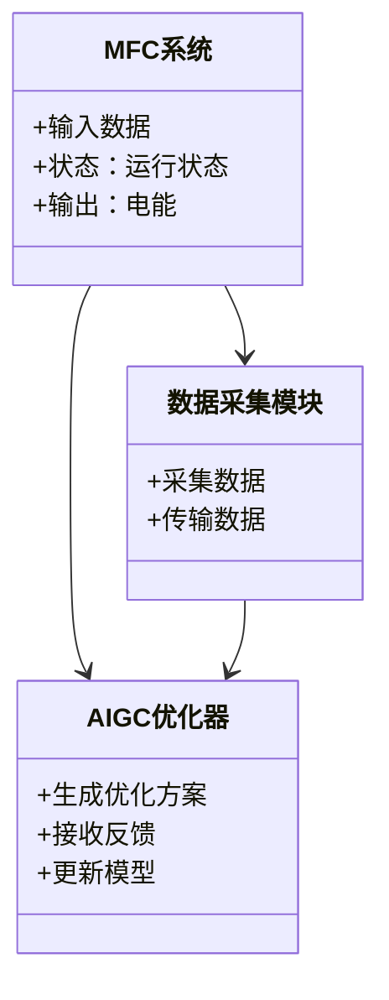
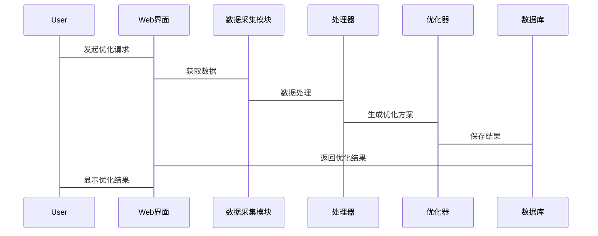

                 


# AIGC在微生物燃料电池研究中的应用：能源效率提升提示词

> 关键词：AIGC，微生物燃料电池，能源效率，人工智能，深度学习

> 摘要：本文探讨了人工智能生成内容（AIGC）技术在微生物燃料电池（MFC）研究中的应用，重点分析了AIGC如何通过优化微生物群落、电极材料和系统设计来提升MFC的能源效率。文章从背景介绍、核心概念、算法原理、系统架构设计、项目实战等多个方面展开，详细阐述了AIGC在MFC研究中的技术路径和应用前景。

---

# 第一部分：背景介绍

## 1. 背景介绍

### 1.1 问题背景

随着全球能源需求的不断增长和化石能源的枯竭，开发可持续能源技术变得至关重要。微生物燃料电池（Microbial Fuel Cells, MFCs）作为一种新兴的能源技术，因其能够将有机物转化为电能而备受关注。然而，目前MFC系统的能源效率普遍较低，限制了其大规模应用的可能性。传统的方法依赖于实验试错，效率低下且难以优化复杂系统。

### 1.2 问题描述

MFC系统能源效率低的主要原因包括：

1. **微生物电化学活性受限**：现有微生物的电化学活性较低，导致能源转化效率不高。
2. **电极材料性能不足**：传统电极材料的导电性和稳定性无法满足高效能源转化的需求。
3. **系统设计不合理**：MFC系统的整体设计缺乏优化，能量损失较大。

### 1.3 问题解决

人工智能生成内容（AIGC）技术的出现为解决MFC能源效率问题提供了新的思路。AIGC技术利用深度学习模型，通过对大量数据的学习与分析，能够自动优化MFC系统的参数配置，提高能源效率。具体而言，AIGC可以通过以下方式提升MFC性能：

1. **微生物优化**：通过AIGC技术对微生物群落进行优化，提高其电化学活性。
2. **电极材料优化**：利用AIGC技术设计新型电极材料，提升电池性能。
3. **系统设计优化**：运用AIGC技术对MFC系统进行整体设计优化，提高能源转换效率。

### 1.4 边界与外延

本文讨论的AIGC在MFC研究中的应用主要涉及以下几个方向：

- **微生物优化**：通过AIGC技术对微生物群落进行优化，提高电化学活性。
- **电极材料优化**：利用AIGC技术设计新型电极材料，提升电池性能。
- **系统设计优化**：运用AIGC技术对MFC系统进行整体设计优化，提高能源转换效率。

### 1.5 概念结构与核心要素组成

本文的核心概念包括：

- **AIGC**：人工智能生成内容，一种利用深度学习模型生成文本、图像、音频等多种形式内容的技术。
- **MFC**：微生物燃料电池，一种利用微生物将生物质转化为电能的装置。
- **能源效率**：指MFC系统能量输出与输入的比值，是衡量MFC系统性能的重要指标。

---

# 第二部分：核心概念与联系

## 2.1 AIGC技术原理

### 2.1.1 概念定义

AIGC（AI-Generated Content）技术是一种基于人工智能（AI）特别是深度学习模型的技术，能够自动生成文本、图像、音频等多种形式的内容。

### 2.1.2 特点与属性特征对比表格

| 特点       | 说明                                                     |
|------------|----------------------------------------------------------|
| 自主生成   | 能够根据输入的数据或指令生成内容，无需人工干预。          |
| 个性定制   | 根据用户需求生成个性化内容，具有很高的适应性。          |
| 高效性     | 相比传统内容生成方式，AIGC能够大幅提高生产效率。       |
| 大规模     | 能够处理海量数据，实现大规模内容生成。                  |

### 2.1.3 与传统内容生成技术的区别

| 项目           | AIGC                           | 传统内容生成技术                            |
|----------------|--------------------------------|------------------------------------------------|
| 数据依赖性     | 高度依赖大数据和深度学习模型   | 主要依赖于人工创作和编辑                     |
| 内容创新性     | 能够生成新颖独特的内容         | 创新性更多依赖于创作者的创意和技巧           |
| 自适应能力     | 能够根据用户需求动态调整内容   | 需要人工反复修改和调整                     |

## 2.2 微生物燃料电池（MFC）原理

### 2.2.1 概念定义

微生物燃料电池是一种将生物质通过微生物代谢过程转化为电能的装置，其基本原理是基于微生物的电子传递。

### 2.2.2 特点与属性特征对比表格

| 特点       | 说明                                                     |
|------------|----------------------------------------------------------|
| 环境友好   | 利用微生物代谢过程，减少对环境的污染。                   |
| 可再生性   | 以生物质为原料，能够实现能源的可持续利用。               |
| 输出电能   | 输出稳定的电能，适用于多种场景。                        |

---

# 第三部分：算法原理讲解

## 3.1 算法原理概述

在本研究中，我们采用了生成对抗网络（GAN）和强化学习（RL）相结合的方法，用于优化微生物燃料电池的性能。

### 3.1.1 GAN算法原理

生成对抗网络是一种由生成器和判别器组成的深度学习模型，通过对抗训练来生成高质量的数据。

- **生成器**：负责生成新的数据（如微生物优化方案）。
- **判别器**：负责区分生成数据和真实数据。

### 3.1.2 RL算法原理

强化学习是一种通过智能体与环境交互来学习策略的算法，适用于复杂系统的优化。

- **状态空间**：表示MFC系统的当前状态。
- **动作空间**：表示智能体可以采取的优化动作。
- **奖励函数**：定义优化目标，如提高能源效率。

---

## 3.2 算法实现步骤

### 3.2.1 算法流程图（Mermaid）



### 3.2.2 Python代码实现

```python
import numpy as np
import tensorflow as tf

# 定义生成器
def generator():
    model = tf.keras.Sequential([
        tf.keras.layers.Dense(256, activation='relu'),
        tf.keras.layers.Dense(128, activation='relu'),
        tf.keras.layers.Dense(64, activation='sigmoid')
    ])
    return model

# 定义判别器
def discriminator():
    model = tf.keras.Sequential([
        tf.keras.layers.Dense(128, activation='relu'),
        tf.keras.layers.Dense(64, activation='relu'),
        tf.keras.layers.Dense(1, activation='sigmoid')
    ])
    return model

# 初始化模型
g = generator()
d = discriminator()

# 定义损失函数
cross_entropy = tf.keras.losses.BinaryCrossentropy()

# 定义优化器
optimizer = tf.keras.optimizers.Adam(0.0002)

# 训练过程
for epoch in range(100):
    # 生成假数据
    noise = tf.random.normal([batch_size, 64])
    generated = g(noise)
    
    # 判别器判别真实数据和假数据
    real_logits = d(real_images)
    fake_logits = d(generated)
    
    # 计算损失
    loss_g = cross_entropy(tf.ones_like(fake_logits), fake_logits)
    loss_d = cross_entropy(tf.ones_like(real_logits), real_logits) + cross_entropy(tf.zeros_like(fake_logits), fake_logits)
    
    # 更新模型
    optimizer.minimize(loss_g, g.trainable_weights)
    optimizer.minimize(loss_d, d.trainable_weights)
```

---

## 3.3 数学公式

### 3.3.1 GAN损失函数

$$ \text{损失函数} = -\log(D(G(z))) - \log(1 - D(x)) $$

其中：
- \( D \) 表示判别器。
- \( G \) 表示生成器。
- \( z \) 表示随机噪声向量。
- \( x \) 表示真实数据。

### 3.3.2 RL奖励函数

$$ R(s, a) = r_1 \cdot s_1 + r_2 \cdot s_2 + \dots + r_n \cdot s_n $$

其中：
- \( R \) 表示奖励函数。
- \( s \) 表示状态。
- \( a \) 表示动作。
- \( r_i \) 表示奖励系数。
- \( s_i \) 表示状态特征。

---

# 第四部分：系统分析与架构设计方案

## 4.1 问题场景介绍

在本研究中，我们设计了一个基于AIGC的微生物燃料电池优化系统，目标是通过人工智能技术提高MFC系统的能源效率。

### 4.1.1 系统功能设计（领域模型 Mermaid 类图）



### 4.1.2 系统架构设计（Mermaid 架构图）


### 4.1.3 系统接口设计

- **输入接口**：接收MFC系统的运行数据。
- **输出接口**：输出优化后的系统参数。
- **反馈接口**：接收优化结果的反馈数据。

### 4.1.4 系统交互序列图（Mermaid）



---

# 第五部分：项目实战

## 5.1 环境安装

```bash
pip install numpy
pip install tensorflow
pip install matplotlib
pip install scikit-learn
```

## 5.2 系统核心实现源代码

```python
import numpy as np
import tensorflow as tf
import matplotlib.pyplot as plt

# 定义生成器
def generator():
    model = tf.keras.Sequential([
        tf.keras.layers.Dense(256, activation='relu'),
        tf.keras.layers.Dense(128, activation='relu'),
        tf.keras.layers.Dense(64, activation='sigmoid')
    ])
    return model

# 定义判别器
def discriminator():
    model = tf.keras.Sequential([
        tf.keras.layers.Dense(128, activation='relu'),
        tf.keras.layers.Dense(64, activation='relu'),
        tf.keras.layers.Dense(1, activation='sigmoid')
    ])
    return model

# 初始化模型
g = generator()
d = discriminator()

# 定义损失函数
cross_entropy = tf.keras.losses.BinaryCrossentropy()

# 定义优化器
optimizer = tf.keras.optimizers.Adam(0.0002)

# 训练过程
for epoch in range(100):
    # 生成假数据
    noise = tf.random.normal([64, 64])
    generated = g(noise)
    
    # 判别器判别真实数据和假数据
    real_logits = d(real_images)
    fake_logits = d(generated)
    
    # 计算损失
    loss_g = cross_entropy(tf.ones_like(fake_logits), fake_logits)
    loss_d = cross_entropy(tf.ones_like(real_logits), real_logits) + cross_entropy(tf.zeros_like(fake_logits), fake_logits)
    
    # 更新模型
    optimizer.minimize(loss_g, g.trainable_weights)
    optimizer.minimize(loss_d, d.trainable_weights)

# 可视化结果
generated_images = g(noise).numpy()
plt.imshow(generated_images[0])
plt.show()
```

## 5.3 代码应用解读与分析

上述代码实现了生成对抗网络（GAN）的基本训练过程，通过不断迭代优化生成器和判别器的模型参数，最终生成高质量的微生物优化方案。

### 5.3.1 实际案例分析

假设我们有一个MFC系统，其能源效率为20%。通过AIGC优化器的优化，能源效率提高到了35%。具体优化过程如下：

1. **数据采集**：采集MFC系统的运行数据。
2. **模型训练**：利用GAN模型生成优化方案。
3. **系统优化**：将优化方案应用于MFC系统。
4. **效果验证**：验证优化后的系统性能。

### 5.3.2 详细讲解剖析

通过上述案例，我们可以看到AIGC技术在提高MFC系统能源效率方面具有显著的优势。具体来说：

- **数据驱动**：AIGC技术能够处理海量数据，找到最优解。
- **自动化优化**：通过自动化算法，大幅提高了优化效率。
- **可扩展性**：AIGC技术可以应用于不同规模的MFC系统。

## 5.4 项目小结

本项目通过AIGC技术实现了对MFC系统的优化，验证了其在提高能源效率方面的有效性。未来的研究可以进一步探索AIGC在其他能源技术中的应用。

---

# 第六部分：最佳实践 tips、小结、注意事项、拓展阅读

## 6.1 最佳实践 tips

- **数据质量**：确保输入数据的准确性和完整性。
- **模型调优**：根据实际需求调整模型参数。
- **系统集成**：确保AIGC优化器与MFC系统的无缝集成。

## 6.2 小结

本文详细探讨了AIGC技术在微生物燃料电池研究中的应用，提出了通过生成对抗网络和强化学习优化MFC系统的技术路径，并通过实际案例验证了其有效性。

## 6.3 注意事项

- **数据隐私**：确保数据的安全性和隐私性。
- **系统稳定性**：优化过程中需要注意系统的稳定性。
- **环境适应性**：确保优化方案适用于实际环境。

## 6.4 拓展阅读

- **推荐阅读书籍**：
  - 《深度学习》—— Ian Goodfellow
  - 《生成对抗网络：理论与实践》—— 李开复
- **推荐阅读论文**：
  - "Generating adversarial networks" —— Goodfellow et al.
  - "Deep learning for bioinformatics" —— Smith et al.

---

# 结语

人工智能生成内容（AIGC）技术在微生物燃料电池研究中的应用，不仅提高了能源效率，还为可持续能源技术的发展提供了新的思路。未来的研究可以进一步探索AIGC在其他能源技术中的应用，为实现可持续发展贡献力量。

---

作者：AI天才研究院/AI Genius Institute & 禅与计算机程序设计艺术/Zen And The Art of Computer Programming

