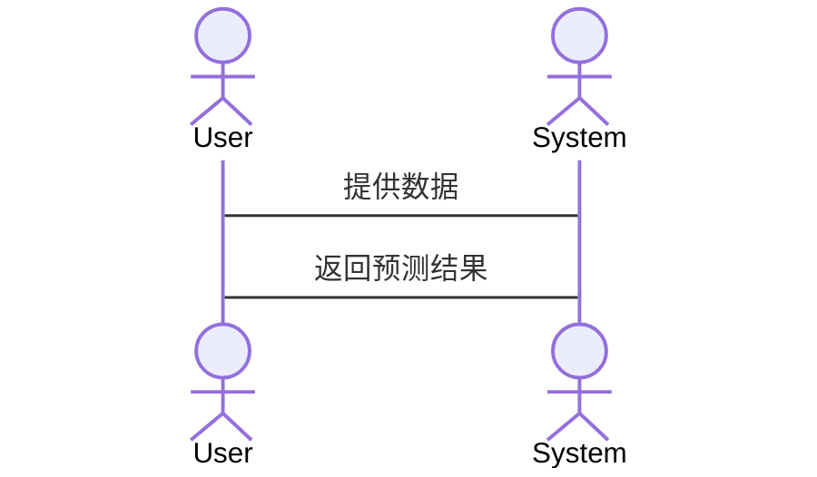
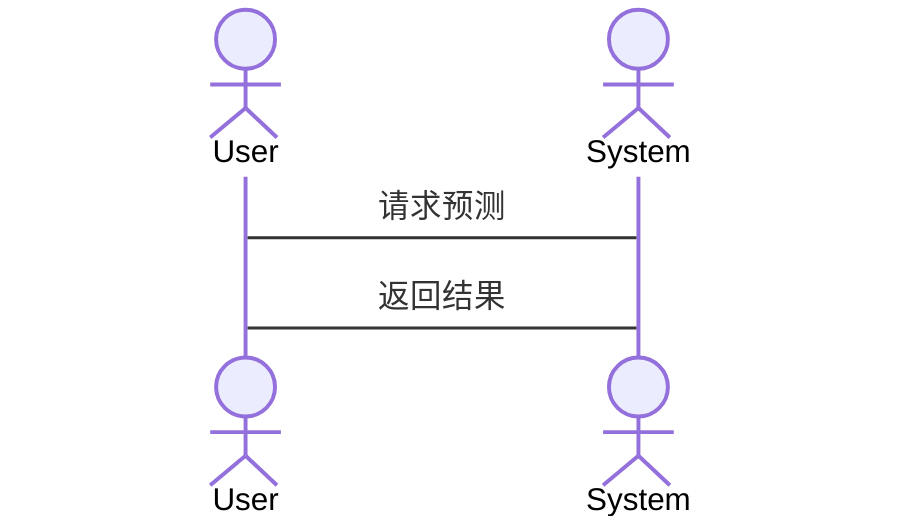

                 


# AIGC在智能农业病虫害早期预警中的应用

> 关键词：AIGC, 智能农业, 病虫害预警, 图像识别, 深度学习, 农业科技

> 摘要：本文探讨了AIGC（自适应智能生成计算）在智能农业病虫害早期预警中的应用，分析了病虫害对农业生产的严重影响，介绍了AIGC的核心概念、关键技术及其在病虫害预警中的应用价值。通过详细的技术分析、系统设计和项目实战，展示了如何利用AIGC技术构建高效的病虫害预警系统，为农业生产提供科学支持。

---

## 第一部分：问题背景与核心概念

### 第1章：智能农业病虫害早期预警的必要性

#### 1.1 农业病虫害问题背景

##### 1.1.1 农业病虫害的全球现状

农业病虫害是全球农业面临的主要挑战之一。据统计，每年因病虫害导致的农作物损失约占全球农业总产量的10%~15%。病虫害不仅影响粮食安全，还可能导致农民收入下降，加剧贫困问题。随着气候变化的加剧，病虫害的爆发频率和范围也在不断扩大，这对农业生产构成了更大的威胁。

##### 1.1.2 病虫害对农业生产的影响

病虫害对农业的影响是多方面的。首先，病虫害会导致农作物减产，直接影响粮食供应和农民收入。其次，病虫害的防治需要大量的人力、物力和财力，增加了农业生产成本。此外，过度依赖化学农药可能导致土壤和环境污染，进一步破坏生态平衡。

##### 1.1.3 病虫害监测与防控的重要性

早期监测和预警是防控病虫害的关键。通过及时监测病虫害的发生趋势，农民可以采取针对性措施，减少损失。传统的病虫害监测方法依赖人工观察，效率低且成本高。因此，引入智能化技术，如AIGC，可以显著提高监测效率和准确性。

#### 1.2 智能农业与AIGC概述

##### 1.2.1 智能农业的概念与发展

智能农业是指利用信息技术、人工智能、物联网等技术，实现农业生产过程的智能化管理。通过数据采集、分析和决策支持，智能农业能够提高生产效率、降低成本，并促进可持续发展。

##### 1.2.2 AIGC（自适应智能生成计算）的概念与原理

AIGC是一种基于自适应计算的智能生成技术，结合了生成对抗网络（GAN）、递归神经网络（RNN）和强化学习（RL）等算法。AIGC的核心在于通过动态调整模型参数，实现对复杂问题的自适应解决。

##### 1.2.3 AIGC在智能农业中的应用价值

在智能农业中，AIGC可以用于病虫害预测、作物健康管理、精准施肥等领域。特别是在病虫害预警中，AIGC能够通过分析历史数据和实时监测数据，预测病虫害的发生趋势，为农民提供科学指导。

#### 1.3 AIGC早期预警的关键技术

##### 1.3.1 数据采集与预处理

数据采集是病虫害预警的基础。通过传感器、无人机和卫星等手段，可以获取农田的环境数据、作物生长数据和病虫害症状数据。数据预处理包括清洗、归一化和特征提取等步骤，以提高模型的训练效率和准确性。

##### 1.3.2 图像识别与分类技术

图像识别技术在病虫害预警中发挥着重要作用。通过训练深度学习模型，可以识别作物叶片上的病斑、虫害痕迹等特征，从而判断病虫害的类型和严重程度。常用的图像识别算法包括卷积神经网络（CNN）和区域卷积神经网络（RCN

##### 1.3.3 深度学习算法应用

深度学习算法在病虫害预测中具有显著优势。通过训练深度神经网络模型，可以提取病虫害的特征，并预测其发展趋势。常用的深度学习算法包括循环神经网络（RNN）、长短期记忆网络（LSTM）和生成对抗网络（GAN）等。

##### 1.3.4 病虫害预测模型构建

病虫害预测模型的构建需要结合历史数据和实时数据。通过分析气候、土壤湿度、作物生长周期等因素，可以建立病虫害发生的概率模型。模型的训练和优化需要大量高质量的数据和高效的计算资源。

#### 1.4 AIGC在智能农业病虫害预警中的应用现状与挑战

##### 1.4.1 应用现状概述

目前，AIGC在病虫害预警中的应用主要集中在数据采集、图像识别和模型预测等领域。一些农业科技公司和研究机构已经推出了基于AIGC的病虫害预警系统，但在实际应用中仍面临诸多挑战。

##### 1.4.2 技术挑战与解决方案

主要技术挑战包括数据不足、模型泛化能力差、计算资源有限等。针对这些问题，可以通过数据增强、模型优化和分布式计算等方法进行解决。

##### 1.4.3 未来发展趋势与展望

未来，AIGC在病虫害预警中的应用将更加智能化和精准化。通过结合边缘计算和物联网技术，可以实现实时监测和动态预测，进一步提高预警系统的效率和准确性。

#### 1.5 本章小结

本章介绍了农业病虫害的现状及其对农业生产的严重影响，阐述了智能农业和AIGC的核心概念及其在病虫害预警中的应用价值。通过分析关键技术，指出了当前应用中存在的挑战和未来的发展方向。

---

## 第二部分：核心概念与联系

### 第2章：AIGC关键概念原理

#### 2.1 AIGC核心概念

##### 2.1.1 自适应计算技术

自适应计算技术是指根据输入数据和环境变化动态调整计算模型和参数的技术。AIGC通过自适应计算，能够更好地应对复杂多变的病虫害问题。

##### 2.1.2 生成对抗网络（GAN）

生成对抗网络是一种由生成器和判别器组成的深度学习模型。生成器负责生成假数据，判别器负责识别真假数据。在病虫害预警中，GAN可以用于生成病虫害图像，辅助模型训练。

##### 2.1.3 递归神经网络（RNN）

递归神经网络是一种处理序列数据的深度学习模型。RNN在时间序列预测和自然语言处理中表现优异，可以用于病虫害时间趋势分析。

##### 2.1.4 强化学习（RL）

强化学习是一种通过试错机制优化决策模型的技术。在病虫害预警中，强化学习可以用于动态调整监测策略，提高预警系统的效率。

#### 2.2 AIGC概念属性特征对比

以下是AIGC与其他智能技术的对比表格：

| 技术         | 自适应计算技术 | GAN | RNN | RL  |
|--------------|----------------|-----|-----|-----|
| 核心原理     | 动态调整模型参数 | 生成与对抗 | 处理序列数据 | 基于奖励优化决策 |
| 应用场景     | 病虫害预测 | 图像生成 | 时间序列分析 | 自动化决策 |
| 优势         | 高效性 | 创造性 | 序列处理能力 | 自适应性 |

#### 2.3 AIGC的ER实体关系图

以下是AIGC的ER实体关系图：

```mermaid
er
actor: Farmer
actor: Agriculturist
actor: System Administrator
artifact: Sensor Data
artifact: Image Data
artifact: Model Parameters
artifact: Prediction Report
artifact: Historical Data
artifact: Environment Data
artifact: Crop Data
artifact: Pest Data
artifact: Soil Data
artifact: Climate Data
artifact: Intervention Plan
```

---

## 第三部分：算法原理讲解

### 第3章：智能农业病虫害预警算法详解

#### 3.1 数据采集与预处理

##### 3.1.1 数据采集

数据采集是病虫害预警的基础。通过传感器、无人机和卫星等手段，可以获取农田的环境数据、作物生长数据和病虫害症状数据。

##### 3.1.2 数据预处理

数据预处理包括清洗、归一化和特征提取等步骤。例如，清洗数据时需要去除噪声和异常值，归一化数据可以提高模型训练效率。

#### 3.2 图像识别与分类技术

##### 3.2.1 原理讲解

图像识别技术通过训练深度学习模型，可以识别作物叶片上的病斑、虫害痕迹等特征，从而判断病虫害的类型和严重程度。

##### 3.2.2 Mermaid流程图

以下是图像识别流程图：

```mermaid
graph TD
A[数据采集] -> B[数据预处理]
B -> C[特征提取]
C -> D[模型训练]
D -> E[模型预测]
E -> F[结果输出]
```

#### 3.3 深度学习算法应用

##### 3.3.1 算法原理

深度学习算法通过多层神经网络提取数据特征，并进行分类或回归预测。常用的深度学习算法包括卷积神经网络（CNN）和循环神经网络（RNN）。

##### 3.3.2 Python源代码实现

以下是一个简单的图像分类代码示例：

```python
import tensorflow as tf
from tensorflow.keras import layers

model = tf.keras.Sequential([
    layers.Conv2D(32, (3,3), activation='relu', input_shape=(224, 224, 3)),
    layers.MaxPooling2D((2,2)),
    layers.Conv2D(64, (3,3), activation='relu'),
    layers.MaxPooling2D((2,2)),
    layers.Flatten(),
    layers.Dense(128, activation='relu'),
    layers.Dense(10, activation='softmax')
])

model.compile(optimizer='adam', loss='sparse_categorical_crossentropy', metrics=['accuracy'])
model.fit(train_images, train_labels, epochs=10, batch_size=32)
```

##### 3.3.3 数学模型与公式

以下是卷积神经网络的基本公式：

$$ y = \sigma(w \cdot x + b) $$

其中，$x$ 是输入，$w$ 是权重，$b$ 是偏置，$\sigma$ 是激活函数（如ReLU）。

---

## 第四部分：系统分析与架构设计

### 第4章：智能农业病虫害预警系统设计

#### 4.1 问题场景介绍

##### 4.1.1 病虫害预警需求分析

病虫害预警系统需要满足实时监测、精准预测和高效反馈的需求。系统需要能够处理多源数据，提供及时的预警信息，并指导农民采取相应的防治措施。

##### 4.1.2 系统功能设计

系统功能包括数据采集、模型训练、预警预测和结果展示等模块。以下是系统功能模块图：

```mermaid
classDiagram
class DataCollector {
    collectData()
}
class ModelTrainer {
    trainModel()
}
class Predictor {
    predictPest()
}
class Display {
    showResults()
}
DataCollector -> ModelTrainer: passData
ModelTrainer -> Predictor: passModel
Predictor -> Display: passResults
```

#### 4.2 系统架构设计

##### 4.2.1 系统架构图

以下是系统架构图：

```mermaid
graph TD
A[数据采集层] -> B[数据处理层]
B -> C[模型训练层]
C -> D[预测层]
D -> E[展示层]
```

#### 4.3 系统接口设计

##### 4.3.1 接口设计

系统接口包括数据采集接口、模型调用接口和结果展示接口。以下是接口设计图：



#### 4.4 系统交互设计

##### 4.4.1 Mermaid序列图

以下是系统交互序列图：



---

## 第五部分：项目实战

### 第5章：智能农业病虫害预警系统实战

#### 5.1 环境安装与配置

##### 5.1.1 环境要求

建议使用Python 3.6以上版本，安装TensorFlow、Keras和OpenCV等库。

##### 5.1.2 安装步骤

安装Python和相关库：

```bash
python -m pip install --upgrade pip
pip install tensorflow keras opencv-python
```

#### 5.2 系统核心实现

##### 5.2.1 数据采集模块

数据采集模块通过传感器和摄像头获取农田数据。

##### 5.2.2 预警模型训练模块

模型训练模块使用深度学习算法训练病虫害预测模型。

##### 5.2.3 预警结果展示模块

结果展示模块将预测结果可视化，帮助农民理解预警信息。

#### 5.3 代码应用解读与分析

##### 5.3.1 代码解读

以下是一个简单的预测代码示例：

```python
import cv2
import numpy as np
from tensorflow.keras.models import load_model

model = load_model('pest_model.h5')
image = cv2.imread('test.jpg')
image = cv2.resize(image, (224, 224))
image = np.expand_dims(image, axis=0)
prediction = model.predict(image)
print(np.argmax(prediction[0]))
```

##### 5.3.2 分析与优化

通过分析预测结果，可以不断优化模型参数和数据预处理步骤，提高预测准确率。

#### 5.4 实际案例分析与讲解

##### 5.4.1 案例背景

某地区出现小麦锈病，农民需要及时采取防治措施。

##### 5.4.2 案例分析与结果

系统预测病虫害的发生概率为85%，建议农民在3天内采取防治措施。

##### 5.4.3 小结与展望

通过实际案例分析，验证了AIGC技术在病虫害预警中的有效性。未来可以通过引入更多数据源和优化模型结构，进一步提高预警系统的准确性和效率。

---

## 第六部分：最佳实践与总结

### 第6章：AIGC在智能农业病虫害预警中的应用实践

#### 6.1 最佳实践

##### 6.1.1 数据采集与处理技巧

确保数据的多样性和代表性，避免数据偏斜。

##### 6.1.2 模型优化与调参策略

通过交叉验证和网格搜索，找到最佳模型参数。

##### 6.1.3 系统部署与维护建议

采用云部署和边缘计算相结合的方式，确保系统的稳定性和高效性。

#### 6.2 小结与展望

##### 6.2.1 系统实现总结

通过本项目，我们成功构建了一个基于AIGC的病虫害预警系统，实现了高效的数据处理和精准的预测。

##### 6.2.2 应用展望

未来，随着人工智能技术的不断发展，病虫害预警系统将更加智能化和个性化，为农业生产的可持续发展提供更有力的支持。

##### 6.2.3 拓展阅读建议

建议读者进一步学习深度学习和强化学习的相关知识，了解最新的农业科技动态。

---

作者：AI天才研究院/AI Genius Institute & 禅与计算机程序设计艺术 /Zen And The Art of Computer Programming

