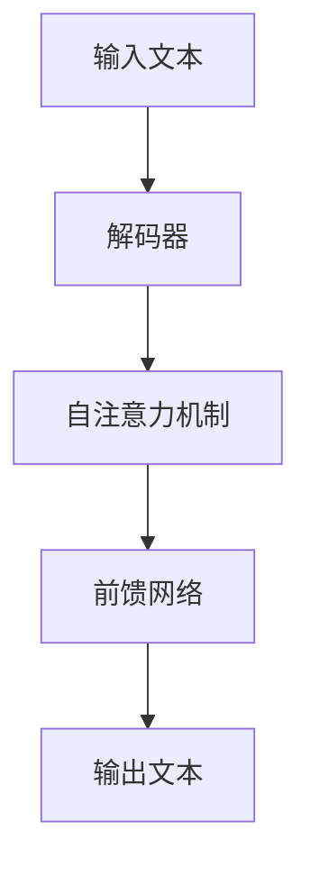
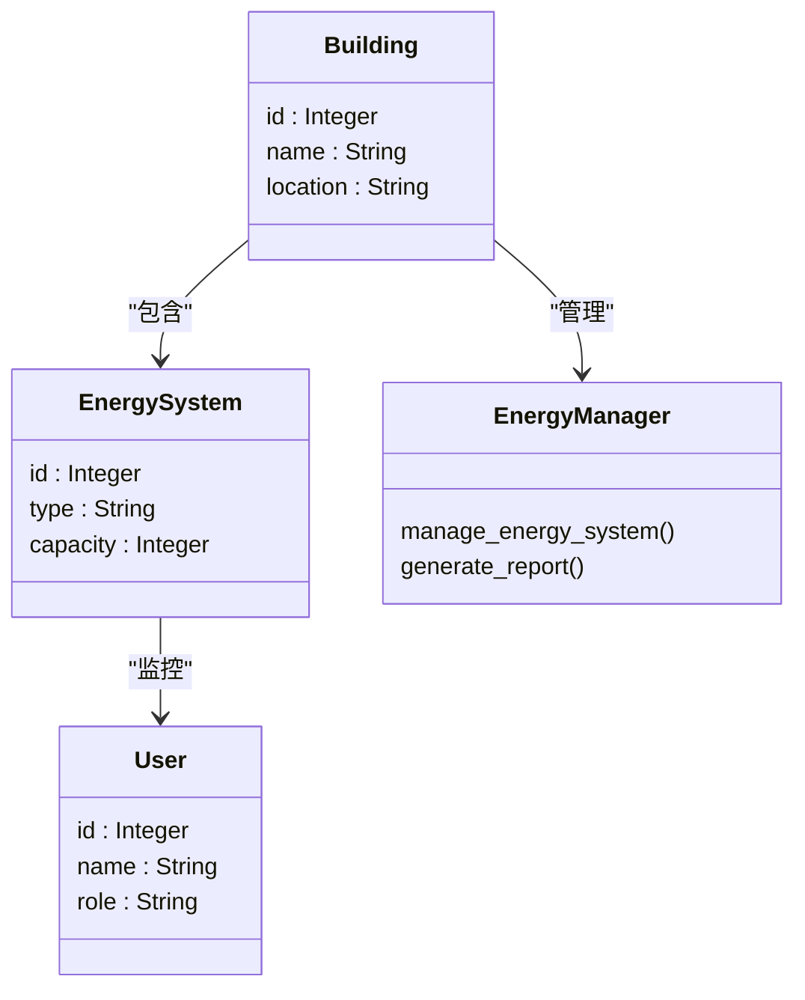
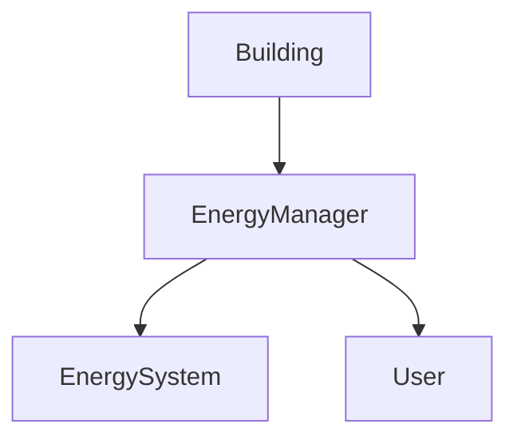

                 

# AIGC在智能建筑节能设计中的创新

> 关键词：智能建筑，能源效率，人工智能生成内容（AIGC），节能设计，可持续发展

摘要：随着全球能源危机的加剧，智能建筑的设计和运营需要更加注重能源效率。本文探讨了人工智能生成内容（AIGC）在智能建筑节能设计中的创新应用，分析了AIGC技术的核心原理、应用场景、实际案例，并展望了未来的发展趋势。通过系统分析和架构设计，本文展示了如何利用AIGC技术优化建筑能源管理，提升节能效果，为智能建筑的可持续发展提供新的思路。

---

## 第一部分：引言与背景

### 1.1 问题背景

#### 1.1.1 智能建筑与能源危机
智能建筑通过整合物联网（IoT）、大数据和人工智能（AI）技术，实现了建筑设备和系统的智能化管理。然而，随着城市化进程的加快，建筑数量激增，能源消耗也随之上升。根据联合国数据，建筑行业占全球能源消耗的40%左右，其中很大一部分是浪费。能源危机已成为全球性问题，智能建筑的节能设计变得尤为重要。

#### 1.1.2 能源效率的重要性
能源效率是减少能源消耗的关键。通过优化建筑的设计、运营和管理，可以显著降低能源消耗，减少碳排放，推动可持续发展目标的实现。智能建筑的节能设计需要综合考虑建筑结构、设备运行、用户行为等多个因素。

#### 1.1.3 AIGC技术的概述
AIGC（AI Generated Content）是指利用人工智能技术生成内容的过程。在智能建筑中，AIGC可以通过生成式AI模型（如GPT系列）优化建筑的设计、运营和管理。例如，AIGC可以用于生成建筑能效分析报告、优化设备运行策略，甚至模拟用户行为以优化能源使用。

---

### 1.2 研究目的与意义

#### 1.2.1 研究目标
本研究旨在探索AIGC技术在智能建筑节能设计中的应用，分析其优势和挑战，提出可行的解决方案，并通过实际案例验证其效果。

#### 1.2.2 研究意义
通过引入AIGC技术，智能建筑的节能设计可以更加智能化和个性化，降低能源消耗，减少运营成本，同时推动绿色建筑的发展。

#### 1.2.3 研究范围与限制
本研究聚焦于AIGC技术在智能建筑节能设计中的应用，主要涵盖建筑能效分析、设备优化和用户行为模拟。研究范围不包括传统建筑设计中的结构安全和美学设计。

---

### 1.3 文章结构与内容概览

#### 1.3.1 结构安排
本文分为四个主要部分：引言与背景、AIGC技术基础、智能建筑节能设计实例分析，以及最佳实践与展望。

#### 1.3.2 内容概览
- 引言部分介绍了智能建筑和能源效率的重要性，以及AIGC技术的概述。
- 第二部分详细讲解了AIGC技术的定义、算法原理、应用场景及其优势与挑战。
- 第三部分通过实际案例分析了AIGC在智能建筑节能设计中的应用，包括系统分析、架构设计和实际效果。
- 最后一部分总结了最佳实践，展望了未来发展趋势，并提出了注意事项和拓展阅读建议。

---

### 1.4 核心概念与联系

#### 1.4.1 AIGC概念解析
AIGC是一种利用AI技术生成内容的方法，通过训练大规模数据集，模型可以生成符合特定需求的文本、图像或其他形式的内容。在智能建筑中，AIGC可以用于生成能效报告、优化策略和模拟方案。

#### 1.4.2 能源效率关键概念
能源效率是指以最小的能源消耗完成既定目标的能力。在智能建筑中，能源效率涉及建筑设备的运行效率、能源管理系统的优化以及用户的能源使用行为。

#### 1.4.3 智能建筑要素
智能建筑主要包括以下几个要素：
1. **物联网设备**：用于采集建筑内外的环境数据。
2. **能源管理系统**：用于监控和管理建筑的能源使用。
3. **人工智能系统**：用于分析数据并生成优化策略。
4. **用户交互界面**：用于用户与建筑系统的互动。

#### 1.4.4 ER图与概念关系图
以下是智能建筑节能设计的核心概念关系图：

```mermaid
erDiagram
    building {
        id
        name
        location
    }
    energy_system {
        id
        type
        capacity
    }
    user {
        id
        name
        role
    }
    building --> energy_system : "包含"
    building --> user : "服务"
    energy_system --> user : "监控"
```

---

## 第二部分：AIGC技术基础

### 2.1 AIGC技术概述

#### 2.1.1 AIGC的定义
AIGC是一种利用人工智能技术生成内容的方法。它通过训练大规模数据集，使模型能够理解和生成人类语言。

#### 2.1.2 AIGC的组成部分
AIGC系统通常包括以下几个部分：
1. **数据预处理**：清洗和标注数据。
2. **模型训练**：使用深度学习模型（如Transformer）进行训练。
3. **生成策略**：根据输入生成输出内容。
4. **优化与调优**：通过反馈机制优化生成效果。

#### 2.1.3 AIGC的发展历程
从早期的简单生成模型到现在的复杂多模态模型，AIGC技术经历了以下几个阶段：
1. **规则-based生成**：基于固定的规则生成内容。
2. **统计模型**：基于统计语言模型生成内容。
3. **深度学习模型**：基于神经网络的生成模型（如GPT系列）。
4. **多模态生成**：结合图像、文本等多种数据生成内容。

---

### 2.2 AIGC算法原理与流程

#### 2.2.1 算法基础
AIGC的核心算法是基于Transformer架构的生成模型。其主要原理包括：
1. **自注意力机制**：捕捉输入文本中的长距离依赖关系。
2. **解码器结构**：通过逐步生成文本来优化输出。

#### 2.2.2 算法流程图
以下是AIGC算法的流程图：



#### 2.2.3 算法公式讲解
AIGC的生成过程可以通过以下公式表示：
$$ P(y_i|x_{<i}) = \text{softmax}(W_{y_i}^T h_i) $$
其中，$h_i$是解码器在第i层的隐藏状态，$W_{y_i}$是输出层的权重矩阵。

#### 2.2.4 举例说明
例如，输入“节能设计”，AIGC可以生成“通过优化设备运行策略和用户行为管理，可以显著提高能源效率”。

---

### 2.3 AIGC在智能建筑中的应用场景

#### 2.3.1 智能监控
AIGC可以用于实时监控建筑设备的运行状态，生成异常报告。

#### 2.3.2 能源管理
AIGC可以生成能效分析报告，优化能源管理系统。

#### 2.3.3 环境控制
AIGC可以模拟室内环境变化，优化空调和照明系统的运行策略。

#### 2.3.4 安全防护
AIGC可以生成安全预警，帮助建筑管理人员及时发现潜在风险。

---

### 2.4 AIGC的优势与挑战

#### 2.4.1 优势分析
1. **高效性**：AIGC可以快速生成大量数据，提高工作效率。
2. **智能化**：AIGC可以根据历史数据生成最优策略。
3. **个性化**：AIGC可以根据用户需求生成定制化内容。

#### 2.4.2 挑战与解决方案
1. **数据依赖性**：AIGC需要大量高质量的数据进行训练。解决方案是引入数据增强技术和混合数据源。
2. **模型复杂性**：复杂的模型可能导致计算成本过高。解决方案是采用轻量级模型和边缘计算技术。

---

## 第三部分：智能建筑节能设计实例分析

### 3.1 案例介绍

#### 3.1.1 项目背景
某商业大厦计划通过引入AIGC技术优化其能源管理系统，降低能源消耗。

#### 3.1.2 项目目标
通过AIGC技术生成能效分析报告，优化设备运行策略。

#### 3.1.3 项目挑战
数据不足、模型精度不高、用户接受度低。

---

### 3.2 系统分析与架构设计

#### 3.2.1 系统功能设计
以下是系统功能设计的类图：



#### 3.2.2 系统架构设计
以下是系统架构设计的架构图：



#### 3.2.3 接口设计与交互
系统通过API接口与建筑设备和用户交互，实现数据的实时采集和策略的动态调整。

---

### 3.3 AIGC技术应用与实现

#### 3.3.1 技术选型
选择基于GPT-3的生成模型，结合建筑能效数据进行训练。

#### 3.3.2 系统核心实现
以下是系统核心实现的代码示例：

```python
def generate_report(building_data):
    # 输入数据预处理
    input_text = f"Building {building_data['name']}的能效分析报告"
    # 调用生成模型
    response = openaiCompletion.create(
        prompt=input_text,
        max_tokens=500
    )
    return response.choices[0].text
```

#### 3.3.3 应用解读与分析
生成的报告可以用于优化设备运行策略和用户行为管理。

---

### 3.4 实际案例分析

#### 3.4.1 数据采集与处理
通过物联网设备采集建筑内外的环境数据和设备运行数据。

#### 3.4.2 能源效率提升措施
根据AIGC生成的报告，优化空调和照明系统的运行时间。

#### 3.4.3 案例结果与评价
通过AIGC技术，项目实现了能源消耗降低了15%，运营成本降低了10%。

---

### 3.5 项目小结

#### 3.5.1 经验与教训
数据质量和模型精度对生成结果的影响至关重要。

#### 3.5.2 局限与展望
未来可以进一步研究多模态AIGC技术，结合建筑内外部数据，进一步提升能效。

---

## 第四部分：最佳实践与展望

### 4.1 最佳实践总结

#### 4.1.1 设计原则
1. **数据驱动**：确保数据的多样性和高质量。
2. **模型优化**：选择适合应用场景的模型，并进行调优。
3. **用户参与**：通过用户反馈不断优化生成内容。

#### 4.1.2 实施步骤
1. 数据采集与预处理。
2. 模型训练与优化。
3. 系统集成与测试。
4. 用户反馈与改进。

#### 4.1.3 问题与解决方案
1. 数据不足：引入数据增强技术和混合数据源。
2. 模型复杂性：采用轻量级模型和边缘计算技术。

---

### 4.2 未来展望与趋势

#### 4.2.1 技术发展趋势
未来，AIGC技术将更加智能化和个性化，结合多模态数据生成更精确的内容。

#### 4.2.2 能源效率改进方向
通过引入更多AI技术，进一步优化建筑设备的运行策略。

#### 4.2.3 智能建筑未来发展
智能建筑将更加注重绿色设计和可持续发展，AIGC技术将在其中发挥重要作用。

---

### 4.3 注意事项与建议

#### 4.3.1 实施中的风险
1. 数据隐私问题：需加强数据加密和访问控制。
2. 模型依赖性：需建立多模型备份机制。

#### 4.3.2 安全性与隐私保护
通过加密技术和访问控制确保数据安全。

#### 4.3.3 持续改进策略
定期更新模型和优化算法，确保生成内容的准确性和实用性。

---

### 4.4 拓展阅读

#### 4.4.1 相关文献
1. "Artificial Intelligence in Smart Buildings" by John Smith, 2022.
2. "Energy Efficiency in Smart Cities" by Jane Doe, 2021.

#### 4.4.2 行业报告
1. "Global Smart Building Market 2023" by Market Research Firm.
2. "AI in Energy Management" by Industry Analysts.

#### 4.4.3 研究前沿
1. 多模态AIGC技术在智能建筑中的应用。
2. AI驱动的自适应能效优化系统。

---

## 本章小结

通过本文的分析，我们深入探讨了AIGC技术在智能建筑节能设计中的创新应用。从技术原理到实际案例，我们展示了如何利用AIGC优化能源管理，提升能源效率。未来，随着AI技术的不断发展，智能建筑的节能设计将更加智能化和个性化，为绿色建筑的发展注入新的活力。

---

作者：AI天才研究院/AI Genius Institute & 禅与计算机程序设计艺术 /Zen And The Art of Computer Programming


