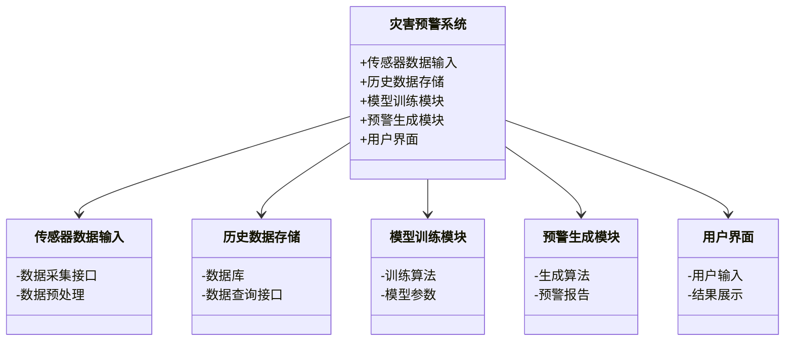
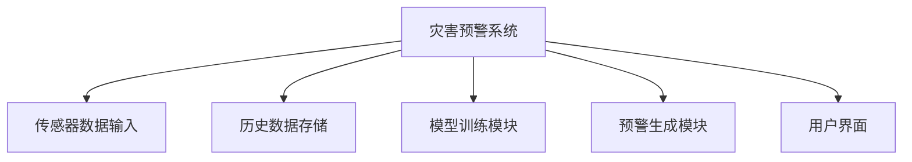
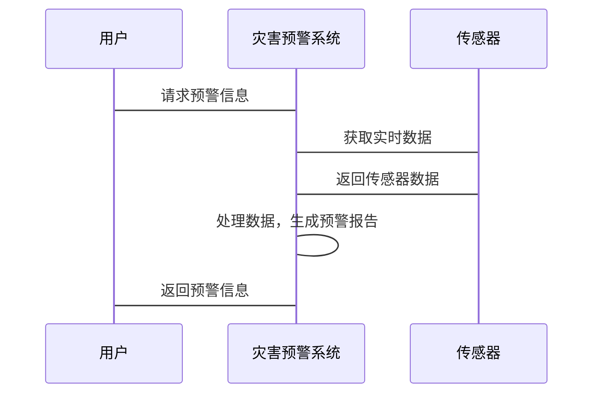

                 


# AIGC在智能灾害预警系统优化中的应用实践

## 关键词：AIGC, 智能灾害预警系统, 人工智能, 灾害预警优化, 系统架构设计

## 摘要：  
本文深入探讨了AIGC（AI-Generated Content）在智能灾害预警系统优化中的应用实践。通过分析灾害预警系统面临的挑战，结合AIGC的核心概念和技术原理，详细阐述了其在优化灾害预警系统中的关键作用。文章从系统设计、算法实现、项目实战等多个维度展开，展示了AIGC如何通过智能化手段提升灾害预警的效率和准确性，为灾害预防和应急响应提供了新的思路和解决方案。

---

# 第一部分：AIGC基础

## 第1章 AIGC简介

### 1.1 AIGC的概念与历史  
AIGC（AI-Generated Content）是指利用人工智能技术生成内容的过程。它涵盖了从文本生成到图像生成等多种形式，其核心在于通过算法模拟人类的创造力和决策能力。AIGC的历史可以追溯到20世纪50年代，随着深度学习技术的发展，AIGC在近年来取得了突破性进展。  

### 1.2 AIGC的技术原理  
AIGC的技术基础主要包括自然语言处理（NLP）、生成对抗网络（GAN）、变换器（Transformer）等。其工作原理通常包括以下几个步骤：  
1. **数据输入**：系统接收原始数据（如传感器数据、历史灾害记录等）。  
2. **特征提取**：通过模型提取数据中的关键特征。  
3. **内容生成**：基于提取的特征，生成新的内容（如预测报告、预警信息等）。  
4. **优化与反馈**：通过不断优化生成的内容，提高准确性和实用性。  

### 1.3 AIGC的发展与应用前景  
AIGC技术正在快速渗透到各个领域，尤其是在灾害预警、医疗诊断、金融分析等领域展现出巨大的潜力。随着算法的不断优化和计算能力的提升，AIGC将更加智能化，能够处理更复杂的问题，为人类社会带来更大的价值。

---

## 第2章 AIGC在灾害预警中的应用

### 2.1 灾害预警系统现状  
传统的灾害预警系统主要依赖于传感器数据和历史数据分析，存在响应速度慢、精度不足等问题。特别是在面对复杂、多变的自然灾害时，传统的基于规则的系统难以应对突发情况。  

### 2.2 AIGC在灾害预警中的作用  
AIGC可以通过以下方式优化灾害预警系统：  
1. **实时数据分析**：利用AIGC快速处理海量传感器数据，生成实时预警信息。  
2. **预测与模拟**：基于历史数据和模型，预测灾害的发展趋势，提供决策支持。  
3. **智能报告生成**：自动生成灾害预警报告，帮助相关部门快速响应。  

### 2.3 AIGC与传统灾害预警技术的对比  

| **对比维度** | **传统技术** | **AIGC技术** |  
|--------------|---------------|---------------|  
| 数据处理能力 | 依赖人工规则，处理能力有限 | 强大的机器学习模型，能够处理复杂数据 |  
| 响应速度     | 较慢，依赖人工干预 | 实时生成预警信息，响应速度快 |  
| 预测精度     | 精度较低，难以应对复杂情况 | 基于深度学习模型，预测精度高 |  

---

## 第3章 AIGC算法原理与实现

### 3.1 AIGC算法的基本流程  
AIGC算法的基本流程如下：  
1. 数据预处理：清洗和标准化输入数据。  
2. 模型训练：使用训练数据训练生成模型。  
3. 内容生成：根据输入数据生成预警信息。  
4. 优化与反馈：根据实际效果优化模型。  

### 3.2 AIGC算法的Python实现  

```python
import numpy as np
from tensorflow import keras

# 数据预处理
def preprocess_data(data):
    # 标准化处理
    return (data - np.mean(data)) / np.std(data)

# 模型训练
def train_model(train_data, train_labels):
    model = keras.Sequential([
        keras.layers.Dense(128, activation='relu'),
        keras.layers.Dense(1, activation='sigmoid')
    ])
    model.compile(optimizer='adam', loss='binary_crossentropy', metrics=['accuracy'])
    model.fit(train_data, train_labels, epochs=50, batch_size=32)
    return model

# 内容生成
def generate_alert(model, input_data):
    processed_data = preprocess_data(input_data)
    prediction = model.predict(processed_data)
    if prediction > 0.5:
        return "灾害预警：请立即采取措施！"
    else:
        return "无明显风险，建议继续保持监测。"

# 示例应用
if __name__ == "__main__":
    # 假设输入数据为传感器读数
    input_data = np.array([0.8, 0.9, 0.7])
    model = train_model(preprocess_data(input_data), np.array([1]))
    alert = generate_alert(model, input_data)
    print(alert)
```

### 3.3 AIGC算法的数学模型与公式  
AIGC算法的核心是生成对抗网络（GAN），其数学模型如下：  

$$ \text{生成器} (G) \text{的目标函数} = \min_{G} \max_{D} \mathbb{E}_{z \sim p_z}[\log D(G(z))] $$  
$$ \text{判别器} (D) \text{的目标函数} = \min_{D} \mathbb{E}_{x \sim p_x}[\log D(x)] + \mathbb{E}_{z \sim p_z}[\log (1 - D(G(z)))] $$  

其中，$z$ 是生成器的输入噪声，$x$ 是真实数据。  

### 3.4 AIGC算法举例说明  
假设我们有一个地震预警系统，AIGC算法可以通过分析历史地震数据和当前传感器读数，预测未来24小时内可能发生的地震概率。通过训练深度学习模型，系统可以在几秒钟内生成预警报告，帮助相关部门快速响应。

---

# 第二部分：AIGC系统架构设计

## 第4章 系统架构设计概述

### 4.1 系统架构设计原则  
AIGC系统的架构设计应遵循以下原则：  
1. **模块化设计**：将系统划分为独立的模块，便于维护和升级。  
2. **高可用性**：确保系统在部分模块故障时仍能正常运行。  
3. **可扩展性**：支持未来功能的扩展和性能的提升。  

### 4.2 系统架构设计流程  
1. 确定系统目标与需求。  
2. 分析功能模块之间的关系。  
3. 设计模块的交互接口。  
4. 绘制系统架构图并进行验证。  

---

## 第5章 系统功能设计与接口设计

### 5.1 系统功能设计  



### 5.2 系统接口设计  
系统的主要接口包括：  
1. 数据采集接口：从传感器获取实时数据。  
2. 数据查询接口：从历史数据库中获取相关数据。  
3. 模型训练接口：训练生成模型的接口。  
4. 预警生成接口：生成预警信息的接口。  

---

## 第6章 系统架构与交互设计

### 6.1 系统架构设计  



### 6.2 系统交互设计  



---

# 第三部分：项目实战

## 第7章 AIGC环境安装与配置

### 7.1 环境准备  
- 操作系统：建议使用Linux或Windows 10及以上版本。  
- 硬件要求：推荐使用8GB及以上内存，支持GPU加速的设备。  

### 7.2 软件安装  
1. 安装Python 3.8及以上版本。  
2. 安装TensorFlow和Keras库：  
   ```bash
   pip install tensorflow keras
   ```

### 7.3 配置与调试  
- 配置Jupyter Notebook或IDE环境。  
- 确保GPU驱动和CUDA环境已配置。

---

## 第8章 AIGC在灾害预警系统的应用实现

### 8.1 系统核心实现源代码  

```python
import tensorflow as tf
from tensorflow import keras

# 数据生成
def generate_data(num_samples):
    x = np.random.random(num_samples)
    y = np.random.random(num_samples)
    return x, y

# 模型定义
def build_model():
    model = keras.Sequential([
        keras.layers.Dense(64, activation='relu'),
        keras.layers.Dense(1, activation='sigmoid')
    ])
    model.compile(optimizer='adam', loss='binary_crossentropy', metrics=['accuracy'])
    return model

# 训练过程
def train_model(model, x_train, y_train):
    model.fit(x_train, y_train, epochs=50, batch_size=32, verbose=0)

# 预警生成
def generate_alert(model, x_input):
    prediction = model.predict(x_input)
    return "灾害预警！" if prediction > 0.5 else "无明显风险。"

# 示例运行
if __name__ == "__main__":
    x_train, y_train = generate_data(1000)
    model = build_model()
    train_model(model, x_train, y_train)
    x_input = np.array([0.8])
    alert = generate_alert(model, x_input)
    print(alert)
```

### 8.2 代码应用解读与分析  
上述代码实现了AIGC算法的核心功能：数据生成、模型训练和内容生成。通过训练模型，系统能够根据输入数据生成预警信息。  

### 8.3 实际案例分析与详细讲解  
假设我们有一个地震预警系统，传感器每隔5分钟发送一次数据。通过训练模型，系统可以在接收到传感器数据后，快速生成预警信息。例如，当预测概率超过0.5时，系统会触发预警，通知相关部门采取措施。  

---

## 第9章 项目小结与经验总结

### 9.1 项目关键经验  
1. AIGC算法在灾害预警中的应用能够显著提高系统的响应速度和预测精度。  
2. 系统架构设计的模块化和高可用性是确保系统稳定运行的关键。  
3. 数据质量和模型训练的充分性直接影响预警系统的性能。  

### 9.2 注意事项  
- 数据的质量和完整性直接影响模型的性能，需确保数据清洗和预处理的准确性。  
- 系统的安全性和稳定性是保障预警信息准确传递的重要因素。  

### 9.3 拓展阅读  
- Goodfellow, I., Bengio, Y., & Courville, A. (2016). *Deep Learning*.  
- LeCun, Y., Bengio, Y., & Hinton, G. (2015). *Deep learning*. Nature, 521(7555), 436-444.  

---

# 作者：AI天才研究院/AI Genius Institute & 禅与计算机程序设计艺术/Zen And The Art of Computer Programming

