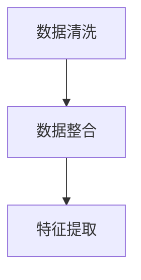
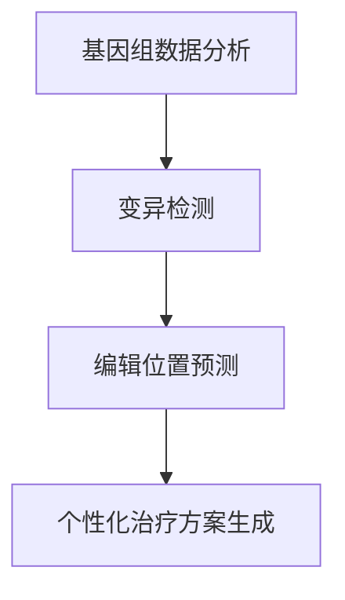
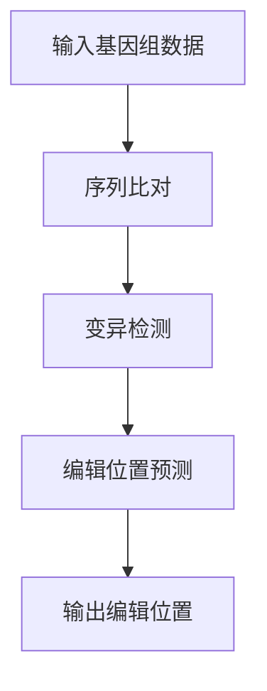
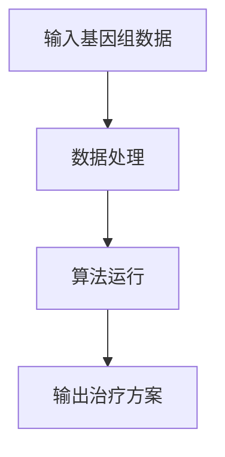

                 


# AIGC驱动的个性化基因治疗方案生成系统

> 关键词：AIGC, 个性化基因治疗, 人工智能, 基因组学, 生物信息学, 系统架构

> 摘要：随着人工智能技术的飞速发展，AIGC（AI-Driven Genome Editing）在基因治疗领域的应用日益广泛。本文探讨了如何利用AIGC技术生成个性化基因治疗方案，重点分析了其背后的算法原理、系统架构以及实际应用场景。文章从基础理论到技术实现，再到应用实践，全面阐述了AIGC驱动的个性化基因治疗方案生成系统的核心概念和实现细节，旨在为相关领域的研究者和从业者提供理论指导和实践参考。

---

## 第一部分：引言

### 1.1 问题的背景与重要性

#### 1.1.1 AIGC技术的发展
人工智能（AI）技术的快速发展为基因治疗带来了新的可能性。AIGC（AI-Driven Genome Editing）通过利用AI算法分析基因组数据，优化基因编辑策略，从而实现更精准的治疗方案。近年来，深度学习和自然语言处理技术的突破为AIGC技术的广泛应用奠定了基础。

#### 1.1.2 基因疗法的现状与挑战
基因疗法是一种通过修改基因组来治疗疾病的方法。尽管取得了显著进展，但传统基因疗法仍面临诸多挑战，如治疗方案的通用性不足、基因编辑的精准性有限以及个体化治疗的需求未得到充分满足。

#### 1.1.3 个性化基因治疗方案的需求
个性化医疗是医学发展的趋势之一。每个人的基因组都是独特的，因此，基于个体基因特征的个性化治疗方案能够显著提高治疗效果和安全性。

---

### 1.2 书籍目的与结构

#### 1.2.1 书籍的主要目标
本文旨在探讨如何利用AIGC技术生成个性化基因治疗方案，分析其背后的算法原理、系统架构以及实际应用场景。

#### 1.2.2 阅读对象
本文适合生物信息学、基因组学、人工智能领域的研究人员、工程师以及对个性化基因治疗感兴趣的读者阅读。

#### 1.2.3 内容结构概述
本文分为四个主要部分：引言、基础理论、技术实现和应用实践。引言部分介绍背景和研究意义；基础理论部分阐述AIGC和个性化基因治疗的基本原理；技术实现部分详细描述系统设计和算法实现；应用实践部分通过案例展示系统实际应用效果。

---

### 1.3 定义与概念

#### 1.3.1 AIGC概念详解
AIGC（AI-Driven Genome Editing）是一种利用人工智能技术辅助基因编辑的方法。通过分析基因组数据，AIGC能够预测基因编辑的最佳位置和策略，从而提高基因治疗的效率和安全性。

#### 1.3.2 个性化基因治疗概念详解
个性化基因治疗是根据患者的基因组特征制定个性化治疗方案。这种治疗方法能够针对患者的具体情况，制定最优化的治疗策略，提高治疗效果和安全性。

#### 1.3.3 相关术语解释
- **基因组数据**：指个体完整的基因序列信息。
- **基因编辑**：通过人工手段对基因组进行修改，以治疗疾病。
- **机器学习**：一种人工智能技术，能够从数据中学习模式并进行预测。

---

### 1.4 研究方法与工具

#### 1.4.1 研究方法
本文采用理论分析与实践相结合的方法，从算法设计、系统实现到实际应用，全面探讨AIGC驱动的个性化基因治疗方案生成系统。

#### 1.4.2 关键工具与平台
- **生物信息学工具**：如BWA、GATK等。
- **机器学习框架**：如TensorFlow、PyTorch。
- **基因编辑工具**：如CRISPR-Cas9。

#### 1.4.3 数据来源与预处理
数据来源包括实验数据和临床数据，预处理步骤包括数据清洗、整合和特征提取。

---

### 1.5 本章小结
本章介绍了AIGC技术的发展、个性化基因治疗的现状与挑战，以及本文的研究目的和结构。通过定义和概念的阐述，为后续章节的分析奠定了基础。

---

## 第二部分：基础理论

### 2.1 AIGC原理详解

#### 2.1.1 AIGC工作原理
AIGC通过分析基因组数据，利用机器学习算法预测基因编辑的最佳位置和策略。其核心算法包括序列比对、变异检测和编辑位置预测。

#### 2.1.2 AIGC的核心算法
- **序列比对算法**：如BLAS和FASTA，用于将基因组数据与参考序列进行比对。
- **变异检测算法**：如GATK和FreeBayes，用于检测基因组中的变异位点。
- **编辑位置预测算法**：基于机器学习的模型，预测基因编辑的最佳位置。

#### 2.1.3 AIGC的优势与应用
AIGC的优势在于高效性、精准性和个性化。其应用包括癌症治疗、遗传病治疗和基因修复。

---

### 2.2 个性化基因治疗理论

#### 2.2.1 个性化基因治疗概述
个性化基因治疗是根据患者的基因组特征制定个性化治疗方案。其核心在于精准诊断和精准治疗。

#### 2.2.2 个性化基因治疗的原理
个性化基因治疗的原理是通过分析患者的基因组数据，找出致病基因或易感基因，进而制定针对性的治疗方案。

#### 2.2.3 个性化基因治疗的类型与策略
个性化基因治疗的类型包括基因替代疗法、基因修复疗法和基因编辑疗法。其策略包括单基因治疗和多基因治疗。

---

### 2.3 基因组学基础

#### 2.3.1 基因组结构与功能
基因组是生物遗传信息的载体，由DNA序列组成。基因组结构包括编码区和非编码区，编码区负责编码蛋白质，非编码区负责调控基因表达。

#### 2.3.2 基因表达调控机制
基因表达调控机制包括转录调控和翻译调控。转录调控通过启动子和增强子调控基因的转录过程，翻译调控通过mRNA的结构调控蛋白质的合成。

#### 2.3.3 基因变异与疾病
基因变异可能导致蛋白质功能异常，进而引发疾病。常见的基因变异包括点突变、插入和缺失。

---

### 2.4 相关领域知识

#### 2.4.1 计算生物学基础
计算生物学是利用计算机技术研究生物问题的学科。其主要应用包括基因组数据分析、蛋白质结构预测和药物设计。

#### 2.4.2 机器学习在基因治疗中的应用
机器学习在基因治疗中的应用包括基因组数据分析、疾病预测和治疗方案优化。

#### 2.4.3 生物信息学工具与数据库
生物信息学工具包括BLAST、BWA、GATK等。数据库包括NCBI、UCSC等。

---

### 2.5 算法原理与模型

#### 2.5.1 算法设计原则
算法设计原则包括准确性、效率和可解释性。准确的算法能够正确预测基因编辑位置，高效的算法能够在短时间内处理大量数据，可解释的算法能够帮助研究人员理解基因编辑的机制。

#### 2.5.2 模型构建与优化
模型构建包括数据预处理、特征选择和模型训练。模型优化包括参数调优和模型评估。

#### 2.5.3 算法评估与比较
算法评估指标包括准确率、召回率和F1值。通过比较不同算法的性能，选择最优算法。

---

### 2.6 本章小结
本章详细介绍了AIGC的核心算法、个性化基因治疗的理论基础以及基因组学的基本知识。通过这些理论的阐述，为后续技术实现奠定了基础。

---

## 第三部分：技术实现

### 3.1 系统设计

#### 3.1.1 系统架构设计

##### 3.1.1.1 整体架构
系统架构包括数据输入模块、数据处理模块、算法模块和结果输出模块。

##### 3.1.1.2 功能模块划分
- **数据输入模块**：接收基因组数据和临床数据。
- **数据处理模块**：对数据进行清洗、整合和特征提取。
- **算法模块**：包括序列比对、变异检测和编辑位置预测算法。
- **结果输出模块**：输出个性化治疗方案。

#### 3.1.2 技术选型与实现

##### 3.1.2.1 AIGC算法实现
AIGC算法实现包括序列比对、变异检测和编辑位置预测。以下是Python代码示例：

```python
def sequence_alignment(reads, reference):
    # 实现序列比对算法
    pass

def variant_detection(reads, reference):
    # 实现变异检测算法
    pass

def edit_prediction(variants, target_gene):
    # 实现编辑位置预测算法
    pass
```

##### 3.1.2.2 数据处理流程
数据处理流程包括数据清洗、整合和特征提取。以下是数据处理流程图：



##### 3.1.2.3 个性化治疗方案生成
个性化治疗方案生成包括治疗方案设计和效果评估。以下是个性化治疗方案生成流程：



---

### 3.2 数据处理

#### 3.2.1 数据采集

##### 3.2.1.1 实验数据来源
实验数据包括基因组测序数据和转录组测序数据。

##### 3.2.1.2 临床数据来源
临床数据包括患者的临床特征和疾病信息。

#### 3.2.2 数据预处理

##### 3.2.2.1 数据清洗
数据清洗包括去除低质量数据和修复数据错误。

##### 3.2.2.2 数据整合
数据整合包括将不同来源的数据整合到统一的数据格式。

##### 3.2.2.3 特征提取
特征提取包括从基因组数据中提取关键特征，如突变位点和基因表达水平。

---

### 3.3 算法实现

#### 3.3.1 AIGC算法详细实现

##### 3.3.1.1 算法流程图
以下是AIGC算法流程图：



##### 3.3.1.2 Python代码示例
以下是Python代码示例：

```python
def sequence_alignment(reads, reference):
    # 实现序列比对算法
    pass

def variant_detection(reads, reference):
    # 实现变异检测算法
    pass

def edit_prediction(variants, target_gene):
    # 实现编辑位置预测算法
    pass
```

##### 3.3.1.3 数学模型与公式
以下是数学模型与公式：

$$
\text{编辑位置预测} = \argmax_{i} P(i | \text{基因组数据})
$$

---

#### 3.3.2 个性化治疗方案生成算法

##### 3.3.2.1 算法原理
个性化治疗方案生成算法基于机器学习模型，根据患者的基因组特征生成个性化治疗方案。

##### 3.3.2.2 代码实现
以下是Python代码示例：

```python
def generate_treatment_plan(patient_genome, model):
    # 根据患者基因组和模型生成治疗方案
    pass
```

##### 3.3.2.3 数学模型与公式
以下是数学模型与公式：

$$
\text{治疗方案} = f(\text{患者基因组}, \text{模型参数})
$$

---

### 3.4 系统部署与运行

#### 3.4.1 系统部署

##### 3.4.1.1 部署环境配置
系统部署环境包括计算资源和存储资源。计算资源包括CPU和GPU，存储资源包括磁盘和云存储。

##### 3.4.1.2 部署流程
部署流程包括安装依赖、配置环境和启动服务。

#### 3.4.2 系统运行

##### 3.4.2.1 运行步骤
系统运行步骤包括数据输入、数据处理、算法运行和结果输出。

##### 3.4.2.2 运行效果评估
系统运行效果评估包括准确率、召回率和运行时间。

---

### 3.5 本章小结
本章详细介绍了系统设计、数据处理、算法实现和系统部署。通过技术实现的详细阐述，为后续应用实践奠定了基础。

---

## 第四部分：应用实践

### 4.1 实际案例研究

#### 4.1.1 案例背景
案例背景包括患者基因组数据和临床数据。以下是患者基因组数据的示例：

| 基因 | 突变位点 | 突变类型 |
|------|----------|----------|
| BRCA1 | 1234     | 点突变    |

#### 4.1.2 案例目标
案例目标是生成个性化基因治疗方案。通过分析患者的基因组数据，制定最佳的基因编辑策略。

#### 4.1.3 案例实施过程
案例实施过程包括数据处理、算法运行和结果输出。以下是案例实施流程图：



---

### 4.2 个性化基因治疗方案生成

#### 4.2.1 治疗方案生成流程
治疗方案生成流程包括基因组数据分析、变异检测、编辑位置预测和个性化治疗方案生成。

#### 4.2.2 生成方案的特点与优势
个性化治疗方案的特点包括精准性、个性化和高效性。其优势在于能够根据患者的具体情况制定最优治疗方案。

#### 4.2.3 案例分析与解读
以下是案例分析与解读的示例：

- 患者基因组数据中发现BRCA1基因存在点突变，算法预测最佳编辑位置为突变位点下游100bp处。
- 根据预测结果，生成个性化治疗方案，包括基因编辑策略和治疗计划。

---

### 4.3 本章小结
本章通过实际案例研究，详细展示了AIGC驱动的个性化基因治疗方案生成系统的应用实践。通过案例分析，验证了系统的有效性和准确性。

---

## 作者：AI天才研究院/AI Genius Institute & 禅与计算机程序设计艺术/Zen And The Art of Computer Programming

---

通过本文的系统阐述，我们全面探讨了AIGC驱动的个性化基因治疗方案生成系统的核心概念、算法原理和实际应用。希望本文能够为相关领域的研究者和从业者提供理论指导和实践参考。

