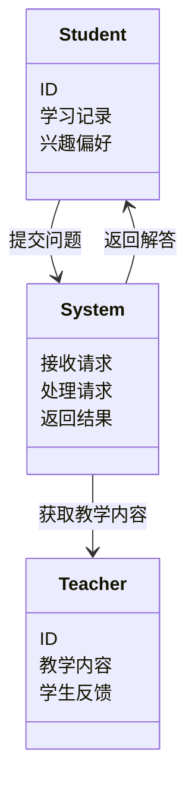
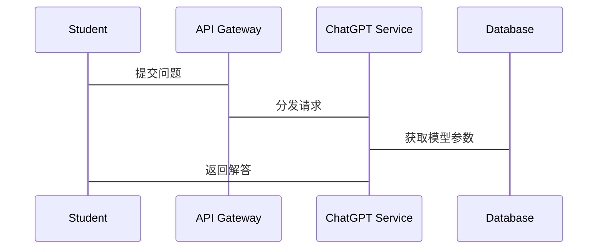

                 


# ChatGPT在教育中的应用：思维链的重要性

> 关键词：ChatGPT、教育应用、思维链、自然语言处理、教学辅助

> 摘要：本文探讨了ChatGPT在教育领域的广泛应用，重点分析了思维链在教育中的重要性。通过详细的技术分析和实际案例，展示了ChatGPT如何通过自然语言处理技术提升教学效果，优化教育资源，并促进教育公平。文章从技术原理、系统架构到项目实战，全面解析了ChatGPT在教育中的应用场景和实现方法，为教育技术的创新提供了新的视角。

---

## 第一部分：引言与背景

### 第1章：问题背景与核心概念

#### 1.1 问题背景
随着人工智能技术的快速发展，教育领域正在经历一场技术驱动的变革。传统的教学模式逐渐被智能化、个性化的教育工具所取代。ChatGPT作为一种基于自然语言处理（NLP）的智能对话系统，凭借其强大的生成能力和理解能力，正在教育领域发挥重要作用。然而，如何充分利用ChatGPT的能力，特别是在教育中的思维链构建方面，仍是一个值得深入研究的课题。

#### 1.2 ChatGPT的基本原理
ChatGPT基于GPT（Generative Pre-trained Transformer）系列模型，通过大规模预训练数据，掌握了大量的语言模式和知识。其核心在于通过Transformer架构实现高效的序列建模，能够生成连贯且符合语境的文本内容。ChatGPT不仅能够理解用户输入的问题，还能通过上下文推理生成合理的回答。

#### 1.3 思维链的概念与重要性
思维链是指在解决问题或学习过程中，人脑中一系列逻辑推理和知识关联的链条。在教育中，思维链的构建能够帮助学生更好地理解知识之间的联系，提升问题解决能力。ChatGPT通过模拟人类的思维过程，能够辅助学生构建和优化思维链，从而提高学习效果。

---

### 第2章：ChatGPT在教育中的应用场景

#### 2.1 教学辅助
##### 2.1.1 个性化辅导
ChatGPT可以根据学生的学习情况和需求，提供个性化的辅导服务。例如，学生在学习数学时遇到难题，ChatGPT可以通过对话形式逐步引导学生解决问题，帮助其建立正确的思维链。

##### 2.1.2 自动批改作业
ChatGPT可以用于自动批改学生的作业，例如作文、数学题等。通过自然语言处理技术，ChatGPT能够识别答案的正确性，并提供详细的反馈和改进建议。

##### 2.1.3 智能答疑系统
ChatGPT可以作为智能答疑系统，为学生提供即时的问题解答。无论是在课堂上还是课后，学生都可以通过ChatGPT快速获取所需的知识点解释和解题思路。

#### 2.2 教育资源优化
##### 2.2.1 个性化推荐
ChatGPT可以根据学生的学习进度和兴趣，推荐适合的学习资源，例如教材、视频课程等。这种个性化的推荐能够显著提升学习效率。

##### 2.2.2 教学内容生成
ChatGPT可以辅助教师生成教学内容，例如课程大纲、教学案例等。通过自然语言处理技术，ChatGPT能够快速生成高质量的教学材料，减轻教师的工作负担。

##### 2.2.3 教学视频字幕生成
ChatGPT可以用于生成教学视频的字幕，帮助学生更好地理解和学习视频内容。通过自动识别视频内容，ChatGPT能够生成准确的中英文字幕。

#### 2.3 教育公平性提升
##### 2.3.1 辅助特殊教育
ChatGPT可以为特殊教育学生提供个性化的学习支持。例如，对于视觉障碍的学生，ChatGPT可以通过语音交互提供帮助；对于语言障碍的学生，可以通过图像识别技术辅助学习。

##### 2.3.2 提高教育普及率
ChatGPT可以通过在线教育平台，将优质教育资源普及到偏远地区。无论学生身处何地，都可以通过ChatGPT获取高质量的学习资源和支持。

---

### 第3章：思维链在教育中的关键作用

#### 3.1 思维链的定义与特征
思维链是指在学习过程中，学生通过一系列逻辑推理和知识关联，逐步解决问题的过程。其关键特征包括：

- **连贯性**：思维链中的每个步骤都紧密相连，形成完整的逻辑链条。
- **可扩展性**：思维链可以根据问题的复杂性进行扩展，适用于不同难度的学习任务。
- **可优化性**：通过不断优化思维链，学生可以提升问题解决能力。

#### 3.2 思维链在教育中的应用
##### 3.2.1 提升思维能力
通过ChatGPT的引导，学生可以逐步构建和优化思维链，从而提升逻辑推理能力和问题解决能力。

##### 3.2.2 促进知识构建
思维链的构建可以帮助学生更好地理解知识之间的联系，促进知识的内化和迁移。

##### 3.2.3 增强学习效果
通过优化思维链，学生可以更高效地掌握知识点，提升学习效果。

---

### 第4章：ChatGPT与思维链技术基础

#### 4.1 自然语言处理基础
##### 4.1.1 词向量与语义表示
自然语言处理中的词向量（Word Embedding）是将词语表示为向量的一种技术。通过词向量，计算机可以理解词语的语义关系。例如，使用Word2Vec或GloVe模型可以生成词语的向量表示。

##### 4.1.2 语言模型与生成模型
语言模型（Language Model）用于预测下一个词的概率分布，而生成模型（Generative Model）则基于语言模型生成新的文本内容。ChatGPT采用了基于Transformer的生成模型，能够生成高质量的文本。

##### 4.1.3 思维链模型
思维链模型通过构建一系列逻辑推理步骤，模拟人类的思维过程。在教育中，思维链模型可以用于帮助学生理解问题的解决过程。

#### 4.2 思维链模型介绍
##### 4.2.1 GLM模型
GLM（Generative Language Model）是一种基于Transformer的生成模型，能够生成连贯且符合语境的文本内容。GLM模型通过预训练掌握了大量的语言模式和知识，可以用于教育中的多种应用场景。

##### 4.2.2 Instruction Tuning
Instruction Tuning是一种针对特定任务的微调技术，通过在特定领域数据上的微调，提升模型在特定任务上的性能。例如，可以通过Instruction Tuning优化ChatGPT在教育领域的表现。

##### 4.2.3 Code Tuning
Code Tuning是一种针对代码生成任务的微调技术，通过在代码数据上的微调，提升模型生成代码的能力。这种技术可以用于教育中的编程教学场景。

---

### 第5章：ChatGPT在教育应用中的实现

#### 5.1 环境准备与安装
要实现ChatGPT在教育中的应用，首先需要搭建合适的开发环境。以下是具体的步骤：

1. 安装Python：选择一个适合的Python版本（推荐使用Python 3.6及以上）。
2. 安装必要的库：安装如`transformers`、`torch`等库，这些库是实现自然语言处理模型的基础。
3. 下载预训练模型：可以从Hugging Face的模型仓库中下载适合的GPT模型。
4. 配置运行环境：确保GPU和相关驱动程序已安装，以便高效运行模型。

#### 5.2 教学辅导系统实现
##### 5.2.1 系统设计
教学辅导系统的功能设计包括以下几个方面：

- **用户界面**：提供友好的对话界面，方便学生与系统交互。
- **问题识别**：通过自然语言处理技术，识别学生的问题类型。
- **思维链构建**：根据问题类型，生成相应的思维链，引导学生解决问题。
- **结果反馈**：根据学生回答，提供即时反馈和建议。

##### 5.2.2 代码实现
以下是基于Python的代码示例，展示如何实现教学辅导系统的核心功能：

```python
from transformers import GPT2LMHeadModel, GPT2Tokenizer

# 初始化模型和分词器
model_name = "gpt2"
model = GPT2LMHeadModel.from_pretrained(model_name)
tokenizer = GPT2Tokenizer.from_pretrained(model_name)

# 定义思维链构建函数
def build_thinking_chain(question):
    input_ids = tokenizer.encode(question, return_tensors="pt")
    outputs = model.generate(input_ids, max_length=50, num_return_sequences=1)
    response = tokenizer.decode(outputs[0], skip_special_tokens=True)
    return response

# 示例：学生问题"如何解这个数学题：x² + 2x + 1 = 0"
student_question = "如何解这个数学题：x² + 2x + 1 = 0"
response = build_thinking_chain(student_question)
print(response)
```

##### 5.2.3 系统测试与优化
在系统开发过程中，需要进行充分的测试和优化。例如，可以通过测试不同类型的数学题，验证系统是否能够生成正确的解答步骤。同时，还可以通过收集用户反馈，不断优化系统的交互体验。

#### 5.3 教育资源优化实现
##### 5.3.1 个性化推荐系统
个性化推荐系统基于学生的学习数据和兴趣，推荐适合的学习资源。以下是其实现的简要步骤：

1. **数据收集**：收集学生的学习记录、兴趣偏好等数据。
2. **数据处理**：对数据进行清洗和预处理，提取关键特征。
3. **推荐算法**：使用协同过滤或基于内容的推荐算法，生成推荐列表。
4. **结果展示**：通过用户友好的界面，展示推荐结果。

##### 5.3.2 教学内容生成系统
教学内容生成系统可以通过自然语言处理技术，自动生成高质量的教学材料。以下是其实现的简要步骤：

1. **输入需求**：用户输入教学主题和相关要求。
2. **内容生成**：模型根据输入生成教学大纲、案例分析等内容。
3. **内容优化**：对生成的内容进行校对和优化，确保准确性和可读性。

---

### 第6章：系统分析与架构设计方案

#### 6.1 问题场景介绍
在教育领域，学生需要一个能够提供个性化支持和高效学习工具的系统。ChatGPT可以作为核心模块，集成到教学管理系统中，为学生和教师提供多种教育服务。

#### 6.2 项目介绍
本项目旨在开发一个基于ChatGPT的教学辅助系统，通过自然语言处理技术，优化教育资源的配置和利用。系统主要包括教学辅导、资源推荐和思维链优化三大功能模块。

#### 6.3 系统功能设计
##### 6.3.1 领域模型设计
以下是系统功能的领域模型设计：



##### 6.3.2 系统架构设计
以下是系统的总体架构设计：


##### 6.3.3 系统接口设计
以下是系统的接口设计：



---

### 第7章：项目实战

#### 7.1 环境安装
以下是项目实战所需的环境安装步骤：

1. **安装Python**：确保安装了Python 3.6及以上版本。
2. **安装库依赖**：使用以下命令安装所需的库：
   ```bash
   pip install transformers torch
   ```

#### 7.2 代码实现
以下是教学辅导系统的核心代码实现：

```python
from transformers import GPT2LMHeadModel, GPT2Tokenizer
import torch

# 初始化模型和分词器
model_name = "gpt2"
model = GPT2LMHeadModel.from_pretrained(model_name)
tokenizer = GPT2Tokenizer.from_pretrained(model_name)

# 定义问题解决函数
def solve_problem(question):
    input_ids = tokenizer.encode(question, return_tensors="pt")
    outputs = model.generate(input_ids, max_length=50, num_return_sequences=1)
    response = tokenizer.decode(outputs[0], skip_special_tokens=True)
    return response

# 示例：学生问题"如何解这个数学题：x² + 2x + 1 = 0"
student_question = "如何解这个数学题：x² + 2x + 1 = 0"
response = solve_problem(student_question)
print(response)
```

#### 7.3 代码解读与分析
上述代码实现了基于GPT-2模型的数学题解答功能。系统接收学生的问题后，通过自然语言处理技术生成解答步骤，并返回给学生。这种实现方式简单高效，能够快速响应学生的需求。

#### 7.4 系统测试与优化
在系统测试阶段，可以通过以下步骤进行优化：

1. **模型调优**：通过微调模型，优化其在教育领域的表现。
2. **用户体验优化**：根据用户反馈，优化系统的交互流程和界面设计。
3. **性能优化**：通过优化代码和配置，提升系统的运行效率。

---

### 第8章：挑战与未来方向

#### 8.1 当前挑战
尽管ChatGPT在教育中的应用前景广阔，但仍然面临一些挑战：

- **模型的可解释性**：如何让学生理解模型的推理过程。
- **数据隐私**：如何保护学生的学习数据隐私。
- **模型的持续更新**：如何保持模型的知识更新和准确性。

#### 8.2 未来方向
未来，随着人工智能技术的进一步发展，ChatGPT在教育中的应用将更加广泛和深入。以下是未来的发展方向：

- **智能化学习助手**：开发更加智能化的学习助手，能够实时响应学生的需求。
- **个性化学习路径**：通过数据分析，为学生制定个性化的学习路径。
- **跨学科应用**：将ChatGPT应用于多个学科领域，推动教育的全面智能化。

---

## 第二部分：小结与展望

### 第9章：小结
ChatGPT作为一种强大的自然语言处理工具，在教育领域具有广泛的应用潜力。通过构建思维链，ChatGPT能够帮助学生提升思维能力、优化知识结构，并提高学习效果。在系统实现方面，基于ChatGPT的教学辅助系统可以通过个性化的教学支持和智能化的资源优化，显著提升教育质量和效率。

### 第10章：展望
未来，随着人工智能技术的不断进步，ChatGPT在教育中的应用将更加智能化和个性化。通过结合大数据分析和机器学习技术，教育系统将能够更好地满足学生的学习需求，推动教育的全面数字化和智能化。

---

## 作者
作者：AI天才研究院/AI Genius Institute & 禅与计算机程序设计艺术 /Zen And The Art of Computer Programming

