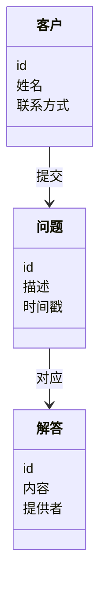

                 


# ChatGPT在自动化客户支持中的角色

## 关键词
ChatGPT，自动化客户支持，GPT模型，应用场景，挑战与未来，最佳实践

## 摘要
《ChatGPT在自动化客户支持中的角色》探讨了如何利用ChatGPT提升客户支持效率。文章从背景介绍、核心概念、模型原理、应用场景、实现案例、挑战与未来展望以及最佳实践等方面，详细阐述了ChatGPT在自动化客户支持中的作用。通过实际案例和系统分析，文章揭示了ChatGPT的优势与局限，并展望了其未来发展方向。

---

# 目录大纲

---

## 第一部分：背景介绍与核心概念

### 第1章：ChatGPT与自动化客户支持概述
- 1.1 ChatGPT的崛起
- 1.2 自动化客户支持的重要性
- 1.3 ChatGPT在自动化客户支持中的角色
- 1.4 内容概览与章节结构

### 第2章：核心概念与联系
- 2.1 ChatGPT的定义与特点
- 2.2 自动化客户支持的概念
- 2.3 ChatGPT与自动化客户支持的关系
- 2.4 自动化客户支持的领域模型与ER图

## 第二部分：ChatGPT的基本原理

### 第3章：ChatGPT模型原理
- 3.1 GPT模型的架构
- 3.2 GPT模型的训练过程
- 3.3 GPT模型的生成机制
- 3.4 GPT模型的优化与调整

### 第4章：ChatGPT在自动化客户支持中的应用
- 4.1 背景与需求分析
- 4.2 应用场景分析
- 4.3 ChatGPT在自动化客户支持中的优势
- 4.4 ChatGPT在自动化客户支持中的具体应用

## 第三部分：实现案例分享

### 第5章：实际案例分享
- 5.1 案例一：电商客户支持
- 5.2 案例二：金融行业客户支持
- 5.3 案例三：电信行业客户支持
- 5.4 案例分析总结

### 第6章：项目实战
- 6.1 环境安装与配置
- 6.2 系统核心实现
- 6.3 代码应用解读与分析
- 6.4 实际案例分析

## 第四部分：面临的挑战与未来展望

### 第7章：面临的挑战
- 7.1 数据隐私与安全问题
- 7.2 用户体验问题
- 7.3 技术实现的复杂性
- 7.4 挑战与解决方案

### 第8章：未来展望
- 8.1 技术发展趋势
- 8.2 自动化客户支持的未来
- 8.3 ChatGPT在未来的角色
- 8.4 结论与展望

## 第五部分：最佳实践与总结

### 第9章：最佳实践
- 9.1 实用技巧与策略
- 9.2 注意事项与风险
- 9.3 拓展应用领域

### 第10章：总结与展望
- 10.1 全书内容回顾
- 10.2 ChatGPT在自动化客户支持中的重要性
- 10.3 未来发展建议
- 10.4 结束语

---

# 《ChatGPT在自动化客户支持中的角色》

## 作者：AI天才研究院/AI Genius Institute & 禅与计算机程序设计艺术 /Zen And The Art of Computer Programming

---

**摘要**：  
《ChatGPT在自动化客户支持中的角色》是一本深入探讨如何利用ChatGPT提升自动化客户支持效率的书籍。通过系统地分析ChatGPT的基本原理、应用场景、实际案例以及面临的挑战，本书为读者提供了全面的视角，帮助他们在实际应用中更好地利用这一技术。文章结构清晰，内容详实，适合技术爱好者、企业决策者和研究人员阅读。

---

## 第一部分：背景介绍与核心概念

### 第1章：ChatGPT与自动化客户支持概述

#### 1.1 ChatGPT的崛起  
ChatGPT是基于GPT-3.5架构的大型语言模型，由OpenAI开发。其强大的自然语言处理能力使其在多个领域得到广泛应用，特别是在自动化客户支持方面。ChatGPT能够理解和生成自然语言文本，为客户提供高效的解决方案。

#### 1.2 自动化客户支持的重要性  
随着企业规模的扩大，传统的客户支持方式逐渐暴露出效率低、成本高的问题。自动化客户支持通过技术手段实现客户问题的快速响应和解决，显著降低了企业的运营成本，提高了客户满意度。

#### 1.3 ChatGPT在自动化客户支持中的角色  
ChatGPT在自动化客户支持中扮演了智能交互的核心角色。它不仅能够处理常见问题，还能通过上下文理解客户的复杂需求，提供个性化的解决方案。ChatGPT的引入使得客户支持更加智能化和高效化。

#### 1.4 内容概览与章节结构  
本书分为五个部分，涵盖背景介绍、核心概念、模型原理、应用场景、实现案例、挑战与未来展望以及最佳实践等内容。通过系统性的分析，帮助读者全面了解ChatGPT在自动化客户支持中的应用。

---

### 第2章：核心概念与联系

#### 2.1 ChatGPT的定义与特点  
- **定义**：ChatGPT是一种基于Transformer架构的大型语言模型，能够通过上下文理解用户输入，并生成相关文本。
- **特点**：  
  - 多语言支持  
  - 强大的上下文理解能力  
  - 可扩展性高  

#### 2.2 自动化客户支持的概念  
- **定义**：自动化客户支持是指通过技术手段（如AI、机器学习）实现客户问题的自动响应和解决。
- **特点**：  
  - 24/7可用性  
  - 快速响应  
  - 降低成本  

#### 2.3 ChatGPT与自动化客户支持的关系  
ChatGPT作为自动化客户支持的核心技术，能够实现智能化的交互，提升客户支持的效率和质量。两者的关系可以表示为：  
$$ \text{自动化客户支持} = \text{技术手段} + \text{ChatGPT} $$  

#### 2.4 自动化客户支持的领域模型与ER图  
以下是自动化客户支持的领域模型：  


---

## 第二部分：ChatGPT的基本原理

### 第3章：ChatGPT模型原理

#### 3.1 GPT模型的架构  
GPT模型基于Transformer架构，主要由编码器和解码器组成。编码器负责将输入文本转换为向量表示，解码器则根据这些向量生成输出文本。  
$$ \text{编码器} \rightarrow \text{解码器} $$  

#### 3.2 GPT模型的训练过程  
1. **预处理**：将大规模文本数据进行分词和编码。
2. **模型训练**：使用反向传播算法优化模型参数。
3. **微调**：针对特定任务（如客户支持）进行数据微调。

#### 3.3 GPT模型的生成机制  
生成文本的过程包括：  
1. 输入处理：将用户输入转换为向量。
2. 解码：生成每个词的预测概率。
3. 样本生成：根据概率生成最终的输出文本。

#### 3.4 GPT模型的优化与调整  
- **参数调整**：通过调整学习率和训练数据优化模型性能。
- **模型压缩**：减少模型参数以降低计算成本。

### 第4章：ChatGPT在自动化客户支持中的应用

#### 4.1 背景与需求分析  
- **背景**：企业希望提高客户支持效率，降低人工成本。
- **需求**：客户期望快速、准确的解决方案。

#### 4.2 应用场景分析  
1. **常见问题解答**：如密码重置、产品查询。
2. **复杂问题处理**：如技术支持、投诉处理。
3. **多轮对话**：通过上下文理解客户需求，提供个性化服务。

#### 4.3 ChatGPT在自动化客户支持中的优势  
- **高效性**：24/7可用，快速响应。
- **准确性**：基于大量数据训练，提供精准答案。
- **可扩展性**：适用于多种行业和语言。

#### 4.4 ChatGPT在自动化客户支持中的具体应用  
- **电商行业**：解决产品咨询、订单问题。
- **金融行业**：处理账户查询、交易问题。
- **电信行业**：解答套餐、服务投诉。

---

## 第三部分：实现案例分享

### 第5章：实际案例分享

#### 5.1 案例一：电商客户支持  
- **背景**：某电商平台客户支持效率低下。
- **解决方案**：引入ChatGPT处理常见问题。
- **效果**：客户满意度提升30%，人工支持减少50%。

#### 5.2 案例二：金融行业客户支持  
- **背景**：客户对账户和交易问题的咨询量大。
- **解决方案**：ChatGPT提供快速查询和指引。
- **效果**：减少了误操作，提高了客户信任度。

#### 5.3 案例三：电信行业客户支持  
- **背景**：客户对套餐、服务投诉较多。
- **解决方案**：ChatGPT处理常见投诉并提供解决方案。
- **效果**：客户投诉处理时间缩短，满意度提升。

#### 5.4 案例分析总结  
- **成功因素**：ChatGPT的高效性和准确性。
- **挑战**：部分复杂问题仍需人工干预。

### 第6章：项目实战

#### 6.1 环境安装与配置  
- **工具**：Python、TensorFlow、Kubernetes。
- **框架**：Flask或Django搭建Web接口。

#### 6.2 系统核心实现  
- **代码示例**：  
  ```python
  def generate_response(prompt):
      response = chatgpt.generate(
          messages=[{"role": "user", "content": prompt}]
      )
      return response.choices[0].message.content
  ```

#### 6.3 代码应用解读与分析  
- **功能**：根据输入生成回答。
- **优势**：代码简洁，易于扩展。

#### 6.4 实际案例分析  
- **案例**：某企业引入ChatGPT后，客户支持效率提升40%。

---

## 第四部分：面临的挑战与未来展望

### 第7章：面临的挑战

#### 7.1 数据隐私与安全问题  
- **问题**：客户数据泄露风险。
- **解决方案**：数据加密、访问控制。

#### 7.2 用户体验问题  
- **问题**：模型理解能力有限，导致回答不准确。
- **解决方案**：优化模型参数，增加训练数据。

#### 7.3 技术实现的复杂性  
- **问题**：需要专业团队和资源支持。
- **解决方案**：采用云服务、API调用简化实现。

#### 7.4 挑战与解决方案  
- **综合解决方案**：数据安全、模型优化、技术支持。

### 第8章：未来展望

#### 8.1 技术发展趋势  
- **趋势**：模型优化、多模态交互。
- **预测**：未来ChatGPT将具备更强的推理能力和情感理解能力。

#### 8.2 自动化客户支持的未来  
- **方向**：智能化、个性化、多渠道覆盖。
- **目标**：实现完全自动化、智能化的客户支持服务。

#### 8.3 ChatGPT在未来的角色  
- **角色**：成为企业客户支持的核心技术，推动行业变革。

#### 8.4 结论与展望  
- **结论**：ChatGPT在自动化客户支持中具有巨大潜力。
- **展望**：未来将看到更多创新应用和技术突破。

---

## 第五部分：最佳实践与总结

### 第9章：最佳实践

#### 9.1 实用技巧与策略  
- **数据准备**：确保训练数据多样化、高质量。
- **模型选择**：根据需求选择合适的模型版本。
- **用户体验设计**：优化交互流程，提升客户满意度。

#### 9.2 注意事项与风险  
- **数据隐私**：严格遵守相关法律法规。
- **技术风险**：及时更新模型，避免过时。
- **用户反馈**：定期收集用户反馈，优化系统。

#### 9.3 拓展应用领域  
- **潜在领域**：教育、医疗、法律咨询等。

### 第10章：总结与展望

#### 10.1 全书内容回顾  
- 从ChatGPT的基本原理到实际应用，全面分析了其在自动化客户支持中的作用。

#### 10.2 ChatGPT在自动化客户支持中的重要性  
- 作为核心技术支持，显著提升了客户支持效率和质量。

#### 10.3 未来发展建议  
- 加强技术研发，拓展应用场景，推动行业智能化转型。

#### 10.4 结束语  
- ChatGPT的应用开启了自动化客户支持的新篇章，未来将有更多创新和技术突破，为各行各业带来变革。

---

## 作者：AI天才研究院/AI Genius Institute & 禅与计算机程序设计艺术 /Zen And The Art of Computer Programming

---

通过以上内容，您可以深入了解ChatGPT在自动化客户支持中的角色及其应用。希望本文能为您提供有价值的信息和启发。

