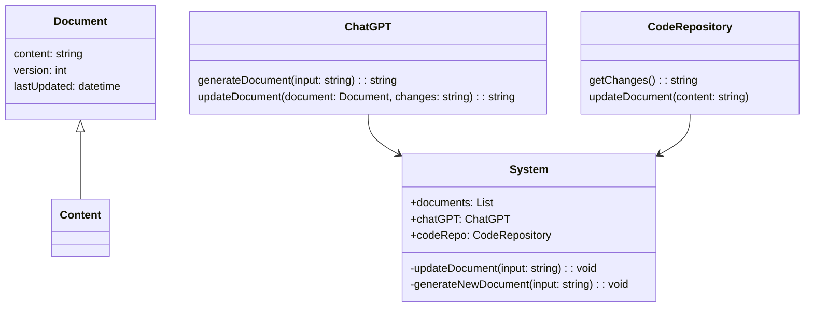
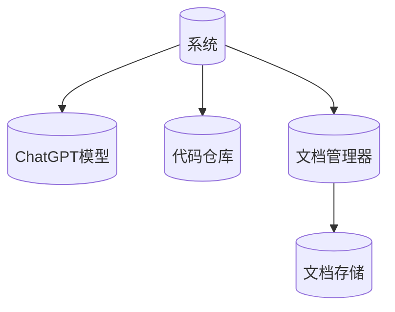
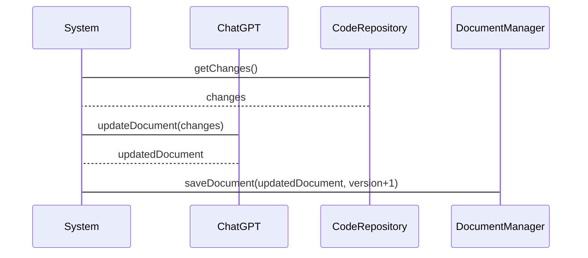

                 


# ChatGPT在自动化技术文档更新中的应用

> 关键词：ChatGPT，技术文档更新，自然语言处理，自动化系统，API接口，文档生成，文档管理

> 摘要：本文探讨了如何利用ChatGPT实现技术文档的自动化更新。通过分析技术文档更新的挑战，介绍了ChatGPT的基本原理及其在自动化文档更新中的潜力，详细阐述了基于ChatGPT构建自动化文档生成和更新系统的实现方法，包括系统架构设计、算法原理、项目实战等。本文旨在为技术文档管理提供一种高效、智能的解决方案，助力企业提高文档管理效率。

---

## 第一部分：背景介绍

### 1.1 问题背景

#### 1.1.1 技术文档更新的挑战

在现代软件开发和信息技术领域，技术文档是项目成功的关键之一。然而，技术文档的更新却面临着诸多挑战：

- **内容量巨大**：技术文档通常包含复杂的系统架构、接口规范、功能描述等，内容繁多且更新频繁。
- **更新频率高**：技术变更（如代码更新、功能迭代）通常伴随着文档的调整，手动更新效率低下。
- **人力成本高**：技术文档的编写和更新需要专业人员投入大量时间，尤其是在团队协作中，文档同步成本较高。
- **文档一致性问题**：人工更新容易出现文档不一致、遗漏或错误，导致文档与实际系统不符。

#### 1.1.2 ChatGPT的潜力

ChatGPT作为一种基于GPT-3的生成式人工智能模型，具备强大的自然语言处理能力，能够为技术文档的自动化更新提供以下潜力：

- **自动生成文档**：ChatGPT可以基于给定的输入生成技术文档，减少人工编写的工作量。
- **快速响应更新**：ChatGPT能够通过API接口快速生成或更新文档内容，适应技术变更的需求。
- **提高文档质量**：通过学习大量高质量的技术文档，ChatGPT能够生成更准确、更专业的文档内容。
- **多语言支持**：ChatGPT支持多种语言，能够满足不同团队的文档编写需求。

### 1.2 问题描述

本文将探讨如何利用ChatGPT构建一个自动化技术文档更新系统，解决以下问题：

- **目标**：设计一个能够自动生成和更新技术文档的系统，确保文档内容准确、及时、一致。
- **输入**：系统需要能够接收技术变更通知（如代码提交、功能迭代）、接口文档、配置信息等。
- **输出**：系统能够生成或更新对应的技术文档（如API文档、系统架构图、用户手册等）。
- **挑战**：如何确保生成的文档质量，如何处理复杂的技术内容，如何与现有系统集成。

### 1.3 问题解决

本文将从以下几个方面探讨解决方案：

1. **引入ChatGPT**：介绍ChatGPT的基本原理和使用方法。
2. **构建文档生成系统**：设计并实现一个基于ChatGPT的文档生成系统，包括输入处理、模型调用、输出生成等模块。
3. **实现文档更新**：通过集成代码仓库（如Git）、CI/CD工具（如Jenkins）等，实现文档的自动化生成和更新。
4. **评估与优化**：通过实验评估系统的性能，并提出优化建议。

### 1.4 边界与外延

#### 1.4.1 边界

- **技术文档类型**：本文主要针对技术规格说明书、API文档、系统架构图等技术类文档。
- **ChatGPT版本**：本文基于ChatGPT-3.5或GPT-4进行实现，不涉及其他版本。
- **文档格式**：主要支持Markdown、HTML、PDF等常见格式，暂不支持TeX或其他特殊格式。

#### 1.4.2 外延

- **其他自然语言处理技术**：虽然本文主要关注ChatGPT，但也简要介绍其他技术（如BERT）的应用潜力。
- **文档管理工具**：本文将探讨如何与Jenkins、Git、Docker等工具集成，实现文档的自动化管理。
- **扩展功能**：未来可以扩展至支持图表生成、多语言翻译、文档版本控制等功能。

### 1.5 概念结构与核心要素组成

#### 1.5.1 核心概念

- **ChatGPT**：基于GPT-3的生成式AI模型，能够理解和生成自然语言文本。
- **自动化技术文档更新**：利用AI技术实现技术文档的自动生成和动态更新。
- **API接口**：用于与ChatGPT通信的接口，实现数据输入和输出。

#### 1.5.2 核心要素

- **ChatGPT API**：用于调用ChatGPT模型，生成文本内容。
- **文档生成系统**：基于ChatGPT构建的自动化文档生成工具。
- **文档更新机制**：实现文档动态更新的逻辑和流程，包括数据采集、模型调用、内容生成等。

---

## 第二部分：核心概念与联系

### 2.1 ChatGPT的基本原理

#### 2.1.1 GPT模型介绍

- **生成式预训练模型（GPT）**：GPT（Generative Pre-trained Transformer）是一种基于Transformer架构的生成式AI模型，通过大量文本数据的预训练，具备理解和生成自然语言的能力。
- **Transformer架构**：GPT采用了Transformer架构，由编码器和解码器组成，通过自注意力机制（Self-Attention）处理序列数据，能够捕捉文本中的上下文信息。

#### 2.1.2 ChatGPT的特点

- **自适应能力**：ChatGPT能够根据输入的上下文生成相应的文本，支持对话式的交互。
- **多语言支持**：ChatGPT支持多种语言，能够处理不同语言的技术文档。
- **强大的生成能力**：通过预训练，ChatGPT能够生成高质量、连贯的文本，适用于多种自然语言生成任务。

### 2.2 联系与对比

#### 2.2.1 与其他自然语言处理模型的联系

- **BERT模型**：BERT是一种基于Transformer的双向编码器模型，主要用于文本理解任务（如问答系统、文本摘要）。与ChatGPT类似，BERT也采用Transformer架构，但其主要目标是理解文本，而非生成文本。
- **GPT与BERT的区别**：GPT是一种生成式模型，主要用于生成文本；BERT是一种理解式模型，主要用于理解文本。两者的结合能够实现更强大的自然语言处理能力。

#### 2.2.2 ChatGPT与其他生成式模型的对比

| 特性                | ChatGPT                | GPT-2                  | GPT-3                  |
|---------------------|------------------------|-------------------------|-------------------------|
| 模型架构            | 基于GPT-3.5/4         | 基于GPT-2              | 基于GPT-3              |
| 生成能力            | 强大的文本生成能力     | 较弱的生成能力           | 更强的生成能力           |
| 上下文理解能力      | 高                    | 中                    | 高                    |
| 多语言支持          | 支持多种语言           | 有限的多语言支持         | 支持多种语言           |
| 应用场景            | 技术文档生成、对话生成 | 文本生成、对话生成       | 多样化生成任务（如代码生成、图像描述） |

---

## 第三部分：算法原理讲解

### 3.1 ChatGPT的生成式模型原理

#### 3.1.1 Transformer架构

Transformer由编码器（Encoder）和解码器（Decoder）组成，通过自注意力机制（Self-Attention）处理输入序列。自注意力机制能够捕捉输入序列中词语之间的关系，从而生成更连贯的输出。

#### 3.1.2 梯度下降与训练过程

GPT模型通过监督学习进行训练，目标是预测给定输入序列的下一个词。具体步骤如下：

1. 输入序列：$x_1, x_2, \dots, x_n$
2. 模型输出：$\hat{y}_i = P(y_i|x_1, x_2, \dots, x_i)$
3. 损失计算：使用交叉熵损失函数计算预测概率与真实标签之间的差异。
4. 参数更新：通过梯度下降优化模型参数，最小化损失函数。

#### 3.1.3 生成过程

在生成文本时，模型会逐步生成每个词，并将生成的词作为下一个词的输入条件。具体步骤如下：

1. 输入：种子词（Prompt）
2. 生成第一个词：$y_1 = \arg\max P(y_1|x_1, x_2, \dots, x_n)$
3. 生成第二个词：$y_2 = \arg\max P(y_2|x_1, x_2, \dots, x_n, y_1)$
4. 重复上述步骤，直到生成完整的文本。

---

## 第四部分：系统分析与架构设计方案

### 4.1 问题场景介绍

假设我们有一个软件开发团队，每天需要处理大量的代码变更和技术更新。技术文档的更新通常滞后于代码变更，导致文档与实际系统不一致，影响团队协作效率。

### 4.2 项目介绍

我们计划开发一个基于ChatGPT的自动化技术文档更新系统，系统名称为“DocGenius”。系统将集成以下功能：

1. **文档生成**：根据输入的技术数据生成技术文档。
2. **文档更新**：根据代码变更自动更新文档内容。
3. **文档管理**：支持文档版本控制、格式转换、多语言输出。

### 4.3 系统功能设计

#### 4.3.1 领域模型类图



#### 4.3.2 系统架构设计



#### 4.3.3 系统接口设计

系统主要接口如下：

1. `generateDocument(prompt: string) -> string`：根据输入的提示生成文档内容。
2. `updateDocument(changes: string) -> string`：根据输入的变更信息更新文档内容。
3. `saveDocument(content: string, version: int)`：将文档内容保存到存储系统中。
4. `.getDocument(version: int) -> string`：获取指定版本的文档内容。

#### 4.3.4 系统交互序列图



---

## 第五部分：项目实战

### 5.1 环境安装

以下是开发环境的安装步骤：

1. **安装Python**：确保安装Python 3.8或更高版本。
2. **安装OpenAI库**：使用以下命令安装OpenAI库：

   ```bash
   pip install openai
   ```

3. **安装其他依赖**：安装所需的其他库，如`requests`、`json`等。

### 5.2 系统核心实现源代码

以下是系统核心实现的代码示例：

```python
import openai

class ChatGPT:
    def __init__(self, api_key):
        self.client = openai.Client(api_key)
    
    def generate_document(self, prompt):
        response = self.client.chat.completions.create(
            model="gpt-3.5-turbo",
            messages=[{"role": "user", "content": prompt}]
        )
        return response.choices[0].message.content

    def update_document(self, current_document, changes):
        response = self.client.chat.completions.create(
            model="gpt-3.5-turbo",
            messages=[{
                "role": "system",
                "content": "根据以下变更信息，更新文档内容："
            },
            {
                "role": "user",
                "content": current_document + "\n" + changes
            }]
        )
        return response.choices[0].message.content

class System:
    def __init__(self, api_key, code_repo):
        self.chatgpt = ChatGPT(api_key)
        self.code_repo = code_repo
    
    def update_document(self, prompt):
        updated_content = self.chatgpt.generate_document(prompt)
        self.code_repo.update_document(updated_content)
        return updated_content

# 示例用法
api_key = "your_api_key"
code_repo = CodeRepository()
system = System(api_key, code_repo)
prompt = "请生成API文档，包含以下接口："
updated_content = system.update_document(prompt)
```

### 5.3 代码应用解读与分析

上述代码实现了一个基于ChatGPT的文档生成和更新系统，主要功能包括：

1. **ChatGPT类**：封装了与OpenAI API的交互，提供了生成文档和更新文档的方法。
2. **System类**：实现了系统的主体功能，包括调用ChatGPT生成文档，并将其保存到代码仓库中。
3. **API调用示例**：展示了如何使用上述类生成和更新文档。

---

## 第六部分：最佳实践、小结与注意事项

### 6.1 最佳实践

1. **选择合适的模型版本**：根据具体需求选择合适的ChatGPT模型版本（如GPT-3.5或GPT-4）。
2. **优化输入提示**：编写清晰、具体的提示，以获得更准确的生成结果。
3. **集成文档管理工具**：与Jenkins、Git等工具集成，实现文档的自动化管理。
4. **定期评估与优化**：通过实验评估系统的性能，并根据反馈进行优化。

### 6.2 小结

本文详细探讨了如何利用ChatGPT实现技术文档的自动化更新，从背景介绍、核心概念、算法原理到系统设计和项目实战，为读者提供了一个完整的解决方案。通过引入ChatGPT，我们能够显著提高技术文档的生成和更新效率，降低人工成本，同时确保文档的准确性和一致性。

### 6.3 注意事项

- **数据隐私**：在使用ChatGPT生成文档时，需注意文档内容的隐私性和敏感性，确保数据安全。
- **模型调用成本**：ChatGPT的API调用有一定的成本，需根据实际情况进行成本评估。
- **模型性能优化**：通过优化提示和模型调参，提高生成文档的质量和效率。

---

## 第七部分：拓展阅读

1. **OpenAI官方文档**：深入了解ChatGPT的使用方法和API接口。
2. **GPT模型论文**：阅读GPT系列论文，了解模型的原理和优化方法。
3. **技术文档管理工具**：研究Jenkins、Git等工具的文档管理功能，探索与ChatGPT的结合方式。

---

## 作者信息

作者：AI天才研究院/AI Genius Institute & 禅与计算机程序设计艺术 /Zen And The Art of Computer Programming

---

以上是关于“ChatGPT在自动化技术文档更新中的应用”的完整技术博客文章。

