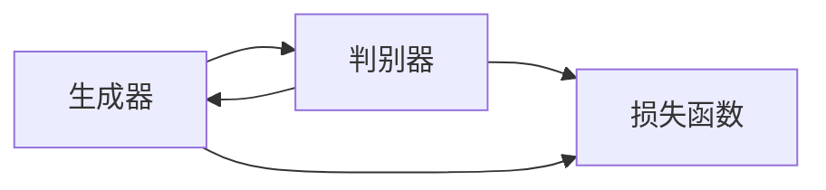
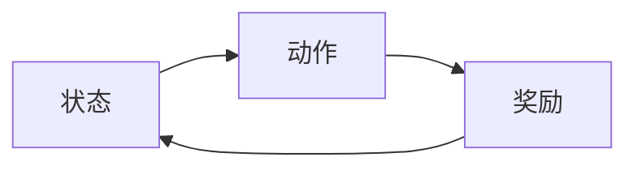
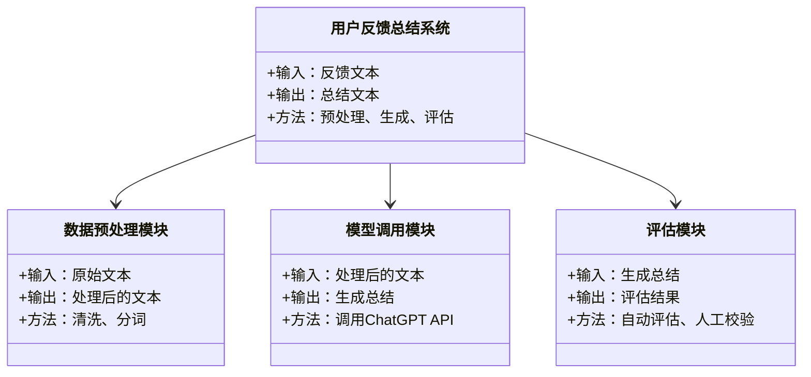
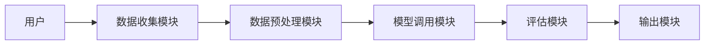
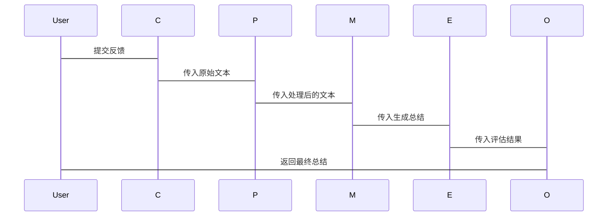

                 


# ChatGPT在自动化用户反馈总结中的角色

> 关键词：ChatGPT，自动化用户反馈，自然语言处理，生成式AI，用户反馈总结，机器学习

> 摘要：本文探讨了ChatGPT在自动化用户反馈总结中的角色，分析了其在自然语言处理、生成式AI和机器学习等技术领域的应用。通过详细的技术分析、实际案例和算法原理，展示了ChatGPT如何解决用户反馈总结的挑战，提供了最佳实践和未来发展方向。

----------------------------------------------------------------

## 第一部分：ChatGPT简介

### 1.1 ChatGPT的基本概念

#### 1.1.1 ChatGPT的定义

ChatGPT是由OpenAI开发的生成式人工智能模型，基于GPT系列模型构建。它是一种基于Transformer架构的大型语言模型，能够理解和生成人类语言文本。

**核心概念：**

- **生成式AI**：通过算法生成新的内容，而非简单地检索或匹配已有的数据。
- **预训练模型**：通过大量数据的预训练，模型学会了语言的结构和语义。
- **微调**：在特定任务上进行进一步训练，以适应具体应用场景的需求。

#### 1.1.2 ChatGPT的发展历程

ChatGPT的发展可以追溯到2018年的GPT模型，经过多次迭代和优化，逐步演变为当前的版本。

| 时间节点 | 主要进展 | 特点 |
|----------|----------|------|
| 2018年   | GPT      | 基础模型发布 |
| 2019年   | GPT-2    | 引入更大的参数规模 |
| 2020年   | GPT-3    | 提升生成能力，支持多任务 |
| 2022年   | ChatGPT  | 优化对话交互能力，支持上下文理解 |

#### 1.1.3 ChatGPT的关键特点

| 特性         | 描述                                                                 |
|--------------|----------------------------------------------------------------------|
| 大型参数规模 | 数以亿计的参数，使其能够捕捉复杂的语言模式                                         |
| 微调能力     | 可以在特定领域上进行微调，适应不同应用场景                                         |
| 对话能力     | 支持上下文理解，生成连贯的对话                                                     |
| 可编程性     | 提供API接口，方便开发者集成到各种应用中                                           |

### 1.2 ChatGPT的架构与技术基础

#### 1.2.1 生成式预训练技术

生成式预训练技术的核心是通过大量未标记数据的无监督学习，模型能够学习语言的结构和语义。

**算法流程：**

1. **输入数据**：大量文本数据（书籍、网页、文档等）。
2. **预训练任务**：遮蔽部分词汇，模型预测被遮蔽的词汇。
3. **模型结构**：基于Transformer的双向架构，支持并行处理。

#### 1.2.2 自然语言处理（NLP）基础

NLP是ChatGPT实现自然语言理解和生成的核心技术。

**关键NLP技术：**

1. **词嵌入（Word Embedding）**：将词语转换为向量表示。
2. **注意力机制（Attention）**：捕捉文本中不同位置之间的关系。
3. **序列建模（Sequence Modeling）**：处理序列数据，预测下一个词。

#### 1.2.3 ChatGPT的训练与优化

训练ChatGPT需要巨大的计算资源和优化策略。

**优化策略：**

1. **Adam优化器**：常用优化算法，结合动量和自适应学习率。
2. **学习率调度器**：在训练过程中动态调整学习率。
3. **并行计算**：利用GPU并行计算加速训练过程。

### 1.3 ChatGPT的应用场景概述

#### 1.3.1 自动化用户反馈总结的需求背景

用户反馈总结是企业提升产品和服务质量的重要环节。传统的手动总结效率低、成本高，难以应对海量数据。

**用户反馈总结的常见场景：**

- **电商平台**：收集用户对商品的评价。
- **社交媒体**：分析用户对品牌或事件的评论。
- **客服系统**：整理用户咨询和投诉内容。

#### 1.3.2 ChatGPT在用户反馈总结中的潜在价值

ChatGPT能够快速理解用户反馈内容，提取关键信息，生成总结。

**优势：**

- **高效性**：自动化处理大量反馈数据。
- **准确性**：通过深度学习模型，减少人工误差。
- **可扩展性**：适用于不同领域的反馈总结。

#### 1.3.3 其他应用领域简介

除了用户反馈总结，ChatGPT还在以下领域有广泛应用：

- **智能客服**：自动化回答用户问题。
- **内容生成**：自动生成新闻稿、产品描述。
- **代码辅助**：帮助开发者编写和调试代码。

## 第二部分：ChatGPT在自动化用户反馈总结中的应用

### 2.1 自动化用户反馈总结的挑战与需求

#### 2.1.1 传统的用户反馈处理方法

传统方法通常依赖人工处理，存在以下问题：

| 方法 | 优缺点 | 适用场景 |
|------|--------|----------|
| 手工总结 | 高准确性，灵活性高 | 小规模数据 |
| 简单关键词提取 | 快速提取，但准确性低 | 初步筛选 |
| 规则引擎 | 易配置，但难以处理复杂情况 | 简单场景 |

#### 2.1.2 自动化用户反馈总结的挑战

自动化总结面临以下挑战：

| 挑战 | 描述 | 解决方案 |
|------|------|----------|
| 数据稀疏性 | 数据不足导致模型性能下降 | 数据增强技术 |
| 领域专有性 | 专业术语影响理解 | 微调模型 |
| 文本多样性 | 反馈内容差异大 | 多样性训练 |

#### 2.1.3 ChatGPT如何解决这些问题

ChatGPT通过以下方式解决自动化总结的挑战：

1. **大规模预训练**：处理各种类型的数据，适应不同领域的反馈。
2. **上下文理解**：准确捕捉反馈中的关键信息。
3. **可微调性**：在特定领域上进行微调，提升准确率。

### 2.2 ChatGPT在用户反馈总结中的工作流程

#### 2.2.1 用户反馈数据收集

用户反馈可以通过以下方式收集：

1. **在线平台**：电商平台、社交媒体等。
2. **客服系统**：用户咨询、投诉等。
3. **调查问卷**：用户填写的反馈表单。

#### 2.2.2 数据预处理

预处理步骤包括：

1. **清洗数据**：去除无效数据，如空值、噪音。
2. **分词处理**：将文本分割成词语或短语。
3. **标注处理**：标注情感倾向、关键词等。

#### 2.2.3 ChatGPT模型调用与反馈生成

调用ChatGPT进行反馈生成的步骤：

1. **输入反馈文本**：将预处理后的文本输入模型。
2. **生成总结**：模型自动生成总结内容。
3. **输出结果**：返回总结文本。

#### 2.2.4 反馈评估与优化

评估总结的质量，可以通过以下方法：

1. **人工校验**：专家对生成的总结进行审核。
2. **自动评估指标**：使用BLEU、ROUGE等指标衡量生成质量。
3. **用户反馈**：收集用户对总结的满意度反馈。

### 2.3 ChatGPT在用户反馈总结中的案例分析

#### 2.3.1 案例一：电商平台的用户反馈总结

**背景**：电商平台每天收到大量用户评价，需要快速总结以优化产品和服务。

**实施步骤**：

1. **数据收集**：收集用户对商品的评价。
2. **数据预处理**：清洗和分词处理。
3. **模型调用**：使用ChatGPT生成总结。
4. **结果评估**：人工校验并优化总结内容。

**总结示例**：

- 原始反馈："商品质量不错，但配送速度太慢。"
- 生成总结："用户对商品质量满意，但配送速度需改进。"

#### 2.3.2 案例二：社交媒体的用户反馈分析

**背景**：社交媒体上每天产生大量用户评论，需要实时分析用户情感和意见。

**实施步骤**：

1. **数据收集**：收集社交媒体上的用户评论。
2. **数据预处理**：清洗和分词处理。
3. **模型调用**：使用ChatGPT生成总结。
4. **结果评估**：自动评估指标和人工校验。

**总结示例**：

- 原始反馈："我对这个广告很失望，完全不符合我的期望。"
- 生成总结："用户对广告表示失望，期望未得到满足。"

#### 2.3.3 案例三：金融行业的用户反馈总结

**背景**：金融行业需要处理大量客户咨询和投诉，需要高效总结以优化服务。

**实施步骤**：

1. **数据收集**：收集客户咨询和投诉记录。
2. **数据预处理**：清洗和分词处理。
3. **模型调用**：使用ChatGPT生成总结。
4. **结果评估**：人工校验并优化总结内容。

**总结示例**：

- 原始反馈："我对我的账户安全有疑问，请尽快解决。"
- 生成总结："用户对账户安全有疑问，需尽快解决。"

## 第三部分：ChatGPT算法原理详解

### 3.1 ChatGPT算法的基本原理

#### 3.1.1 语言模型的基本概念

语言模型的目标是根据给定的上下文，预测下一个词的概率分布。

**公式表示**：

$$ P(w_{n}|w_{1}, w_{2}, ..., w_{n-1}) $$

其中，$w_{n}$是下一个词，$w_{1}$到$w_{n-1}$是已知的上下文。

#### 3.1.2 生成对抗网络

生成对抗网络（GAN）由生成器和判别器组成，通过对抗训练生成逼真的数据。

**流程图**：



#### 3.1.3 强化学习

强化学习通过奖励机制，优化模型的生成策略。

**流程图**：



### 3.2 ChatGPT的训练与优化

#### 3.2.1 训练过程

1. **数据准备**：将文本数据转换为模型可处理的格式。
2. **遮蔽任务**：随机遮蔽部分词汇，模型预测被遮蔽的词。
3. **损失计算**：使用交叉熵损失函数计算预测与真实值的差异。
4. **反向传播**：通过梯度下降优化模型参数。

#### 3.2.2 模型优化策略

1. **Adam优化器**：结合动量和自适应学习率。
2. **学习率调度器**：动态调整学习率，加速收敛。
3. **并行计算**：利用GPU并行计算，提升训练效率。

## 第四部分：系统分析与架构设计方案

### 4.1 问题场景介绍

用户反馈总结系统需要高效处理大量文本数据，生成准确的总结。

**系统目标**：

- 快速处理用户反馈。
- 自动生成结构化总结。
- 提供可扩展的解决方案。

### 4.2 项目介绍

设计一个基于ChatGPT的用户反馈总结系统，涵盖数据收集、预处理、模型调用和结果评估等环节。

### 4.3 系统功能设计

**领域模型**：



### 4.4 系统架构设计

**系统架构图**：



### 4.5 系统接口设计

1. **数据收集模块**：
   - 接口：`collect_feedback()`
   - 输入：无
   - 输出：反馈文本列表

2. **数据预处理模块**：
   - 接口：`preprocess(text)`
   - 输入：原始文本
   - 输出：处理后的文本

3. **模型调用模块**：
   - 接口：`generate_summary(text)`
   - 输入：处理后的文本
   - 输出：生成的总结

4. **评估模块**：
   - 接口：`evaluate(summary, reference)`
   - 输入：生成总结和参考总结
   - 输出：评估结果

### 4.6 系统交互流程



## 第五部分：项目实战

### 5.1 环境安装

安装必要的库：

```bash
pip install openai python-transformers
```

### 5.2 核心实现源代码

以下是基于Python的实现代码：

```python
import openai
from transformers import pipeline

# 初始化模型
summarizer = pipeline("summarization", model="facebook/bart-large-cnn")

def preprocess(text):
    # 去除特殊字符
    import re
    cleaned = re.sub(r'[^\w\s]', '', text)
    return cleaned

def generate_summary(text):
    # 调用模型生成总结
    summary = summarizer(text, max_length=100, min_length=50, do_sample=False)
    return summary[0]['summary_text']

def evaluate(summary, reference):
    # 使用ROUGE指标评估
    from rouge import Rouge
    rouge = Rouge()
    scores = rouge.compute(
        references=[reference],
        hypotheses=[summary]
    )
    return scores['rouge-l'].fmeasure

# 示例
feedback = "商品质量不错，但配送速度太慢。"
processed = preprocess(feedback)
generated_summary = generate_summary(processed)
print("生成的总结：", generated_summary)
print("评估结果：", evaluate(generated_summary, "用户对商品质量满意，但配送速度需改进。"))
```

### 5.3 代码应用解读与分析

1. **preprocess函数**：对原始文本进行清洗，去除特殊字符。
2. **generate_summary函数**：调用预训练的摘要模型生成总结。
3. **evaluate函数**：使用ROUGE指标评估生成总结的质量。

### 5.4 实际案例分析

**案例一：电商平台的用户反馈总结**

1. **数据收集**：收集用户对商品的评价。
2. **数据预处理**：清洗和分词处理。
3. **模型调用**：使用预训练模型生成总结。
4. **结果评估**：使用ROUGE指标评估生成质量。

### 5.5 项目小结

通过以上步骤，我们可以高效地使用ChatGPT进行用户反馈总结，提升企业的运营效率和用户体验。

## 第六部分：总结与展望

### 6.1 ChatGPT在自动化用户反馈总结中的重要性

ChatGPT通过其强大的语言理解和生成能力，显著提升了用户反馈总结的效率和准确性。

### 6.2 未来发展方向

1. **模型优化**：提升生成总结的准确性和自然度。
2. **多语言支持**：支持更多语言的用户反馈总结。
3. **实时反馈**：实现实时用户反馈的自动总结。

### 6.3 潜在挑战与解决方案

1. **数据隐私**：加强数据加密和隐私保护。
2. **模型适应性**：针对不同领域进行模型微调。
3. **计算资源**：优化算法，降低计算成本。

## 第七部分：最佳实践 tips

1. **数据预处理**：清洗和分词处理是关键步骤。
2. **模型调优**：根据具体任务调整模型参数。
3. **安全与隐私**：确保数据处理过程中的安全。

## 第八部分：结论

ChatGPT在自动化用户反馈总结中的应用展示了生成式AI的强大能力。通过本文的详细分析和实际案例，我们可以看到ChatGPT如何帮助企业和开发者高效处理用户反馈，提升用户体验和产品质量。

作者：AI天才研究院/AI Genius Institute & 禅与计算机程序设计艺术 /Zen And The Art of Computer Programming

