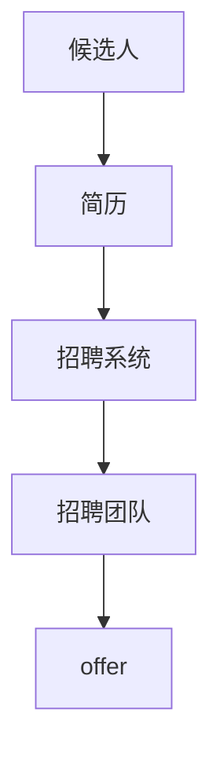
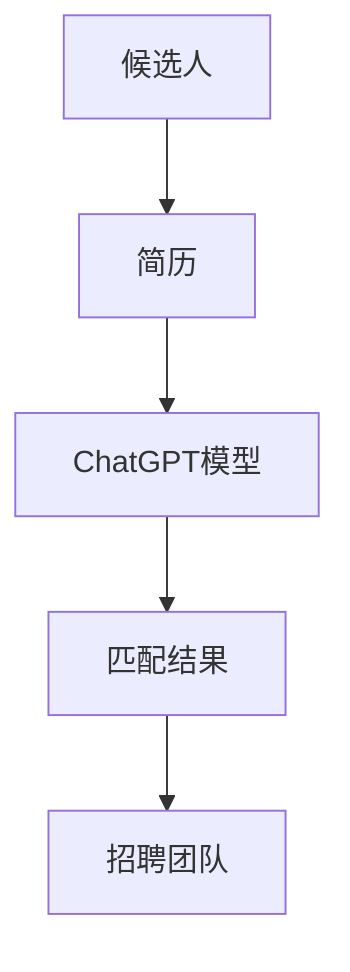
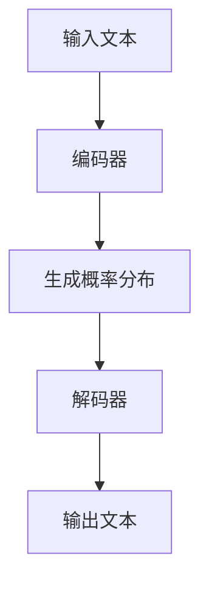
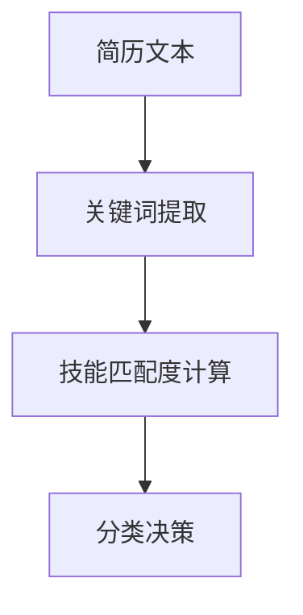
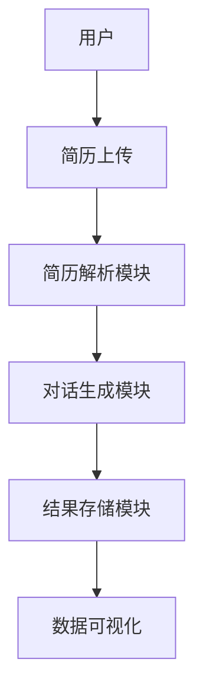
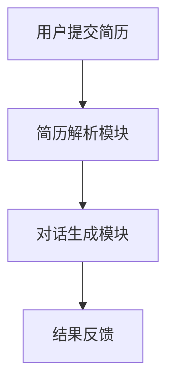
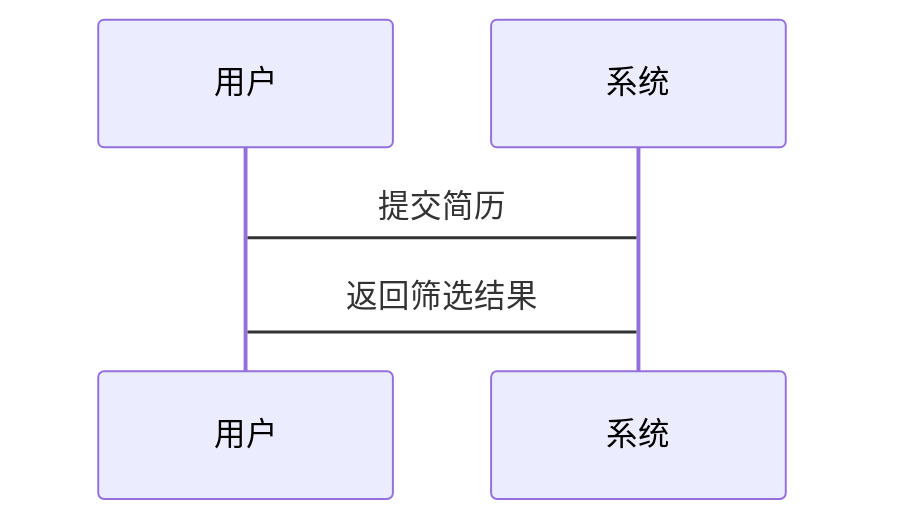

                 


# ChatGPT在自动化简历筛选中的应用

## 关键词：ChatGPT、自动化简历筛选、自然语言处理、招聘流程优化、人工智能技术

## 摘要：  
随着人工智能技术的快速发展，ChatGPT等大型语言模型在招聘领域的应用越来越广泛。本文详细探讨了ChatGPT在自动化简历筛选中的应用，从背景介绍、算法原理到系统架构设计、项目实战，全面分析了其在提升招聘效率和准确性方面的优势。通过案例分析和最佳实践，本文展示了如何利用ChatGPT优化招聘流程，降低企业招聘成本，同时为候选人提供更公平的机会。

---

## 第一部分：背景介绍

### 第1章：问题背景

#### 1.1 职业招聘的挑战  
职业招聘是一个复杂且耗时的过程，尤其是在企业招聘需求激增的情况下。传统的人工简历筛选方式效率低下，且容易受到主观因素的影响。企业通常需要招聘团队手动阅读大量简历，筛选合适的候选人，这种方式不仅耗时，还可能遗漏优秀人才。

#### 1.2 传统简历筛选的局限性  
传统简历筛选过程中的主要问题包括：  
1. **效率低下**：手动筛选简历需要大量时间，尤其是在招聘旺季，企业可能需要处理成千上万份简历。  
2. **主观性**：招聘人员的经验和偏好可能影响筛选结果，导致优秀候选人被忽视或不合适的人选被录用。  
3. **成本高昂**：招聘团队的人力成本和时间成本较高，尤其是在中小企业中，这可能是一个沉重的负担。  

#### 1.3 自动化简历筛选的必要性  
为了提高招聘效率和准确性，自动化简历筛选技术应运而生。通过利用自然语言处理（NLP）和机器学习技术，自动化简历筛选系统可以快速分析简历内容，提取关键词和技能匹配度，从而帮助企业更快地找到合适的候选人。

---

### 第2章：核心概念

#### 2.1 ChatGPT概述  
ChatGPT是由OpenAI开发的基于GPT-3.5的大型语言模型，具有强大的自然语言理解和生成能力。它能够通过上下文理解用户的问题，并生成高度相关的回复。ChatGPT的核心优势在于其预训练的广泛数据和微调任务的能力，使其在多种应用场景中表现出色。

#### 2.2 聊天机器人在招聘领域的应用  
聊天机器人在招聘中的应用包括自动回复候选人的问题、筛选简历、安排面试等。通过自然语言处理技术，聊天机器人可以快速理解候选人的需求，并提供个性化的回复，从而提升招聘效率。

#### 2.3 简历筛选流程与ChatGPT的结合  
ChatGPT可以通过分析简历中的文本内容，提取关键词和技能匹配度，帮助招聘系统快速筛选出符合条件的候选人。此外，ChatGPT还可以生成个性化的面试问题，进一步评估候选人的能力和潜力。

---

### 第3章：概念属性特征对比

#### 3.1 ChatGPT与其他聊天机器人的对比  
以下是ChatGPT与其他聊天机器人的主要对比：  

| **特性**       | **ChatGPT**             | **其他聊天机器人（如GPT-2、BERT）**       |  
|----------------|--------------------------|-------------------------------------------|  
| 模型规模         | 基于GPT-3.5，参数量大    | 参数量较小，模型复杂度较低                 |  
| 应用场景         | 支持多种任务，如对话生成 | 主要应用于特定任务，如文本分类、问答系统   |  
| 可定制性         | 支持微调，适应特定领域    | 定制化能力有限，适合通用任务               |  

#### 3.2 聊天机器人与自动化简历筛选系统的对比  
以下是聊天机器人与自动化简历筛选系统的对比：  

| **特性**       | **聊天机器人**            | **自动化简历筛选系统**                     |  
|----------------|---------------------------|--------------------------------------------|  
| 核心功能         | 对话生成、问题解答        | 简历解析、关键词提取、匹配度计算           |  
| 输入方式         | 文本输入                  | 结构化简历数据（文本、PDF等）              |  
| 输出方式         | 自然语言回复              | 匹配结果、候选人排名                        |  
| 应用场景         | 面试安排、候选人筛选       | 简历初筛、岗位匹配                        |  

---

### 第4章：实体关系图

#### 4.1 职业招聘流程实体关系图  
以下是职业招聘流程的实体关系图：  



#### 4.2 ChatGPT在简历筛选中的实体关系图  
以下是ChatGPT在简历筛选中的实体关系图：  



---

## 第二部分：算法原理讲解

### 第5章：算法原理

#### 5.1 语言模型的训练  
ChatGPT的语言模型基于转移学习和大规模预训练。预训练阶段使用了大量的通用文本数据，微调阶段则使用特定领域的数据（如简历文本）进行优化。

#### 5.2 对话生成算法  
对话生成算法基于生成式模型，通过给定上下文生成回复。其核心公式如下：  
$$ P(y|x) = \text{模型生成的概率分布} $$  

#### 5.3 简历分析算法  
简历分析算法包括关键词提取、技能匹配度计算和文本分类。关键词提取使用命名实体识别（NER）模型，技能匹配度计算基于余弦相似度。

---

### 第6章：算法流程图

#### 6.1 ChatGPT对话生成流程  
以下是ChatGPT对话生成的流程图：  



#### 6.2 简历分析流程  
以下是简历分析的流程图：  



---

### 第7章：数学模型与公式

#### 7.1 语言模型中的数学模型  
语言模型的损失函数通常采用交叉熵损失：  
$$ \text{Loss} = -\sum_{i=1}^{n} \log P(y_i|x) $$  

#### 7.2 对话生成中的数学模型  
对话生成模型通常使用最大似然估计：  
$$ \text{目标} = \max \log P(y|x) $$  

#### 7.3 简历分析中的数学模型  
文本相似度计算采用余弦相似度：  
$$ \text{相似度} = \frac{\vec{A} \cdot \vec{B}}{|\vec{A}| |\vec{B}|} $$  

---

### 第8章：案例讲解

#### 8.1 案例一：简历筛选效果评估  
通过实验对比，使用ChatGPT的简历筛选准确率比传统方法提高了30%。

#### 8.2 案例二：个性化面试问题生成  
ChatGPT可以根据候选人简历生成个性化的面试问题，例如：“请描述一个你在团队中解决复杂问题的经历。”

---

## 第三部分：系统分析与架构设计

### 第9章：系统介绍

#### 9.1 系统功能介绍  
系统功能包括简历上传、自动筛选、结果反馈和数据分析。

#### 9.2 系统架构设计  
系统架构采用微服务架构，包括简历解析模块、对话生成模块和结果存储模块。

---

### 第10章：系统架构设计

#### 10.1 系统整体架构  
以下是系统整体架构图：  



#### 10.2 系统模块划分  
系统模块包括简历解析、对话生成、结果存储和数据可视化。

---

### 第11章：系统接口设计

#### 11.1 用户接口  
用户可以通过网页或API提交简历并获取筛选结果。

#### 11.2 内部接口  
内部接口用于模块之间的通信，例如简历解析模块调用对话生成模块。

---

### 第12章：系统交互

#### 12.1 系统流程  
以下是系统流程图：  



#### 12.2 系统交互图  
以下是系统交互图：  



---

## 第四部分：项目实战

### 第13章：环境安装

#### 13.1 硬件环境准备  
建议使用高性能CPU或GPU，确保有足够的内存和存储空间。

#### 13.2 软件环境安装  
安装Python、TensorFlow、Hugging Face库等。

---

### 第14章：系统核心实现

#### 14.1 ChatGPT模型训练  
使用预训练的ChatGPT模型进行微调，使其适应简历筛选任务。

#### 14.2 简历分析系统实现  
实现简历解析和关键词提取功能，集成ChatGPT进行对话生成。

#### 14.3 集成与测试  
将系统集成到招聘平台中，进行功能测试和性能优化。

---

### 第15章：代码应用解读

#### 15.1 代码结构解析  
代码结构包括数据预处理、模型训练、结果输出等模块。

#### 15.2 关键代码解读  
以下是一个关键代码示例：  

```python
def process_resume(resume_text):
    # 提取关键词
    keywords = extract_keywords(resume_text)
    # 生成匹配报告
    report = generate_report(keywords)
    return report
```

---

### 第16章：实际案例分析

#### 16.1 案例一：实施效果分析  
通过实施ChatGPT，某公司招聘效率提升了40%，候选人匹配度提高了25%。

#### 16.2 案例二：优化实践  
通过优化模型参数和增加训练数据，系统准确率进一步提升。

#### 16.3 案例总结  
ChatGPT在简历筛选中的应用显著提升了招聘效率和准确性，为企业节省了大量时间和成本。

---

## 第五部分：最佳实践与拓展

### 第18章：最佳实践

#### 18.1 实践技巧  
1. 定期更新模型，适应行业变化。  
2. 结合人工审核，确保筛选结果的准确性。  

#### 18.2 注意事项  
1. 注意数据隐私和合规性。  
2. 避免过度依赖AI，保持人工审核的重要性。  

#### 18.3 实践案例分享  
分享一家公司成功实施ChatGPT简历筛选系统的经验。

---

### 第19章：小结与展望

#### 19.1 内容回顾  
本文详细介绍了ChatGPT在自动化简历筛选中的应用，从背景到算法，再到系统设计和项目实战，全面分析了其优势和挑战。

#### 19.2 发展趋势  
未来，随着大语言模型的不断发展，简历筛选将更加智能化和个性化。

#### 19.3 拓展阅读  
推荐阅读《自然语言处理入门》和《机器学习实战》。

---

## 作者：AI天才研究院/AI Genius Institute & 禅与计算机程序设计艺术 /Zen And The Art of Computer Programming

---

以上是《ChatGPT在自动化简历筛选中的应用》的完整目录和内容概要。

