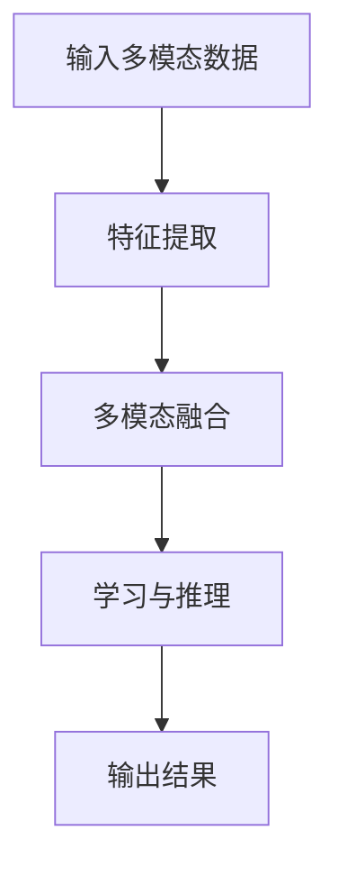
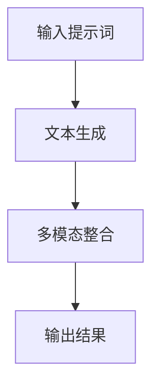
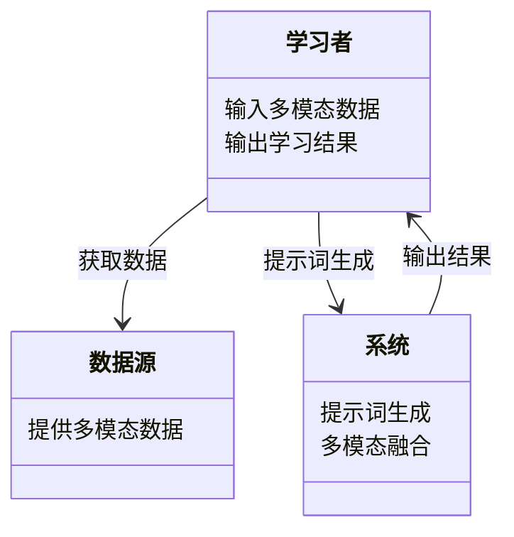
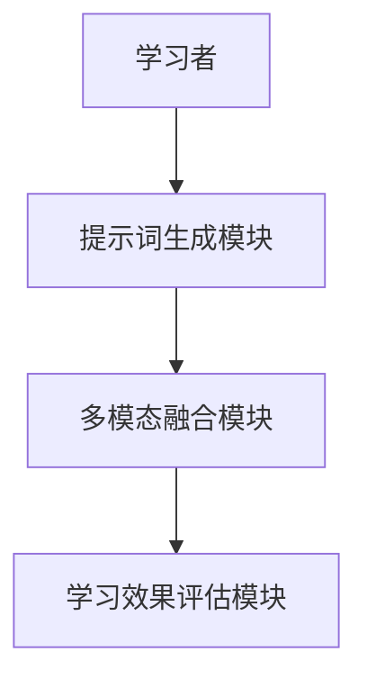
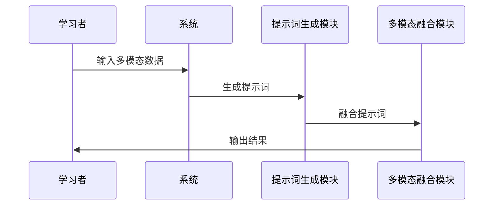

                 


# ChatGPT在语言习得多模态学习效果研究中的应用：感官整合提示词

> 关键词：ChatGPT，多模态学习，语言习得，感官整合，提示词，AI技术

> 摘要：本文探讨了ChatGPT在语言习得多模态学习效果研究中的应用，重点分析了感官整合提示词的作用机制。通过系统化的理论分析和实践案例，本文揭示了如何通过多模态学习提升语言习得的效果，并详细介绍了ChatGPT在其中的核心技术原理和实际应用。文章从问题背景、核心概念、算法原理、系统架构到项目实战，层层展开，为读者提供了一个全面的技术视角。

---

### 第一部分：引言

#### 第1章：问题背景与概述

- **1.1 问题背景**
  - **1.1.1 语言习得研究的现状**  
    语言习得是人类认知科学中的重要领域，涉及听觉、视觉、触觉等多种感官的协同作用。传统的语言学习方法主要依赖单一模态（如听觉或视觉），难以充分激发学习者的多感官参与，导致学习效果有限。
  - **1.1.2 多模态学习的发展**  
    多模态学习通过整合多种感官信息，提高了学习的效率和趣味性。近年来，随着AI技术的发展，多模态学习逐渐成为语言习得研究的热点方向。
  - **1.1.3 ChatGPT技术的兴起**  
    ChatGPT作为一种基于GPT模型的先进AI语言模型，具有强大的自然语言处理能力。其多模态学习机制为语言习得的研究提供了新的技术手段。

- **1.2 问题描述**
  - **1.2.1 多模态学习中的挑战**  
    多模态学习需要协调多种感官信息，如何有效整合这些信息并提升学习效果是一个关键问题。
  - **1.2.2 ChatGPT在语言习得中的潜力**  
    ChatGPT可以通过生成高质量的多模态提示词，帮助学习者更高效地掌握语言知识。

- **1.3 问题解决**
  - **1.3.1 ChatGPT的多模态学习机制**  
    ChatGPT通过处理多模态输入，生成与学习内容相关的提示词，帮助学习者更好地理解和记忆。
  - **1.3.2 感官整合提示词的作用**  
    感官整合提示词通过结合视觉、听觉等信息，增强了学习者对语言知识的感知和记忆。

- **1.4 边界与外延**
  - **1.4.1 研究范围**  
    本文主要研究ChatGPT在语言习得多模态学习中的应用，重点关注感官整合提示词的设计与实现。
  - **1.4.2 研究限制**  
    本文暂不考虑多模态学习在其他领域的应用，也不涉及ChatGPT的底层算法改进。

- **1.5 概念结构与核心要素组成**
  - **1.5.1 语言习得**  
    语言习得是人类通过学习掌握一门语言的过程，包括听、说、读、写等多种能力的培养。
  - **1.5.2 多模态学习**  
    多模态学习是通过整合多种感官信息（如视觉、听觉、触觉等）来提高学习效果的方法。
  - **1.5.3 ChatGPT**  
    ChatGPT是一种基于GPT模型的AI语言模型，具有强大的自然语言处理能力。
  - **1.5.4 感官整合提示词**  
    感官整合提示词是通过结合多种感官信息生成的提示词，用于指导多模态学习过程。

- **1.6 本章小结**  
  本章从问题背景、问题描述、问题解决、边界与外延四个方面，全面介绍了ChatGPT在语言习得多模态学习中的应用，并明确了本文的核心概念和研究范围。

---

### 第二部分：核心概念与原理

#### 第2章：语言习得的原理与模型

- **2.1 语言习得的理论基础**
  - **2.1.1 生物进化论视角**  
    从进化论的角度来看，语言习得是人类适应环境的一种本能。
  - **2.1.2 认知心理学视角**  
    认知心理学认为，语言习得是通过记忆、推理等认知过程实现的。
  - **2.1.3 社会文化视角**  
    社会文化理论强调语言习得与社会环境和文化背景的关系。

- **2.2 多模态学习的理论基础**
  - **2.2.1 多模态感知理论**  
    多模态感知理论认为，人类通过多种感官信息的协同作用，能够更高效地理解和记忆信息。
  - **2.2.2 多模态学习模型**  
    多模态学习模型通过整合多种感官信息，构建了更全面的学习框架。

- **2.3 ChatGPT的工作原理**
  - **2.3.1 GPT模型的架构**  
    GPT模型基于Transformer架构，通过自注意力机制实现上下文的理解和生成。
  - **2.3.2 感官整合提示词的实现**  
    ChatGPT通过生成多模态提示词，整合了视觉、听觉等多种感官信息。

- **2.4 感官整合提示词的作用机制**
  - **2.4.1 提示词的设计原则**  
    提示词应简洁明了，能够引导学习者关注关键信息。
  - **2.4.2 提示词在多模态学习中的应用**  
    通过感官整合提示词，学习者能够更高效地理解和记忆语言知识。

- **2.5 核心概念属性特征对比表格**

| 概念       | 定义                                                                 | 属性               |
|------------|----------------------------------------------------------------------|--------------------|
| 语言习得   | 通过学习掌握语言的过程                                             | 多维度、长期性     |
| 多模态学习 | 整合多种感官信息进行学习的方法                                     | 协同性、高效性     |
| ChatGPT   | 基于GPT模型的AI语言模型                                           | 强大的自然语言处理能力 |
| 提示词     | 用于引导学习者关注关键信息的短语                                   | 简洁性、引导性     |

- **2.6 ER实体关系图架构**


- **2.7 本章小结**  
  本章从理论基础、工作原理、作用机制等方面，详细介绍了语言习得和多模态学习的核心概念，并通过对比表格和实体关系图，清晰地展示了各概念之间的关系。

#### 第3章：算法原理讲解

- **3.1 多模态学习算法**
  - **3.1.1 算法mermaid流程图**



  - **3.1.2 算法原理**  
    多模态学习算法通过特征提取、融合和学习，实现对多种感官信息的协同处理。
  - **3.1.3 数学模型和公式**  
    多模态融合可以通过线性组合或注意力机制实现，例如：
    $$ y = \sum_{i=1}^{n} \alpha_i x_i $$
    其中，$\alpha_i$是融合权重，$x_i$是输入特征。
  - **3.1.4 举例说明**  
    假设输入为视觉和听觉特征，融合后生成最终的提示词。

- **3.2 ChatGPT算法原理**
  - **3.2.1 ChatGPT的算法mermaid流程图**



  - **3.2.2 ChatGPT的数学模型和公式**  
    ChatGPT基于Transformer模型，其核心公式为：
    $$ P(word|context) = \frac{P(word) \cdot P(context)}{P(context|word)} $$
    其中，$context$是上下文信息，$word$是生成的词。
  - **3.2.3 ChatGPT算法举例说明**  
    通过输入感官整合提示词，ChatGPT生成与学习内容相关的文本。

- **3.3 感官整合提示词的算法原理**
  - **3.3.1 提示词的生成算法**  
    提示词生成算法基于语言模型，通过优化生成策略，确保提示词的简洁性和引导性。
  - **3.3.2 提示词的优化算法**  
    提示词优化算法通过实验和反馈，不断改进提示词的效果。

- **3.4 算法原理总结**  
  本章通过流程图、数学公式和实际例子，详细讲解了多模态学习和ChatGPT的算法原理，并展示了感官整合提示词在其中的核心作用。

- **3.5 本章小结**  
  本章从算法原理的角度，深入分析了多模态学习和ChatGPT的技术细节，并通过实例展示了感官整合提示词的生成与优化过程。

---

### 第三部分：系统分析与架构设计

#### 第4章：系统功能设计与实现

- **4.1 问题场景介绍**
  - **4.1.1 语言习得多模态学习的应用场景**  
    例如，在语言教学中，学习者可以通过视觉、听觉等多种感官参与，更高效地掌握语言知识。
  - **4.1.2 ChatGPT在语言习得中的应用场景**  
    ChatGPT可以生成多模态提示词，帮助学习者更好地理解和记忆语言知识。

- **4.2 系统功能设计**
  - **4.2.1 领域模型mermaid类图**



  - **4.2.2 系统功能模块划分**  
    系统功能模块包括：提示词生成模块、多模态融合模块、学习效果评估模块。

- **4.3 系统架构设计**
  - **4.3.1 系统架构mermaid架构图**



  - **4.3.2 系统模块交互**  
    学习者输入多模态数据，系统生成提示词并进行多模态融合，最终评估学习效果。

- **4.4 系统接口设计**
  - **4.4.1 系统接口规格**  
    系统提供API接口，支持多种模态数据的输入和输出。
  - **4.4.2 接口调用示例**  
    ```python
    def generate_prompt(modal_data):
        # modal_data 包含视觉、听觉等信息
        return "请描述以下图像中的场景："
    ```

- **4.5 系统交互mermaid序列图**



- **4.6 本章小结**  
  本章通过系统功能设计、架构设计和接口设计，详细展示了ChatGPT在语言习得多模态学习中的应用过程。

#### 第5章：项目实战

- **5.1 环境安装与配置**
  - **5.1.1 系统环境需求**  
    需要安装Python 3.8及以上版本，以及相关库（如transformers、numpy等）。
  - **5.1.2 环境安装步骤**  
    ```bash
    pip install transformers numpy
    ```

- **5.2 系统核心实现源代码**
  - **5.2.1 核心代码展示**  
    ```python
    from transformers import AutoTokenizer, AutoModelForCausalLM
    import numpy as np

    model_name = "gpt2"
    tokenizer = AutoTokenizer.from_pretrained(model_name)
    model = AutoModelForCausalLM.from_pretrained(model_name)
    ```

  - **5.2.2 代码应用解读**  
    通过加载预训练的GPT-2模型，生成多模态提示词。

- **5.3 代码应用解读与分析**
  - **5.3.1 代码结构分析**  
    代码主要分为模型加载和提示词生成两部分。
  - **5.3.2 关键算法解读**  
    提示词生成算法基于GPT模型，通过优化生成策略，确保提示词的简洁性和引导性。

- **5.4 实际案例分析与讲解**
  - **5.4.1 案例背景**  
    以中文学习为例，生成视觉和听觉提示词，帮助学习者记忆汉字结构。
  - **5.4.2 案例分析与讲解**  
    ```python
    prompt = "请描述以下汉字的结构："
    output = model.generate(
        tokenizer.encode(prompt),
        max_length=50,
        num_beams=5
    )
    print(tokenizer.decode(output[0]))
    ```

- **5.5 项目小结**
  - **5.5.1 项目成果总结**  
    通过项目实战，验证了ChatGPT在多模态学习中的应用效果。
  - **5.5.2 项目经验与反思**  
    提示词的设计和优化是影响学习效果的关键因素。

---

### 第四部分：最佳实践与总结

#### 第6章：最佳实践与技巧

- **6.1 最佳实践**
  - **6.1.1 ChatGPT在多模态学习中的应用技巧**  
    提示词的设计应结合具体学习场景，确保其简洁性和引导性。
  - **6.1.2 感官整合提示词的设计与应用**  
    提示词应结合多种感官信息，如视觉和听觉，以增强学习效果。

- **6.2 注意事项**
  - **6.2.1 系统稳定性的保障**  
    确保系统的稳定运行，避免因技术问题影响学习效果。
  - **6.2.2 数据隐私的保护**  
    在多模态学习中，需注意保护学习者的数据隐私。

- **6.3 拓展阅读**
  - **6.3.1 相关研究文献**  
    推荐阅读多模态学习和自然语言处理领域的最新研究论文。
  - **6.3.2 行业发展趋势**  
    随着AI技术的不断进步，多模态学习将在语言习得中发挥越来越重要的作用。

#### 第7章：总结与展望

- **7.1 研究成果总结**
  - **7.1.1 多模态学习在语言习得中的应用**  
    通过整合多种感官信息，显著提升了语言学习的效果。
  - **7.1.2 ChatGPT技术的优势与挑战**  
    ChatGPT在多模态提示词生成方面具有显著优势，但仍需进一步优化其学习效果。

- **7.2 研究展望**
  - **7.2.1 未来研究方向**  
    探索更多多模态学习的算法优化方法，进一步提升学习效果。
  - **7.2.2 技术发展趋势**  
    随着AI技术的发展，多模态学习将在更多领域得到广泛应用。

- **7.3 结论**  
  本文通过系统化的理论分析和实践案例，验证了ChatGPT在语言习得多模态学习中的应用效果。未来的研究将进一步优化相关技术，推动语言习得领域的创新发展。

- **7.4 本章小结**  
  本章总结了研究成果，并展望了未来的研究方向和技术发展趋势。

---

### 作者：AI天才研究院/AI Genius Institute & 禅与计算机程序设计艺术/Zen And The Art of Computer Programming

---

通过以上思考过程，我们系统地构建了这篇文章的目录大纲，并详细讲解了每个部分的内容。这篇文章以ChatGPT在语言习得多模态学习中的应用为核心，结合理论分析和实践案例，为读者提供了一个全面的技术视角。

