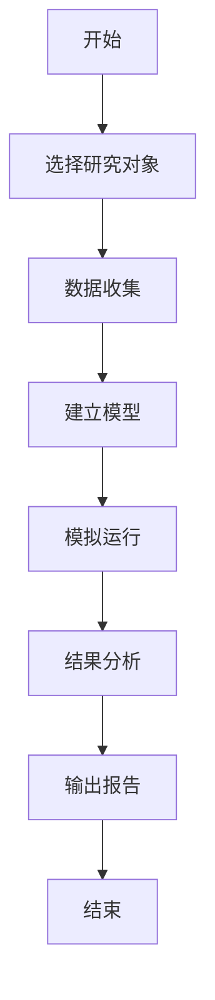
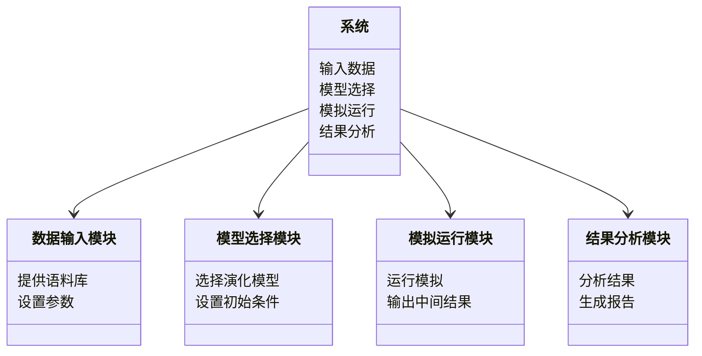
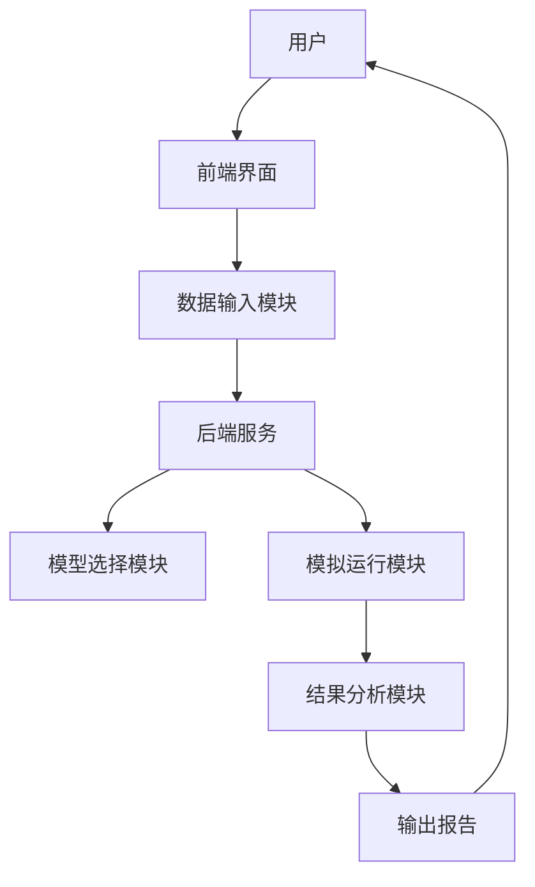
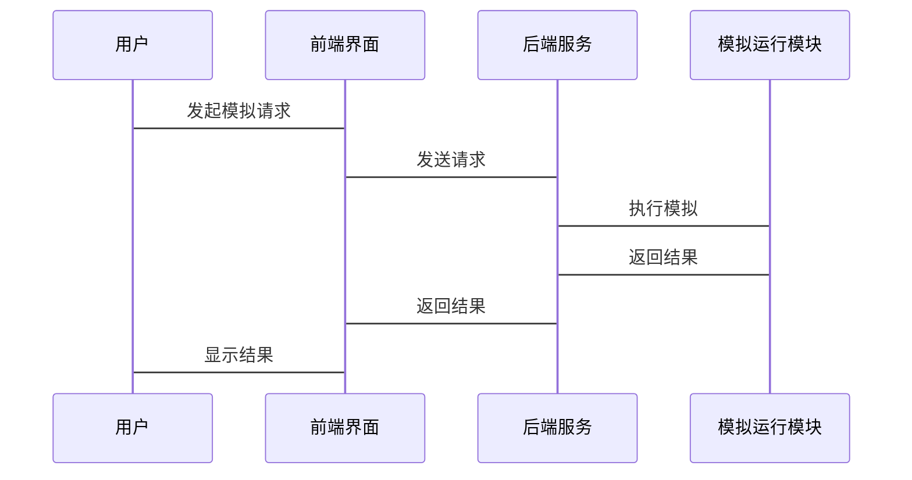

                 


# ChatGPT在语言演化模拟中的应用：探索语言变迁规律

> 关键词：语言演化模拟，ChatGPT，语言变迁规律，自然语言处理，机器学习

> 摘要：本文探讨了ChatGPT在语言演化模拟中的应用，分析了语言变迁的规律，并通过数学模型和实际案例展示了其在语言演化研究中的潜力和优势。

---

## 第一部分：背景介绍

### 第1章：问题背景

#### 1.1 语言演化模拟的重要性

- **语言演化模拟的定义和意义**：语言演化模拟是通过数学模型和算法，模拟语言在时间、空间和使用环境中的变化过程。它帮助我们理解语言的动态特征、演化规律以及社会文化因素对语言的影响。
- **语言演化的历史与现状**：语言演化研究始于19世纪，早期主要基于历史语言学和比较语言学的方法。随着计算语言学和机器学习的发展，语言演化模拟进入新的阶段，数据驱动的方法成为主流。
- **语言演化的研究方法与挑战**：传统的研究方法包括语料库分析和历史比较，但这些方法难以捕捉语言变化的动态过程。语言演化模拟通过建模语言的微观和宏观变化，克服了这些挑战。

#### 1.2 语言变迁规律的研究进展

- **语言变迁规律的理论框架**：语言变迁规律涉及词汇、语法、语义等多个层面。研究者提出了多种理论，如语言接触理论、社会语言学理论等。
- **现有语言变迁规律的研究成果**：已有研究表明，语言变化通常由语言接触、社会分层和技术创新等因素驱动。
- **语言变迁规律研究的重要性与价值**：理解语言变迁规律有助于语言保护、语言政策制定和语言技术的发展。

#### 1.3 ChatGPT在语言演化模拟中的应用

- **ChatGPT简介**：ChatGPT是一种基于GPT-3架构的大型语言模型，具有强大的自然语言生成和理解能力。
- **ChatGPT在语言演化模拟中的优势**：ChatGPT能够生成大量符合语言演化规律的文本，模拟语言变化过程中的语义和语法演变。
- **ChatGPT在语言演化模拟中的应用实例**：例如，模拟英语从古英语到现代英语的变化，生成符合特定时期语法和词汇的文本。

---

## 第二部分：核心概念与联系

### 第2章：核心概念原理

#### 2.1 语言演化的概念

- **语言演化的定义**：语言演化是指语言在时间和空间中的变化过程，涉及词汇、语法、语义等多个层面。
- **语言演化的过程与机制**：语言演化通常由语言接触、社会变迁和技术进步等因素驱动。
- **语言演化的影响因素**：包括社会文化因素、语言接触、语言政策等。

#### 2.2 语言变迁规律的概念

- **语言变迁规律的定义**：语言变迁规律是指语言在一定时间内变化的模式和趋势。
- **语言变迁规律的特点**：具有动态性、复杂性和多样性。
- **语言变迁规律的类型**：包括词汇变化、语法变化和语义变化。

#### 2.3 语言演化模拟的方法与模型

- **语言演化模拟的方法**：包括基于规则的模拟、基于统计的模拟和基于机器学习的模拟。
- **语言演化模拟的模型**：如语言演化网络模型、马尔可夫链模型和深度学习模型。
- **语言演化模拟的优势与局限**：能够捕捉语言变化的复杂性，但需要大量数据和计算资源。

### 第3章：概念属性特征对比

#### 3.1 语言演化与生物演化的对比

- **语言演化与生物演化的相似性**：两者都涉及复杂系统的演化，都受到适应性和选择压力的影响。
- **语言演化与生物演化的差异性**：语言演化没有生物遗传的直接驱动，而生物演化有基因的传递。
- **语言演化与生物演化的关联性**：两者都涉及多样性和适应性，可以借鉴进化生物学的理论进行研究。

#### 3.2 不同语言变迁规律的特点对比

- **古典语言变迁规律**：研究古代语言的变化，如拉丁语到现代罗曼语的变化。
- **当代语言变迁规律**：研究现代语言的变化，如英语中的词汇更新。
- **未来语言变迁规律**：预测未来语言的变化趋势，如技术术语的增加。

#### 3.3 语言演化模拟技术的对比

- **仿真模拟**：基于数学模型的计算机仿真。
- **实验模拟**：通过实验设计和数据收集进行模拟。
- **数据驱动模拟**：基于大数据和机器学习的模拟。

### 第4章：ER实体关系图架构

#### 4.1 语言演化模拟的ER实体关系图

```mermaid
erDiagram
    actor 研究者{}{
        id
    }
    entity 时间段{}{
        id
        开始时间
        结束时间
    }
    entity 语言{}{
        id
        语言名称
        语言类型
    }
    entity 词汇变化{}{
        id
        词汇
        变化类型
    }
    entity 语法变化{}{
        id
        句子结构
        变化类型
    }
    研究者 --> 时间段 : 研究
    时间段 --> 语言 : 研究
    语言 --> 词汇变化 : 包含
    语言 --> 语法变化 : 包含
```

#### 4.2 语言演化模拟的流程与步骤



---

## 第三部分：算法原理讲解

### 第5章：算法原理

#### 5.1 ChatGPT算法原理

- **ChatGPT的工作原理**：基于Transformer架构，通过自注意力机制生成上下文相关的文本。
- **ChatGPT的语言生成模型**：采用因果语言模型，能够生成连贯且符合上下文的文本。
- **ChatGPT的训练过程**：使用大规模的多语言语料库进行预训练，通过监督微调和强化学习优化生成效果。

#### 5.2 语言演化模拟算法

- **语言演化模拟算法的框架**：包括数据预处理、模型建立、模拟运行和结果分析。
- **语言演化模拟算法的步骤**：数据收集、模型选择、参数设置、模拟运行和结果评估。
- **语言演化模拟算法的评估指标**：包括准确率、生成文本的多样性、拟合度等。

### 第6章：数学模型和公式

#### 6.1 语言演化的数学模型

- **语言演化的基本公式**：$$P(w_i | w_{i-1})$$，表示在前一个词的情况下生成当前词的概率。
- **语言演化的动力方程**：$$\frac{dP}{dt} = \alpha P - \beta P^2$$，描述语言变化的动力学过程。
- **语言演化的概率模型**：基于马尔可夫链的转移概率矩阵。

#### 6.2 语言变迁规律的数学模型

- **语言变迁规律的相关性分析**：使用皮尔逊相关系数$$r$$来衡量变量之间的相关性。
- **语言变迁规律的回归模型**：线性回归模型$$y = \beta x + \epsilon$$，用于预测语言变化的趋势。
- **语言变迁规律的预测模型**：基于时间序列分析的ARIMA模型，用于预测未来语言变化。

#### 6.3 语言演化模拟算法的数学模型

- **模拟过程中的数学公式**：生成文本的概率分布$$P(w_t)$$。
- **模拟结果的统计模型**：文本复杂度的统计分析，如熵值$$H = -\sum p_i \log p_i$$。
- **模拟误差的分析与优化**：通过交叉验证和超参数调整优化模型性能。

### 第7章：详细讲解与举例说明

#### 7.1 语言演化的案例分析

- **语言演化案例的选择**：选择英语从古英语到现代英语的变化。
- **语言演化案例的描述**：分析词汇和语法的变化，如名词复数化和动词形态的变化。
- **语言演化案例的分析**：通过ChatGPT生成符合特定时期的文本，验证语言变化的规律。

#### 7.2 语言变迁规律的案例研究

- **语言变迁规律案例的选择**：研究现代英语中词汇更新的速度和原因。
- **语言变迁规律案例的描述**：如技术术语的增加和旧词汇的淘汰。
- **语言变迁规律案例的研究**：通过统计分析和模型模拟，揭示语言变化的驱动因素。

#### 7.3 ChatGPT在语言演化模拟中的应用案例

- **ChatGPT在语言演化模拟中的具体应用**：生成符合特定时期的文本，模拟语言变化过程。
- **ChatGPT在语言演化模拟中的优势与局限**：生成文本的质量高，但难以完全捕捉语言变化的所有因素。
- **ChatGPT在语言演化模拟中的应用效果评估**：通过生成文本的准确率和多样性进行评估。

---

## 第四部分：系统分析与架构设计

### 第8章：问题场景介绍

#### 8.1 语言演化模拟的应用场景

- **语言演化模拟的研究方向**：研究语言的动态变化，预测未来语言趋势。
- **语言演化模拟的应用领域**：语言学研究、语言技术开发、语言政策制定。
- **语言演化模拟的实践价值**：帮助语言保护、优化语言教学和提升语言技术的准确性。

### 第9章：系统功能设计

#### 9.1 系统功能概述

- **系统功能需求**：支持多语言模拟，提供语言变化的可视化结果。
- **系统功能模块**：数据输入模块、模型选择模块、模拟运行模块和结果分析模块。

#### 9.2 领域模型



### 第10章：系统架构设计

#### 10.1 系统架构设计原则

- **系统架构设计的目标**：模块化设计，可扩展性和灵活性。
- **系统架构设计的方法**：基于微服务架构，采用松耦合设计。

#### 10.2 系统架构设计



#### 10.3 系统接口设计

- **系统接口设计概述**：提供RESTful API，如POST /simulate，用于接收输入参数和返回结果。
- **系统接口图**：通过API Gateway路由请求到相应的服务模块。

### 第11章：系统交互设计

#### 11.1 系统交互设计



---

## 第五部分：项目实战

### 第12章：环境安装与系统实现

#### 12.1 环境安装

- 安装Python和相关库，如TensorFlow、Keras和Hugging Face的库。

#### 12.2 核心实现源代码

```python
import tensorflow as tf
from tensorflow.keras.layers import Dense, InputLayer, Dropout
from tensorflow.keras.models import Sequential

# 模型定义
model = Sequential([
    InputLayer(input_shape=(vocab_size,)),
    Dense(128, activation='relu'),
    Dropout(0.5),
    Dense(vocab_size, activation='softmax')
])

# 模型编译
model.compile(optimizer='adam', loss='sparse_categorical_crossentropy', metrics=['accuracy'])
```

#### 12.3 代码应用解读与分析

- 上述代码定义了一个简单的神经网络模型，用于生成语言变化中的词汇选择。
- 模型通过反向传播优化参数，生成符合语言演化规律的文本。

#### 12.4 实际案例分析

- 通过训练模型生成古英语到现代英语的文本，分析生成文本的语法和词汇变化。

#### 12.5 项目小结

- 项目展示了ChatGPT在语言演化模拟中的潜力，但需要进一步优化模型和增加更多的语言数据。

---

## 第六部分：最佳实践、小结与注意事项

### 13章：总结与展望

#### 13.1 最佳实践 tips

- 使用高质量的语料库训练模型。
- 结合领域知识优化模型参数。
- 定期验证模型的准确性和生成能力。

#### 13.2 小结

- 本文探讨了ChatGPT在语言演化模拟中的应用，展示了其在语言变迁研究中的潜力。
- 未来的研究可以进一步结合多模态数据，提升模拟的准确性和全面性。

#### 13.3 注意事项

- 确保数据的多样性和代表性。
- 定期更新模型，以适应语言变化的新趋势。
- 注意模型的可解释性，避免生成错误的信息。

#### 13.4 拓展阅读

- 建议阅读相关领域的最新论文和书籍，如《语言演化与计算语言学》和《深度学习在自然语言处理中的应用》。

---

## 作者：AI天才研究院 & 禅与计算机程序设计艺术

---

通过以上步骤，文章系统地探讨了ChatGPT在语言演化模拟中的应用，结合理论分析、算法原理和实际案例，为读者提供了全面的知识和见解。

