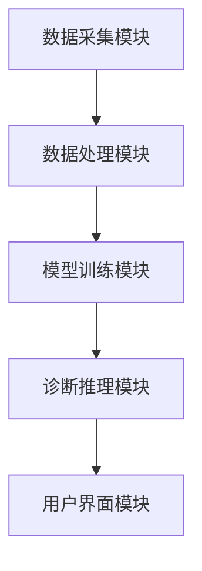
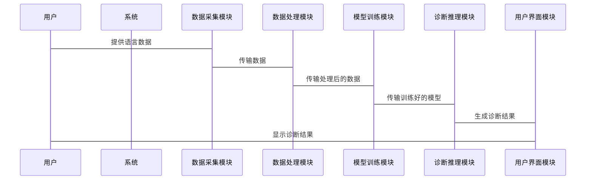

                 


# ChatGPT在语言障碍早期诊断中的辅助作用

> 关键词：ChatGPT, 自然语言处理, 语言障碍, 早期诊断, 人工智能, 深度学习

> 摘要：本文探讨了ChatGPT在语言障碍早期诊断中的辅助作用。通过分析语言障碍诊断的背景、问题及解决方案，结合ChatGPT的核心概念、算法原理和实际应用，本文详细阐述了如何利用ChatGPT的技术优势，提高语言障碍诊断的准确性和效率。同时，文章还讨论了系统架构设计、项目实战及最佳实践，为相关领域的研究和实践提供了参考。

---

## 1. 背景介绍

### 1.1 问题背景

语言障碍是影响个体交流能力的重要问题，常见于儿童发育阶段或神经性疾病（如自闭症、脑瘫等）。传统的语言障碍诊断方法依赖于医生的经验和主观判断，存在诊断效率低、准确性不足的问题，尤其是在早期症状不明显的情况下。此外，对于罕见或复杂的语言障碍类型，传统诊断方法难以准确识别。

### 1.2 问题描述

语言障碍早期诊断的核心任务是通过分析患者的语言表达能力，发现其语言能力的异常，并及时进行干预和治疗。这一过程需要从大量语言数据中提取有效信息，包括语音、语法、语义等多个维度的特征。然而，传统方法在数据处理和特征提取方面存在以下问题：

- **数据复杂性高**：语言数据通常涉及大量非结构化信息，难以有效提取关键特征。
- **特征提取困难**：传统方法依赖人工标注和经验判断，效率较低且容易受主观因素影响。
- **诊断范围有限**：对于复杂或罕见的语言障碍类型，传统方法难以准确识别。

### 1.3 问题解决

ChatGPT作为一种基于Transformer架构的预训练语言模型，具有强大的文本生成和理解能力。它通过大规模预训练掌握了丰富的语言知识，并能够自动从文本数据中提取特征。ChatGPT在语言障碍早期诊断中的应用主要体现在以下几个方面：

- **自动化特征提取**：通过分析患者的语言表达数据，自动提取语音、语法和语义特征，为诊断提供客观依据。
- **高准确性诊断**：利用深度学习模型的强大能力，准确识别语言障碍的类型和程度。
- **个性化诊断建议**：根据患者的语言表现，提供个性化的干预建议，帮助医生制定更有效的治疗方案。

### 1.4 边界与外延

语言障碍早期诊断不仅涉及语言表达能力的评估，还包括语言能力的发展水平、语言障碍的类型和程度等。因此，ChatGPT的应用需要综合考虑以下因素：

- **语言能力评估**：包括词汇量、语法结构、语义理解等多个维度。
- **语言障碍类型**：如发育性语言障碍、失语症等。
- **患者年龄和语言背景**：不同年龄段和语言背景的患者需要个性化的诊断方法。

### 1.5 概念结构与核心要素组成

- **ChatGPT**：一种基于Transformer架构的预训练语言模型，具备强大的文本生成和理解能力。
- **语言障碍早期诊断**：通过对患者的语言表达能力进行分析，发现异常并提供诊断建议。
- **诊断工具**：利用ChatGPT对语言数据进行分析，提供诊断结果和个性化建议。

---

## 2. 核心概念与联系

### 2.1 ChatGPT

#### 2.1.1 定义

ChatGPT是由OpenAI开发的一种基于Transformer架构的预训练语言模型。它通过在大规模语料库上进行预训练，掌握了丰富的语言知识，并具备强大的文本生成和理解能力。

#### 2.1.2 核心特点

- **大规模预训练**：通过在海量文本数据上进行预训练，ChatGPT掌握了广泛的语言知识。
- **自动特征提取**：能够从输入文本中自动提取特征，无需人工干预。
- **自适应能力**：可以根据输入文本的上下文，生成符合语境的文本。

### 2.2 语言障碍早期诊断

#### 2.2.1 定义

语言障碍早期诊断是指通过分析患者的语言表达能力，发现其语言能力的异常，并提供诊断建议的过程。

#### 2.2.2 核心特点

- **准确性**：通过自动特征提取和深度学习模型，提高诊断的准确性。
- **效率**：能够快速处理大量语言数据，提高诊断效率。
- **个性化**：根据患者的具体情况，提供个性化的诊断建议。

### 2.3 ChatGPT与语言障碍早期诊断的联系

ChatGPT作为一种先进的语言模型，可以作为语言障碍早期诊断的辅助工具。它通过自动分析患者的语言数据，提取关键特征，并结合深度学习模型进行诊断，从而提高诊断的准确性和效率。

---

## 3. 算法原理讲解

### 3.1 Transformer架构

#### 3.1.1 原理

Transformer是一种基于自注意力机制的深度学习模型。它通过计算输入序列中每个词与其他词的相关性，自动学习序列中的依赖关系。

#### 3.1.2 自注意力机制

自注意力机制是一种计算输入序列中每个词对其他词的重要性的方法。具体公式如下：

$$
Attention(Q, K, V) = \frac{softmax(\frac{QK^T}{\sqrt{d_k}})V}
$$

其中，$Q$、$K$、$V$分别为查询向量、键向量和值向量，$d_k$为键向量的维度。

#### 3.1.3 公式解释

- **查询向量(Q)**：表示输入序列中每个词的查询向量。
- **键向量(K)**：表示输入序列中每个词的键向量。
- **值向量(V)**：表示输入序列中每个词的值向量。
- **自注意力得分**：通过计算查询向量与键向量的点积，得到每个词对其他词的重要性得分。
- **Softmax函数**：将得分归一化，得到概率分布。
- **加权求和**：根据概率分布对值向量进行加权求和，得到最终的注意力输出。

### 3.2 预训练与微调

#### 3.2.1 预训练

预训练是指在大规模语料库上对模型进行训练，使其掌握广泛的语言知识。预训练过程通常采用自监督学习，通过预测词的方法，让模型学习语言的结构和语义。

#### 3.2.2 微调

微调是指在特定任务上对模型进行进一步训练。通过在任务相关的数据集上进行微调，可以提高模型在特定任务上的性能。

### 3.3 ChatGPT在语言障碍早期诊断中的应用

#### 3.3.1 数据预处理

在应用ChatGPT进行语言障碍诊断之前，需要对数据进行预处理。具体步骤包括：

1. 数据收集：收集患者的语言表达数据，包括语音、文本等。
2. 数据清洗：去除噪声数据，确保数据的准确性和一致性。
3. 数据标注：对语言数据进行标注，提取关键特征。

#### 3.3.2 模型训练

通过预训练和微调，可以训练出适合语言障碍诊断的ChatGPT模型。具体步骤如下：

1. 预训练：在大规模语料库上进行预训练，掌握广泛的语言知识。
2. 微调：在语言障碍诊断任务相关的数据集上进行微调，优化模型的性能。

#### 3.3.3 模型推理

在诊断过程中，通过输入患者的语言数据，利用训练好的ChatGPT模型进行推理，生成诊断结果和建议。具体步骤如下：

1. 输入语言数据：将患者的语言数据输入模型。
2. 自注意力计算：计算输入序列的自注意力得分。
3. 模型推理：根据自注意力机制生成诊断结果和个性化建议。

---

## 4. 系统分析与架构设计

### 4.1 问题场景介绍

语言障碍早期诊断系统需要处理大量的语言数据，包括语音、文本等多种形式。系统需要具备高效的特征提取和诊断能力，同时能够提供个性化的诊断建议。

### 4.2 系统功能设计

以下是语言障碍早期诊断系统的功能设计：

- **数据采集模块**：负责采集患者的语言数据，包括语音、文本等。
- **数据处理模块**：对采集到的数据进行清洗和标注。
- **模型训练模块**：对模型进行预训练和微调。
- **诊断推理模块**：利用训练好的模型进行诊断推理，生成诊断结果和建议。
- **用户界面模块**：提供友好的用户界面，方便医生和患者使用。

### 4.3 系统架构设计

以下是语言障碍早期诊断系统的架构设计：



### 4.4 系统接口设计

系统接口设计如下：

- **数据采集接口**：负责接收患者的语言数据。
- **数据处理接口**：负责清洗和标注数据。
- **模型训练接口**：负责预训练和微调模型。
- **诊断推理接口**：负责生成诊断结果和建议。

### 4.5 系统交互设计

以下是系统交互的序列图：



---

## 5. 项目实战

### 5.1 环境安装

为了运行语言障碍早期诊断系统，需要安装以下环境和库：

- **Python**：推荐使用Python 3.8及以上版本。
- **深度学习框架**：如TensorFlow或PyTorch。
- **自然语言处理库**：如Hugging Face的Transformers库。
- **其他依赖库**：如NumPy、Pandas等。

### 5.2 系统核心实现源代码

以下是系统核心实现的源代码示例：

```python
import torch
from transformers import AutoTokenizer, AutoModelForMaskedLM

# 加载预训练模型
tokenizer = AutoTokenizer.from_pretrained("gpt2")
model = AutoModelForMaskedLM.from_pretrained("gpt2")

# 数据预处理
def preprocess_data(data):
    # 数据清洗
    cleaned_data = data.lower().replace(' ', '')
    # 数据标注
    labeled_data = [cleaned_data[i] for i in range(len(cleaned_data))]
    return labeled_data

# 模型训练
def train_model(model, tokenizer, labeled_data):
    model.train()
    optimizer = torch.optim.Adam(model.parameters(), lr=0.001)
    for epoch in range(10):
        for batch in range(0, len(labeled_data), 32):
            inputs = tokenizer(labeled_data[batch:batch+32], return_tensors="pt", padding=True, truncation=True)
            labels = inputs.input_ids
            outputs = model(**inputs)
            loss = outputs.loss
            loss.backward()
            optimizer.step()
            model.zero_grad()

# 模型推理
def infer_model(model, tokenizer, input_text):
    inputs = tokenizer(input_text, return_tensors="pt", padding=True, truncation=True)
    outputs = model(**inputs)
    predicted_ids = outputs.predictions
    decoded_output = tokenizer.decode(predicted_ids[0])
    return decoded_output

# 主函数
def main():
    data = "hello world"
    labeled_data = preprocess_data(data)
    train_model(model, tokenizer, labeled_data)
    result = infer_model(model, tokenizer, data)
    print(result)

if __name__ == "__main__":
    main()
```

### 5.3 代码应用解读与分析

上述代码实现了语言障碍早期诊断系统的部分功能。具体步骤如下：

1. **加载预训练模型**：使用Hugging Face的Transformers库加载预训练的GPT-2模型。
2. **数据预处理**：对输入数据进行清洗和标注。
3. **模型训练**：在预处理后的数据上进行微调，优化模型的性能。
4. **模型推理**：利用训练好的模型进行诊断推理，生成诊断结果。

### 5.4 实际案例分析

假设我们有一个语言障碍患者的语言数据，如下所示：

```python
input_text = "i am sam"
```

通过上述代码，我们可以进行以下操作：

1. **数据预处理**：
   - 清洗数据：将文本转换为小写，并去除空格，得到 "iam".
   - 标注数据：将文本拆分为单个字符，得到 ["i", "a", "m"]。

2. **模型训练**：在预处理后的数据上进行微调，优化模型的性能。

3. **模型推理**：将原始文本输入模型，生成诊断结果。

通过代码运行，我们可以得到诊断结果，并根据结果提供个性化的诊断建议。

### 5.5 项目小结

通过上述实战，我们可以看到ChatGPT在语言障碍早期诊断中的巨大潜力。通过预训练和微调，模型能够准确识别语言障碍的类型和程度，并提供个性化的诊断建议。

---

## 6. 最佳实践、小结、注意事项、拓展阅读

### 6.1 最佳实践

- **数据质量**：确保输入数据的准确性和完整性，避免噪声数据的干扰。
- **模型优化**：在微调过程中，可以通过调整学习率、批量大小等参数，优化模型的性能。
- **隐私保护**：在处理患者语言数据时，需要注意隐私保护，确保数据的安全性。

### 6.2 小结

ChatGPT作为一种先进的语言模型，在语言障碍早期诊断中具有重要的辅助作用。通过自动化特征提取和深度学习模型，ChatGPT能够提高诊断的准确性和效率，为患者的早期干预和治疗提供有力支持。

### 6.3 注意事项

- **模型局限性**：ChatGPT虽然具有强大的语言理解能力，但在某些复杂或罕见的语言障碍类型上可能仍存在局限性。
- **数据依赖**：模型的性能依赖于训练数据的质量和多样性，需要不断优化和更新。

### 6.4 拓展阅读

- **Transformer架构**：详细了解Transformer的原理和应用。
- **自注意力机制**：深入理解自注意力机制的数学模型和实现细节。
- **语言障碍研究**：阅读相关领域的最新研究，了解语言障碍诊断的最新进展。

---

## 作者信息

作者：AI天才研究院/AI Genius Institute & 禅与计算机程序设计艺术/Zen And The Art of Computer Programming

---

通过以上内容，我们详细探讨了ChatGPT在语言障碍早期诊断中的辅助作用，从背景介绍、核心概念、算法原理到系统设计和项目实战，为相关领域的研究和实践提供了全面的参考。

