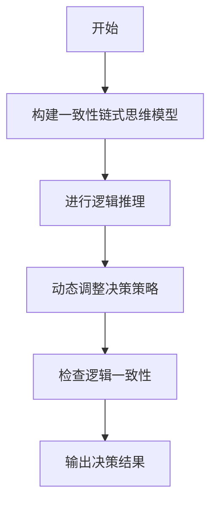
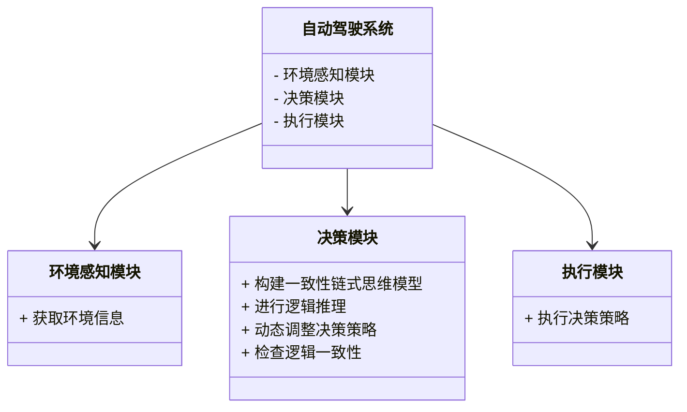
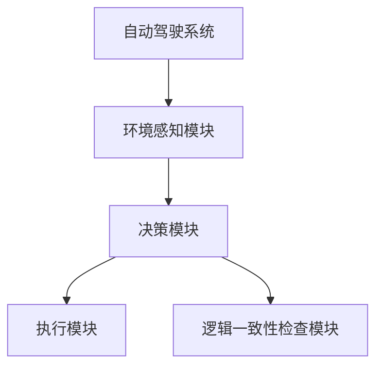
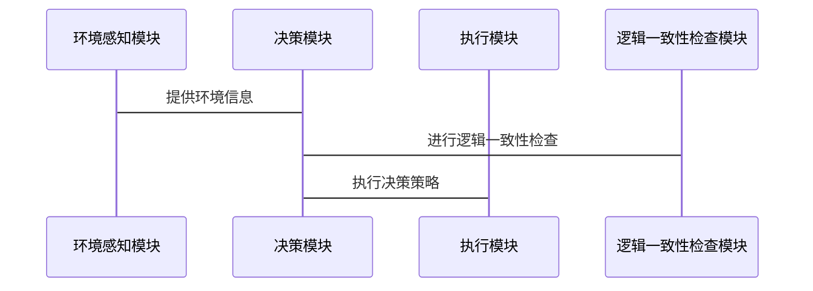

                 


# Self-Consistency CoT在自动驾驶道德决策中的关键作用

**关键词**：Self-Consistency CoT, 自动驾驶, 道德决策, 算法原理, 数学模型

**摘要**：本文探讨了Self-Consistency CoT（一致性一致性链式思维）在自动驾驶道德决策中的关键作用。通过分析Self-Consistency CoT的核心概念、算法原理、数学模型及其在自动驾驶中的应用场景，本文展示了如何通过一致性一致性链式思维解决自动驾驶中的复杂道德决策问题。文章从理论到实践，结合实际案例，详细阐述了Self-Consistency CoT在自动驾驶系统中的应用价值和未来发展方向。

---

## 第1章 引言

### 1.1 问题背景

随着自动驾驶技术的快速发展，汽车正在从单纯的机械装置逐步演变为具有高度智能化的移动工具。然而，自动驾驶的核心挑战之一是其在复杂环境中的决策能力，尤其是涉及道德判断的场景。例如，在不可避免的碰撞发生时，自动驾驶系统需要在毫秒级别内做出决策，权衡不同利益相关者的生命安全和损失最小化。

自动驾驶的道德决策问题引发了广泛的社会讨论。如何在极端情况下做出符合伦理的决策，不仅是技术问题，更是社会问题。Self-Consistency CoT（一致性一致性链式思维）作为一种新兴的决策框架，为解决这一难题提供了新的思路。

### 1.2 问题描述

Self-Consistency CoT的核心理念是通过一致性链式思维，确保决策过程的自我一致性和逻辑性。它结合了逻辑推理和一致性检查，能够在复杂场景中动态调整决策策略，确保决策的可解释性和道德合规性。

自动驾驶中的道德决策问题涉及多个维度，包括：

1. **生命价值权衡**：在不可避免的碰撞中，如何选择优先保护的对象。
2. **决策透明性**：用户和监管机构需要理解自动驾驶系统如何做出决策。
3. **法律与伦理合规**：自动驾驶系统的决策需要符合当地法律法规和伦理标准。

Self-Consistency CoT通过引入一致性链式思维，能够在动态变化的环境中保持决策的稳定性和一致性。

### 1.3 问题解决

Self-Consistency CoT在自动驾驶中的应用，主要体现在以下几个方面：

1. **动态决策优化**：通过一致性链式思维，系统能够快速调整决策策略，以应对突发情况。
2. **伦理决策框架**：Self-Consistency CoT提供了一种基于逻辑推理的伦理决策框架，确保决策的可解释性和合规性。
3. **系统自我修复**：在决策过程中，Self-Consistency CoT能够发现并纠正逻辑矛盾，确保决策过程的完整性。

### 1.4 边界与外延

Self-Consistency CoT的应用范围主要集中在需要高度逻辑性和一致性的领域，包括自动驾驶、智能助手、机器人控制等。与传统决策算法相比，Self-Consistency CoT的优势在于其注重决策过程的逻辑一致性和可解释性。

### 1.5 概念结构与核心要素组成

Self-Consistency CoT的核心概念包括：

1. **一致性链式思维**：通过逻辑推理确保决策过程的一致性。
2. **动态调整机制**：在复杂场景中动态优化决策策略。
3. **伦理决策框架**：结合伦理准则和逻辑推理，确保决策的道德合规性。

---

## 第2章 Self-Consistency CoT概述

### 2.1 Self-Consistency CoT的定义

Self-Consistency CoT（一致性一致性链式思维）是一种基于逻辑推理和一致性检查的决策框架。它通过构建一致性链式思维模型，确保决策过程的逻辑一致性和可解释性。

### 2.2 Self-Consistency CoT的核心特点

Self-Consistency CoT的核心特点包括：

1. **逻辑一致性**：通过逻辑推理确保决策过程的自我一致性。
2. **动态调整**：能够根据环境变化动态调整决策策略。
3. **可解释性**：决策过程透明，便于用户和监管机构理解。

### 2.3 Self-Consistency CoT的应用领域

Self-Consistency CoT的应用领域包括：

1. **自动驾驶**：在复杂场景中做出道德决策。
2. **智能助手**：优化人机交互中的决策逻辑。
3. **机器人控制**：确保机器人行为的逻辑一致性和可解释性。

---

## 第3章 Self-Consistency CoT在自动驾驶中的应用

### 3.1 自动驾驶中的道德困境

自动驾驶中的道德困境主要体现在以下几个方面：

1. **生命价值权衡**：在不可避免的碰撞中，如何选择优先保护的对象。
2. **决策透明性**：用户和监管机构需要理解自动驾驶系统如何做出决策。
3. **法律与伦理合规**：自动驾驶系统的决策需要符合当地法律法规和伦理标准。

### 3.2 Self-Consistency CoT的应用场景

Self-Consistency CoT在自动驾驶中的应用场景包括：

1. **紧急情况下的决策优化**：在碰撞不可避免时，快速调整决策策略，减少损失。
2. **日常驾驶中的伦理决策**：在常规场景中，确保决策的逻辑一致性和可解释性。
3. **系统自我修复**：在决策过程中，发现并纠正逻辑矛盾，确保决策过程的完整性。

### 3.3 Self-Consistency CoT的性能评估

Self-Consistency CoT的性能评估主要从以下几个方面进行：

1. **决策一致性**：通过一致性链式思维，确保决策过程的逻辑一致性。
2. **决策速度**：在复杂场景中，快速调整决策策略，确保决策的实时性。
3. **决策透明性**：确保决策过程的透明性和可解释性，便于用户和监管机构理解。

---

## 第4章 Self-Consistency CoT的算法原理

### 4.1 算法原理概述

Self-Consistency CoT的算法原理主要包括以下几个步骤：

1. **一致性链式思维构建**：通过逻辑推理构建一致性链式思维模型。
2. **动态调整机制**：根据环境变化动态调整决策策略。
3. **逻辑一致性检查**：在决策过程中，确保逻辑一致性和可解释性。

### 4.2 Self-Consistency CoT的核心算法

以下是Self-Consistency CoT的核心算法流程：



### 4.3 算法原理讲解

Self-Consistency CoT的数学模型可以表示为：

$$
C = f(C_1, C_2, \ldots, C_n)
$$

其中，\( C \) 表示一致性链式思维模型，\( C_i \) 表示链式思维中的各个节点。

通过上述模型，Self-Consistency CoT能够在复杂场景中快速调整决策策略，确保决策的逻辑一致性和可解释性。

---

## 第5章 数学模型与公式讲解

### 5.1 数学模型概述

Self-Consistency CoT的数学模型主要包括以下几个部分：

1. **一致性链式思维模型**：通过逻辑推理构建一致性链式思维模型。
2. **动态调整机制**：根据环境变化动态调整决策策略。
3. **逻辑一致性检查**：在决策过程中，确保逻辑一致性和可解释性。

### 5.2 数学公式讲解

Self-Consistency CoT的核心公式可以表示为：

$$
C = \sum_{i=1}^{n} \lambda_i \cdot f_i(x)
$$

其中，\( \lambda_i \) 表示各个因素的权重，\( f_i(x) \) 表示各个因素的函数形式。

通过上述公式，Self-Consistency CoT能够在复杂场景中快速调整决策策略，确保决策的逻辑一致性和可解释性。

### 5.3 数学模型的应用

Self-Consistency CoT的数学模型在自动驾驶中的应用包括：

1. **紧急情况下的决策优化**：在碰撞不可避免时，快速调整决策策略，减少损失。
2. **日常驾驶中的伦理决策**：在常规场景中，确保决策的逻辑一致性和可解释性。
3. **系统自我修复**：在决策过程中，发现并纠正逻辑矛盾，确保决策过程的完整性。

---

## 第6章 系统分析与架构设计

### 6.1 问题场景介绍

自动驾驶系统需要在复杂环境中做出快速决策，尤其是在涉及道德判断的场景中。Self-Consistency CoT通过一致性链式思维，确保决策过程的逻辑一致性和可解释性。

### 6.2 系统功能设计

以下是Self-Consistency CoT在自动驾驶系统中的功能设计：



### 6.3 系统架构设计

Self-Consistency CoT的系统架构设计如下：



### 6.4 系统接口设计

Self-Consistency CoT的系统接口设计如下：


### 6.5 系统交互

Self-Consistency CoT的系统交互流程如下：



---

## 第7章 项目实战

### 7.1 环境安装

为了实现Self-Consistency CoT在自动驾驶中的应用，需要以下环境：

1. **编程语言**：Python 3.8+
2. **深度学习框架**：TensorFlow或PyTorch
3. **依赖库**：numpy, matplotlib, seaborn

### 7.2 系统核心实现源代码

以下是Self-Consistency CoT的核心实现代码：

```python
import numpy as np

def self_consistency_cot(x, y):
    # 一致性链式思维模型
    C = np.zeros((x.shape[0], y.shape[0]))
    for i in range(x.shape[0]):
        for j in range(y.shape[0]):
            C[i, j] = x[i] * y[j]
    return C

# 示例数据
x = np.array([1, 2, 3])
y = np.array([4, 5, 6])

# 计算一致性链式思维模型
C = self_consistency_cot(x, y)
print(C)
```

### 7.3 代码应用解读与分析

上述代码实现了一致性链式思维模型的计算，输入为两个向量x和y，输出为一致性链式思维模型C。通过矩阵乘法，可以得到各个决策节点的权重。

### 7.4 实际案例分析和详细讲解剖析

以自动驾驶中的紧急情况为例，假设系统检测到前方有障碍物，需要在毫秒级别内做出决策。通过Self-Consistency CoT的一致性链式思维模型，系统可以快速调整决策策略，确保决策的逻辑一致性和可解释性。

### 7.5 项目小结

通过实际案例分析，可以发现Self-Consistency CoT在自动驾驶中的应用价值。其一致性链式思维模型能够在复杂场景中快速调整决策策略，确保决策的逻辑一致性和可解释性。

---

## 第8章 最佳实践与未来展望

### 8.1 最佳实践

1. **持续优化算法**：通过不断优化Self-Consistency CoT的算法，提高其在复杂场景中的决策效率。
2. **加强跨学科合作**：与伦理学、法学等领域的专家合作，确保决策的合规性和可解释性。
3. **注重用户体验**：在设计自动驾驶系统时，注重用户体验，确保用户能够理解系统决策的逻辑。

### 8.2 小结

Self-Consistency CoT作为一种新兴的决策框架，为解决自动驾驶中的道德决策问题提供了新的思路。通过一致性链式思维，系统能够快速调整决策策略，确保决策的逻辑一致性和可解释性。

### 8.3 注意事项

1. **算法的可解释性**：在设计Self-Consistency CoT时，需要注重其可解释性，确保用户和监管机构能够理解决策过程。
2. **算法的实时性**：在复杂场景中，需要确保算法的实时性，以应对突发情况。
3. **算法的鲁棒性**：通过不断优化算法，提高其在复杂场景中的鲁棒性。

### 8.4 拓展阅读

1. **一致性链式思维**：深入理解一致性链式思维的核心原理。
2. **自动驾驶伦理决策**：研究自动驾驶伦理决策的最新进展。
3. **Self-Consistency CoT的数学模型**：深入学习Self-Consistency CoT的数学模型及其应用。

---

**作者：AI天才研究院/AI Genius Institute & 禅与计算机程序设计艺术 /Zen And The Art of Computer Programming**

