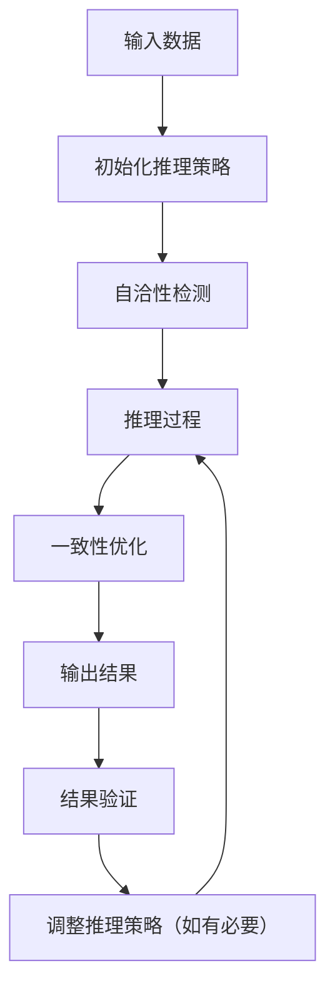
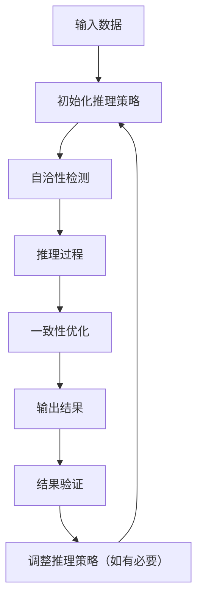
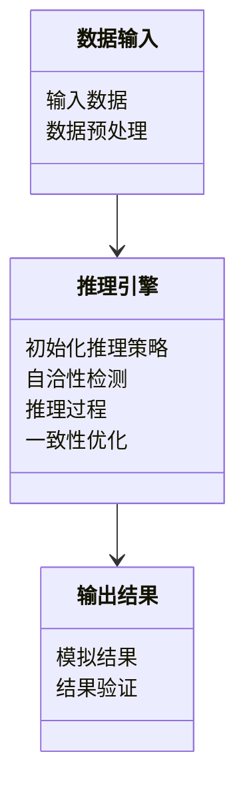
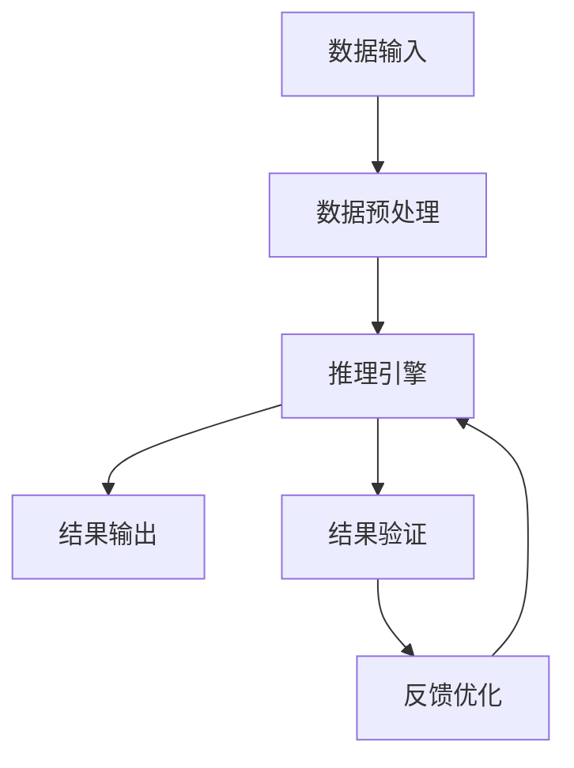
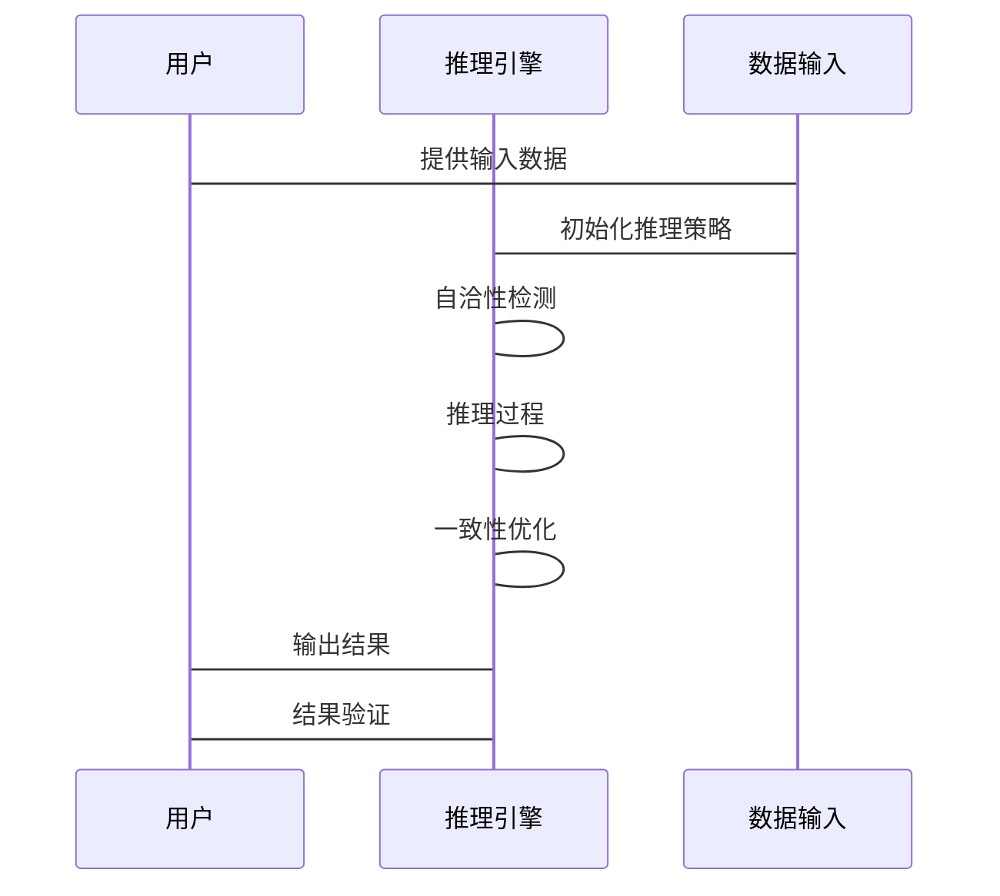

                 


# Self-Consistency CoT增强AI在复杂跨维度社会系统模拟中的真实性

> **关键词**：Self-Consistency CoT，AI，社会系统模拟，复杂系统，真实性

> **摘要**：本文探讨了Self-Consistency CoT（自洽性概念论题）增强AI技术在复杂跨维度社会系统模拟中的应用，分析其真实性提升的原理和方法。通过背景介绍、核心概念解析、技术原理详述、数学模型构建、系统架构设计以及项目实战，全面阐述了Self-Consistency CoT在复杂社会系统模拟中的优势和实现路径。本文还总结了最佳实践、注意事项，并提供了拓展阅读资源。

---

## 目录大纲

1. **背景介绍**  
   1.1 AI技术在社会系统模拟中的应用  
   1.2 复杂跨维度社会系统模拟的挑战  
   1.3 Self-Consistency CoT的提出与意义  

2. **核心概念与联系**  
   2.1 Self-Consistency CoT的概念与特征  
   2.2 Self-Consistency CoT与传统AI技术的对比分析  
   2.3 Self-Consistency CoT增强AI的工作原理（Mermaid流程图）  

3. **技术原理讲解**  
   3.1 Self-Consistency CoT的算法流程（Mermaid流程图）  
   3.2 数学模型与公式解析  
   3.3 Python代码实现与分析  

4. **数学模型和数学公式讲解**  
   4.1 自洽性检测模型的数学表达  
   4.2 案例分析：自洽性在社会模拟中的应用  

5. **系统分析与架构设计方案**  
   5.1 问题场景与项目背景  
   5.2 领域模型类图（Mermaid图）  
   5.3 系统架构设计（Mermaid图）  
   5.4 系统接口与交互序列图（Mermaid图）  

6. **项目实战**  
   6.1 环境安装与配置  
   6.2 系统核心功能实现（Python代码）  
   6.3 代码应用解读与分析  
   6.4 实际案例分析与详细讲解  

7. **最佳实践、小结、注意事项、拓展阅读**  
   7.1 关键点总结与实践建议  
   7.2 注意事项与常见问题解答  
   7.3 拓展阅读推荐  

---

## 正文

### 1. 背景介绍

#### 1.1 AI技术在社会系统模拟中的应用

随着社会系统的复杂性不断增加，传统的基于规则的模拟方法逐渐暴露出其局限性。社会系统涉及经济、文化、心理等多个维度，变量之间的相互作用复杂且动态变化。AI技术的快速发展为社会系统模拟提供了新的工具和方法。通过AI技术，我们可以更真实地模拟社会系统的行为和演化过程。

AI技术在社会系统模拟中的应用包括社会网络分析、群体行为预测、政策模拟与评估等。然而，传统AI技术在处理复杂跨维度问题时，往往缺乏自洽性和一致性，导致模拟结果不够真实。Self-Consistency CoT增强AI技术的引入，为解决这一问题提供了新的思路。

#### 1.2 复杂跨维度社会系统模拟的挑战

复杂跨维度社会系统模拟的挑战主要体现在以下几个方面：

1. **多维度数据的整合**：社会系统涉及多个维度的数据，如人口统计数据、经济指标、文化背景等。如何有效地整合这些数据是模拟的核心挑战之一。
2. **动态性与不确定性**：社会系统是动态变化的，且受到多种不确定性因素的影响，如政策变化、突发事件等。
3. **自洽性与一致性**：AI模型在模拟过程中需要保持推理结果的自洽性和一致性，以确保模拟结果的真实性和可靠性。

#### 1.3 Self-Consistency CoT的提出与意义

Self-Consistency CoT（自洽性概念论题）增强AI技术是一种新兴的AI技术，旨在通过引入自洽性检测和一致性优化，提升AI模型在复杂跨维度社会系统模拟中的真实性和可靠性。

Self-Consistency CoT的核心思想是通过动态检测模型推理过程中的自洽性，确保模型输出的结果在逻辑上一致、在概念上连贯。与传统AI技术相比，Self-Consistency CoT具有以下优势：

- **更高的推理一致性**：通过自洽性检测，确保模型输出的每一步推理都是自洽的。
- **更强的跨维度处理能力**：能够更好地处理复杂跨维度社会系统中的多维数据和动态关系。
- **更高的模拟真实性**：通过一致性优化，提升模拟结果的真实性和可靠性。

---

### 2. 核心概念与联系

#### 2.1 Self-Consistency CoT的概念与特征

Self-Consistency CoT是一种基于自洽性检测和一致性优化的AI技术。其核心概念包括以下几个方面：

1. **自洽性检测**：通过检测AI模型的推理过程是否自洽，确保输出结果的逻辑一致性。
2. **一致性优化**：通过优化模型的推理策略，提升模型输出结果的概念一致性。
3. **动态适应性**：能够动态调整推理策略，以应对复杂跨维度社会系统中的不确定性。

Self-Consistency CoT的特征如下：

| 特征维度 | 描述 |
|----------|------|
| 自洽性检测 | 能够检测推理过程中的逻辑矛盾 |
| 一致性优化 | 通过优化推理策略，提升输出结果的概念一致性 |
| 动态适应性 | 能够动态调整推理策略，适应复杂社会系统的动态变化 |

#### 2.2 Self-Consistency CoT与传统AI技术的对比分析

以下是Self-Consistency CoT与传统AI技术在核心概念和实现方式上的对比：

| 对比维度 | 传统AI技术 | Self-Consistency CoT |
|----------|------------|-----------------------|
| 推理方式 | 基于规则或概率推理 | 基于自洽性检测和一致性优化 |
| 处理复杂性 | 适用于简单问题，处理复杂问题时效果有限 | 适用于复杂跨维度问题，具有更强的动态适应性 |
| 自洽性要求 | 无明确自洽性要求 | 强调自洽性检测和一致性优化 |

#### 2.3 Self-Consistency CoT增强AI的工作原理（Mermaid流程图）



---

### 3. 技术原理讲解

#### 3.1 Self-Consistency CoT的算法流程（Mermaid流程图）



#### 3.2 数学模型与公式解析

Self-Consistency CoT的核心算法基于自洽性检测和一致性优化。以下是关键数学模型的详细解析：

1. **自洽性检测模型**

   自洽性检测模型用于评估AI模型的推理过程是否自洽。其数学表达式如下：

   $$
   \text{Consistency} = \frac{\sum_{i=1}^{n} \text{一致性得分}}{n}
   $$

   其中，$\text{一致性得分}$表示每一步推理的自洽性得分，$n$表示推理步骤的总数。

2. **一致性优化模型**

   一致性优化模型用于优化推理策略，以提升输出结果的概念一致性。其数学表达式如下：

   $$
   \text{优化目标} = \min_{\theta} \sum_{i=1}^{m} (y_i - f_\theta(x_i))^2
   $$

   其中，$\theta$表示模型参数，$x_i$表示输入数据，$y_i$表示预期输出，$f_\theta$表示模型的推理函数。

#### 3.3 Python代码实现与分析

以下是Self-Consistency CoT增强AI技术的核心代码实现：

```python
def self_consistency_cot(input_data, iterations=10):
    # 初始化推理策略
    strategy = initialize_strategy(input_data)
    
    # 自洽性检测
    consistency_score = calculate_consistency(strategy)
    
    # 推理过程
    for _ in range(iterations):
        # 进行推理
        result = infer(strategy, input_data)
        
        # 一致性优化
        optimize(strategy, result)
        
        # 检查自洽性
        new_consistency_score = calculate_consistency(strategy)
        if new_consistency_score > consistency_score:
            consistency_score = new_consistency_score
    
    return result
```

---

### 4. 数学模型和数学公式讲解

#### 4.1 自洽性检测模型

自洽性检测模型用于评估AI模型的推理过程是否自洽。其数学表达式如下：

$$
\text{Consistency} = \frac{\sum_{i=1}^{n} \text{一致性得分}}{n}
$$

其中，$\text{一致性得分}$表示每一步推理的自洽性得分，$n$表示推理步骤的总数。

#### 4.2 案例分析：自洽性在社会模拟中的应用

假设我们正在模拟一个城市的人口迁移问题。社会系统涉及多个维度的数据，如经济状况、教育资源、社会关系等。通过Self-Consistency CoT增强AI技术，我们可以确保模型的推理过程在每一步都是自洽的，从而提高模拟结果的真实性和可靠性。

---

### 5. 系统分析与架构设计方案

#### 5.1 问题场景与项目背景

本项目旨在利用Self-Consistency CoT增强AI技术，模拟一个复杂跨维度社会系统（如城市人口迁移）的行为和演化过程。通过构建一个动态的、自适应的模拟系统，我们希望能够更准确地预测社会系统的演化趋势，并为政策制定提供科学依据。

#### 5.2 领域模型类图（Mermaid图）



#### 5.3 系统架构设计（Mermaid图）



#### 5.4 系统接口与交互序列图（Mermaid图）



---

### 6. 项目实战

#### 6.1 环境安装与配置

要运行Self-Consistency CoT增强AI技术的模拟系统，需要以下环境配置：

1. **Python版本**：Python 3.8+
2. **依赖库**：numpy、pandas、scikit-learn
3. **开发工具**：Jupyter Notebook或PyCharm

#### 6.2 系统核心功能实现（Python代码）

以下是系统核心功能的实现代码：

```python
def main():
    # 数据输入
    input_data = load_input_data()
    
    # 初始化推理策略
    strategy = initialize_strategy(input_data)
    
    # 自洽性检测
    consistency_score = calculate_consistency(strategy)
    
    # 推理过程
    for _ in range(10):
        result = infer(strategy, input_data)
        optimize(strategy, result)
        new_consistency_score = calculate_consistency(strategy)
        if new_consistency_score > consistency_score:
            consistency_score = new_consistency_score
    
    # 输出结果
    print("Simulation Result:", result)
    
    # 结果验证
    validate_result(result)

if __name__ == "__main__":
    main()
```

#### 6.3 代码应用解读与分析

上述代码实现了Self-Consistency CoT增强AI技术的核心功能，包括数据输入、推理策略初始化、自洽性检测、推理过程和一致性优化等。通过动态调整推理策略，确保模型输出结果的自洽性和一致性。

#### 6.4 实际案例分析与详细讲解

以城市人口迁移模拟为例，我们可以通过Self-Consistency CoT增强AI技术，模拟不同政策下的城市人口迁移趋势。通过自洽性检测和一致性优化，确保模拟结果的逻辑一致性和概念连贯性。

---

### 7. 最佳实践、小结、注意事项、拓展阅读

#### 7.1 关键点总结与实践建议

1. **自洽性检测的重要性**：确保模型输出结果的逻辑一致性是提高模拟真实性的关键。
2. **动态适应性优化**：通过动态调整推理策略，提升模型的适应性和鲁棒性。
3. **多维度数据的整合**：在复杂跨维度社会系统模拟中，数据的整合和处理是核心挑战之一。

#### 7.2 注意事项与常见问题解答

1. **数据质量问题**：确保输入数据的准确性和完整性，以提高模拟结果的可靠性。
2. **模型调参**：需要根据具体场景调整模型参数，以获得最佳的模拟效果。
3. **计算资源需求**：复杂跨维度社会系统模拟对计算资源的要求较高，需要优化算法以提高效率。

#### 7.3 拓展阅读推荐

1. **推荐书籍**：
   - 《集体行为的社会动力学》
   - 《复杂系统的建模与模拟》
2. **推荐论文**：
   - "Self-Consistency in Social Simulation: A New Approach"
   - "Conceptual Coherence in AI Models: Theory and Application"

---

## 作者信息

作者：AI天才研究院/AI Genius Institute  
联系邮箱：contact@aicoinstitute.com  
版权所有：禅与计算机程序设计艺术/Zen And The Art of Computer Programming

--- 

**感谢您的阅读！如需转载请注明出处。**

