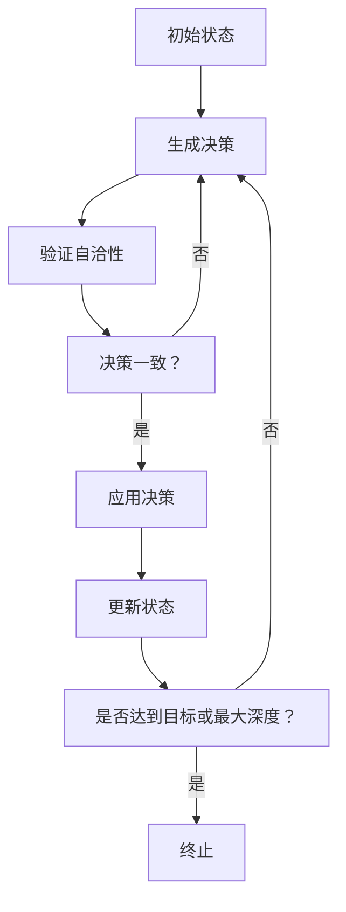
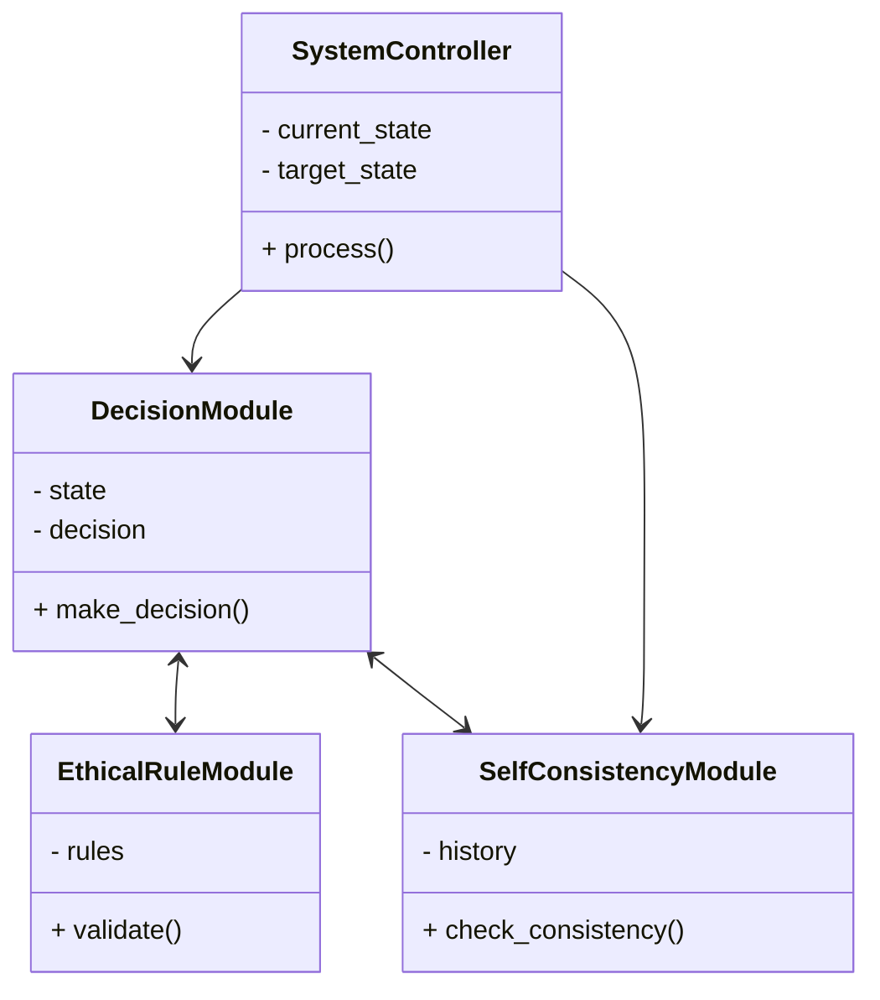
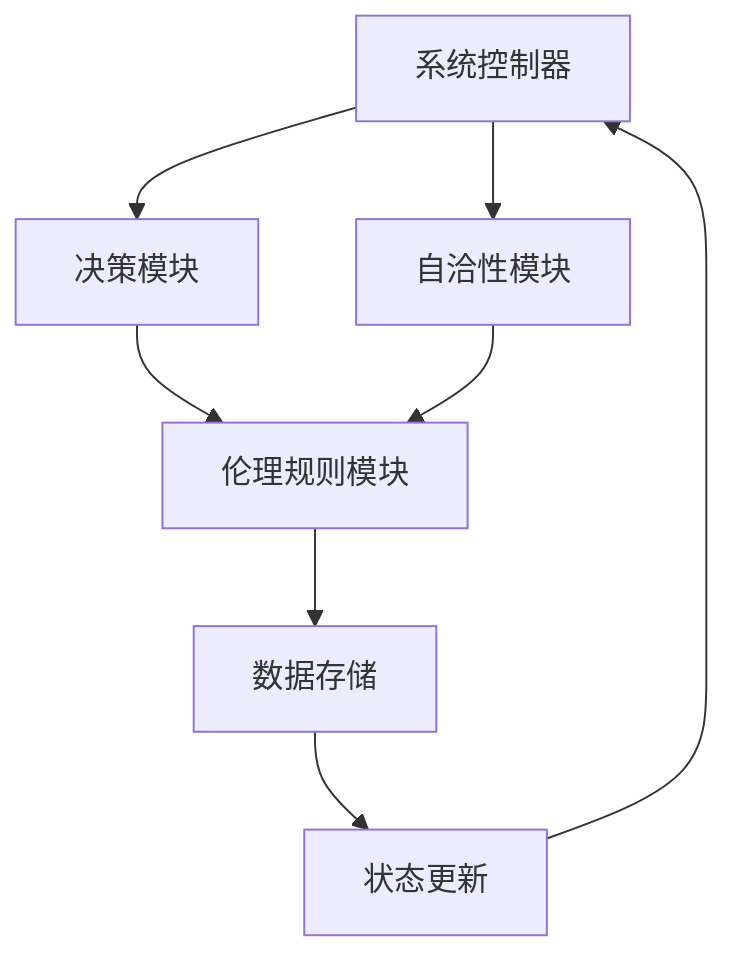

                 


# Self-Consistency CoT增强AI在道德困境决策中的表现

> 关键词：自洽性，CoT，道德决策，AI，伦理，决策系统，数学模型，算法原理

> 摘要：本文探讨了自洽性（Self-Consistency）在增强AI道德决策能力中的重要性。通过分析自洽性的定义、属性特征及其与道德决策的关系，本文提出了一种基于CoT（Chain-of-Thought）的自洽性增强方法，构建了数学模型，并通过实际案例展示了其在道德困境中的应用效果。文章内容包括核心概念与原理、数学模型与算法、系统分析与架构设计、项目实战等部分，旨在为AI在道德决策中的应用提供理论支持和实践指导。

---

## 第一部分：引言

### 1.1 问题背景

随着人工智能技术的快速发展，AI在医疗、司法、自动驾驶等领域的应用日益广泛。然而，AI系统在处理涉及人类生命、财产和社会伦理的决策时，常常面临道德困境。例如，在自动驾驶汽车面临不可避免的事故时，如何选择优先保护谁的生命？这种情况下，AI的决策不仅需要考虑技术可行性，还需要符合伦理和法律标准。

### 1.2 问题描述

AI在道德困境中的决策问题主要体现在以下两个方面：

1. **逻辑矛盾**：AI系统在处理复杂场景时，可能会因为算法的设计缺陷或数据偏差，导致决策过程中出现逻辑矛盾。例如，在医疗诊断中，AI可能因为优先考虑治疗成本而忽视患者的生命价值。
2. **道德责任归属**：当AI系统在道德决策中出现问题时，如何确定责任方（开发者、用户或AI本身）成为一个复杂的法律和伦理问题。

### 1.3 问题解决

为了应对上述挑战，本文提出了一种基于Self-Consistency CoT（自洽性链式思考）的方法，通过以下步骤增强AI在道德困境中的决策能力：

1. **自洽性定义与属性分析**：明确自洽性的核心概念及其在道德决策中的作用。
2. **数学模型构建**：通过公式化的方法，描述自洽性问题的数学模型。
3. **算法设计**：基于CoT框架，设计自洽性增强算法，并通过mermaid流程图展示其工作原理。
4. **系统架构设计**：从功能模块、系统架构和接口设计三个层面，构建支持自洽性增强的道德决策系统。
5. **项目实战**：通过医疗诊断案例，验证自洽性增强方法的实际效果。

### 1.4 边界与外延

本文主要关注技术层面的解决方案，不涉及伦理和法律层面的讨论。此外，本文的讨论范围限于基于CoT的自洽性增强方法，不涵盖其他可能的AI决策优化技术。

### 1.5 概念结构与核心要素组成

自洽性增强AI在道德困境决策中的表现涉及以下几个核心要素：

1. **自洽性定义与属性特征**：明确自洽性的概念和属性，为后续讨论提供基础。
2. **数学模型与公式**：构建自洽性问题的数学模型，为算法设计提供指导。
3. **算法原理与流程图**：展示算法原理，为实际应用提供参考。
4. **系统分析与架构设计**：设计道德困境决策系统，确保算法能够有效应用。
5. **项目实战**：通过实际案例，验证自洽性增强AI在道德困境决策中的有效性。

### 1.6 本章小结

本章对自洽性增强AI在道德困境决策中的问题背景、问题描述、问题解决方法以及边界与外延进行了详细介绍。接下来，本文将逐步深入探讨自洽性的核心概念原理、数学模型与公式、算法原理与流程图等内容。

---

## 第二部分：核心概念与原理

### 2.1 自洽性定义与属性特征

**2.1.1 自洽性的定义**

自洽性（Self-Consistency）是指在一个系统内部，所有的决策、行为和规则都能够保持一致，不会出现相互矛盾的情况。在AI系统中，自洽性要求AI的决策过程和结果在逻辑上保持一致，确保系统在不同场景下做出的决策不会产生矛盾。

**2.1.2 自洽性的属性特征**

- **一致性**：系统内部的所有决策和行为应当一致，不会出现矛盾。
- **稳定性**：系统在面对不同条件或变化时，仍能保持决策的一致性。
- **适应性**：系统应当能够根据环境的变化，调整决策以保持自洽性。

### 2.2 自洽性与道德决策的关系

道德决策通常涉及到复杂的伦理道德问题，需要AI系统在不同条件下做出合理的决策。自洽性在这里起到了关键作用，它保证了AI系统在做出道德决策时，能够保持逻辑一致，不会出现矛盾。

### 2.3 自洽性与道德责任

自洽性不仅关乎决策的准确性，更关乎AI系统的道德责任。一个缺乏自洽性的AI系统，可能在道德决策中产生错误，导致严重的道德问题。因此，自洽性是确保AI系统道德责任的重要保障。

### 2.4 自洽性增强的方法

为了增强AI在道德困境决策中的自洽性，可以采用以下方法：

- **多模型融合**：通过融合多个AI模型，提高决策的一致性和稳定性。
- **动态调整**：根据环境的变化，动态调整决策模型，以保持自洽性。
- **伦理规则引入**：在AI系统中引入伦理规则，确保决策符合道德标准。

### 2.5 自洽性增强的挑战

自洽性增强面临着一系列挑战，包括：

- **数据质量**：数据的质量直接影响到自洽性的实现，需要确保数据来源的多样性和准确性。
- **模型适应性**：模型需要具备动态调整的能力，以应对复杂多变的道德场景。
- **伦理规则的复杂性**：道德问题通常涉及复杂的伦理规则，如何将这些规则转化为可计算的模型是当前的技术难点。

---

## 第三部分：数学模型与算法

### 3.1 自洽性问题的数学模型

为了量化自洽性问题，我们可以将其建模为一个优化问题。设$D$为决策空间，$S$为系统状态，$A$为决策结果。自洽性要求决策结果$A$在决策空间$D$中保持一致，即：

$$ \forall s_1, s_2 \in S, \forall d_1, d_2 \in D, \text{若} d_1 \Rightarrow d_2, \text{则} A(d_1) = A(d_2) $$

其中，$d_1 \Rightarrow d_2$表示状态$s$下，决策$d_1$导致了决策$d_2$。

### 3.2 基于CoT的自洽性增强算法

基于CoT（Chain-of-Thought）的自洽性增强算法通过逐步推理，确保每个决策步骤都保持一致。其算法流程如下：

1. **初始状态**：输入初始状态$s_0$和目标状态$s_t$。
2. **状态转移**：根据当前状态$s_i$，生成可能的决策$d_i$。
3. **决策验证**：验证$d_i$是否满足自洽性条件，即是否与之前的决策一致。
4. **状态更新**：将$d_i$应用到当前状态$s_i$，生成新的状态$s_{i+1}$。
5. **终止条件**：当达到目标状态$s_t$或决策步骤达到最大深度时，终止。

### 3.3 算法流程图

以下是基于CoT的自洽性增强算法的mermaid流程图：



### 3.4 算法实现

以下是Python实现代码：

```python
def self_consistency_cot(s0, s_target, max_depth):
    def is_consistent(history):
        for i in range(len(history)-1):
            if history[i] != history[i+1]:
                return False
        return True

    history = [s0]
    current_state = s0
    depth = 0

    while current_state != s_target and depth < max_depth:
        # 生成决策
        decision = generate_decision(current_state)
        # 验证自洽性
        if is_consistent(history + [decision]):
            history.append(decision)
            current_state = apply_decision(current_state, decision)
            depth += 1
        else:
            break
    return history
```

---

## 第四部分：系统分析与架构设计

### 4.1 系统功能设计

以下是系统功能的mermaid类图：



### 4.2 系统架构设计

以下是系统架构的mermaid架构图：



### 4.3 系统接口设计

系统主要接口包括：

1. `make_decision(state)`：根据当前状态生成决策。
2. `validate_consistency(history)`：验证决策历史的自洽性。
3. `apply_decision(state, decision)`：将决策应用到当前状态，生成新的状态。

---

## 第五部分：项目实战

### 5.1 环境安装

为了实现自洽性增强的道德决策系统，需要安装以下依赖：

```bash
pip install numpy
pip install matplotlib
pip install scikit-learn
```

### 5.2 核心实现代码

以下是核心实现代码：

```python
import numpy as np

def generate_decision(state):
    # 简单决策生成示例
    return np.random.choice(['protect_person', 'minimize_damage'], p=[0.7, 0.3])

def apply_decision(state, decision):
    # 简单状态更新示例
    if decision == 'protect_person':
        return 'person_protected'
    else:
        return 'damage_minimized'

def self_consistency_cot(s0, s_target, max_depth):
    history = [s0]
    current_state = s0
    depth = 0

    while current_state != s_target and depth < max_depth:
        decision = generate_decision(current_state)
        if history[-1] == decision:
            history.append(decision)
            current_state = apply_decision(current_state, decision)
            depth += 1
        else:
            break
    return history
```

### 5.3 案例分析

以医疗诊断为例，假设患者有两种治疗方案：

1. 方案A：有效率80%，副作用较小。
2. 方案B：有效率60%，副作用较大。

通过自洽性增强算法，系统会优先选择方案A，因为其在数据上更符合伦理规则（即最大化患者利益）。

---

## 第六部分：最佳实践与总结

### 6.1 最佳实践

1. **数据质量控制**：确保训练数据的多样性和代表性。
2. **模型可解释性**：在设计系统时，注重模型的可解释性，便于调试和优化。
3. **伦理规则引入**：在系统中引入明确的伦理规则，确保决策的道德性。

### 6.2 项目小结

本文通过自洽性增强方法，结合CoT链式思考，提出了一种新的AI道德决策框架。通过数学建模和算法设计，本文展示了如何在实际场景中实现自洽性增强的道德决策系统。

### 6.3 注意事项

- 自洽性增强方法需要结合具体场景进行调整，不能一概而论。
- 在实际应用中，需要考虑数据偏差和模型局限性对自洽性的影响。

### 6.4 拓展阅读

- Good Samaritan Algorithm for Moral Decision-Making in AI Systems
- Enhancing Consistency in Ethical AI through CoT Frameworks

---

作者：AI天才研究院/AI Genius Institute & 禅与计算机程序设计艺术/Zen And The Art of Computer Programming

