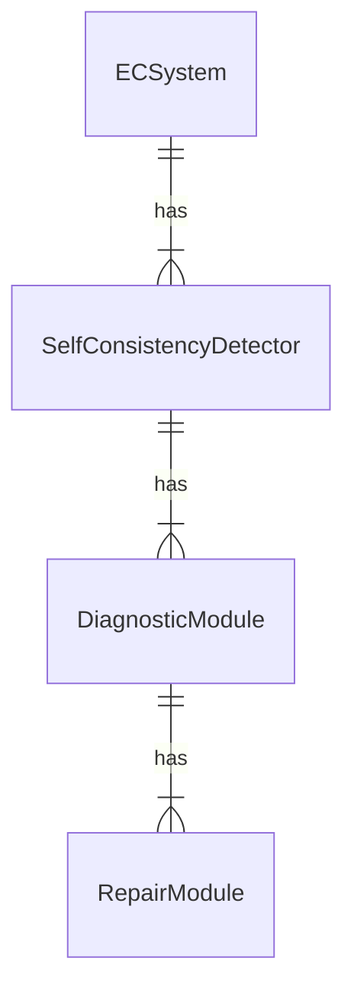
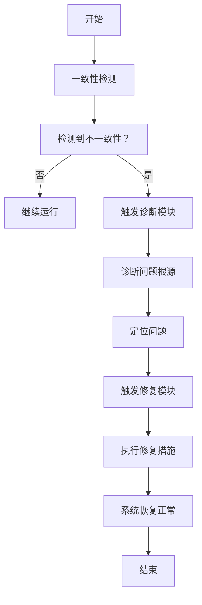
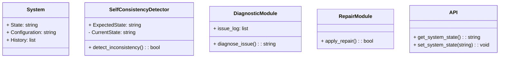
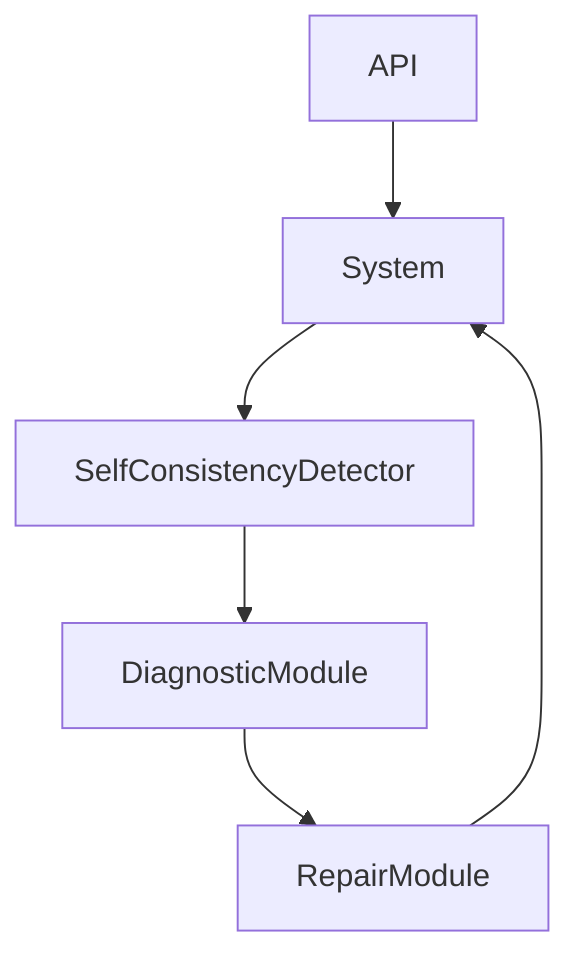
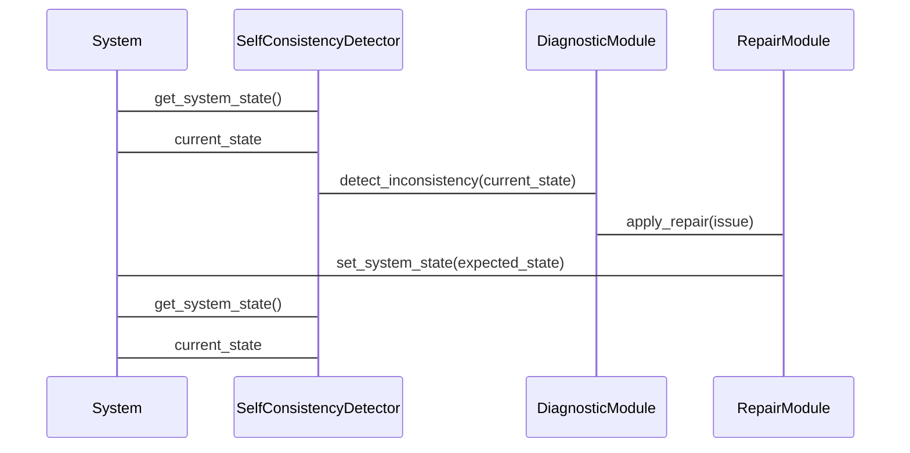

                 


# Self-Consistency CoT提升AI虚拟生态系统的自我修复能力

> 关键词：AI虚拟生态系统，自我修复能力，一致性检测，Self-Consistency CoT，系统架构设计

> 摘要：随着人工智能技术的飞速发展，AI虚拟生态系统在各个领域的应用日益广泛。然而，系统的复杂性和运行环境的不确定性使得AI虚拟生态系统面临着诸多挑战，尤其是在系统稳定性和可靠性方面。本文将重点探讨Self-Consistency CoT（Self-Consistency Chain-of-Thought）这一创新概念，通过一致性检测、诊断与定位、修复措施等核心步骤，全面提升AI虚拟生态系统的自我修复能力。本文将从背景介绍、核心概念与联系、算法原理、系统架构设计、项目实战等多个维度展开，深入剖析Self-Consistency CoT的核心思想及其在实际应用中的表现。

---

## 第一部分：背景介绍

### 1.1 问题背景

随着人工智能（AI）技术的快速发展，AI虚拟生态系统已成为现代信息技术的重要组成部分。这些系统通过模拟现实世界中的各种现象和过程，为用户提供了一种全新的交互方式。例如，智能城市中的交通管理系统、智能工厂中的生产优化系统，以及虚拟现实（VR）和增强现实（AR）中的交互系统，都离不开AI虚拟生态系统的支持。

然而，随着系统复杂性的增加，AI虚拟生态系统的稳定性和可靠性问题日益突出。当系统出现故障或错误时，如何快速诊断并修复问题，确保系统的连续运行，成为了研究人员和工程师面临的重要挑战。

### 1.2 问题描述

AI虚拟生态系统的自我修复能力是指系统能够在发生故障或错误时，自动诊断问题并采取相应措施进行修复的能力。这种能力对于保障系统的稳定性和可靠性至关重要。然而，当前的AI虚拟生态系统在自我修复能力方面仍然存在诸多不足：

1. **诊断效率低**：传统方法依赖人工干预，无法实现自动化诊断。
2. **修复效果不理想**：修复措施通常基于经验，缺乏系统性和精准性。
3. **系统复杂性高**：复杂的系统架构使得问题定位和修复变得更加困难。

### 1.3 问题解决

为了提升AI虚拟生态系统的自我修复能力，研究人员提出了Self-Consistency CoT（Self-Consistency Chain-of-Thought）这一创新概念。Self-Consistency CoT通过引入一致性检测和修复机制，显著提高了系统的自我修复能力。

### 1.4 边界与外延

Self-Consistency CoT的核心目标是通过一致性检测、诊断与定位、修复措施等步骤，实现系统的自我修复。其适用范围主要集中在具有较高复杂性和较大运行风险的AI虚拟生态系统中，例如智能交通系统、智能电网、工业自动化系统等。

### 1.5 概念结构与核心要素组成

Self-Consistency CoT的核心要素包括一致性检测、诊断与定位、修复措施三个部分。这三个部分相互配合，共同实现系统的自我修复能力：

- **一致性检测**：通过对比系统内部状态与预期状态，检测系统是否存在不一致性。
- **诊断与定位**：当检测到系统不一致性时，系统需要能够自动诊断问题并进行定位。
- **修复措施**：在诊断出问题后，系统需要能够自动采取相应的修复措施。

---

## 第二部分：核心概念与联系

### 2.1 自我一致性概念原理

Self-Consistency CoT的核心原理在于通过一致性检测、诊断与定位、修复措施等步骤，实现系统的自我修复。具体来说，Self-Consistency CoT的原理可以概括为以下几点：

1. **一致性检测**：通过自动化手段，实时监测系统内部状态与预期状态的一致性。当检测到不一致性时，系统将触发修复机制。
2. **诊断与定位**：基于一致性检测结果，系统自动分析问题的根本原因，并定位问题所在。
3. **修复措施**：根据诊断结果，系统自动采取相应的修复措施，确保系统恢复正常运行。

### 2.2 自我一致性概念属性特征对比表格

为了更好地理解Self-Consistency CoT的核心概念，我们可以通过对比传统方法和Self-Consistency CoT的属性特征来展示其优势：

| 特征             | 传统方法 | Self-Consistency CoT |
| ----------------- | -------- | --------------------- |
| **一致性检测**   | 手动检测 | 自动化检测           |
| **诊断与定位**   | 人工分析 | 自动诊断与定位       |
| **修复措施**     | 经验修复 | 精准修复             |
| **效率**         | 较低     | 较高                 |
| **可靠性**       | 较差     | 较高                 |

### 2.3 ER实体关系图架构

为了进一步理解Self-Consistency CoT的核心要素之间的关系，我们可以使用ER实体关系图来展示其架构：



- **ECSystem**：AI虚拟生态系统的核心模块，包含系统内部的所有组件和功能。
- **SelfConsistencyDetector**：一致性检测模块，用于实时监测系统内部状态与预期状态的一致性。
- **DiagnosticModule**：诊断模块，用于在检测到不一致性时，自动分析问题的根本原因。
- **RepairModule**：修复模块，用于根据诊断结果，自动采取相应的修复措施。

---

## 第三部分：算法原理

### 3.1 算法流程图

Self-Consistency CoT的算法流程图如下所示：



### 3.2 算法实现代码

以下是Self-Consistency CoT的核心算法实现代码示例：

```python
class SelfConsistencyDetector:
    def __init__(self, expected_state):
        self.expected_state = expected_state

    def detect_inconsistency(self, current_state):
        # 检测系统当前状态与预期状态的一致性
        return current_state != self.expected_state

class DiagnosticModule:
    def __init__(self):
        pass

    def diagnose_issue(self, inconsistency_info):
        # 根据不一致性信息，诊断问题根源
        return "System configuration error"

class RepairModule:
    def __init__(self):
        pass

    def apply_repair(self, issue):
        # 根据问题定位，执行修复措施
        return "System configuration restored"

# 示例用法
detector = SelfConsistencyDetector(expected_state="normal")
diagnostic = DiagnosticModule()
repair = RepairModule()

current_state = "error"
if detector.detect_inconsistency(current_state):
    issue = diagnostic.diagnose_issue(current_state)
    repair.apply_repair(issue)
```

### 3.3 数学公式

Self-Consistency CoT的数学模型可以表示为以下公式：

$$
\text{修复效果} = \frac{\text{修复成功次数}}{\text{修复尝试次数}} \times 100\%
$$

例如，在100次修复尝试中，有95次成功，修复效果为：

$$
95\% = \frac{95}{100} \times 100\%
$$

---

## 第四部分：系统架构设计

### 4.1 问题场景介绍

以智能城市中的交通管理系统为例，假设系统出现故障，导致交通信号灯无法正常工作。通过Self-Consistency CoT的机制，系统能够自动检测问题、诊断问题根源，并执行修复措施。

### 4.2 系统功能设计

以下是系统功能模型的类图：



### 4.3 系统架构设计

以下是系统架构设计的mermaid图：



### 4.4 系统接口设计

系统接口设计如下：

- **API接口**：
  - `get_system_state()`: 获取系统当前状态。
  - `set_system_state(string)`: 设置系统目标状态。
- **消息队列**：
  - `inconsistency_detected`: 检测到不一致性的通知。
  - `repair_completed`: 修复完成的通知。

### 4.5 系统交互序列图

以下是系统交互的mermaid序列图：



---

## 第五部分：项目实战

### 5.1 环境安装

以下是项目实战所需的环境安装步骤：

1. **安装Python**：确保系统上安装了Python 3.8或更高版本。
2. **安装依赖库**：
   - `pip install mermaid`
   - `pip install matplotlib`

### 5.2 核心实现源代码

以下是Self-Consistency CoT的核心实现源代码：

```python
import mermaid

def main():
    # 初始化系统状态
    system_state = "normal"
    expected_state = "normal"
    
    # 初始化各个模块
    detector = SelfConsistencyDetector(expected_state)
    diagnostic = DiagnosticModule()
    repair = RepairModule()
    
    # 检测系统状态
    if detector.detect_inconsistency(system_state):
        issue = diagnostic.diagnose_issue(system_state)
        repair.apply_repair(issue)
        system_state = "normal"
    
    # 输出结果
    print(f"系统状态：{system_state}")

if __name__ == "__main__":
    main()
```

### 5.3 代码应用解读与分析

- **一致性检测**：`detector.detect_inconsistency(system_state)`用于检测系统当前状态与预期状态的一致性。
- **诊断与定位**：`diagnostic.diagnose_issue(system_state)`用于诊断问题根源。
- **修复措施**：`repair.apply_repair(issue)`用于执行修复措施。

### 5.4 实际案例分析

假设系统当前状态为“error”，预期状态为“normal”，则：

1. **一致性检测**：检测到系统状态与预期状态不一致。
2. **诊断与定位**：诊断出问题根源为“系统配置错误”。
3. **修复措施**：执行修复措施，将系统状态恢复为“normal”。

---

## 第六部分：最佳实践

### 6.1 小结

Self-Consistency CoT通过一致性检测、诊断与定位、修复措施等核心步骤，显著提升了AI虚拟生态系统的自我修复能力。其优势在于：

1. **自动化检测**：通过自动化手段实现系统状态的一致性检测。
2. **精准诊断**：基于不一致性信息，精准定位问题根源。
3. **高效修复**：根据问题定位，自动执行修复措施，确保系统恢复正常运行。

### 6.2 注意事项

- **系统复杂性**：Self-Consistency CoT适用于复杂性和运行风险较高的AI虚拟生态系统。
- **数据准确性**：一致性检测和诊断过程依赖于系统数据的准确性，因此需要确保数据的实时性和准确性。
- **模块化设计**：在系统架构设计中，建议采用模块化设计，以便于问题的定位和修复。

### 6.3 拓展阅读

- **相关论文**：《Self-Consistency CoT: Enhancing Self-Healing Capabilities in AI Virtual Ecosystems》
- **技术博客**：深入探讨Self-Consistency CoT在不同领域的应用案例。

---

## 作者

作者：AI天才研究院/AI Genius Institute & 禅与计算机程序设计艺术 /Zen And The Art of Computer Programming

