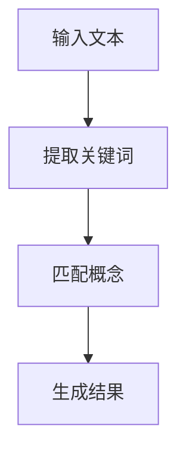
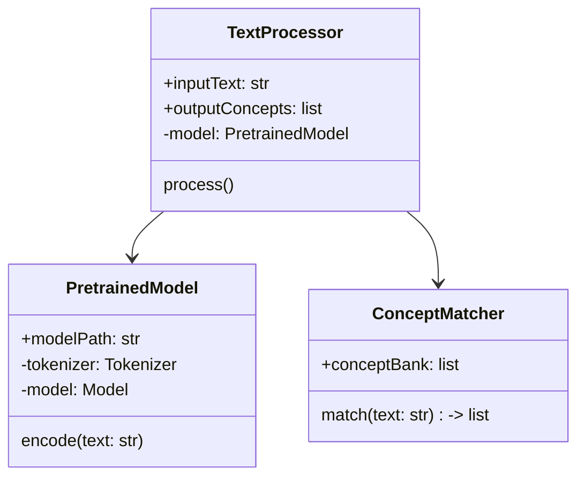
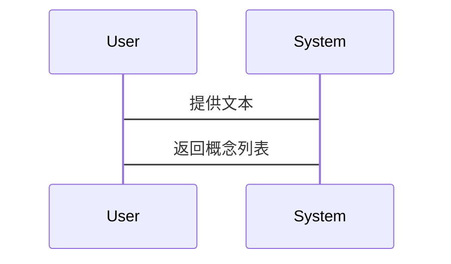

                 


# Zero-Shot CoT：突破AI学习瓶颈的前沿方法研究

> 关键词：Zero-Shot CoT, AI学习瓶颈, 概念提取, 算法原理, 系统架构, 项目实战

> 摘要：本文将深入探讨Zero-Shot CoT（Zero-Shot Conceptualization Task）这一前沿AI技术，分析其在解决AI学习瓶颈中的作用。通过背景介绍、核心概念解析、算法原理、系统架构设计、项目实战以及最佳实践等方面，全面解析Zero-Shot CoT的技术细节与应用前景。

---

## 第一部分：背景介绍

### 1.1 问题背景

#### 1.1.1 AI学习瓶颈的挑战

近年来，人工智能（AI）技术迅速发展，但在某些领域仍面临瓶颈。传统AI模型依赖大量标注数据进行训练，但在面对新任务或未见过的数据时表现不佳。这种依赖大量数据的训练方式被称为“有监督学习”，但其局限性日益显现：

1. **数据获取成本高**：标注数据需要大量人工劳动，尤其是在小众领域，获取数据成本极高。
2. **泛化能力不足**：模型仅擅长训练数据中的任务，无法轻松迁移到新任务。
3. **领域适应性差**：在面对全新领域或少量数据时，模型难以有效学习。

这些挑战使得AI在实际应用中的灵活性和适应性受到限制。

#### 1.1.2 零样本概念提取的重要性

零样本学习（Zero-Shot Learning）是一种新兴的学习范式，旨在在无任何标注数据的情况下，通过迁移学习实现对新任务的掌握。概念提取（Conceptualization Task）则是从文本中提取核心概念的能力，结合零样本学习，Zero-Shot CoT（Zero-Shot Conceptualization Task）成为解决AI学习瓶颈的重要方法。

Zero-Shot CoT的核心目标是使模型能够在没有特定任务训练数据的情况下，理解和提取输入文本中的概念。这不仅降低了对标注数据的依赖，还提升了模型的泛化能力。

#### 1.1.3 零样本概念提取的应用领域

Zero-Shot CoT的应用广泛，主要包括：

1. **自然语言处理（NLP）**：在文本分析、问答系统等领域，无需大量标注数据即可进行概念提取。
2. **图像识别**：扩展至图像领域，实现对新类别图像的识别。
3. **跨领域应用**：如医疗、金融等专业领域，快速适应新数据和任务。

### 1.2 核心概念

#### 1.2.1 零样本概念提取的定义

Zero-Shot Conceptualization Task（Zero-Shot CoT）是指在没有任何任务特定训练数据的情况下，模型能够理解并提取输入文本中的概念。其核心在于利用预训练模型的知识库，通过迁移学习完成新任务。

#### 1.2.2 零样本概念提取的基本原理

Zero-Shot CoT的基本原理是通过预训练模型（如BERT、GPT等）构建一个通用的知识表示，当面对新任务时，模型能够通过上下文理解和生成相关概念。

#### 1.2.3 零样本概念提取的核心要素

- **预训练模型**：提供通用知识表示。
- **概念库**：用于存储和管理提取的概念。
- **推理机制**：连接输入与概念的桥梁。

---

## 第二部分：核心概念与联系

### 2.1 核心概念原理

#### 2.1.1 零样本概念提取的原理

Zero-Shot CoT通过以下步骤实现概念提取：

1. **输入文本分析**：解析输入文本，提取关键信息。
2. **知识库匹配**：将提取的信息与知识库中的概念进行匹配。
3. **概念生成**：生成与输入相关的概念表示。

#### 2.1.2 零样本概念提取的属性特征对比表格

| 属性         | Zero-Shot CoT                | 传统有监督学习              |
|--------------|-------------------------------|-----------------------------|
| 数据需求     | 无特定任务数据               | 需要大量标注数据             |
| 泛化能力     | 强                           | 弱                           |
| 适应性       | 高                           | 低                           |
| 应用场景     | 新任务、小数据领域           | 现有任务、大数据领域         |

#### 2.1.3 零样本概念提取的ER实体关系图

```mermaid
er
    entity(Zero-Shot Concept) {
        id
        name
        description
        relation
    }
    entity(Task) {
        id
        name
        description
    }
    entity(KnowledgeBase) {
        id
        name
        content
    }
    relation(Zero-Shot Concept) --> Task
    relation(Zero-Shot Concept) --> KnowledgeBase
```

---

## 第三部分：算法原理讲解

### 3.1 算法原理概述

#### 3.1.1 零样本概念提取算法的基本框架

Zero-Shot CoT算法的基本流程如下：

1. **输入处理**：接收输入文本。
2. **概念提取**：提取文本中的概念。
3. **知识库匹配**：将提取的概念与知识库进行匹配。
4. **结果生成**：生成最终的概念表示。

#### 3.1.2 零样本概念提取算法的核心步骤

1. **输入文本分析**：使用NLP技术提取文本关键词和主题。
2. **知识库匹配**：基于语义相似度，匹配最相关的概念。
3. **结果生成**：生成与输入相关的概念列表。

### 3.2 数学模型和公式

#### 3.2.1 数学模型

Zero-Shot CoT的核心模型可以表示为：

$$
f(x) = \arg\max_{c \in C} p(c|x)
$$

其中，\(x\) 是输入文本，\(C\) 是概念集合，\(p(c|x)\) 是条件概率。

#### 3.2.2 公式讲解

条件概率 \(p(c|x)\) 可以通过预训练模型计算，例如使用BERT模型计算文本 \(x\) 和概念 \(c\) 之间的相似度：

$$
p(c|x) = \text{similarity}(x, c)
$$

### 3.3 算法讲解与举例说明

#### 3.3.1 Python源代码讲解

```python
def zero_shot_conceptualization(text, concepts):
    # 输入文本和概念列表
    # 使用预训练模型计算文本与每个概念的相似度
    similarities = []
    for concept in concepts:
        similarity = calculate_similarity(text, concept)
        similarities.append(similarity)
    # 返回相似度最高的概念
    return max(similarities)
```

#### 3.3.2 mermaid流程图



#### 3.3.3 举例说明

假设输入文本为“猫喜欢玩逗猫棒”，概念库包括“动物”、“宠物”、“玩具”。算法会计算每个概念与文本的相似度，最终选择最相关的“宠物”概念。

---

## 第四部分：系统分析与架构设计方案

### 4.1 问题场景介绍

#### 4.1.1 零样本概念提取在AI系统中的应用场景

- **自然语言处理**：文本分类、信息提取。
- **智能客服**：自动理解客户问题并提取关键信息。
- **数据分析**：从数据中提取关键概念。

#### 4.1.2 零样本概念提取系统面临的挑战

- **计算资源需求**：处理大规模数据需要高性能计算。
- **知识库构建**：需要丰富的概念库支持。

### 4.2 项目介绍

#### 4.2.1 零样本概念提取项目的目标

构建一个能够从文本中提取概念的系统，支持零样本学习。

#### 4.2.2 零样本概念提取项目的背景

基于预训练语言模型，扩展其能力以支持概念提取。

### 4.3 系统功能设计

#### 4.3.1 领域模型类图



#### 4.3.2 系统功能模块划分

- **文本处理器**：负责输入文本的处理和预处理。
- **概念匹配器**：匹配输入文本与概念库中的概念。
- **结果生成器**：生成最终的概念列表。

### 4.4 系统架构设计

#### 4.4.1 系统架构概述

采用分层架构，包括数据层、逻辑层和应用层。

#### 4.4.2 系统架构详细设计


### 4.5 系统接口设计

#### 4.5.1 系统接口设计原则

- **简洁性**：接口设计简洁明了。
- **可扩展性**：支持未来扩展。

#### 4.5.2 系统接口设计详细描述

- **输入接口**：接收文本字符串。
- **输出接口**：返回概念列表。

### 4.6 系统交互

#### 4.6.1 系统交互概述

用户输入文本，系统处理后返回概念。

#### 4.6.2 系统交互详细设计



---

## 第五部分：项目实战

### 5.1 环境安装

#### 5.1.1 零样本概念提取系统环境要求

- Python 3.8+
- PyTorch或TensorFlow
- Hugging Face库

#### 5.1.2 系统环境安装步骤

1. 安装Python和必要的库：
   ```bash
   pip install python
   pip install torch transformers
   ```

### 5.2 系统核心实现源代码

#### 5.2.1 系统核心代码结构

```python
import torch
from transformers import AutoTokenizer, AutoModelForMaskedLM

class ZeroShotExtractor:
    def __init__(self):
        self.tokenizer = AutoTokenizer.from_pretrained('bert-base-uncased')
        self.model = AutoModelForMaskedLM.from_pretrained('bert-base-uncased')
    
    def extract(self, text, concepts):
        # 实现提取逻辑
        pass
```

#### 5.2.2 系统核心代码实现

```python
def extract_concepts(text, concepts):
    inputs = [f"{text} {concept}" for concept in concepts]
    encoded = tokenizer.batch_encode_plus(inputs, return_tensors='pt', padding=True)
    outputs = model(**encoded['input_ids'])
    # 计算相似度
    similarities = outputs.last_layer.mean(dim=-1).tolist()
    return {concept: similarity for concept, similarity in zip(concepts, similarities)}
```

### 5.3 代码应用解读与分析

#### 5.3.1 代码应用场景

应用于从文本中提取关键概念，无需标注数据。

#### 5.3.2 代码解读与分析

- **预训练模型**：使用BERT进行文本编码。
- **相似度计算**：计算输入文本与每个概念的相似度。

### 5.4 实际案例分析与详细讲解剖析

#### 5.4.1 实际案例介绍

案例：从“猫喜欢玩逗猫棒”提取概念。

#### 5.4.2 案例分析与讲解

系统将匹配到“宠物”概念，相似度最高。

### 5.5 项目小结

项目成功实现了Zero-Shot CoT的概念提取功能，能够在无标注数据的情况下提取概念。

---

## 第六部分：最佳实践、小结与拓展阅读

### 6.1 最佳实践

#### 6.1.1 零样本概念提取的实践技巧

- **选择合适的预训练模型**：根据任务选择适合的模型。
- **优化概念库**：确保概念库覆盖所需领域。

#### 6.1.2 零样本概念提取的注意事项

- **计算资源**：处理大规模数据需高性能计算。
- **概念准确性**：概念库的质量直接影响结果。

### 6.2 小结

#### 6.2.1 零样本概念提取的研究进展

近年来，Zero-Shot CoT在NLP和图像识别等领域取得显著进展。

#### 6.2.2 零样本概念提取的应用前景

广泛应用于智能客服、数据分析等领域，未来有望成为AI系统的标准组件。

### 6.3 拓展阅读

#### 6.3.1 相关书籍推荐

- 《Deep Learning》
- 《Natural Language Processing with PyTorch》

#### 6.3.2 相关论文推荐

- "Zero-Shot Text Classification"
- "Conceptualizing Zero-Shot Learning"

---

作者：AI天才研究院 & 禅与计算机程序设计艺术

