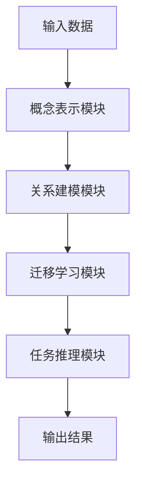
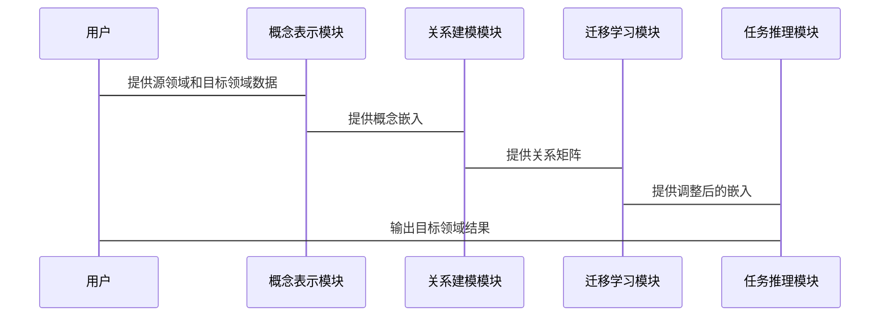

                 


# Zero-Shot CoT：突破AI学习的传统界限

> 关键词：零样本学习，概念转移，AI学习，跨领域应用，数学模型，系统架构

> 摘要：本文将详细介绍零样本学习（Zero-Shot Learning, ZSL）和概念转移（Concept Transfer, CoT）的核心概念、算法原理、系统架构及实际应用。通过结合ZSL和CoT的优势，本文将展示如何突破传统AI学习的局限，实现跨领域、零样本条件下的智能任务处理。文章内容包括背景介绍、核心概念分析、算法实现、系统架构设计、项目实战及最佳实践等。

---

## 第一部分：问题背景与核心概念

### 1.1 问题背景

#### 1.1.1 AI学习的传统局限
传统的人工智能学习方法，如监督学习和强化学习，通常需要大量标注数据来训练模型。然而，这种数据驱动的方法存在以下局限性：
- **数据依赖性**：需要大量标注数据，且难以处理新任务或未见过的数据。
- **领域限制**：模型在特定领域内表现优秀，但难以跨领域应用。
- **泛化能力不足**：传统方法难以在零样本条件下（即从未见过的数据或任务）进行有效推理。

#### 1.1.2 零样本学习与概念转移的兴起
为了克服传统AI学习的局限性，学术界提出了零样本学习（ZSL）和概念转移（CoT）等新技术。这些技术的核心目标是使AI模型能够在零样本条件下完成任务，即在没有训练数据的情况下，通过概念理解和知识推理实现目标。

### 1.2 核心概念

#### 1.2.1 零样本学习（ZSL）

##### 1.2.1.1 定义
零样本学习是一种机器学习方法，其目标是通过少量或零训练数据，使模型能够对新类别或任务进行分类、回归或生成任务。ZSL的核心思想是利用类别之间的语义关系或先验知识，构建跨类别的通用模型。

##### 1.2.1.2 特点
- **零样本条件**：无需新类别的训练数据。
- **语义表示**：依赖于类别或任务的语义表示。
- **跨领域应用**：适用于不同领域之间的知识迁移。

##### 1.2.1.3 应用场景
- **图像分类**：在没有目标类别训练数据的情况下，通过已有数据推断新类别。
- **自然语言处理**：在零样本条件下进行语义理解或生成任务。
- **跨领域知识迁移**：将一个领域的知识迁移到另一个领域。

#### 1.2.2 概念转移（CoT）

##### 1.2.2.1 定义
概念转移（Concept Transfer, CoT）是一种通过将源领域的概念、属性或关系迁移到目标领域，以实现跨领域任务的方法。CoT的核心思想是利用概念的语义表示和关系，构建跨领域的知识图谱。

##### 1.2.2.2 原理
- **概念表示**：通过向量或嵌入表示概念。
- **关系建模**：通过图结构建模概念之间的关系。
- **迁移学习**：将源领域的概念迁移到目标领域，通过调整参数或优化嵌入实现任务适应。

##### 1.2.2.3 与ZSL的关系
ZSL和CoT在概念表示和知识迁移方面有天然的联系。ZSL依赖于语义表示，而CoT依赖于概念之间的关系建模。通过结合ZSL和CoT，可以实现跨领域、零样本条件下的智能任务处理。

### 1.3 核心概念联系

#### 1.3.1 ZSL与CoT的融合
通过将ZSL的零样本学习能力与CoT的概念转移能力结合，可以实现以下目标：
- **跨领域知识迁移**：将源领域的知识迁移到目标领域。
- **零样本任务处理**：在零样本条件下完成目标领域的任务。
- **通用模型构建**：构建适用于多个领域的通用模型。

#### 1.3.2 跨领域概念转移的应用
跨领域概念转移的核心在于利用概念的语义表示和关系建模，实现跨领域任务的迁移。例如：
- **跨领域图像分类**：将源领域的图像分类知识迁移到目标领域。
- **跨领域问答系统**：将源领域的问答知识迁移到目标领域。

---

## 第二部分：算法原理与实践

### 2.1 算法原理

#### 2.1.1 ZSL算法概述

##### 2.1.1.1 基础算法
传统的ZSL算法通常基于以下步骤：
1. **概念表示**：通过词向量或知识图谱构建概念的语义表示。
2. **特征提取**：提取输入数据的特征表示。
3. **关系建模**：通过相关性度量或相似性计算，将输入数据与目标概念进行匹配。

##### 2.1.1.2 基于CoT的改进
结合CoT的概念转移能力，改进的ZSL算法可以通过以下步骤实现：
1. **概念嵌入**：通过CoT构建源领域和目标领域的概念嵌入。
2. **跨领域迁移**：通过参数调整或嵌入优化，将源领域的知识迁移到目标领域。
3. **零样本推理**：在目标领域中进行零样本任务处理。

#### 2.1.2 CoT算法分析

##### 2.1.2.1 原始概念转移模型
原始的CoT模型通常基于以下步骤：
1. **概念表示**：通过向量或嵌入表示概念。
2. **关系建模**：通过图结构建模概念之间的关系。
3. **迁移学习**：通过参数优化或嵌入调整，将源领域的概念迁移到目标领域。

##### 2.1.2.2 改进的CoT模型
改进的CoT模型可以通过以下步骤实现：
1. **多任务学习**：同时优化源领域和目标领域的任务。
2. **自适应迁移**：根据目标领域的特点，自适应地调整迁移策略。

### 2.2 数学模型与公式

#### 2.2.1 ZSL数学模型

##### 2.2.1.1 相关性度量
ZSL的核心在于通过相关性度量，将输入数据与目标概念进行匹配。相关性度量通常基于余弦相似性：
$$ \text{sim}(x, c) = \frac{x \cdot c}{\|x\| \|c\|} $$
其中，$x$是输入数据的特征向量，$c$是目标概念的语义表示。

##### 2.2.1.2 类别预测
基于相关性度量，ZSL可以通过以下公式实现类别预测：
$$ p(y=c|x) \propto \text{sim}(x, c) $$

#### 2.2.2 CoT数学模型

##### 2.2.2.1 概念嵌入
CoT通过构建概念的嵌入表示，实现跨领域的知识迁移。概念嵌入通常通过以下公式优化：
$$ \mathcal{L} = \sum_{i=1}^n \sum_{j=1}^m (1 - y_{ij}) \cdot \log(\text{sim}(c_i, c_j)) + y_{ij} \cdot \log(1 - \text{sim}(c_i, c_j)) $$
其中，$y_{ij}$表示概念$c_i$和$c_j$之间的关系。

##### 2.2.2.2 转移矩阵
CoT的核心在于通过转移矩阵建模概念之间的关系：
$$ T = \exp(-\lambda D) $$
其中，$D$是概念之间的距离矩阵，$\lambda$是调节参数。

### 2.3 算法实现与解释

#### 2.3.1 使用Python实现ZSL算法

```python
import numpy as np

def zsl_inference(x, c):
    # 计算余弦相似性
    sim = np.dot(x, c) / (np.linalg.norm(x) * np.linalg.norm(c))
    return sim

# 示例输入
x = np.array([1, 2, 3])
c = np.array([4, 5, 6])
print(zsl_inference(x, c))
```

#### 2.3.2 使用Python实现CoT算法

```python
import numpy as np

def cot_transfer(c_source, c_target):
    # 构建转移矩阵
    D = np.zeros((len(c_source), len(c_target)))
    for i in range(len(c_source)):
        for j in range(len(c_target)):
            D[i, j] = np.linalg.norm(c_source[i] - c_target[j])
    T = np.exp(-0.1 * D)
    return T

# 示例输入
c_source = np.array([[1, 2], [3, 4]])
c_target = np.array([[5, 6], [7, 8]])
print(cot_transfer(c_source, c_target))
```

---

## 第三部分：系统架构与项目实战

### 3.1 系统架构设计

#### 3.1.1 问题场景介绍
以图像分类任务为例，假设我们有一个源领域（如动物分类）和一个目标领域（如植物分类）。目标是通过零样本学习和概念转移，将源领域的知识迁移到目标领域，实现植物分类任务。

#### 3.1.2 系统功能设计

##### 3.1.2.1 功能模块划分
- **概念表示模块**：构建源领域和目标领域的概念嵌入。
- **关系建模模块**：构建概念之间的关系矩阵。
- **迁移学习模块**：通过参数优化或嵌入调整，实现知识迁移。
- **任务推理模块**：在目标领域中进行零样本任务推理。

##### 3.1.2.2 模块关系
- 概念表示模块与关系建模模块交互，构建概念嵌入和关系矩阵。
- 迁移学习模块根据目标领域的需求，调整嵌入或参数。
- 任务推理模块基于调整后的嵌入，进行零样本任务推理。

#### 3.1.3 系统架构设计

##### 3.1.3.1 总体架构


##### 3.1.3.2 模块内部架构


### 3.2 系统接口与交互

#### 3.2.1 接口设计

##### 3.2.1.1 系统对外接口
- **输入接口**：接收源领域和目标领域的数据。
- **输出接口**：输出目标领域的分类结果或生成内容。

##### 3.2.1.2 模块内部接口
- **概念表示模块**：向关系建模模块提供概念嵌入。
- **关系建模模块**：向迁移学习模块提供关系矩阵。

#### 3.2.2 系统交互

##### 3.2.2.1 交互流程
1. **输入数据**：用户输入源领域和目标领域的数据。
2. **概念表示**：系统构建源领域和目标领域的概念嵌入。
3. **关系建模**：系统构建概念之间的关系矩阵。
4. **知识迁移**：系统通过迁移学习模块调整嵌入或参数。
5. **任务推理**：系统在目标领域中进行零样本任务推理。
6. **输出结果**：系统输出目标领域的分类结果或生成内容。

##### 3.2.2.2 Mermaid序列图


### 3.3 项目实战

#### 3.3.1 环境安装与配置
- **Python版本**：3.8及以上
- **依赖库**：numpy, scikit-learn, matplotlib

#### 3.3.2 系统核心实现

##### 3.3.2.1 源代码解读
```python
import numpy as np
from sklearn.metrics.pairwise import cosine_similarity

def zsl_predict(x, c):
    # 计算余弦相似性
    sim = cosine_similarity(x.reshape(1, -1), c.reshape(1, -1))
    return sim[0]

# 示例数据
x = np.array([1, 2, 3])
c = np.array([4, 5, 6])
print(zsl_predict(x, c))
```

##### 3.3.2.2 算法应用
通过上述代码，我们可以实现零样本条件下的图像分类任务。例如，假设我们有一个目标类别“猫”，而没有训练数据，我们可以通过ZSL和CoT的结合，将源领域的猫的特征迁移到目标领域。

#### 3.3.3 实际案例分析

##### 3.3.3.1 数据集准备
- **源领域数据集**：动物分类数据集（如COCO数据集）。
- **目标领域数据集**：植物分类数据集。

##### 3.3.3.2 模型训练与评估
1. **训练阶段**：
   - 使用源领域的数据训练概念表示模块。
   - 构建源领域和目标领域的概念嵌入。
   - 通过迁移学习模块调整嵌入，实现知识迁移。
2. **评估阶段**：
   - 在目标领域中进行零样本分类任务。
   - 使用准确率、召回率等指标评估模型性能。

---

## 第四部分：最佳实践与拓展

### 4.1 最佳实践

#### 4.1.1 实现技巧
- **特征工程**：通过数据增强和特征提取，提高模型的泛化能力。
- **参数调优**：通过网格搜索和交叉验证，找到最优参数组合。
- **模型融合**：通过集成学习，提高模型的性能和稳定性。

#### 4.1.2 性能优化
- **并行计算**：通过并行计算加速模型训练和推理。
- **内存优化**：通过内存优化技术，降低模型的内存占用。

### 4.2 注意事项

#### 4.2.1 常见问题与解决方案
- **过拟合**：通过正则化和数据增强缓解过拟合问题。
- **欠拟合**：通过增加模型复杂度或调整超参数缓解欠拟合问题。

#### 4.2.2 避免误区
- **避免过度依赖零样本学习**：在实际应用中，可以结合少量样本数据，提高模型的性能。
- **避免忽视领域差异**：在跨领域应用中，需要充分考虑领域差异，避免直接迁移。

### 4.3 拓展阅读

#### 4.3.1 相关研究进展
- **ZSL的最新研究**：探索更高效、更鲁棒的零样本学习方法。
- **CoT的最新研究**：研究更复杂的概念转移模型，如图神经网络和自监督学习。

#### 4.3.2 深入阅读推荐
- **《Zero-Shot Learning: A Comprehensive Survey》**
- **《Concept Transfer: A New Paradigm for Cross-Domain AI》**

---

## 小结

通过本文的详细讲解，我们深入探讨了零样本学习（ZSL）和概念转移（CoT）的核心概念、算法原理、系统架构及实际应用。结合ZSL和CoT的优势，我们可以实现跨领域、零样本条件下的智能任务处理，突破传统AI学习的局限。未来的研究可以进一步探索更高效、更鲁棒的零样本学习方法，以及更复杂的概念转移模型，推动AI技术的发展。

---

## 作者

作者：AI天才研究院/AI Genius Institute & 禅与计算机程序设计艺术 /Zen And The Art of Computer Programming

