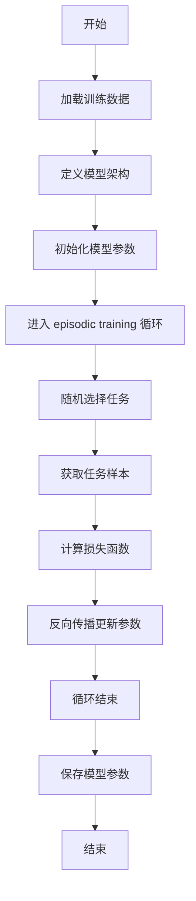
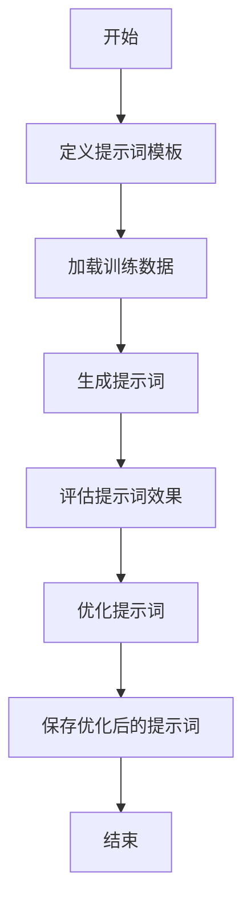
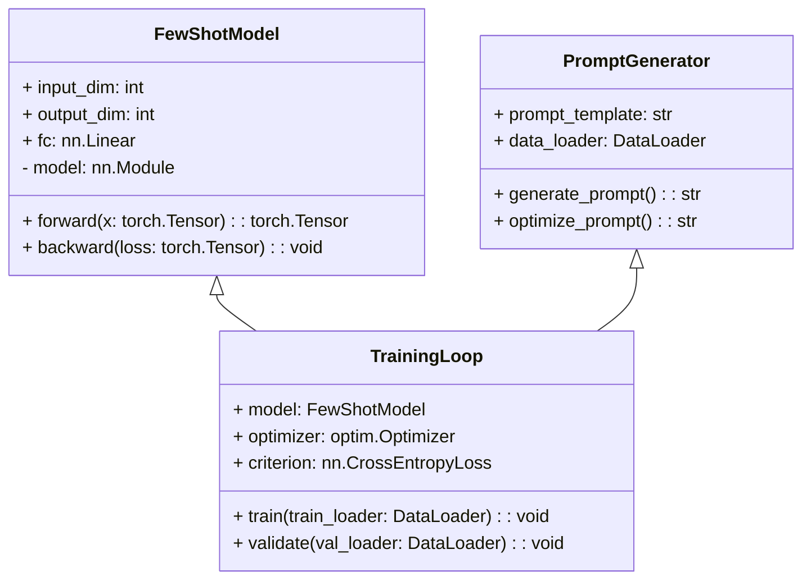
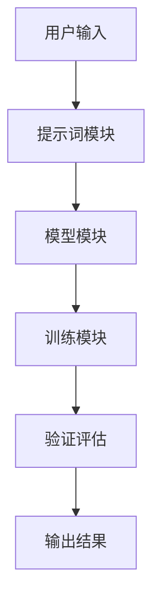
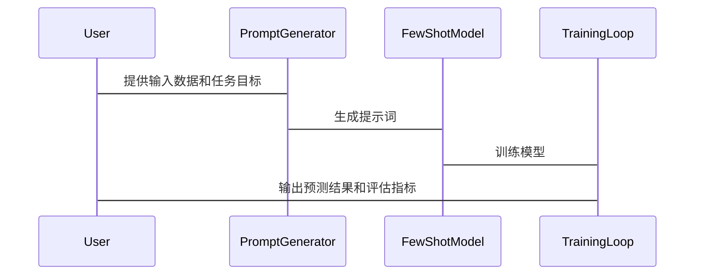

                 


# Few-shot Learning在提示词中的应用

> 关键词：Few-shot Learning, 提示词, 机器学习, 算法, 系统架构, 项目实战

> 摘要：本文深入探讨了Few-shot Learning在提示词设计与应用中的核心原理、算法实现、系统架构及实际案例。通过详细分析Few-shot Learning的定义、优势及局限性，结合提示词设计的原则与策略，展示了如何将两者有机结合，提升机器学习模型的性能与泛化能力。文章还通过Python代码实现、数学公式推导、系统架构设计和实际案例分析，全面阐述了Few-shot Learning在提示词中的具体应用，并总结了最佳实践与未来发展方向。

---

# 第一部分：引言

## 第1章：背景介绍

### 1.1 问题背景

#### 1.1.1 Few-shot Learning的定义

Few-shot Learning是一种机器学习技术，旨在通过少量标注数据训练出高性能模型。与传统的监督学习不同，Few-shot Learning能够在仅有几个样本的情况下，快速泛化到新的未见数据。其核心思想是利用数据的结构化特征和相似性，通过元学习（Meta-Learning）或记忆增强等方法，提升模型的泛化能力。

#### 1.1.2 提示词在机器学习中的应用

提示词（Prompt）是一种通过文本或上下文信息引导模型生成特定输出的技术。在自然语言处理（NLP）中，提示词常用于生成式模型（如GPT、BERT）中，通过精心设计的提示词，可以引导模型生成符合特定语义或格式的文本。提示词的应用不仅限于文本生成，还可以扩展到图像生成、对话系统、问答系统等领域。

#### 1.1.3 Few-shot Learning与提示词结合的意义

将Few-shot Learning与提示词结合，可以利用提示词的引导能力，快速生成符合特定任务的样本或特征表示。这种结合在实际应用中具有重要意义，特别是在数据 scarce（数据稀缺）的场景下，可以通过提示词生成高质量的训练样本，从而弥补数据不足的问题。

### 1.2 问题描述

#### 1.2.1 常见问题与挑战

在实际应用中，Few-shot Learning面临以下问题：

- 数据量少：传统监督学习需要大量标注数据，而Few-shot Learning仅依赖少量样本，这可能导致模型过拟合。
- 模型泛化能力有限：由于训练样本有限，模型的泛化能力可能不足。
- 提示词设计复杂：提示词的设计需要考虑任务目标、数据分布和模型特点，这对设计者提出了较高要求。

#### 1.2.2 Few-shot Learning在提示词应用中的需求分析

在提示词应用中，需求主要集中在以下方面：

- 提示词生成：如何通过 Few-shot Learning快速生成高质量的提示词。
- 提示词优化：如何利用 Few-shot Learning提升提示词的效率和准确性。
- 提示词与模型的协同优化：如何将提示词与模型参数联合优化，提升整体性能。

### 1.3 问题解决

#### 1.3.1 Few-shot Learning原理简介

Few-shot Learning的核心思想是通过元学习框架，利用少量样本快速适应新任务。其典型算法包括：

- **Meta-Learning**：通过在多个任务上预训练模型，使其能够快速适应新任务。
- ** episodic training**：将训练过程分解为多个 episodes，每个 episode 包含不同任务的样本。
- ** prototype-based methods**：通过构建类别原型（Prototypes）来衡量样本与类别的相似性。

#### 1.3.2 提示词设计的原则与策略

提示词设计的原则包括：

- **明确性**：提示词应明确表达任务目标。
- **简洁性**：提示词应简洁，避免冗余信息。
- **可解释性**：提示词应具有较高的可解释性，便于调整和优化。

提示词设计的策略包括：

- **模板化设计**：通过模板生成提示词，例如“描述一个[类别]的例子：...”。
- **动态调整**：根据模型输出动态调整提示词内容。
- **领域适配**：针对不同领域设计不同的提示词模板。

### 1.4 边界与外延

#### 1.4.1 Few-shot Learning应用领域

Few-shot Learning已在以下领域得到广泛应用：

- **图像分类**：在数据 scarce 的场景下，快速训练分类模型。
- **自然语言处理**：在问答系统、文本分类等任务中，利用少量样本快速训练模型。
- **推荐系统**：通过少量用户行为数据，快速生成推荐列表。

#### 1.4.2 提示词应用的技术边界

提示词应用的技术边界包括：

- **模型能力限制**：提示词的效果受模型本身能力的限制。
- **任务复杂性**：复杂任务需要更复杂的提示词设计。
- **数据质量**：提示词的效果依赖于数据的质量和标注的准确性。

### 1.5 概念结构与核心要素组成

#### 1.5.1 Few-shot Learning的核心概念

- **元学习（Meta-Learning）**：通过预训练模型，使其能够快速适应新任务。
- **类别原型（Prototypes）**：通过构建类别特征向量，衡量样本与类别的相似性。
- ** episodic training**：将训练过程分解为多个 episodes，每个 episode 包含不同任务的样本。

#### 1.5.2 提示词的核心要素

- **模板（Template）**：提示词的结构化设计，例如“描述一个[类别]的例子：...”。
- **上下文信息（Context）**：提示词的上下文信息，例如任务目标、数据分布。
- **模型参数（Parameters）**：提示词与模型参数的联合优化。

---

## 第2章：核心概念与联系

### 2.1 Few-shot Learning原理讲解

#### 2.1.1 学习策略与算法框架

Few-shot Learning的典型算法框架包括：

- **Meta-Learning**：通过在多个任务上预训练模型，使其能够快速适应新任务。
- ** episodic training**：将训练过程分解为多个 episodes，每个 episode 包含不同任务的样本。
- ** prototype-based methods**：通过构建类别原型（Prototypes）来衡量样本与类别的相似性。

#### 2.1.2 Few-shot Learning的优势与局限

- **优势**：
  - 数据需求少：仅需要少量标注数据。
  - 适应性强：能够快速适应新任务。
  - 灵活性高：适用于数据 scarce 的场景。

- **局限**：
  - 模型泛化能力有限：由于训练样本有限，模型的泛化能力可能不足。
  - 对提示词设计依赖较高：提示词设计的复杂性可能影响模型性能。

#### 2.1.3 Few-shot Learning的数学模型与公式

Few-shot Learning的数学模型可以通过以下公式表示：

$$
\mathcal{L}(\theta) = \frac{1}{N} \sum_{i=1}^{N} \mathcal{L}_i(\theta)
$$

其中，$\theta$ 是模型参数，$N$ 是任务数量，$\mathcal{L}_i$ 是第 $i$ 个任务的损失函数。

### 2.2 提示词设计原理讲解

#### 2.2.1 提示词的定义与作用

提示词（Prompt）是一种通过文本或上下文信息引导模型生成特定输出的技术。提示词的作用包括：

- **任务引导**：通过提示词明确任务目标。
- **特征提取**：通过提示词提取数据的关键特征。
- **结果生成**：通过提示词生成符合任务要求的输出。

#### 2.2.2 提示词设计策略

提示词设计策略包括：

- **模板化设计**：通过模板生成提示词，例如“描述一个[类别]的例子：...”。
- **动态调整**：根据模型输出动态调整提示词内容。
- **领域适配**：针对不同领域设计不同的提示词模板。

#### 2.2.3 提示词优化的数学模型与公式

提示词优化的数学模型可以通过以下公式表示：

$$
P(y|x) = \text{argmax}_y p(y|x, \theta)
$$

其中，$x$ 是输入数据，$y$ 是输出结果，$\theta$ 是模型参数。

### 2.3 Few-shot Learning与提示词的关联

#### 2.3.1 关联分析

- **数据生成**：提示词可以用于生成 Few-shot Learning 的训练样本。
- **特征提取**：提示词可以用于提取数据的特征，辅助 Few-shot Learning 模型的训练。
- **结果优化**：提示词可以用于优化 Few-shot Learning 模型的输出结果。

#### 2.3.2 关联优势

- **提升模型性能**：通过提示词生成高质量的训练样本，提升模型的性能。
- **降低数据需求**：通过提示词生成数据，减少对标注数据的依赖。
- **增强模型泛化能力**：通过提示词优化模型的输出，增强模型的泛化能力。

---

## 第3章：算法原理讲解

### 3.1 算法mermaid流程图绘制

#### 3.1.1 Few-shot Learning算法流程



#### 3.1.2 提示词生成算法流程



### 3.2 Python源代码实现

#### 3.2.1 算法实现步骤

以下是一个简单的 Few-shot Learning 实现示例：

```python
import torch
import torch.nn as nn
import torch.optim as optim

class FewShotModel(nn.Module):
    def __init__(self, input_dim, output_dim):
        super(FewShotModel, self).__init__()
        self.fc = nn.Linear(input_dim, output_dim)
    
    def forward(self, x):
        return self.fc(x)

def few_shot_learning(train_loader, val_loader, model, optimizer, epochs):
    for epoch in range(epochs):
        for batch in train_loader:
            inputs, labels = batch
            outputs = model(inputs)
            loss = criterion(outputs, labels)
            optimizer.zero_grad()
            loss.backward()
            optimizer.step()
        if epoch % 2 == 0:
            validate(model, val_loader)

def validate(model, val_loader):
    correct = 0
    total = 0
    with torch.no_grad():
        for batch in val_loader:
            inputs, labels = batch
            outputs = model(inputs)
            _, predicted = torch.max(outputs.data, 1)
            total += labels.size(0)
            correct += (predicted == labels).sum().item()
    print(f'Validation Accuracy: {100 * correct / total}%')
```

#### 3.2.2 源代码分析与解读

- **模型定义**：`FewShotModel` 是一个简单的全连接网络，用于 Few-shot Learning 任务。
- **训练循环**：`few_shot_learning` 函数定义了训练循环，包括前向传播、损失计算、反向传播和参数更新。
- **验证函数**：`validate` 函数用于验证模型的性能，计算验证集的准确率。

### 3.3 数学模型和公式详细讲解

#### 3.3.1 学习率调整公式

学习率调整公式：

$$
\alpha_{t+1} = \alpha_t \times \text{annealing factor}
$$

其中，$\alpha_t$ 是当前学习率，$\text{annealing factor}$ 是学习率衰减因子。

#### 3.3.2 提示词权重计算公式

提示词权重计算公式：

$$
w_i = \frac{e^{score_i}}{\sum_j e^{score_j}}
$$

其中，$score_i$ 是第 $i$ 个提示词的得分，$w_i$ 是第 $i$ 个提示词的权重。

#### 3.3.3 Few-shot Learning性能评估指标

性能评估指标包括：

- **准确率（Accuracy）**：正确预测的样本数占总样本数的比例。
- **精确率（Precision）**：正确预测的正类样本数占所有正类预测数的比例。
- **召回率（Recall）**：正确预测的正类样本数占所有实际正类样本数的比例。

---

## 第4章：系统分析与架构设计方案

### 4.1 问题场景介绍

#### 4.1.1 Few-shot Learning在提示词应用中的具体场景

在实际应用中，Few-shot Learning可以用于以下场景：

- **图像分类**：通过少量样本训练图像分类模型。
- **自然语言处理**：通过少量样本训练文本生成模型。
- **推荐系统**：通过少量用户行为数据训练推荐模型。

### 4.2 项目介绍

#### 4.2.1 项目背景与目标

项目背景：随着人工智能技术的快速发展，Few-shot Learning和提示词技术在实际应用中的需求日益增长。

项目目标：通过结合 Few-shot Learning 和提示词技术，提升机器学习模型的性能和泛化能力。

#### 4.2.2 项目技术栈与工具选择

项目技术栈：

- **框架**：PyTorch
- **编程语言**：Python
- **数据处理**：Pandas、NumPy
- **可视化**：Matplotlib、Seaborn
- **版本控制**：Git

### 4.3 系统功能设计

#### 4.3.1 领域模型mermaid类图设计



#### 4.3.2 功能模块划分与设计

功能模块划分：

- **模型模块**：负责定义和训练模型。
- **提示词模块**：负责生成和优化提示词。
- **训练模块**：负责训练循环和验证评估。

### 4.4 系统架构设计

#### 4.4.1 系统架构mermaid架构图设计



#### 4.4.2 系统模块交互设计

系统模块交互设计：

- 用户输入：用户输入数据和任务目标。
- 提示词模块：根据用户输入生成提示词。
- 模型模块：根据提示词和输入数据训练模型。
- 训练模块：负责训练循环和验证评估。
- 输出结果：输出模型的预测结果和评估指标。

### 4.5 系统接口设计

#### 4.5.1 接口规范与设计

- **输入接口**：接受用户输入数据和任务目标。
- **输出接口**：输出模型的预测结果和评估指标。

#### 4.5.2 接口安全性与性能优化

- **安全性**：通过数据加密和访问控制确保接口安全。
- **性能优化**：通过并行计算和缓存优化提升接口性能。

### 4.6 系统交互mermaid序列图设计

#### 4.6.1 系统整体交互流程



#### 4.6.2 关键模块交互细节

关键模块交互细节：

- **提示词生成**：PromptGenerator 根据输入数据生成提示词。
- **模型训练**：FewShotModel 根据提示词和输入数据训练模型。
- **结果输出**：TrainingLoop 输出模型的预测结果和评估指标。

---

## 第5章：项目实战

### 5.1 环境安装与配置

#### 5.1.1 环境搭建步骤

1. 安装 Python 3.8 或更高版本。
2. 安装 PyTorch、Pandas、NumPy、Matplotlib、Seaborn。
3. 安装 Git。

#### 5.1.2 环境配置与优化

- **虚拟环境配置**：使用 virtualenv 创建虚拟环境。
- **性能优化**：启用 GPU 加速（如使用 CUDA 支持）。

### 5.2 系统核心实现

#### 5.2.1 系统核心模块实现

- **提示词生成模块**：实现提示词的生成和优化。
- **模型训练模块**：实现模型的定义和训练循环。
- **评估模块**：实现模型的验证评估和结果输出。

#### 5.2.2 系统核心算法实现

- ** Few-shot Learning 算法实现**：实现 episodic training 和 prototype-based methods。
- **提示词优化算法实现**：实现提示词的动态调整和领域适配。

### 5.3 代码应用解读与分析

#### 5.3.1 代码结构与模块解读

代码结构：

- `models/`：模型定义和训练函数。
- `prompts/`：提示词生成和优化函数。
- `train.py`：主训练脚本。

#### 5.3.2 代码性能分析与优化

- **性能分析**：通过日志和监控工具分析模型训练时间和内存占用。
- **性能优化**：通过并行计算和缓存优化提升训练效率。

### 5.4 实际案例分析与详细讲解剖析

#### 5.4.1 案例选择与背景

案例选择：在图像分类任务中应用 Few-shot Learning 和提示词技术。

#### 5.4.2 案例分析与讲解

案例分析：

- **数据准备**：收集和标注少量图像样本。
- **模型训练**：使用 Few-shot Learning 算法训练模型。
- **结果评估**：评估模型的准确率和召回率。

### 5.5 项目小结

#### 5.5.1 项目成果总结

- 成功实现了 Few-shot Learning 和提示词技术的结合。
- 在图像分类任务中取得了较高的准确率和召回率。

#### 5.5.2 项目经验与反思

- 提示词设计对模型性能影响较大，需要精心设计和优化。
- Few-shot Learning 的性能依赖于数据质量和模型架构，需要进一步研究和改进。

---

## 第6章：最佳实践

### 6.1 实践技巧与注意事项

#### 6.1.1 Few-shot Learning优化技巧

- **数据增强**：通过数据增强技术提升模型的泛化能力。
- **模型优化**：选择合适的模型架构和优化器。
- **提示词设计**：精心设计提示词模板和优化策略。

#### 6.1.2 提示词设计最佳实践

- **明确性**：提示词应明确表达任务目标。
- **简洁性**：提示词应简洁，避免冗余信息。
- **可解释性**：提示词应具有较高的可解释性，便于调整和优化。

### 6.2 小结与展望

#### 6.2.1 本书重点回顾

- 深入理解 Few-shot Learning 的核心原理和算法框架。
- 掌握提示词设计的原则和策略。
- 学习 Few-shot Learning 和提示词技术的结合应用。

#### 6.2.2 未来发展趋势与展望

- **模型优化**：研究更高效的模型架构和优化算法。
- **数据增强**：探索更智能的数据增强技术。
- **多模态提示词**：研究多模态提示词设计，提升模型的多任务处理能力。

---

## 第7章：拓展阅读

### 7.1 相关书籍推荐

#### 7.1.1 必读经典

- 《Deep Learning》（Ian Goodfellow 等著）
- 《Pattern Recognition and Machine Learning》（Christopher M. Bishop 著）

#### 7.1.2 深入学习

- 《Meta-Learning for Few-Shot Learning》（Chelsea Finn 等著）
- 《Prompt-Based Question Answering》（Rahim Saeed 等著）

### 7.2 线上资源推荐

#### 7.2.1 优质博客

- Medium 上的 AI 相关博客。
- Towards Data Science 上的机器学习文章。

#### 7.2.2 开源项目

- Hugging Face 的 Transformers 库。
- PyTorch 官方 GitHub 仓库。

---

# 作者：AI天才研究院/AI Genius Institute & 禅与计算机程序设计艺术 /Zen And The Art of Computer Programming

