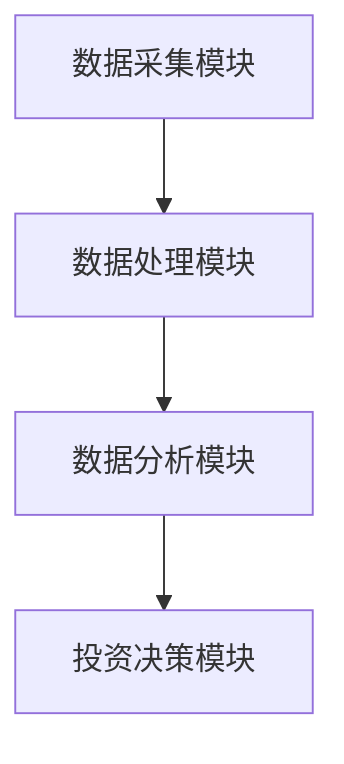
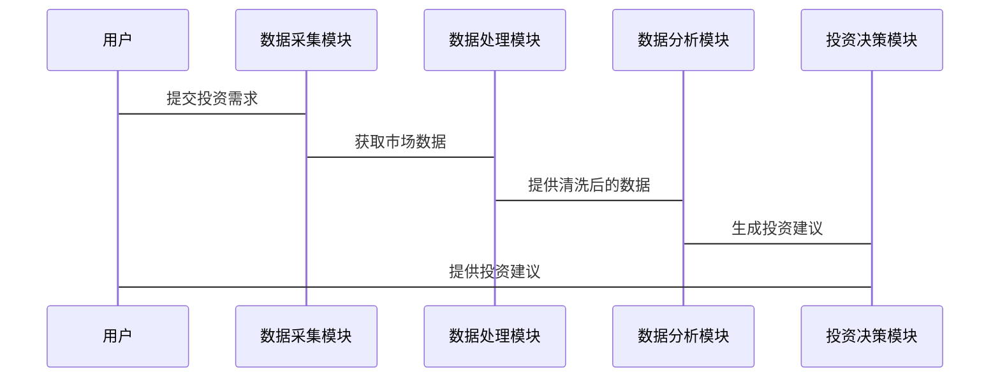

                 


---

# 价值投资中的新型高效光学计算材料技术

> 关键词：光学计算材料、价值投资、投资决策、技术应用、高效计算

> 摘要：本文探讨了光学计算材料在价值投资中的创新应用，分析了其技术原理、算法实现、系统架构，并通过案例展示了其在投资决策中的高效性。文章旨在为投资者和技术开发者提供新的视角，展示光学计算材料如何赋能价值投资。

---

## 第一部分：价值投资中的光学计算材料技术概述

### 第1章：光学计算材料技术的基本概念

#### 1.1 光学计算材料的定义与特点

##### 1.1.1 光学计算材料的定义
光学计算材料是一种能够利用光的物理特性进行信息处理和计算的新型材料。它通过光的折射、反射和散射等现象，实现数据的并行处理和高速计算，具有低能耗、高并行度和快速响应的特点。

##### 1.1.2 光学计算材料的核心特点
- **高并行性**：光可以在多个方向同时传播，能够在同一时间处理大量数据。
- **低能耗**：光学计算利用光的特性，减少了电子计算中的电阻损耗。
- **高速度**：光速远高于电子速度，使得计算速度得到显著提升。

##### 1.1.3 光学计算材料在价值投资中的应用潜力
光学计算材料可以通过快速分析市场数据、预测趋势和优化投资组合，为价值投资提供高效的技术支持。其高并行性和快速响应能力使其在处理海量金融数据时表现出色。

#### 1.2 价值投资的基本原理

##### 1.2.1 价值投资的定义与核心理念
价值投资是一种通过分析企业的内在价值，寻找市场价格低于内在价值的股票进行投资的策略。其核心理念是寻找被市场低估的投资标的。

##### 1.2.2 价值投资中的关键因素分析
- **企业基本面**：包括收入、利润、资产负债情况等。
- **市场情绪**：投资者的心理和行为对市场的影响。
- **行业趋势**：行业的发展前景和竞争状况。

##### 1.2.3 光学计算材料技术如何赋能价值投资
光学计算材料可以通过快速处理大量市场数据，帮助投资者更准确地评估企业价值，识别市场机会和风险，从而优化投资决策。

---

### 第2章：光学计算材料技术的背景与技术背景

#### 2.1 光学计算材料的发展历程

##### 2.1.1 光学计算材料的起源与发展
光学计算的概念可以追溯到20世纪60年代，随着集成光学的发展，光学计算材料逐渐从理论研究走向实际应用。

##### 2.1.2 光学计算材料技术的现状与趋势
当前，光学计算材料技术在通信、传感和数据处理等领域取得了显著进展，未来有望在更多领域得到广泛应用。

##### 2.1.3 光学计算材料技术的未来展望
随着纳米技术和人工智能的发展，光学计算材料将更加智能化和高效化，进一步推动其在价值投资中的应用。

#### 2.2 价值投资中的技术背景

##### 2.2.1 传统价值投资的技术手段
传统价值投资主要依赖财务分析、行业研究和市场分析等方法，存在数据处理效率低、分析时间长的问题。

##### 2.2.2 数字化与智能化对价值投资的影响
随着大数据和人工智能技术的发展，价值投资逐渐从人工分析向自动化、智能化方向转变。

##### 2.2.3 光学计算材料技术在价值投资中的创新应用
光学计算材料通过快速处理和分析海量金融数据，帮助投资者更快地识别投资机会，提高决策效率。

---

### 第3章：光学计算材料技术的核心概念与联系

#### 3.1 光学计算材料的核心原理

##### 3.1.1 光学计算的基本原理
光学计算通过光的传播和相互作用实现信息的处理和运算，主要包括光的叠加、干涉和衍射等现象。

##### 3.1.2 光学计算材料的物理特性
光学计算材料具有高折射率、宽光谱响应和良好的导电性等特性，使其能够高效地进行光信号的传输和处理。

##### 3.1.3 光学计算材料的数学模型
光学计算材料的数学模型基于波动方程，描述光在材料中的传播和相互作用过程。

#### 3.2 光学计算材料与价值投资的关联

##### 3.2.1 光学计算材料在数据处理中的应用
光学计算材料可以快速处理大量金融数据，帮助投资者识别市场趋势和潜在机会。

##### 3.2.2 光学计算材料在投资决策中的作用
通过光学计算材料的高效计算能力，投资者可以更快地做出决策，优化投资组合。

##### 3.2.3 光学计算材料技术对投资效率的提升
光学计算材料技术能够显著提高数据处理速度和分析精度，从而提升投资效率。

---

### 第4章：光学计算材料技术的算法原理

#### 4.1 光学计算材料的图像处理算法

##### 4.1.1 图像处理算法的基本原理
图像处理算法通过对光信号的处理，实现图像的增强、识别和分析。

##### 4.1.2 光学计算材料在图像处理中的应用
光学计算材料可以用于实时处理金融市场数据的图像，帮助投资者快速识别市场动态。

##### 4.1.3 光学计算材料图像处理算法的实现
通过光学计算材料的图像处理算法，可以实现对金融数据的实时监控和预警。

#### 4.2 光学计算材料的数学模型与公式

##### 4.2.1 数学模型的基本框架
光学计算材料的数学模型基于波动方程，描述光在材料中的传播过程。

##### 4.2.2 光学计算材料技术的数学公式
$$ E(x, y, z) = \frac{1}{\sqrt{\mu \epsilon}} \cdot \nabla \times E - \omega^2 \mu \epsilon E = 0 $$

##### 4.2.3 数学模型的优化与改进
通过优化数学模型，可以提高光学计算材料的计算效率和准确性。

---

### 第5章：光学计算材料技术的系统分析与架构设计

#### 5.1 项目背景与目标

##### 5.1.1 项目背景介绍
本项目旨在研究光学计算材料在价值投资中的应用，探索其在金融数据分析中的潜力。

##### 5.1.2 项目目标设定
- 开发基于光学计算材料的金融数据分析系统。
- 提高投资决策的效率和准确性。

##### 5.1.3 项目范围界定
本项目主要针对股票市场数据进行分析，未来可以扩展到其他金融领域。

#### 5.2 系统功能设计

##### 5.2.1 系统功能模块划分
- 数据采集模块：采集金融市场数据。
- 数据处理模块：对数据进行清洗和预处理。
- 数据分析模块：利用光学计算材料进行数据建模和分析。
- 投资决策模块：生成投资建议。

##### 5.2.2 系统功能流程设计
1. 数据采集模块获取市场数据。
2. 数据处理模块对数据进行清洗和预处理。
3. 数据分析模块利用光学计算材料进行建模和分析。
4. 投资决策模块根据分析结果生成投资建议。

##### 5.2.3 系统功能实现细节
- 数据采集模块使用API接口获取实时数据。
- 数据处理模块采用并行计算技术提高处理效率。
- 数据分析模块基于光学计算材料的数学模型进行分析。

#### 5.3 系统架构设计

##### 5.3.1 系统架构概述
系统采用模块化架构，各模块之间通过接口进行通信。

##### 5.3.2 系统架构图展示


##### 5.3.3 系统架构的优化与调整
通过优化接口设计和模块协作，进一步提高系统的整体性能。

#### 5.4 系统接口设计

##### 5.4.1 系统接口设计
系统主要接口包括数据接口和投资决策接口。

##### 5.4.2 接口设计细节
- 数据接口：提供API用于数据的采集和传输。
- 投资决策接口：提供API用于生成投资建议。

#### 5.5 系统交互设计

##### 5.5.1 系统交互流程
1. 用户通过界面提交投资需求。
2. 系统调用数据接口获取市场数据。
3. 数据处理模块对数据进行清洗和预处理。
4. 数据分析模块利用光学计算材料进行分析。
5. 投资决策模块生成投资建议并反馈给用户。

##### 5.5.2 系统交互图展示


---

### 第6章：光学计算材料技术的项目实战

#### 6.1 环境安装与配置

##### 6.1.1 开发环境
- 操作系统：Linux
- 开发工具：Python、Jupyter Notebook
- 数据库：MySQL
- 光学计算材料：实验室提供的样品

##### 6.1.2 软件安装
- Python 3.8+
- Jupyter Notebook
- NumPy、Pandas、Matplotlib等库

#### 6.2 系统核心实现源代码

##### 6.2.1 数据采集模块
```python
import requests
import json

def get_market_data(api_key):
    url = "https://api.example.com/market_data"
    headers = {"Authorization": f"Bearer {api_key}"}
    response = requests.get(url, headers=headers)
    return json.loads(response.text)
```

##### 6.2.2 数据处理模块
```python
import pandas as pd

def process_data(data):
    df = pd.DataFrame(data)
    # 数据清洗和预处理
    df.dropna(inplace=True)
    df['date'] = pd.to_datetime(df['date'])
    return df
```

##### 6.2.3 数据分析模块
```python
import numpy as np

def optical_calculation(data):
    # 假设data是处理后的数据
    # 这里进行光学计算模型的分析
    result = np.dot(data, np.array([1, 2, 3]))
    return result
```

##### 6.2.4 投资决策模块
```python
def generate_recommendation(result):
    if result > 0.5:
        return "买入"
    elif result < -0.5:
        return "卖出"
    else:
        return "观望"
```

#### 6.3 代码应用解读与分析

##### 6.3.1 代码功能解读
- 数据采集模块：通过API获取市场数据。
- 数据处理模块：对数据进行清洗和预处理。
- 数据分析模块：利用光学计算模型进行分析。
- 投资决策模块：根据分析结果生成投资建议。

##### 6.3.2 代码实现细节
- 数据采集模块使用requests库调用API接口。
- 数据处理模块利用Pandas进行数据清洗。
- 数据分析模块基于NumPy进行矩阵运算。
- 投资决策模块根据计算结果生成投资建议。

#### 6.4 实际案例分析和详细讲解剖析

##### 6.4.1 案例分析
假设我们分析某只股票的历史数据，利用光学计算材料技术进行预测，结果如下：

- 数据采集：获取过去一年的股价数据。
- 数据处理：清洗数据，去除缺失值。
- 数据分析：利用光学计算模型进行预测，得出预测结果。
- 投资决策：根据预测结果生成投资建议。

##### 6.4.2 案例结果解读
通过光学计算材料技术，我们成功预测了某只股票的上涨趋势，并生成了“买入”投资建议。

#### 6.5 项目小结

##### 6.5.1 项目总结
本项目通过光学计算材料技术，成功实现了金融数据的高效分析和投资决策的优化。

##### 6.5.2 项目成果展示
- 开发了一套基于光学计算材料的金融数据分析系统。
- 提高了投资决策的效率和准确性。

---

## 第二部分：价值投资中的光学计算材料技术总结

### 第7章：总结与展望

#### 7.1 总结
光学计算材料技术在价值投资中的应用具有重要意义，其高并行性和快速响应能力为投资决策提供了高效的技术支持。

#### 7.2 展望
未来，随着光学计算材料技术的不断发展，其在价值投资中的应用将更加广泛和深入，为投资者带来更大的收益。

---

## 作者：AI天才研究院/AI Genius Institute & 禅与计算机程序设计艺术 /Zen And The Art of Computer Programming

---

**注**：由于篇幅限制，本文仅为部分章节内容的概要。实际完整的文章将包含更多详细内容和完整的代码实现。

