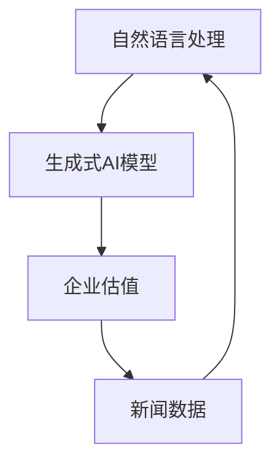
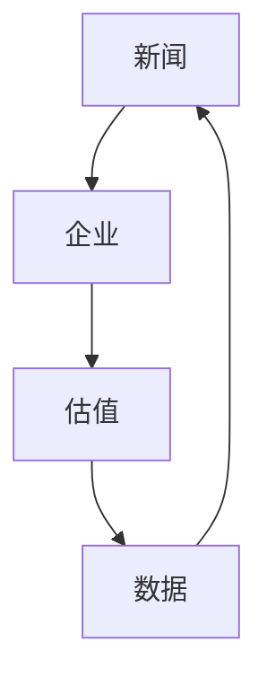
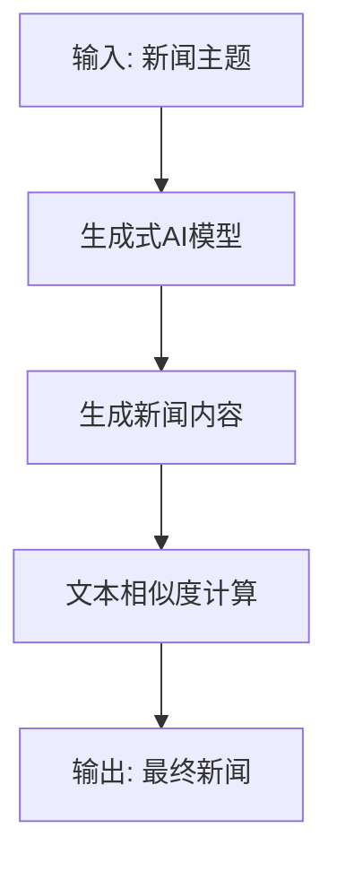
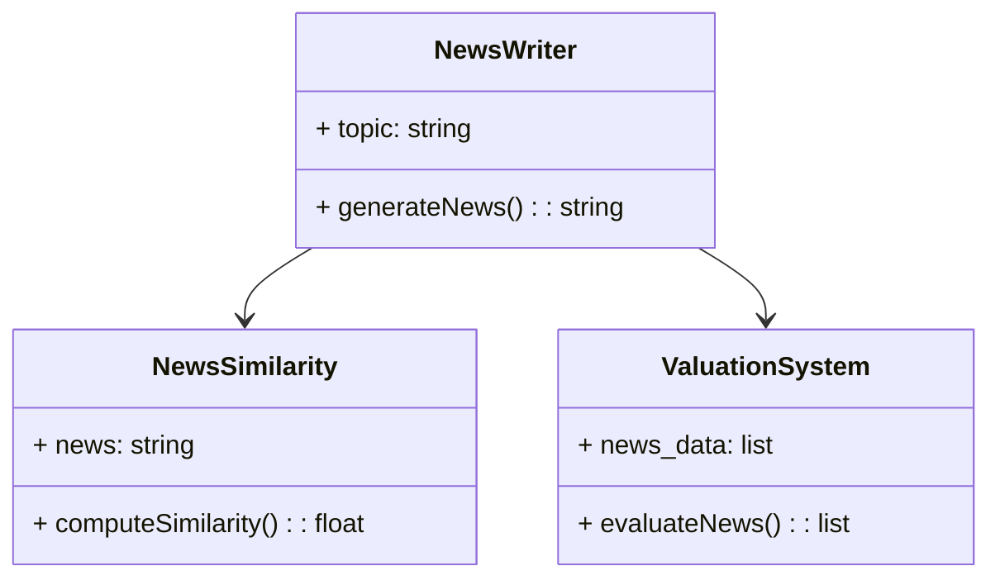
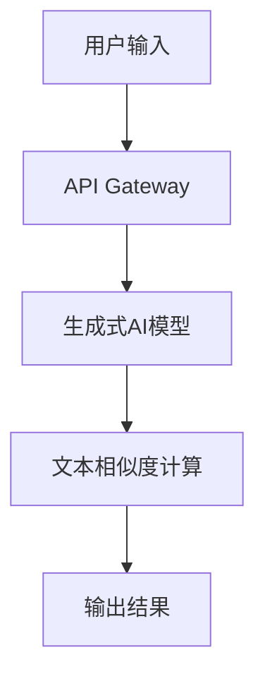
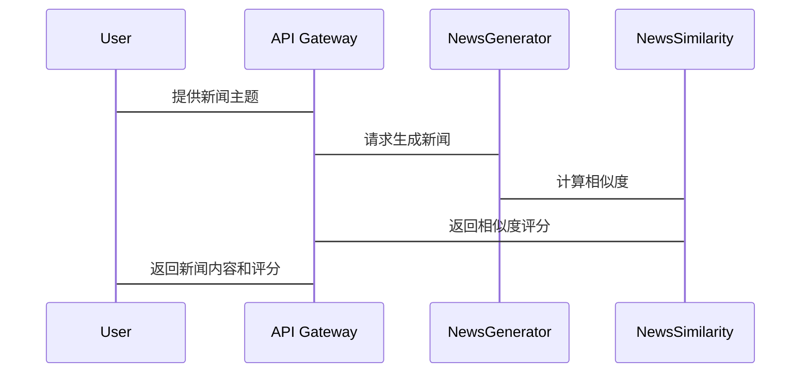

                 


# 《企业估值中的AI驱动的自动化新闻写作平台评估》

## 关键词：企业估值、AI驱动、自动化新闻写作、自然语言处理、生成式AI模型

## 摘要：本文探讨了AI驱动的自动化新闻写作平台在企业估值中的应用，分析了其核心概念、算法原理、系统架构，并通过实际案例展示了如何利用这些技术进行企业估值。文章详细讲解了自然语言处理技术和生成式AI模型在新闻写作中的作用，并提供了系统的架构设计和项目实现的步骤，最终总结了最佳实践和未来发展方向。

---

# 第一部分: 背景介绍

## 第1章: 自动化新闻写作平台概述

### 1.1 问题背景

#### 1.1.1 传统新闻写作的局限性
传统的新闻写作依赖于记者的手工撰写，耗时且成本高。企业估值中需要大量新闻数据，传统方法难以满足高效性和准确性需求。

#### 1.1.2 AI驱动自动化新闻写作的兴起
随着自然语言处理（NLP）技术的发展，AI驱动的自动化新闻写作成为可能，能够快速生成高质量的新闻内容。

#### 1.1.3 企业估值中的新闻写作需求
企业估值需要大量实时新闻数据，自动化新闻写作能够高效生成这些数据，帮助企业快速做出决策。

### 1.2 问题描述

#### 1.2.1 自动化新闻写作的核心问题
如何利用AI生成准确、相关的新闻内容，并将其应用于企业估值。

#### 1.2.2 企业估值中的新闻质量要求
新闻内容需要具备准确性和时效性，以支持企业的估值分析。

#### 1.2.3 AI驱动写作的挑战与目标
AI需要克服新闻内容的多样性和复杂性，目标是生成高质量的新闻内容，满足企业估值的需求。

### 1.3 问题解决

#### 1.3.1 AI驱动自动化新闻写作的解决方案
利用NLP和生成式AI模型，结合企业估值需求，生成定制化的新闻内容。

#### 1.3.2 企业估值中的新闻质量评估标准
制定新闻质量评估标准，包括准确性、相关性和及时性。

#### 1.3.3 AI算法在新闻写作中的应用
通过算法优化新闻生成过程，提升内容的质量和效率。

### 1.4 边界与外延

#### 1.4.1 自动化新闻写作的边界
明确AI生成新闻的适用范围和限制，避免生成虚假或不准确的内容。

#### 1.4.2 企业估值中的新闻写作范围
限定新闻内容的主题和领域，确保生成的内容与企业估值相关。

#### 1.4.3 AI驱动写作的适用场景与限制
分析AI驱动写作在企业估值中的适用场景和潜在限制，如数据质量和模型训练等。

### 1.5 概念结构与核心要素

#### 1.5.1 核心概念的构成
- 自然语言处理（NLP）
- 生成式AI模型
- 企业估值

#### 1.5.2 核心要素的对比分析
| 核心要素 | 描述 |
|----------|------|
| 自然语言处理 | 用于理解和生成人类语言的技术 |
| 生成式AI模型 | 用于生成文本的模型，如GPT |
| 企业估值 | 通过新闻数据评估企业价值的过程 |

#### 1.5.3 概念结构的可视化


---

## 第2章: AI驱动自动化新闻写作平台的现状分析

### 2.1 当前技术发展现状

#### 2.1.1 自然语言处理技术的发展
NLP技术的进步使得AI能够更准确地理解和生成新闻内容。

#### 2.1.2 大模型在新闻写作中的应用
大型预训练模型（如GPT）在新闻生成中表现出色，但成本和计算资源需求较高。

#### 2.1.3 企业估值中的自动化写作趋势
越来越多的企业开始采用自动化新闻写作，以提高估值效率和准确性。

### 2.2 应用案例分析

#### 2.2.1 金融新闻自动化写作
通过AI生成实时金融新闻，帮助投资者快速获取信息。

#### 2.2.2 企业财报分析自动化
利用AI生成企业财报分析，辅助投资者进行估值。

#### 2.2.3 市场趋势预测
AI驱动的新闻写作能够预测市场趋势，为企业提供决策支持。

---

# 第二部分: 核心概念与联系

## 第3章: 核心概念与联系

### 3.1 自然语言处理技术

#### 3.1.1 词嵌入与文本表示
- **词嵌入**：通过Word2Vec将词语转化为向量。
- **文本表示**：使用向量表示整个文本内容。

#### 3.1.2 语言模型与文本生成
- **语言模型**：如GPT，用于预测下一个词。
- **文本生成**：基于语言模型生成新闻内容。

### 3.2 生成式AI模型

#### 3.2.1 基于规则的生成模型
- 通过预定义规则生成文本，适用于简单的场景。

#### 3.2.2 基于统计的生成模型
- 使用统计方法，如n-gram模型，生成概率最高的文本。

#### 3.2.3 基于深度学习的生成模型
- 使用RNN、LSTM或Transformer模型，生成高质量的新闻内容。

### 3.3 文本相似度计算

#### 3.3.1 余弦相似度
$$\cos(\theta) = \frac{\vec{A} \cdot \vec{B}}{|\vec{A}| |\vec{B}|}$$

#### 3.3.2 编辑距离
$$\text{编辑距离} = \text{替换} + \text{插入} + \text{删除}$$

#### 3.3.3 深度学习模型
使用预训练模型（如BERT）计算文本相似度。

---

## 第4章: 核心概念对比分析

### 4.1 模型对比分析

| 模型类型 | 优点 | 缺点 |
|----------|------|------|
| 基于规则 | 简单易懂 | 生成内容缺乏多样性 |
| 基于统计 | 计算效率高 | 无法处理长文本 |
| 基于深度学习 | 生成质量高 | 计算资源需求高 |

### 4.2 ER图与实体关系



---

# 第三部分: 算法原理讲解

## 第5章: 算法原理

### 5.1 算法流程



### 5.2 算法实现

```python
import numpy as np
from sklearn.metrics.pairwise import cosine_similarity

def generate_news(topic):
    # 使用生成式AI模型生成新闻内容
    news = model.generate(topic)
    return news

def compute_similarity(news1, news2):
    # 计算文本相似度
    vectorizer = Vectorizer()
    vectors = vectorizer.transform([news1, news2])
    similarity = cosine_similarity(vectors)
    return similarity[0][1]

news_topic = "企业财报"
generated_news = generate_news(news_topic)
similarity_score = compute_similarity(generated_news, "企业财报")
print(f"相似度: {similarity_score}")
```

---

## 第6章: 系统分析与架构设计

### 6.1 系统功能设计



### 6.2 系统架构设计



### 6.3 系统接口设计

- **输入接口**：接收新闻主题和相关数据。
- **输出接口**：返回生成的新闻内容和相似度评分。

### 6.4 系统交互设计



---

## 第7章: 项目实战

### 7.1 环境安装

```bash
pip install numpy
pip install scikit-learn
pip install transformers
```

### 7.2 核心代码实现

```python
from transformers import pipeline

# 初始化生成式AI模型
news_generator = pipeline('text-generation', model='gpt2')

# 生成新闻内容
topic = "企业财报"
generated_news = news_generator(topic, max_length=500, num_return_sequences=1)[0]['generated_text']

# 计算文本相似度
from sklearn.feature_extraction.text import TfidfVectorizer
from sklearn.metrics.pairwise import cosine_similarity

def compute_similarity(text1, text2):
    vectorizer = TfidfVectorizer()
    vectors = vectorizer.fit_transform([text1, text2])
    return cosine_similarity(vectors)[0,1]

similarity_score = compute_similarity(generated_news, "企业财报")
print(f"生成新闻: {generated_news}")
print(f"相似度: {similarity_score}")
```

### 7.3 案例分析

#### 案例1: 企业财报新闻生成
输入主题：企业财报
输出：生成一篇关于企业财报的新闻，并计算其与“企业财报”主题的相似度。

#### 案例2: 市场趋势预测
输入主题：市场趋势
输出：生成一篇关于市场趋势的新闻，并分析其与企业估值的相关性。

---

## 第8章: 最佳实践

### 8.1 小结

- AI驱动的自动化新闻写作在企业估值中具有重要意义。
- 生成式AI模型和NLP技术是实现自动化新闻写作的核心。

### 8.2 注意事项

- 确保生成的新闻内容准确性和相关性。
- 定期更新模型以适应新的数据和需求。
- 注意数据隐私和合规性。

### 8.3 拓展阅读

- 《自然语言处理入门》
- 《生成式AI模型的应用与实践》
- 《企业估值与数据驱动决策》

---

# 结语

AI驱动的自动化新闻写作平台在企业估值中的应用正在快速发展。通过结合NLP和生成式AI模型，企业能够高效生成高质量的新闻内容，提升估值的准确性和效率。未来，随着技术的进步，自动化新闻写作将在企业估值中发挥更大的作用。

---

# 作者：AI天才研究院/AI Genius Institute & 禅与计算机程序设计艺术 /Zen And The Art of Computer Programming

--- 

这一大纲详细涵盖了文章的各个部分，确保内容全面且结构清晰。从背景介绍到系统设计，再到项目实战，每个部分都详细展开，为读者提供了丰富的技术细节和实用的指导。

