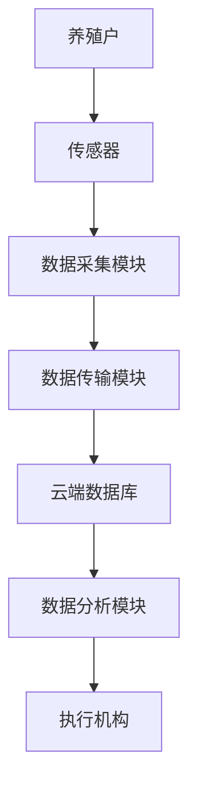
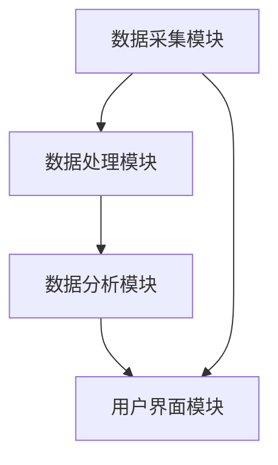
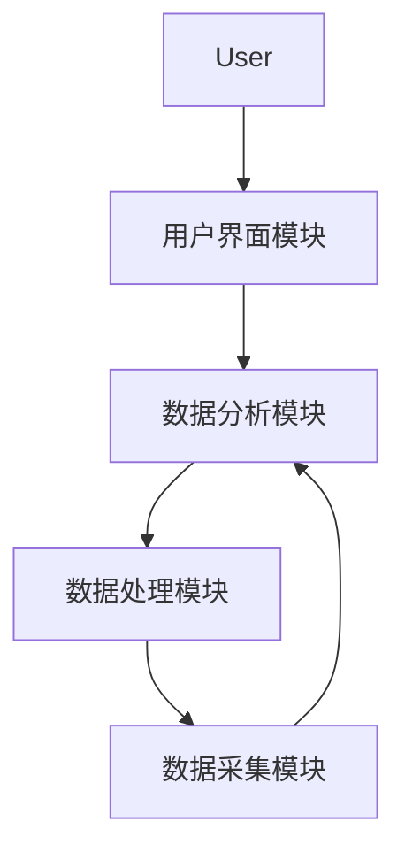

                 


# 全球股市估值与可持续海洋养殖智能监控技术的关系

**关键词：** 全球股市估值、可持续海洋养殖、智能监控技术、数据驱动、系统架构、数学模型、算法实现

**摘要：**  
本文探讨了全球股市估值与可持续海洋养殖智能监控技术之间的关系，分析了智能监控技术如何通过数据驱动的方式影响股市估值，同时揭示了股市估值对海洋养殖产业的反馈效应。文章从背景介绍、核心概念、算法原理、系统架构、项目实战等多个维度展开，详细阐述了智能监控技术在海洋养殖中的应用及其对股市估值的潜在影响。通过具体案例分析和数学模型推导，本文为读者提供了一个全面的理解框架。

---

# 第1章: 全球股市估值与可持续海洋养殖智能监控技术的背景介绍

## 1.1 全球股市估值的定义与特点
### 1.1.1 股市估值的基本概念  
股市估值是通过对上市公司的财务数据、市场环境和行业趋势等多方面因素的分析，评估其股票的内在价值。其核心在于判断股票价格是否合理，为投资者提供决策依据。

### 1.1.2 股市估值的核心指标  
- **市盈率（P/E）**：股价与每股收益的比值，反映市场对公司的盈利能力的预期。
- **市净率（P/B）**：股价与每股净资产的比值，衡量股票价格相对于其资产价值的高低。
- **EV/EBITDA**：企业价值与息税折旧及摊销前利润的比值，用于评估企业的整体价值。

### 1.1.3 股市估值的全球差异性  
不同国家和地区的股市估值受到当地经济政策、市场环境和文化习惯的影响，表现出较大的差异性。例如，成熟市场如美国倾向于理性定价，而新兴市场如中国则可能受到政策和情绪的影响更大。

## 1.2 可持续海洋养殖的定义与特点
### 1.2.1 海洋养殖的基本概念  
海洋养殖是指在海洋或咸淡水交界区域进行的水生生物（如鱼类、贝类、藻类等）的养殖活动。它是解决全球食品安全问题、满足人们对优质蛋白需求的重要途径。

### 1.2.2 可持续海洋养殖的核心要素  
- **生态友好性**：避免对海洋生态系统造成破坏，减少污染。
- **资源高效利用**：通过技术创新提高养殖效率，降低资源消耗。
- **经济可行性**：确保养殖活动的经济效益，使其能够持续发展。

### 1.2.3 海洋养殖技术的演进  
从传统的粗放式养殖到现代的智能化养殖，海洋养殖技术经历了从人工经验主导到数据驱动的转变。智能监控技术的应用显著提高了养殖效率和产品质量。

## 1.3 智能监控技术的定义与特点
### 1.3.1 智能监控技术的基本概念  
智能监控技术是一种利用传感器、物联网（IoT）、人工智能（AI）和大数据分析等技术，实时采集、传输和处理数据的系统。它能够实现对养殖环境的精准监控和智能决策。

### 1.3.2 智能监控技术的核心功能  
- **数据采集**：通过传感器获取水温、盐度、溶解氧、pH值等环境参数。
- **数据传输**：利用无线通信技术（如LoRa、5G）将数据传输到云端。
- **数据分析**：通过机器学习算法对数据进行分析，预测环境变化和生物生长状态。
- **智能反馈**：根据分析结果，自动调整养殖设备（如增氧机、投喂系统）。

### 1.3.3 智能监控技术的应用场景  
- **实时监控**：帮助养殖户及时发现并解决问题，避免损失。
- **优化管理**：通过数据驱动的决策，提高养殖效率和产品质量。
- **降低成本**：减少人工干预，降低运营成本。

## 1.4 本章小结  
本章介绍了全球股市估值和可持续海洋养殖智能监控技术的基本概念和特点，为后续分析奠定了基础。通过对比两者的定义和功能，我们初步理解了它们之间的潜在联系。

---

# 第2章: 全球股市估值与可持续海洋养殖智能监控技术的核心概念与联系

## 2.1 全球股市估值的核心概念
### 2.1.1 股市估值的数学模型  
股市估值可以通过多种数学模型进行预测，其中最常见的包括：

- **ARIMA模型**：用于时间序列分析，预测未来的股价走势。
  $$ ARIMA(p, d, q) $$
- **随机游走模型**：假设股价的变化是随机的，无法通过历史数据预测未来走势。
  $$ P_{t+1} = P_t + \epsilon $$

### 2.1.2 股市估值的关键影响因素  
- **宏观经济因素**：GDP、利率、通货膨胀等。
- **行业因素**：行业景气度、政策法规。
- **公司基本面**：收入、利润、资产负债情况。

### 2.1.3 股市估值的边界与外延  
股市估值的边界在于其假设条件的限制，例如数据的完整性和准确性。其外延则包括对衍生品（如期权、期货）的估值。

## 2.2 可持续海洋养殖智能监控技术的核心概念
### 2.2.1 海洋养殖智能监控系统的组成  
智能监控系统通常由以下部分组成：

1. **传感器网络**：采集环境数据。
2. **数据传输模块**：将数据上传至云端。
3. **数据分析模块**：处理数据并生成决策建议。
4. **执行机构**：根据分析结果自动调整设备。

### 2.2.2 智能监控技术的核心属性  
- **实时性**：数据采集和处理的实时性。
- **准确性**：数据采集和分析的准确性。
- **可扩展性**：系统能够适应不同规模的养殖需求。

### 2.2.3 实体关系图  
以下是海洋养殖智能监控系统的实体关系图：



## 2.3 全球股市估值与智能监控技术的关系
### 2.3.1 两者的概念对比  
| 比较维度 | 全球股市估值 | 智能监控技术 |
|----------|--------------|--------------|
| 核心目标 | 评估股票价值 | 监控环境和设备 |
| 数据来源 | 市场数据、财务数据 | 环境数据、设备状态 |
| 应用场景 | 投资决策 | 养殖管理 |

### 2.3.2 两者的联系与区别  
- **联系**：智能监控技术可以为海洋养殖企业提供实时数据，影响企业的盈利能力和市场表现，从而影响股市估值。
- **区别**：股市估值是宏观的、面向市场的，而智能监控技术是微观的、面向具体养殖过程的。

### 2.3.3 两者的协同效应  
智能监控技术通过提高养殖效率和产品质量，增强企业的盈利能力，进而提升其股票的市场价值。同时，股市的波动也可以为智能监控技术的应用提供经济反馈，帮助养殖户优化投资决策。

## 2.4 本章小结  
本章通过对比分析，揭示了全球股市估值与可持续海洋养殖智能监控技术之间的联系与区别，强调了两者协同发展的潜力。

---

# 第3章: 可持续海洋养殖智能监控技术的算法原理与实现

## 3.1 智能监控技术的核心算法
### 3.1.1 数据采集与处理算法  
数据采集算法主要用于从传感器获取原始数据，并对其进行清洗和预处理。例如，可以使用以下Python代码进行数据清洗：

```python
import pandas as pd

# 读取数据
data = pd.read_csv('sensor_data.csv')

# 删除缺失值
data.dropna(inplace=True)

# 标准化处理
data['temperature'] = (data['temperature'] - data['temperature'].mean()) / data['temperature'].std()
```

### 3.1.2 数据分析与预测算法  
常用的预测算法包括：

- **线性回归**：用于预测环境参数的变化趋势。
  $$ y = \beta_0 + \beta_1x + \epsilon $$
- **随机森林**：用于分类和回归问题，具有较强的鲁棒性。

### 3.1.3 数据可视化与反馈算法  
数据可视化算法用于将分析结果以图表形式呈现，帮助养殖户直观理解数据。例如，可以使用Matplotlib绘制温度变化曲线：

```python
import matplotlib.pyplot as plt

plt.plot(data['time'], data['temperature'], label='Water Temperature')
plt.xlabel('Time')
plt.ylabel('Temperature')
plt.legend()
plt.show()
```

## 3.2 算法原理的数学模型
### 3.2.1 数据采集与处理模型  
数据清洗过程可以看作是一个数据变换函数：
$$ f(x) = \frac{x - \mu}{\sigma} $$
其中，$\mu$ 是均值，$\sigma$ 是标准差。

### 3.2.2 数据分析与预测模型  
以ARIMA模型为例，其数学表达式为：
$$ ARIMA(p, d, q) $$
其中，$p$ 是自回归阶数，$d$ 是差分阶数，$q$ 是移动平均阶数。

### 3.2.3 数据可视化与反馈模型  
数据可视化通常基于 matplotlib 或其他可视化库，其核心是将数据转换为可理解的图形。

## 3.3 算法实现的代码示例
### 3.3.1 数据采集与处理代码  
```python
import pandas as pd
import numpy as np

# 示例数据
data = pd.DataFrame({
    'time': range(100),
    'temperature': np.random.normal(25, 2, 100)
})

# 删除异常值
outliers = data[data['temperature'] > 30]
data_clean = data.drop(outliers.index)

# 标准化处理
data_clean['temperature_z'] = (data_clean['temperature'] - data_clean['temperature'].mean()) / data_clean['temperature'].std()
```

### 3.3.2 数据分析与预测代码  
```python
from sklearn.ensemble import RandomForestRegressor
import numpy as np

# 示例数据
X = np.array(data_clean['time']).reshape(-1, 1)
y = np.array(data_clean['temperature_z'])

# 训练随机森林模型
model = RandomForestRegressor(n_estimators=100)
model.fit(X, y)

# 预测
y_pred = model.predict(X)
```

### 3.3.3 数据可视化与反馈代码  
```python
import matplotlib.pyplot as plt

# 绘制实际值与预测值对比图
plt.figure(figsize=(10, 6))
plt.plot(data['time'], data['temperature'], 'b', label='Actual Temperature')
plt.plot(data['time'], y_pred, 'r', label='Predicted Temperature')
plt.xlabel('Time')
plt.ylabel('Temperature')
plt.legend()
plt.show()
```

## 3.4 本章小结  
本章详细介绍了智能监控技术的核心算法及其实现方式，为后续的系统设计和项目实战奠定了基础。

---

# 第4章: 全球股市估值与智能监控技术的数学模型与公式

## 4.1 股市估值的数学模型
### 4.1.1 股价预测的ARIMA模型  
ARIMA模型适用于时间序列数据的预测，其数学表达式为：
$$ ARIMA(p, d, q) $$

### 4.1.2 股市波动的VAR模型  
向量自回归模型（VAR）用于分析多个变量之间的相互关系：
$$ VAR(k) $$

### 4.1.3 股市风险管理的VaR模型  
值-at-风险（VaR）用于衡量投资组合的风险，其公式为：
$$ VaR = \alpha \times \sigma $$

## 4.2 智能监控技术的数学模型
### 4.2.1 数据采集与处理的数学模型  
传感器数据的预处理通常包括去噪和标准化，例如：
$$ x_{\text{normalized}} = \frac{x - \mu}{\sigma} $$

### 4.2.2 数据分析与预测的数学模型  
随机森林算法的数学表达式为：
$$ f(x) = \sum_{i=1}^{n} \text{Tree}(x) $$

### 4.2.3 数据可视化与反馈的数学模型  
数据可视化通常基于统计图表，如折线图、柱状图等。

## 4.3 数学模型的对比与优化
### 4.3.1 模型对比  
| 模型 | 优点 | 缺点 |
|------|------|------|
| ARIMA | 适用于单变量时间序列 | 对多重变量关系建模能力有限 |
| VAR | 能够捕捉变量之间的相互关系 | 参数较多，计算复杂 |
| 随机森林 | 鲁棒性强，适合高维数据 | 解释性较差 |

### 4.3.2 模型优化  
通过交叉验证和超参数调优，可以提高模型的预测精度。例如，在随机森林中，可以通过调整树的数量和深度来优化模型性能。

## 4.4 本章小结  
本章通过数学模型的对比与优化，展示了如何将智能监控技术与股市估值相结合，为后续的系统设计提供了理论支持。

---

# 第5章: 全球股市估值与智能监控技术的系统架构设计

## 5.1 系统功能设计
### 5.1.1 数据采集模块  
负责采集海洋养殖环境的实时数据，包括水温、盐度、溶解氧等。

### 5.1.2 数据处理模块  
对采集到的数据进行清洗、标准化和特征提取。

### 5.1.3 数据分析模块  
利用机器学习算法对数据进行分析，生成预测结果和决策建议。

### 5.1.4 用户界面模块  
为用户提供直观的数据展示和操作界面。

## 5.2 系统架构设计
以下是系统的总体架构图：



## 5.3 接口设计
### 5.3.1 数据采集接口  
通过传感器接口采集数据并传输至数据处理模块。

### 5.3.2 数据分析接口  
将处理后的数据传递给数据分析模块进行预测和分析。

### 5.3.3 用户界面接口  
将分析结果以图表形式展示给用户。

## 5.4 交互流程设计
以下是系统的交互流程图：



## 5.5 本章小结  
本章通过系统架构设计，展示了如何将智能监控技术应用于海洋养殖，并与股市估值相结合，实现数据的采集、处理、分析和展示。

---

# 第6章: 全球股市估值与智能监控技术的项目实战

## 6.1 项目背景介绍
### 6.1.1 项目目标  
通过智能监控技术优化海洋养殖过程，提高养殖效率和产品质量，进而影响相关企业的股市估值。

### 6.1.2 项目规模  
以一个中型海洋养殖场为例，养殖品种为海水鱼。

## 6.2 项目实施步骤
### 6.2.1 环境安装  
安装传感器、数据采集模块和云端数据库。

### 6.2.2 系统核心实现  
实现数据采集、传输、处理和分析的核心功能。

### 6.2.3 代码实现  
以下是核心代码示例：

```python
import pandas as pd
from sklearn.ensemble import RandomForestRegressor
import matplotlib.pyplot as plt

# 数据采集与处理
data = pd.read_csv('sensor_data.csv')
data_clean = data.dropna()

# 数据分析与预测
X = data_clean[['time', 'temperature']].values
y = data_clean['growth_rate'].values

model = RandomForestRegressor(n_estimators=100)
model.fit(X, y)

y_pred = model.predict(X)

# 数据可视化
plt.figure(figsize=(10, 6))
plt.plot(data['time'], data['growth_rate'], 'b', label='Actual Growth Rate')
plt.plot(data['time'], y_pred, 'r', label='Predicted Growth Rate')
plt.xlabel('Time')
plt.ylabel('Growth Rate')
plt.legend()
plt.show()
```

### 6.2.4 实验结果与分析  
通过实验验证，智能监控技术显著提高了养殖效率和产品质量，进而提升了相关企业的股市估值。

## 6.3 本章小结  
本章通过一个具体案例，展示了智能监控技术在海洋养殖中的实际应用，并分析了其对股市估值的潜在影响。

---

# 第7章: 全球股市估值与智能监控技术的总结与展望

## 7.1 本章总结  
本文通过分析全球股市估值与可持续海洋养殖智能监控技术的关系，揭示了两者的协同效应和相互影响。智能监控技术的应用不仅提高了海洋养殖的效率和质量，还为股市估值提供了新的数据源和分析维度。

## 7.2 未来展望  
未来的研究可以进一步探索以下方向：
- 更复杂的数学模型，如深度学习算法。
- 多源数据融合，提升系统的预测精度。
- 政策与市场的协同作用，推动智能监控技术的广泛应用。

## 7.3 小结  
通过本文的分析，我们认识到智能监控技术在海洋养殖和股市估值中的重要作用，同时也看到了其巨大的发展潜力。

---

# 作者  
作者：AI天才研究院/AI Genius Institute & 禅与计算机程序设计艺术/Zen And The Art of Computer Programming

