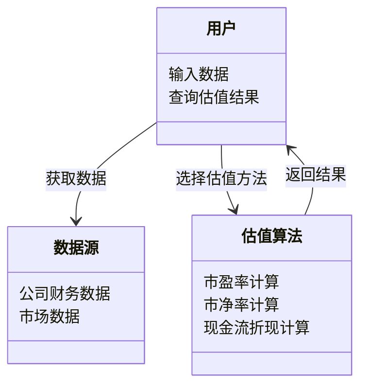
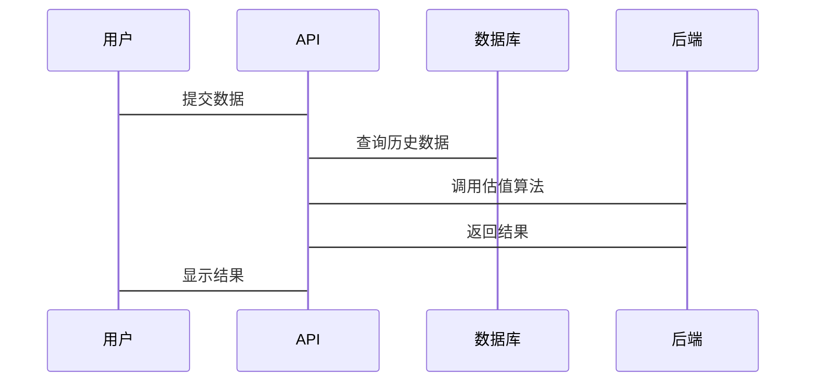
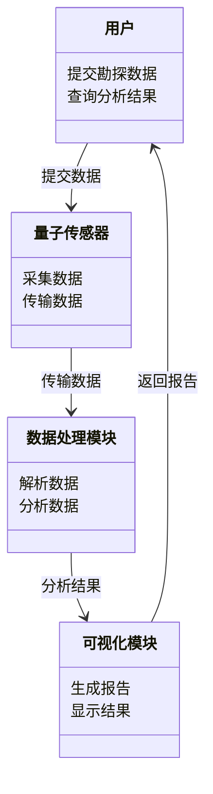
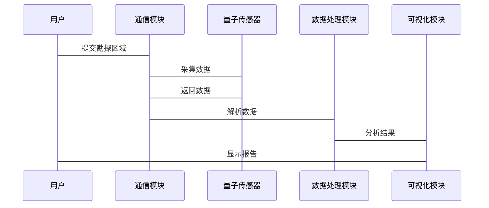

                 


# 全球股市估值与量子传感器在地质勘探中的应用

> 关键词：全球股市估值，量子传感器，地质勘探，股市分析，量子技术

> 摘要：本文探讨了全球股市估值的基本方法、高级模型以及量子传感器在地质勘探中的应用。通过系统架构设计和实战案例分析，详细讲解了股市估值的核心算法和量子传感器的技术原理，最后分析了两者的潜在结合与应用。

---

## 第一部分: 全球股市估值

### 第1章: 股市估值基础

#### 1.1 股市估值的基本概念

##### 1.1.1 什么是股市估值
股市估值是指对一家公司股票的内在价值进行评估，以确定其市场价格是否合理。它是投资决策的重要依据，帮助投资者判断股票是否被高估或低估。

##### 1.1.2 股市估值的必要性
在股票市场中，价格波动受多种因素影响，包括市场情绪、宏观经济环境等。通过估值，投资者可以识别出价值被低估或高估的股票，从而做出更明智的投资决策。

##### 1.1.3 股市估值的核心要素
股市估值的核心要素包括公司财务状况、行业地位、盈利能力、未来增长潜力等。这些要素共同决定了公司的内在价值。

#### 1.2 股市估值的主要方法

##### 1.2.1 市盈率（PE）法
市盈率是股票价格与每股收益的比值，用于衡量投资者对每股收益的支付意愿。公式为：  
$$ PE = \frac{股价}{每股收益} $$  
市盈率反映了市场的预期和公司盈利能力。

##### 1.2.2 市净率（PB）法
市净率是股票价格与每股净资产的比值，用于评估股票是否被低估或高估。公式为：  
$$ PB = \frac{股价}{每股净资产} $$  
市净率适用于评估资产密集型行业，如银行和制造业。

##### 1.2.3 现金流折现法
现金流折现法是通过将未来现金流折现到现值来评估公司价值。常用的方法包括股利折现模型（DDM）和自由现金流模型。  
$$ V = \sum_{t=1}^{n} \frac{CF_t}{(1+r)^t} $$  
其中，CF_t是第t年的现金流，r是折现率。

---

#### 1.3 影响股市估值的主要因素

##### 1.3.1 宏观经济因素
宏观经济环境如GDP增长率、利率水平、通货膨胀率等直接影响股市估值。例如，低利率环境通常会推高市盈率。

##### 1.3.2 行业因素
行业特点如周期性、成长性等也会影响估值。例如，科技行业通常采用市盈率或市净率估值，而周期性行业则可能采用现金流折现法。

##### 1.3.3 公司基本面
公司基本面包括盈利能力、财务状况、管理团队等。基本面良好的公司通常具有更高的估值。

---

### 第2章: 股市估值的高级方法

#### 2.1 股权自由现金流模型

##### 2.1.1 模型的定义与公式
股权自由现金流模型将公司自由现金流分配给股东，考虑了资本成本。公式为：  
$$ FCFF = EBIT(1 - 税率) + 折旧和摊销 - 资本支出 $$  
其中，EBIT是息税前利润。

##### 2.1.2 模型的应用步骤
1. 计算EBIT和税后现金流。  
2. 扣除折旧和摊销。  
3. 减去资本支出，得到FCFF。  
4. 折现计算现值。

##### 2.1.3 模型的优缺点
优点：考虑了税盾效应；缺点：需要准确预测未来现金流。

---

#### 2.2 市场比较法

##### 2.2.1 比较法的定义
市场比较法通过比较类似公司的估值，确定目标公司的合理价格。

##### 2.2.2 比较法的实施步骤
1. 选择可比公司。  
2. 计算可比公司的估值指标（如PE、PB）。  
3. 应用可比公司的平均估值指标，估算目标公司价值。

##### 2.2.3 比较法的适用场景
适用于行业集中度高、公司之间具有可比性的领域。

---

#### 2.3 股票评级与评分模型

##### 2.3.1 股票评级的基本概念
股票评级是根据财务指标和市场表现，将股票分为不同等级，帮助投资者做出决策。

##### 2.3.2 股票评分模型的构建
评分模型通常结合多个指标，如ROE、ROA、市盈率等，赋予不同权重，计算综合评分。

##### 2.3.3 股票评级的实际应用
投资者可以根据评分结果，选择高分股票进行投资。

---

### 第3章: 股市估值的系统架构设计

#### 3.1 系统需求分析

##### 3.1.1 问题场景介绍
股市估值系统旨在帮助投资者快速、准确地评估股票价值。

##### 3.1.2 项目目标
构建一个基于多种估值方法的综合系统，支持用户输入数据并输出估值结果。

##### 3.1.3 用户角色与需求
用户包括个人投资者、机构投资者和金融分析师，需求包括数据输入、估值计算和结果输出。

---

#### 3.2 系统功能设计

##### 3.2.1 领域模型设计（Mermaid 类图）



##### 3.2.2 系统架构设计（Mermaid 架构图）


##### 3.2.3 系统接口设计
- 输入接口：接收用户输入的财务数据和市场数据。  
- 输出接口：返回估值结果和相关分析报告。

##### 3.2.4 系统交互设计（Mermaid 序列图）



---

#### 3.3 系统实现与优化

##### 3.3.1 环境安装与配置
需要安装Python、Pandas、NumPy等库，以及数据可视化工具如Matplotlib。

##### 3.3.2 核心算法实现（Python 代码）

```python
import pandas as pd

def calculate_pe(stock_price, eps):
    return stock_price / eps

def calculate_pb(stock_price, book_value):
    return stock_price / book_value

def calculate_fcf(stock_cash_flow):
    return stock_cash_flow.sum() / (1 + 0.05)  # 假设折现率为5%
```

##### 3.3.3 代码解读与优化建议
- 使用Pandas进行数据处理，提高效率。  
- 结合实际数据调整折现率，优化现金流计算。

---

#### 3.4 项目实战案例分析

##### 3.4.1 实战项目
以某科技公司为例，计算其市盈率、市净率和股权自由现金流。

---

## 第二部分: 量子传感器在地质勘探中的应用

### 第4章: 量子传感器的基本原理

#### 4.1 量子传感器的概念与分类

##### 4.1.1 量子传感器的基本概念
量子传感器利用量子效应测量物理量，如重力、磁场、振动等。

##### 4.1.2 量子传感器的分类
- 基于量子干涉的传感器。  
- 基于量子磁力计的传感器。

---

#### 4.2 量子传感器的优势

##### 4.2.1 高灵敏度
量子传感器能够检测极微弱的信号，适用于地质勘探中的细微变化检测。

##### 4.2.2 高精度
通过量子纠缠等现象，实现超高的测量精度。

##### 4.2.3 适应复杂环境
量子传感器在高温、高压等极端环境中表现优异。

---

### 第5章: 量子传感器在地质勘探中的应用

#### 5.1 地质勘探中的资源检测

##### 5.1.1 石油和天然气勘探
量子传感器用于检测地下油层的振动信号，帮助定位资源分布。

##### 5.1.2 矿产资源勘探
通过量子传感器检测地磁场变化，识别矿产资源的位置。

---

#### 5.2 地质监测与灾害预警

##### 5.2.1 地震监测
量子传感器用于监测地震波，提前预警地震发生。

##### 5.2.2 火山活动监测
通过量子传感器检测地壳运动，预测火山爆发风险。

---

### 第6章: 量子传感器与股市估值的结合

#### 6.1 量子传感器技术在资源型企业估值中的应用

##### 6.1.1 通过量子传感器提升资源勘探效率
更快、更准确地勘探资源，提高企业的储量估算。

##### 6.1.2 提高企业估值的准确性
基于量子传感器的精确数据，优化储量评估，提升估值模型的准确性。

---

#### 6.2 量子传感器技术对股市的影响

##### 6.2.1 提高资源企业估值的可靠性
量子传感器的应用使资源企业的估值更加精准，减少信息不对称。

##### 6.2.2 促进技术进步与市场创新
量子传感器的技术进步推动股市估值方法的创新，形成新的投资机会。

---

### 第7章: 量子传感器在地质勘探中的系统架构设计

#### 7.1 系统需求分析

##### 7.1.1 问题场景介绍
地质勘探需要精确的数据采集和分析，传统的传感器在精度和灵敏度上存在不足。

##### 7.1.2 项目目标
构建一个基于量子传感器的地质勘探系统，提高数据采集和分析的精度。

##### 7.1.3 用户角色与需求
用户包括地质勘探公司、矿业公司、地震监测机构，需求包括实时数据采集、精准分析和可视化报告。

---

#### 7.2 系统功能设计

##### 7.2.1 领域模型设计（Mermaid 类图）



##### 7.2.2 系统架构设计（Mermaid 架构图）


##### 7.2.3 系统接口设计
- 数据采集接口：量子传感器与系统通信模块之间的接口。  
- 数据处理接口：数据处理模块与可视化模块之间的接口。

##### 7.2.4 系统交互设计（Mermaid 序列图）



---

### 第8章: 量子传感器在地质勘探中的实战案例分析

#### 8.1 实战项目

##### 8.1.1 某矿区资源勘探案例
通过量子传感器精确检测矿产资源分布，提升储量估算的准确性。

##### 8.1.2 某地震监测项目
利用量子传感器实时监测地震波，提前预警地震风险。

---

## 第三部分: 结论与展望

### 第9章: 结论与小结

#### 9.1 全球股市估值的总结
股市估值是投资决策的核心，掌握多种估值方法有助于投资者做出明智选择。

#### 9.2 量子传感器在地质勘探中的应用总结
量子传感器以其高精度和灵敏度，为地质勘探带来了革命性的变化。

#### 9.3 量子传感器与股市估值的结合展望
随着量子技术的进步，未来可能在资源型企业估值中发挥更大作用。

---

### 第10章: 最佳实践与注意事项

#### 10.1 最佳实践 tips

##### 10.1.1 股市估值
- 结合多种估值方法，避免单一指标误导。  
- 定期更新数据，适应市场变化。

##### 10.1.2 量子传感器
- 确保传感器校准，保证数据准确性。  
- 建立完善的数据安全机制，防止数据泄露。

---

#### 10.2 小结
本文详细探讨了全球股市估值和量子传感器在地质勘探中的应用，通过系统架构设计和实战案例分析，展示了两者的潜力和重要性。

---

### 第11章: 展望与未来发展方向

#### 11.1 未来技术发展
- 量子传感器技术的进一步突破，提升测量精度和灵敏度。  
- 股市估值方法的创新，结合人工智能技术，实现智能化估值。

#### 11.2 应用领域拓展
- 量子传感器在更多领域的应用，如环境监测、医疗检测等。  
- 股市估值与大数据、区块链技术的结合，推动金融科技的发展。

---

## 作者：AI天才研究院/AI Genius Institute & 禅与计算机程序设计艺术 /Zen And The Art of Computer Programming

