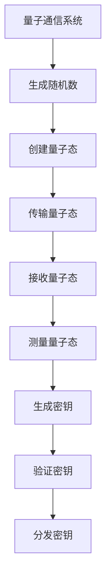
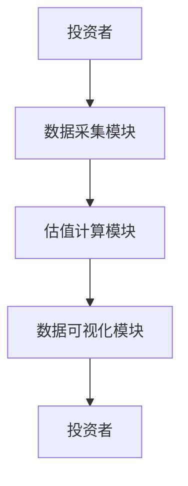
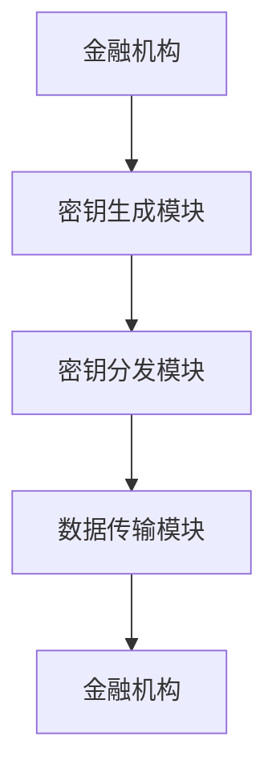

                 


# 全球股市估值与量子通信在金融安全中的应用

> 关键词：股市估值，量子通信，金融安全，量子密钥分发，金融系统架构

> 摘要：本文探讨了全球股市估值与量子通信技术在金融安全中的应用。首先，我们分析了股市估值的基本概念和常用模型，接着深入介绍了量子通信在金融安全中的潜力和实现方式。通过结合这两个领域的核心原理，我们展示了如何利用量子通信技术提升金融系统的安全性，同时优化股市估值的准确性。本文还提供了实际案例分析和系统架构设计，为金融行业的技术升级提供了参考。

---

# 第一部分：全球股市估值与量子通信的背景与基础

## 第1章：背景介绍

### 1.1 问题背景

#### 1.1.1 全球股市估值的重要性  
股市估值是金融市场的核心活动之一，通过对上市公司的财务数据和市场环境的分析，投资者可以评估股票的合理价格区间。准确的估值能够帮助投资者做出明智的投资决策，同时为金融市场的稳定运行提供支持。然而，传统估值方法往往依赖历史数据和假设条件，存在较大的局限性。

#### 1.1.2 量子通信在金融安全中的应用背景  
随着金融交易的日益复杂化和网络化，金融数据的安全性问题变得愈发重要。传统的加密技术可能面临被破解的风险，而量子通信作为一种基于量子力学原理的安全通信技术，被认为是下一代网络安全的核心技术之一。量子通信能够在金融交易中实现信息的无条件安全传输，为金融系统的安全性提供了新的解决方案。

#### 1.1.3 当前金融市场的痛点与挑战  
当前金融市场面临的主要痛点包括：  
1. **数据泄露风险**：传统加密技术的安全性逐渐下降，金融数据容易被黑客攻击。  
2. **估值模型的局限性**：传统估值模型在面对市场波动和突发事件时，难以准确反映股票的真实价值。  
3. **高效性与安全性之间的矛盾**：金融机构需要在保证交易效率的同时，确保数据传输的安全性。

---

### 1.2 核心概念

#### 1.2.1 股市估值的基本概念  
股市估值是指通过对上市公司的财务状况、市场环境和行业趋势等多方面因素的分析，确定其股票的合理价格区间。常用的估值方法包括：  
- **相对估值法**：如市盈率（P/E）、市净率（P/B）等。  
- **绝对估值法**：如现金流折现模型（DCF）。  

#### 1.2.2 量子通信的基本原理  
量子通信是一种基于量子力学原理的通信技术，主要包括以下两种主要形式：  
- **量子密钥分发（QKD）**：通过量子态传输密钥，确保密钥的安全分发。  
- **量子叠加与纠缠**：利用量子态的叠加和纠缠特性，实现信息的高效传输和安全性保障。  

#### 1.2.3 两者在金融安全中的联系与区别  
股市估值主要关注股票价格的计算和预测，而量子通信则侧重于数据传输的安全性。两者的联系在于，量子通信可以为股市估值提供更安全的数据传输通道，从而提高估值结果的准确性和可靠性。

---

## 第2章：核心概念与联系

### 2.1 核心概念原理

#### 2.1.1 股市估值的理论基础  
股市估值的理论基础主要来源于金融学和经济学的基本原理。例如，现金流折现模型（DCF）假设未来现金流可以折现为当前价值，从而确定股票的内在价值。

#### 2.1.2 量子通信的安全性原理  
量子通信的安全性基于量子力学的不可克隆原理。任何试图窃取量子信息的行为都会破坏量子态，从而被通信双方 detecting。

#### 2.1.3 两者结合的潜在应用场景  
通过将量子通信技术应用于金融数据的传输，可以确保股市估值过程中所依赖的财务数据和市场信息的安全性，从而避免数据泄露或篡改的风险。

---

### 2.2 概念属性特征对比

| **属性**       | **股市估值**                | **量子通信**                |
|------------------|----------------------------|-----------------------------|
| **核心目标**    | 确定股票的合理价格区间      | 实现安全的量子通信           |
| **技术基础**    | 财务分析、统计模型          | 量子力学原理                |
| **应用场景**    | 金融投资、风险管理          | 金融交易、数据传输          |
| **安全性**      | 依赖于数据来源和模型准确性  | 提供无条件安全性             |

---

### 2.3 ER实体关系图

```mermaid
erDiagram
    actor 投资者
    actor 金融机构
    actor 交易所
    actor 量子通信系统
    database 股票数据
    database 估值结果
    database 密钥
    investor --> 股票数据 : 查询
    investor --> 估值结果 : 使用
   金融机构 --> 股票数据 : 分析
   金融机构 --> 估值结果 : 计算
   金融机构 --> 密钥 : 分发
   交易所 --> 股票数据 : 更新
   交易所 --> 估值结果 : 发布
   量子通信系统 --> 股票数据 : 传输
   量子通信系统 --> 密钥 : 分发
```

---

# 第二部分：股市估值与量子通信的技术分析

## 第3章：股市估值的算法原理

### 3.1 算法原理讲解

#### 3.1.1 股市估值的基本算法  
股市估值的核心算法包括：  
1. **相对估值法**：计算市盈率、市净率等指标，与行业平均水平进行比较。  
2. **绝对估值法**：基于现金流折现模型（DCF）计算股票的内在价值。  

#### 3.1.2 常用的估值模型（如DCF模型）  
现金流折现模型（DCF）通过预测未来现金流并将其折现为现值，计算股票的内在价值。公式如下：  
$$ \text{股票价值} = \sum_{t=1}^{n} \frac{\text{现金流}_t}{(1 + r)^t} $$  
其中，\( r \) 是折现率，\( n \) 是预测时间跨度。

#### 3.1.3 算法的数学模型与公式  
DCF模型的关键假设包括：  
1. 现金流的预测：需要考虑公司的盈利能力和市场环境。  
2. 折现率的确定：通常使用加权平均资本成本（WACC）作为折现率。

---

### 3.2 数学模型与公式

#### 3.2.1 DCF模型的公式推导  
DCF模型的公式推导如下：  
$$ \text{股票价值} = \frac{\text{现金流}_1}{(1 + r)} + \frac{\text{现金流}_2}{(1 + r)^2} + \dots + \frac{\text{现金流}_n}{(1 + r)^n} $$  
通过几何级数公式，可以将上述式子简化为：  
$$ \text{股票价值} = \frac{\text{现金流}_1}{r} \left(1 - \frac{1}{(1 + r)^n}\right) $$  

#### 3.2.2 其他估值模型的公式分析  
其他常用的估值模型包括：  
- **股息折现模型（DDM）**：  
  $$ \text{股票价值} = \frac{\text{股息}_t}{(1 + r)^t} $$  
- **市盈率模型（P/E）**：  
  $$ \text{股票价值} = \text{市盈率} \times \text{每股收益} $$  

---

## 第4章：量子通信的算法原理

### 4.1 量子通信的基本原理

#### 4.1.1 量子密钥分发（QKD）原理  
QKD通过量子态传输密钥，确保密钥的安全分发。经典实现方式包括：  
1. **BB84协议**：使用正交基对和随机选择的测量基。  
2. **EPR协议**：利用量子纠缠实现密钥分发。  

#### 4.1.2 量子叠加与纠缠原理  
量子叠加和纠缠是量子通信的核心原理：  
- **量子叠加**：粒子可以同时处于多个状态。  
- **量子纠缠**：两个或多个粒子之间形成强关联，测量其中一个粒子的状态会立即影响另一个粒子的状态。  

#### 4.1.3 量子通信的安全性保障  
量子通信的安全性基于以下两点：  
1. **不可克隆性**：任何试图窃取量子信息的行为都会破坏量子态。  
2. **检测性**：通信双方可以通过测量误码率来检测潜在的窃听行为。  

---

### 4.2 算法流程图



---

## 第5章：系统分析与架构设计方案

### 5.1 问题场景介绍

#### 5.1.1 股市估值系统的需求分析  
股市估值系统需要满足以下需求：  
1. 实时获取上市公司的财务数据。  
2. 支持多种估值模型的计算。  
3. 提供直观的可视化结果。  

#### 5.1.2 量子通信在金融安全中的应用场景  
量子通信在金融安全中的应用场景包括：  
1. **证券交易数据的传输**：确保交易数据的安全性。  
2. **密钥分发**：用于加密金融数据的传输通道。  

---

### 5.2 系统功能设计

#### 5.2.1 股市估值系统的功能模块  
1. 数据采集模块：实时采集上市公司的财务数据和市场信息。  
2. 估值计算模块：支持多种估值模型的计算和对比。  
3. 数据可视化模块：提供直观的估值结果展示。  

#### 5.2.2 量子通信系统的功能模块  
1. 密钥生成模块：基于量子态生成随机密钥。  
2. 密钥分发模块：实现密钥的安全传输。  
3. 数据传输模块：提供安全的数据通信通道。  

---

### 5.3 系统架构设计

#### 5.3.1 股市估值系统的架构图  


#### 5.3.2 量子通信系统的架构图  


---

### 5.4 系统接口设计

#### 5.4.1 股市估值系统的接口设计  
1. 数据接口：与数据源（如交易所）进行数据交互。  
2. 用户接口：提供给投资者和金融机构的交互界面。  

#### 5.4.2 量子通信系统的接口设计  
1. 密钥接口：与密钥生成模块进行交互。  
2. 数据接口：与数据传输模块进行交互。  

---

### 5.5 系统交互设计

#### 5.5.1 股市估值系统的交互流程图  


#### 5.5.2 量子通信系统的交互流程图  


---

# 第三部分：项目实战与应用案例

## 第6章：项目实战

### 6.1 环境安装

#### 6.1.1 股市估值系统的环境配置  
1. 安装Python编程语言。  
2. 安装Pandas、NumPy等数据分析库。  

#### 6.1.2 量子通信系统的环境配置  
1. 安装量子通信实验平台（如QKD实验装置）。  
2. 安装相关量子通信协议库。  

---

### 6.2 核心实现

#### 6.2.1 股市估值系统的代码实现  
```python
import pandas as pd
import numpy as np

def calculate_dcf(cash_flows, discount_rate):
    return sum(cash_flows / (1 + discount_rate)**t for t in range(len(cash_flows)))

# 示例数据
cash_flows = [100, 150, 200]
discount_rate = 0.08

dcf_value = calculate_dcf(cash_flows, discount_rate)
print(f"DCF模型计算的股票价值为：{dcf_value}")
```

#### 6.2.2 量子通信系统的代码实现  
```python
import qutip as q

def generate_qubit():
    return q.BasisStates('0', '1')

# 示例代码
qubit = generate_qubit()
print(qubit)
```

---

### 6.3 代码解读与分析

#### 6.3.1 股市估值系统代码解读  
上述代码实现了现金流折现模型（DCF）的计算。首先定义了计算DCF值的函数，然后通过示例数据计算股票的内在价值。  

#### 6.3.2 量子通信系统代码解读  
上述代码使用QuTiP库生成量子比特。`generate_qubit()`函数返回一个量子比特对象，可以表示量子态。

---

## 第7章：应用案例分析

### 7.1 实际案例分析

#### 7.1.1 股市估值的实际案例  
以某上市公司为例，通过DCF模型计算其股票的内在价值。  

#### 7.1.2 量子通信在金融中的实际应用  
介绍某金融机构如何利用量子通信技术实现交易数据的安全传输。

---

### 7.2 案例详细讲解

#### 7.2.1 股市估值案例的分析与总结  
通过案例分析，验证DCF模型的有效性和局限性。  

#### 7.2.2 量子通信案例的分析与总结  
总结量子通信在金融安全中的实际应用效果，并提出改进建议。

---

# 第四部分：总结与展望

## 第8章：总结与展望

### 8.1 核心发现  
通过本文的分析，我们得出以下结论：  
1. 股市估值与量子通信的结合能够提升金融系统的安全性和效率。  
2. 量子通信技术在金融安全中的应用潜力巨大，但需要克服技术实现的复杂性和成本问题。  

### 8.2 未来研究方向  
1. 探讨量子通信技术在更多金融场景中的应用。  
2. 研究量子通信与人工智能技术的结合，进一步提升金融系统的智能化水平。  

---

## 第9章：注意事项与最佳实践

### 9.1 注意事项  
1. 量子通信技术目前仍处于实验和推广阶段，实际应用中需谨慎评估。  
2. 股市估值模型的选择应结合具体市场环境和公司特点。  

### 9.2 最佳实践  
1. 在实际应用中，建议金融机构优先采用成熟的量子通信技术。  
2. 定期更新和优化估值模型，以应对市场环境的变化。  

---

## 第10章：小结

通过本文的系统分析，我们深入探讨了全球股市估值与量子通信在金融安全中的应用。从理论到实践，我们展示了如何利用量子通信技术提升金融系统的安全性，同时优化股市估值的准确性。希望本文能够为金融行业的技术升级提供有价值的参考。

---

# 作者：AI天才研究院/AI Genius Institute & 禅与计算机程序设计艺术 /Zen And The Art of Computer Programming

---

以上是本文的完整目录和内容框架，希望对您有所帮助！

