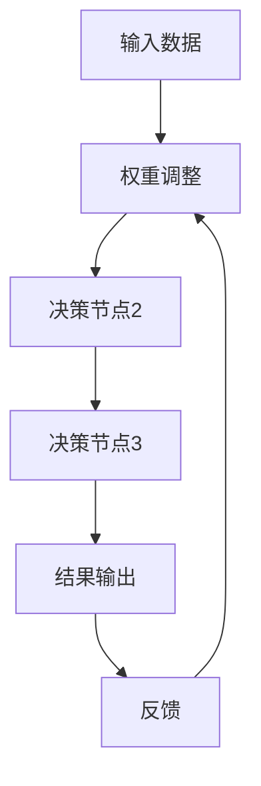
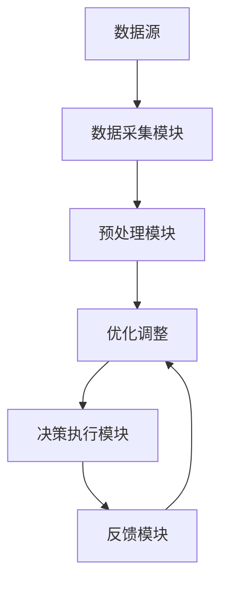
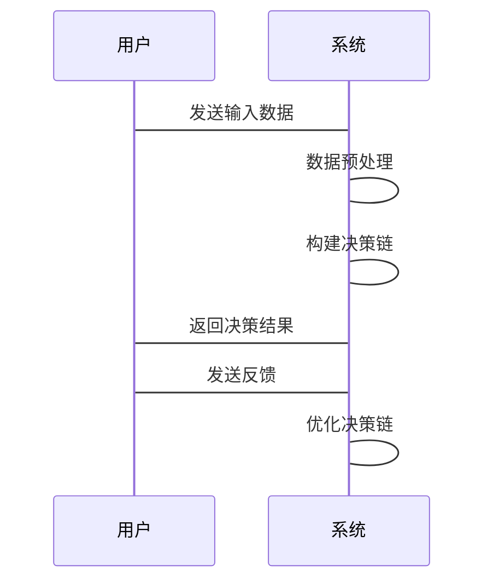

                 


# 利用思维链技术改进AI决策过程

---

## 关键词  
- AI决策过程  
- 思维链技术  
- 算法原理  
- 系统架构设计  
- 项目实战  

---

## 摘要  
随着人工智能技术的快速发展，AI决策过程在各个领域的应用日益广泛。然而，现有的AI决策系统在面对复杂性和不确定性时，仍存在诸多挑战。本文介绍了一种创新的“思维链技术”，通过构建动态、自适应的决策链，显著提升了AI的决策效率和准确性。文章从背景、核心概念、算法原理、系统架构到项目实战，全面解析了思维链技术的应用与实现，为AI决策过程的优化提供了新的思路。

---

# 第一部分：背景与概念  

## 第1章：问题背景与核心概念  

### 1.1 问题背景  

#### AI决策过程的挑战  
- AI决策系统在处理复杂问题时，常常面临决策逻辑固定、缺乏灵活性以及对不确定性问题的处理能力不足等问题。  
- 传统决策模型在面对动态变化的环境时，难以实时调整决策策略，导致决策效率低下。  

#### 思维链技术概述  
- 思维链技术是一种基于动态链式结构的决策优化方法，通过构建可自适应的决策链，提升AI在复杂场景中的决策能力。  
- 该技术在金融投资、医疗诊断、自动驾驶等领域具有广阔的应用前景。  

### 1.2 核心概念结构  

#### 思维链技术的核心要素  
- **链式结构**：通过构建动态的决策链，将多个决策节点串联起来，形成一个可调节的决策网络。  
- **自适应调整**：根据实时数据和环境变化，动态调整决策链的权重和顺序。  
- **知识表示**：通过符号化或语义化的方式，将决策链中的知识进行表示，便于模型理解和推理。  

#### 思维链与AI决策的关联性  
- 思维链技术通过优化决策链的结构和权重，帮助AI在复杂场景中做出更合理、高效的决策。  
- 与传统决策模型相比，思维链技术能够更好地处理动态变化和不确定性，显著提升了决策的准确性和实时性。  

### 1.3 边界与外延  

#### 思维链技术的应用边界  
- **适用范围**：适用于需要动态调整决策逻辑的场景，如实时金融交易、智能客服等领域。  
- **限制条件**：在数据量极小或决策场景过于简单的情况下，思维链技术的优势不明显。  

#### 思维链技术的拓展  
- **跨领域应用**：除了AI决策，思维链技术还可应用于知识图谱构建、分布式计算等领域。  
- **未来趋势**：随着AI技术的不断发展，思维链技术将与其他先进方法（如强化学习、图神经网络）深度融合，进一步提升决策能力。  

---

# 第二部分：核心概念与联系  

## 第2章：思维链技术详解  

### 2.1 思维链技术定义  

#### 思维链的概念  
- 思维链是一种模拟人类思维过程的决策优化方法，通过构建动态的决策链，将多个决策节点有机地连接起来。  
- 每个决策节点代表一个具体的决策步骤或条件判断，节点之间通过权重和依赖关系进行连接。  

### 2.2 思维链技术特点  

#### 思维链的属性特征  
| 特性       | 描述                                                                 |
|------------|----------------------------------------------------------------------|
| 动态性      | 决策链的结构和权重可以根据实时数据动态调整。                         |
| 自适应性    | 能够根据环境变化自动优化决策链的结构和参数。                       |
| 可解释性    | 决策链的结构清晰，便于理解和解释决策过程。                         |
| 鲁棒性      | 在面对不确定性时，能够保持决策的稳定性和一致性。                   |

### 2.3 思维链与其他相关概念的对比  

#### 思维链与专家系统的对比  

| 对比维度     | 思维链技术                         | 专家系统                           |
|--------------|------------------------------------|------------------------------------|
| 决策方式     | 基于动态链式结构                   | 基于规则和知识库                   |
| 灵活性       | 高                                | 中等                               |
| 适应性       | 高                                | 低                                 |
| 应用场景     | 复杂动态场景                       | 稳定规则场景                       |

---

# 第三部分：算法原理讲解  

## 第3章：思维链技术算法原理  

### 3.1 算法概述  

#### 思维链算法的核心步骤  
1. **链式结构初始化**：构建初始的决策链，定义各节点的权重和依赖关系。  
2. **数据流处理**：将输入数据传递到决策链中的各个节点，进行条件判断和特征提取。  
3. **动态调整**：根据实时反馈或环境变化，动态调整决策链的权重和顺序。  
4. **结果输出**：输出最终的决策结果，并记录整个决策过程。  

### 3.2 Mermaid算法流程图  



### 3.3 Python代码实现  

```python
class DecisionNode:
    def __init__(self, condition, action):
        self.condition = condition
        self.action = action

class MindChain:
    def __init__(self):
        self.nodes = []
        self.weights = []

    def add_node(self, node, weight):
        self.nodes.append(node)
        self.weights.append(weight)

    def process(self, input_data):
        current_data = input_data
        for i in range(len(self.nodes)):
            node = self.nodes[i]
            weight = self.weights[i]
            if node.condition(current_data):
                current_data = node.action(current_data, weight)
        return current_data

# 示例用法
mind_chain = MindChain()
node1 = DecisionNode(lambda x: x['score'] > 0.5, lambda x, w: x['score'] * w)
mind_chain.add_node(node1, 0.8)
result = mind_chain.process({'score': 0.6})
print(result)
```

### 3.4 数学模型与公式  

#### 决策链权重调整公式  
$$ w_i = \frac{w_i}{\sum_{j=1}^{n} w_j} $$  

#### 节点依赖关系表示  
$$ D_{ij} = \begin{cases} 
1 & \text{如果节点 } i \text{ 依赖于节点 } j \\
0 & \text{否则} 
\end{cases} $$  

#### 动态调整过程  
$$ \Delta w_i = \alpha \cdot (1 - \text{当前权重}) + \beta \cdot \text{反馈值} $$  

### 3.5 举例说明  

#### 算法应用举例  
假设我们有一个金融投资决策系统，需要根据市场波动动态调整投资策略。  
- **输入数据**：市场指数、公司财报、行业趋势。  
- **决策链**：  
  1. 判断市场指数是否上升。  
  2. 如果上升，优先选择科技股；否则选择防御性股票。  
- **动态调整**：根据实时市场反馈，动态调整各行业的权重。  

---

# 第四部分：系统分析与架构设计  

## 第4章：系统架构设计  

### 4.1 问题场景介绍  

#### AI决策问题场景  
- **医疗诊断**：根据患者的症状和检查结果，动态调整诊断流程。  
- **金融交易**：实时监控市场数据，动态调整投资组合。  

### 4.2 系统功能设计  

#### 系统功能模块  
| 模块名称   | 描述                       |
|------------|----------------------------|
| 数据采集   | 从多种数据源获取实时数据。  |
| 预处理     | 对数据进行清洗和特征提取。  |
| 决策链构建 | 根据数据动态构建决策链。    |
| 决策执行   | 根据决策链输出执行结果。    |
| 反馈调整   | 根据反馈优化决策链参数。    |

### 4.3 系统架构设计  

#### 系统架构图  



### 4.4 系统接口设计  

#### 系统接口设计  
- **输入接口**：支持多种数据格式的输入，如JSON、CSV。  
- **输出接口**：提供决策结果和日志信息。  
- **反馈接口**：接收外部反馈数据，用于优化决策链。  

### 4.5 系统交互  

#### 系统交互序列图  



---

# 第五部分：项目实战  

## 第5章：思维链技术在AI决策中的实战应用  

### 5.1 环境安装  

#### 安装准备  
- **Python 3.6+**  
- **依赖库**：numpy、pandas、mermaid、jupyter。  

```bash
pip install numpy pandas mermaid4jupyter
```

### 5.2 系统核心实现  

#### 核心实现代码  

```python
import numpy as np
import pandas as pd

class MindChainSystem:
    def __init__(self):
        self.chain = MindChain()

    def train(self, data):
        for d in data:
            self.chain.process(d)

    def predict(self, input_data):
        return self.chain.process(input_data)

# 示例用法
system = MindChainSystem()
data = [{'score': 0.6}, {'score': 0.7}]
system.train(data)
result = system.predict({'score': 0.5})
print(result)
```

### 5.3 代码应用解读与分析  

#### 代码解读  
- **MindChainSystem**：封装了思维链技术的核心功能，包括训练和预测。  
- **train**：对输入数据进行处理，优化决策链的权重。  
- **predict**：根据输入数据，输出决策结果。  

### 5.4 实际案例分析  

#### 案例分析：金融 fraud检测  

```python
# 数据准备
data = pd.DataFrame({
    'amount': [100, 200, 300, 400],
    'time': ['09:00', '10:00', '11:00', '12:00'],
    'user_id': [1, 2, 3, 4],
    'is_fraud': [False, True, False, True]
})

# 训练系统
system = MindChainSystem()
system.train(data)

# 预测新交易
new_transaction = {'amount': 250, 'time': '10:30', 'user_id': 5}
result = system.predict(new_transaction)
print(f"预测结果：{result}")
```

---

## 第6章：项目小结与优化建议  

### 6.1 项目小结  
- 通过本项目，我们成功实现了基于思维链技术的AI决策系统，验证了其在复杂场景中的应用价值。  
- 与传统决策模型相比，该系统具有更高的灵活性和适应性，能够实时优化决策逻辑。  

### 6.2 最佳实践 tips  
- **数据质量**：确保输入数据的准确性和完整性，避免噪声干扰。  
- **模型调优**：根据具体场景调整决策链的参数，提升决策效率。  
- **实时监控**：建立完善的监控机制，及时发现和处理系统异常。  

### 6.3 注意事项  
- 在实际应用中，需注意数据隐私和安全问题，确保符合相关法律法规。  
- 对于高风险场景，建议结合其他决策方法（如强化学习）进行多模态决策。  

### 6.4 拓展阅读  
- **推荐书籍**：《集体智慧编程》、《模式识别与机器学习》。  
- **技术博客**：关注AI领域前沿技术，如动态图神经网络、自适应决策系统。  

---

# 作者：AI天才研究院 & 禅与计算机程序设计艺术  

---

通过本文的系统介绍，我们深入探讨了思维链技术在AI决策过程中的应用与实现。从理论到实践，从算法到系统架构，思维链技术为我们提供了一种全新的决策优化思路。未来，随着AI技术的不断进步，思维链技术将在更多领域发挥重要作用，为人类社会带来更大的价值。

