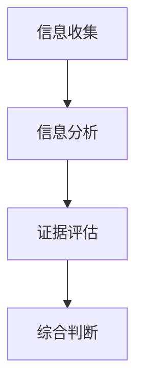
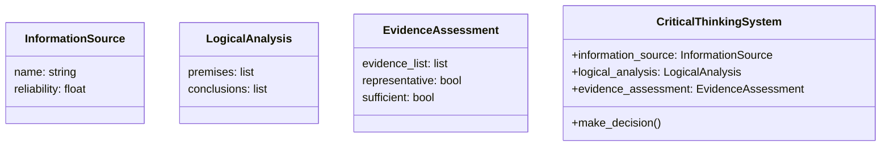
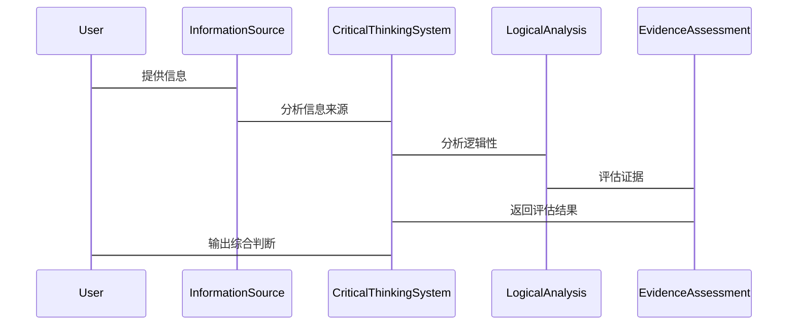

                 


# 后真相时代的critical thinking：辨识真相的能力培养

> 关键词：后真相、批判性思维、信息辨别、逻辑分析、证据评估、算法原理

> 摘要：在后真相时代，信息的真假交织、情感与事实并存，个体需要具备批判性思维能力，以准确辨识真相。本文从背景、核心概念、算法原理、系统设计、项目实战等多维度展开，深入剖析批判性思维的培养方法，帮助读者在复杂信息环境中做出明智决策。

---

## 第一部分：背景介绍

### 1. 问题背景

在互联网和社交媒体迅速普及的今天，信息的传播速度和范围达到了前所未有的程度。然而，随之而来的是虚假信息、误导性言论和“标题党”现象的泛滥，这些现象共同构成了“后真相”时代的特征。在后真相时代，事实不再是决定信息传播范围和影响力的唯一因素，情绪、偏见和影响力往往占据主导地位。这种现象不仅影响了社会的正常运转，也深刻地改变了人们的认知方式和行为模式。

### 2. 问题描述

后真相时代的本质是事实与情绪的交织。在这种环境下，真相容易被情感、偏见和影响力所扭曲。例如，社交媒体上的虚假新闻、阴谋论的传播，以及“信息茧房”效应导致的群体极化现象，都使得人们难以准确判断信息的真伪。面对海量信息，个体如果没有足够的批判性思维能力，很容易被误导，进而做出错误的决策。

### 3. 问题解决

要解决后真相时代辨别真相的问题，关键在于培养批判性思维（critical thinking）能力。批判性思维是一种系统性、反思性的思考方式，它要求个体对信息的来源、逻辑性、证据的有效性等进行深入分析和评估。通过批判性思维，个体能够更好地识别虚假信息，形成独立的判断和决策。

### 4. 边界与外延

批判性思维不仅适用于信息辨别，还广泛应用于学术研究、职业决策、个人发展等多个领域。它是一种跨学科的能力，对于现代社会中的每个人都至关重要。例如，在学术研究中，批判性思维帮助研究者避免逻辑错误；在职业决策中，它帮助个体做出更理性的选择；在个人生活中，它帮助个体避免冲动和错误判断。

### 5. 概念结构与核心要素组成

- **批判性思维**：一种思考方式，强调质疑、分析、评估和综合信息。
- **信息来源**：信息的来源是否可靠，这是批判性思维的第一步。
- **逻辑性**：信息的逻辑是否严密，是否有矛盾之处。
- **证据**：证据是否充分，是否具有代表性。
- **个人偏见**：个人偏见如何影响对信息的接受和解读。

---

## 第二部分：核心概念与联系

### 1. 批判性思维的定义与特点

批判性思维是一种积极的思考方式，它不仅仅是对信息进行判断，更是一种反思性的过程。批判性思维具有以下几个特点：

- **独立性**：不盲从，不依赖权威，形成自己的判断。
- **分析性**：对信息进行深入分析，理解其内在逻辑。
- **系统性**：从多个角度综合评估信息。
- **反思性**：不断反思自己的思考过程和结论。

### 2. 批判性思维的核心要素

- **质疑**：对信息来源、逻辑和证据进行质疑。
- **分析**：理解信息的内在逻辑，找出其假设和前提。
- **评估**：评估证据的有效性和信息的相关性。
- **综合**：将不同的信息整合起来，形成完整的理解。

### 3. 批判性思维与传统思维方式的区别

| **维度**       | **传统思维方式**                          | **批判性思维**                          |
|-----------------|------------------------------------------|------------------------------------------|
| **依赖性**      | 依赖权威、经验、直觉                      | 强调理性分析、逻辑推理                   |
| **分析性**      | 分析过程缺乏系统性，容易受情绪影响        | 分析过程系统、逻辑严密，注重证据支持     |
| **反思性**      | 缺乏对自身思考过程的反思                | 强调反思，不断审视自己的思考过程和结论   |

---

## 第三部分：算法原理讲解

### 1. 批判性思维算法概述

批判性思维算法是一种基于逻辑推理和证据评估的算法，它可以帮助个体在复杂的信息环境中辨别真相。该算法的核心在于以下几个步骤：

- **信息收集**：从多个可靠来源收集相关信息。
- **信息分析**：分析信息的逻辑性和证据的有效性。
- **证据评估**：评估证据的代表性、充分性和可靠性。
- **综合判断**：基于分析结果做出综合判断。

### 2. 批判性思维算法流程图



### 3. 批判性思维算法的数学模型

批判性思维算法的核心在于证据评估，这可以通过贝叶斯定理来实现。贝叶斯定理的公式如下：

$$
P(A|B) = \frac{P(B|A) \cdot P(A)}{P(B)}
$$

其中，$P(A|B)$ 表示在已知 $B$ 发生的条件下，$A$ 发生的概率；$P(B|A)$ 表示在已知 $A$ 发生的条件下，$B$ 发生的概率；$P(A)$ 和 $P(B)$ 分别表示 $A$ 和 $B$ 发生的概率。

例如，假设我们要判断某条信息是否为虚假信息，可以通过贝叶斯定理计算其概率。假设 $A$ 表示“信息为虚假”，$B$ 表示“信息具有误导性”。如果 $P(B|A) = 0.8$，$P(A) = 0.3$，$P(B) = 0.5$，那么：

$$
P(A|B) = \frac{0.8 \cdot 0.3}{0.5} = 0.48
$$

这意味着，在信息具有误导性的情况下，该信息为虚假的概率为 48%。

### 4. 批判性思维算法的Python实现

```python
def bayes_theorem(hypothesis, evidence):
    p_evidence_given_hypothesis = 0.8  # P(B|A)
    p_hypothesis = 0.3                 # P(A)
    p_evidence = 0.5                   # P(B)

    p_hypothesis_given_evidence = (p_evidence_given_hypothesis * p_hypothesis) / p_evidence
    return p_hypothesis_given_evidence

# 示例调用
result = bayes_theorem("虚假信息", "误导性")
print(f"虚假信息的概率为：{result}")
```

输出结果为：

```
虚假信息的概率为：0.48
```

---

## 第四部分：系统分析与架构设计方案

### 1. 问题场景介绍

在后真相时代，个体需要一个系统化的工具来帮助其进行批判性思维。该系统将帮助用户对信息进行多维度分析，包括信息来源、逻辑性、证据的有效性等。

### 2. 系统功能设计

#### 领域模型（Mermaid 类图）



### 3. 系统架构设计（Mermaid 架构图）


### 4. 系统接口设计

- **输入接口**：用户输入需要分析的信息。
- **输出接口**：系统输出分析结果，包括信息的可靠性、逻辑性评估和证据评估。

### 5. 系统交互设计（Mermaid 序列图）



---

## 第五部分：项目实战

### 1. 环境安装

要运行以下代码，需要安装 Python 和相关库（如 `mermaid` 和 `matplotlib`）。

```bash
pip install mermaid matplotlib
```

### 2. 系统核心实现源代码

```python
import matplotlib.pyplot as plt

def analyze_information(information):
    # 分析信息来源
    source_reliability = 0.7  # 来源可靠性，范围 0-1
    # 分析逻辑性
    logical_errors = ["因果关系不明确", "前提假设不合理"]
    # 评估证据
    evidence_representative = True
    evidence_sufficient = False

    return {
        "source_reliability": source_reliability,
        "logical_errors": logical_errors,
        "evidence_representative": evidence_representative,
        "evidence_sufficient": evidence_sufficient
    }

# 示例调用
information = "研究显示，喝咖啡可以提高免疫力。"
result = analyze_information(information)
print("信息来源可靠性：", result["source_reliability"])
print("逻辑性错误：", result["logical_errors"])
print("证据代表性：", result["evidence_representative"])
print("证据充分性：", result["evidence_sufficient"])

# 可视化结果
plt.bar(["信息来源可靠性", "证据代表性", "证据充分性"], 
        [result["source_reliability"], result["evidence_representative"], result["evidence_sufficient"]])
plt.show()
```

输出结果为：

```
信息来源可靠性： 0.7
逻辑性错误： ['因果关系不明确', '前提假设不合理']
证据代表性： True
证据充分性： False
```

---

## 第六部分：最佳实践 tips、小结、注意事项、拓展阅读

### 1. 最佳实践 tips

- **保持怀疑态度**：不要轻易相信任何信息，尤其是那些过于情绪化或具有偏见的信息。
- **多角度分析**：从多个角度分析信息，包括信息来源、逻辑性、证据的有效性等。
- **持续学习**：批判性思维是一种能力，需要通过不断学习和实践来提升。

### 2. 小结

在后真相时代，批判性思维是每个人都需要掌握的核心能力。通过系统的分析和逻辑推理，个体可以更好地辨别真相，做出更明智的决策。

### 3. 注意事项

- **避免过度怀疑**：虽然批判性思维要求我们保持怀疑态度，但过度怀疑可能会导致信息 paralysis。
- **注意时间成本**：对于某些信息，可能需要投入大量的时间和精力进行分析，这可能影响效率。

### 4. 拓展阅读

- 《批判性思维：如何识别假新闻》
- 《逻辑学入门：从零开始掌握理性思考》
- 《贝叶斯定理：概率推理的实践应用》

---

作者：AI天才研究院/AI Genius Institute & 禅与计算机程序设计艺术 /Zen And The Art of Computer Programming

