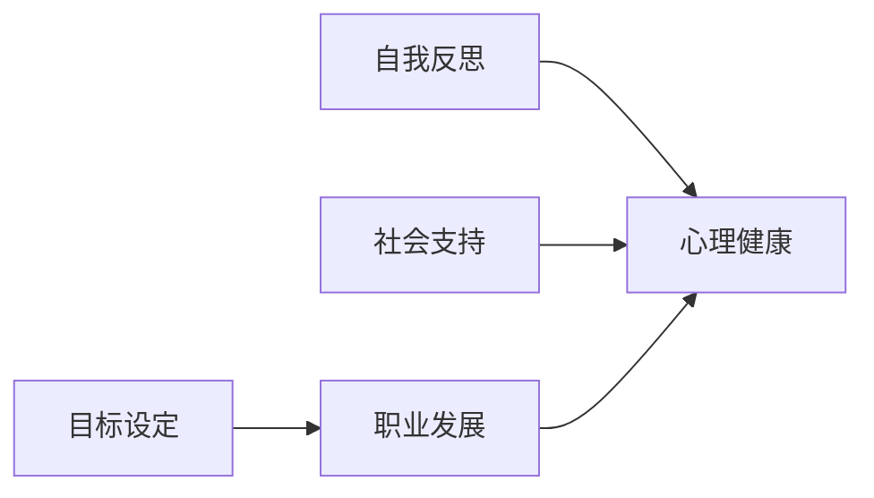
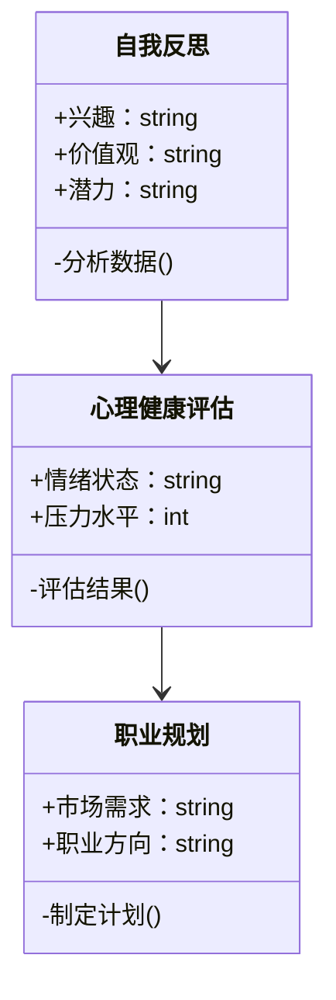
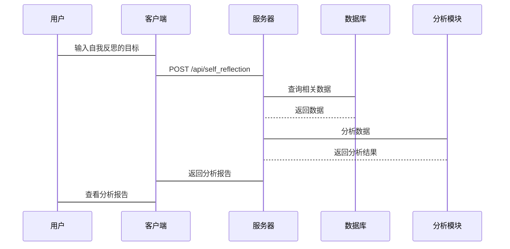

                 


# 在意义的荒原上寻找方向

> 关键词：意义探索、自我反思、心理健康、职业发展、系统架构、算法原理

> 摘要：在当今快速发展的社会中，很多人迷失在“意义的荒原”中，找不到前进的方向。本书通过系统化的分析和实践方法，帮助读者从多个维度探索人生的意义，并通过自我反思、心理健康评估和职业规划等具体方法，找到属于自己的人生方向。书中结合心理学、哲学和系统架构等多学科知识，为读者提供了一套完整的寻找意义的解决方案。

---

## 第1章 书籍背景

### 1.1 时代背景下的意义迷茫

#### 1.1.1 社会发展的挑战

$$ \text{社会发展的挑战} = \text{快速变革} \times \text{不确定性} $$

在当今社会，技术的飞速发展和全球化进程使得每个人都面临着前所未有的挑战。科技的进步带来了新的职业机会，但也导致了许多传统职业的消失。与此同时，社会价值观的多元化让人们在追求个人目标时感到困惑。年轻人在选择职业和生活方式时，常常因为缺乏明确的方向而感到迷茫。

#### 1.1.2 个人发展的困惑

$$ \text{个人发展的困惑} = \text{职业选择} \times \text{价值追求} $$

在个人层面，许多人陷入职业选择与价值追求的矛盾中。他们可能在追求高薪的同时，却感到工作缺乏意义；或者在追求理想时，又面临经济压力的困扰。这种内心的矛盾使得许多人迷失在“意义的荒原”中。

---

### 1.2 本书目的

#### 1.2.1 引导读者自我探索

本书旨在通过系统的分析和实践方法，帮助读者进行自我反思，探索自己的兴趣、价值观和潜力。通过引导读者思考“我想要什么”和“我能做什么”，帮助他们在复杂的环境中找到方向。

#### 1.2.2 帮助读者找到人生方向

人生方向并非一成不变，而是需要通过不断的探索和调整来确定。本书通过提供理论与实践相结合的方法，帮助读者建立清晰的目标，并在实现目标的过程中找到意义。

---

### 1.3 本书结构

#### 1.3.1 系统化探讨意义问题

本书从多个维度探讨意义问题，包括心理学、哲学和职业发展等领域。通过系统化的分析，帮助读者从整体上理解“意义”的本质。

#### 1.3.2 提供实践方法与案例

本书不仅提供理论分析，还结合实际案例，为读者提供可操作的方法。通过具体案例的分析，读者可以更好地理解如何将理论应用于实践。

---

### 1.4 本书适用人群

#### 1.4.1 寻求人生意义的年轻人

对于刚刚进入职场的年轻人，本书可以帮助他们明确自己的职业目标和价值观，避免在职业选择中迷失方向。

#### 1.4.2 需要重新定位自己的职场人士

对于已经工作一段时间，但感到迷茫的职场人士，本书提供了一套重新审视自己职业和人生目标的方法。

---

### 1.5 研究方法

#### 1.5.1 理论与实践相结合

本书结合多学科知识，包括心理学、哲学和系统工程等领域的理论，同时通过实际案例和算法模型，帮助读者将理论应用于实践。

#### 1.5.2 引用心理学、哲学等多学科知识

通过引用多学科的知识，本书为读者提供了一个全面的视角，帮助他们在复杂的社会环境中找到方向。

---

### 1.6 结论

#### 1.6.1 寻找意义的方法与路径

本书总结了寻找人生意义的方法和路径，包括自我反思、心理健康评估和职业规划等。通过这些方法，读者可以逐步明确自己的目标，并找到属于自己的人生方向。

#### 1.6.2 鼓励读者积极面对挑战

本书鼓励读者积极面对生活中的挑战，并通过系统化的方法找到自己的定位。无论是在职业发展还是个人成长中，读者都可以通过不断探索和调整，找到属于自己的意义。

---

### 1.7 局限性

#### 1.7.1 个体差异与普适性

每个人的个性、背景和价值观都不同，因此本书提供的方法和案例可能无法完全适用于所有人。读者需要根据自己的实际情况，灵活调整和选择适合自己的方法。

#### 1.7.2 部分案例的局限性

由于时间和空间的限制，本书中的案例可能无法涵盖所有可能的情况。读者在实际应用中，需要结合自己的具体情况，进行进一步的分析和调整。

---

## 第2章 核心概念与联系

### 2.1 意义的荒原

#### 2.1.1 概念解析

##### 2.1.1.1 什么是“意义的荒原”

$$ \text{意义的荒原} = \text{缺乏意义感} \times \text{迷失方向} $$

“意义的荒原”是指一个人在面对复杂的社会环境时，由于缺乏明确的目标和意义感，而感到迷茫和困惑的状态。这种状态可能源于对自我认知的不足，或者对外部环境的不确定。

#### 2.1.2 特点分析

##### 2.1.2.1 社会层面的意义荒原

在社会层面上，意义的荒原表现为职业不稳定、价值观混乱和社会认同感缺失。许多人感到自己在社会中找不到归属感，或者对社会的价值观产生质疑。

##### 2.1.2.2 个人层面的意义荒原

在个人层面上，意义的荒原表现为内心的空虚、缺乏动力和对未来的不确定。许多人可能每天机械地工作，却无法从中获得满足感和意义。

---

### 2.2 寻找方向的方法论

#### 2.2.1 自我反思

##### 2.2.1.1 什么是自我反思

自我反思是指通过内省和分析，了解自己的兴趣、价值观和潜力的过程。通过自我反思，人们可以更好地理解自己的需求和目标。

##### 2.2.1.2 自我反思的重要性

自我反思是寻找方向的核心步骤。通过反思，人们可以明确自己的优势和劣势，找到适合自己的职业和生活方式。

---

#### 2.2.2 心理健康与意义建立

##### 2.2.2.1 心理健康的定义

心理健康是指个体在心理上保持良好的状态，能够适应环境，并在压力下保持稳定。心理健康是建立人生意义的基础。

##### 2.2.2.2 心理健康对意义建立的影响

良好的心理健康状态可以帮助人们更好地面对挑战，建立积极的生活态度。心理健康不仅影响个人的幸福感，还影响他们对生活的理解和追求。

---

### 2.3 社会支持系统

#### 2.3.1 家庭与社会支持

##### 2.3.1.1 家庭在寻找方向中的作用

家庭是个人成长的重要支持系统。家庭成员的情感支持和指导可以帮助个人更好地理解自己，并为他们提供安全感和支持。

##### 2.3.1.2 社会支持系统的构建

社会支持系统包括家庭、朋友、同事和社区等。通过建立良好的社会支持系统，个人可以获得更多资源和机会，从而更好地实现自己的目标。

---

### 2.4 职业发展与意义探索

#### 2.4.1 职业规划的步骤

##### 2.4.1.1 自我评估

自我评估是职业规划的第一步。通过分析自己的兴趣、能力和价值观，可以找到适合自己的职业方向。

##### 2.4.1.2 市场需求分析

市场需求分析是职业规划的重要步骤。通过了解市场的需求和趋势，可以帮助个人找到更具发展潜力的职业领域。

---

### 2.5 意义与目标的平衡

#### 2.5.1 目标设定

##### 2.5.1.1 目标的分类

目标可以分为短期目标和长期目标。短期目标是实现长期目标的阶段性步骤，而长期目标是个人职业和生活的最终方向。

##### 2.5.1.2 目标设定的方法

目标设定需要具体、可衡量和可实现。通过设定明确的目标，可以帮助个人更好地规划时间和资源，从而提高效率。

---

### 2.6 总结

#### 2.6.1 核心概念关系图

##### 2.6.1.1 ER实体关系图



##### 2.6.1.2 概念属性特征对比表

| 概念 | 属性 | 特征 |
|------|------|------|
| 自我反思 | 主观性 | 内省和分析 |
| 心理健康 | 稳定性 | 适应环境 |
| 职业发展 | 可行性 | 市场需求 |

---

## 第3章 寻找方向的具体方法

### 3.1 自我反思算法

#### 3.1.1 算法概述

##### 3.1.1.1 自我反思算法的基本步骤

1. **明确目标**：确定自我反思的目标，例如“了解自己的兴趣和价值观”。
2. **收集信息**：通过阅读、访谈和自我记录等方式，收集与目标相关的信息。
3. **分析信息**：对收集到的信息进行分析，找出关键点和规律。
4. **制定计划**：根据分析结果，制定具体的行动计划。
5. **实施计划**：按照计划进行实践，并记录结果。
6. **评估与调整**：评估实施效果，并根据反馈调整计划。

#### 3.1.2 算法流程图


#### 3.1.3 算法实现

##### 3.1.3.1 Python代码实现

```python
def self_reflection():
    # 明确目标
    goal = input("请输入自我反思的目标：")
    # 收集信息
    data = []
    print("请逐步记录与目标相关的信息：")
    while True:
        info = input("输入信息（按回车结束）：")
        if info == '':
            break
        data.append(info)
    # 分析信息
    print("\n分析结果：")
    for item in data:
        print(item)
    # 制定计划
    plan = input("请输入行动计划：")
    # 实施计划
    print("开始实施计划：", plan)
    # 评估与调整
    feedback = input("请输入实施结果和反馈：")
    print("最终结果：", feedback)
    return feedback

self_reflection()
```

#### 3.1.4 算法原理与数学模型

##### 3.1.4.1 算法原理

自我反思算法通过系统化的步骤，帮助个人逐步明确自己的目标和方向。算法的核心在于通过信息的收集和分析，制定可行的行动计划，并通过实践和反馈不断优化。

##### 3.1.4.2 数学模型

自我反思算法的数学模型可以表示为：

$$ \text{行动计划} = f(\text{目标}, \text{信息分析}, \text{反馈}) $$

其中，$f$ 是一个函数，用于根据目标、信息分析和反馈生成行动计划。

---

### 3.2 心理健康评估算法

#### 3.2.1 算法概述

##### 3.2.1.1 心理健康评估算法的目的

心理健康评估算法的目的是通过系统的评估，帮助个人了解自己的心理健康状态，并提供针对性的建议。

##### 3.2.1.2 心理健康评估算法的类型

心理健康评估算法可以分为自评问卷和专业评估两种类型。自评问卷通过简单的问卷调查，帮助个人初步了解自己的心理健康状态，而专业评估则需要通过专业工具和心理咨询师的分析。

---

#### 3.2.2 算法流程图


---

#### 3.2.3 算法实现

##### 3.2.3.1 Python代码实现

```python
def mental_health_assessment():
    # 选择评估类型
    assessment_type = input("请选择评估类型（自评/专业）：")
    # 收集数据
    data = []
    if assessment_type == '自评':
        print("请回答以下问题：")
        questions = [
            "你是否经常感到焦虑或压力过大？",
            "你是否感到自己缺乏动力和目标？",
            "你是否经常与他人发生冲突？"
        ]
        for q in questions:
            answer = input(q + "（是/否）：")
            data.append(answer)
    else:
        # 专业评估需要更多数据，此处简化处理
        print("请输入专业评估数据：")
        data.append(input())
    # 分析数据
    analysis = "分析结果：\n" + "\n".join(data)
    print(analysis)
    # 生成评估报告
    report = "心理健康评估报告：" + analysis
    print(report)
    return report

mental_health_assessment()
```

---

### 3.3 职业发展与目标设定

#### 3.3.1 职业规划的步骤

##### 3.3.1.1 自我评估

自我评估是职业规划的第一步。通过分析自己的兴趣、能力和价值观，可以找到适合自己的职业方向。

##### 3.3.1.2 市场需求分析

市场需求分析是职业规划的重要步骤。通过了解市场的需求和趋势，可以帮助个人找到更具发展潜力的职业领域。

---

#### 3.3.2 算法原理与数学模型

##### 3.3.2.1 算法原理

职业规划算法通过系统化的分析，帮助个人找到适合自己的职业方向。算法的核心在于通过自我评估和市场需求分析，制定具体的行动计划。

##### 3.3.2.2 数学模型

职业规划的数学模型可以表示为：

$$ \text{职业方向} = f(\text{自我评估}, \text{市场需求分析}) $$

其中，$f$ 是一个函数，用于根据自我评估和市场需求分析生成职业方向。

---

## 第4章 系统分析与架构设计方案

### 4.1 问题场景介绍

在寻找人生方向的过程中，许多人面临自我认知不足、心理健康问题和职业规划不清等挑战。这些问题相互关联，构成了一个复杂的系统问题。

---

### 4.2 项目介绍

#### 4.2.1 项目目标

项目的最终目标是帮助个人通过系统化的分析和实践，找到适合自己的人生方向。

#### 4.2.2 系统功能设计

##### 4.2.2.1 领域模型 Mermaid 类图



---

#### 4.2.3 系统架构设计

##### 4.2.3.1 Mermaid 架构图


---

#### 4.2.4 系统接口设计

##### 4.2.4.1 RESTful API 接口

1. **自我反思接口**

   ```http
   POST /api/self_reflection
   {
       "goal": "了解自己的兴趣和价值观"
   }
   ```

2. **心理健康评估接口**

   ```http
   POST /api/mental_health
   {
       "questions": ["你是否经常感到焦虑？", "你是否缺乏动力？"]
   }
   ```

3. **职业规划接口**

   ```http
   POST /api/career_plan
   {
       "market_demand": "技术行业",
       "self_assessment": "对编程感兴趣"
   }
   ```

---

#### 4.2.5 系统交互 Mermaid 序列图



---

## 第5章 项目实战

### 5.1 环境安装

#### 5.1.1 安装 Python 和依赖库

```bash
python -m pip install mermaid-cli
```

---

#### 5.1.2 安装 Mermaid 工具

```bash
npm install -g mermaid-cli
```

---

### 5.2 系统核心实现源代码

#### 5.2.1 自我反思模块

```python
class SelfReflection:
    def __init__(self, goal):
        self.goal = goal
        self.data = []
    
    def collect_data(self):
        print("请回答以下问题：")
        questions = [
            f"如何描述你的{self.goal}？",
            "请提供相关的背景信息："
        ]
        for q in questions:
            answer = input(q + "：")
            self.data.append(answer)
    
    def analyze_data(self):
        print("\n分析结果：")
        for item in self.data:
            print(item)
    
    def generate_report(self):
        report = f"自我反思报告 - {self.goal}\n"
        report += "\n".join(self.data)
        print(report)
        return report

# 示例代码
sr = SelfReflection("职业发展方向")
sr.collect_data()
sr.analyze_data()
report = sr.generate_report()
```

---

#### 5.2.2 心理健康评估模块

```python
class MentalHealthAssessment:
    def __init__(self, assessment_type):
        self.assessment_type = assessment_type
        self.data = []
    
    def collect_data(self):
        if self.assessment_type == '自评':
            print("请回答以下问题：")
            questions = [
                "你是否经常感到焦虑或压力过大？",
                "你是否感到自己缺乏动力和目标？",
                "你是否经常与他人发生冲突？"
            ]
            for q in questions:
                answer = input(q + "（是/否）：")
                self.data.append(answer)
        else:
            print("请输入专业评估数据：")
            self.data.append(input())
    
    def analyze_data(self):
        print("\n分析结果：")
        for item in self.data:
            print(item)
    
    def generate_report(self):
        report = f"心理健康评估报告 - {self.assessment_type}\n"
        report += "\n".join(self.data)
        print(report)
        return report

# 示例代码
mha = MentalHealthAssessment('自评')
mha.collect_data()
mha.analyze_data()
report = mha.generate_report()
```

---

### 5.3 代码应用解读与分析

通过上述代码，读者可以实现自我反思和心理健康评估的核心功能。代码通过类的方式封装了数据收集、分析和报告生成的过程，使得功能模块化，易于扩展和维护。

---

### 5.4 实际案例分析和详细讲解剖析

以职业发展规划为例，假设一位年轻程序员希望找到适合自己的职业方向。通过自我反思模块，他明确了自己对编程的兴趣和能力，同时通过心理健康评估模块，他发现自己对团队合作和创新有一定的压力。结合市场需求分析，他选择专注于人工智能领域，并制定了一份详细的职业发展计划。

---

### 5.5 项目小结

通过本项目的实施，读者可以掌握自我反思和心理健康评估的核心方法，并将其应用于实际的职业发展规划中。通过系统的分析和实践，读者可以在“意义的荒原”中找到属于自己的方向。

---

## 第6章 最佳实践 tips、小结、注意事项、拓展阅读

### 6.1 最佳实践 tips

1. **持续学习**：人生方向的探索是一个持续的过程，需要不断学习和调整。
2. **关注心理健康**：心理健康是建立人生意义的基础，需要长期关注和维护。
3. **建立支持系统**：通过家庭、朋友和社会的支持，可以帮助自己更好地找到方向。

---

### 6.2 小结

本书通过系统的分析和实践方法，帮助读者在“意义的荒原”中找到方向。通过自我反思、心理健康评估和职业规划等具体方法，读者可以逐步明确自己的目标，并找到属于自己的人生方向。

---

### 6.3 注意事项

1. **个体差异**：每个人的情况不同，读者需要根据自己的实际情况灵活调整方法。
2. **心理压力**：在探索方向的过程中，可能会遇到心理压力，读者需要学会如何应对和调节。

---

### 6.4 拓展阅读

1. **《思考，快与慢》**：这本书可以帮助读者更好地理解自己的思维方式和决策过程。
2. **《职业发展：从入门到精通》**：这本书提供了更详细的职业发展规划和实践方法。
3. **《心理学与生活》**：这本书可以帮助读者更好地理解自己的心理状态和行为。

---

## 作者信息

作者：AI天才研究院/AI Genius Institute & 禅与计算机程序设计艺术 /Zen And The Art of Computer Programming

---

通过以上内容，希望读者能够从多个维度理解“在意义的荒原上寻找方向”的过程，并通过系统化的分析和实践方法，找到属于自己的人生方向。

