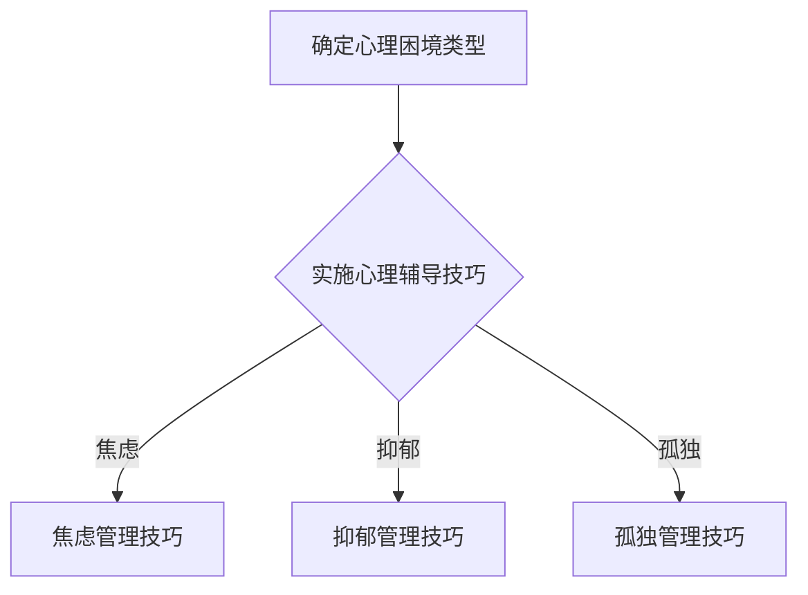
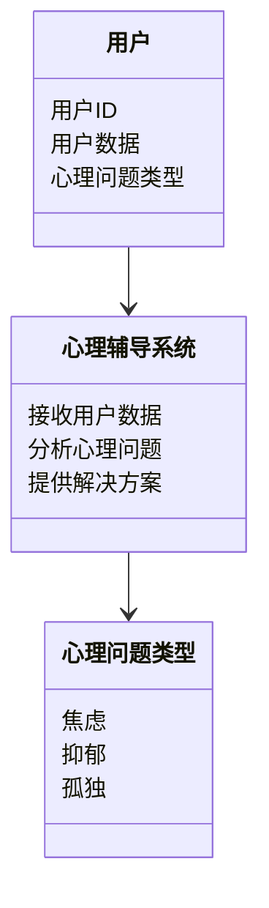
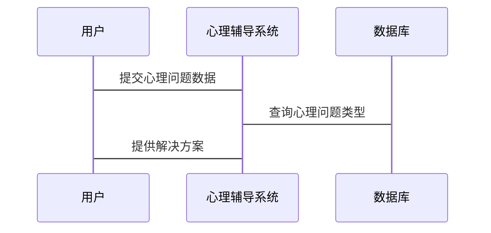

                 


# 存在感缺失：现代人的心理困境及其超越

> 关键词：存在感缺失、心理困境、心理辅导技巧、人际关系改善策略、社会参与

> 摘要：现代社会中，人们普遍面临存在感缺失的问题，表现为被忽视、孤独和无价值感。本文从技术化的角度，深入分析存在感缺失的成因、表现及其与心理困境的关系。通过心理辅导技巧、人际关系改善策略和社会参与建议，探讨如何帮助个体重建自我价值感，提升生活质量。文章结合算法原理、系统架构设计和实际案例，提出了一套综合解决方案，为现代人应对心理困境提供了实践指导。

---

## 第一部分：问题背景

### 1. 问题背景

在现代社会，科技的进步带来了前所未有的便利，但同时也让许多人陷入了心理困境。互联网和社交媒体的普及，使得人们的注意力被分散，真实的人际关系逐渐被虚拟连接替代。许多人感到自己在数字世界中失去了存在感，他们的生活被虚拟社交所主导，而忽视了现实中的人际互动和自我价值的实现。

存在感缺失是一种心理状态，表现为个体在现实生活中感受到的被忽视、孤独和无价值感。这种感受可能源于多种因素，包括社交网络的过度依赖、人际关系的疏离、自我认同的缺失等。随着科技的发展，这些问题在现代社会中越来越普遍，甚至可能导致严重的心理健康问题，如焦虑、抑郁等。

### 2. 问题描述

存在感缺失的核心在于个体无法在现实中找到自我定位和价值感。这种缺失可能源于以下几个方面：

- **社交网络的过度依赖**：人们通过社交媒体建立虚拟关系，但这种关系往往缺乏深度，导致个体在现实中感到孤独和被忽视。
- **人际关系的疏离**：现代人普遍忙于工作，缺乏时间与家人和朋友建立深厚的情感联系，导致人际关系疏远。
- **自我认同的缺失**：在快节奏的生活中，许多人迷失了自我，无法找到自己的价值和目标。

这些问题不仅影响了个体的心理健康，还可能导致社会问题，如家庭矛盾、工作效率下降等。

### 3. 问题解决

本书旨在探讨现代人存在感缺失的心理困境，并提供切实可行的解决方法。通过心理辅导技巧、人际关系改善策略和社会参与建议，帮助读者重建自我价值感，提升生活质量。

- **心理辅导技巧**：通过心理学方法帮助个体提升自我认知和情绪管理能力。
- **人际关系改善策略**：通过改善人际关系，提升个体的存在感。
- **社会参与**：通过积极参与社会活动，增强个体的存在感。

### 4. 边界与外延

存在感缺失的问题不仅涉及个体的心理健康，还影响到家庭、社会等多个层面。因此，解决这一问题需要综合多种方法，包括心理治疗、社会支持、自我提升等。

### 5. 概念结构与核心要素组成

- **存在感缺失**：个体感受到的被忽视、孤独和无价值感。
- **心理困境**：指个体在心理上遭遇的困难，如焦虑、抑郁等。
- **心理辅导技巧**：通过心理学方法帮助个体提升自我认知和情绪管理能力。
- **人际关系改善策略**：通过改善人际关系来提升个体的存在感。
- **社会参与**：通过积极参与社会活动来增强个体的存在感。

---

## 第二部分：核心概念与联系

### 1. 存在感缺失的定义与特点

存在感缺失是指个体在现实生活中感受到的被忽视、孤独和无价值感。这种感受可能源于多种因素，如社交网络的过度依赖、人际关系的疏离、自我认同的缺失等。

### 2. 心理困境的特点与影响

心理困境包括焦虑、抑郁、孤独等。它们对个体的生活质量和心理健康产生严重影响，导致生活质量下降、心理健康问题加重。

### 3. 存在感缺失与心理困境的联系

存在感缺失和心理困境之间存在密切联系。存在感缺失可能导致心理困境，而心理困境也可能加剧存在感缺失。

### 4. 核心概念属性特征对比表格

| 概念             | 特点                                       |
|------------------|------------------------------------------|
| 存在感缺失       | 感受到的被忽视、孤独和无价值感                 |
| 心理困境         | 焦虑、抑郁、孤独等对个体生活质量和心理健康产生影响的困难 |
| 心理辅导技巧     | 提升个体自我认知和情绪管理能力的方法             |
| 人际关系改善策略 | 改善人际关系，提升个体的存在感                 |
| 社会参与         | 通过积极参与社会活动来增强个体的存在感           |

### 5. ER实体关系图架构的 Mermaid 流程图

```mermaid
erDiagram
  A[个体] ||--|{ 存在感缺失 }
  A ||--|{ 心理困境 }
  B[心理辅导技巧] ||--|{ 提升个体自我认知和情绪管理能力 }
  C[人际关系改善策略] ||--|{ 改善人际关系，提升个体的存在感 }
  D[社会参与] ||--|{ 通过积极参与社会活动来增强个体的存在感 }
```

---

## 第三部分：算法原理讲解

### 1. 心理辅导技巧的算法原理讲解

#### 1.1 算法流程图



#### 1.2 算法原理

心理辅导技巧的核心在于帮助个体识别和理解自己的心理困境，并采取相应的策略来缓解这些困境。具体算法原理如下：

- **确定心理困境类型**：通过访谈、问卷调查等方法，了解个体的心理困境类型。
- **实施心理辅导技巧**：根据心理困境类型，采用相应的心理辅导技巧。

#### 1.3 Python源代码

```python
def determine_mental_health_problem(patient_data):
    # 根据患者数据确定心理困境类型
    if 'anxiety' in patient_data:
        return 'anxiety'
    elif 'depression' in patient_data:
        return 'depression'
    elif 'loneliness' in patient_data:
        return 'loneliness'
    else:
        return 'unknown'

def implement_counseling_technique(problem_type):
    # 根据问题类型实施心理辅导技巧
    if problem_type == 'anxiety':
        return '实施焦虑管理技巧'
    elif problem_type == 'depression':
        return '实施抑郁管理技巧'
    elif problem_type == 'loneliness':
        return '实施孤独管理技巧'
    else:
        return '未知问题类型'

# 示例代码
patient_data = {'anxiety': True, 'depression': False, 'loneliness': False}
problem_type = determine_mental_health_problem(patient_data)
technique = implement_counseling_technique(problem_type)
print(f"针对 {problem_type} 的心理问题，实施 {technique}")
```

### 2. 数学公式

心理辅导技巧的实施可以通过数学模型来优化。例如，焦虑程度可以通过以下公式进行评估：

$$ anxiety\_score = a \times stress\_level + b \times negative\_thoughts $$

其中，$a$ 和 $b$ 是权重系数，$stress\_level$ 是压力水平，$negative\_thoughts$ 是负面思维的数量。

---

## 第四部分：系统分析与架构设计方案

### 1. 问题场景介绍

现代社会中，存在感缺失的问题日益严重，尤其是在科技高度发达的今天。人们通过社交媒体建立联系，但这种联系往往缺乏深度，导致个体在现实中感到孤独和被忽视。

### 2. 项目介绍

本项目旨在开发一套基于技术的心理辅导系统，帮助个体识别和解决存在感缺失的问题。系统将结合心理辅导技巧、人际关系改善策略和社会参与建议，为用户提供个性化的解决方案。

### 3. 系统功能设计（领域模型 Mermaid 类图）



### 4. 系统架构设计（Mermaid 架构图）


### 5. 系统接口设计

- **用户输入接口**：用户输入心理问题相关数据。
- **系统处理接口**：系统根据用户输入的数据，分析心理问题类型。
- **输出接口**：系统输出相应的心理辅导技巧和解决方案。

### 6. 系统交互（Mermaid 序列图）



---

## 第五部分：项目实战

### 1. 环境安装

为了运行本系统，用户需要安装以下软件：

- Python 3.8 或更高版本
- Mermaid 插件（用于生成图表）
- 心理辅导系统源代码

### 2. 系统核心实现源代码

```python
# 心理辅导系统核心代码
class MentalHealthSystem:
    def __init__(self):
        self.users = {}  # 用户数据
        self.problem_types = ['anxiety', 'depression', 'loneliness']  # 心理问题类型

    def analyze_mental_health(self, user_id):
        # 分析用户的心理问题类型
        user_data = self.users.get(user_id, {})
        problem_type = determine_mental_health_problem(user_data)
        return problem_type

    def provide_counseling_technique(self, problem_type):
        # 提供心理辅导技巧
        return implement_counseling_technique(problem_type)

# 示例代码
system = MentalHealthSystem()
user_id = '123'
problem_type = system.analyze_mental_health(user_id)
technique = system.provide_counseling_technique(problem_type)
print(f"用户 {user_id} 的心理问题类型是 {problem_type}，实施的解决方案是 {technique}")
```

### 3. 代码应用解读与分析

上述代码实现了心理辅导系统的核心功能，包括用户数据分析和心理辅导技巧的实施。通过分析用户的心理问题类型，系统能够提供个性化的解决方案，帮助用户缓解心理困境。

### 4. 实际案例分析和详细讲解

假设一个用户感到焦虑，系统会分析其焦虑程度，并提供焦虑管理技巧，如深呼吸、冥想等。通过这些技巧，用户可以逐步缓解焦虑，提升自我认知和情绪管理能力。

---

## 第六部分：最佳实践 tips、小结、注意事项、拓展阅读

### 1. 最佳实践 tips

- **定期自我反思**：定期回顾自己的心理状态，及时发现和解决存在的问题。
- **积极参与社会活动**：通过参与社会活动，增强存在感和自我价值感。
- **合理使用科技**：避免过度依赖社交媒体，保持真实的人际关系。

### 2. 小结

存在感缺失是现代社会中普遍存在的心理问题，其成因复杂，但通过心理辅导技巧、人际关系改善策略和社会参与，个体可以逐步克服这些问题，提升生活质量。

### 3. 注意事项

- **心理健康问题需要专业帮助**：如果心理问题严重影响了生活，建议寻求专业心理医生的帮助。
- **避免过度依赖虚拟社交**：真实的人际关系和互动对心理健康至关重要。
- **保持积极的生活态度**：积极面对生活中的挑战，增强自我认同和价值感。

### 4. 拓展阅读

- 《The Power of Now》：一本关于如何活在当下的书籍，帮助读者缓解焦虑和压力。
- 《How to Be Yourself》：一本关于自我认同和建立自信的书籍，适合存在感缺失的个体阅读。

---

## 作者

作者：AI天才研究院/AI Genius Institute & 禅与计算机程序设计艺术/Zen And The Art of Computer Programming

---

通过本文的分析和技术化的解决方案，我们希望为现代人提供应对存在感缺失和心理困境的实践指导，帮助他们在快节奏的现代社会中找到平衡，提升生活质量。

